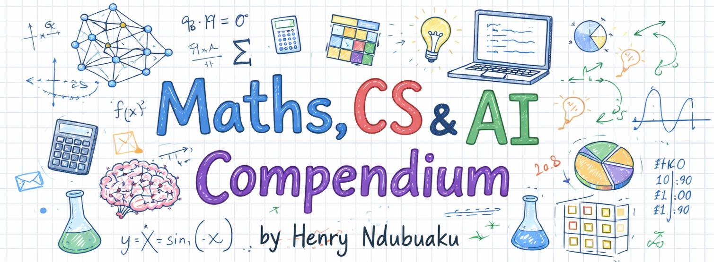

# Сборник по математике, CS и ИИ



**Читать онлайн**: [henryndubuaku.github.io/maths-cs-ai-compendium](https://henryndubuaku.github.io/maths-cs-ai-compendium/)

<a href="https://trendshift.io/repositories/21344?utm_source=repository-badge&amp;utm_medium=badge&amp;utm_campaign=badge-repository-21344" target="_blank" rel="noopener noreferrer"></a>

## Обзор
Большинство учебников скрывают хорошие идеи за плотными формулами, опускают интуитивное понимание, предполагают, что вы уже знаете половину материала, и быстро устаревают в таких динамичных областях, как ИИ. Это открытый, нетрадиционный учебник, охватывающий математику, вычислительную технику и искусственный интеллект с самых основ. Он написан для любознательных практиков, которые стремятся глубоко понять суть вещей, а не просто сдать экзамен или пройти собеседование.

## Предыстория
За последние годы работы в сфере ИИ/ML я заполнял блокноты, опираясь прежде всего на интуицию, реальный контекст и избегая поверхностных объяснений концепций математики, вычислений и ИИ. В 2025 году несколько моих друзей использовали эти заметки для подготовки к собеседованиям в DeepMind, OpenAI, Nvidia и другие компании. Все они успешно прошли отбор и сейчас показывают отличные результаты в своей работе. Тем временем я в прошлом году попал в Y Combinator. Поэтому я делюсь этими материалами со всеми.

## MCP-сервер
Этот репозиторий включает MCP-сервер, который позволяет любому ИИ-ассистенту (Claude Code, Cursor, VS Code и т. д.) использовать данный сборник в качестве базы знаний. Для этого требуется локальная копия репозитория. В комплекте идут инструменты для образовательных целей и примеры реализации.

## Содержание

| № | Глава | Краткое содержание | Статус |
|---|---------|---------|--------|
| 01 | [Векторы](chapter%2001%20-%20vectors/01.%20vector%20spaces.md) | Векторные пространства, величина, направление, нормы, метрики, скалярное и векторное произведения, внешнее произведение, базис, двойственность | Доступно |
| 02 | [Матрицы](chapter%2002%20-%20matrices/01.%20matrix%20properties.md) | Свойства, специальные типы, операции, линейные преобразования, разложения (LU, QR, SVD) | Доступно |
| 03 | [Математический анализ](chapter%2003%20-%20calculus/01.%20differential%20calculus.md) | Производные, интегралы, многомерный математический анализ, аппроксимация Тейлора, оптимизация и градиентный спуск | Доступно |
| 04 | [Статистика](chapter%2004%20-%20statistics/01.%20fundamentals.md) | Описательные меры, выборка, центральная предельная теорема, проверка гипотез, доверительные интервалы | Доступно |
| 05 | [Вероятность](chapter%2005%20-%20probability/01.%20counting.md) | Комбинаторика, условная вероятность, распределения, байесовские методы, теория информации | Доступно |
| 06 | [Машинное обучение](chapter%2006%20-%20machine%20learning/01.%20classical%20machine%20learning.md) | Классическое машинное обучение, градиентные методы, глубокое обучение, обучение с подкреплением, распределенное обучение | Доступно |
| 07 | [Компьютерная лингвистика](chapter%2007%20-%20computational%20linguistics/01.%20linguistic%20foundations.md) | Синтаксис, семантика, прагматика, NLP, языковые модели, рекуррентные нейронные сети, свёрточные нейронные сети, внимание, трансформеры, диффузия текста, распознавание текста (OCR), MoE, SSM, современные архитектуры LLM, оценка качества NLP | Доступно |
| 08 | [Компьютерное зрение](chapter%2008%20-%20computer%20vision/01.%20image%20fundamentals.md) | Обработка изображений, детекция объектов, сегментация, обработка видео, SLAM, свёрточные нейронные сети, vision-трансформеры, диффузия, flow matching, VR/AR | Доступно |
| 09 | [Аудио и речь](chapter%2009%20-%20audio%20and%20speech/01.%20digital%20signal%20processing.md) | Цифровая обработка сигналов (DSP), автоматическое распознавание речи (ASR), синтез речи (TTS), обнаружение голоса и акустической активности, диаризация, разделение источников, активное шумоподавление, WaveNet, Conformer | Доступно |
| 10 | [Мультимодальное обучение](chapter%2010%20-%20multimodal%20learning/01.%20multimodal%20representations.md) | Стратегии слияния, контрастивное обучение, CLIP, VLM, токенизация изображений/видео, кросс-модальная генерация, унифицированные архитектуры, мировые модели | Доступно |
| 11 | [Автономные системы](chapter%2011%20-%20autonomous%20systems/01.%20perception.md) | Восприятие, обучение роботов, VLA, беспилотные автомобили, космические роботы | Доступно |
| 12 | [Графовые нейронные сети](chapter%2012%20-%20graph%20neural%20networks/01.%20geometric%20deep%20learning.md) | Геометрическое глубокое обучение, теория графов, графовые нейронные сети, графовое внимание, графовые трансформеры, 3D эквивариантные сети | Доступно |
| 13 | [Вычисления и ОС](chapter%2013%20-%20computing%20and%20OS/01.%20discrete%20maths.md) | Дискретная математика, архитектура компьютеров, операционные системы, конкурентность, параллелизм, языки программирования | Доступно |
| 14 | [Структуры данных и алгоритмы](chapter%2014%20-%20data%20structures%20and%20algorithms/00.%20foundations.md) | Нотация Big O, рекурсия, поиск с возвратом, динамическое программирование, массивы, хеширование, связные списки, стеки, деревья, графы, сортировка, бинарный поиск | Доступно |
| 15 | [Промышленная разработка ПО](chapter%2015%20-%20production%20software%20engineering/01.%20linux%20and%20CMD.md) | Linux, Git, проектирование кодовой базы, тестирование, CI/CD, Docker, инференс моделей, MLOps, мониторинг, лучшие практики использования ИИ-агентов для кодинга | Доступно |
| 16 | [SIMD и GPU-программирование](chapter%2016%20-%20SIMD%20and%20GPU%20programming/00.%20why%20C%2B%2B%20and%20how%20ML%20frameworks%20work.md) | C++ для ML, принципы работы фреймворков, основы аппаратного обеспечения, ARM NEON/I8MM/SME2, x86 AVX, GPU/CUDA, Triton, TPU, RISC-V, Vulkan, WebGPU | Доступно |
| 17 | [ИИ-инференс](chapter%2017%20-%20AI%20inference/01.%20quantisation.md) | Квантование, эффективные архитектуры, обслуживание и батчинг, инференс на периферийных устройствах, спекулятивное декодирование, оптимизация затрат | Доступно |
| 18 | [Проектирование ML-систем](chapter%2018%20-%20ML%20systems%20design/01.%20systems%20design%20fundamentals.md) | Основы систем, облачные вычисления, распределенные системы, жизненный цикл ML, хранилища признаков, A/B-тестирование, примеры проектирования рекомендательных систем, поиска, рекламы и систем обнаружения мошенничества | Доступно |

## Предисловие

Мозг новорожденного — это только что инициализированная нейронная сеть, которая обучается на данных из реального мира и опыте вплоть до взрослой жизни... и так бесконечно. Исключительное знание французского языка с безупречным акцентом подразумевает правильное погружение в исключительную французскую среду и безупречный акцент. Точно так же выдающиеся исследователи и инженеры в области ИИ с отличными навыками решения задач — это результат усвоения качественных знаний и богатого опыта.

Эксперимент Кващева был долгосрочным сербским исследованием, показавшим, что интенсивное трехлетнее обучение творческому решению задач может значительно повысить интеллект, особенно подвижный интеллект, добавив 10–15 баллов IQ. Существует понятие естественного высокого IQ, подобно тому как качественная инициализация весов обеспечивает лучшее обучение, что подтверждается экспериментальными данными о влиянии природы и воспитания.

Однако единственное реальное преимущество человека с высоким IQ — это способность быстрее изучать и распознавать закономерности. Но использование повторяющихся паттернов делает абсолютно любую концепцию доступной для изучения. Чарльз Дарвин считался учителями и отцом очень средним, если не посредственным учеником. Он сам описывал себя как не слишком сообразительного, чувствуя себя «медленным процессором», которому требовалось время, чтобы усвоить данные.

В возрасте от 3 до 10 лет я хорошо учился, естественным образом схватывая концепции, не делая заметок и не повторяя материал. В период с 11 до 13 лет я стал самоуверенным и с таким подходом скатился в нижнюю половину класса из 80 человек. В 14–15 лет я начал учиться как обычный прилежный студент и закончил последний семестр средней школы первым. Ранняя школьная программа хорошо работает при естественном IQ, но реальные таланты подпитываются качественным потреблением знаний и интенсивностью их применения.

На самом деле большинство студентов, которые хорошо учатся, просто более прилежны, но академическая система спроектирована для тех, кто быстро усваивает материал. Этот сборник обеспечивает целостный и логически связанный поток знаний, чтобы облегчить обучение для «Дарвинов» нашего мира. Вам понадобятся только элементарная математика и основы программирования на Python, всё остальное придет в процессе — просто читайте и доверяйтесь методике!

## Как учиться лучше

В первом семестре университета я взял сразу 17 модулей, оценки были не самыми лучшими, поэтому я применил следующую технику:

**Фаза 1**: Кумулятивное чтение после занятий
Читайте каждый материал после лекции, перед сном. На следующей лекции начинайте всё сначала до текущего момента, а затем заполняйте пробелы в знаниях дополнительными исследованиями. Это позволяет вашему мозгу связать закономерности воедино.

**Фаза 2**: «Теневое» чтение перед экзаменами
Прочитайте каждый подзаголовок слайда или конспекта, закройте книгу, а затем визуализируйте и письменно объясните эту концепцию. Перечитывайте только то, что упустили, — это похоже на маскированное языковое моделирование (masked-language modelling) в машинном обучении. После повторного прочтения обязательно реализуйте концепцию в коде. Так вы развиваете мышечную память для каждой концепции.

Это отлично сработало для моих друзей, которые были не очень уверены в своих силах. Более того, одна из моих подруг обошла меня в модуле по продвинутой инженерной математике, где мы изучали матрицы Гессе (Hessians) и оптимизацию. Сегодня она работает в крупной нефтегазовой компании. Стремление души важнее, чем возможности тела, с которым мы работаем (эксперимент Розенталя).

## Кто такой Генри Ндубуаку?

Читайте профиль на GitHub!

## Цитирование
```bibtex
@book{ndubuaku2025compendium,
  title     = {Maths, CS & AI Compendium},
  author    = {Henry Ndubuaku},
  year      = {2026},
  publisher = {GitHub},
  url       = {https://github.com/HenryNdubuaku/maths-cs-ai-compendium}
}
```
