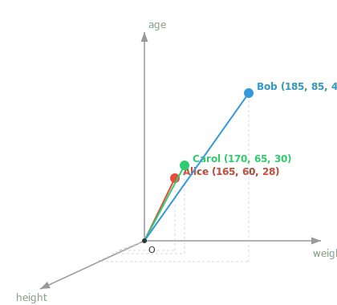
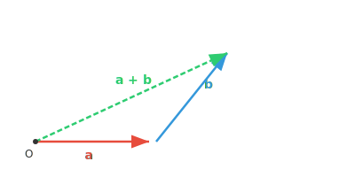
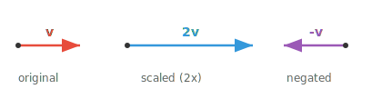
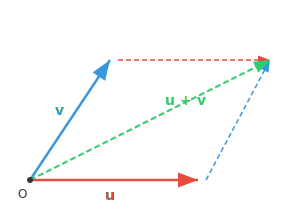
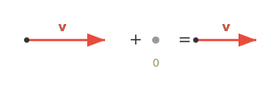

# 向量空间

*向量空间（vector space）是机器学习赖以生存的数学舞台。本文件涵盖向量加法、scalar 乘法、closure 公理、subspace，以及为什么 AI 中几乎所有东西都用向量来表示。*

- 可以把向量空间想象成一种特定的舞台，数学对象在其中生活，而每个对象都称为一个 **vector**。

- vector space 的形式化定义是：一个向量的集合，这些向量可以相加、可以一起被缩放，且结果仍留在该空间内。

- 一个有用的反例：整数集 $\mathbb{Z}$ **不是** 实数上的 vector space，因为把 $3$ 乘以 $0.5$ 得到 $1.5$，它已落在该集合之外。定义中“不离开该空间”这一条是真正起作用的要求。

- 在机器学习（ML）中，出于几何直觉，我们总把 vector 想象成 Euclidean 空间中的一个点，由其坐标表示。

- 向量 $\mathbf{a}$（数学上用小写粗体字母表示）有 $n$ 个坐标，每个代表沿某条轴的位置。

$$\mathbf{a} = [a_1, a_2, a_3]$$


- vector space 中的向量遵循一套非常明确且不可破坏的规则：

    - **向量加法（组合）**：
    你可以取任意两个 vector 并组合它们得到一个新的 vector。
    把 vector 想成移动的指令。
    如果 vector A 表示“向前走 3 步”，vector B 表示“向右走 2 步”，
    那么相加（A + B）就得到一条新的单一指令：“向前走 3 步并向右走 2 步。”

    - **Scalar 乘法（缩放）**：
    你可以取任意 vector，用一个普通数字（一个 scalar）来缩放它。
    你可以拉伸它、压缩它，或反转它。
    如果 vector A 是“向前走 3 步”，用 2 来缩放它就变成“向前走 6 步”。
    用 -1 来缩放则完全翻转方向，变成“向后走 3 步”。

- vector space 的 **dimension** 是它所包含的独立方向的数量。$\mathbb{R}^2$ 是 2 维的（需要 2 个坐标），而上面的 $\mathbf{a}$ 位于 $\mathbb{R}^3$ 中。

- 例如，我们可以把任意对象，比如一个人，表示为一个 vector，其中 $h_1$ = 身高（cm），$h_2$ = 体重（kg），$h_3$ = 年龄。

$$\mathbf{h} = [185, 75, 30]$$

- 我们现在就创造了一个 vector space，其中有一个表示人的向量。

- 我们可以表示多个人，并观察他们彼此之间有多近或多远！



- 我们可以加入更多特征，得到对人的丰富表示，这在 ML 中通常称为特征向量。

- 你拥有的独特且有意义的特征越多，这个特征向量就越具描述性，这是一个要记住的重要因素。

- 超过 3 维之后，向量变得很难直接目视检查，由此催生了一个数学分支——**Linear Algebra**。

- **Linear algebra** 研究的是向量、向量空间以及向量之间的映射。

- 我们在 AI/ML 中几乎把所有东西都表示为 vector，这使得 linear algebra 成为该领域的基石。

- 向量加法可以这样进行：把一个 vector 的尾放在另一个 vector 的头，然后从原点画到终点。



- 对于两个向量 $\mathbf{a} = (a_1, a_2)$ 和 $\mathbf{b} = (b_1, b_2)$：$\mathbf{a} + \mathbf{b} = (a_1 + b_1, a_2 + b_2)$

- 向量也可以相减，所有加法规则同样适用。

- 用 scalar 乘一个 vector，会在同一方向上按该因子缩放该向量。



- 对于 scalar $c$ 和 vector $\mathbf{v} = (v_1, v_2)$：$c\mathbf{v} = (cv_1, cv_2)$

- **加法 closure**：如果把 vector space 中任意两个 vector 相加，结果也是同一空间内的 vector：若 $\mathbf{u} \in V$ 且 $\mathbf{v} \in V$，则 $\mathbf{u} + \mathbf{v} \in V$

- **Scalar 乘法 closure**：如果用 scalar 乘 vector space 中的任意 vector，结果仍是该空间内的 vector：若 $\mathbf{v} \in V$ 且 $c \in F$，则 $c\mathbf{v} \in V$

- **加法的交换律**：对任意两个 vector $\mathbf{u}$ 和 $\mathbf{v}$：$\mathbf{u} + \mathbf{v} = \mathbf{v} + \mathbf{u}$



- 穿过平行四边形的两条路径到达同一点。

- **（零向量）**：存在一个 vector $\mathbf{0}$，使得对任意 vector $\mathbf{v}$：$\mathbf{v} + \mathbf{0} = \mathbf{v}$



- **加法逆元**：对每个 vector $\mathbf{v}$，存在一个 vector $-\mathbf{v}$ 使得：$\mathbf{v} + (-\mathbf{v}) = \mathbf{0}$


- **分配律 1**：对任意 scalar $c$ 和向量 $\mathbf{u}$、$\mathbf{v}$：$c(\mathbf{u} + \mathbf{v}) = c\mathbf{u} + c\mathbf{v}$


- 对和进行缩放（金）得到的结果，与对缩放后的向量求和相同。

- **分配律 2**：对任意 scalar $c$、$d$ 和 vector $\mathbf{v}$：$(c + d)\mathbf{v} = c\mathbf{v} + d\mathbf{v}$

- **结合律**：对任意 scalar $c$、$d$ 和 vector $\mathbf{v}$：$(cd)\mathbf{v} = c(d\mathbf{v})$

- **单位元**：对任意 vector $\mathbf{v}$：$1\mathbf{v} = \mathbf{v}$，其中 $1$ 是 scalar 域中的乘法单位元。

- 一些 vector space 的例子：

    - **$\mathbb{R}^n$（n 维空间）**：n 维空间中的所有实数，例如向量 [1,4,3000...第 n 个]，把两个点相加或缩放其中一个，你仍会落在该空间中的某处。

    - **灰度图像**：一张 $28 \times 28$ 的图像就是 784 个像素强度，即 $\mathbb{R}^{784}$ 中的一个 vector。两张图像相加（混合）或缩放一张（提亮）得到相同尺寸的另一张图像。

    - **音频信号**：一段以 44.1kHz 采样 1 秒的片段是一个有 44,100 个分量的 vector。把两段片段混合就是向量加法。

    - **多项式**：两个多项式相加或用一个数缩放一个多项式仍得到一个多项式，所以它们也构成一个 vector space。向量不一定非得长得像箭头！

- **subspace** 只是更大舞台里的一个小舞台。把 3D 空间想象成一个房间。穿过房间中心的一张平摊的纸就是一个 subspace，穿过中心的一根直导线也是。

- 关键要求是 subspace 必须穿过原点。如果你把那张纸偏离中心，它就不再是 subspace，因为零向量已不再落在它上面。


- vector space 的所有规则（加法、缩放、closure）在 subspace 内部仍然成立。你可以在其中加或缩放向量，而永远不会“掉”到更大的空间中去。

- 一条过原点的直线是 1 维 subspace，一张过原点的平面是 2 维 subspace，而整个空间本身也是自身的 subspace。

- 在 ML 中，subspace 自然出现。高维数据通常具有生活在更低维 subspace 上的结构。像 PCA 这样的技术会找到那个 subspace，使我们能更高效地处理数据。

## 编程任务（使用 CoLab 或 notebook）

1. 运行下面的代码验证分配律性质，然后修改并尝试测试其他规则！
```python
import jax.numpy as jnp

u = jnp.array([1, 2])
v = jnp.array([3, 0])
c = 2

lhs = c * (u + v)
rhs = c*u + c*v

print(f"LHS: {lhs}")
print(f"RHS: {rhs}")
```

2. 运行下面的代码可视化不同向量，然后修改不同坐标的值，以理解每条轴如何影响位置。
```python
import jax.numpy as jnp
import matplotlib.pyplot as plt

# 试着改变这些向量！
a = jnp.array([3, 2, 4])
b = jnp.array([1, 4, 2])
c = jnp.array([4, 1, 3])

fig = plt.figure()
ax = fig.add_subplot(111, projection="3d")

for vec, name, color in [(a, "a", "red"), (b, "b", "blue"), (c, "c", "green")]:
    ax.quiver(0, 0, 0, *vec, color=color, arrow_length_ratio=0.1, linewidth=2, label=name)

lim = int(jnp.abs(jnp.stack([a, b, c])).max()) + 1
ax.set_xlim([0, lim]); ax.set_ylim([0, lim]); ax.set_zlim([0, lim])
ax.set_xlabel("X"); ax.set_ylabel("Y"); ax.set_zlabel("Z")
ax.legend()
plt.show()
```

## 支线任务（一些需要了解的数学符号）

| 符号 | 含义 | 示例 |
|---|---|---|
| ∈ | 属于 | x ∈ A：x 在集合 A 中 |
| ∉ | 不属于 | x ∉ A |
| ⊂ | 是真子集 | A ⊂ B |
| ⊆ | 是子集或相等 | A ⊆ B |
| ∪ | 并集 | A ∪ B：在 A 或 B 中的元素 |
| ∩ | 交集 | A ∩ B：同时在 A 和 B 中的元素 |
| ∅ | 空集 | A = ∅ |
| ℝ | 实数 | x ∈ ℝ |
| ℤ | 整数 | -2, -1, 0, 1, 2 |
| ℕ | 自然数 | 1, 2, 3, ... |
| ℚ | 有理数 | 像 1/2 这样的分数 |
| ⇒ | 蕴含 | x > 2 ⇒ x > 1 |
| ⇔ | 当且仅当 | x = 2 ⇔ x² = 4，附加条件下成立 |
| ∀ | 对所有 | ∀x ∈ ℝ |
| ∃ | 存在 | ∃x 使得 x² = 4 |
| ¬ | 非 | ¬P：非 P |
| ∧ | 与 | P ∧ Q |
| ∨ | 或 | P ∨ Q |
| ∴ | 因此 | x = 2，∴ x² = 4 |
