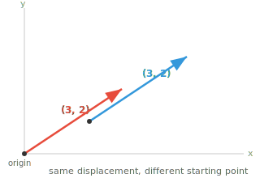
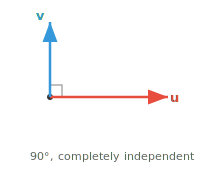

# 向量性质

*向量性质描述了定义向量行为的几何与代数特征。本文件涵盖 magnitude、direction、unit vector、相等、平行、orthogonal，以及 linear independence，这些是每个 ML 特征空间的基石。*

- 向量的 **magnitude**（或长度）告诉你它延伸 *有多远*。把它想象成箭头的长度。对于向量 $\mathbf{a} = (a_1, a_2, a_3)$，其 magnitude 为：

$$\|\mathbf{a}\| = \sqrt{a_1^2 + a_2^2 + a_3^2}$$

- 这只是 Pythagorean 定理在更高维度上的推广，衡量从原点到该点的直线距离。

- 向量的 **direction** 告诉你它指向 *哪里*；只需想象一条从原点到该坐标点的直线。

- 当未显式指定原点时，我们通常暗指 $(0,0,...0)$，即中心点，至少用于可视化时如此。

- 位置不重要，始终关乎的是位移：从原点画的向量 $(3, 2)$ 与从另一点画的同一个 $(3, 2)$ 仍然相等。



- 两个向量可以长度相同但指向完全不同的方向，也可以指向同一方向但长度不同。


- 当且仅当两个向量所有对应分量都匹配时，它们才 **相等**；长度相同、方向相同、是完全相同的箭头。

$$\mathbf{a} = \mathbf{b} \iff a_i = b_i \text{ for all } i$$

- 如果一个 vector 是另一个的 scalar 倍数，则两者 **平行**。它们沿同一条直线，方向可以相同也可以完全相反。

$$\mathbf{a} \parallel \mathbf{b} \iff \mathbf{a} = k\mathbf{b} \text{ for some scalar } k \neq 0$$


- 若 $k > 0$，它们同向。若 $k < 0$，它们反向。无论哪种，它们都位于过原点的同一条直线上。

- 直观上，平行向量不带任何“新”的方向信息。一个只是另一个的拉伸或翻转版本。

- 当两个向量指向完全独立的方向时，它们是 **orthogonal**（perpendicular）的。沿其中一个方向移动，在另一个方向上零进展。



- 想象先向北走再向东走，这两个方向是 orthogonal 的，无论向北走多少都不会让你向东移动哪怕一点。我们会经常遇到 orthogonality。

- Orthogonality 对 ML 至关重要：orthogonal 的特征携带完全独立的信息，这对表示来说是理想的。

- 更一般地，任意两个向量之间有一个 **夹角** $\theta$，取值范围是 $0°$ 到 $180°$。

- 这个角度捕捉了两个方向之间的全部关系：$0°$ 表示平行（同向），$180°$ 表示平行（反向），$90°$ 表示 orthogonal。介于其间的都是某种混合。

- ML 中大多数向量关系都处在这个谱系的某处。后面我们会看到精确的工具（dot product、cosine similarity）来计算这个角度。

- 如果一组向量中至少有一个能由其他向量通过缩放和相加得到，则这组向量是 **linearly dependent** 的。它对该集合不带任何新信息。

- 例如，若 $\mathbf{c} = 2\mathbf{a} + 3\mathbf{b}$，则 $\mathbf{c}$ 是冗余的，你通过 $\mathbf{a}$ 和 $\mathbf{b}$ 已经拥有了 $\mathbf{c}$ 所提供的一切。

- 平行向量总是 linearly dependent 的，因为一个只是另一个的缩放副本。任何包含零向量的集合也是 linearly dependent 的。

- 如果一组向量中没有任何一个能由其他向量构造，则它们是 **linearly independent** 的。每一个都贡献一个真正的新方向。Orthogonal 向量总是 linearly independent 的。

- 一些直觉：如果你想研究不同的人并把它们表示为向量，linearly dependent 的向量（人）会使观察偏向被过采样数据点，这是设计 AI 训练数据集时的重要因素。

- 在 2D 中，两个 linearly independent 的向量可以到达平面上的任意点。在 3D 中则需要三个。“需要多少个独立向量”这一想法直接对应 dimension。

- 当一个向量的大多数分量为零时，它是 **稀疏的**。相反，大多数分量非零时，称为 **稠密的**。

$$\mathbf{s} = [0, 0, 3, 0, 0, 0, 1, 0, 0, 0]$$

- 稀疏性之所以重要，是因为它影响存储和计算。稀疏向量只需记录非零项，就能以高得多的效率存储和处理。

- **unit vector** 是 magnitude 恰为 1 的向量。它纯粹表示一个方向，不包含长度信息。把任意向量除以其 magnitude，就能把它变成 unit vector：

$$\hat{\mathbf{a}} = \frac{\mathbf{a}}{\|\mathbf{a}\|}$$

- 这个过程称为 **归一化**。它去掉“有多远”，只保留“朝哪边”，这在机器学习中很重要。

- 标准单位向量沿各轴指向：$\hat{\mathbf{i}} = (1, 0, 0)$、$\hat{\mathbf{j}} = (0, 1, 0)$、$\hat{\mathbf{k}} = (0, 0, 1)$。任意向量都可写成它们的组合，例如 $(3, 2, 4) = 3\hat{\mathbf{i}} + 2\hat{\mathbf{j}} + 4\hat{\mathbf{k}}$。

## 编程任务（使用 CoLab 或 notebook）

1. 计算一个向量的 magnitude 并验证其符合 Pythagorean 定理，然后修改以计算 unit vector。
```python
import jax.numpy as jnp

a = jnp.array([3.0, 4.0])

magnitude = jnp.sqrt(jnp.sum(a ** 2))
print(f"Magnitude of a: {magnitude}") 
```

2. 通过测试一个向量是否是另一个的 scalar 倍数，来判断两个向量是否平行。
```python
import jax.numpy as jnp

a = jnp.array([2, 4, 6])
b = jnp.array([1, 2, 3])

ratios = a / b
print(f"Ratios: {ratios}")
print(f"Parallel: {jnp.allclose(ratios, ratios[0])}")
```
