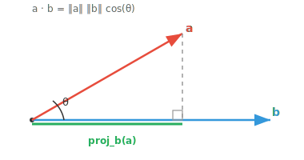

# 向量乘积

*向量乘积是衡量相似度与计算 projection 的基本运算。本文件涵盖 inner product、dot product、cosine similarity、cross product 和 outer product，这些运算支撑着 AI 中的 attention 机制、embedding 和几何推理。*

- 我们已经看到如何把向量相加和缩放。但我们能把两个向量 *相乘* 吗？事实证明不止有一种做法，每种都回答不同的问题。

- **inner product** 是最一般的概念：一个接收两个向量、产生单个数字（一个 scalar）的函数。它是“乘”向量的抽象蓝图。

- 任何 inner product 都必须满足三条规则：

    - **正定性**：$\langle \mathbf{v}, \mathbf{v} \rangle \geq 0$，且仅对零向量等于零。一个向量与自身相乘总得到非负结果。

    - **对称性**：$\langle \mathbf{u}, \mathbf{v} \rangle = \langle \mathbf{v}, \mathbf{u} \rangle$。顺序无关紧要。

    - **线性性**：$\langle a\mathbf{u} + b\mathbf{v}, \mathbf{w} \rangle = a\langle \mathbf{u}, \mathbf{w} \rangle + b\langle \mathbf{v}, \mathbf{w} \rangle$。它对加法和缩放可分配。

- **dot product** 是最常见的 inner product。它是你几乎到处都会用到的具体版本。对于两个向量 $\mathbf{a} = (a_1, a_2, \ldots, a_n)$ 和 $\mathbf{b} = (b_1, b_2, \ldots, b_n)$：

$$\mathbf{a} \cdot \mathbf{b} = a_1 b_1 + a_2 b_2 + \cdots + a_n b_n$$

- 把对应分量相乘，再把所有结果加起来。仅此而已。

- 但这个数字 *意味着* 什么？dot product 有一个优美的几何解释：

$$\mathbf{a} \cdot \mathbf{b} = \|\mathbf{a}\| \, \|\mathbf{b}\| \cos(\theta)$$



- 这把 dot product 与两个向量之间的夹角 $\theta$ 直接联系起来。结果告诉你两个向量在方向上“一致”了多少。

- 若它们同向（$\theta = 0°$），$\cos(\theta) = 1$，dot product 达到最大。

- 若它们 orthogonal（$\theta = 90°$），$\cos(\theta) = 0$，dot product 恰为零。这给了我们一个精确的 orthogonality 判据。

- 若它们反向（$\theta = 180°$），$\cos(\theta) = -1$，dot product 为负。

- 一个向量与自身做 dot product 得到其 magnitude 的平方：$\mathbf{a} \cdot \mathbf{a} = \|\mathbf{a}\|^2$。

- dot product 还给我们 **projection**，即一个向量在另一个上投下的影子。$\mathbf{a}$ 在 $\mathbf{b}$ 上的 projection 为：

$$\text{proj}_{\mathbf{b}}(\mathbf{a}) = \frac{\mathbf{a} \cdot \mathbf{b}}{\|\mathbf{b}\|^2} \, \mathbf{b}$$

- 想象一束光从正上方照到 $\mathbf{b}$ 上。$\mathbf{a}$ 在那条直线上的影子就是 projection。它告诉你 $\mathbf{a}$ 在 $\mathbf{b}$ 方向上落了多少。

- **Cosine similarity** 通过除以两个 magnitude 把 dot product 归一化：

$$\cos(\theta) = \frac{\mathbf{a} \cdot \mathbf{b}}{\|\mathbf{a}\| \, \|\mathbf{b}\|}$$

- 这给出一个介于 $-1$ 和 $1$ 之间的值，衡量方向对齐程度，而忽略向量的长度。它在 ML 中被广泛用于比较文档、embedding 和用户偏好之类的事物。

- 现在，dot product 取两个向量返回一个 scalar。**cross product** 则相反，它取两个向量返回一个 *新向量*。

- cross product $\mathbf{a} \times \mathbf{b}$ 产生一个同时 perpendicular 于 $\mathbf{a}$ 和 $\mathbf{b}$ 的向量：

$$\mathbf{a} \times \mathbf{b} = (a_2 b_3 - a_3 b_2, \; a_3 b_1 - a_1 b_3, \; a_1 b_2 - a_2 b_1)$$

- cross product 只在 3D 中有效。dot product 在任意维度都成立，而 cross product 是三维空间所特有的。

- 它的 magnitude 等于两个向量张成的平行四边形的面积：

$$\|\mathbf{a} \times \mathbf{b}\| = \|\mathbf{a}\| \, \|\mathbf{b}\| \sin(\theta)$$

- 注意规律：dot product 用 $\cos(\theta)$，cross product 用 $\sin(\theta)$。dot product 衡量两个向量对齐了多少，cross product 衡量它们方向上 *差异* 了多少。

- 结果的方向遵循 **右手法则**：把右手手指从 $\mathbf{a}$ 向 $\mathbf{b}$ 弯曲，拇指所指方向即为 $\mathbf{a} \times \mathbf{b}$ 的方向。

- 与 dot product 不同，cross product **不可交换**：$\mathbf{a} \times \mathbf{b} = -(\mathbf{b} \times \mathbf{a})$。交换顺序会翻转方向。

- 若两个向量平行，它们的 cross product 是零向量（因为 $\sin(0°) = 0$）。没有面积，也没有 perpendicular 方向。

- 当用两种乘积组合三个向量时会怎样？这就得到 **三重积**。

- **scalar 三重积** $\mathbf{a} \cdot (\mathbf{b} \times \mathbf{c})$ 先取两个向量的 cross product，再与第三个做 dot product。输出是一个数，等于三个向量张成的平行六面体（一个倾斜的 3D 盒子）的体积。

- 如果 scalar 三重积为零，则三个向量 **共面**，它们都落在同一个平面里，不形成体积。

- 顺序可以轮换而结果不变：$\mathbf{a} \cdot (\mathbf{b} \times \mathbf{c}) = \mathbf{b} \cdot (\mathbf{c} \times \mathbf{a}) = \mathbf{c} \cdot (\mathbf{a} \times \mathbf{b})$。

- **向量三重积** $\mathbf{a} \times (\mathbf{b} \times \mathbf{c})$ 应用两次 cross product 并返回一个向量。它用恒等式整洁地展开为：

$$\mathbf{a} \times (\mathbf{b} \times \mathbf{c}) = (\mathbf{a} \cdot \mathbf{c})\mathbf{b} - (\mathbf{a} \cdot \mathbf{b})\mathbf{c}$$

- 结果总落在 $\mathbf{b}$ 和 $\mathbf{c}$ 张成的平面内。注意 cross product **不满足结合律**：$\mathbf{a} \times (\mathbf{b} \times \mathbf{c}) \neq (\mathbf{a} \times \mathbf{b}) \times \mathbf{c}$。

## 编程任务（使用 CoLab 或 notebook）

1. 计算两个向量的 dot product，并用它求它们之间的夹角。尝试让它们 orthogonal、平行或反向，观察夹角如何变化。
```python
import jax.numpy as jnp

a = jnp.array([1.0, 2.0, 3.0])
b = jnp.array([4.0, -1.0, 2.0])

dot = jnp.dot(a, b)
angle = jnp.arccos(dot / (jnp.linalg.norm(a) * jnp.linalg.norm(b)))

print(f"Dot product: {dot}")
print(f"Angle: {jnp.degrees(angle):.1f}°")
```

2. 计算两个 3D 向量的 cross product，并通过检查它与每个原始向量的 dot product 为零来验证结果同时 perpendicular 于两者。
```python
import jax.numpy as jnp

a = jnp.array([1.0, 0.0, 0.0])
b = jnp.array([0.0, 1.0, 0.0])

cross = jnp.cross(a, b)

print(f"a x b = {cross}")
print(f"Perpendicular to a: {jnp.dot(cross, a) == 0}")
print(f"Perpendicular to b: {jnp.dot(cross, b) == 0}")
```
