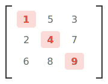
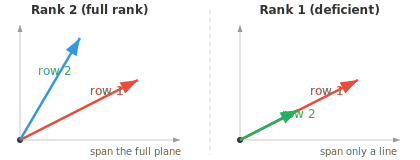
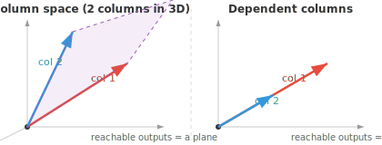

# 矩阵性质

*matrix 是存储数据集、编码变换并定义每个神经网络层的数据结构。本文件涵盖 matrix 的维度、元素、transpose、trace、determinant、inverse、rank 与 null space，这些是贯穿 linear algebra 与 ML 的基础性质。*

- 从根本上说，一个 **matrix** 是按行列排列的数字构成的矩形网格。如果 vector 是一列数字，那么 matrix 就是一摞向量。

```math
A = \begin{bmatrix} 1 & 2 & 3 \\ 4 & 5 & 6 \end{bmatrix}
```

- 如果一个人用向量 $[\text{age}, \text{height}, \text{weight}]$ 描述，那么三个人就构成一个 matrix，每一行是一个人：

```math
\begin{bmatrix} 25 & 170 & 65 \\ 30 & 180 & 80 \\ 22 & 160 & 55 \end{bmatrix}
```

- 这个 matrix 有 3 行 3 列，所以我们称之为 $3 \times 3$ matrix。

- 网格中的每个数都称为一个 **元素** 或 **entry**，由其行列位置标识：$A_{ij}$ 是第 $i$ 行、第 $j$ 列的元素。

- matrix 的 **transpose** 沿其主对角线翻转它，把行变成列、列变成行。若 $A$ 是 $m \times n$，则 $A^T$ 是 $n \times m$。

```math
A = \begin{bmatrix} 1 & 2 & 3 \\ 4 & 5 & 6 \end{bmatrix} \quad \Rightarrow \quad A^T = \begin{bmatrix} 1 & 4 \\ 2 & 5 \\ 3 & 6 \end{bmatrix}
```

- 一个 matrix 乘以它的 transpose 总得到方阵：$AA^T$ 是 $m \times m$，$A^TA$ 是 $n \times n$。

- 方阵的 **trace** 是其主对角线元素之和：$\text{tr}(A) = A_{11} + A_{22} + \cdots + A_{nn}$。trace 等于 eigenvalue 之和（后面会看到）。



- 对于上面的 matrix，$\text{tr}(A) = 1 + 4 + 9 = 14$。只有高亮的主对角线起作用。

- 如果两个 matrix 在不同 basis 下表示同一个 linear transformation，它们的 trace 会相同。trace 是“与 basis 无关”的。

- matrix 的 **rank** 是 linearly independent 的行（等价地，列）的个数。它告诉你该 matrix 携带多少“有用信息”。

- 例如，下面的 matrix rank 为 2，因为两行互不为倍数：

```math
\begin{bmatrix} 1 & 2 \\ 3 & 4 \end{bmatrix}
```

而这个 matrix rank 为 1，因为第二行只是第一行的两倍，不带来新信息：

```math
\begin{bmatrix} 1 & 2 \\ 2 & 4 \end{bmatrix}
```

- 一个 $5 \times 3$ matrix 的 rank 至多为 3。如果某些行只是其他行的缩放或组合，rank 就会下降。具有最大可能 rank 的 matrix 称为 **满秩（full rank）**。



- 一个方阵可逆（有 inverse）当且仅当它是 full rank。

- rank 通过 **秩-零化度定理** 与 **null space**（被 matrix 映射到零的向量集合）相联系：$\text{rank}(A) + \text{nullity}(A) = \text{number of columns of } A$。matrix 保留的（rank）加上它销毁的（nullity）等于总 dimension。

- matrix 的 **column space** 是用任意向量与之相乘后所有可能输出的集合。它由该 matrix 的各列张成。如果一个 matrix 有 3 列但只有 2 列独立，那么 column space 是一个 2D 平面，而非整个 3D 空间。



- **row space** 是同样的想法但从行的角度看。rank 等于 column space 和 row space 各自的 dimension，所以二者总是一致。

- column space 告诉你“这个 matrix 能产生什么输出？”，null space 告诉你“哪些输入会被映射到零？”。这两个空间完整地描述了 matrix 做什么。

- 方阵的 **determinant** 是一个单一的数，刻画了 matrix 如何缩放空间。把一个 $2 \times 2$ matrix 想成把单位正方形变成平行四边形。determinant 就是那个平行四边形的面积（带符号）。

```math
\det\begin{bmatrix} a & b \\ c & d \end{bmatrix} = ad - bc
```


- 例如：

```math
\det\begin{bmatrix} 2 & 1 \\ 0 & 3 \end{bmatrix} = 2 \cdot 3 - 1 \cdot 0 = 6
```

该变换把单位正方形拉伸成面积为 6 的平行四边形。

- 若 determinant 为正，该变换保持朝向（东西没被“翻转”）。若为负，则翻转朝向（像镜面反射）。若为零，matrix 把空间压扁到更低 dimension，把平行四边形塌缩成一条线或一个点。

- determinant 为零的 matrix 称为 **奇异（singular）**。它没有 inverse，且信息已永久丢失。

- 对于大于 $2 \times 2$ 的 matrix，determinant 通过 **minor** 和 **cofactor** 计算。**minor** $M_{ij}$ 是删去第 $i$ 行和第 $j$ 列后所得较小 matrix 的 determinant。


- **cofactor** $C_{ij} = (-1)^{i+j} M_{ij}$ 给每个 minor 附上一个符号（像棋盘一样交替：$+, -, +, \ldots$）。整个 matrix 的 determinant 就是沿任一行或列求和：$\det(A) = \sum_j A_{1j} \cdot C_{1j}$。这称为 **cofactor 展开**。

- 方阵 $A$ 的 **inverse**，记作 $A^{-1}$，是撤销 $A$ 所做事的那个 matrix：$AA^{-1} = A^{-1}A = I$（单位矩阵）。只有非奇异 matrix 才有 inverse。

- 对于 $2 \times 2$ matrix，inverse 有直接公式：

```math
\begin{bmatrix} a & b \\ c & d \end{bmatrix}^{-1} = \frac{1}{ad - bc}\begin{bmatrix} d & -b \\ -c & a \end{bmatrix}
```

注意分母中的 determinant，这就是奇异 matrix（determinant 为零）没有 inverse 的原因。

- **条件数** 衡量一个 matrix 对输入的小变化有多敏感。它定义为 $\kappa(A) = \|A\| \cdot \|A^{-1}\|$。

- 条件数接近 1 意味着该 matrix **良态**：输入小变化产生输出小变化。条件数大意味着它 **病态**：微小误差被极大放大。orthogonal matrix 和单位矩阵条件数为 1，而奇异 matrix 条件数为无穷。

- 例如，下面的 matrix 条件数为 $10^8$。一个方向被正常缩放，另一个方向则几乎被压扁为零，因此沿该方向的小扰动被严重扭曲：

```math
\begin{bmatrix} 1 & 0 \\ 0 & 10^{-8} \end{bmatrix}
```

- 就像向量有 norm（长度）一样，matrix 也有衡量其“大小”的 **norm**。最常见的是 **Frobenius norm**，它把 matrix 当成一个长向量并计算其长度：

```math
\|A\|_F = \sqrt{\sum_{i}\sum_{j} A_{ij}^2}
```

- 例如：

```math
\left\|\begin{bmatrix} 1 & 2 \\ 3 & 4 \end{bmatrix}\right\|_F = \sqrt{1 + 4 + 9 + 16} = \sqrt{30} \approx 5.48
```

- **谱范数** $\|A\|_2$ 是 $A$ 的最大奇异值。它衡量 matrix 能把任意 unit vector 最多拉伸多少。在 ML 中，matrix norm 用于权重正则化（惩罚过大的权重）和监控训练稳定性。

- 对称 matrix $A$ 如果对每个非零向量 $\mathbf{x}$ 都有 $\mathbf{x}^T A \mathbf{x} > 0$，就称为 **正定（positive definite）**。这个二次型总产生正数。

- 例如，下面的 matrix 是 positive definite：

```math
A = \begin{bmatrix} 2 & 1 \\ 1 & 3 \end{bmatrix}
```

任取向量，比如 $\mathbf{x} = [1, -1]^T$：$\mathbf{x}^T A \mathbf{x} = 2 - 1 - 1 + 3 = 3 > 0$。无论试哪个非零 $\mathbf{x}$，总得到正结果。

- positive definite matrix 之所以重要，是因为它们保证优化问题有唯一的最小值。

- 如果把条件放宽为 $\mathbf{x}^T A \mathbf{x} \geq 0$（允许零），该 matrix 就是 **半正定（positive semi-definite, PSD）**。PSD matrix 屡见不鲜：协方差矩阵、SVM 中的核矩阵、以及局部极小处的 Hessian 都是 PSD。区别在于 PSD 允许某些方向“平坦”（零曲率）而不是严格向上弯曲。

## 编程任务（使用 CoLab 或 notebook）

1. 计算一个 matrix 的 trace、rank 和 determinant。试着让一行成为另一行的倍数，看看 rank 和 determinant 如何变化。
```python
import jax.numpy as jnp

A = jnp.array([[1.0, 2.0],
               [3.0, 4.0]])

print(f"Trace: {jnp.trace(A)}")
print(f"Rank: {jnp.linalg.matrix_rank(A)}")
print(f"Determinant: {jnp.linalg.det(A):.2f}")
```

2. 计算一个 matrix 的 inverse，把它与原 matrix 相乘，并验证得到单位矩阵。然后试一个奇异 matrix，看看会发生什么。
```python
import jax.numpy as jnp

A = jnp.array([[1.0, 2.0],
               [3.0, 4.0]])

A_inv = jnp.linalg.inv(A)
print(f"A * A_inv:\n{A @ A_inv}")
```
