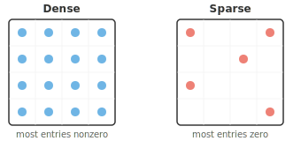
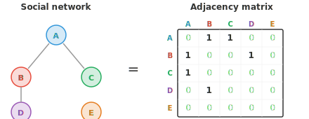

# Типы матриц

*Специальные матричные структуры открывают путь к вычислительным упрощениям и математическим гарантиям. В этом файле рассматриваются единичные, диагональные, симметричные, треугольные, ортогональные, положительно определенные, разреженные и стохастические матрицы — типы, которые встречаются при оценке ковариации, в алгоритмах на графах, регуляризации и цепях Маркова.*

- Не все матрицы одинаковы. Различные структуры придают матрицам особые свойства, которые делают вычисления с ними быстрее, а их анализ — проще, или и то, и другое. Ниже приведены типы, с которыми вы будете сталкиваться чаще всего.

- **Квадратная матрица** имеет одинаковое количество строк и столбцов ($n \times n$). Большинство интересных свойств (определитель, собственные значения, обратная матрица) применимы только к квадратным матрицам.

- **Единичная матрица** $I$ — это квадратная матрица с единицами на главной диагонали и нулями во всех остальных позициях. Это преобразование, которое «ничего не делает»: $AI = IA = A$ для любой совместимой матрицы $A$.

```math
I = \begin{bmatrix} 1 & 0 & 0 \\ 0 & 1 & 0 \\ 0 & 0 & 1 \end{bmatrix}
```

- **Нулевая матрица** $O$ имеет все элементы, равные нулю. Она отображает любой вектор в нулевой вектор, уничтожая всю информацию.

- **Диагональная матрица** содержит только нули вне главной диагонали. Умножение вектора на диагональную матрицу просто масштабирует каждый компонент независимо, что делает эту операцию очень эффективной.

```math
D = \begin{bmatrix} 3 & 0 \\ 0 & 7 \end{bmatrix}
```

- **Симметричная матрица** равна своей транспонированной матрице: $A = A^T$, что означает $A_{ij} = A_{ji}$. Симметричные матрицы обладают особым свойством: их собственные векторы всегда перпендикулярны друг другу. Ковариационные матрицы всегда симметричны.

```math
S = \begin{bmatrix} 3 & -1 \\ -1 & 6 \end{bmatrix}
```

- **Треугольная матрица** имеет все нули по одну сторону от диагонали. **Нижнетреугольная** имеет нули выше диагонали, **верхнетреугольная** — ниже. Они необходимы для эффективного решения систем уравнений методом прямой или обратной подстановки.

```math
L = \begin{bmatrix} 2 & 0 & 0 \\ 1 & 3 & 0 \\ -1 & 2 & 4 \end{bmatrix} \qquad U = \begin{bmatrix} 5 & -1 & 2 \\ 0 & 1 & 3 \\ 0 & 0 & -2 \end{bmatrix}
```

- Определитель треугольной матрицы равен просто произведению элементов её диагонали.

- **Ортогональная матрица** обладает тем свойством, что её транспонированная матрица равна обратной: $Q^TQ = QQ^T = I$.

- Это означает, что вы можете «отменить» преобразование простым транспонированием, что вычислительно дешево. Её столбцы ортонормированы (имеют единичную длину и взаимно перпендикулярны).

- **Разреженная матрица** имеет большинство элементов, равных нулю, в то время как **плотная матрица** имеет большинство ненулевых элементов.



- На практике многие матрицы из реального мира чрезвычайно разрежены.

- Социальную сеть с миллионом пользователей можно представить как матрицу $10^6 \times 10^6$, но каждый человек связан лишь с небольшим числом других людей, поэтому почти все элементы равны нулю.



- **Матрица перестановок** получается путем перестановки строк единичной матрицы. Умножение на неё переставляет элементы вектора. Каждая строка и каждый столбец содержат ровно одну единицу, а остальные элементы — нули.

- Например, матрица ниже перемещает элемент 3 в позицию 1, элемент 1 в позицию 2, а элемент 2 в позицию 3:

```math
P = \begin{bmatrix} 0 & 0 & 1 \\ 1 & 0 & 0 \\ 0 & 1 & 0 \end{bmatrix}
```

- **Матрица Тёплица** имеет одинаковые значения вдоль каждой диагонали (сверху слева вниз направо). Обратите внимание, как каждая диагональ постоянна:

```math
T = \begin{bmatrix} a & b & c \\ d & a & b \\ e & d & a \end{bmatrix}
```

- Эта структура встречается в обработке сигналов и свёртке, поскольку скольжение фиксированного фильтра по сигналу эквивалентно умножению на матрицу Тёплица.

- **Циркулянтная матрица** — это особая матрица Тёплица, где каждая строка является циклическим сдвигом предыдущей. Когда строка доходит до конца, она переносится в начало:

```math
C = \begin{bmatrix} 1 & 3 & 2 \\ 2 & 1 & 3 \\ 3 & 2 & 1 \end{bmatrix}
```

- Циркулянтные матрицы тесно связаны с дискретным преобразованием Фурье (ДПФ) и играют центральную роль в том, как работает циклическая свёртка.

- **Эрмитова матрица** — это комплексный аналог симметричной матрицы: $A = A^\ast$ (где $A^\ast$ — сопряженно-транспонированная матрица).

- Для матриц с вещественными значениями эрмитовость и симметричность — это одно и то же. Вы встретите их в квантовых вычислениях и обработке сигналов.

- **Унитарная матрица** — это комплексный аналог ортогональной матрицы: $U^\ast U = UU^\ast = I$. Подобно тому, как ортогональные матрицы сохраняют длины в вещественных пространствах, унитарные матрицы сохраняют длины в комплексных пространствах.

- **Идемпотентная матрица** удовлетворяет условию $A^2 = A$. Применение преобразования дважды равносильно его однократному применению, что делает такую матрицу **проектором**. После того как вы выполнили проекцию, повторное проецирование ничего не меняет.

- **Нильпотентная матрица** удовлетворяет условию $A^k = O$ (нулевая матрица) для некоторой степени $k$. Примените преобразование достаточное количество раз, и всё схлопнется в ноль. Например:

```math
\begin{bmatrix} 0 & 1 \\ 0 & 0 \end{bmatrix}^2 = \begin{bmatrix} 0 & 0 \\ 0 & 0 \end{bmatrix}
```

- **Булева матрица** (или бинарная матрица) содержит только 0 и 1. Она представляет отношения типа «да/нет». Например, в графе с 3 узлами **матрица смежности** фиксирует, какие узлы соединены:

```math
B = \begin{bmatrix} 0 & 1 & 1 \\ 1 & 0 & 0 \\ 1 & 0 & 0 \end{bmatrix}
```

- Здесь узел 1 соединен с узлами 2 и 3, но узлы 2 и 3 не соединены друг с другом.

- **Матрица Вандермонда** строится из последовательных степеней набора значений. Для заданных значений $x_1, x_2, x_3$:

```math
V = \begin{bmatrix} 1 & x_1 & x_1^2 \\ 1 & x_2 & x_2^2 \\ 1 & x_3 & x_3^2 \end{bmatrix}
```

- Эта структура встречается в полиномиальной интерполяции: поиске единственного полинома, проходящего через заданный набор точек.

- **Матрица Хессенберга** «почти» треугольная, с нулями ниже первой поддиагонали:

```math
H = \begin{bmatrix} 4 & 2 & 1 \\ 3 & 5 & -1 \\ 0 & 1 & 6 \end{bmatrix}
```

- Это полезная промежуточная форма для эффективного вычисления собственных значений. Предварительное приведение матрицы к форме Хессенберга позволяет итерационным алгоритмам сходиться быстрее.

## Задачи по программированию (используйте CoLab или ноутбук)

1. Создайте ортогональную матрицу (матрицу поворота), умножьте её на транспонированную и убедитесь, что в результате получается единичная матрица. Попробуйте разные углы.
```python
import jax.numpy as jnp

theta = jnp.pi / 4
Q = jnp.array([[jnp.cos(theta), -jnp.sin(theta)],
               [jnp.sin(theta),  jnp.cos(theta)]])

print(f"Q @ Q.T:\n{Q @ Q.T}")
print(f"Determinant: {jnp.linalg.det(Q):.2f}")
```

2. Создайте симметричную матрицу и убедитесь, что она равна своей транспонированной матрице. Затем вычислите её собственные значения и проверьте, что собственные векторы перпендикулярны.
```python
import jax.numpy as jnp

S = jnp.array([[4.0, 2.0],
               [2.0, 3.0]])

print(f"Symmetric: {jnp.allclose(S, S.T)}")

eigenvalues, eigenvectors = jnp.linalg.eigh(S)
print(f"Eigenvalues: {eigenvalues}")
print(f"Dot product of eigenvectors: {jnp.dot(eigenvectors[:, 0], eigenvectors[:, 1]):.6f}")
```
