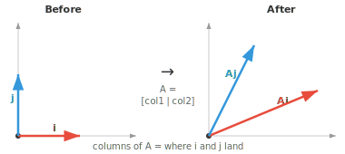
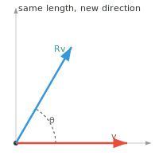
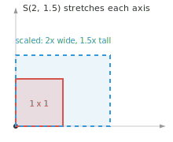
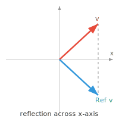
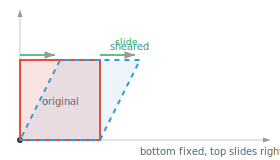

# Линейные преобразования

*Любое умножение матрицы на вектор является линейным преобразованием — функцией, которая изменяет форму, поворачивает или проецирует векторы, сохраняя при этом линейность. В этом файле рассматриваются поворот, отражение, масштабирование, сдвиг, проекция, ядро и образ отображения, а также то, как слои нейронной сети объединяют эти преобразования в цепочки.*

- **Линейное преобразование** (или линейное отображение) — это функция, которая принимает вектор и выдает другой вектор, сохраняя при этом операции сложения и умножения на скаляр. Если $T$ — линейное преобразование, то:

    - $T(\mathbf{u} + \mathbf{v}) = T(\mathbf{u}) + T(\mathbf{v})$
    - $T(c\mathbf{u}) = cT(\mathbf{u})$

- Любое линейное преобразование можно представить как умножение на матрицу. Матрица *и есть* само преобразование. Умножая вектор на матрицу, вы применяете к нему линейное преобразование.

- Представьте матрицу $2 \times 2$ как механизм, который принимает на вход 2D-векторы и выдает новые 2D-векторы. Столбцы матрицы показывают, куда попадают стандартные базисные векторы $\hat{\mathbf{i}}$ и $\hat{\mathbf{j}}$ после преобразования. Все остальное следует из линейности.



- Например, если

```math
A = \begin{bmatrix} 2 & 1 \\ 1 & 2 \end{bmatrix}
```

  то $\hat{\mathbf{i}} = [1, 0]^T$ попадает в $[2, 1]^T$ (первый столбец), а $\hat{\mathbf{j}} = [0, 1]^T$ попадает в $[1, 2]^T$ (второй столбец). Любой другой вектор является линейной комбинацией этих двух, поэтому его результат вычисляется автоматически.

- Умножение двух матриц можно рассматривать как последовательное применение одного преобразования за другим. Если $B$ преобразует векторы из одного пространства, а $A$ преобразует результат, то $AB$ выполняет оба действия по порядку. В игровом движке поворот персонажа, а затем его перемещение вперед дает иной результат, чем перемещение, а затем поворот, поэтому умножение матриц некоммутативно.

- **Поворот** разворачивает векторы на угол $\theta$, не меняя их длину. Вектор сохраняет свой размер, просто меняется его направление.



- В 2D матрица поворота имеет вид:

```math
R(\theta) = \begin{bmatrix} \cos\theta & -\sin\theta \\ \sin\theta & \cos\theta \end{bmatrix}
```

- Для $\theta = 90°$:

```math
R = \begin{bmatrix} 0 & -1 \\ 1 & 0 \end{bmatrix}
```

  таким образом, $[1, 0]^T$ превращается в $[0, 1]^T$. Вектор, направленный вправо, теперь направлен вверх. Матрицы поворота являются ортогональными и всегда имеют определитель, равный 1. Когда вы поворачиваете фотографию на телефоне, к координатам каждого пикселя применяется именно эта матрица.

- В 3D существуют отдельные матрицы поворота для каждой оси. Роботизированная рука поворачивает каждый сустав вокруг определенной оси, и каждый сустав соответствует одной матрице поворота. Поворот вокруг оси z выглядит как 2D-случай, встроенный в 3D:

```math
R_z(\theta) = \begin{bmatrix} \cos\theta & -\sin\theta & 0 \\ \sin\theta & \cos\theta & 0 \\ 0 & 0 & 1 \end{bmatrix}
```

- **Масштабирование** растягивает или сжимает векторы вдоль каждой оси независимо:

```math
S(s_x, s_y) = \begin{bmatrix} s_x & 0 \\ 0 & s_y \end{bmatrix}
```



- $S(2, 1.5)$ удваивает x-компоненту и умножает y-компоненту на 1.5. Масштабирование на $-1$ вдоль оси отражает эту компоненту. Диагональная матрица всегда является преобразованием масштабирования. Когда вы изменяете размер изображения до 50%, вы применяете $S(0.5, 0.5)$ к координатам каждого пикселя.

- **Отражение** переворачивает векторы относительно оси или прямой, подобно зеркалу. Отражение относительно оси x сохраняет x-компоненту и меняет знак y-компоненты:

```math
\text{Ref}_x = \begin{bmatrix} 1 & 0 \\ 0 & -1 \end{bmatrix}
```



- Например, $[3, 2]^T$ превращается в $[3, -2]^T$. Когда ваш телефон зеркально отражает селфи, чтобы текст читался правильно, он применяет матрицу отражения. Отражение относительно прямой $y = x$ меняет компоненты местами:

```math
\text{Ref}_{y=x} = \begin{bmatrix} 0 & 1 \\ 1 & 0 \end{bmatrix}
```

- Матрицы отражения имеют определитель $-1$, что подтверждает изменение ориентации.

- Повороты и отражения являются **жесткими преобразованиями**: они сохраняют расстояния и углы. Матрицы, представляющие их, являются ортогональными, поэтому ортогональные матрицы всегда имеют определитель $+1$ (поворот) или $-1$ (отражение).

- **Сдвиг** (shear) перекашивает векторы вдоль одной оси пропорционально другой. Горизонтальный сдвиг с коэффициентом $k$:

```math
\text{Sh}_x(k) = \begin{bmatrix} 1 & k \\ 0 & 1 \end{bmatrix}
```



- Каждая точка сдвигается по горизонтали на величину, равную $k$, умноженному на её высоту. При $k = 0.5$ точка на высоте 2 смещается вправо на 1. Нижний ряд остается на месте, верхний ряд сдвигается. Именно так работает курсив: прямые буквы сдвигаются так, что наклоняются вправо.

- Все вышеперечисленное (поворот, масштабирование, отражение, сдвиг) — это **линейные** преобразования. Они оставляют начало координат неподвижным и сохраняют прямые линии. Но как насчет **параллельного переноса** (сдвига всего на фиксированную величину)?

- Параллельный перенос *не является* линейным преобразованием, потому что он перемещает начало координат. Если вы сдвинете каждую точку вправо на 3, нулевой вектор переместится в $[3, 0]^T$, нарушая линейность. Чтобы справиться с этим, мы используем **аффинное преобразование**, которое объединяет линейное преобразование с параллельным переносом:

$$\mathbf{y} = A\mathbf{x} + \mathbf{t}$$

- Чтобы представить это как единое умножение матрицы, мы используем **однородные координаты**: добавляем дополнительную единицу к каждому вектору и используем матрицу $(n+1) \times (n+1)$:

```math
\begin{bmatrix} A & \mathbf{t} \\ \mathbf{0}^T & 1 \end{bmatrix} \begin{bmatrix} \mathbf{x} \\ 1 \end{bmatrix} = \begin{bmatrix} A\mathbf{x} + \mathbf{t} \\ 1 \end{bmatrix}
```

- Аффинные преобразования сохраняют прямые линии и параллельность, но не обязательно углы или длины. Каждый объект в видеоигре позиционируется с помощью аффинных преобразований: его поворачивают, масштабируют, а затем размещают в нужном месте — и все это закодировано в одной матрице.

- **Вырожденное преобразование** (сингулярная матрица) «схлопывает» пространство в меньшую размерность.

- Например, матрица

```math
\begin{bmatrix} 1 & 2 \\ 2 & 4 \end{bmatrix}
```

  отображает каждый двумерный вектор на одну прямую, поскольку оба столбца указывают в одном направлении. Определитель равен нулю, информация теряется, и такое преобразование невозможно обратить.

- Преобразование цветного изображения (3 значения на пиксель: красный, зеленый, синий) в полутоновое (1 значение на пиксель) является вырожденным преобразованием: информация о цвете утрачивается безвозвратно.

- В машинном обучении линейные преобразования составляют основу нейронных сетей; данные представляются в виде матрицы (стека векторов, представляющих признаки объекта, такие как люди, самолеты, текст, изображения... что угодно!).

- Каждый слой применяет матричное умножение (линейное преобразование); подробности приведены в других главах, нам же нужно объяснить, как структурировать эти данные и дать надлежащую мотивацию для использования нейронных сетей.

- Тем не менее, наиболее используемые сегодня методы зачастую почти исключительно пропускают данные через последовательность линейных преобразований; мы называем их **трансформерами**.

- Gemini, ChatGPT, Claude, Qwen, DeepSeek и лучшие на сегодняшний день модели ИИ в мире — это трансформеры!

## Задачи по программированию (используйте CoLab или ноутбук)

1. Примените матрицу поворота к вектору и постройте график исходного и повернутого векторов. Попробуйте разные углы.
```python
import jax.numpy as jnp
import matplotlib.pyplot as plt

theta = jnp.pi / 3
R = jnp.array([[jnp.cos(theta), -jnp.sin(theta)],
               [jnp.sin(theta),  jnp.cos(theta)]])

v = jnp.array([1.0, 0.0])
v_rot = R @ v

plt.figure(figsize=(5, 5))
plt.quiver(0, 0, v[0], v[1], angles='xy', scale_units='xy', scale=1, color='red', label='original')
plt.quiver(0, 0, v_rot[0], v_rot[1], angles='xy', scale_units='xy', scale=1, color='blue', label='rotated')
plt.xlim(-1.5, 1.5); plt.ylim(-1.5, 1.5)
plt.grid(True); plt.legend(); plt.gca().set_aspect('equal')
plt.show()
```

2. Примените преобразование сдвига (shearing) к набору точек, образующих квадрат, и визуализируйте деформированную фигуру.
```python
import jax.numpy as jnp
import matplotlib.pyplot as plt

square = jnp.array([[0,0],[1,0],[1,1],[0,1],[0,0]]).T

k = 0.5
shear = jnp.array([[1, k],
                    [0, 1]])
sheared = shear @ square

plt.figure(figsize=(6, 4))
plt.plot(square[0], square[1], 'r-o', label='original')
plt.plot(sheared[0], sheared[1], 'b-o', label='sheared')
plt.grid(True); plt.legend(); plt.gca().set_aspect('equal')
plt.show()
```
