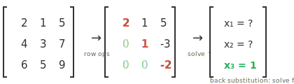
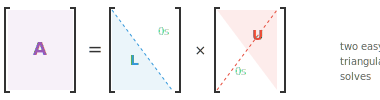
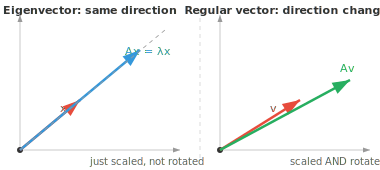
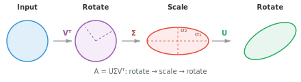
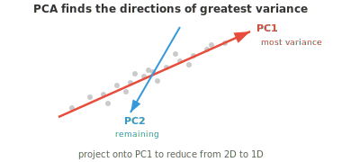

# 矩阵分解

*matrix 分解把复杂 matrix 拆成更简单的因子，用于求解方程组、计算 inverse 和压缩数据。本文件涵盖 Gaussian 消元、LU、QR、Cholesky、eigendecomposition 和 SVD，这些算法是 PCA、推荐系统和 ML 数值稳定性背后的引擎。*

- matrix 分解（或因式分解）把一个 matrix 拆成更易处理的若干片。可以把它想成因式分解一个数：$12 = 3 \times 4$ 比单独的 12 更易推理。

- 我们分解 matrix 是为了更快地求解方程组、稳定地计算 inverse、寻找 eigenvalue、压缩数据，以及理解变换的几何。

- 最基础的技术是 **Gaussian 消元**（行变换）。思路很简单：给定方程组 $A\mathbf{x} = \mathbf{b}$，用三种允许的运算化简 $A$，直到答案显而易见。

- 这三种运算是：交换两行、用一个非零 scalar 乘一行、把一行的倍数加到另一行。

- 例如，为消去主元下方第一列，从下面各行减去 row 1 的若干倍：

```math
\begin{bmatrix} 2 & 1 & 5 \\ 4 & 3 & 7 \\ 6 & 5 & 9 \end{bmatrix} \xrightarrow{R_2 - 2R_1} \begin{bmatrix} 2 & 1 & 5 \\ 0 & 1 & -3 \\ 6 & 5 & 9 \end{bmatrix} \xrightarrow{R_3 - 3R_1} \begin{bmatrix} 2 & 1 & 5 \\ 0 & 1 & -3 \\ 0 & 2 & -6 \end{bmatrix}
```

- 目标是 **行阶梯形（row echelon form, REF）**：每个主元（每行第一个非零项）下方全为零，且每个主元位于上方主元的右侧。matrix 变成阶梯形。



- 进一步到 **简化行阶梯形（reduced row echelon form, RREF）**，让每个主元等于 1 且成为其所在列的唯一非零项。每个 matrix 都有唯一的 RREF。

- 一旦得到三角形式，我们用 **回代** 求解：底行直接给出最后一个变量，再向上推进。

- 这是所有其他分解所建立的基础，分解的目标就是把 matrix 化为三角形式，以便回代求出变量。

- **LU 分解** 把 Gaussian 消元形式化，把方阵分解为 $A = LU$（或带行交换的 $A = PLU$），其中 $L$ 是下三角、$U$ 是上三角。



- 求解 $A\mathbf{x} = \mathbf{b}$：先用前代法解 $L\mathbf{y} = \mathbf{b}$（自上而下），再用回代法解 $U\mathbf{x} = \mathbf{y}$（自下而上）。两个简单的三角求解代替一个困难的普通求解。

- 相对原始 Gaussian 消元，它的优势在于复用。一旦有了 $L$ 和 $U$，你就可以为许多不同的 $\mathbf{b}$ 向量求解，而不必重新分解。

- 如果你需要对同一个方程组用 1000 个不同的右端项求解（仿真中常见），你分解一次然后复用。

- 当一个 matrix 对称且 positive definite（比如协方差矩阵）时，我们可以做得更好。

- **Cholesky 分解** 把它分解为 $A = LL^T$，其中 $L$ 是下三角。例如：

```math
\begin{bmatrix} 4 & 2 \\ 2 & 5 \end{bmatrix} = \begin{bmatrix} 2 & 0 \\ 1 & 2 \end{bmatrix} \begin{bmatrix} 2 & 1 \\ 0 & 2 \end{bmatrix}
```

- 它大约比 LU 快两倍，且数值上保证稳定。可以把它看成 matrix 的“平方根”。

- 如果分解失败（平方根下出现负值），说明该 matrix 不是 positive definite。因此 Cholesky 同时也是 positive definite 性的检验。

- 方阵 $A$ 的 **eigenvector** 是那些变换只拉伸或压缩、不旋转的特定方向。**eigenvalue** 是缩放因子：

$$A\mathbf{x} = \lambda\mathbf{x}$$



- 大多数向量被 matrix 乘后改变方向。但 eigenvector 很特殊：输出与输入同方向，只是被 $\lambda$ 缩放。若 $\lambda = 2$，eigenvector 长度加倍。若 $\lambda = -1$，方向翻转。若 $\lambda = 0$，它被压扁为零。

- 例如，对

```math
A = \begin{bmatrix} 3 & 1 \\ 0 & 2 \end{bmatrix}
```

  向量 $[1, 0]^T$ 是一个 eigenvector，$\lambda = 3$，因为 $A[1, 0]^T = [3, 0]^T = 3[1, 0]^T$。

- 求 eigenvalue 时，解 **特征多项式** $\det(A - \lambda I) = 0$。其根就是 eigenvalue。再把每个 $\lambda$ 代回 $(A - \lambda I)\mathbf{x} = \mathbf{0}$ 求对应的 eigenvector。

- 关键性质：

    - $A$ 的 trace 等于其 eigenvalue 之和。
    - $A$ 的 determinant 等于其 eigenvalue 之积。
    - 对称矩阵的 eigenvector 互相 perpendicular，且 eigenvalue 为实数。
    - positive definite matrix 的 eigenvalue 全为正。
    - 协方差矩阵（我们会在统计学中遇到）总是 positive semi-definite。

- 通过特征多项式计算 eigenvalue 对大 matrix 不切实际。实践中用迭代方法：

    - **幂迭代**：反复乘以 $A$ 并归一化。收敛到主 eigenvector（最大 eigenvalue）。简单但只能找到一个特征对。

    - **QR 算法**：主力方法。反复用 QR 分解进行分解和重组，直到 matrix 收敛为三角形式，eigenvalue 就在对角线上显露。

    - **逆迭代**：找到最接近给定目标值的 eigenvector。当你大致知道想要哪个 eigenvalue 时很有用。

    - 对大型稀疏 matrix，**Arnoldi** 和 **Lanczos** 迭代利用稀疏性提升效率。

- 如果一个方阵有完整的一组 linearly independent eigenvector，它就可以被 **对角化**：$A = PDP^{-1}$，其中 $D$ 是由 eigenvalue 组成的对角矩阵，$P$ 的各列是 eigenvector。

- 为什么有用？对角矩阵处理起来极其简单。需要 $A^{100}$？与其把 $A$ 自乘 100 次，不如计算 $PD^{100}P^{-1}$，而对角矩阵求幂只是各元素独立求幂。这把昂贵运算变成廉价运算。

- **特征基** 是完全由 eigenvector 构成的 basis。在这个 basis 下，matrix 变成对角矩阵，变换只是沿每个 eigenvector 方向的独立缩放。这就像为该变换找到了自然的坐标系。

- **QR 分解** 把任意 matrix $A$ 分解为 $A = QR$，其中 $Q$ 是 orthogonal 矩阵（各列 orthonormal），$R$ 是上三角。可以把它想成把“方向”信息（$Q$）与“缩放和混合”信息（$R$）分离开来。

- **Gram-Schmidt 过程** 逐列构造 $Q$。取 $A$ 的第一列并归一化。取第二列，减去它在第一列上的 projection（使之 perpendicular），再归一化。对每一列重复。结果是一组 orthonormal 向量。

- QR 分解是求 eigenvalue 的 QR 算法的引擎。它也直接用于最小二乘问题：当 $A\mathbf{x} = \mathbf{b}$ 无精确解（方程多于未知数）时，QR 找到最佳近似解。

- **SVD**（奇异值分解）是最一般、也可以说最重要的分解。每个 matrix（任意形状、任意 rank）都有 SVD：$A = U\Sigma V^T$

    - $V^T$（$n \times n$，orthogonal）：旋转输入
    - $\Sigma$（$m \times n$，对角）：沿 orthogonal 轴缩放（奇异值，非负，降序排列）
    - $U$（$m \times m$，orthogonal）：旋转输出



- 几何上，SVD 说的是：每个 linear transformation，无论多复杂，都只是一次旋转、接着沿轴的拉伸、再接着一次旋转。圆变成椭圆。

- 奇异值（$\sigma_1 \geq \sigma_2 \geq \ldots$）揭示每个方向的“重要性”。大的奇异值对应最重要的方向。$A$ 的 rank 等于非零奇异值的个数。

- **低秩近似**：只保留最大的 $k$ 个奇异值、其余置零，就得到 $A$ 的最佳 rank-$k$ 近似。这就是图像压缩的原理：一张 $1000 \times 1000$ 的图像可能只需 $k = 50$ 个奇异值就几乎看不出差别，压缩了 20 倍。

- SVD 还提供伪逆：$A^+ = V\Sigma^+U^T$，其中 $\Sigma^+$ 把非零奇异值取倒数。

- 虽然 eigendecomposition 只对方阵成立，SVD 对任意 matrix 都成立。这是它的关键优势。

- **PCA**（主成分分析）用 eigendecomposition（或 SVD）进行降维。

- 想象一个数据集，每个样本有 100 个特征（dim 为 100 的向量堆叠成一个 matrix）。其中许多特征是相关且冗余的。

- PCA 找出数据真正变化的方向，让你只保留重要的部分。



- 第一主成分（PC1）是方差最大的方向。

- 第二主成分（PC2）捕捉剩余之中最多的方差，并与第一个 perpendicular。

- 如果大多数方差只落在少数几个方向上，你就可以把数据投影到这些 dimension，丢弃其余，损失极小。

- 步骤：

    - 对数据标准化（减均值、除以标准差），使所有特征贡献相当
    - 计算协方差矩阵
    - 求其 eigenvalue 和 eigenvector
    - 选出 eigenvalue 最大的 $k$ 个 eigenvector（即主成分）
    - 把数据投影到这些成分上

- 标准化至关重要：否则用公里度量的特征会压倒用厘米度量的特征，而不管实际重要性如何。

- 实践中，PCA 用于可视化（把高维数据投影到 2D 或 3D）、降噪（丢弃主要是噪声的低方差方向），以及通过减少输入特征数量来加速 ML 模型。

- **核 PCA（Kernel PCA）** 把 PCA 推广到非线性关系。它通过核函数把数据映射到更高维空间，在其中结构变得线性，再应用标准 PCA 并投影回去。

- **Schur 分解** 把方阵分解为 $A = QTQ^\ast$，其中 $Q$ 是酉矩阵，$T$ 是上三角。每个方阵都有 Schur 分解，即使它不能被对角化。

- **非负矩阵分解（Non-negative Matrix Factorisation, NMF）** 把一个 matrix 分解为两个非负 matrix：$A \approx WH$，其中 $W$ 和 $H$ 的所有元素都 $\geq 0$。与可能产生负项的 SVD 不同，NMF 只加不减。这使各部分可解释：在主题建模中，$W$ 给出每个文档的主题权重，$H$ 给出每个主题的词权重，全为非负，恰好对应我们对“一个文档包含多少各主题”的直觉。

- **谱定理** 指出对称（或 Hermitian）矩阵总能用 orthogonal（或酉）矩阵对角化。其 eigenvalue 总为实数，eigenvector 总互相 perpendicular。这是 PCA 背后的理论基础。

## 编程任务（使用 CoLab 或 notebook）

1. 计算一个对称矩阵的 eigenvalue 和 eigenvector。验证 eigenvector 互相 perpendicular，并用 eigendecomposition 重构该 matrix。
```python
import jax.numpy as jnp

A = jnp.array([[4.0, 2.0],
               [2.0, 3.0]])

eigenvalues, eigenvectors = jnp.linalg.eigh(A)
print(f"Eigenvalues: {eigenvalues}")
print(f"Eigenvectors orthogonal: {jnp.dot(eigenvectors[:,0], eigenvectors[:,1]):.6f}")

# 重构：A = P D P^T
D = jnp.diag(eigenvalues)
A_reconstructed = eigenvectors @ D @ eigenvectors.T
print(f"Reconstruction matches: {jnp.allclose(A, A_reconstructed)}")
```

2. 实现幂迭代找最大 eigenvalue，以及逆迭代找最小 eigenvalue。与 `jnp.linalg.eigh` 比较。然后尝试自己实现 QR 算法。
```python
import jax.numpy as jnp

A = jnp.array([[4.0, 2.0],
               [2.0, 3.0]])

# 幂迭代：找最大 eigenvalue
v = jnp.array([1.0, 0.0])
for _ in range(20):
    v = A @ v
    v = v / jnp.linalg.norm(v)
print(f"Largest eigenvalue:  {v @ A @ v:.4f}")

# 逆迭代：改为乘 A^{-1}，找最小 eigenvalue
v = jnp.array([1.0, 0.0])
for _ in range(20):
    v = jnp.linalg.solve(A, v)
    v = v / jnp.linalg.norm(v)
print(f"Smallest eigenvalue: {1.0 / (v @ jnp.linalg.solve(A, v)):.4f}")

print(f"jnp.linalg.eigh:    {jnp.linalg.eigh(A)[0]}")
```

3. 计算一个 matrix 的 SVD，然后只用前 k 个奇异值重构，并观察近似质量如何随 k 变化。
```python
import jax.numpy as jnp

A = jnp.array([[1.0, 2.0, 3.0],
               [4.0, 5.0, 6.0],
               [7.0, 8.0, 9.0]])

U, S, Vt = jnp.linalg.svd(A)

for k in [1, 2, 3]:
    approx = U[:, :k] @ jnp.diag(S[:k]) @ Vt[:k, :]
    error = jnp.linalg.norm(A - approx)
    print(f"k={k}, reconstruction error: {error:.4f}")
```
