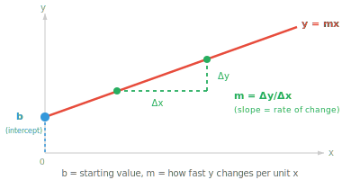
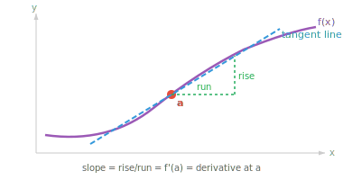
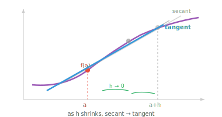

# 微分学

*微分学刻画瞬时变化率。本文件涵盖 limit（极限）、derivative（导数）、求导法则、chain rule（链式法则，反向传播的基础），以及 ML 中常用的导数。*

- 在前几章中，我们学习了如何用向量表示数据并用矩阵进行变换。但许多现实世界中的现象并非静止不变。汽车在加速、股价在波动、神经网络的 loss 随权重更新而变化。**微积分**就是研究变化的数学。

- 微积分回答两个问题：此刻某物变化得多快？（微分学）以及随着时间累积了多少？（积分学）。本部分处理"多快"这个问题。

- 想象你在开车时瞥一眼速度表，读数是 60 km/h。这个数字并非整段旅程的平均速度，而是此刻瞬间的速度。微分学给了我们计算这类瞬时变化率的工具。

- 但首先，让我们回顾一下直线方程：$y = mx + b$。

- 这是两个量之间最简单的关系。

    - $b$ 是 **y 轴截距**，即直线与 y 轴相交的位置（当 $x = 0$ 时的起始值）。
    - $m$ 是 **斜率**，即变化率：$x$ 每增加 1 个单位，$y$ 改变 $m$。
- 如果 $m = 3$，直线陡峭上升；如果 $m = 0$，直线水平；如果 $m = -2$，直线下降。

- 斜率计算为 $m = \frac{\Delta y}{\Delta x} = \frac{y_2 - y_1}{x_2 - x_1}$，即"$y$ 变化了多少"与"$x$ 变化了多少"的比值。



- 一旦知道 $m$ 和 $b$，就可以对任意 $x$ 计算出 $y$。

- 例如，若 $m = 2$ 且 $b = 3$，则在 $x = 5$ 处：$y = 2(5) + 3 = 13$。

- 这两个参数完全确定了一条直线，预测任何输出只需代入即可。

- 对于直线，斜率处处相同。

- 这一思想可以推广到直线以外。任何函数都是把输入映射到输出的规则，一旦知道其公式（参数和形状），就可以对任意输入计算输出并绘图。

- $y = x^2$ 给出抛物线，$y = \sin(x)$ 给出波形，$y = e^x$ 给出指数增长。每个公式定义了一条特定的曲线，把函数读成一种形状是理解后续所有内容的关键。

- 对于直线，斜率处处相同。但大多数有意义的函数都是曲线，因此斜率随点的不同而变化。微积分给了我们求曲线上任意一点斜率的方法。

- 我们还需要 **limit（极限）**的概念。limit 描述了当输入越来越接近某个目标值时，函数所趋近的值，但不一定要真正到达该值。

$$\lim_{x \to a} f(x) = L$$

- 读作："当 $x$ 趋近于 $a$ 时，$f(x)$ 趋近于 $L$。" 函数在 $x = a$ 处并不需要真正等于 $L$，只需任意接近即可。

- 例如，取 $f(x) = \frac{x^2 - 1}{x - 1}$。如果直接代入 $x = 1$，会得到 $\frac{0}{0}$，无定义。

- 但试试接近 1 的值：$f(0.9) = 1.9$，$f(0.99) = 1.99$，$f(1.01) = 2.01$。输出明显趋向 2。

- 从代数上可以看出原因：把分子因式分解为 $(x-1)(x+1)$，约去 $(x-1)$ 项，得到对所有 $x \neq 1$ 都有 $f(x) = x + 1$。所以当 $x \to 1$ 时，$f(x) \to 2$。

- 函数在 $x = 1$ 处有一个空洞，但 limit 仍然存在。

- limit 是微积分中其他一切内容赖以建立的基础。

- 函数 $f(x)$ 在点 $x = a$ 处的 **derivative（导数）**衡量瞬时变化率。几何上，它是曲线在该点处切线的斜率。



- 要计算这个斜率，我们从曲线上的两个点出发，计算过这两点的直线（**割线**）的斜率。然后把第二个点越来越靠近第一个点，观察割线斜率趋近于什么。这就是 **差商**：

$$f'(a) = \lim_{h \to 0} \frac{f(a + h) - f(a)}{h}$$



- 分子 $f(a+h) - f(a)$ 是输出的变化量。分母 $h$ 是输入的变化量。它们的比值是一个极小区间上的平均变化率。当 $h \to 0$ 时，这个平均值就变成瞬时变化率。

- 例如，令 $f(x) = x^2$。在 $x = 3$ 处：

$$f'(3) = \lim_{h \to 0} \frac{(3+h)^2 - 9}{h} = \lim_{h \to 0} \frac{9 + 6h + h^2 - 9}{h} = \lim_{h \to 0} (6 + h) = 6$$

- 所以在 $x = 3$ 处，函数 $x^2$ 以每单位输入 6 单位输出的速率增长。

- 如果该 limit 存在，则函数在该点 **可微**。为此，函数必须是连续的（没有跳跃）、光滑的（没有尖角），并在该点附近有定义。

- 如果你能不抬笔、不拐折地画出曲线，那么它在那里很可能是可微的。

- 每次都从 limit 定义来计算导数会很繁琐。幸好，少数几条法则就能让我们快速地对几乎任何函数求导。

- **常数法则**：常数的导数为零。若 $f(x) = 5$，则 $f'(x) = 0$。水平线斜率为零。

- **幂法则**：求导的主力。把指数降下来并减一：

$$\frac{d}{dx} x^n = n x^{n-1}$$

- 例如：$\frac{d}{dx} x^3 = 3x^2$。三次函数变成了二次函数。这对任何实数指数都成立，包括负数和分数：$\frac{d}{dx} x^{-1} = -x^{-2}$ 以及 $\frac{d}{dx} \sqrt{x} = \frac{d}{dx} x^{1/2} = \frac{1}{2}x^{-1/2}$。

- **和差法则**：逐项求导。

$$\frac{d}{dx}[f(x) \pm g(x)] = f'(x) \pm g'(x)$$

- **乘积法则**：当两个函数相乘时，导数并非两者导数的乘积。而是：

$$\frac{d}{dx}[f(x) \cdot g(x)] = f'(x)g(x) + f(x)g'(x)$$

- 可以这样记："第一个的变化率乘以第二个，加上第一个乘以第二个的变化率。" 例如，$\frac{d}{dx}[x^2 \sin x] = 2x \sin x + x^2 \cos x$。

- **商法则**：对于函数之比：

$$\frac{d}{dx}\left[\frac{f(x)}{g(x)}\right] = \frac{f'(x)g(x) - f(x)g'(x)}{[g(x)]^2}$$

- 一个有用的口诀："下乘上导减上乘下导，除以下面的平方。"

- **chain rule（链式法则）**：ML 中最重要的法则。当函数复合时（一个套在另一个里），导数是链上各导数的乘积：

$$\frac{d}{dx} f(g(x)) = f'(g(x)) \cdot g'(x)$$

- 可以想象成剥洋葱。先对 outer 函数求导（保持 inner 函数不动），再乘以 inner 函数的导数。


- 例如，$\frac{d}{dx} (3x + 1)^5 = 5(3x+1)^4 \cdot 3 = 15(3x+1)^4$。outer 函数是 $(\cdot)^5$，inner 是 $3x+1$。

- chain rule 是神经网络中 **反向传播** 的数学基础。一个深度网络就是一长串复合函数。要计算 loss 相对于每个权重的变化，我们从输出层反向到输入层反复应用 chain rule，在每一步乘以局部导数。

- 以下是你将遇到的最常见的导数。每一个都可以从 limit 定义推导出来，但熟记它们能节省时间：

| 函数 | 导数 | 说明 |
|---|---|---|
| $e^x$ | $e^x$ | 唯一等于自身导数的函数 |
| $a^x$ | $a^x \ln a$ | 指数的推广 |
| $\ln x$ | $\frac{1}{x}$ | 自然对数 |
| $\log_a x$ | $\frac{1}{x \ln a}$ | 一般对数 |
| $\sin x$ | $\cos x$ | |
| $\cos x$ | $-\sin x$ | 注意负号 |
| $\tan x$ | $\sec^2 x$ | |

- 指数函数 $e^x$ 非常特别：它是唯一等于自身导数的函数。这就是为什么 $e$ 在 ML 中无处不在，从 softmax 激活到概率分布都能见到它。

- **L'Hopital 法则** 处理产生 $\frac{0}{0}$ 或 $\frac{\infty}{\infty}$ 这类不定式的 limit。当直接代入得到其中一种形式时，可以分别对分子和分母求导，再尝试求 limit：

$$\lim_{x \to a} \frac{f(x)}{g(x)} = \lim_{x \to a} \frac{f'(x)}{g'(x)}$$

- 条件：$f$ 和 $g$ 都必须在 $a$ 附近可微，且在 $a$ 附近 $g'(x) \neq 0$（$a$ 本身除外）。原 limit 必须是不定式。

- 例如：$\lim_{x \to 0} \frac{\sin x}{x}$。直接代入得到 $\frac{0}{0}$。应用 L'Hopital 法则：$\lim_{x \to 0} \frac{\cos x}{1} = 1$。这个 limit 十分根本，它出现在信号处理和傅里叶分析中。

- 如果结果仍然是不定式，可以反复应用该法则。例如，$\lim_{x \to 0} \frac{1 - \cos x}{x^2}$ 得到 $\frac{0}{0}$。第一次应用：$\lim_{x \to 0} \frac{\sin x}{2x}$，仍是 $\frac{0}{0}$。第二次应用：$\lim_{x \to 0} \frac{\cos x}{2} = \frac{1}{2}$。

- 如果两个函数都可微，那么它们的和、差、积、复合以及商（分母非零处）也可微。这就是为什么我们可以自信地对由简单片段构成的复杂表达式求导。

## 编程任务（使用 CoLab 或 notebook）

1. 可视化常见函数。把 $x^2$、$\sin(x)$ 和 $e^x$ 并排绘图，建立不同公式产生不同形状的直觉。尝试改变参数（例如 $2x^2$、$\sin(2x)$），观察曲线如何变化。
```python
import jax.numpy as jnp
import matplotlib.pyplot as plt

x = jnp.linspace(-3, 3, 300)

fig, axes = plt.subplots(1, 3, figsize=(12, 3))
axes[0].plot(x, x**2, color="#e74c3c")
axes[0].set_title("x²  (parabola)")
axes[1].plot(x, jnp.sin(x), color="#3498db")
axes[1].set_title("sin(x)  (wave)")
axes[2].plot(x, jnp.exp(x), color="#27ae60")
axes[2].set_title("eˣ  (exponential)")
for ax in axes:
    ax.axhline(0, color="gray", linewidth=0.5)
    ax.axvline(0, color="gray", linewidth=0.5)
plt.tight_layout()
plt.show()
```

2. 用 JAX 的自动微分计算 $f(x) = x^3 - 2x + 1$ 在若干点处的 derivative，并与解析导数 $f'(x) = 3x^2 - 2$ 比较。
```python
import jax
import jax.numpy as jnp

f = lambda x: x**3 - 2*x + 1
df = jax.grad(f)

for x in [0.0, 1.0, 2.0, -1.0]:
    print(f"x={x:5.1f}  autodiff: {df(x):.4f}  analytical: {3*x**2 - 2:.4f}")
```

2. 数值验证 chain rule。定义 $f(x) = \sin(x^2)$，用 `jax.grad` 计算其 derivative，并与解析结果 $2x\cos(x^2)$ 比较。
```python
import jax
import jax.numpy as jnp

f = lambda x: jnp.sin(x**2)
df = jax.grad(f)

for x in [0.5, 1.0, 2.0]:
    auto = df(x)
    analytical = 2*x * jnp.cos(x**2)
    print(f"x={x:.1f}  autodiff: {auto:.6f}  analytical: {analytical:.6f}")
```

3. 可视化 derivative。在同一张图上绘制 $f(x) = x^3 - 3x$ 及其 derivative $f'(x) = 3x^2 - 3$。注意 $f'(x) = 0$ 处对应 $f$ 的峰和谷。
```python
import jax
import jax.numpy as jnp
import matplotlib.pyplot as plt

f = lambda x: x**3 - 3*x
# jax.grad works on scalars; jax.vmap vectorises it to operate on an array of inputs at once
df = jax.vmap(jax.grad(f))

x = jnp.linspace(-2.5, 2.5, 200)
plt.plot(x, jax.vmap(f)(x), label="f(x)")
plt.plot(x, df(x), label="f'(x)", linestyle="--")
plt.axhline(0, color="gray", linewidth=0.5)
plt.legend()
plt.title("A function and its derivative")
plt.show()
```
