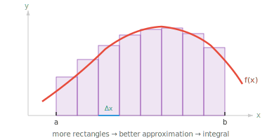

# 积分学

*积分学在区间上累积量，把局部变化率还原为总量。本文件涵盖定积分与不定积分、微积分基本定理、积分技巧，以及在 ML 中应用于概率密度和期望值。*

- 微分告诉我们某一点处的变化率。积分则反向：它把许多微小的片段累加起来计算总量。

- 如果 derivative 回答"多快？"，integral 回答"多少？"

- 理解积分最简单的方式是把它看成 **曲线下面积**。如果你绘制函数 $f(x)$，并涂出从 $x = a$ 到 $x = b$ 之间曲线与 x 轴之间的区域，积分给出该区域的有符号面积。



- 为什么是"有符号"？x 轴上方的区域贡献正面积，下方的区域贡献负面积。这在物理上是有意义的：如果 $f(x)$ 表示速度，积分给出净位移（前进减后退），而不是总距离。

- 要计算这个面积，想象把区域切成 $n$ 个细长的竖直矩形，每个宽 $\Delta x$。每个矩形的高是该切片内某点处的函数值。把它们求和：

$$\text{Area} \approx \sum_{i=1}^{n} f(x_i^\ast) \, \Delta x$$

- 当我们把矩形切得越来越细（$n \to \infty$，$\Delta x \to 0$），和就变得精确。这个极限过程定义了 **定积分**：

$$\int_a^b f(x)\, dx = \lim_{n \to \infty} \sum_{i=1}^{n} f(x_i^\ast) \, \Delta x$$

- 符号 $\int$ 是一个拉长的 "S"，表示 "sum"（求和）。$dx$ 提醒我们正在沿 x 轴对无穷细的切片求和。

- **不定积分**（或 **反导数**）是一个函数 $F(x)$，其 derivative 为 $f(x)$。写作：

$$\int f(x)\, dx = F(x) + C$$

- 这里的 $+ C$ 是 **积分常数**。由于任何常数的 derivative 都是零，因此有无数个反导数，它们之间只差一个常数。例如，$\int 2x\, dx = x^2 + C$，因为 $x^2 + 7$ 或 $x^2 - 3$ 的 derivative 仍然是 $2x$。

- **微积分基本定理** 是连接微分与积分的桥梁。它有两部分：

- **第一部分**：如果 $F(x)$ 是 $f(x)$ 的反导数，那么定积分等于 $F$ 在端点处的差：

$$\int_a^b f(x)\, dx = F(b) - F(a)$$

- 这非常实用。与其计算一个和的极限（困难），不如找到一个反导数并在两点处求值（通常容易）。

- **第二部分**：如果我们定义 $F(x) = \int_a^x f(t)\, dt$，那么 $F'(x) = f(x)$。微分与积分是互逆运算，它们相互抵消。

- 例如，要计算 $\int_1^3 x^2\, dx$：$x^2$ 的反导数是 $\frac{x^3}{3}$。所以 $\int_1^3 x^2\, dx = \frac{27}{3} - \frac{1}{3} = \frac{26}{3} \approx 8.67$。

- 正如微分有法则，积分也有与之对应的逆向法则：

| 函数 | 积分 | 条件 |
|---|---|---|
| $x^n$ | $\frac{x^{n+1}}{n+1} + C$ | $n \neq -1$ |
| $\frac{1}{x}$ | $\ln\|x\| + C$ | |
| $e^x$ | $e^x + C$ | |
| $a^x$ | $\frac{a^x}{\ln a} + C$ | |
| $\sin x$ | $-\cos x + C$ | |
| $\cos x$ | $\sin x + C$ | |
| $k$（常数） | $kx + C$ | |

- **和差法则**同样适用：$\int [f(x) \pm g(x)]\, dx = \int f(x)\, dx \pm \int g(x)\, dx$。常数可以提出：$\int k\, f(x)\, dx = k \int f(x)\, dx$。

- 当一个函数过于复杂而无法直接积分时，我们有办法化简它。

- **换元积分法（u-substitution）** 是 chain rule 的逆运算。如果你发现一个复合函数 $f(g(x))$ 乘以 $g'(x)$，就令 $u = g(x)$，于是 $du = g'(x)\, dx$，积分就化简了。

- 例如：$\int 2x \cos(x^2)\, dx$。令 $u = x^2$，则 $du = 2x\, dx$。积分变为 $\int \cos(u)\, du = \sin(u) + C = \sin(x^2) + C$。

- **分部积分** 是乘积法则的逆运算。如果被积函数是两个函数的乘积：

$$\int u\, dv = uv - \int v\, du$$

- 策略性地选择 $u$ 和 $dv$，使剩下的积分 $\int v\, du$ 比原来的更简单。一个常见的选 $u$ 的口诀是 **LIATE**：对数、反三角、代数、三角、指数（从靠前的类别里选 $u$）。

- 例如：$\int x\, e^x\, dx$。令 $u = x$（代数），$dv = e^x\, dx$。则 $du = dx$，$v = e^x$。所以：$\int x\, e^x\, dx = x\, e^x - \int e^x\, dx = x\, e^x - e^x + C = e^x(x - 1) + C$。

- 在 ML 中，积分出现在概率论中（通过对密度函数积分计算概率）、期望值中（对连续分布的加权平均），以及计算 ROC 曲线下面积中。虽然我们在实践中很少手算积分，但理解积分的含义有助于解释这些量。

## 编程任务（使用 CoLab 或 notebook）

1. 用不断增加矩形数量的黎曼和数值逼近 $\int_0^1 x^2\, dx$，并与精确答案 $\frac{1}{3}$ 比较。
```python
import jax.numpy as jnp

for n in [10, 100, 1000, 10000]:
    x = jnp.linspace(0, 1, n, endpoint=False)
    dx = 1.0 / n
    area = jnp.sum(x**2 * dx)
    print(f"n={n:5d}  approx: {area:.6f}  exact: {1/3:.6f}")
```

2. 数值验证微积分基本定理。定义 $F(x) = \int_0^x t^2\, dt = \frac{x^3}{3}$，验证它的 derivative（用 `jax.grad` 计算）等于 $x^2$。
```python
import jax
import jax.numpy as jnp

F = lambda x: x**3 / 3
dF = jax.grad(F)

for x in [0.5, 1.0, 2.0, 3.0]:
    print(f"x={x:.1f}  F'(x)={dF(x):.4f}  x^2={x**2:.4f}")
```

3. 可视化 $f(x) = \sin(x)$ 从 $0$ 到 $\pi$ 的曲线下面积。用 `plt.fill_between` 涂出该面积，并用黎曼和数值计算。
```python
import jax.numpy as jnp
import matplotlib.pyplot as plt

x = jnp.linspace(0, jnp.pi, 500)
y = jnp.sin(x)

plt.plot(x, y, color="purple", linewidth=2)
plt.fill_between(x, y, alpha=0.2, color="purple")
plt.title(f"Area = {jnp.sum(jnp.sin(x) * (jnp.pi / 500)):.4f}  (exact: 2.0)")
plt.show()
```
