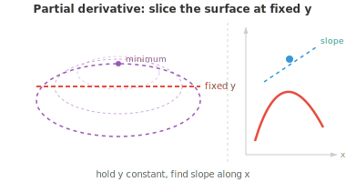
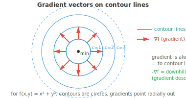

# Математический анализ функций многих переменных

*Математический анализ функций многих переменных расширяет понятия производной и интеграла на функции от многих переменных, что крайне важно, поскольку модели машинного обучения имеют миллионы параметров. В этом файле рассматриваются частные производные, градиенты, якобиан, гессиан и цепное правило для функций многих переменных, которое делает возможным обратное распространение ошибки.*

- До сих пор наши функции принимали на вход одно значение $x$ и выдавали один результат $f(x)$. Но в машинном обучении мы почти никогда не работаем только с одной переменной.

- Рассмотрим функцию двух переменных, например $f(x, y) = x^2 + y^2$. Она задает поверхность в трехмерном пространстве в форме чаши. Мы хотим знать: если мы немного изменим $x$, удерживая $y$ постоянным, как изменится $f$? Это и есть **частная производная**.

- **Частная производная** функции $f$ по $x$, обозначаемая $\frac{\partial f}{\partial x}$, рассматривает все остальные переменные как константы и вычисляется как обычная производная по $x$.

- Для функции $f(x, y) = x^2y + 3x - 2y$:

$$\frac{\partial f}{\partial x} = 2xy + 3 \qquad \frac{\partial f}{\partial y} = x^2 - 2$$

- Чтобы вычислить $\frac{\partial f}{\partial x}$, мы считали $y$ константой, поэтому производная $x^2y$ равна $2xy$, $3x$ — $3$, а $-2y$ — $0$.

- Чтобы вычислить $\frac{\partial f}{\partial y}$, мы считали $x$ константой, поэтому производная $x^2y$ равна $x^2$, $3x$ — $0$, а $-2y$ — $-2$.

- Геометрически вычисление частной производной по $x$ подобно сечению трехмерной поверхности плоскостью, параллельной плоскости $xz$ (при фиксированном значении $y$), и нахождению наклона полученной кривой.



- **Градиент** объединяет все частные производные в один вектор:

$$\nabla f = \left(\frac{\partial f}{\partial x_1}, \frac{\partial f}{\partial x_2}, \ldots, \frac{\partial f}{\partial x_n}\right)$$

- Для $f(x, y) = x^2 + y^2$: $\nabla f(x, y) = (2x, 2y)$. В точке $(1, 2)$: $\nabla f(1, 2) = (2, 4)$.

- Градиент обладает двумя ключевыми свойствами:

    - **Направление**: он указывает направление наискорейшего возрастания. Представьте туриста на горе. Градиент в его текущем положении указывает прямо вверх, вдоль самого крутого пути.

    - **Величина**: $\|\nabla f\|$ дает скорость возрастания в этом направлении наискорейшего подъема. Большой градиент означает крутой склон; малый градиент означает почти плоскую поверхность.



- Поскольку градиент указывает вверх, движение в противоположном направлении ($-\nabla f$) ведет вниз, к меньшим значениям. Эта простая идея лежит в основе **градиентного спуска** — метода оптимизации, который мы подробно изучим в следующих главах. Пока что главное, что нужно запомнить: градиент показывает, где находится «верх» и насколько крут подъем.

- **Производная по направлению** обобщает понятие частной производной. Вместо вопроса «как меняется $f$ вдоль оси $x$?» она отвечает на вопрос «как меняется $f$ вдоль любого направления $\mathbf{u}$?». Она вычисляется как скалярное произведение градиента на единичный вектор:

$$D_{\mathbf{u}} f = \nabla f \cdot \mathbf{u}$$

- Для $f(x, y) = x^2 + y^2$ в точке $(1, 2)$ по направлению $\mathbf{v} = (3, 4)$: сначала нормируем вектор, получив $\mathbf{u} = (3/5, 4/5)$, затем $D_{\mathbf{u}} f = (2, 4) \cdot (3/5, 4/5) = 6/5 + 16/5 = 22/5$.

- Частные производные являются частными случаями производных по направлению, когда направление совпадает с координатной осью. Если производная по направлению в некоторую сторону равна нулю, значит, функция в этой точке плоская в данном направлении.

- **Линии уровня** (или изолинии) соединяют точки, в которых функция принимает одинаковые значения. Для $f(x, y) = x^2 + y^2$ линиями уровня являются окружности с центром в начале координат: $x^2 + y^2 = c$ для различных значений $c$.

- Линии уровня никогда не пересекаются (точка не может иметь два разных значения функции).

- Градиент всегда перпендикулярен линиям уровня и направлен от меньших значений к большим.

- Близко расположенные линии уровня указывают на крутой склон; широко расставленные линии — на пологий.

- До сих пор наши функции выдавали один результат. Но многие функции выдают несколько результатов. Функция $\mathbf{F}: \mathbb{R}^n \to \mathbb{R}^m$ принимает $n$ входных значений и выдает $m$ выходных. **Якобиан** (матрица Якоби) организует все частные производные такой векторнозначной функции:

```math
J = \begin{bmatrix} \frac{\partial f_1}{\partial x_1} & \cdots & \frac{\partial f_1}{\partial x_n} \\ \vdots & \ddots & \vdots \\ \frac{\partial f_m}{\partial x_1} & \cdots & \frac{\partial f_m}{\partial x_n} \end{bmatrix}
```

- Каждая строка якобиана — это градиент одного из выходных компонентов. Для функции с 3 входами и 2 выходами якобиан представляет собой матрицу $2 \times 3$.

- Якобиан обобщает понятие производной для векторнозначных функций.

- Подобно тому, как производная скалярной функции показывает, насколько изменяется выход при изменении входа на единицу, якобиан показывает, как каждый выход изменяется по отношению к каждому входу.

- **Определитель якобиана** измеряет, насколько преобразование локально растягивает или сжимает пространство.

- Если определитель равен 2, малые области удваиваются в площади. Если он равен 0, преобразование сплющивает пространство в меньшую размерность (вспомните из главы о матрицах, что нулевой определитель означает вырожденное, необратимое преобразование).

- Когда несколько преобразований композируются (одно подается на вход другому), якобиан общего отображения равен произведению якобианов отдельных преобразований. Мы увидим, что эта идея станет центральной в следующих главах.

- В то время как градиент фиксирует информацию первого порядка (наклоны), **гессиан** (матрица Гессе) фиксирует информацию второго порядка (кривизну).

- Для скалярной функции $f(x_1, \ldots, x_n)$ гессиан — это матрица $n \times n$, состоящая из всех вторых частных производных:

```math
H = \begin{bmatrix} \frac{\partial^2 f}{\partial x_1^2} & \frac{\partial^2 f}{\partial x_1 \partial x_2} & \cdots \\ \frac{\partial^2 f}{\partial x_2 \partial x_1} & \frac{\partial^2 f}{\partial x_2^2} & \cdots \\ \vdots & \vdots & \ddots \end{bmatrix}
```

- Для $f(x, y) = x^3 + 2xy^2 - y^3$ градиент равен $(3x^2 + 2y^2,\; 4xy - 3y^2)$, а матрица Гессе (гессиан) имеет вид:

```math
H = \begin{bmatrix} 6x & 4y \\ 4y & 4x - 6y \end{bmatrix}
```

- Диагональные элементы ($6x$ и $4x - 6y$) показывают, как изменяется наклон в направлении $x$ при движении по $x$, и аналогично для $y$.

- Внедиагональные элементы ($4y$) показывают, как изменяется наклон в одном направлении при движении в другом направлении.

- **Теорема Клеро** гарантирует, что для функций с непрерывными вторыми производными смешанные частные производные равны: $\frac{\partial^2 f}{\partial x \partial y} = \frac{\partial^2 f}{\partial y \partial x}$.

- Это означает, что матрица Гессе симметрична, что (как мы видели в главе о матрицах) гарантирует наличие вещественных собственных значений и ортогональных собственных векторов.

- Матрица Гессе дает нам информацию о форме функции вблизи критической точки (где градиент равен нулю):

    - Если $H$ положительно определена (все собственные значения положительны), то точка является **локальным минимумом**, поверхность изгибается вверх во всех направлениях, как чаша.
    - Если $H$ отрицательно определена (все собственные значения отрицательны), то точка является **локальным максимумом**, поверхность изгибается вниз, как перевернутая чаша.
    - Если $H$ имеет как положительные, так и отрицательные собственные значения, то точка является **седловой точкой**, поверхность изгибается вверх в одних направлениях и вниз в других, как горный перевал.

- **Цепное правило для функций многих переменных** обобщает цепное правило на функции нескольких переменных. Если $z = f(x, y)$, где $x = g(t)$ и $y = h(t)$, то:

$$\frac{dz}{dt} = \frac{\partial f}{\partial x}\frac{dx}{dt} + \frac{\partial f}{\partial y}\frac{dy}{dt}$$

- Каждый путь от $t$ к $z$ вносит свой вклад: частная производная вдоль этого пути, умноженная на производную промежуточной переменной по $t$.

- Например, если $z = x^2 y + 3x - y^2$, $x = \cos(t)$, $y = \sin(t)$:

$$\frac{dz}{dt} = (2xy + 3)(-\sin t) + (x^2 - 2y)(\cos t)$$

- Помимо вычисления производных вручную, существуют три подхода:

    - **Численное дифференцирование**: аппроксимация $f'(x) \approx \frac{f(x+h) - f(x-h)}{2h}$ для малых $h$. Просто, но дает шум и неточно.
    - **Символьное дифференцирование**: применение правил дифференцирования алгебраически для получения точной формулы. Может приводить к экспоненциальному росту выражений.
    - **Автоматическое дифференцирование (autodiff)**: отслеживает цепочку операций и вычисляет точные производные эффективно. Именно это используют JAX, PyTorch и TensorFlow. Оно дает точные численные значения (не приближенные), не создавая громоздких символьных выражений.

## Задачи по программированию (используйте CoLab или ноутбук)

1. Вычислите градиент $f(x, y) = x^2 y + 3x - 2y$ в точке $(1, 2)$ с помощью `jax.grad`. Поскольку $f$ принимает векторный вход, используйте `jax.grad` с параметром `argnums`.
```python
import jax
import jax.numpy as jnp

def f(x, y):
    return x**2 * y + 3*x - 2*y

df_dx = jax.grad(f, argnums=0)
df_dy = jax.grad(f, argnums=1)

x, y = 1.0, 2.0
print(f"∂f/∂x = {df_dx(x, y):.4f}  (expected: {2*x*y + 3:.4f})")
print(f"∂f/∂y = {df_dy(x, y):.4f}  (expected: {x**2 - 2:.4f})")
```

2. Вычислите якобиан векторнозначной функции с помощью `jax.jacobian`. Сравните с ручным расчетом.
```python
import jax
import jax.numpy as jnp

def F(x):
    return jnp.array([x[0]**2 + x[1], x[0] * x[1]**2])

J = jax.jacobian(F)
x = jnp.array([1.0, 2.0])
print(f"Jacobian at (1,2):\n{J(x)}")
# Expected: [[2*x[0], 1], [x[1]**2, 2*x[0]*x[1]]] = [[2, 1], [4, 4]]
```

3. Вычислите матрицу Гессе для $f(x, y) = x^3 + 2xy^2 - y^3$ с помощью `jax.hessian` и проверьте ее симметричность.
```python
import jax
import jax.numpy as jnp

def f(xy):
    x, y = xy[0], xy[1]
    return x**3 + 2*x*y**2 - y**3

H = jax.hessian(f)
point = jnp.array([1.0, 2.0])
hess = H(point)
print(f"Hessian:\n{hess}")
print(f"Symmetric: {jnp.allclose(hess, hess.T)}")
# Expected: [[6x, 4y], [4y, 4x-6y]] = [[6, 8], [8, -8]]
```

4. Создайте минимальный движок автоматического дифференцирования с нуля.
    - Каждый `Var` отслеживает свое значение и то, как распространять градиенты назад через цепное правило.
    - Попробуйте расширить его другими операциями (деление, возведение в степень и т. д.).
    - Это основа того, как были спроектированы JAX, PyTorch и Numpy.
```python
class Var:
    def __init__(self, val, children=(), backward_fn=None):
        self.val = val
        self.grad = 0.0
        self.children = children
        self.backward_fn = backward_fn

    def __add__(self, other):
        out = Var(self.val + other.val, children=(self, other))
        def _backward():
            self.grad += out.grad    # d(a+b)/da = 1
            other.grad += out.grad   # d(a+b)/db = 1
        out.backward_fn = _backward
        return out

    def __mul__(self, other):
        out = Var(self.val * other.val, children=(self, other))
        def _backward():
            self.grad += other.val * out.grad  # d(a*b)/da = b
            other.grad += self.val * out.grad  # d(a*b)/db = a
        out.backward_fn = _backward
        return out

    def backward(self):
        # topological sort then propagate gradients
        # we will go through this in data structures and algorithms
        order, visited = [], set()
        def topo(v):
            if v not in visited:
                visited.add(v)
                for c in v.children:
                    topo(c)
                order.append(v)
        topo(self)
        self.grad = 1.0
        for v in reversed(order):
            if v.backward_fn:
                v.backward_fn()

# f(x, y) = x*x*y + x  at (3, 2)
x = Var(3.0)
y = Var(2.0)
f = x * x * y + x       # = 3*3*2 + 3 = 21

f.backward()
print(f"f = {f.val}")           # 21.0
print(f"df/dx = {x.grad}")     # 2*x*y + 1 = 13.0
print(f"df/dy = {y.grad}")     # x*x = 9.0
```
