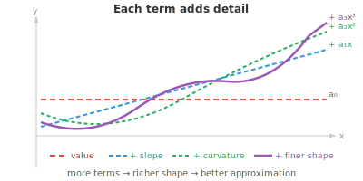
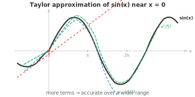

# Аппроксимация функций

*Аппроксимация функций заменяет сложные функции более простыми, которые достаточно близки к исходным, чтобы быть полезными. В этом файле рассматриваются линеаризация, ряды Тейлора, полиномиальная аппроксимация, ряды Фурье и теорема об универсальной аппроксимации — теоретическая основа того, почему нейронные сети способны обучаться произвольным отображениям.*

- Многие функции, с которыми мы сталкиваемся, слишком сложны для непосредственной работы. Вычисление $e^{0.1}$ на бумаге, прогнозирование траектории спутника и т. д. — все это включает функции, не имеющие простых аналитических решений.

- **Аппроксимация функций** заменяет сложную функцию более простой, которая является «достаточно близкой» в интересующей нас области.

- Наиболее естественной аппроксимацией является полином. Полиномы — это просто суммы степеней $x$ с коэффициентами, их легко вычислять, дифференцировать и интегрировать.

- Но почему полиномы так хорошо работают в качестве аппроксиматоров? Рассмотрим, какой вклад вносит каждая степень $x$.

    - Константный член $a_0$ задает базовое значение.
    - Член $a_1 x$ добавляет наклон.
    - Член $a_2 x^2$ добавляет кривизну.
    - Каждая более высокая степень улавливает более тонкие детали формы функции.



- Выбирая правильные коэффициенты, мы можем поочередно согласовать значение, наклон, кривизну и поведение функции высших порядков в конкретной точке.

- При достаточном количестве членов полином может имитировать почти любую гладкую функцию.

- Возникает вопрос: как найти правильные коэффициенты?

- **Линеаризация** — это простейшая аппроксимация. Вблизи точки $x = a$ мы заменяем функцию ее касательной:

$$L(x) = f(a) + f'(a)(x - a)$$

- Это **аппроксимация Тейлора** первого порядка. Она гласит: начните с известного значения $f(a)$, а затем внесите поправку, умножив наклон на расстояние от $a$.

- Например, линеаризуем $\sin(x)$ в точке $x = 0$: $f(0) = 0$, $f'(0) = \cos(0) = 1$, поэтому $L(x) = x$. Вблизи нуля $\sin(x) \approx x$. Проверим: $\sin(0.1) = 0.0998\ldots \approx 0.1$.

- Однако линеаризация хороша только в непосредственной близости от $a$. При удалении от этой точки аппроксимация перестает работать. Чтобы улучшить результат, мы включаем члены более высокого порядка.

- **Ряд Тейлора** представляет функцию в виде бесконечной суммы полиномиальных членов, каждый из которых отражает более тонкие детали поведения функции вблизи точки $a$:

$$f(x) = \sum_{n=0}^{\infty} \frac{f^{(n)}(a)}{n!}(x - a)^n = f(a) + f'(a)(x-a) + \frac{f''(a)}{2!}(x-a)^2 + \frac{f'''(a)}{3!}(x-a)^3 + \cdots$$



- Каждый последующий член добавляет поправку. Первый член согласует значение, второй — наклон, третий — кривизну и так далее. Чем больше членов мы включаем, тем шире область, в которой аппроксимация является точной.

- Знаменатель $n!$ не случаен. При дифференцировании $(x - a)^n$ ровно $n$ раз получается $n!$. Факториал сокращает это значение, гарантируя, что $n$-я производная полинома Тейлора равна $n$-й производной исходной функции в точке $x = a$.

- **Ряд Маклорена** — это просто ряд Тейлора, центрированный в точке $a = 0$:

$$f(x) = \sum_{n=0}^{\infty} \frac{f^{(n)}(0)}{n!} x^n$$

- Некоторые известные ряды Маклорена:

$$e^x = 1 + x + \frac{x^2}{2!} + \frac{x^3}{3!} + \cdots$$

$$\sin x = x - \frac{x^3}{3!} + \frac{x^5}{5!} - \frac{x^7}{7!} + \cdots$$

$$\cos x = 1 - \frac{x^2}{2!} + \frac{x^4}{4!} - \frac{x^6}{6!} + \cdots$$

- Заметим, что $\sin x$ содержит только нечетные степени (это нечетная функция), а $\cos x$ — только четные (это четная функция). Чередующиеся знаки заставляют аппроксимацию осциллировать вокруг истинного значения, сходясь с обеих сторон.

- Аппроксимируем $e^{0.5}$, используя четыре члена: $1 + 0.5 + \frac{0.25}{2} + \frac{0.125}{6} = 1 + 0.5 + 0.125 + 0.02083 \approx 1.6458$. Истинное значение равно $1.6487\ldots$, поэтому четыре члена уже дают нам три верных десятичных знака.

- Не каждый ряд Тейлора сходится везде. **Радиус сходимости** показывает, как далеко от центра $a$ ряд дает достоверные результаты. Внутри этого радиуса полиномиальную аппроксимацию можно сделать сколь угодно точной, добавляя больше членов. За его пределами ряд расходится.

- **Степенной ряд** имеет общую форму: $\sum_{n=0}^{\infty} a_n (x - c)^n$. Ряды Тейлора — это степенные ряды, коэффициенты которых определяются производными. Другие степенные ряды могут быть определены по иным правилам. **Признак Даламбера** определяет сходимость: вычислим $\lim_{n \to \infty} \left|\frac{a_{n+1}}{a_n}\right|$. Если этот предел равен $L$, то радиус сходимости равен $R = 1/L$.

- Когда мы усекаем ряд Тейлора после $n$ членов, мы допускаем ошибку. **Остаточный член в форме Лагранжа** ограничивает эту ошибку:

$$R_n(x) = \frac{f^{(n+1)}(c)}{(n+1)!}(x-a)^{n+1}$$

- Здесь $c$ — некоторая неизвестная точка между $a$ и $x$. Мы не знаем $c$ точно, но часто можем ограничить $|f^{(n+1)}(c)|$, чтобы получить оценку ошибки в худшем случае. Знаменатель $(n+1)!$ растет чрезвычайно быстро, поэтому ошибка быстро уменьшается по мере добавления членов (для функций внутри радиуса сходимости).

- Для функции нескольких переменных разложение Тейлора включает смешанные частные производные. Аппроксимация второго порядка для $f(\mathbf{x})$ в окрестности точки $\mathbf{a}$ имеет вид:

$$f(\mathbf{x}) \approx f(\mathbf{a}) + \nabla f(\mathbf{a})^T (\mathbf{x} - \mathbf{a}) + \frac{1}{2} (\mathbf{x} - \mathbf{a})^T H(\mathbf{a}) (\mathbf{x} - \mathbf{a})$$

- Первый член — это значение, второй использует градиент (вектор, как мы видели в многомерном математическом анализе), а третий использует матрицу Гессе (которая описывает кривизну). Это напрямую связывает нашу главу о матрицах с математическим анализом: матрица Гессе — это матрица вторых производных, описывающая форму поверхности функции.

- Эта многомерная аппроксимация второго порядка является основой метода Ньютона и других методов оптимизации второго порядка, которые мы рассмотрим в следующем файле.

- Помимо полиномов, существуют и другие методы аппроксимации, о которых стоит знать:

- **Сплайновая интерполяция**: вместо одного полинома высокой степени используются множество полиномов низкой степени, плавно соединенных друг с другом. Это позволяет избежать сильных осцилляций, которые могут возникать при использовании полиномов высокой степени.
- **Ряды Фурье**: аппроксимация периодических функций в виде суммы синусов и косинусов. Необходимы в обработке сигналов и аудио.
- **Нейронные сети**: универсальные аппроксиматоры функций. При наличии достаточного количества нейронов они могут аппроксимировать любую непрерывную функцию с произвольной точностью. Это является теоретическим обоснованием глубокого обучения.

- Функция называется «хорошо себя ведущей» (well-behaved), если она обладает свойствами, делающими аппроксимацию надежной: непрерывность (отсутствие скачков), дифференцируемость (отсутствие острых углов), гладкость (существование производных всех порядков) и ограниченность (значения функции остаются конечными).

- Полиномы, экспоненциальные и тригонометрические функции — все они являются хорошо себя ведущими. Чем лучше ведет себя функция, тем меньше членов ряда Тейлора требуется для получения хорошей аппроксимации.

## Задачи по программированию (используйте CoLab или ноутбук)

1. Аппроксимируйте $e^x$, используя возрастающее число членов ряда Тейлора, и визуализируйте, как улучшается аппроксимация.
```python
import jax.numpy as jnp
import matplotlib.pyplot as plt

x = jnp.linspace(-2, 3, 300)
plt.plot(x, jnp.exp(x), "k-", linewidth=2, label="eˣ (exact)")

colors = ["#e74c3c", "#3498db", "#27ae60", "#9b59b6"]
for n, color in zip([1, 2, 4, 8], colors):
    approx = sum(x**k / jnp.array(float(jnp.prod(jnp.arange(1, k+1)) if k > 0 else 1))
                 for k in range(n+1))
    plt.plot(x, approx, color=color, linestyle="--", label=f"{n} terms")

plt.ylim(-2, 15)
plt.legend()
plt.title("Taylor approximation of eˣ")
plt.show()
```

2. Вычислите остаточный член Лагранжа, чтобы ограничить ошибку аппроксимации $\sin(1)$ при различном количестве членов ряда Тейлора.
```python
import jax.numpy as jnp

x = 1.0
exact = jnp.sin(x)

taylor = 0.0
for n in range(8):
    sign = (-1)**n
    factorial = float(jnp.prod(jnp.arange(1, 2*n+2)))
    taylor += sign * x**(2*n+1) / factorial
    error = abs(exact - taylor)
    bound = x**(2*n+3) / float(jnp.prod(jnp.arange(1, 2*n+4)))
    print(f"terms={n+1}  approx={taylor:.10f}  error={error:.2e}  bound={bound:.2e}")
```

3. Сравните линейную и квадратичную аппроксимации Тейлора для $\cos(x)$ вблизи $x = 0$. Постройте обе аппроксимации вместе с исходной функцией и определите диапазон, в котором каждая из них является точной.
```python
import jax.numpy as jnp
import matplotlib.pyplot as plt

x = jnp.linspace(-3, 3, 300)
plt.plot(x, jnp.cos(x), "k-", linewidth=2, label="cos(x)")
plt.plot(x, jnp.ones_like(x), "--", color="#e74c3c", label="linear: 1")
plt.plot(x, 1 - x**2/2, "--", color="#3498db", label="quadratic: 1 - x²/2")
plt.plot(x, 1 - x**2/2 + x**4/24, "--", color="#27ae60", label="4th order")
plt.ylim(-2, 2)
plt.legend()
plt.title("Taylor approximations of cos(x)")
plt.show()
```
