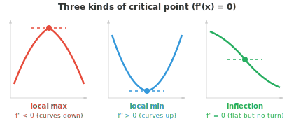
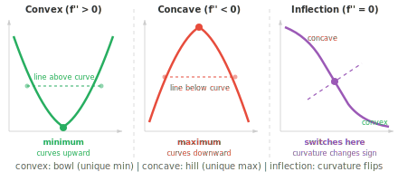
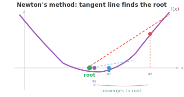
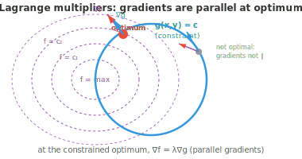

# Оптимизация

*Оптимизация — это математическая основа обучения моделей, заключающаяся в поиске параметров, которые минимизируют функцию потерь. В этом файле рассматриваются критические точки, выпуклость, градиентный спуск, метод Ньютона, условная оптимизация с использованием множителей Лагранжа, а также оптимизаторы (SGD, Adam), на которых базируется современное глубокое обучение.*

- Обучение нейронной сети, подбор линии регрессии, настройка гиперпараметров: в основе почти каждого алгоритма машинного обучения лежит задача **оптимизации**.

- У нас есть некоторая функция (потерь, стоимости, целевая), и мы хотим найти такие входные значения, которые делают её минимальной (или максимальной).

- Прежде чем приступать к оптимизации, необходимо понять, что такое **нули** (или корни) функций. Нуль функции $f(x)$ — это такое значение $x$, при котором $f(x) = 0$. Графически это точки пересечения с осью x.

- Например, функция $f(x) = x^2 - 3x + 2 = (x-1)(x-2)$ имеет нули в точках $x = 1$ и $x = 2$. Между нулями функция отрицательна ($f(1.5) = -0.25$); вне нулей она положительна. Нули делят числовую прямую на области, в которых функция сохраняет знак.

- **Кратность** нуля показывает, сколько раз соответствующий множитель входит в выражение функции.

- В простом нуле (кратность 1) график пересекает ось x. В двойном нуле (кратность 2) график касается оси x, но «отскакивает» от неё, не пересекая, и выглядит в этой точке «плоским».

- Поиск нулей важен, поскольку нули производной $f'(x)$ являются **критическими точками** функции $f(x)$ — кандидатами на роль максимумов и минимумов.

- В точке максимума или минимума касательная горизонтальна (наклон равен 0), поэтому $f'(x) = 0$.



- Однако не каждая критическая точка является максимумом или минимумом. Точка, где $f'(x) = 0$, может также быть **точкой перегиба** (как $x = 0$ для $f(x) = x^3$), где функция на мгновение становится плоской, но не меняет направление.

- **Тест второй производной** позволяет это прояснить. В критической точке $x = c$, где $f'(c) = 0$:

    - Если $f''(c) > 0$: кривая выпукла вниз (как чаша), поэтому $c$ — **локальный минимум**.
    - Если $f''(c) < 0$: кривая выпукла вверх (как холм), поэтому $c$ — **локальный максимум**.
    - Если $f''(c) = 0$: тест не даёт ответа; требуются производные более высоких порядков или другие методы.

- Например, $f(x) = x^3 - 3x$. Производная равна $f'(x) = 3x^2 - 3 = 3(x-1)(x+1)$, поэтому критические точки находятся в $x = -1$ и $x = 1$. Вторая производная равна $f''(x) = 6x$. При $x = -1$: $f''(-1) = -6 < 0$ (локальный максимум). При $x = 1$: $f''(1) = 6 > 0$ (локальный минимум).

- Функция называется **выпуклой**, если отрезок прямой между любыми двумя точками на её графике лежит выше (или на) самого графика. Представьте её как форму чаши, изгибающуюся вверх в любой точке. Математически функция $f$ выпукла, если $f''(x) \geq 0$ для всех $x$.



- Выпуклость обладает мощным свойством: у выпуклых функций любой локальный минимум является также **глобальным минимумом**. Здесь нет обманчивых локальных впадин, в которых можно застрять. Если вы бросите шарик в выпуклую чашу, он всегда окажется на дне.

- Функция называется **вогнутой** (изгибающейся вниз), если $-f$ является выпуклой. Точки, в которых функция переходит от вогнутости к выпуклости, называются **точками перегиба**; они возникают там, где $f''(x) = 0$.

- **Метод Ньютона** находит нули функций (и, как следствие, критические точки их производных) с помощью касательных. Начиная с начального приближения $x_0$, он итеративно уточняет результат:

$$x_{n+1} = x_n - \frac{f(x_n)}{f'(x_n)}$$



- Идея заключается в следующем: в точке $x_n$ проводится касательная, и находится точка её пересечения с осью x. Эта точка пересечения становится $x_{n+1}$. Для «хороших» функций при удачном начальном приближении метод Ньютона сходится очень быстро (квадратично, что означает, что количество верных знаков примерно удваивается на каждом шаге).

- Например, чтобы найти $\sqrt{5}$ (нуль функции $f(x) = x^2 - 5$): $f'(x) = 2x$, поэтому $x_{n+1} = x_n - \frac{x_n^2 - 5}{2x_n}$. Начиная с $x_0 = 2$: $x_1 = 2.25$, $x_2 = 2.2361\ldots$, что уже даёт точность до четырёх десятичных знаков.

- Метод Ньютона может не сработать, если начальное приближение далеко от корня, если $f'(x) = 0$ вблизи корня или если рядом есть точки перегиба. Кроме того, он требует вычисления производной, что может быть затратно.

- Для оптимизации (поиска минимумов вместо нулей) мы применяем метод Ньютона к $f'(x) = 0$, что даёт формулу обновления:

$$x_{n+1} = x_n - \frac{f'(x_n)}{f''(x_n)}$$

- В многомерном случае это принимает вид $\mathbf{x}_{n+1} = \mathbf{x}_n - H^{-1} \nabla f(\mathbf{x}_n)$, где $H$ — матрица Гессе (гессиан). Это и есть квадратичная аппроксимация Тейлора из предыдущего файла в действии: аппроксимируем функцию квадратичной, переходим к минимуму этой квадратичной функции и повторяем.

- **Множители Лагранжа** решают задачу **условной оптимизации**: найти оптимум функции $f(x, y)$ при условии $g(x, y) = c$. Вместо поиска по всему пространству $\mathbb{R}^n$ мы ограничены множеством, где выполняется условие (кривой или поверхностью).

- Ключевая геометрическая идея: в условном оптимуме градиент $f$ должен быть параллелен градиенту $g$. Если бы они не были параллельны, мы могли бы двигаться вдоль ограничения в направлении, которое всё ещё улучшает $f$, а значит, мы ещё не достигли оптимума.

- Мы вводим новую переменную $\lambda$ (множитель Лагранжа) и определяем **функцию Лагранжа**:

$$\mathcal{L}(x, y, \lambda) = f(x, y) - \lambda(g(x, y) - c)$$

- Приравнивание всех частных производных к нулю даёт систему уравнений, решения которой являются условными оптимумами:

$$\frac{\partial \mathcal{L}}{\partial x} = 0, \quad \frac{\partial \mathcal{L}}{\partial y} = 0, \quad \frac{\partial \mathcal{L}}{\partial \lambda} = 0$$



- Например, максимизируем $f(x,y) = x^2 y$ при условии $x^2 + y^2 = 1$. Лагранжиан имеет вид $\mathcal{L} = x^2 y - \lambda(x^2 + y^2 - 1)$. Вычисляем частные производные:

$$2xy - 2\lambda x = 0, \quad x^2 - 2\lambda y = 0, \quad x^2 + y^2 = 1$$

- Из первого уравнения (при условии $x \neq 0$): $\lambda = y$. Подставляем во второе: $x^2 = 2y^2$. В сочетании с ограничением: $2y^2 + y^2 = 1$, откуда $y = \frac{1}{\sqrt{3}}$. Максимальное значение равно $f = \frac{2}{3\sqrt{3}}$.

- Для неравенств-ограничений ($g(x,y) \leq c$ вместо $= c$) **условия Каруша — Куна — Таккера (KKT)** обобщают множители Лагранжа. Ограничение является либо активным (связывающим, рассматривается как равенство), либо неактивным (решение лежит внутри области, и ограничение не влияет на результат).

- На практике мы редко проводим оптимизацию вручную. Вот основные семейства алгоритмов:

    - **Методы первого порядка** (используют только градиент): градиентный спуск, стохастический градиентный спуск (SGD), Adam. Они дешевы в расчете на один шаг, но могут сходиться медленно, особенно в плохо обусловленных задачах.

    - **Методы второго порядка** (используют градиент и гессиан): метод Ньютона сходится быстро, но вычисление и обращение гессиана обходятся дорого ($O(n^3)$ для $n$ параметров). **Квазиньютоновские методы** (такие как BFGS и L-BFGS) аппроксимируют гессиан, используя только информацию о градиенте, что позволяет достичь более быстрой сходимости, чем у методов первого порядка, без полной вычислительной стоимости методов второго порядка.

    - **Сопряженные градиенты**: эффективны для больших разреженных систем, используют только матрично-векторные произведения вместо хранения полного гессиана.

    - **Метод Гаусса — Ньютона** и **алгоритм Левенберга — Марквардта**: специализированы для задач наименьших квадратов (часто встречаются в регрессии), аппроксимируют гессиан через якобиан.

    - **Естественный градиентный спуск**: учитывает геометрию пространства параметров с помощью матрицы информации Фишера, что может быть более эффективно для вероятностных моделей.

- Выбор оптимизатора зависит от задачи. В глубоком обучении доминируют методы первого порядка (особенно Adam), поскольку количество параметров огромно (от миллионов до миллиардов), что делает вычисление гессиана непрактичным. Для небольших задач с гладкими целевыми функциями методы второго порядка могут быть значительно быстрее.

## Задачи по программированию (используйте CoLab или ноутбук)

1. Реализуйте метод Ньютона для поиска $\sqrt{7}$ (корня функции $f(x) = x^2 - 7$). Обратите внимание на быструю сходимость.
```python
import jax.numpy as jnp

f = lambda x: x**2 - 7
df = lambda x: 2*x

x = 3.0  # initial guess
for i in range(6):
    x = x - f(x) / df(x)
    print(f"step {i+1}: x = {x:.10f}  (error: {abs(x - jnp.sqrt(7.0)):.2e})")
```

2. Используйте градиентный спуск для минимизации $f(x, y) = (x - 3)^2 + (y + 1)^2$. Минимум находится в точке $(3, -1)$. Поэкспериментируйте с различными скоростями обучения.
```python
import jax
import jax.numpy as jnp

def f(params):
    x, y = params
    return (x - 3)**2 + (y + 1)**2

grad_f = jax.grad(f)
params = jnp.array([0.0, 0.0])
lr = 0.1

for i in range(20):
    g = grad_f(params)
    params = params - lr * g
    if i % 5 == 0 or i == 19:
        print(f"step {i:2d}: ({params[0]:.4f}, {params[1]:.4f})  loss={f(params):.6f}")
```

3. Решите задачу оптимизации с ограничениями численно. Максимизируйте $f(x,y) = xy$ при условии $x + y = 10$, параметризовав $y = 10 - x$ и найдя оптимум функции одной переменной.
```python
import jax
import jax.numpy as jnp

# Substitute constraint: y = 10 - x, so f = x(10 - x) = 10x - x²
f = lambda x: x * (10 - x)
df = jax.grad(f)

# Gradient ascent (we want maximum, so add gradient)
x = 1.0
lr = 0.1
for i in range(20):
    x = x + lr * df(x)
print(f"x={x:.4f}, y={10-x:.4f}, f={f(x):.4f}")  # should be x=5, y=5, f=25
```
