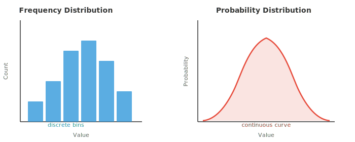
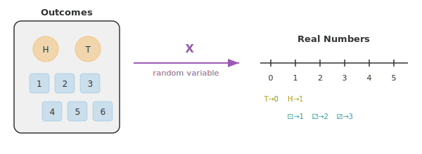
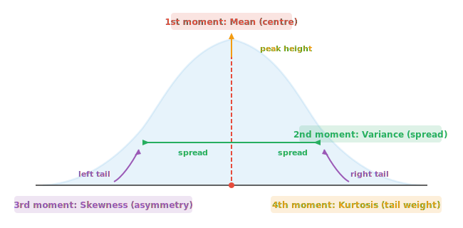

# 统计学基础

*统计学为描述数据和量化不确定性提供了语言。本文件涵盖 distribution（分布）、随机变量、PMF、PDF、CDF、expectation（期望）、variance（方差）、矩以及中心极限定理——这些概念是每个 ML 评估指标和 loss 函数的基石。*

- 统计学是从数据中学习的科学。你收集观测、加以总结并得出结论，常常是关于无法直接测量的事物。

- 假设你想知道某个国家所有成年人的平均身高。你无法测量每个人，于是测量一个 sample（样本）并用统计方法对整个人口做出有根据的推测。

- 它有两大分支：
    - **描述性统计**：总结你已有的数据（平均值、图表、表格）
    - **推断性统计**：用 sample 对更大群体做出论断

- 统计学的基本构件是 **distribution（分布）**，即对数值如何散布的描述。其他一切——平均值、检验、预测——都源于对 distribution 的理解。

- **频数分布** 统计每个值（或值的区间）在数据中出现的次数。想象把考试分数分箱并统计每个箱里有多少学生。结果就是直方图。

- **概率分布** 用概率代替原始计数。它不说"有 12 名学生得分在 70 到 80 之间"，而说"得分在 70 到 80 之间的概率是 0.24"。当数据为连续时，直方图的柱变成一条光滑曲线。



- 左边的直方图由你收集的实际数据构建。右边的光滑曲线是描述数据背后模式的数学模型。一个是经验性的，另一个是理论性的。

- 要用数学方式处理 distribution，我们需要一种把数字赋予结果的方法。这正是 **随机变量** 所做的。

- 随机变量是一个把试验的每个结果映射到实数的函数。抛硬币：结果是"正面"或"反面"，但随机变量 $X$ 把它转换为 $X(\text{heads}) = 1$ 和 $X(\text{tails}) = 0$。现在我们可以做算术了。



- **离散型** 随机变量取可数个值：10 次抛掷中正面的次数、骰子的点数、你一小时收到的邮件数。

- **连续型** 随机变量可以取区间内的任意值：你的精确身高、下一班车到达的时间、正午的温度。

- 这一区别很重要，因为它改变了我们计算概率的方式。对离散变量，我们求和。对连续变量，我们积分（回忆第 3 章的积分）。

- 对离散随机变量，**概率质量函数（PMF）** 给出每个具体值的概率：

$$P(X = x) = p(x), \quad \text{where } \sum_{x} p(x) = 1$$

- 对连续随机变量，**概率密度函数（PDF）** 给出落入某区间内的概率。任何单一精确值的概率为零；只有区间才有正概率：

$$P(a \le X \le b) = \int_a^b f(x)\, dx, \quad \text{where } \int_{-\infty}^{\infty} f(x)\, dx = 1$$

- 既然我们能给结果赋予数字，最自然的问题就是：平均而言我们期望得到什么值？

- **Expectation（期望）**（或期望值）是所有可能值的加权平均，权重就是概率。可以把它想象成 distribution 的"重心"。

- 如果你多次掷一枚均匀骰子，平均点数会收敛到 3.5。这就是期望值，尽管你永远掷不出 3.5。

- 对离散随机变量：

$$E[X] = \sum_{x} x \cdot p(x)$$

- 对连续随机变量（用第 3 章的积分）：

$$E[X] = \int_{-\infty}^{\infty} x \cdot f(x)\, dx$$

- 例子：一枚均匀六面骰子，对 $x = 1, 2, 3, 4, 5, 6$ 都有 $p(x) = 1/6$。

$$E[X] = 1 \cdot \tfrac{1}{6} + 2 \cdot \tfrac{1}{6} + 3 \cdot \tfrac{1}{6} + 4 \cdot \tfrac{1}{6} + 5 \cdot \tfrac{1}{6} + 6 \cdot \tfrac{1}{6} = \frac{21}{6} = 3.5$$

- expectation 是线性的，即 $E[aX + b] = aE[X] + b$。这个性质极为有用，在 ML 的 loss 函数中经常出现。

- expectation 告诉我们中心，却不说数值有多分散。要描述 distribution 的完整形状，我们需要 **矩**。

- 矩是 $X$ 的某次幂的 expectation。$k$ 阶 **原点矩** 为：

$$\mu_k' = E[X^k]$$

- 一阶原点矩（$k = 1$）就是 mean：$\mu_1' = E[X] = \mu$。

- 原点矩从零开始度量。我们常常关心相对均值的偏差。$k$ 阶 **中心矩** 把度量中心化：

$$\mu_k = E[(X - \mu)^k]$$

- 一阶中心矩总是零（高于均值和低于均值的偏差相互抵消）。二阶中心矩就是 **variance（方差）**。

- 为了在不同尺度上比较 distribution，我们除以 standard deviation $\sigma$ 的相应幂次进行 **标准化**：

$$\tilde{\mu}_k = \frac{\mu_k}{\sigma^k}$$

- 每个矩捕捉 distribution 形状的不同方面：



- **1 阶矩（Mean）**：distribution 的中心位置。平衡点。
- **2 阶矩（Variance）**：数值相对均值的散布程度。variance 越大越宽。
- **3 阶矩（Skewness）**：distribution 向左还是向右倾斜。skewness 为零意味着对称。
- **4 阶矩（Kurtosis）**：尾部多重。kurtosis 越大意味着更极端的离群点。

- 我们用一个具体数据集 $X = \{2, 4, 4, 4, 5, 5, 7, 9\}$ 计算全部四个矩。

- **第 1 步：Mean**（1 阶原点矩）

$$\mu = \frac{2 + 4 + 4 + 4 + 5 + 5 + 7 + 9}{8} = \frac{40}{8} = 5$$

- **第 2 步：Variance**（2 阶中心矩）。每个值减去 mean，平方，再取平均：

$$\sigma^2 = \frac{(2{-}5)^2 + (4{-}5)^2 + (4{-}5)^2 + (4{-}5)^2 + (5{-}5)^2 + (5{-}5)^2 + (7{-}5)^2 + (9{-}5)^2}{8}$$

$$= \frac{9 + 1 + 1 + 1 + 0 + 0 + 4 + 16}{8} = \frac{32}{8} = 4$$

- **standard deviation（标准差）** 为 $\sigma = \sqrt{4} = 2$。

- **第 3 步：Skewness**（标准化 3 阶中心矩）。把偏差立方、取平均，再除以 $\sigma^3$：

$$\tilde{\mu}_3 = \frac{1}{8} \cdot \frac{(-3)^3 + (-1)^3 + (-1)^3 + (-1)^3 + 0^3 + 0^3 + 2^3 + 4^3}{2^3}$$

$$= \frac{1}{8} \cdot \frac{-27 -1 -1 -1 + 0 + 0 + 8 + 64}{8} = \frac{42}{64} = 0.656$$

- skewness 为正意味着右尾更长，这很合理，因为 9 远高于 mean。

- **第 4 步：Kurtosis**（标准化 4 阶中心矩）。把偏差取 4 次方：

$$\tilde{\mu}_4 = \frac{1}{8} \cdot \frac{(-3)^4 + (-1)^4 + (-1)^4 + (-1)^4 + 0^4 + 0^4 + 2^4 + 4^4}{2^4}$$

$$= \frac{1}{8} \cdot \frac{81 + 1 + 1 + 1 + 0 + 0 + 16 + 256}{16} = \frac{356}{128} = 2.781$$

- 正态分布的 kurtosis 为 3（称为"mesokurtic"）。我们的值 2.781 接近该值，表明尾部大致正态。高于 3（"leptokurtic"）表示更重的尾部；低于 3（"platykurtic"）表示更轻的尾部。有些公式报告 **超额峰度**（excess kurtosis），即减去 3，所以我们的超额峰度为 $-0.219$。

## 编程任务（使用 CoLab 或 notebook）

1. 计算一枚偏心骰子的期望值，其中 6 面的概率为 0.3，其余面均分剩余概率。通过模拟 100,000 次掷骰来验证。
```python
import jax
import jax.numpy as jnp

# Loaded die: face 6 has p=0.3, others share 0.7 equally
probs = jnp.array([0.14, 0.14, 0.14, 0.14, 0.14, 0.30])
faces = jnp.array([1, 2, 3, 4, 5, 6])

# Analytical expected value
ev = jnp.sum(faces * probs)
print(f"Expected value (formula): {ev:.4f}")

# Simulation
key = jax.random.PRNGKey(42)
rolls = jax.random.choice(key, faces, shape=(100_000,), p=probs)
print(f"Expected value (simulation): {rolls.mean():.4f}")
```

2. 计算示例数据集的全部四个矩（mean、variance、skewness、kurtosis），然后修改数据并观察每个矩如何变化。
```python
import jax.numpy as jnp

x = jnp.array([2, 4, 4, 4, 5, 5, 7, 9], dtype=jnp.float32)

mean = jnp.mean(x)
variance = jnp.mean((x - mean) ** 2)
std = jnp.sqrt(variance)
skewness = jnp.mean(((x - mean) / std) ** 3)
kurtosis = jnp.mean(((x - mean) / std) ** 4)

print(f"Mean:     {mean:.3f}")
print(f"Variance: {variance:.3f}")
print(f"Std Dev:  {std:.3f}")
print(f"Skewness: {skewness:.3f}")
print(f"Kurtosis: {kurtosis:.3f}")
print(f"Excess K: {kurtosis - 3:.3f}")
```

3. 把一枚均匀骰子的 PMF 和 CDF 并排可视化。尝试改变概率，观察形状如何变化。
```python
import jax.numpy as jnp
import matplotlib.pyplot as plt

faces = jnp.array([1, 2, 3, 4, 5, 6])
pmf = jnp.ones(6) / 6  # fair die; try changing these!
cdf = jnp.cumsum(pmf)

fig, (ax1, ax2) = plt.subplots(1, 2, figsize=(10, 4))

ax1.bar(faces, pmf, color="#3498db", alpha=0.8)
ax1.set_title("PMF")
ax1.set_xlabel("Face")
ax1.set_ylabel("P(X = x)")
ax1.set_ylim(0, 0.5)

ax2.step(faces, cdf, where="mid", color="#e74c3c", linewidth=2)
ax2.set_title("CDF")
ax2.set_xlabel("Face")
ax2.set_ylabel("P(X ≤ x)")
ax2.set_ylim(0, 1.1)

plt.tight_layout()
plt.show()
```
