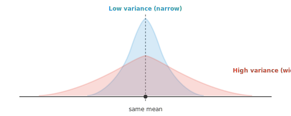
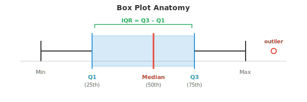
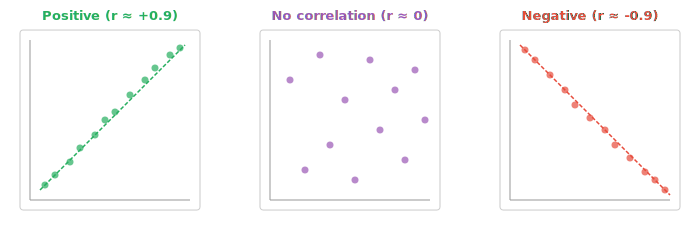

# 统计测度

*统计测度用单个数字总结数据，捕捉散布、位置、形状和关联。本文件涵盖 variance、standard deviation、四分位数、skewness、kurtosis、covariance（协方差）、correlation（相关）以及 z 分数——ML 中探索性数据分析与特征工程的工具箱。*

- 在上一文件中，我们把矩作为一族总结统计量引入。这里我们展开由此衍生的实用工具：散布、位置、形状和关联的测度。

- **散布** 回答的问题是：数据有多分散？两个教室可以有相同的平均分，但散布差异很大。



- 窄（蓝色）分布的 variance 低：大多数值紧密聚集在 mean 附近。宽（红色）分布的 variance 高：数值散布得更远。

- **Variance（方差）** 是到均值的平均平方距离。我们平方是为了避免正负偏差相互抵消。

$$\sigma^2 = \frac{1}{N} \sum_{i=1}^{N} (x_i - \mu)^2$$

- 当使用 sample（而非全部 population）时，我们除以 $N - 1$ 而非 $N$。这一修正（称为 Bessel 修正）考虑到 sample 往往低估真实变异程度：

$$s^2 = \frac{1}{N-1} \sum_{i=1}^{N} (x_i - \bar{x})^2$$

- **Standard deviation（标准差）** 是 variance 的平方根：$\sigma = \sqrt{\sigma^2}$。它把测度还原到原始单位。如果你的数据以厘米为单位，variance 的单位是 cm$^2$，但 standard deviation 又回到 cm。

- **平均绝对偏差（MAD）** 是一种更简单的替代。不求平方，而是取每个偏差的绝对值：

$$\text{MAD} = \frac{1}{N} \sum_{i=1}^{N} |x_i - \mu|$$

- MAD 对离群点更稳健，因为它不通过平方放大较大偏差。不过 variance 在数学上更方便（在证明和 ML optimization 中能很好地分解）。

- **位置** 回答另一个问题：某个具体值相对其他数据处于何处？

- **四分位数** 把已排序数据分成四个相等的部分。Q1（第 25 百分位数）是低于该值有 25% 数据落在其下的值。Q2 是 median（第 50 百分位数）。Q3 是第 75 百分位数。

- **四分位距（IQR）** 是 $Q3 - Q1$。它捕捉中间 50% 数据的散布，忽略极端值。



- 箱线图是统计学中最有用的可视化之一。箱子从 Q1 延伸到 Q3，箱内的线是 median，须延伸到最极端的非离群点值，须之外的点是离群点。

- **百分位数** 推广了四分位数。第 $p$ 百分位数是低于该值有 $p\%$ 观测落在其下的值。Q1 是第 25 百分位数，median 是第 50，Q3 是第 75。

- **z 分数** 告诉你一个值离均值有多少个 standard deviation：

$$z = \frac{x - \mu}{\sigma}$$

- z 分数为 2 意味着该值高于均值 2 个 standard deviation。z 分数为 $-1.5$ 意味着低于均值 1.5 个。这也叫 **标准化**，在 ML 中大量用于特征缩放，它把任何 distribution 变换为 mean 为 0、standard deviation 为 1。

- **形状** 描述 distribution 在中心和散布之外的几何特征。

- **Skewness**（上一文件中的标准化 3 阶矩）衡量不对称性。像正态曲线这样完全对称的 distribution，skewness 为零。正 skewness 意味着右尾更长（例如收入分布）。负 skewness 意味着左尾更长（例如退休年龄）。

$$\text{Skewness} = \frac{1}{N} \sum_{i=1}^{N} \left(\frac{x_i - \mu}{\sigma}\right)^3$$

- **Kurtosis**（标准化 4 阶矩）衡量尾部重量。正态分布的 kurtosis 为 3。尾部更重（更易出现离群点）的 distribution，kurtosis 大于 3。

$$\text{Kurtosis} = \frac{1}{N} \sum_{i=1}^{N} \left(\frac{x_i - \mu}{\sigma}\right)^4$$

- **Correlation（相关）** 衡量两个变量之间关系的强度和方向。它回答：当一个变量上升时，另一个倾向于上升、下降，还是不变？



- **Pearson 相关**（$r$）衡量 *线性* 关联。范围从 $-1$（完全负相关）经 $0$（无关）到 $+1$（完全正相关）。

$$r = \frac{\sum_{i=1}^{N} (x_i - \bar{x})(y_i - \bar{y})}{\sqrt{\sum (x_i - \bar{x})^2} \cdot \sqrt{\sum (y_i - \bar{y})^2}}$$

- 如果你回忆第 1 章的点积，Pearson correlation 本质上就是 $\mathbf{x}$ 和 $\mathbf{y}$ 去均值后的版本的余弦相似度。

- **Spearman 相关**（$\rho$）衡量 *单调* 关联。它不用原始值，而是先排名，再对排名计算 Pearson correlation。这使它对离群点稳健，即使关系是非线性的也能工作，只要它是一致递增或递减。

- **几何平均** 适用于数值相乘的情形，如增长率。如果你的投资先后增长 10%、20%、30%，平均增长因子并非这些速率的算术平均。而是：

$$\bar{x}_{\text{geo}} = \left(\prod_{i=1}^{N} x_i\right)^{1/N}$$

- 对增长率而言，要先把百分比转为因子（1.10、1.20、1.30），计算几何平均，再减去 1。

- **指数移动平均（EMA）** 给近期观测更大权重。不同于窗口内所有点权重相等的简单移动平均，EMA 按指数衰减：

$$\text{EMA}_t = \alpha \cdot x_t + (1 - \alpha) \cdot \text{EMA}_{t-1}$$

- 平滑因子 $\alpha$（介于 0 和 1 之间）控制旧观测失去影响力的速度。$\alpha$ 越高对近期变化越敏感，$\alpha$ 越低越平滑。在 ML 中，EMA 用于 Adam 等优化器以及批归一化中的运行统计量。

- **离群点检测** 识别与其余数据相距异常远的点。两种常见方法：
    - **IQR 法**：若一个点低于 $Q1 - 1.5 \times \text{IQR}$ 或高于 $Q3 + 1.5 \times \text{IQR}$，则为离群点
    - **z 分数法**：若 $|z| > 3$（距均值超过 3 个 standard deviation），则为离群点

- IQR 法更稳健，因为它不假设正态分布。z 分数法在数据近似正态时效果好，但当 distribution 严重偏斜时可能失效。

## 编程任务（使用 CoLab 或 notebook）

1. 计算数据集的 variance、standard deviation 和 MAD 并比较。观察加入极端离群点后会发生什么。
```python
import jax.numpy as jnp

data = jnp.array([4, 8, 6, 5, 3, 7, 9, 5, 6, 7], dtype=jnp.float32)

mean = jnp.mean(data)
variance = jnp.var(data)
std = jnp.std(data)
mad = jnp.mean(jnp.abs(data - mean))

print("Original data:")
print(f"  Variance: {variance:.3f}, Std: {std:.3f}, MAD: {mad:.3f}")

# Add an outlier and recompute
data_outlier = jnp.append(data, 100.0)
mean2 = jnp.mean(data_outlier)
print(f"\nWith outlier (100):")
print(f"  Variance: {jnp.var(data_outlier):.3f}, Std: {jnp.std(data_outlier):.3f}, MAD: {jnp.mean(jnp.abs(data_outlier - mean2)):.3f}")
```

2. 计算两个变量之间的 Pearson 和 Spearman correlation。用不同关系做实验。
```python
import jax
import jax.numpy as jnp

# Perfect linear relationship
x = jnp.array([1, 2, 3, 4, 5, 6, 7, 8], dtype=jnp.float32)
y = 2 * x + 1  # try changing this!

def pearson(a, b):
    a_c = a - jnp.mean(a)
    b_c = b - jnp.mean(b)
    return jnp.sum(a_c * b_c) / (jnp.sqrt(jnp.sum(a_c**2)) * jnp.sqrt(jnp.sum(b_c**2)))

def spearman(a, b):
    rank_a = jnp.argsort(jnp.argsort(a)).astype(jnp.float32)
    rank_b = jnp.argsort(jnp.argsort(b)).astype(jnp.float32)
    return pearson(rank_a, rank_b)

print(f"Pearson r:  {pearson(x, y):.4f}")
print(f"Spearman ρ: {spearman(x, y):.4f}")
```

3. 用 IQR 法和 z 分数法分别实现离群点检测，然后在偏斜数据上比较两者结果。
```python
import jax.numpy as jnp

data = jnp.array([2, 3, 3, 4, 5, 5, 5, 6, 6, 7, 50], dtype=jnp.float32)

# IQR method
q1, q3 = jnp.percentile(data, 25), jnp.percentile(data, 75)
iqr = q3 - q1
lower, upper = q1 - 1.5 * iqr, q3 + 1.5 * iqr
iqr_outliers = data[(data < lower) | (data > upper)]
print(f"IQR bounds: [{lower:.1f}, {upper:.1f}]")
print(f"IQR outliers: {iqr_outliers}")

# Z-score method
z_scores = (data - jnp.mean(data)) / jnp.std(data)
z_outliers = data[jnp.abs(z_scores) > 3]
print(f"\nZ-scores: {z_scores}")
print(f"Z-score outliers (|z| > 3): {z_outliers}")
```

4. 在带噪声的数据上用不同平滑因子计算并绘制指数移动平均。
```python
import jax.numpy as jnp
import matplotlib.pyplot as plt

# Generate noisy data
key = __import__("jax").random.PRNGKey(0)
noise = __import__("jax").random.normal(key, shape=(50,))
signal = jnp.linspace(0, 5, 50) + noise

def ema(data, alpha):
    result = jnp.zeros_like(data)
    result = result.at[0].set(data[0])
    for t in range(1, len(data)):
        result = result.at[t].set(alpha * data[t] + (1 - alpha) * result[t - 1])
    return result

plt.figure(figsize=(10, 4))
plt.plot(signal, "o", alpha=0.3, label="raw data", color="#999")
for alpha, color in [(0.1, "#e74c3c"), (0.3, "#3498db"), (0.7, "#27ae60")]:
    plt.plot(ema(signal, alpha), label=f"α={alpha}", color=color, linewidth=2)
plt.legend()
plt.title("EMA with different smoothing factors")
plt.show()
```
