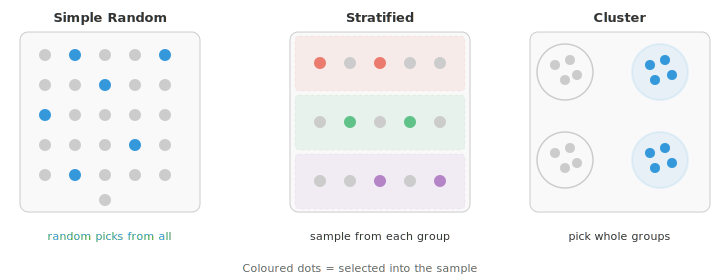
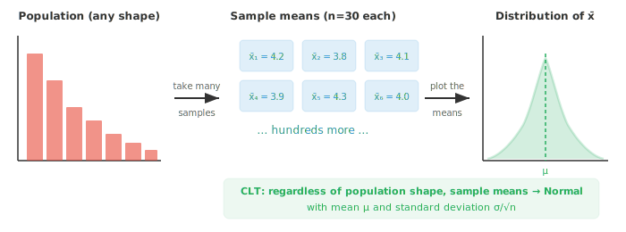

# Выборка

*Выборка определяет то, как мы собираем данные, и напрямую влияет на качество любых выводов, которые мы делаем. В этом файле рассматриваются методы случайной, стратифицированной, кластерной и систематической выборки, выборочные распределения, закон больших чисел и бутстреппинг — методы, необходимые для разделения данных на обучающую и тестовую выборки, а также для подготовки датасетов в машинном обучении.*

- В идеальном мире вы бы измерили каждого представителя интересующей вас группы. На практике это почти никогда невозможно. Нельзя опросить каждого избирателя, протестировать каждую лампочку или просканировать каждого пациента. Поэтому вы берете **выборку** (sample) и используете ее, чтобы сделать выводы обо всей совокупности.

- **Генеральная совокупность** (population) — это полный набор индивидов или объектов, которые вы хотите изучить. **Выборка** — это подмножество, которое вы фактически наблюдаете.

- **Параметр** — это число, описывающее генеральную совокупность (например, истинный средний рост всех взрослых в стране).

- **Статистика** — это число, вычисленное на основе вашей выборки (например, средний рост 500 человек, которых вы измерили). Статистики используются для оценки параметров.

- Качество ваших выводов полностью зависит от того, как вы отбираете выборку. Смещенная выборка ведет к смещенным выводам, независимо от того, насколько сложен ваш анализ.

- **Основа выборки** (sampling frame) — это список всех индивидов, из которых вы фактически формируете выборку. В идеале он должен идеально соответствовать генеральной совокупности, но на практике всегда есть пробелы.

- Например, если вы опрашиваете людей по телефону, вы упускаете всех, у кого телефона нет. Разница между основой выборки и генеральной совокупностью называется **ошибкой охвата** (coverage error).

- **Ошибка выборки** (sampling error) — это естественное расхождение между выборочной статистикой и параметром генеральной совокупности.

- Даже идеально случайная выборка не будет в точности соответствовать генеральной совокупности. Увеличение размера выборки уменьшает ошибку выборки.

- Существует два широких семейства методов выборки: вероятностные и невероятностные.

- **Вероятностная выборка** означает, что каждый член генеральной совокупности имеет известный ненулевой шанс быть выбранным. Это позволяет количественно оценить неопределенность и обобщить результаты.

- **Простая случайная выборка**: каждый индивид имеет равный шанс быть выбранным, и любая возможная выборка размера $n$ равновероятна. Представьте, что вы положили все имена в шляпу и вытягиваете их вслепую.

- **Стратифицированная выборка**: разделите генеральную совокупность на непересекающиеся группы (страты) на основе общего признака (например, возрастная группа, регион), а затем случайным образом выберите элементы из каждой страты. Это гарантирует представительство каждой группы и снижает дисперсию, когда страты отличаются друг от друга.

- **Кластерная выборка**: разделите генеральную совокупность на группы (кластеры), случайным образом выберите несколько кластеров, а затем включите в выборку всех из выбранных кластеров. Это практично, когда совокупность географически распределена, например, при выборе целых школ, а не отдельных учеников по всему району.

- **Систематическая выборка**: выберите случайную отправную точку, а затем выбирайте каждого $k$-го индивида из списка. Например, начните с 7-го человека и берите каждого 10-го (7, 17, 27, ...). Метод прост в реализации, но может внести смещение, если в списке есть скрытая закономерность.



- **Невероятностная выборка** не дает каждому члену известный шанс на выбор. Результаты нельзя строго обобщить, но эти методы часто быстрее и дешевле.

- **Удобная выборка** (convenience sampling): выбирайте тех, до кого проще всего добраться. Опрос людей в торговом центре удобен, но упускает тех, кто там не бывает.

- **Квотная выборка**: как и стратифицированная, но без случайности. Исследователь заполняет квоты (например, 50 мужчин и 50 женщин), выбирая доступных индивидов из каждой группы.

- **Метод «снежного кома»** (snowball sampling): начните с нескольких участников и попросите их привлечь других. Полезно для труднодоступных групп (например, при изучении редких заболеваний), но сильно смещено в сторону связанных между собой индивидов.

- Как только вы выбрали метод выборки, возникает естественный вопрос: если я возьму другую выборку, получу ли я другую статистику? Почти наверняка да. **Выборочное распределение** (sampling distribution) — это распределение статистики (например, выборочного среднего) по всем возможным выборкам одного и того же размера.

- Представьте, что вы взяли 1000 разных выборок по 30 человек и вычислили средний рост для каждой. Эти 1000 средних значений образуют распределение. Некоторые будут немного выше истинного среднего по совокупности, некоторые — немного ниже, а большинство сгруппируется вокруг истинного значения.

- Стандартное отклонение этого выборочного распределения называется **стандартной ошибкой** (standard error):

$$SE = \frac{\sigma}{\sqrt{n}}$$

- Заметьте, что стандартная ошибка уменьшается по мере роста $n$. Большие выборки дают более точные оценки. Увеличение размера выборки в четыре раза уменьшает стандартную ошибку вдвое.

- Самый важный результат в статистике — **Центральная предельная теорема (ЦПТ)**. Она гласит: независимо от формы исходной совокупности, распределение выборочных средних приближается к нормальному распределению по мере увеличения размера выборки.



- Точнее, если $X_1, X_2, \ldots, X_n$ — независимые наблюдения из любого распределения со средним $\mu$ и конечной дисперсией $\sigma^2$, то по мере роста $n$:

$$\bar{X} \approx \text{Normal}\!\left(\mu, \frac{\sigma^2}{n}\right)$$

- Именно ЦПТ делает работу большинства методов статистического вывода возможной. Она позволяет нам использовать нормальное распределение в качестве аппроксимации, даже когда исходные данные не являются нормальными, при условии, что выборка достаточно велика.

- Насколько «достаточно велика»? Общее эмпирическое правило — $n \ge 30$, но это зависит от того, насколько распределение отличается от нормального. Для сильно скошенных распределений может потребоваться больше. Для примерно симметричных совокупностей может быть достаточно даже $n = 10$.

- У ЦПТ есть три ключевых условия:
    - **Независимость**: каждое наблюдение не должно влиять на другие.
    - **Конечная дисперсия**: дисперсия совокупности должна существовать (это исключает некоторые экзотические распределения).
    - **Одинаковое распределение**: все наблюдения взяты из одного и того же распределения.

## Задачи по программированию (используйте CoLab или ноутбук)

1. Визуально продемонстрируйте ЦПТ: извлеките выборки из сильно скошенного распределения, вычислите выборочные средние и пронаблюдайте, как гистограмма средних принимает колоколообразную форму.
```python
import jax
import jax.numpy as jnp
import matplotlib.pyplot as plt

key = jax.random.PRNGKey(0)

# Exponential distribution (very skewed)
population = jax.random.exponential(key, shape=(100_000,))

fig, axes = plt.subplots(1, 4, figsize=(14, 3))
sample_sizes = [1, 5, 30, 100]

for ax, n in zip(axes, sample_sizes):
    keys = jax.random.split(key, 2000)
    means = jnp.array([jax.random.choice(k, population, shape=(n,)).mean() for k in keys])
    ax.hist(means, bins=40, color="#3498db", alpha=0.7, density=True)
    ax.set_title(f"n = {n}")
    ax.set_xlim(0, 4)

fig.suptitle("CLT: sample means become normal as n increases", fontsize=13)
plt.tight_layout()
plt.show()
```

2. Сравните простое случайное сэмплирование со стратифицированным сэмплированием. Создайте генеральную совокупность с четко выраженными группами и покажите, что стратифицированное сэмплирование обеспечивает меньшую дисперсию оценок.
```python
import jax
import jax.numpy as jnp

key = jax.random.PRNGKey(42)

# Population: two distinct groups
group_a = jax.random.normal(key, shape=(500,)) + 10   # mean ~10
key, subkey = jax.random.split(key)
group_b = jax.random.normal(subkey, shape=(500,)) + 20  # mean ~20
population = jnp.concatenate([group_a, group_b])

# Simple random sampling: 1000 trials, sample size 20
srs_means = []
for i in range(1000):
    key, subkey = jax.random.split(key)
    sample = jax.random.choice(subkey, population, shape=(20,), replace=False)
    srs_means.append(sample.mean())
srs_means = jnp.array(srs_means)

# Stratified sampling: 10 from each group
strat_means = []
for i in range(1000):
    key, k1, k2 = jax.random.split(key, 3)
    s_a = jax.random.choice(k1, group_a, shape=(10,), replace=False)
    s_b = jax.random.choice(k2, group_b, shape=(10,), replace=False)
    strat_means.append(jnp.concatenate([s_a, s_b]).mean())
strat_means = jnp.array(strat_means)

print(f"Simple Random - Mean: {srs_means.mean():.3f}, Std: {srs_means.std():.3f}")
print(f"Stratified    - Mean: {strat_means.mean():.3f}, Std: {strat_means.std():.3f}")
print(f"Stratified sampling reduced variance by {(1 - strat_means.var()/srs_means.var())*100:.1f}%")
```

3. Исследуйте, как размер выборки влияет на стандартную ошибку. Постройте график зависимости стандартной ошибки от размера выборки и подтвердите соотношение $1/\sqrt{n}$.
```python
import jax
import jax.numpy as jnp
import matplotlib.pyplot as plt

key = jax.random.PRNGKey(7)
population = jax.random.normal(key, shape=(50_000,)) * 10 + 50

sample_sizes = [5, 10, 20, 50, 100, 200, 500, 1000]
std_errors = []

for n in sample_sizes:
    means = []
    for _ in range(500):
        key, subkey = jax.random.split(key)
        sample = jax.random.choice(subkey, population, shape=(n,))
        means.append(sample.mean())
    std_errors.append(jnp.array(means).std())

plt.figure(figsize=(8, 4))
plt.plot(sample_sizes, std_errors, "o-", color="#e74c3c", label="Observed SE")
theoretical = population.std() / jnp.sqrt(jnp.array(sample_sizes, dtype=jnp.float32))
plt.plot(sample_sizes, theoretical, "--", color="#3498db", label="σ/√n (theoretical)")
plt.xlabel("Sample size (n)")
plt.ylabel("Standard error")
plt.legend()
plt.title("Standard error shrinks with larger samples")
plt.show()
```
