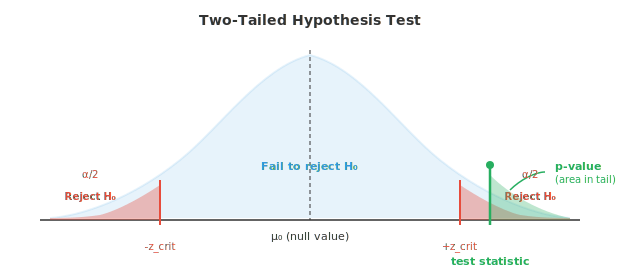
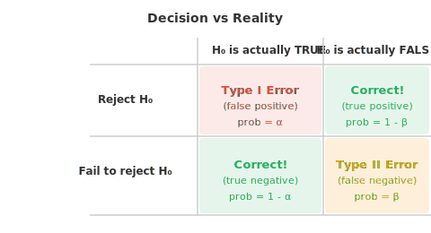

# Проверка гипотез

*Проверка гипотез предоставляет строгий математический аппарат для принятия решений о том, являются ли наблюдаемые эффекты реальными или случайными. В этом файле рассматриваются нулевая и альтернативная гипотезы, p-значения, уровни значимости, t-критерии, критерий хи-квадрат, дисперсионный анализ (ANOVA), ошибки I и II рода, а также логика, используемая в A/B-тестировании, сравнении моделей и научных исследованиях.*

- Статистика — это не только описание данных. Часто вам необходимо принять решение: работает ли новое лекарство? Является ли один алгоритм быстрее другого? Изменилось ли среднее значение? Проверка гипотез дает структурированный подход для ответа на эти вопросы с использованием данных.

- Идея проста: предположите, что ничего не изменилось («нулевая гипотеза»), а затем проверьте, являются ли данные настолько экстремальными, что в это предположение становится трудно поверить.

- **Нулевая гипотеза** ($H_0$) — это утверждение по умолчанию, обычно означающее «отсутствие эффекта» или «отсутствие различий». Например: «среднее время доставки по-прежнему составляет 30 минут» или «новая модель не лучше старой».

- **Альтернативная гипотеза** ($H_1$ или $H_a$) — это то, что вы подозреваете вместо этого: «среднее время доставки изменилось» или «новая модель лучше».

- Вы никогда не доказываете $H_1$ напрямую. Вместо этого вы задаетесь вопросом: если бы $H_0$ была верна, какова вероятность увидеть столь экстремальные данные? Если она крайне мала, вы отвергаете $H_0$ в пользу $H_1$.

- **Статистический критерий** (test statistic) — это число, которое обобщает, насколько результат вашей выборки отклоняется от того, что предсказывает $H_0$. В разных тестах используются разные формулы, но логика всегда одна: измерить расстояние между наблюдаемым и ожидаемым значениями.

- **p-значение** (p-value) — это вероятность наблюдения статистического критерия, по меньшей мере столь же экстремального, как ваш, при условии, что $H_0$ верна. Малое p-значение означает, что данные выглядят удивительными при верной $H_0$.

- **Уровень значимости** ($\alpha$) — это порог, который вы устанавливаете до анализа данных. Если $p \le \alpha$, вы отвергаете $H_0$. Обычно выбирают $\alpha = 0.05$ (5%) и $\alpha = 0.01$ (1%).



- Заштрихованные «хвосты» — это области отклонения. Если ваш статистический критерий попадает туда, данные достаточно удивительны при верной $H_0$, чтобы ее отвергнуть. Зеленая область показывает p-значение для конкретного статистического критерия.

- Пошаговая процедура:
    - **Шаг 1**: Сформулируйте $H_0$ и $H_1$
    - **Шаг 2**: Выберите уровень значимости $\alpha$
    - **Шаг 3**: Соберите данные и вычислите статистический критерий
    - **Шаг 4**: Найдите p-значение (или сравните статистический критерий с критическим значением)
    - **Шаг 5**: Если $p \le \alpha$, отвергните $H_0$. В противном случае не удается отвергнуть $H_0$

- **Пример**: Фабрика утверждает, что средняя длина их болтов составляет 10 см. Вы измерили 36 болтов и получили среднее значение выборки 10,3 см. Известное стандартное отклонение генеральной совокупности составляет 0,9 см. Есть ли доказательства того, что среднее значение изменилось?

- $H_0$: $\mu = 10$, $H_1$: $\mu \neq 10$, $\alpha = 0.05$

- Статистический критерий (z-тест, так как $\sigma$ известна, а $n$ велико):

$$z = \frac{\bar{x} - \mu_0}{\sigma / \sqrt{n}} = \frac{10.3 - 10}{0.9 / \sqrt{36}} = \frac{0.3}{0.15} = 2.0$$

- Для двустороннего теста при $\alpha = 0.05$ критические значения равны $\pm 1.96$. Наш $z = 2.0 > 1.96$, поэтому мы отвергаем $H_0$. p-значение составляет приблизительно 0,046, что меньше 0,05.

- Вывод: существуют статистически значимые доказательства того, что средняя длина болта отличается от 10 см.

- **Односторонний тест** проверяет наличие эффекта в одном конкретном направлении ($H_1$: $\mu > 10$ или $\mu < 10$). Весь уровень $\alpha$ приходится на один «хвост», что облегчает отклонение $H_0$ в этом направлении, но делает невозможным обнаружение эффекта в противоположном.

- **Двусторонний тест** проверяет наличие любых различий ($H_1$: $\mu \neq 10$). Уровень $\alpha$ делится между обоими «хвостами» (по $\alpha/2$ на каждый). Это более консервативный подход, но он позволяет обнаружить эффекты в любом направлении.

- Даже при правильной процедуре случаются ошибки. Существует ровно два типа ошибок:



- **Ошибка I рода** (ложноположительный результат): вы отвергаете $H_0$, когда она на самом деле верна. Вероятность этого равна $\alpha$, которую вы контролируете, выбирая уровень значимости. Как пожарная сигнализация, сработавшая при отсутствии пожара.

- **Ошибка II рода** (ложноотрицательный результат): вы не отвергаете $H_0$, когда она на самом деле ложна. Вероятность этого равна $\beta$. Как пожарная сигнализация, которая молчит во время реального пожара.

- **Мощность** (power) равна $1 - \beta$ — это вероятность правильно отвергнуть ложную $H_0$. Более высокая мощность означает, что вы лучше обнаруживаете реальные эффекты. Мощность возрастает, когда:
    - Размер реального эффекта больше (большие различия легче обнаружить)
    - Размер выборки больше (больше данных = выше точность)
    - Уровень значимости $\alpha$ выше (но это повышает риск ошибки I рода)
    - Вариативность ниже (меньше шума)

- Существует противоречие между ошибками I и II рода. Снижение $\alpha$ (большая осторожность в отношении ложноположительных результатов) увеличивает $\beta$ (больше ложноотрицательных результатов). Невозможно минимизировать обе ошибки одновременно при фиксированном размере выборки.

- **Параметрические тесты** предполагают, что данные подчиняются определенному распределению (обычно нормальному). Они более мощные, когда эти предположения выполняются.

- **Z-тест**: сравнивает среднее значение выборки с известным значением, когда $\sigma$ известна, а $n$ велико ($n \ge 30$). Статистический критерий:

$$z = \frac{\bar{x} - \mu_0}{\sigma / \sqrt{n}}$$

- **T-тест**: аналогичен z-тесту, но используется, когда $\sigma$ неизвестна (оценивается по выборке) или $n$ мало. Использует t-распределение, у которого «хвосты» тяжелее, чем у нормального. Более тяжелые «хвосты» учитывают дополнительную неопределенность из-за оценки $\sigma$.

$$t = \frac{\bar{x} - \mu_0}{s / \sqrt{n}}$$

- T-распределение имеет параметр, называемый **числом степеней свободы** ($df = n - 1$). По мере увеличения $df$ t-распределение приближается к нормальному распределению.

- Существует несколько видов t-теста:
    - **Одновыборочный t-тест**: отличается ли среднее значение выборки от конкретного числа?
    - **Двухвыборочный t-тест для независимых выборок**: различаются ли средние значения двух отдельных групп?
    - **Парный t-тест**: различаются ли средние значения двух связанных измерений (например, до и после лечения на одних и тех же субъектах)?

- **ANOVA (дисперсионный анализ)**: проверяет, равны ли средние значения трех или более групп. Вместо проведения нескольких t-тестов (что увеличивает вероятность ошибки I рода), ANOVA выполняет один тест, сравнивая дисперсию между группами с дисперсией внутри групп.

$$F = \frac{\text{variance between groups}}{\text{variance within groups}}$$

- Большое значение $F$-отношения означает, что группы различаются сильнее, чем можно было бы ожидать только за счет случайной вариации.

- **Непараметрические тесты** накладывают меньше допущений относительно распределения данных. Они работают с рангами, а не с исходными значениями, что делает их устойчивыми к выбросам и отклонениям от нормальности.

- **Критерий хи-квадрат** ($\chi^2$): проверяет, соответствуют ли наблюдаемые частоты ожидаемым. Используется для категориальных данных. Например: соответствуют ли пропорции красных, синих и зеленых автомобилей пропорциям, заявленным производителем?

$$\chi^2 = \sum \frac{(O_i - E_i)^2}{E_i}$$

- **U-критерий Манна-Уитни**: непараметрическая альтернатива t-тесту для двух независимых выборок. Он проверяет, имеет ли одна группа тенденцию к большим значениям, чем другая, путем сравнения рангов.

- **Критерий Уилкоксона**: непараметрическая альтернатива парному t-тесту. Сравнивает парные наблюдения, анализируя величину и направление различий.

- **Критерий Краскела-Уоллиса**: непараметрическая альтернатива однофакторному ANOVA. Проверяет, принадлежат ли несколько групп одному и тому же распределению, сравнивая ранги по всем группам.

- **Критерии согласия** проверяют, следует ли набор данных определенному теоретическому распределению. Критерий согласия хи-квадрат сравнивает наблюдаемые частоты в бинах с ожидаемыми частотами при условии гипотетического распределения.

- **Критерии нормальности** специально проверяют, распределены ли данные нормально. К распространенным относятся критерий Шапиро-Уилка (мощный для малых выборок) и критерий Колмогорова-Смирнова (сравнивает эмпирическую функцию распределения выборки с теоретической).

- В машинном обучении проверка гипотез применяется при сравнении производительности моделей. Если модель A достигает точности 92%, а модель B — 91%, является ли это различие реальным или это просто шум? На этот вопрос может ответить парный t-тест, примененный к результатам кросс-валидации.

## Задачи по программированию (используйте CoLab или ноутбук)

1. Выполните z-тест для примера с заводом болтов из текста. Вычислите статистику теста, p-value и примите решение.
```python
import jax.numpy as jnp

x_bar = 10.3    # sample mean
mu_0 = 10.0     # null hypothesis value
sigma = 0.9     # known population std
n = 36           # sample size
alpha = 0.05

# Test statistic
z = (x_bar - mu_0) / (sigma / jnp.sqrt(n))
print(f"z = {z:.4f}")

# p-value (two-tailed) using the normal CDF approximation
# For |z| = 2.0, p ≈ 0.0456
from jax.scipy.stats import norm
p_value = 2 * (1 - norm.cdf(jnp.abs(z)))
print(f"p-value = {p_value:.4f}")
print(f"Reject H₀? {p_value <= alpha}")
```

2. Смоделируйте ошибку I рода: как часто мы ошибочно отвергаем $H_0$, когда она верна? Проведите 10 000 экспериментов и проверьте, соответствует ли частота отклонений значению $\alpha$.
```python
import jax
import jax.numpy as jnp

key = jax.random.PRNGKey(0)
mu_0 = 50.0
sigma = 10.0
n = 30
alpha = 0.05
n_experiments = 10_000

rejections = 0
for i in range(n_experiments):
    key, subkey = jax.random.split(key)
    sample = mu_0 + sigma * jax.random.normal(subkey, shape=(n,))
    z = (sample.mean() - mu_0) / (sigma / jnp.sqrt(n))
    p_value = 2 * (1 - __import__("jax").scipy.stats.norm.cdf(jnp.abs(z)))
    if p_value <= alpha:
        rejections += 1

print(f"Rejection rate: {rejections/n_experiments:.4f}")
print(f"Expected (α):   {alpha}")
```

3. Сравните t-тест и U-критерий Манна-Уитни на двух группах. Сгенерируйте данные, где одна группа имеет немного более высокое среднее значение, и посмотрите, какой тест обнаружит различие.
```python
import jax
import jax.numpy as jnp

key = jax.random.PRNGKey(99)
k1, k2 = jax.random.split(key)

group_a = jax.random.normal(k1, shape=(25,)) * 5 + 100
group_b = jax.random.normal(k2, shape=(25,)) * 5 + 103  # slightly higher mean

# Two-sample t-test (equal variance assumed)
n_a, n_b = len(group_a), len(group_b)
mean_a, mean_b = group_a.mean(), group_b.mean()
pooled_var = ((n_a - 1) * group_a.var() + (n_b - 1) * group_b.var()) / (n_a + n_b - 2)
se = jnp.sqrt(pooled_var * (1/n_a + 1/n_b))
t_stat = (mean_a - mean_b) / se
print(f"T-test statistic: {t_stat:.4f}")

# Mann-Whitney: count how often group_a values beat group_b values
u_stat = jnp.sum(group_a[:, None] < group_b[None, :])
print(f"Mann-Whitney U:   {u_stat}")
print(f"\nGroup A mean: {mean_a:.2f}, Group B mean: {mean_b:.2f}")
```
