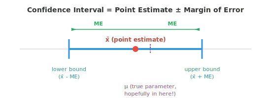
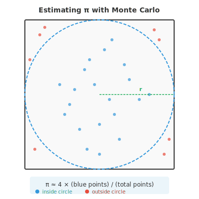

# 统计推断

*统计推断超越非是即否的决定，用量化的不确定性估计 population 参数。本文件涵盖 confidence interval（置信区间）、点估计与区间估计、最大似然估计、矩法以及回归分析——原始数据与 ML 预测模型之间的桥梁。*

- 假设检验给你一个非是即否的决定：拒绝或未能拒绝。但你常常想要更有信息量的东西，即所估计参数的一个可信取值范围。这就是 **confidence interval（置信区间）** 提供的。

- **点估计** 是从你的 sample 计算出的单个数字，如 sample 均值 $\bar{x}$。它是你对 population 参数的最佳猜测，但单凭它无法说明估计有多精确。

- **confidence interval** 用一个反映不确定性的区间包住该点估计。形式为：

$$\text{CI} = \bar{x} \pm \text{ME}$$

- **误差幅度（ME）** 取决于三件事：你想多有信心、数据变异性多大、sample 多大：

$$\text{ME} = z^\ast \cdot \frac{\sigma}{\sqrt{n}}$$

- 这里 $z^\ast$ 是与你期望置信水平对应的正态分布临界值。对 95% 置信，$z^\ast = 1.96$。对 99% 置信，$z^\ast = 2.576$。



- **95% confidence interval** 意味着：如果你反复进行实验并每次构造一个区间，大约 95% 的区间会包含真实 population 参数。它不是说该参数在这个具体区间内的概率是 95%。参数是固定的；变化的是区间。

- **示例**：你测量 50 个人的身高，得到 $\bar{x} = 170$ cm，$\sigma = 8$ cm。构造 95% confidence interval。

$$\text{ME} = 1.96 \cdot \frac{8}{\sqrt{50}} = 1.96 \cdot 1.131 = 2.22 \text{ cm}$$

$$\text{CI} = [170 - 2.22, \; 170 + 2.22] = [167.78, \; 172.22]$$

- 你可以以 95% 的信心说真实平均身高介于 167.78 和 172.22 cm 之间。

- 当 $\sigma$ 未知（常见情况）时，用 sample standard deviation $s$ 和 t 分布代替：

$$\text{CI} = \bar{x} \pm t^\ast_{n-1} \cdot \frac{s}{\sqrt{n}}$$

- 区间越宽越有信心但越不精确。区间越窄越精确但越不有信心。你可以通过增大样本量在不损失信心的前提下缩窄区间。

- **功效分析** 帮助你在跑实验前就规划。问题是：要以指定功效检测给定大小的效应，我需要多大的样本？

- 回忆上一文件，功效 = $1 - \beta$，即正确拒绝一个为假的 $H_0$ 的概率。常见目标是 80% 功效。

- 对 z 检验，在显著性 $\alpha$、功效 $1-\beta$ 下检测差异 $\delta$ 所需的样本量为：

$$n = \left(\frac{(z_{\alpha/2} + z_{\beta}) \cdot \sigma}{\delta}\right)^2$$

- 例如，要在 $\alpha = 0.05$ 和 80% 功效下（$z_{0.025} = 1.96$，$z_{0.20} = 0.84$）检测 2 cm 的平均身高差异（$\sigma = 8$）：

$$n = \left(\frac{(1.96 + 0.84) \cdot 8}{2}\right)^2 = \left(\frac{22.4}{2}\right)^2 = 11.2^2 \approx 126$$

- 你每组大约需要 126 人。

- 功效分析避免两种常见错误：跑的实验太小以致检测不到真实效应（功效不足），或在远大于必要的实验上浪费资源（功效过大）。

- **蒙特卡洛方法** 用随机采样解决难以或无法解析求解的问题。核心思想：如果你无法精确计算某个东西，就多次模拟它，用结果作近似。

- 名字来自蒙特卡洛赌场，致敬随机性的角色。这些方法是 ML 中处理诸如估计积分、评估模型不确定性、逼近复杂 distribution 等任务的主力。

- 一般的蒙特卡洛配方：
    - 定义可能输入的域
    - 从该域生成随机输入
    - 对每个输入求函数值
    - 汇总结果（平均、计数等）

- 一个经典例子是估计 $\pi$。想象一个边长为 2、中心在原点的正方形，内接一个半径为 1 的圆。正方形面积为 4，圆面积为 $\pi$。



- 在正方形中均匀地投随机点。落在圆内的比例近似 $\pi/4$：

$$\pi \approx 4 \times \frac{\text{points inside circle}}{\text{total points}}$$

- 点 $(x, y)$ 在圆内的条件是 $x^2 + y^2 \le 1$。投的点越多，估计就越接近 $\pi$ 的真值。

- 在 ML 中，蒙特卡洛方法出现在：
    - **蒙特卡洛 dropout**：在推理时多次启用 dropout 运行模型，以估计预测不确定性
    - **MCMC（马尔可夫链蒙特卡洛）**：在贝叶斯模型中从复杂后验 distribution 采样
    - **策略梯度方法**：在强化学习中通过采样轨迹估计 gradient

- **因子分析** 是一种发现隐藏（潜在）变量以解释观测变量之间 correlation 的技术。如果 10 个性格调查问题可以由 3 个潜在特质（外向性、宜人性、尽责性）解释，因子分析就能找出这些特质。

- 模型假设每个观测变量 $x_i$ 是少数潜在因子 $f_j$ 的线性组合加噪声：

$$x_i = \lambda_{i1} f_1 + \lambda_{i2} f_2 + \ldots + \lambda_{ik} f_k + \epsilon_i$$

- $\lambda$ 值称为 **因子载荷**，告诉你每个观测变量与每个因子关联多强。这与第 2 章的矩阵分解直接相连；因子分析与特征值分解和 SVD 密切相关。

- **实验设计** 是组织实验以便得出有效结论的艺术。糟糕的设计可能让再大的数据集也毫无用处。

- 设计良好的实验的关键组成部分：
    - **自变量（IV）**：你操纵的东西（如药物剂量、模型架构）
    - **因变量（DV）**：你测量的东西（如康复时间、准确率）
    - **对照组**：不接受处理（或接受安慰剂），为比较提供基线
    - **随机分配**：参与者被随机分配到各组，平衡掉你未测量的混杂变量

- **常见实验设计**：
    - **完全随机设计**：受试者被随机分配到处理组。在各组可比时简单有效。
    - **随机区组设计**：先把受试者按区组分组（如按年龄），再在每个区组内随机分配处理。这能减小来自区组因素的变异，精神上类似分层采样。
    - **析因设计**：同时检验多个 IV。$2 \times 3$ 析因设计有一个变量的 2 个水平和另一个的 3 个水平，共 6 种处理组合。这让你能检测 **交互作用**，即一个变量的效应取决于另一个变量的水平。
    - **交叉设计**：每个受试者依次接受所有处理（中间有洗脱期）。每个受试者作为自己的对照，减小个体差异的影响。

- 在 ML 实验中，这些原则至关重要。比较模型时，你应控制随机种子、数据集划分和硬件。交叉验证是交叉设计的一种形式。消融研究——你一次移除一个组件——遵循析因设计的逻辑。

## 编程任务（使用 CoLab 或 notebook）

1. 为身高示例构造 95% confidence interval，然后用不同置信水平和样本量做实验。
```python
import jax.numpy as jnp

x_bar = 170.0    # sample mean
sigma = 8.0      # population std (known)
n = 50           # sample size

# Critical values for common confidence levels
z_stars = {0.90: 1.645, 0.95: 1.960, 0.99: 2.576}

for conf, z_star in z_stars.items():
    me = z_star * (sigma / jnp.sqrt(n))
    lower, upper = x_bar - me, x_bar + me
    print(f"{conf*100:.0f}% CI: [{lower:.2f}, {upper:.2f}]  (ME = {me:.2f})")
```

2. 用蒙特卡洛模拟估计 $\pi$。绘制随着点数增加估计如何收敛。
```python
import jax
import jax.numpy as jnp
import matplotlib.pyplot as plt

key = jax.random.PRNGKey(42)

# Generate random points in [-1, 1] x [-1, 1]
n_points = 100_000
k1, k2 = jax.random.split(key)
x = jax.random.uniform(k1, shape=(n_points,), minval=-1, maxval=1)
y = jax.random.uniform(k2, shape=(n_points,), minval=-1, maxval=1)

# Check which points are inside the unit circle
inside = (x**2 + y**2) <= 1.0
cumulative_inside = jnp.cumsum(inside)
counts = jnp.arange(1, n_points + 1)
pi_estimates = 4.0 * cumulative_inside / counts

plt.figure(figsize=(10, 4))
plt.plot(pi_estimates, color="#3498db", alpha=0.7, linewidth=0.5)
plt.axhline(y=jnp.pi, color="#e74c3c", linestyle="--", label=f"π = {jnp.pi:.6f}")
plt.xlabel("Number of points")
plt.ylabel("Estimate of π")
plt.title("Monte Carlo estimation of π")
plt.legend()
plt.ylim(2.8, 3.5)
plt.show()

print(f"Final estimate: {pi_estimates[-1]:.6f}")
print(f"True value:     {jnp.pi:.6f}")
print(f"Error:          {abs(pi_estimates[-1] - jnp.pi):.6f}")
```

3. 做一个简单的功效分析：给定效应量和 standard deviation，计算所需样本量并用模拟验证。
```python
import jax
import jax.numpy as jnp

# Parameters
delta = 2.0      # effect size (difference in means)
sigma = 8.0      # population std
alpha = 0.05
power_target = 0.80

# Analytical sample size
z_alpha = 1.96   # two-tailed, alpha=0.05
z_beta = 0.84    # power=0.80
n_required = ((z_alpha + z_beta) * sigma / delta) ** 2
print(f"Required n per group: {n_required:.0f}")

# Verify by simulation
key = jax.random.PRNGKey(7)
n = int(jnp.ceil(n_required))
n_sims = 5000
rejections = 0

for _ in range(n_sims):
    key, k1, k2 = jax.random.split(key, 3)
    group_a = jax.random.normal(k1, shape=(n,)) * sigma + 50
    group_b = jax.random.normal(k2, shape=(n,)) * sigma + 50 + delta
    pooled_se = jnp.sqrt(2 * sigma**2 / n)
    z = (group_b.mean() - group_a.mean()) / pooled_se
    p = 2 * (1 - __import__("jax").scipy.stats.norm.cdf(jnp.abs(z)))
    if p <= alpha:
        rejections += 1

print(f"Simulated power: {rejections/n_sims:.3f}")
print(f"Target power:    {power_target:.3f}")
```

4. 可视化 confidence interval 宽度如何随样本量变化。这展示了为什么收集更多数据给出更精确估计。
```python
import jax.numpy as jnp
import matplotlib.pyplot as plt

sigma = 8.0
z_star = 1.96  # 95% confidence

sample_sizes = jnp.array([10, 20, 30, 50, 100, 200, 500, 1000], dtype=jnp.float32)
margins = z_star * sigma / jnp.sqrt(sample_sizes)

plt.figure(figsize=(8, 4))
plt.bar([str(int(n)) for n in sample_sizes], margins, color="#3498db", alpha=0.7)
plt.xlabel("Sample size")
plt.ylabel("Margin of error (cm)")
plt.title("95% CI margin of error shrinks with larger samples")
plt.show()
```
