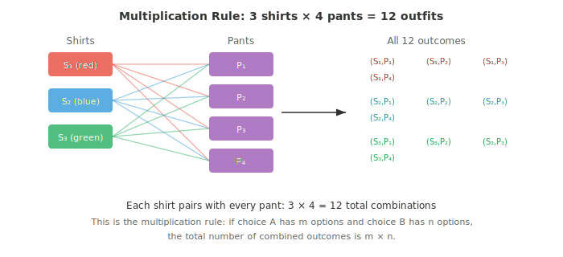
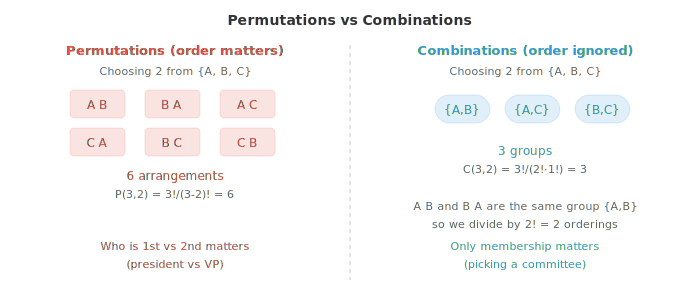

# 计数

*计数是计算概率的前提，在赋予可能性之前，你必须知道共有多少种结果。本文件涵盖乘法法则与加法法则、阶乘、排列、组合以及二项式系数，这些组合工具是机器学习中抽样、哈希和概率分析的基础。*

- 在计算概率之前，我们需要先计数。如果你想知道扑克中抓到一手赢牌的概率，首先需要知道共有多少种可能的牌型，以及其中有多少是赢牌。计数是让概率变得精确的机制。

- 最简单的计数原理是 **multiplication rule**（乘法法则）。如果一个决策有 $m$ 种选择，第二个独立决策有 $n$ 种选择，那么组合结果的总数为 $m \times n$。

- 想象早上穿衣。你有 3 件衬衫和 4 条裤子。每件衬衫都能与每条裤子搭配，因此共有 $3 \times 4 = 12$ 种穿搭。



- 乘法法则可以推广到任意多个选择。如果你还有 2 双鞋，总穿搭数变为 $3 \times 4 \times 2 = 24$。每增加一个独立选择，计数就乘以相应的倍数。

- **addition rule**（加法法则）处理 "或" 的情形。如果事件 A 有 $m$ 种发生方式，事件 B 有 $n$ 种发生方式，且两者不能同时发生（互斥），那么总方式数为 $m + n$。

- 假设你可以从城市 X 乘车（3 条路线）或乘火车（2 条路线）到达城市 Y。你无法同时选择两者，因此总选项为 $3 + 2 = 5$。

- 当事件有重叠时，需要减去重复计数的结果。如果 $A$ 与 $B$ 可以同时发生，计数为 $|A \cup B| = |A| + |B| - |A \cap B|$。这就是容斥原理，我们在讨论概率加法法则时还会再次遇到它。

- 非负整数 $n$ 的 **factorial**（阶乘）是所有不超过 $n$ 的正整数之积：

$$n! = n \times (n-1) \times (n-2) \times \cdots \times 2 \times 1$$

- 可以把阶乘理解为回答：有多少种方式将 $n$ 个不同物体排成一列？书架上的三本书可以有 $3! = 3 \times 2 \times 1 = 6$ 种排列方式。按约定，$0! = 1$。

- 阶乘增长极其迅速。$10! = 3{,}628{,}800$，而 $20!$ 已超过 $2.4 \times 10^{18}$。这种爆炸式增长正是暴力搜索在组合问题中变得不可行的原因。

- **permutation**（排列）是有序的物体排列。当你从 $n$ 个不同物体中选取 $r$ 个且顺序重要时，排列数为：

$$P(n, r) = \frac{n!}{(n - r)!}$$

- 想象从一个 10 人的社团中选出 president、vice president 和 treasurer。第一个角色有 10 个候选人，第二个有 9 个剩余，第三个有 8 个。于是 $P(10, 3) = 10 \times 9 \times 8 = 720$。公式验证了这一点：$\frac{10!}{7!} = 720$。

- **combination**（组合）是无序的选取。当你从 $n$ 个中选取 $r$ 个且顺序无关时，我们要把冗余的排列方式除掉：

$$C(n, r) = \binom{n}{r} = \frac{n!}{r!(n - r)!}$$

- 记号 $\binom{n}{r}$ 读作 "n choose r"。关键洞见在于：每个组合对应 $r!$ 种排列（被选中的 $r$ 个物体可以以 $r!$ 种方式重排），因此将排列数除以 $r!$。



- 示例：从 10 人的组中，能组成多少个 3 人委员会？顺序无关（没有 president 或 vice president，只有成员），因此使用组合：

$$\binom{10}{3} = \frac{10!}{3! \cdot 7!} = \frac{10 \times 9 \times 8}{3 \times 2 \times 1} = 120$$

- 同样的 10 人能产生 720 种排列，却只有 120 种组合，因为每组 3 人内部有 $3! = 6$ 种排列。

- 组合是概率论的核心。二项式系数 $\binom{n}{r}$ 统计在 $n$ 次试验中恰好得到 $r$ 次成功的方式数，这正是 binomial distribution（二项分布，见文件 03）的核心。

- 让我们做一道结合多种计数思想的经典委员会问题。

- **问题**：一个社团有 8 名男性和 6 名女性。有多少种方式组成一个 5 人委员会，其中恰好包含 3 名男性和 2 名女性？

- **步骤 1**：从 8 名男性中选 3 名。

$$\binom{8}{3} = \frac{8!}{3! \cdot 5!} = \frac{8 \times 7 \times 6}{3 \times 2 \times 1} = 56$$

- **步骤 2**：从 6 名女性中选 2 名。

$$\binom{6}{2} = \frac{6!}{2! \cdot 4!} = \frac{6 \times 5}{2 \times 1} = 15$$

- **步骤 3**：应用乘法法则。每种男性选法都能与每种女性选法配对：

$$56 \times 15 = 840 \text{ 个委员会}$$

- 这种模式——把一个复杂的计数问题拆分为若干独立的子选择再相乘——是组合数学中的标准方法。

- 此外还有 **permutations with repetition**（可重复排列）。当物体可重复时，从 $n$ 种类型中选取 $r$ 个会得到 $n^r$ 种结果。一个使用数字 0-9 的 4 位 PIN 有 $10^4 = 10{,}000$ 种可能。每个位置有 10 种选择，乘法法则处理其余部分。

- **combinations with repetition**（可重复组合，又称 "stars and bars"）统计在允许重复且顺序无关时，从 $n$ 种类型中选取 $r$ 个的方式数：

$$\binom{n + r - 1}{r} = \frac{(n + r - 1)!}{r!(n - 1)!}$$

- 示例：从 4 种冰淇淋口味中选 3 勺（允许重复）得到 $\binom{4 + 3 - 1}{3} = \binom{6}{3} = 20$ 种选择。

- 计数工具箱总结如下：

| 场景 | 公式 |
|---|---|
| 有序、无重复（permutation） | $P(n,r) = \frac{n!}{(n-r)!}$ |
| 无序、无重复（combination） | $\binom{n}{r} = \frac{n!}{r!(n-r)!}$ |
| 有序、可重复 | $n^r$ |
| 无序、可重复 | $\binom{n+r-1}{r}$ |

- 每个涉及等可能结果的概率计算都使用公式 $P(\text{event}) = \frac{\text{favourable outcomes}}{\text{total outcomes}}$。计数同时给出了这两个数字。有了这个基础，我们就准备好在下一文件中正式定义概率本身。

## 编程任务（使用 CoLab 或 notebook）

1. 使用阶乘公式和直接计算分别求 $P(10, 3)$ 和 $\binom{10}{3}$。验证排列数始终是组合数的 $r!$ 倍。
```python
import jax.numpy as jnp
from math import factorial

n, r = 10, 3

perm = factorial(n) // factorial(n - r)
comb = factorial(n) // (factorial(r) * factorial(n - r))

print(f"P({n},{r}) = {perm}")
print(f"C({n},{r}) = {comb}")
print(f"P / C = {perm // comb} (should equal {r}! = {factorial(r)})")
```

2. 用程序求解委员会问题（从 8 名男性中选 3 名，从 6 名女性中选 2 名），并通过枚举所有合法委员会来验证。
```python
from itertools import combinations
from math import factorial

def comb_count(n, r):
    return factorial(n) // (factorial(r) * factorial(n - r))

# Formula approach
men_ways = comb_count(8, 3)
women_ways = comb_count(6, 2)
print(f"Formula: {men_ways} × {women_ways} = {men_ways * women_ways}")

# Enumeration approach
men = [f"M{i}" for i in range(1, 9)]
women = [f"W{i}" for i in range(1, 7)]
count = sum(1 for _ in combinations(men, 3) for _ in combinations(women, 2))
print(f"Enumeration: {count}")
```

3. 统计由 26 个小写字母构成（允许重复）的 4 字符密码共有多少种。再统计不含重复字母的有多少种。
```python
from math import factorial

n = 26
r = 4

with_rep = n ** r
without_rep = factorial(n) // factorial(n - r)

print(f"With repetition:    {with_rep:>10,}")
print(f"Without repetition: {without_rep:>10,}")
print(f"Fraction with repeats: {1 - without_rep/with_rep:.2%}")
```

4. 模拟生日问题：在 $k$ 人的组中，至少两人生日相同的概率是多少？绘制 $k = 1$ 到 $60$ 的概率曲线，并找出概率越过 50% 的位置。
```python
import jax
import jax.numpy as jnp
import matplotlib.pyplot as plt

def birthday_prob_exact(k):
    """Probability of at least one shared birthday in group of k."""
    p_no_match = 1.0
    for i in range(k):
        p_no_match *= (365 - i) / 365
    return 1 - p_no_match

ks = list(range(1, 61))
probs = [birthday_prob_exact(k) for k in ks]

plt.figure(figsize=(8, 4))
plt.plot(ks, probs, color="#3498db", linewidth=2)
plt.axhline(y=0.5, color="#e74c3c", linestyle="--", alpha=0.7, label="50%")
cross = next(k for k, p in zip(ks, probs) if p >= 0.5)
plt.axvline(x=cross, color="#e74c3c", linestyle="--", alpha=0.7)
plt.xlabel("Group size (k)")
plt.ylabel("P(at least one shared birthday)")
plt.title(f"Birthday Problem (crosses 50% at k={cross})")
plt.legend()
plt.grid(alpha=0.3)
plt.show()
```
