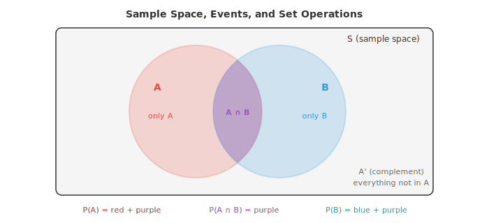
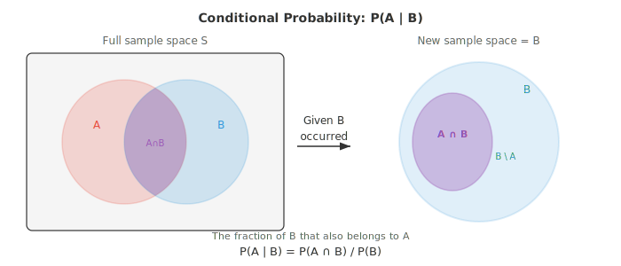
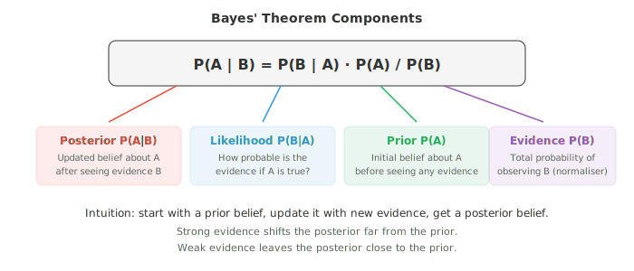

# 概率概念

*概率论（probability theory）将不确定性形式化，并提供了在不确定性下进行推理的规则。本文件涵盖样本空间、事件、概率公理、条件概率、独立性、Bayes 定理，以及频率派与 Bayesian 两种诠释——这是机器学习中每一个生成模型与判别模型背后的数学框架。*

- 概率（probability）给一个事件赋予一个 0 到 1 之间的数，用以衡量它发生的可能性。

- 概率为 0 表示不可能，1 表示必然，0.5 表示一次抛硬币。

- 主要有两种诠释。**频率派（frequentist）**观点认为概率是长期相对频率：把一枚均匀硬币抛 10,000 次，正面大约会出现 50% 的次数。

- **Bayesian** 观点认为概率是一种相信程度：你可以说明天有 70% 的概率下雨，尽管明天只会发生一次。

- 两种诠释使用同一套数学规则。差异是哲学层面的，但在 ML 中很重要。频率派方法给出点估计，Bayesian 方法给出参数的完整分布（distribution）。

- **样本空间（sample space）** $S$ 是一次试验所有可能结果的集合。抛一枚硬币：$S = \{H, T\}$。掷一枚骰子：$S = \{1, 2, 3, 4, 5, 6\}$。

- **事件（event）**是样本空间的任意子集。“掷出偶数”就是事件 $A = \{2, 4, 6\}$，它是 $S$ 的一个子集。

- 当所有结果等可能时，一个事件的概率就是简单的计数（来自 01 文件）：

$$P(A) = \frac{|A|}{|S|} = \frac{\text{favourable outcomes}}{\text{total outcomes}}$$

- 对偶数的例子：$P(\text{even}) = \frac{3}{6} = 0.5$。



- 事件 $A$ 的**补集（complement）**记作 $A'$ 或 $A^c$，是 $S$ 中不属于 $A$ 的所有结果。由于每个结果要么属于 $A$，要么不属于：

$$P(A') = 1 - P(A)$$

- 补集往往是一条更简便的路径。与其去数 5 次抛硬币中至少出现一次正面的所有方式，不如数出一次正面都没有的那一种方式，然后相减：$P(\text{at least one head}) = 1 - P(\text{all tails}) = 1 - (0.5)^5 = 0.969$。

- 两个事件是**互斥（mutually exclusive）**的（不相交），如果它们不能同时发生：$A \cap B = \emptyset$。在同一枚骰子上掷出 2 和掷出 5 是互斥的。

- **互斥事件的加法法则**很直接：

$$P(A \cup B) = P(A) + P(B) \quad \text{(if } A \cap B = \emptyset\text{)}$$

- 当事件可以重叠时，需要**一般加法法则**来避免对交集重复计数：

$$P(A \cup B) = P(A) + P(B) - P(A \cap B)$$

- 这对应计数中的容斥原理。上面的 Venn 图说明了原因：紫色区域（交集）在 $P(A)$ 中被计了一次，在 $P(B)$ 中又被计了一次，所以要减去一次。

- **联合概率（joint probability）**$P(A \cap B)$ 是 $A$ 和 $B$ 同时发生的概率。在一副扑克牌中，$P(\text{red} \cap \text{king}) = \frac{2}{52}$，因为有 2 张红色 K。

- **边缘概率（marginal probability）**是单个事件而不论其他的概率。$P(\text{red}) = \frac{26}{52} = 0.5$ 就是一个边缘概率。如果你有两个变量上的联合分布，边缘分布通过对另一个变量求和（或积分）得到。

- **条件概率（conditional probability）**回答：已知 $B$ 已经发生，$A$ 的概率是多少？我们把样本空间从 $S$ 缩小到 $B$，并问 $B$ 中有多大比例也属于 $A$：

$$P(A | B) = \frac{P(A \cap B)}{P(B)}, \quad P(B) > 0$$



- 例子：你抽一张牌，有人告诉你它是红色的。它是 K 的概率是多少？红色牌有 26 张，其中 2 张是 K，所以 $P(\text{king} | \text{red}) = \frac{2}{26} = \frac{1}{13}$。用公式算：$P(\text{king} \cap \text{red}) / P(\text{red}) = \frac{2/52}{26/52} = \frac{1}{13}$。

- 如果知道一个事件是否发生对另一个事件不提供任何信息，这两个事件就是**独立（independent）**的。形式化地：

$$P(A \cap B) = P(A) \cdot P(B)$$

- 等价地，$P(A | B) = P(A)$。抛两枚独立的硬币是独立事件。不放回地抽两张牌不是独立的（第一次抽取改变了剩余的牌）。

- 独立性是一个极大的简化器。对于独立事件，联合概率可以分解为乘积，使计算变得可行。许多 ML 模型假设特征（feature）之间独立（例如 Naive Bayes），正是出于这种简化。

- 任意两个事件的**乘法法则**重新排列了条件概率公式：

$$P(A \cap B) = P(A | B) \cdot P(B) = P(B | A) \cdot P(A)$$

- 对于独立事件，由于条件概率等于边缘概率，上式简化为 $P(A \cap B) = P(A) \cdot P(B)$。

- **Bayes 定理（Bayes' theorem）**是概率中最重要的结果之一，也是 Bayesian ML 的基础。它让你可以反转条件概率的方向：

$$P(A | B) = \frac{P(B | A) \cdot P(A)}{P(B)}$$

- 该定理直接来自把 $P(A \cap B)$ 写成两种形式：$P(B|A) \cdot P(A) = P(A|B) \cdot P(B)$，然后解出 $P(A|B)$。



- 每个分量都有名字：
    - **Prior** $P(A)$：在看到证据之前的初始信念
    - **Likelihood** $P(B|A)$：假设 $A$ 为真时，证据出现的概率
    - **Evidence** $P(B)$：看到证据的总概率，起归一化作用
    - **Posterior** $P(A|B)$：看到证据后更新的信念

- 我们来做经典的医学诊断例子。假设一种疾病影响 1% 的人口。一项检测该疾病的测试准确率为 95%：它能正确识别 95% 的病人（灵敏度），并正确识别 90% 的健康人（特异度）。

- 你检测为阳性。你真正患病的概率是多少？

- 令 $D$ = 患病，$+$ = 检测为阳性。
    - Prior：$P(D) = 0.01$
    - Likelihood：$P(+ | D) = 0.95$
    - 假阳性率：$P(+ | D') = 0.10$

- 我们需要 $P(+)$。由全概率公式：

$$P(+) = P(+ | D) \cdot P(D) + P(+ | D') \cdot P(D')$$
$$= 0.95 \times 0.01 + 0.10 \times 0.99 = 0.0095 + 0.099 = 0.1085$$

- 现在应用 Bayes 定理：

$$P(D | +) = \frac{P(+ | D) \cdot P(D)}{P(+)} = \frac{0.95 \times 0.01}{0.1085} \approx 0.088$$

- 尽管测试“准确率 95%”，阳性结果只给你大约 8.8% 的患病概率。Prior 至关重要。由于疾病罕见，大多数阳性结果是假阳性。这对 ML 中任何分类问题都是关键洞见：当类别不平衡时，仅看准确率是具有误导性的。

- **全概率公式（law of total probability）**把样本空间划分为互斥且穷尽的事件 $B_1, B_2, \ldots, B_n$，把任意事件 $A$ 表示为：

$$P(A) = \sum_{i=1}^{n} P(A | B_i) \cdot P(B_i)$$

- 这正是我们在医学例子中用来计算 $P(+)$ 的方法：把人口分成“患病”和“不患病”。

- **概率链式法则（chain rule of probability）**把乘法法则推广到任意多的事件：

$$P(A_1 \cap A_2 \cap \cdots \cap A_n) = P(A_1) \cdot P(A_2 | A_1) \cdot P(A_3 | A_1 \cap A_2) \cdots P(A_n | A_1 \cap \cdots \cap A_{n-1})$$

- 每个因子都以前面所有事件为条件。这是自回归语言模型的骨干：一句话的概率是每个单词在给定前面所有单词条件下的概率的乘积。

- **条件独立（conditional independence）**指两个事件在给定第三个事件时独立。若满足下式，则 $A$ 和 $B$ 在给定 $C$ 时条件独立：

$$P(A \cap B | C) = P(A | C) \cdot P(B | C)$$

- 事件可以边缘相关但条件独立，反之亦然。例如，两名学生的考试分数可能相关（都依赖于考试难度），但给定考试难度后，他们的分数是独立的。

- 条件独立是 Bayesian 网络等图模型的关键假设。它让你能把复杂的联合分布分解成可处理的片段，使推断在计算上可行。

## 编程任务（使用 CoLab 或 notebook）

1. 模拟医学诊断问题。生成 100,000 人的种群，应用疾病患病率和测试准确率，验证 Bayes 定理给出正确的 posterior。
```python
import jax
import jax.numpy as jnp

key = jax.random.PRNGKey(42)
n = 100_000

# Generate population
k1, k2 = jax.random.split(key)
has_disease = jax.random.bernoulli(k1, p=0.01, shape=(n,))

# Generate test results
k3, k4 = jax.random.split(k2)
# Sensitivity: P(+|D) = 0.95, Specificity: P(-|D') = 0.90
test_positive = jnp.where(
    has_disease,
    jax.random.bernoulli(k3, p=0.95, shape=(n,)),
    jax.random.bernoulli(k4, p=0.10, shape=(n,))
)

# Among those who tested positive, what fraction actually has the disease?
positives = test_positive.astype(bool)
true_positives = (has_disease & positives).sum()
total_positives = positives.sum()

print(f"Total positive tests: {total_positives}")
print(f"True positives: {true_positives}")
print(f"P(Disease | Positive) = {true_positives / total_positives:.4f}")
print(f"Bayes' formula:         {0.95 * 0.01 / 0.1085:.4f}")
```

2. 通过模拟验证加法法则。生成具有已知概率和重叠的随机事件 A 和 B，然后验证 $P(A \cup B) = P(A) + P(B) - P(A \cap B)$。
```python
import jax
import jax.numpy as jnp

key = jax.random.PRNGKey(0)
n = 200_000
k1, k2 = jax.random.split(key)

# Events: A = value < 0.4, B = value < 0.6 (overlap at < 0.4)
vals_a = jax.random.uniform(k1, shape=(n,))
vals_b = jax.random.uniform(k2, shape=(n,))

A = vals_a < 0.4
B = vals_b < 0.6

p_a = A.mean()
p_b = B.mean()
p_a_and_b = (A & B).mean()
p_a_or_b = (A | B).mean()

print(f"P(A) = {p_a:.4f}")
print(f"P(B) = {p_b:.4f}")
print(f"P(A ∩ B) = {p_a_and_b:.4f}")
print(f"P(A ∪ B) simulated = {p_a_or_b:.4f}")
print(f"P(A) + P(B) - P(A∩B) = {p_a + p_b - p_a_and_b:.4f}")
```

3. 演示条件概率随证据变化。模拟掷两枚骰子，计算 $P(\text{sum} = 7)$，然后计算 $P(\text{sum} = 7 | \text{first die} = 3)$。
```python
import jax
import jax.numpy as jnp

key = jax.random.PRNGKey(1)
n = 500_000
k1, k2 = jax.random.split(key)

d1 = jax.random.randint(k1, shape=(n,), minval=1, maxval=7)
d2 = jax.random.randint(k2, shape=(n,), minval=1, maxval=7)
total = d1 + d2

# Unconditional
p_sum7 = (total == 7).mean()
print(f"P(sum=7) = {p_sum7:.4f} (exact: {6/36:.4f})")

# Conditional on first die = 3
mask = d1 == 3
p_sum7_given_d1_3 = (total[mask] == 7).mean()
print(f"P(sum=7 | d1=3) = {p_sum7_given_d1_3:.4f} (exact: {1/6:.4f})")
```

4. 把 Bayes 定理实现为一个函数，并用它迭代地更新信念。从硬币偏差的均匀 prior 出发，在每次观察到抛掷结果后更新。
```python
import jax.numpy as jnp
import matplotlib.pyplot as plt

def bayes_update(prior, likelihood):
    """Multiply prior by likelihood and normalise."""
    posterior = prior * likelihood
    return posterior / posterior.sum()

# Discretise possible bias values
theta = jnp.linspace(0, 1, 200)
prior = jnp.ones_like(theta)  # uniform prior
prior = prior / prior.sum()

# Observed flips: 1=heads, 0=tails
flips = [1, 1, 0, 1, 1, 1, 0, 1, 0, 1]

plt.figure(figsize=(10, 5))
plt.plot(theta, prior, "--", color="#999", label="prior")

for i, flip in enumerate(flips):
    likelihood = theta if flip == 1 else (1 - theta)
    prior = bayes_update(prior, likelihood)
    if i in [0, 2, 4, 9]:
        plt.plot(theta, prior, label=f"after {i+1} flips", linewidth=2)

plt.xlabel("Coin bias θ")
plt.ylabel("Belief (normalised)")
plt.title("Bayesian updating: belief about coin bias")
plt.legend()
plt.grid(alpha=0.3)
plt.show()
```
