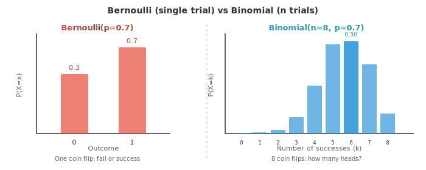
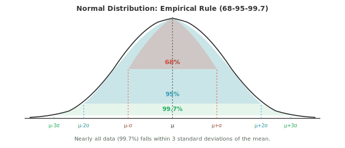
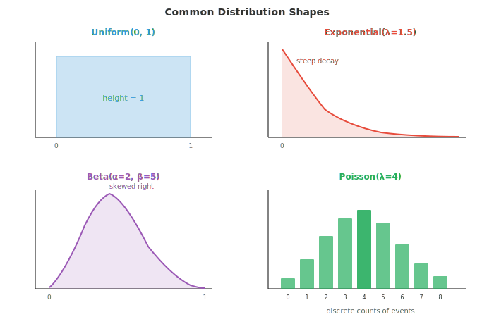

# Вероятностные распределения

*Вероятностные распределения описывают, как случайные исходы распределяются по возможным значениям. В этом файле представлен каталог ключевых дискретных и непрерывных распределений: Бернулли, биномиального, Пуассона, Гаусса, экспоненциального, бета-распределения и других, с приведением формул, интуитивных пояснений и применений в машинном обучении (функции потерь, априорные распределения, модели шума) для каждого из них.*

- В главе 4 мы ввели понятия случайных величин, функций вероятности (PMF), функций плотности вероятности (PDF) и функций распределения (CDF). Здесь мы приводим каталог наиболее важных вероятностных распределений, с которыми вы столкнетесь в машинном обучении и статистике, давая интуитивное понимание, формулу, среднее значение и дисперсию для каждого из них.

- Краткое повторение трех основных функций (полные определения см. в главе 4):
    - **PMF** $P(X = x)$: дает вероятность каждого дискретного исхода. Столбцы на гистограмме.
    - **PDF** $f(x)$: дает плотность в каждой точке для непрерывных переменных. Площадь под кривой между двумя точками — это вероятность.
    - **CDF** $F(x) = P(X \le x)$: кумулятивная вероятность до значения $x$. Всегда принимает значения от 0 до 1 и никогда не убывает.

- **Носитель (support)** распределения — это множество значений, для которых PMF или PDF положительны. Для броска игральной кости носитель равен $\{1,2,3,4,5,6\}$. Для нормального распределения носитель — все вещественные числа $(-\infty, \infty)$.

- Распределения четко делятся на два семейства: дискретные (счетное число исходов, используются PMF) и непрерывные (несчетное число исходов, используются PDF).

- **Распределение Бернулли**: простейшее распределение. Одиночное испытание с двумя исходами: успех (1) с вероятностью $p$ и неудача (0) с вероятностью $1-p$.

$$P(X = x) = p^x (1 - p)^{1-x}, \quad x \in \{0, 1\}$$

- Среднее: $E[X] = p$. Дисперсия: $\text{Var}(X) = p(1-p)$.

- Любое подбрасывание монеты, любая классификация «да/нет», любой бинарный исход — это испытание Бернулли. В машинном обучении выход сигмоидальной функции — это в точности параметр $p$ распределения Бернулли.

- **Биномиальное распределение**: подсчитывает количество успехов в $n$ независимых испытаниях Бернулли, каждое из которых имеет одинаковую вероятность $p$.

$$P(X = k) = \binom{n}{k} p^k (1-p)^{n-k}, \quad k = 0, 1, \ldots, n$$

- Биномиальный коэффициент $\binom{n}{k}$ из файла 01 подсчитывает количество способов расположить $k$ успехов среди $n$ испытаний.

- Среднее: $E[X] = np$. Дисперсия: $\text{Var}(X) = np(1-p)$.



- Пример: подбросить смещенную монету ($p = 0.7$) восемь раз. Вероятность получить ровно 6 «орлов» равна $\binom{8}{6}(0.7)^6(0.3)^2 = 28 \times 0.1176 \times 0.09 \approx 0.296$.

- **Распределение Пуассона**: подсчитывает количество событий за фиксированный интервал времени или пространства при известной средней интенсивности $\lambda$. Полезно, когда события редки и независимы.

$$P(X = k) = \frac{\lambda^k e^{-\lambda}}{k!}, \quad k = 0, 1, 2, \ldots$$

- Среднее: $E[X] = \lambda$. Дисперсия: $\text{Var}(X) = \lambda$. Равенство среднего и дисперсии — характерное свойство этого распределения.

- Примеры: количество электронных писем в час ($\lambda = 5$), количество опечаток на странице, количество запросов к серверу в секунду. В машинном обучении регрессия Пуассона моделирует данные о количестве, где линейная модель предсказывала бы отрицательные значения.

- При $n \to \infty$ и $p \to 0$ при постоянном значении $np = \lambda$, биномиальное распределение Binomial$(n,p)$ сходится к распределению Пуассона Poisson$(\lambda)$. Именно поэтому распределение Пуассона хорошо работает для редких событий в больших совокупностях.

- **Геометрическое распределение**: подсчитывает количество испытаний до первого успеха. «Сколько раз я подброшу монету, прежде чем выпадет первый орел?»

$$P(X = k) = (1-p)^{k-1} p, \quad k = 1, 2, 3, \ldots$$

- Среднее: $E[X] = 1/p$. Дисперсия: $\text{Var}(X) = (1-p)/p^2$.

- Геометрическое распределение обладает свойством **отсутствия памяти**: вероятность ожидания еще $k$ испытаний до успеха не зависит от того, сколько испытаний вы уже прождали. Это делает его особенным среди дискретных распределений.

- **Отрицательное биномиальное распределение**: обобщает геометрическое распределение, подсчитывая количество испытаний до $r$-го успеха (геометрическое распределение является частным случаем при $r=1$).

$$P(X = k) = \binom{k-1}{r-1} p^r (1-p)^{k-r}, \quad k = r, r+1, r+2, \ldots$$

- Среднее: $E[X] = r/p$. Дисперсия: $\text{Var}(X) = r(1-p)/p^2$.

- Отрицательное биномиальное распределение также используется на практике для моделирования данных о количестве с избыточной дисперсией (когда дисперсия превышает среднее), с чем распределение Пуассона справиться не может.

- Теперь перейдем к непрерывным распределениям.

- **Равномерное распределение**: все значения в интервале $[a, b]$ равновероятны. PDF представляет собой плоский прямоугольник.

$$f(x) = \frac{1}{b - a}, \quad a \le x \le b$$

- Среднее: $E[X] = \frac{a+b}{2}$. Дисперсия: $\text{Var}(X) = \frac{(b-a)^2}{12}$.

- Генераторы случайных чисел используют выборки из равномерного распределения Uniform(0,1) в качестве отправной точки. Другие распределения генерируются путем преобразования этих равномерных выборок.

- **Нормальное (гауссовское) распределение**: самое важное распределение в статистике. Оно возникает естественным образом из центральной предельной теоремы (см. главу 4): средние значения многих независимых случайных величин стремятся к нормальному распределению независимо от исходного распределения.

$$f(x) = \frac{1}{\sigma\sqrt{2\pi}} \exp\!\left(-\frac{(x - \mu)^2}{2\sigma^2}\right)$$

- Среднее: $E[X] = \mu$. Дисперсия: $\text{Var}(X) = \sigma^2$.

- **Стандартное нормальное распределение** имеет $\mu = 0$ и $\sigma = 1$. Любая нормальная переменная $X$ может быть стандартизирована до стандартной нормальной переменной $Z$ с помощью формулы $Z = (X - \mu)/\sigma$.



- **Эмпирическое правило** (правило 68-95-99.7) гласит:
    - Около 68% данных попадает в диапазон $\pm 1\sigma$ от среднего
    - Около 95% попадает в диапазон $\pm 2\sigma$
    - Около 99.7% попадает в диапазон $\pm 3\sigma$

- В машинном обучении нормальные распределения встречаются повсюду: инициализация весов, шум при аугментации данных, предположение, лежащее в основе функции потерь MSE (которая неявно предполагает гауссовские ошибки), и трюк с репараметризацией в вариационных автокодировщиках.

- **Экспоненциальное распределение**: моделирует время между событиями в пуассоновском процессе. Если события происходят с интенсивностью $\lambda$, время ожидания между ними следует экспоненциальному распределению Exponential$(\lambda)$.

$$f(x) = \lambda e^{-\lambda x}, \quad x \ge 0$$

- Среднее: $E[X] = 1/\lambda$. Дисперсия: $\text{Var}(X) = 1/\lambda^2$.

- Подобно геометрическому распределению для дискретных величин, экспоненциальное распределение обладает **отсутствием памяти**: $P(X > s + t | X > s) = P(X > t)$. Вероятность ожидания еще $t$ единиц времени не зависит от того, сколько времени вы уже прождали.

- **Гамма-распределение**: обобщает экспоненциальное. Оно моделирует время до наступления $\alpha$-го события в пуассоновском процессе (экспоненциальное соответствует $\alpha = 1$).

$$f(x) = \frac{\beta^\alpha}{\Gamma(\alpha)} x^{\alpha - 1} e^{-\beta x}, \quad x > 0$$

- Здесь $\alpha$ (форма) управляет формой, а $\beta$ (интенсивность) — масштабом. $\Gamma(\alpha)$ — это гамма-функция, которая расширяет понятие факториала на вещественные числа: $\Gamma(n) = (n-1)!$ для положительных целых чисел.

- Среднее: $E[X] = \alpha/\beta$. Дисперсия: $\text{Var}(X) = \alpha/\beta^2$.

- **Бета-распределение**: определено на интервале $[0, 1]$, что делает его идеальным для моделирования вероятностей, пропорций и долей.

$$f(x) = \frac{x^{\alpha - 1}(1 - x)^{\beta - 1}}{B(\alpha, \beta)}, \quad 0 \le x \le 1$$

- Знаменатель $B(\alpha, \beta) = \frac{\Gamma(\alpha)\Gamma(\beta)}{\Gamma(\alpha + \beta)}$ — это бета-функция, нормировочная константа.

- Среднее: $E[X] = \frac{\alpha}{\alpha + \beta}$. Дисперсия: $\text{Var}(X) = \frac{\alpha\beta}{(\alpha+\beta)^2(\alpha+\beta+1)}$.

- Бета-распределение является сопряженным априорным распределением для распределений Бернулли и биномиального. Это означает, что если ваше априорное распределение — бета-распределение, а данные подчиняются распределению Бернулли, то апостериорное распределение также будет бета-распределением, что делает байесовское обновление аналитически разрешимым. Мы будем использовать это в файле 04.



- **Распределение хи-квадрат** ($\chi^2$): если взять $k$ независимых стандартных нормальных случайных величин и просуммировать их квадраты, результат будет следовать распределению $\chi^2$ с $k$ степенями свободы.

$$f(x) = \frac{1}{2^{k/2}\Gamma(k/2)} x^{k/2 - 1} e^{-x/2}, \quad x > 0$$

- Среднее: $E[X] = k$. Дисперсия: $\text{Var}(X) = 2k$.

- Распределение $\chi^2$ на самом деле является частным случаем гамма-распределения с $\alpha = k/2$ и $\beta = 1/2$. Оно встречается в проверке гипотез (критерий хи-квадрат из главы 4), тестах на согласие и при вычислении доверительных интервалов для дисперсии.

- **t-распределение Стьюдента**: выглядит как нормальное распределение, но с более «тяжелыми» хвостами. Оно возникает, когда вы оцениваете среднее нормально распределенной совокупности по малой выборке, а дисперсия совокупности неизвестна.

$$f(x) = \frac{\Gamma\!\left(\frac{\nu+1}{2}\right)}{\sqrt{\nu\pi}\,\Gamma\!\left(\frac{\nu}{2}\right)} \left(1 + \frac{x^2}{\nu}\right)^{-(\nu+1)/2}$$

- Параметр $\nu$ (ню) — это степени свободы. При $\nu \to \infty$ t-распределение сходится к стандартному нормальному. При малых $\nu$ более тяжелые хвосты придают большую вероятность экстремальным значениям, отражая дополнительную неопределенность из-за малого размера выборки.

- Среднее: $E[X] = 0$ (для $\nu > 1$). Дисперсия: $\text{Var}(X) = \frac{\nu}{\nu - 2}$ (для $\nu > 2$).

- t-распределение используется в t-тестах (глава 4) и появляется в байесовском выводе как маргинальное распределение при интегрировании по неизвестной дисперсии.

- Сводка ключевых распределений:

| Распределение | Тип | Носитель | Среднее | Дисперсия |
|---|---|---|---|---|
| Bernoulli$(p)$ | Дискретное | $\{0,1\}$ | $p$ | $p(1-p)$ |
| Binomial$(n,p)$ | Дискретное | $\{0,\ldots,n\}$ | $np$ | $np(1-p)$ |
| Poisson$(\lambda)$ | Дискретное | $\{0,1,2,\ldots\}$ | $\lambda$ | $\lambda$ |
| Geometric$(p)$ | Дискретное | $\{1,2,3,\ldots\}$ | $1/p$ | $(1-p)/p^2$ |
| Uniform$(a,b)$ | Непрерывное | $[a,b]$ | $(a+b)/2$ | $(b-a)^2/12$ |
| Normal$(\mu,\sigma^2)$ | Непрерывное | $(-\infty,\infty)$ | $\mu$ | $\sigma^2$ |
| Exponential$(\lambda)$ | Непрерывное | $[0,\infty)$ | $1/\lambda$ | $1/\lambda^2$ |
| Gamma$(\alpha,\beta)$ | Непрерывное | $(0,\infty)$ | $\alpha/\beta$ | $\alpha/\beta^2$ |
| Beta$(\alpha,\beta)$ | Непрерывное | $[0,1]$ | $\alpha/(\alpha+\beta)$ | см. выше |
| $\chi^2(k)$ | Непрерывное | $(0,\infty)$ | $k$ | $2k$ |
| Student's $t(\nu)$ | Непрерывное | $(-\infty,\infty)$ | $0$ | $\nu/(\nu-2)$ |

## Задачи по программированию (используйте CoLab или ноутбук)

1. Постройте график функции вероятности (PMF) биномиального распределения для $n=20$ с несколькими значениями $p$. Понаблюдайте, как форма меняется от левосторонней асимметрии к симметричной и правосторонней асимметрии.
```python
import jax.numpy as jnp
import matplotlib.pyplot as plt
from math import comb

n = 20
ks = jnp.arange(0, n + 1)

fig, axes = plt.subplots(1, 3, figsize=(12, 4), sharey=True)
for ax, p, color in zip(axes, [0.2, 0.5, 0.8], ["#e74c3c", "#3498db", "#27ae60"]):
    pmf = jnp.array([comb(n, int(k)) * p**k * (1-p)**(n-k) for k in ks])
    ax.bar(ks, pmf, color=color, alpha=0.7)
    ax.set_title(f"Binomial(n={n}, p={p})")
    ax.set_xlabel("k")
axes[0].set_ylabel("P(X = k)")
plt.tight_layout()
plt.show()
```

2. Проверьте аппроксимацию биномиального распределения распределением Пуассона. Установите $n = 1000$, $p = 0.003$ и сравните Binomial$(n, p)$ с Poisson$(\lambda = np)$.
```python
import jax.numpy as jnp
import matplotlib.pyplot as plt
from math import comb, factorial, exp

n, p = 1000, 0.003
lam = n * p
ks = jnp.arange(0, 15)

binom_pmf = jnp.array([comb(n, int(k)) * p**k * (1-p)**(n-k) for k in ks])
poisson_pmf = jnp.array([lam**k * exp(-lam) / factorial(int(k)) for k in ks])

plt.figure(figsize=(8, 4))
plt.bar(ks - 0.15, binom_pmf, width=0.3, color="#3498db", alpha=0.7, label=f"Binomial({n},{p})")
plt.bar(ks + 0.15, poisson_pmf, width=0.3, color="#e74c3c", alpha=0.7, label=f"Poisson({lam})")
plt.xlabel("k")
plt.ylabel("P(X = k)")
plt.title("Poisson approximation to Binomial")
plt.legend()
plt.show()
```

3. Сгенерируйте выборку из нормального распределения и проверьте правило трех сигм. Посчитайте, какая доля выборочных значений попадает в пределы 1, 2 и 3 стандартных отклонений.
```python
import jax
import jax.numpy as jnp

key = jax.random.PRNGKey(42)
mu, sigma = 5.0, 2.0
samples = mu + sigma * jax.random.normal(key, shape=(100_000,))

for k in [1, 2, 3]:
    within = jnp.abs(samples - mu) <= k * sigma
    print(f"Within {k}σ: {within.mean():.4f} (expected: {[0.6827, 0.9545, 0.9973][k-1]:.4f})")
```

4. Исследуйте бета-распределение, варьируя $\alpha$ и $\beta$. Постройте графики различных форм и посмотрите, как распределение меняется от равномерного к скошенному и концентрированному.

```python
import jax
import jax.numpy as jnp
import matplotlib.pyplot as plt

x = jnp.linspace(0.01, 0.99, 200)

def beta_pdf(x, a, b):
    # Unnormalised for shape comparison
    return x**(a-1) * (1-x)**(b-1)

plt.figure(figsize=(10, 5))
params = [(1,1,"Uniform"), (2,5,"Left skew"), (5,2,"Right skew"),
          (5,5,"Symmetric"), (0.5,0.5,"U-shape")]
colors = ["#999", "#e74c3c", "#3498db", "#27ae60", "#9b59b6"]

for (a, b, label), color in zip(params, colors):
    y = beta_pdf(x, a, b)
    y = y / jnp.trapezoid(y, x)  # normalise
    plt.plot(x, y, label=f"α={a}, β={b} ({label})", color=color, linewidth=2)

plt.xlabel("x")
plt.ylabel("Density")
plt.title("Beta distribution shapes")
plt.legend()
plt.grid(alpha=0.3)
plt.show()
```
