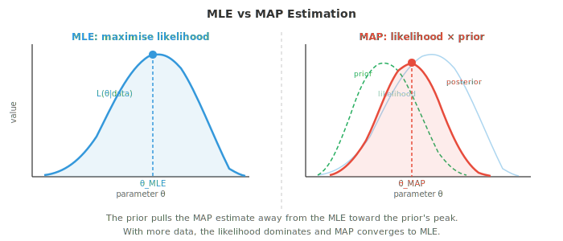
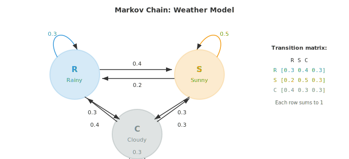
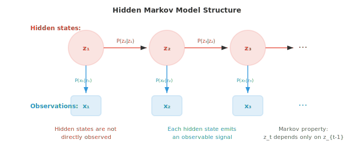

# 贝叶斯方法与序列模型

*贝叶斯方法将先验信念与观测数据结合，得到关于模型参数的后验分布 (posterior distribution)。本文件涵盖极大似然估计、MAP 估计、共轭先验、贝叶斯推断、隐马尔可夫模型以及 EM 算法，这些技术支撑着垃圾邮件过滤器、语言模型以及具有不确定性感知的 ML。*

- 到目前为止，我们已经描述了分布以及如何计算概率。现在我们来 tackle ML 的核心问题：给定观测数据，如何为模型找到最佳参数？

- **极大似然估计 (Maximum Likelihood Estimation, MLE)** 直接回答了这个问题。选择使观测数据最可能的参数值。

- 形式上，给定数据 $D = \{x_1, x_2, \ldots, x_n\}$ 和一个参数为 $\theta$ 的模型，**似然函数 (likelihood function)** 为：

$$L(\theta | D) = P(D | \theta) = \prod_{i=1}^{n} P(x_i | \theta)$$

- 这里的乘积假设数据点是独立同分布 (independent and identically distributed, i.i.d.) 的。MLE 估计为：

$$\hat{\theta}_{\text{MLE}} = \arg\max_\theta L(\theta | D)$$

- 实践中我们改为最大化 **对数似然 (log-likelihood)**，因为 log 把乘积变成求和，并能防止数值下溢：

$$\ell(\theta) = \log L(\theta | D) = \sum_{i=1}^{n} \log P(x_i | \theta)$$

- 由于 $\log$ 单调递增，最大化 $\ell(\theta)$ 的 $\theta$ 也最大化 $L(\theta)$。

- **抛硬币示例**：你抛一枚硬币 10 次得到 7 次正面。硬币偏置 $p$（正面概率）的 MLE 估计是多少？

- 每次抛掷服从 Bernoulli($p$)，所以 10 次中出现 7 次正面的似然为：

$$L(p) = \binom{10}{7} p^7 (1-p)^3$$

- 取对数并求导：$\frac{d\ell}{dp} = \frac{7}{p} - \frac{3}{1-p} = 0$，得到 $\hat{p}_{\text{MLE}} = 7/10 = 0.7$。

- MLE 直观且简单。如果 10 次中得到 7 次正面，最可能的偏置就是 0.7。但注意问题：如果 10 次全是正面，MLE 会给出 $\hat{p} = 1$，意味着硬币永远正面朝上。在仅 10 次观测下，这显得过于自信。

- **最大后验估计 (Maximum A Posteriori, MAP)** 通过加入先验信念来修复这一点。MAP 不再只最大化似然，而是最大化后验 (posterior)：

$$\hat{\theta}_{\text{MAP}} = \arg\max_\theta P(\theta | D) = \arg\max_\theta P(D | \theta) \cdot P(\theta)$$

- 我们略去了分母中的 $P(D)$，因为它不依赖于 $\theta$，不影响 argmax。

- 先验 (prior) $P(\theta)$ 编码了我们在看到数据之前对 $\theta$ 的信念。如果对硬币偏置使用 Beta(2, 2) 先验（表达一种温和的信念：硬币大致是公平的），MAP 估计就不再只是正面的比例，而是被拉向 0.5。



- 使用 Beta($\alpha$, $\beta$) 先验并观测到 $h$ 次正面和 $t$ 次反面时，后验为 Beta($\alpha + h$, $\beta + t$)，MAP 估计为：

$$\hat{p}_{\text{MAP}} = \frac{\alpha + h - 1}{\alpha + \beta + h + t - 2}$$

- 对于使用 Beta(2,2) 先验、7 次正面、3 次反面的示例：$\hat{p}_{\text{MAP}} = \frac{2 + 7 - 1}{2 + 2 + 10 - 2} = \frac{8}{12} = 0.667$。

- 注意 MAP 估计 (0.667) 相比 MLE (0.7) 是如何被拉向 0.5 的。先验起到了正则化 (regularisation) 的作用。在 ML 中，L2 正则化（权重衰减）完全等价于对权重使用高斯先验的 MAP 估计。

- **完全贝叶斯推断 (full Bayesian inference)** 比 MAP 更进一步。它不寻找单一的最优 $\theta$，而是维护整个后验分布 $P(\theta | D)$。这给出的不仅是一个点估计，还有一个不确定性度量。

- 对于使用 Beta(2,2) 先验、7 次正面、3 次反面的偏置硬币，完整后验为 Beta(9, 5)。该分布的均值为 $9/14 \approx 0.643$，其扩散程度告诉我们有多自信。数据越多，后验越窄。

- 三种方法构成一个谱系：
    - **MLE**：无先验，只用数据。快速，但数据少时容易过拟合 (overfitting)。
    - **MAP**：带先验正则化的点估计。增加了鲁棒性。
    - **完全贝叶斯**：整个后验分布。信息最丰富，但通常计算代价高。

- **马尔可夫链 (Markov chains)** 对序列建模，其中下一个状态只依赖当前状态，而不依赖历史。这种“无记忆性”称为 **马尔可夫性质 (Markov property)**：

$$P(X_{t+1} | X_t, X_{t-1}, \ldots, X_1) = P(X_{t+1} | X_t)$$

- 以天气为例。明天的天气依赖今天的天气，而不依赖上周的天气（一种简化，但出奇地有用）。

- 马尔可夫链有一个有限的 **状态 (states)** 集合和一个 **转移矩阵 (transition matrix)** $T$，其中元素 $T_{ij}$ 给出从状态 $i$ 转移到状态 $j$ 的概率。每行之和为 1。



- 对于上面的天气示例，转移矩阵为：

```math
T = \begin{pmatrix} 0.3 & 0.4 & 0.3 \\ 0.2 & 0.5 & 0.3 \\ 0.4 & 0.3 & 0.3 \end{pmatrix}
```

- 如果今天下雨（状态向量 $\mathbf{s}_0 = [1, 0, 0]$），明天天气的概率分布为 $\mathbf{s}_1 = \mathbf{s}_0 T = [0.3, 0.4, 0.3]$。两天后：$\mathbf{s}_2 = \mathbf{s}_0 T^2$。这用到了第 1 章的矩阵乘法。

- 许多马尔可夫链会收敛到一个 **平稳分布 (stationary distribution)** $\pi$，使得 $\pi T = \pi$。无论从哪里开始，经过足够多步后链都会稳定到 $\pi$。这一性质是 MCMC (Markov Chain Monte Carlo) 的基础，后者是贝叶斯 ML 中广泛使用的采样技术。

- **隐马尔可夫模型 (Hidden Markov Models, HMMs)** 通过增加一层间接扩展了马尔可夫链。真实状态是隐藏的（未观测的），在每个时间步隐藏状态发出一个可观测信号。



- 一个 HMM 有三个组成部分：
    - **转移概率 (Transition probabilities)** $P(z_t | z_{t-1})$：隐藏状态如何演化（即马尔可夫链）
    - **发射概率 (Emission probabilities)** $P(x_t | z_t)$：每个隐藏状态产生的可观测输出
    - **初始分布 (Initial distribution)** $P(z_1)$：起始隐藏状态的概率

- **雨伞示例**：假设你无法直接看到天气，但能观察到朋友是否带伞。隐藏状态为 {Rainy, Sunny}，观测为 {Umbrella, No umbrella}。

- 转移概率：$P(\text{Rainy}|\text{Rainy}) = 0.7$，$P(\text{Sunny}|\text{Rainy}) = 0.3$，$P(\text{Rainy}|\text{Sunny}) = 0.4$，$P(\text{Sunny}|\text{Sunny}) = 0.6$。

- 发射概率：$P(\text{Umbrella}|\text{Rainy}) = 0.9$，$P(\text{No umbrella}|\text{Rainy}) = 0.1$，$P(\text{Umbrella}|\text{Sunny}) = 0.2$，$P(\text{No umbrella}|\text{Sunny}) = 0.8$。

- HMM 的关键问题有：
    - **解码 (Decoding)**：给定观测，最可能的隐藏状态序列是什么？由 **Viterbi 算法** 求解。
    - **评估 (Evaluation)**：一个观测序列的概率是多少？由 **Forward 算法** 求解。
    - **学习 (Learning)**：给定观测，最佳模型参数是什么？由 **Baum-Welch 算法** 求解（它是 Expectation-Maximisation 的一个实例）。

- **Viterbi 演练**：假设你观测到 [Umbrella, Umbrella, No umbrella]，想找出最可能的天气序列。

- 从初始概率开始。假设 $P(R) = 0.5$，$P(S) = 0.5$。

- **第 1 天**（观测 Umbrella）：
    - $V_1(R) = P(R) \cdot P(U|R) = 0.5 \times 0.9 = 0.45$
    - $V_1(S) = P(S) \cdot P(U|S) = 0.5 \times 0.2 = 0.10$

- **第 2 天**（观测 Umbrella）：
    - $V_2(R) = \max(V_1(R) \cdot P(R|R), V_1(S) \cdot P(R|S)) \cdot P(U|R)$
    - $= \max(0.45 \times 0.7, 0.10 \times 0.4) \times 0.9 = \max(0.315, 0.04) \times 0.9 = 0.2835$
    - $V_2(S) = \max(V_1(R) \cdot P(S|R), V_1(S) \cdot P(S|S)) \cdot P(U|S)$
    - $= \max(0.45 \times 0.3, 0.10 \times 0.6) \times 0.2 = \max(0.135, 0.06) \times 0.2 = 0.027$

- **第 3 天**（观测 No umbrella）：
    - $V_3(R) = \max(0.2835 \times 0.7, 0.027 \times 0.4) \times 0.1 = 0.1985 \times 0.1 = 0.01985$
    - $V_3(S) = \max(0.2835 \times 0.3, 0.027 \times 0.6) \times 0.8 = 0.08505 \times 0.8 = 0.06804$

- 第 3 天的最大值在 Sunny。回溯：第 3 天 = Sunny（来自 R），第 2 天 = Rainy（来自 R），第 1 天 = Rainy。最可能序列：**Rainy, Rainy, Sunny**。

- **Forward-Backward 算法** 在给定整个观测序列的情况下，计算每个时间步处于每个隐藏状态的概率。前向传递计算 $P(z_t, x_{1:t})$，后向传递计算 $P(x_{t+1:T} | z_t)$。两者相乘得到平滑后的状态概率。

- **Baum-Welch 算法** 在隐藏状态未被观测时从数据中学习 HMM 参数。它是一种 Expectation-Maximisation (EM) 算法：E 步使用 forward-backward 估计是哪些隐藏状态产生了观测，M 步更新转移和发射概率。

- HMM 在历史上曾在语音识别（隐藏的音素状态发出声学信号）和生物信息学（隐藏的基因状态发出 DNA 碱基对）中占主导地位。虽然深度学习已在这些领域基本取代 HMM，但隐藏状态、发射和序列推断的思想仍是序列模型的核心。

- **条件随机场 (Conditional Random Fields, CRFs)** 通过去掉发射上的独立性假设改进了 HMM。在 HMM 中，时刻 $t$ 的观测只依赖时刻 $t$ 的隐藏状态。CRF 允许位置 $t$ 的标签依赖整个输入序列。

- 线性链 CRF 对给定输入序列 $\mathbf{x}$ 下标签序列 $\mathbf{y}$ 的条件概率建模：

$$P(\mathbf{y} | \mathbf{x}) = \frac{1}{Z(\mathbf{x})} \exp\!\left(\sum_t \left[\sum_k \lambda_k f_k(y_t, y_{t-1}, \mathbf{x}, t)\right]\right)$$

- 这里 $f_k$ 是特征函数 (feature functions)（可以查看输入的任意部分），$\lambda_k$ 是学习到的权重，$Z(\mathbf{x})$ 是归一化常数。

- CRF 是判别式模型（直接建模 $P(\mathbf{y}|\mathbf{x})$），而 HMM 是生成式模型（建模 $P(\mathbf{x}, \mathbf{y})$）。这一区别与 logistic regression（判别式）vs Naive Bayes（生成式）相同。

- 在现代 NLP 中，CRF 层常叠加在神经网络之上（BiLSTM-CRF、BERT-CRF），用于命名实体识别和词性标注等任务，这些任务中捕捉标签依赖很重要。

## 编程任务（使用 CoLab 或 notebook）

1. 为抛硬币实验实现 MLE 和 MAP。观察 MAP 估计如何随不同先验和不同数据量而变化。
```python
import jax.numpy as jnp
import matplotlib.pyplot as plt

# Data: observed coin flips
heads, tails = 7, 3

# MLE
p_mle = heads / (heads + tails)
print(f"MLE: {p_mle:.4f}")

# MAP with Beta prior
for alpha, beta in [(1,1), (2,2), (5,5), (10,10)]:
    p_map = (alpha + heads - 1) / (alpha + beta + heads + tails - 2)
    print(f"MAP (Beta({alpha},{beta})): {p_map:.4f}")

# Visualise posterior for Beta(2,2) prior
theta = jnp.linspace(0.01, 0.99, 200)
# Posterior is Beta(alpha+heads, beta+tails)
a_post, b_post = 2 + heads, 2 + tails
posterior = theta**(a_post-1) * (1-theta)**(b_post-1)
posterior = posterior / jnp.trapezoid(posterior, theta)

plt.figure(figsize=(8, 4))
plt.plot(theta, posterior, color="#e74c3c", linewidth=2, label=f"Posterior Beta({a_post},{b_post})")
plt.axvline(p_mle, color="#3498db", linestyle="--", label=f"MLE = {p_mle:.2f}")
plt.axvline((a_post-1)/(a_post+b_post-2), color="#e74c3c", linestyle="--", label=f"MAP = {(a_post-1)/(a_post+b_post-2):.3f}")
plt.xlabel("θ (coin bias)")
plt.ylabel("Density")
plt.title("Posterior distribution after 7H, 3T with Beta(2,2) prior")
plt.legend()
plt.grid(alpha=0.3)
plt.show()
```

2. 为天气模型构建一个马尔可夫链并模拟它。通过模拟以及求解 $\pi T = \pi$ 两种方式计算平稳分布。
```python
import jax
import jax.numpy as jnp

# Transition matrix: R, S, C
T = jnp.array([
    [0.3, 0.4, 0.3],
    [0.2, 0.5, 0.3],
    [0.4, 0.3, 0.3]
])
states = ["Rainy", "Sunny", "Cloudy"]

# Simulate 100,000 steps
key = jax.random.PRNGKey(42)
n_steps = 100_000
state = 0  # start rainy
counts = jnp.zeros(3)

for i in range(n_steps):
    key, subkey = jax.random.split(key)
    state = jax.random.choice(subkey, 3, p=T[state])
    counts = counts.at[state].add(1)

sim_stationary = counts / n_steps
print("Simulated stationary distribution:")
for s, p in zip(states, sim_stationary):
    print(f"  {s}: {p:.4f}")

# Analytical: find left eigenvector with eigenvalue 1
eigenvalues, eigenvectors = jnp.linalg.eig(T.T)
idx = jnp.argmin(jnp.abs(eigenvalues - 1.0))
pi = jnp.real(eigenvectors[:, idx])
pi = pi / pi.sum()
print("\nAnalytical stationary distribution:")
for s, p in zip(states, pi):
    print(f"  {s}: {p:.4f}")
```

3. 为雨伞 HMM 实现 Viterbi 算法并解码一个观测序列。
```python
import jax.numpy as jnp

# HMM parameters
states = ["Rainy", "Sunny"]
obs_names = ["Umbrella", "No umbrella"]

trans = jnp.array([[0.7, 0.3],   # R->R, R->S
                    [0.4, 0.6]])  # S->R, S->S

emit = jnp.array([[0.9, 0.1],    # R->U, R->noU
                   [0.2, 0.8]])   # S->U, S->noU

init = jnp.array([0.5, 0.5])

# Observations: U=0, noU=1
observations = [0, 0, 1]  # Umbrella, Umbrella, No umbrella

def viterbi(obs, init, trans, emit):
    n_states = len(init)
    T = len(obs)
    V = jnp.zeros((T, n_states))
    path = jnp.zeros((T, n_states), dtype=int)

    # Initialisation
    V = V.at[0].set(init * emit[:, obs[0]])

    # Recursion
    for t in range(1, T):
        for j in range(n_states):
            probs = V[t-1] * trans[:, j]
            V = V.at[t, j].set(jnp.max(probs) * emit[j, obs[t]])
            path = path.at[t, j].set(jnp.argmax(probs))

    # Backtrack
    best = [int(jnp.argmax(V[-1]))]
    for t in range(T-1, 0, -1):
        best.insert(0, int(path[t, best[0]]))
    return best, V

decoded, scores = viterbi(observations, init, trans, emit)
print("Observations:", [obs_names[o] for o in observations])
print("Decoded:     ", [states[s] for s in decoded])
```

4. 可视化随着观测更多次抛硬币后验如何演化。从 Beta(1,1) 先验（均匀）开始，每次抛掷后更新。
```python
import jax
import jax.numpy as jnp
import matplotlib.pyplot as plt

theta = jnp.linspace(0.01, 0.99, 300)
key = jax.random.PRNGKey(7)

# True bias = 0.65
flips = jax.random.bernoulli(key, p=0.65, shape=(50,))

plt.figure(figsize=(10, 5))
a, b = 1, 1  # Beta(1,1) = uniform

for n_obs in [0, 1, 5, 10, 25, 50]:
    h = int(flips[:n_obs].sum())
    t = n_obs - h
    a_post = a + h
    b_post = b + t
    y = theta**(a_post-1) * (1-theta)**(b_post-1)
    y = y / jnp.trapezoid(y, theta)
    plt.plot(theta, y, linewidth=2, label=f"n={n_obs} (h={h})")

plt.axvline(0.65, color="black", linestyle=":", alpha=0.5, label="true p=0.65")
plt.xlabel("θ")
plt.ylabel("Density")
plt.title("Bayesian updating: posterior narrows with more data")
plt.legend()
plt.grid(alpha=0.3)
plt.show()
```
