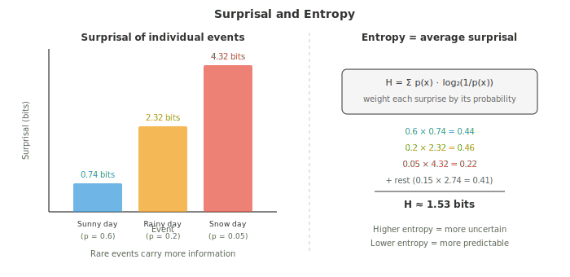
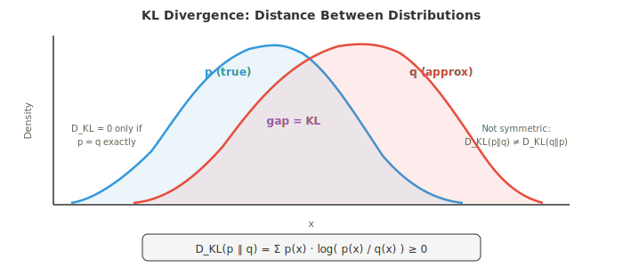

# Теория информации

*Теория информации количественно определяет информацию, удивление и различие между распределениями вероятностей. В этом файле рассматриваются энтропия, кросс-энтропия, KL-дивергенция, взаимная информация и сюрпризал — концепции, лежащие в основе каждой функции потерь для классификации, целевой функции VAE и схемы сжатия данных, используемых в машинном обучении.*

- Теория информации, основанная Клодом Шенноном в 1948 году, дает нам математический аппарат для количественного измерения информации. Она отвечает на такие вопросы, как: насколько сильно вы должны удивиться событию? Сколько информации несет сообщение? Насколько различаются два распределения вероятностей?

- Эти вопросы звучат абстрактно, но они являются фундаментом функций потерь в машинном обучении, сжатия данных и систем связи. Кросс-энтропийная функция потерь, наиболее распространенная функция потерь в задачах классификации, берет свое начало непосредственно из теории информации.

- Начнем с самого простого вопроса: сколько информации несет одно событие?

- **Сюрпризал** (также называемый собственной информацией) измеряет, насколько удивительным является событие. Если происходит что-то очень вероятное, вы почти ничего не узнаете. Если происходит что-то редкое, вы узнаете многое.

- Если вы живете в пустыне и кто-то говорит вам, что светит солнце, это не очень информативно. Если же вам скажут, что идет снег, это крайне информативно. Сюрпризал формализует эту интуицию:

$$I(x) = \log_2 \frac{1}{p(x)} = -\log_2 p(x)$$

- Единицей измерения являются **биты**, когда мы используем $\log_2$. Сюрпризал при подбрасывании честной монеты равен $-\log_2(0.5) = 1$ бит. Событие с вероятностью $1/8$ имеет сюрпризал $\log_2(8) = 3$ бита.

- Почему логарифм, а не просто $1/p$? Три причины:
    - Достоверное событие ($p = 1$) должно давать нулевую информацию: $\log(1) = 0$, но $1/1 = 1$.
    - Независимые события должны обладать аддитивной информацией: $\log(1/p_1 p_2) = \log(1/p_1) + \log(1/p_2)$.
    - Мы хотим получить гладкую, хорошо ведущую себя функцию. $1/p$ стремится к бесконечности; $\log(1/p)$ растет плавно.

- **Энтропия** — это математическое ожидание сюрпризала, среднее количество информации, которое вы получаете на событие, выбранное из распределения. Она измеряет неопределенность или «непредсказуемость» распределения:

$$H(X) = E[I(X)] = -\sum_{x} p(x) \log_2 p(x)$$



- Честная монета имеет энтропию $H = -0.5\log_2(0.5) - 0.5\log_2(0.5) = 1$ бит. Максимальная неопределенность.

- Смещенная монета с $p = 0.9$ имеет энтропию $H = -0.9\log_2(0.9) - 0.1\log_2(0.1) \approx 0.469$ бит. Меньше неопределенности, следовательно, меньше энтропии.

- Детерминированное событие ($p = 1$) имеет энтропию $H = 0$. Полное отсутствие неопределенности.

- Энтропия максимальна, когда все исходы равновероятны. Для $n$ равновероятных исходов $H = \log_2 n$. Честная игральная кость имеет энтропию $\log_2 6 \approx 2.585$ бит.

- Практический смысл энтропии заключается в **сжатии**. Теорема Шеннона о кодировании источника гласит, что вы не можете сжать данные ниже их энтропии без потери информации. Изображение, где каждый пиксель равновероятен (максимальная энтропия), невозможно сжать. Изображение, которое по большей части белое (низкая энтропия), хорошо сжимается.

- Для быстрого понимания масштаба: пиксель в оттенках серого (256 значений) имеет максимальную энтропию 8 бит. Изображение 1080p в оттенках серого содержит не более $1920 \times 1080 \times 8 \approx 16.6$ миллионов бит. Реальные изображения имеют гораздо меньшую энтропию, потому что соседние пиксели коррелируют, именно поэтому работает сжатие JPEG.

- Для непрерывных случайных величин дискретная сумма превращается в интеграл. **Дифференциальная энтропия** равна:

$$h(X) = -\int_{-\infty}^{\infty} f(x) \log f(x)\, dx$$

- Гауссовское распределение с дисперсией $\sigma^2$ имеет дифференциальную энтропию $h = \frac{1}{2}\log_2(2\pi e \sigma^2)$. Среди всех распределений с одинаковой дисперсией гауссовское обладает максимальной энтропией. Это одна из причин, почему гауссовское распределение так часто используется в моделировании: оно делает минимум предположений помимо заданных среднего и дисперсии.

- **Взаимная информация** измеряет, насколько знание одной переменной говорит вам о другой. Это уменьшение неопределенности относительно $X$ при наблюдении $Y$:

$$I(X; Y) = H(X) - H(X|Y) = H(Y) - H(Y|X)$$

- Эквивалентно:

$$I(X; Y) = \sum_{x,y} p(x,y) \log_2 \frac{p(x,y)}{p(x) p(y)}$$

- Если $X$ и $Y$ независимы, $p(x,y) = p(x)p(y)$ и взаимная информация равна нулю. Чем сильнее они зависят друг от друга, тем выше взаимная информация.

- В машинном обучении взаимная информация используется при отборе признаков (выбор признаков с высокой взаимной информацией с целевой переменной), в методах информационного узкого места (information bottleneck) и при оценке качества кластеризации.

- **Кросс-энтропия** измеряет среднее количество бит, необходимое для кодирования событий из распределения $p$ с использованием кода, оптимизированного для распределения $q$:

$$H(p, q) = -\sum_{x} p(x) \log_2 q(x)$$

- Если $q$ идеально совпадает с $p$, кросс-энтропия равна энтропии: $H(p, p) = H(p)$. Если $q$ является плохой аппроксимацией, кросс-энтропия выше. «Лишние» биты возникают из-за несоответствия.

- Именно поэтому кросс-энтропия является стандартной функцией потерь для классификации в машинном обучении. Истинные метки определяют $p$ (one-hot распределение), а предсказанные моделью вероятности определяют $q$. Минимизация кросс-энтропии приближает $q$ к $p$:

$$\mathcal{L} = -\sum_{c} y_c \log \hat{y}_c$$

- Для одного примера с истинным классом $c$ это упрощается до $\mathcal{L} = -\log \hat{y}_c$. Потери — это сюрпризал истинного класса согласно предсказаниям модели. Если модель присваивает высокую вероятность правильному классу, потери низки.

- **KL-дивергенция** (дивергенция Кульбака-Лейблера, также называемая относительной энтропией) измеряет, насколько одно распределение отличается от другого:

$$D_{\text{KL}}(p \| q) = \sum_{x} p(x) \log \frac{p(x)}{q(x)} = H(p, q) - H(p)$$

- KL-дивергенция — это «дополнительная стоимость» использования распределения $q$ вместо истинного распределения $p$. Она всегда неотрицательна ($D_{\text{KL}} \ge 0$) и равна нулю только тогда, когда $p = q$.



- KL-дивергенция несимметрична: $D_{\text{KL}}(p \| q) \ne D_{\text{KL}}(q \| p)$. Эта асимметрия важна. $D_{\text{KL}}(p \| q)$ штрафует $q$ за присвоение низкой вероятности там, где $p$ имеет высокую вероятность (потому что $\log(p/q)$ стремится к бесконечности). $D_{\text{KL}}(q \| p)$ штрафует за обратное.

- Эта асимметрия приводит к двум стилям аппроксимации:
    - Минимизация $D_{\text{KL}}(p \| q)$ порождает поведение **согласования моментов** (moment-matching): $q$ покрывает все моды $p$, но может быть слишком «размытым».
    - Минимизация $D_{\text{KL}}(q \| p)$ порождает поведение **поиска мод** (mode-seeking): $q$ концентрируется на одной моде $p$, но может упустить другие. Именно этот подход используется в вариационном выводе (variational inference).

- Поскольку $H(p)$ является константой относительно модели, минимизация перекрестной энтропии $H(p, q)$ эквивалентна минимизации $D_{\text{KL}}(p \| q)$. Вот почему мы можем использовать функцию потерь на основе перекрестной энтропии, зная, что при этом мы также минимизируем дивергенцию Кульбака — Лейблера между истинным и предсказанным распределениями.

- Дивергенция Кульбака — Лейблера играет центральную роль в **байесовском обновлении**. Апостериорное распределение $P(\theta | D)$ — это распределение, наиболее близкое к априорному $P(\theta)$ (в терминах дивергенции Кульбака — Лейблера) и согласующееся с наблюдаемыми данными. Каждое новое наблюдение обновляет апостериорное распределение, уменьшая неопределенность относительно $\theta$.

- В вариационных автокодировщиках (VAE) функция потерь состоит из двух слагаемых: потерь на реконструкцию (перекрестная энтропия) и члена дивергенции Кульбака — Лейблера, который регуляризует латентное пространство, заставляя его оставаться близким к стандартному нормальному распределению.

- Подводя итог: энтропия показывает внутреннюю неопределенность распределения, перекрестная энтропия — насколько хорошо ваша модель аппроксимирует реальность, а дивергенция Кульбака — Лейблера — разрыв между ними. Эти три величины составляют основу современной оптимизации в машинном обучении.

## Задачи по программированию (используйте CoLab или ноутбук)

1. Вычислите энтропию различных распределений и убедитесь, что равномерное распределение обладает максимальной энтропией для заданного числа исходов.
```python
import jax.numpy as jnp

def entropy(p):
    """Compute entropy in bits. Filter out zero-probability events."""
    p = p[p > 0]
    return -jnp.sum(p * jnp.log2(p))

# Fair die
fair = jnp.ones(6) / 6
print(f"Fair die entropy:   {entropy(fair):.4f} bits (max = log2(6) = {jnp.log2(6.):.4f})")

# Loaded die
loaded = jnp.array([0.1, 0.1, 0.1, 0.1, 0.1, 0.5])
print(f"Loaded die entropy: {entropy(loaded):.4f} bits")

# Deterministic
det = jnp.array([0.0, 0.0, 0.0, 0.0, 0.0, 1.0])
print(f"Deterministic:      {entropy(det):.4f} bits")

# Fair coin
coin = jnp.array([0.5, 0.5])
print(f"Fair coin entropy:  {entropy(coin):.4f} bits")
```

2. Вычислите перекрестную энтропию и дивергенцию Кульбака — Лейблера между истинным распределением и несколькими аппроксимациями. Убедитесь, что $D_{\text{KL}}(p \| q) = H(p, q) - H(p)$.
```python
import jax.numpy as jnp

def cross_entropy(p, q):
    return -jnp.sum(p * jnp.log2(jnp.clip(q, 1e-10, 1.0)))

def kl_divergence(p, q):
    mask = p > 0
    return jnp.sum(jnp.where(mask, p * jnp.log2(p / jnp.clip(q, 1e-10, 1.0)), 0.0))

def entropy(p):
    p = p[p > 0]
    return -jnp.sum(p * jnp.log2(p))

p = jnp.array([0.4, 0.3, 0.2, 0.1])  # true distribution

for name, q in [("perfect match", p),
                ("slight mismatch", jnp.array([0.35, 0.30, 0.25, 0.10])),
                ("big mismatch", jnp.array([0.1, 0.1, 0.1, 0.7]))]:
    h_p = entropy(p)
    h_pq = cross_entropy(p, q)
    kl = kl_divergence(p, q)
    print(f"{name:20s}: H(p)={h_p:.4f}, H(p,q)={h_pq:.4f}, "
          f"KL={kl:.4f}, H(p,q)-H(p)={h_pq-h_p:.4f}")
```

3. Покажите, что дивергенция Кульбака — Лейблера несимметрична, вычислив $D_{\text{KL}}(p \| q)$ и $D_{\text{KL}}(q \| p)$ для двух различных распределений.
```python
import jax.numpy as jnp

def kl_div(p, q):
    mask = p > 0
    return float(jnp.sum(jnp.where(mask, p * jnp.log2(p / jnp.clip(q, 1e-10, 1.0)), 0.0)))

p = jnp.array([0.9, 0.1])
q = jnp.array([0.5, 0.5])

print(f"D_KL(p || q) = {kl_div(p, q):.4f}")
print(f"D_KL(q || p) = {kl_div(q, p):.4f}")
print(f"Not the same! KL divergence is asymmetric.")
```

4. Смоделируйте функцию потерь на основе перекрестной энтропии в процессе обучения. Создайте «истинную» one-hot метку и покажите, как убывают потери по мере улучшения предсказанных моделью вероятностей.
```python
import jax.numpy as jnp
import matplotlib.pyplot as plt

# True label: class 2 out of 4
true_label = jnp.array([0, 0, 1, 0])

# Simulate improving predictions
steps = []
losses = []
for confidence in jnp.linspace(0.25, 0.99, 50):
    # Model becomes more confident in class 2
    remaining = (1 - confidence) / 3
    pred = jnp.array([remaining, remaining, confidence, remaining])
    loss = -jnp.sum(true_label * jnp.log(jnp.clip(pred, 1e-10, 1.0)))
    steps.append(float(confidence))
    losses.append(float(loss))

plt.figure(figsize=(8, 4))
plt.plot(steps, losses, color="#e74c3c", linewidth=2)
plt.xlabel("Model confidence in true class")
plt.ylabel("Cross-entropy loss")
plt.title("Cross-entropy loss decreases as predictions improve")
plt.grid(alpha=0.3)
plt.show()
```
