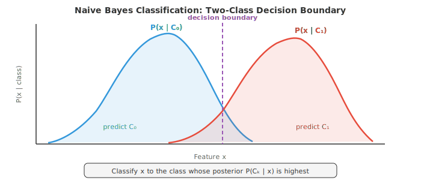
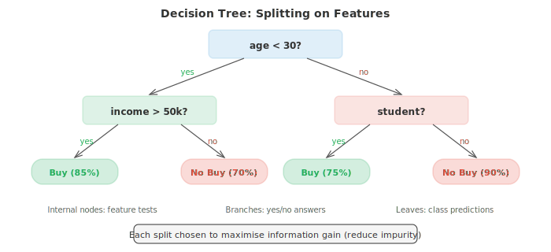
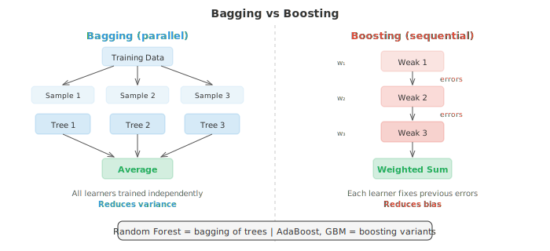
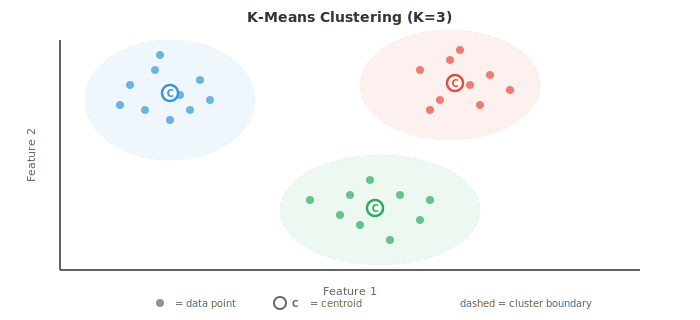
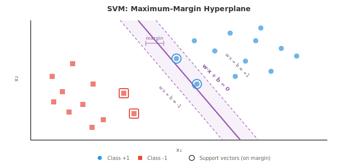

# Классическое машинное обучение

*Алгоритмы классического машинного обучения (ML) изучают закономерности в данных без явного программирования, используя аналитические решения или эвристический поиск, а не градиентный спуск. В этом файле рассматриваются наивный байесовский классификатор, k-NN, деревья решений, случайные леса, SVM, кластеризация k-means и PCA.*

- Машинное обучение — это изучение алгоритмов, которые улучшают свою работу над какой-либо задачей путем обучения на данных, а не посредством явного программирования правил. Вместо того чтобы писать «если доход > 50 тыс. и возраст < 30, то одобрить кредит», вы передаете алгоритму тысячи прошлых решений по кредитам и позволяете ему самому выявить закономерность.

- Существует три основных парадигмы. **Обучение с учителем (supervised learning)** использует размеченные данные, что означает, что для каждого входного значения есть известный правильный ответ. Алгоритм изучает отображение из входных данных в выходные. **Обучение без учителя (unsupervised learning)** работает с неразмеченными данными и пытается обнаружить скрытую структуру, например кластеры или сжатые представления. **Обучение с подкреплением (reinforcement learning)** обучается методом проб и ошибок, получая вознаграждения или штрафы за действия, предпринятые в среде (рассматривается в файле 04).

- В рамках обучения с учителем **классификация** предсказывает дискретные категории (спам или не спам, кошка или собака), в то время как **регрессия** предсказывает непрерывные значения (цена дома, температура завтра). Граница между ними не всегда четкая: логистическая регрессия называется «регрессией», но выполняет классификацию.

- Ключевое различие в вероятностных моделях — это **генеративные и дискриминативные** модели. Генеративная модель изучает совместное распределение $P(x, y)$, что означает, что она понимает, как генерируются сами данные. Она может создавать новые выборки. Дискриминативная модель изучает $P(y \mid x)$ напрямую, фокусируясь только на границе между классами. Наивный байесовский классификатор является генеративным; логистическая регрессия (файл 02) — дискриминативной. Генеративные модели более гибкие, но их сложнее хорошо обучить; дискриминативные модели часто обеспечивают лучшую точность классификации при наличии достаточного количества данных.

- **Наивный байесовский классификатор (Naive Bayes)** — один из самых простых и эффективных классификаторов. Он напрямую применяет теорему Байеса (из главы 05):

$$P(C_k \mid x) = \frac{P(x \mid C_k) \, P(C_k)}{P(x)}$$

- «Наивность» заключается в сильном допущении о независимости: он рассматривает каждый признак как независимый при условии принадлежности к классу. Если вы классифицируете электронные письма как спам, наивный байесовский классификатор предполагает, что наличие слова «бесплатно» ничего не говорит о наличии слова «победитель», если вы уже знаете, что письмо является спамом. В реальности это почти никогда не выполняется, но классификатор тем не менее работает на удивление хорошо.

- Поскольку $P(x)$ одинаково для всех классов, классификация сводится к выбору класса, который максимизирует числитель:

$$\hat{y} = \arg\max_{k} \; P(C_k) \prod_{i=1}^{n} P(x_i \mid C_k)$$

- Априорная вероятность $P(C_k)$ — это просто доля обучающих примеров в каждом классе. Правдоподобие $P(x_i \mid C_k)$ зависит от типа ваших признаков, что порождает три распространенных варианта.

- **Мультиномиальный наивный байесовский классификатор (Multinomial Naive Bayes)** предназначен для данных о частоте, например, частоты слов в документах. Каждый признак $x_i$ представляет собой количество вхождений слова $i$, а правдоподобие следует мультиномиальному распределению. Это стандартный выбор для классификации текста, анализа тональности и фильтрации спама.

- **Гауссов наивный байесовский классификатор (Gaussian Naive Bayes)** предполагает, что каждый признак следует нормальному распределению внутри каждого класса. Вы оцениваете среднее значение $\mu_{ik}$ и дисперсию $\sigma_{ik}^2$ признака $i$ для класса $k$ по обучающим данным, а затем вычисляете:

$$P(x_i \mid C_k) = \frac{1}{\sqrt{2\pi\sigma_{ik}^2}} \exp\!\left(-\frac{(x_i - \mu_{ik})^2}{2\sigma_{ik}^2}\right)$$

- Это естественный выбор, когда ваши признаки являются непрерывными измерениями, такими как рост, вес или показания датчиков.



- **Бернуллиев наивный байесовский классификатор (Bernoulli Naive Bayes)** моделирует бинарные признаки: каждый признак либо присутствует (1), либо отсутствует (0). Вместо подсчета количества вхождений слова вы отслеживаете только факт его наличия. Это хорошо работает для коротких текстов или бинарных векторов признаков.

- Практическая проблема возникает, когда значение признака никогда не встречается с определенным классом в обучающих данных. Правдоподобие становится равным нулю, и, поскольку все перемножается, вся апостериорная вероятность обнуляется. **Сглаживание Лапласа (Laplace smoothing)** исправляет это путем добавления небольшого значения (обычно 1) к каждой комбинации признака и класса:

$$P(x_i \mid C_k) = \frac{\text{count}(x_i, C_k) + \alpha}{\text{count}(C_k) + \alpha \cdot V}$$

- Здесь $\alpha$ — параметр сглаживания (обычно 1), а $V$ — количество возможных значений для этого признака. Это гарантирует, что вероятность никогда не будет в точности равна нулю.

- **Деревья решений (Decision trees)** используют совершенно иной подход. Вместо вычисления вероятностей они разбивают пространство признаков с помощью последовательности вопросов «да/нет». Вспомните игру «Двадцать вопросов»: на каждом шаге вы задаете вопрос, который максимально сужает круг возможностей.

- Дерево начинается в корне со всех обучающих примеров. В каждом внутреннем узле оно выбирает признак и пороговое значение для разбиения (например, «возраст < 30?»). Примеры распределяются влево или вправо в зависимости от ответа. Это продолжается рекурсивно до листьев, которые содержат предсказания: мажоритарный класс для классификации или среднее значение для регрессии.



- Критически важный вопрос: по какому признаку следует выполнять разбиение? Вы хотите получить разбиения, которые создают наиболее «чистые» дочерние узлы, где большинство примеров принадлежат к одному классу. Две распространенные меры примеси — это **индекс Джини (Gini impurity)** и **энтропия**.

- **Индекс Джини** измеряет вероятность того, что случайно выбранный образец будет классифицирован неверно, если его разметить в соответствии с распределением в этом узле:

$$\text{Gini}(S) = 1 - \sum_{k=1}^{K} p_k^2$$

- Если узел идеально чист (все примеры одного класса), индекс Джини равен 0. Если классы сбалансированы поровну (например, 50/50 для двух классов), индекс Джини достигает своего максимума — 0,5.

- **Энтропия** (из раздела по теории информации в главе 05) измеряет среднюю степень неопределенности:

$$H(S) = -\sum_{k=1}^{K} p_k \log_2 p_k$$

- Чистый узел имеет энтропию 0. Идеально сбалансированный бинарный узел имеет энтропию 1 бит. На практике индекс Джини и энтропия дают очень похожие деревья; индекс Джини вычисляется немного быстрее, так как не требует использования логарифма.

- **Информационный выигрыш** — это уменьшение примеси, достигаемое при разбиении. Для разбиения, которое делит множество $S$ на подмножества $S_L$ и $S_R$:

$$\text{IG}(S, \text{split}) = H(S) - \frac{|S_L|}{|S|} H(S_L) - \frac{|S_R|}{|S|} H(S_R)$$

- Алгоритм жадно выбирает разбиение с наибольшим информационным выигрышем в каждом узле. Это локально оптимальная стратегия, а не глобально оптимальная, но она хорошо работает на практике.

- **Деревья регрессии** работают аналогичным образом, но листья предсказывают непрерывное значение (среднее арифметическое примеров, попавших в этот лист), а критерий разбиения использует уменьшение дисперсии вместо индекса Джини или энтропии.

- Если не ограничивать рост дерева решений, оно будет продолжать разбиваться до тех пор, пока каждый лист не станет чистым, по сути, запоминая обучающую выборку. Это приводит к сильному переобучению. **Прунинг** (отсечение) борется с этим. Предварительный прунинг (pre-pruning) устанавливает ограничения до построения дерева: максимальная глубина, минимальное количество примеров в листе или минимальный информационный выигрыш для выполнения разбиения. Пост-прунинг (post-pruning) сначала строит полное дерево, а затем удаляет ветви, которые не улучшают показатели на валидационной выборке.

- Одиночное дерево решений легко интерпретировать, но оно склонно к нестабильности: небольшие изменения в данных могут привести к созданию совершенно другого дерева. **Ансамблевые методы** объединяют множество моделей, чтобы получить более точные предсказания, чем может достичь любая отдельная модель.

- Основная идея заключается в «мудрости толпы». Если опросить 100 посредственных классификаторов и принять решение большинством голосов, ансамбль может стать отличным инструментом, при условии, что отдельные классификаторы допускают в некоторой степени независимые ошибки.

- **Беггинг** (bootstrap aggregating) обучает несколько моделей на разных случайных подмножествах данных, полученных с помощью выборки с возвращением (бутстреп-выборки). Каждая модель видит примерно 63% исходных данных. На этапе предсказания вы усредняете результаты (регрессия) или используете голосование большинством (классификация). Поскольку каждая модель видит разные данные, они совершают разные ошибки, и усреднение нивелирует значительную часть дисперсии.

- **Случайные леса** — это беггинг, примененный к деревьям решений с одним дополнительным нюансом: при каждом разбиении дерево рассматривает только случайное подмножество признаков (обычно $\sqrt{d}$ признаков из общего количества $d$). Это дополнительно снижает корреляцию между деревьями, делая ансамбль еще более мощным. Случайные леса являются одними из самых надежных готовых классификаторов во всем машинном обучении.



- **Бустинг** придерживается противоположной философии. Вместо независимого обучения моделей он обучает их последовательно, причем каждая новая модель фокусируется на примерах, в которых предыдущие модели ошиблись.

- **AdaBoost** (адаптивный бустинг) поддерживает вес для каждого обучающего примера. Изначально все веса равны. После обучения слабого классификатора (часто это очень неглубокое дерево решений, называемое «пеньком») примеры, которые были классифицированы неверно, получают более высокие веса, поэтому следующий классификатор уделяет им больше внимания. Итоговое предсказание — это взвешенное голосование всех классификаторов, где более эффективные модели имеют больший вес:

$$H(x) = \text{sign}\!\left(\sum_{t=1}^{T} \alpha_t \, h_t(x)\right)$$

- Вес $\alpha_t$ для классификатора $t$ зависит от его частоты ошибок $\epsilon_t$:

$$\alpha_t = \frac{1}{2} \ln\!\left(\frac{1 - \epsilon_t}{\epsilon_t}\right)$$

- Классификатор с низкой ошибкой получает большой положительный вес; классификатор, работающий на уровне случайного угадывания ($\epsilon = 0.5$), получает нулевой вес.

- **Градиентный бустинг** обобщает эту идею. Вместо перевзвешивания примеров каждая новая модель обучается предсказывать остаточные ошибки (отрицательный градиент функции потерь) объединенного ансамбля на текущем этапе. Для функции потерь в виде квадратичной ошибки остатки — это буквально разности между предсказаниями и целевыми значениями. Градиентный бустинг на деревьях решений (GBDT) лежит в основе многих победных решений в соревнованиях по работе со структурированными данными (XGBoost, LightGBM, CatBoost — популярные реализации).

- Ключевое различие: беггинг уменьшает **дисперсию** (усредняя шум), в то время как бустинг уменьшает **смещение** (исправляя систематические ошибки). Беггинг лучше всего работает, когда отдельные модели переобучаются; бустинг лучше всего работает, когда они недообучаются.

- Переходя к обучению без учителя, **кластеризация K-средних** является самым простым и наиболее широко используемым алгоритмом кластеризации. Имея $n$ точек данных и целевое количество кластеров $K$, алгоритм назначает каждую точку в одну из $K$ групп, минимизируя суммарное расстояние от каждой точки до центра ее кластера.

- Алгоритм чередует два шага. Во-первых, **назначение** каждой точки ближайшему центроиду. Во-вторых, **обновление** каждого центроида до среднего значения всех точек, назначенных ему. Повторяйте до тех пор, пока назначения не перестанут меняться. Гарантируется, что алгоритм сойдется, так как общее внутрикластерное расстояние уменьшается (или остается прежним) на каждом шаге.



- Формально K-средних минимизирует внутрикластерную сумму квадратов, называемую **инерцией**:

$$J = \sum_{k=1}^{K} \sum_{x \in C_k} \|x - \mu_k\|^2$$

- где $\mu_k$ — центроид кластера $C_k$.

- K-средних чувствителен к инициализации. Плохие начальные центроиды могут привести к попаданию в плохие локальные минимумы. Стратегия инициализации **K-Means++** выбирает первый центроид случайным образом, а затем выбирает каждый последующий центроид с вероятностью, пропорциональной квадрату расстояния до ближайшего существующего центроида. Это позволяет распределить начальные центры и почти всегда дает лучшие результаты.

- Как выбрать $K$? Есть два распространенных инструмента. **Метод локтя** строит график зависимости инерции от $K$ и ищет «локоть» — точку, после которой добавление новых кластеров перестает давать значительный эффект. **Силуэтный коэффициент** измеряет, насколько точка похожа на свой собственный кластер по сравнению с ближайшим другим кластером, принимая значения от -1 (неверный кластер) до +1 (хорошо кластеризована). Средний силуэтный коэффициент по всем точкам дает общую оценку качества кластеризации.

- У K-Means есть ограничения: он предполагает наличие сферических кластеров примерно одинакового размера и выполняет «жесткое» назначение (каждая точка принадлежит ровно одному кластеру). **Гауссовские смеси (Gaussian Mixture Models, GMM)** снимают оба этих ограничения.

- GMM моделирует данные как смесь $K$ гауссовских распределений, каждое из которых имеет свое среднее $\mu_k$, ковариацию $\Sigma_k$ и вес смеси $\pi_k$ (где сумма весов равна 1):

$$P(x) = \sum_{k=1}^{K} \pi_k \, \mathcal{N}(x \mid \mu_k, \Sigma_k)$$

- Вместо жесткого назначения каждая точка получает **мягкое назначение (soft assignment)**: вероятность (называемую «ответственностью»), с которой она принадлежит к каждому кластеру. Точка вблизи границы между двумя гауссианами может на 60% относиться к кластеру A и на 40% — к кластеру B.

- GMM обучаются с помощью **алгоритма максимизации ожидания (Expectation-Maximisation, EM)**, который, подобно K-Means, чередует два шага. **E-шаг** вычисляет ответственности: для каждой точки определяется вероятность того, что она порождена конкретным гауссианом. **M-шаг** обновляет параметры: исходя из вычисленных ответственностей, определяются оптимальные средние, ковариации и веса смеси. Гарантируется, что EM увеличивает правдоподобие данных на каждой итерации и сходится к локальному максимуму.

- K-Means фактически является частным случаем EM для GMM: он соответствует сферическим гауссианам с равной ковариацией и жесткими (0/1) ответственностями.

- **Метод опорных векторов (Support Vector Machines, SVM)** подходит к классификации с геометрической точки зрения. Для двух линейно разделимых классов существует бесконечно много гиперплоскостей, разделяющих их. SVM находит ту, что обладает **максимальным зазором (maximum margin)** — максимально возможным расстоянием между гиперплоскостью и ближайшими точками данных каждого класса.

- Ближайшие точки, расположенные прямо на границе зазора, называются **опорными векторами**. Только они важны для определения границы; если удалить все остальные обучающие точки, гиперплоскость останется прежней.



- Для линейного классификатора $f(x) = w \cdot x + b$ поиск максимального зазора сводится к решению задачи:

$$\min_{w, b} \; \frac{1}{2}\|w\|^2 \quad \text{subject to} \quad y_i(w \cdot x_i + b) \geq 1 \; \text{for all } i$$

- Это задача выпуклого квадратичного программирования, поэтому она имеет единственное глобальное решение (не нужно беспокоиться о локальных минимумах).

- Реальные данные редко бывают идеально разделимыми. **SVM с мягким зазором (soft-margin SVM)** допускает, чтобы некоторые точки нарушали границу зазора, вводя переменные зазора $\xi_i \geq 0$:

$$\min_{w, b, \xi} \; \frac{1}{2}\|w\|^2 + C \sum_{i=1}^{n} \xi_i \quad \text{subject to} \quad y_i(w \cdot x_i + b) \geq 1 - \xi_i$$

- Гиперпараметр $C$ управляет компромиссом: большое $C$ сильно штрафует за ошибки классификации (более жесткая подгонка, риск переобучения), малое $C$ допускает больше нарушений (более широкий зазор, более сильная регуляризация).

- Самая мощная особенность SVM — это **ядерный трюк (kernel trick)**. Многие датасеты, которые не являются линейно разделимыми в исходном пространстве признаков, становятся таковыми при отображении в пространство более высокой размерности. Ядерный трюк позволяет вычислять скалярные произведения в этом многомерном пространстве, не выполняя явного преобразования.

- Ядерная функция $K(x_i, x_j) = \phi(x_i) \cdot \phi(x_j)$ заменяет каждое скалярное произведение в оптимизации SVM. Самым популярным ядром является **радиально-базисная функция (Radial Basis Function, RBF)**:

$$K(x_i, x_j) = \exp\!\left(-\gamma \|x_i - x_j\|^2\right)$$

- RBF-ядро неявно отображает данные в бесконечномерное пространство. Параметр $\gamma$ управляет тем, как далеко распространяется влияние отдельной обучающей точки: большое $\gamma$ означает, что точка влияет только на свою ближайшую окрестность (риск переобучения), малое $\gamma$ дает более гладкие границы.

- Другие распространенные ядра включают полиномиальное ядро $K(x_i, x_j) = (x_i \cdot x_j + c)^d$ и линейное ядро $K(x_i, x_j) = x_i \cdot x_j$ (которое является просто стандартным SVM без каких-либо преобразований).

- На практике SVM с RBF-ядрами были доминирующим классификатором до того, как их вытеснило глубокое обучение. Они по-прежнему хорошо работают на малых и средних датасетах, особенно когда количество признаков велико относительно количества выборок.

- Связь SVM с главой 02 (матрицы) очень глубока. Оптимизация обычно решается в двойственной форме, где решение зависит только от скалярных произведений между обучающими примерами, что и делает возможным ядерный трюк. Весь алгоритм работает на языке скалярных произведений и линейной алгебры.

- Подводя итог классическому инструментарию машинного обучения:

| Алгоритм | Тип | Ключевое преимущество | Ключевой недостаток |
|---|---|---|---|
| Наивный Байес | Обучение с учителем (генеративный) | Быстрый, работает с малым объемом данных | Предположение о независимости |
| Дерево решений | Обучение с учителем | Интерпретируемость | Легко переобучается |
| Случайный лес | Обучение с учителем (ансамбль) | Устойчивость, мало гиперпараметров | Менее интерпретируем |
| Градиентный бустинг | Обучение с учителем (ансамбль) | Передовой уровень на табличных данных | Медленнее, требует настройки |
| K-Means | Обучение без учителя (кластеризация) | Простой, масштабируемый | Предполагает сферические кластеры |
| GMM | Обучение без учителя (кластеризация) | Мягкие назначения, гибкие формы | Чувствителен к инициализации |
| SVM | Обучение с учителем | Эффективен в пространствах высокой размерности | Медленный на больших датасетах |

## Задачи по программированию (используйте CoLab или ноутбук)

1. Реализуйте гауссовский наивный Байес с нуля. Обучите его на синтетических 2D-данных с двумя классами и визуализируйте границу принятия решений. Сравните с реализацией из scikit-learn.
```python
import jax.numpy as jnp
import matplotlib.pyplot as plt
from sklearn.datasets import make_classification

# Generate synthetic data
X, y = make_classification(n_samples=300, n_features=2, n_redundant=0,
                           n_informative=2, n_clusters_per_class=1, random_state=42)
X, y = jnp.array(X), jnp.array(y)

# Fit Gaussian Naive Bayes from scratch
classes = jnp.unique(y)
params = {}
for c in classes:
    c = int(c)
    mask = y == c
    X_c = X[mask]
    params[c] = {
        'mean': jnp.mean(X_c, axis=0),
        'var': jnp.var(X_c, axis=0),
        'prior': jnp.sum(mask) / len(y)
    }

def gaussian_log_likelihood(x, mean, var):
    return -0.5 * jnp.sum(jnp.log(2 * jnp.pi * var) + (x - mean)**2 / var)

def predict(X):
    preds = []
    for x in X:
        log_posts = []
        for c in [0, 1]:
            log_post = jnp.log(params[c]['prior']) + gaussian_log_likelihood(
                x, params[c]['mean'], params[c]['var'])
            log_posts.append(log_post)
        preds.append(jnp.argmax(jnp.array(log_posts)))
    return jnp.array(preds)

# Decision boundary visualisation
xx, yy = jnp.meshgrid(jnp.linspace(X[:,0].min()-1, X[:,0].max()+1, 200),
                       jnp.linspace(X[:,1].min()-1, X[:,1].max()+1, 200))
grid = jnp.column_stack([xx.ravel(), yy.ravel()])
zz = predict(grid).reshape(xx.shape)

plt.figure(figsize=(8, 6))
plt.contourf(xx, yy, zz, alpha=0.3, cmap='coolwarm')
plt.scatter(X[y==0, 0], X[y==0, 1], c='#3498db', label='Class 0', edgecolors='k', s=20)
plt.scatter(X[y==1, 0], X[y==1, 1], c='#e74c3c', label='Class 1', edgecolors='k', s=20)
plt.title("Gaussian Naive Bayes Decision Boundary")
plt.legend()
plt.grid(alpha=0.3)
plt.show()

accuracy = jnp.mean(predict(X) == y)
print(f"Training accuracy: {accuracy:.2%}")
```

2. Постройте дерево решений, которое выполняет разбиение с использованием критерия Джини (Gini impurity). Реализуйте логику разбиения для одного узла и покажите, как прирост информации (information gain) позволяет выбрать наилучший признак и порог.

```python
import jax.numpy as jnp

def gini_impurity(y):
    """Gini impurity of a label array."""
    classes, counts = jnp.unique(y, return_counts=True)
    probs = counts / len(y)
    return 1.0 - jnp.sum(probs ** 2)

def information_gain(y, left_mask):
    """IG from splitting y into left/right by boolean mask."""
    parent_gini = gini_impurity(y)
    left_y, right_y = y[left_mask], y[~left_mask]
    n = len(y)
    if len(left_y) == 0 or len(right_y) == 0:
        return 0.0
    child_gini = (len(left_y)/n) * gini_impurity(left_y) + \
                 (len(right_y)/n) * gini_impurity(right_y)
    return float(parent_gini - child_gini)

def best_split(X, y):
    """Find the feature and threshold that maximise information gain."""
    best_ig, best_feat, best_thresh = -1, None, None
    for feat in range(X.shape[1]):
        thresholds = jnp.unique(X[:, feat])
        for thresh in thresholds:
            mask = X[:, feat] <= float(thresh)
            ig = information_gain(y, mask)
            if ig > best_ig:
                best_ig, best_feat, best_thresh = ig, feat, float(thresh)
    return best_feat, best_thresh, best_ig

# Example: synthetic data
from sklearn.datasets import make_classification
X, y = make_classification(n_samples=100, n_features=4, n_redundant=0, random_state=0)
X, y = jnp.array(X), jnp.array(y)

feat, thresh, ig = best_split(X, y)
print(f"Best split: feature {feat}, threshold {thresh:.3f}, info gain {ig:.4f}")
print(f"Parent Gini: {gini_impurity(y):.4f}")
mask = X[:, feat] <= thresh
print(f"Left Gini:   {gini_impurity(y[mask]):.4f} ({int(jnp.sum(mask))} samples)")
print(f"Right Gini:  {gini_impurity(y[~mask]):.4f} ({int(jnp.sum(~mask))} samples)")
```

3. Реализуйте алгоритм K-Means с нуля, используя инициализацию K-Means++. Выполните кластеризацию синтетического датасета и визуализируйте кластеры на каждой итерации.

```python
import jax
import jax.numpy as jnp
import matplotlib.pyplot as plt
from sklearn.datasets import make_blobs

# Generate synthetic clusters
X, y_true = make_blobs(n_samples=300, centers=4, cluster_std=0.8, random_state=42)
X = jnp.array(X)

def kmeans_plus_plus_init(X, K, key):
    """K-Means++ initialisation."""
    n = X.shape[0]
    idx = jax.random.randint(key, (), 0, n)
    centroids = [X[idx]]
    for _ in range(1, K):
        dists = jnp.min(jnp.stack([jnp.sum((X - c)**2, axis=1) for c in centroids]), axis=0)
        probs = dists / jnp.sum(dists)
        key, subkey = jax.random.split(key)
        idx = jax.random.choice(subkey, n, p=probs)
        centroids.append(X[idx])
    return jnp.stack(centroids)

def kmeans(X, K, max_iters=20, key=jax.random.PRNGKey(0)):
    centroids = kmeans_plus_plus_init(X, K, key)
    history = [centroids]
    for _ in range(max_iters):
        # Assign step
        dists = jnp.stack([jnp.sum((X - c)**2, axis=1) for c in centroids])
        labels = jnp.argmin(dists, axis=0)
        # Update step
        new_centroids = jnp.stack([
            jnp.mean(X[labels == k], axis=0) for k in range(K)
        ])
        history.append(new_centroids)
        if jnp.allclose(centroids, new_centroids):
            break
        centroids = new_centroids
    return labels, centroids, history

K = 4
labels, centroids, history = kmeans(X, K)

# Plot final result
colors = ['#3498db', '#e74c3c', '#27ae60', '#9b59b6']
plt.figure(figsize=(8, 6))
for k in range(K):
    mask = labels == k
    plt.scatter(X[mask, 0], X[mask, 1], c=colors[k], s=20, alpha=0.6)
    plt.scatter(centroids[k, 0], centroids[k, 1], c=colors[k], marker='X',
                s=200, edgecolors='k', linewidths=1.5)
plt.title(f"K-Means Clustering (K={K}, {len(history)-1} iterations)")
plt.grid(alpha=0.3)
plt.show()

# Compute inertia
inertia = sum(jnp.sum((X[labels == k] - centroids[k])**2) for k in range(K))
print(f"Final inertia: {inertia:.2f}")
```

4. Продемонстрируйте «ядерный трюк» (kernel trick). Покажите, что RBF-ядро вычисляет скалярные произведения в пространстве высокой размерности, сравнив матрицу ядра с явным отображением признаков для полиномиального ядра.

```python
import jax.numpy as jnp

# Simple 2D data
X = jnp.array([[1.0, 2.0], [3.0, 4.0], [5.0, 6.0]])

# Polynomial kernel: K(x,y) = (x·y + 1)^2
def poly_kernel(X, degree=2, c=1.0):
    return (X @ X.T + c) ** degree

# Explicit degree-2 feature map for 2D: (1, sqrt(2)*x1, sqrt(2)*x2, x1^2, x2^2, sqrt(2)*x1*x2)
def poly_features(X):
    x1, x2 = X[:, 0], X[:, 1]
    return jnp.column_stack([
        jnp.ones(len(X)),
        jnp.sqrt(2) * x1,
        jnp.sqrt(2) * x2,
        x1 ** 2,
        x2 ** 2,
        jnp.sqrt(2) * x1 * x2
    ])

K_trick = poly_kernel(X)
phi = poly_features(X)
K_explicit = phi @ phi.T

print("Kernel trick (polynomial degree 2):")
print(K_trick)
print("\nExplicit feature map dot products:")
print(K_explicit)
print(f"\nMatrices match: {jnp.allclose(K_trick, K_explicit)}")

# RBF kernel: no finite explicit map exists
def rbf_kernel(X, gamma=0.5):
    sq_dists = jnp.sum(X**2, axis=1, keepdims=True) + \
               jnp.sum(X**2, axis=1) - 2 * X @ X.T
    return jnp.exp(-gamma * sq_dists)

K_rbf = rbf_kernel(X)
print("\nRBF kernel matrix:")
print(K_rbf)
print("Diagonal is always 1 (a point is identical to itself)")
print("Off-diagonal entries decay with distance")
```
