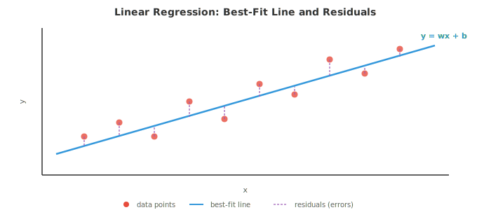
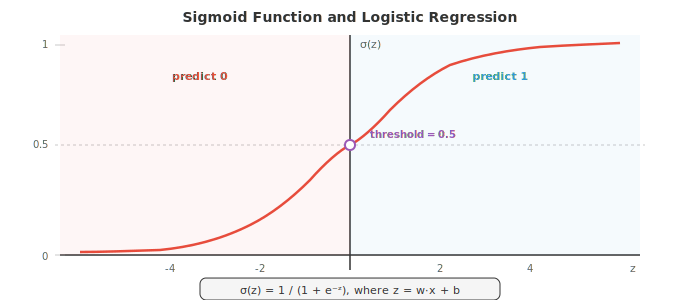
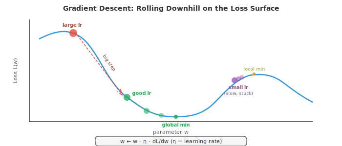
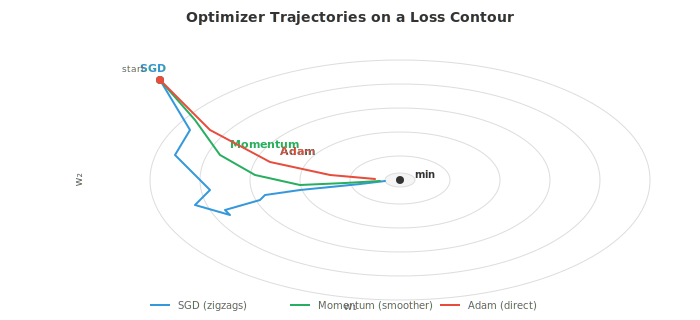
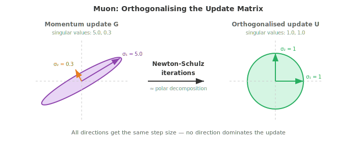
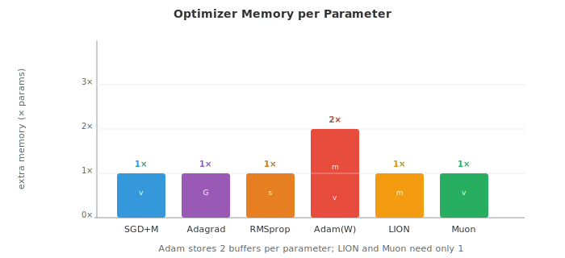

# 基于梯度的机器学习

*基于梯度的学习（gradient-based learning）通过沿着损失曲面的斜率迭代地调整模型参数来优化模型。本文件涵盖线性回归、逻辑回归、softmax 分类、梯度下降的多种变体、正则化（L1/L2）以及偏差-方差权衡*

- 文件 01 中的经典方法使用巧妙的启发式或闭式解。本文件介绍通过跟随梯度来学习的算法：在损失曲面上沿小步下行，直到找到合适的参数。基于梯度的学习是从线性回归到最大型神经网络背后共同的引擎。

- **线性回归（linear regression）**是最简单的基于梯度的模型，同时它也有闭式解，这使其成为一个完美的起点。该模型是一条直线（或在更高维度中是一个超平面）：

$$\hat{y} = w \cdot x + b = \sum_{i=1}^{d} w_i x_i + b$$

- 用矩阵记号表示（来自第 02 章），如果把所有训练输入按行堆叠成矩阵 $X$，并通过追加一列 1 把偏置吸收进 $w$，上式就变为 $\hat{y} = Xw$。

- 目标是最小化**均方误差（mean squared error, MSE）**，即预测值与真实值之间平方差的平均：

$$\mathcal{L}(w) = \frac{1}{n} \sum_{i=1}^{n} (y_i - \hat{y}_i)^2 = \frac{1}{n} \|y - Xw\|^2$$

- 为什么用平方误差？它有概率上的依据：若假设目标由 $y = Xw + \epsilon$ 生成，其中 $\epsilon \sim \mathcal{N}(0, \sigma^2)$，则最大化数据的 Gaussian 似然（第 05 章）等价于最小化 MSE。平方误差对大错的惩罚也更重，这通常是期望的性质。



- 由于 MSE 是关于 $w$ 的二次函数，它有唯一的全局最小值，可以解析地求得。对 $w$ 求导、令其为零、求解，就得到**正规方程（normal equation）**：

$$w^{*} = (X^T X)^{-1} X^T y$$

- 这直接用到了第 02 章的矩阵逆。$X^T X$ 是一个 $d \times d$ 矩阵（$d$ 为特征数），而 $X^T y$ 是一个 $d$ 维向量。正规方程一次性给出精确的最优权重。

- 正规方程何时失效？当 $X^T X$ 奇异（不可逆）时，这发生在特征线性相关或特征数多于样本数（$d > n$）的情形。此时需要正则化（后文讲述）或梯度下降。

- **逻辑回归（logistic regression）**把线性模型适配到二分类。我们不再预测连续值，而是希望得到一个 0 到 1 之间的概率。**sigmoid 函数**把任意实数压到这个区间：

$$\sigma(z) = \frac{1}{1 + e^{-z}}$$

- 模型先算出 $z = w \cdot x + b$（一个线性得分，正如线性回归），再通过 sigmoid：$\hat{y} = \sigma(w \cdot x + b)$。输出 $\hat{y}$ 被解释为 $P(y = 1 \mid x)$。



- sigmoid 有良好性质：$\sigma(0) = 0.5$，当 $z \to \infty$ 时 $\sigma(z) \to 1$，当 $z \to -\infty$ 时 $\sigma(z) \to 0$，且其导数有简洁形式 $\sigma'(z) = \sigma(z)(1 - \sigma(z))$。

- 逻辑回归的损失函数是**二元交叉熵（binary cross-entropy, BCE）**，它直接来自 Bernoulli 似然（第 05 章）：

$$\mathcal{L} = -\frac{1}{n} \sum_{i=1}^{n} \left[ y_i \log(\hat{y}_i) + (1 - y_i) \log(1 - \hat{y}_i) \right]$$

- 当真实标签为 1 时，只有第一项起作用，它惩罚偏低的预测。当真实标签为 0 时，只有第二项起作用，它惩罚偏高的预测。对数使惩罚对自信的错误预测极其陡峭：真实标签为 1 时预测 0.01 的代价远大于预测 0.4。

- 与线性回归的 MSE 不同，最小化 BCE 的权重没有闭式解。我们需要一种迭代方法：**梯度下降（gradient descent）**。

- 梯度下降背后的直觉很简单：想象你站在雾中的起伏地形（损失曲面）上。你看不到全局最小值，但能感觉到脚下的坡度。你向下走一步，再感受坡度，重复。最终你会到达一个谷底。

$$w \leftarrow w - \eta \frac{\partial \mathcal{L}}{\partial w}$$

- 学习率 $\eta$ 控制步长。太大则会越过谷底来回震荡而无法收敛。太小则 painfully 缓慢爬行，还可能陷入局部最小值。



- 梯度 $\frac{\partial \mathcal{L}}{\partial w}$ 是指向最陡上升方向的向量。我们减去它是因为想向下走。这是第 03 章链式法则应用于损失函数的结果。

- **批量梯度下降（batch gradient descent）**在每一步用整个训练集计算梯度。这给出精确梯度，但当 $n$ 很大时代价高昂。

- **随机梯度下降（stochastic gradient descent, SGD）**每步使用单个随机样本。梯度是有噪声的（它用单个样本估计真实梯度），但每步极快。噪声实际上有助于逃离浅层局部最小值。

- **小批量梯度下降（mini-batch gradient descent）**取折中：每步使用 $B$ 个样本（通常为 32、64 或 256）。它在计算效率（对批量的向量化运算）与梯度质量之间取得平衡。几乎所有深度学习都用小批量 SGD。

- **反向传播（backpropagation）**是我们实际计算含大量参数模型（如神经网络）梯度的方法。它是第 03 章链式法则在计算图上的系统化应用。

- 任何模型都可表示为运算的有向无环图：输入流入，被权重相乘、相加、过非线性函数，最终产生一个损失值。**前向传播（forward pass）**通过让数据沿此图从输入流向输出来计算输出（与损失）。

- **反向传播（backward pass，backpropagation）**则反向流动梯度。从损失出发，在每个节点用链式法则计算损失对每个中间值的变化率。若 $L$ 依赖 $z$，而 $z$ 依赖 $w$，则：

$$\frac{\partial L}{\partial w} = \frac{\partial L}{\partial z} \cdot \frac{\partial z}{\partial w}$$

- 每个节点只需知道自己的局部导数以及从上方流入的梯度。这使反向传播模块化且高效：代价约为前向传播的两倍（一次前向，一次反向）。

- 朴素的 SGD 有个问题：它在曲率陡的方向上震荡，而在平缓方向上进展缓慢。**优化器（optimiser）**通过根据梯度历史调整步长来改进。

- **带动量的 SGD（SGD with momentum）**保留过去梯度的滑动平均（指数移动平均，来自第 04 章）。这平抑了震荡，并在一致方向上加速进展：

$$v_t = \beta v_{t-1} + (1 - \beta) \nabla \mathcal{L}$$
$$w \leftarrow w - \eta \, v_t$$

- 想象一个滚下山坡的球：动量让它在一致方向上加速，并抑制左右抖动。典型值为 $\beta = 0.9$。

- **Nesterov 加速梯度（Nesterov Accelerated Gradient, NAG）**是一个小而巧妙的改动：不在当前位置计算梯度，而是在“前瞻”位置 $w - \eta \beta v_{t-1}$ 处计算。这一校正步骤减小了越过谷底的程度：

$$v_t = \beta \, v_{t-1} + \nabla \mathcal{L}(w - \eta \beta \, v_{t-1})$$
$$w \leftarrow w - \eta \, v_t$$

- **Adagrad** 按参数自适应学习率。收到大梯度的参数得到更小的学习率，反之亦然。它累积平方梯度：

$$G_t = G_{t-1} + g_t^2, \quad w \leftarrow w - \frac{\eta}{\sqrt{G_t + \epsilon}} g_t$$

- 问题在于：$G_t$ 只增不减，因此有效学习率单调下降，最终变得太小而无法学习任何东西。

- **RMSprop** 通过改用平方梯度的指数移动平均而非求和来修复这一点，使近期梯度比早期梯度更重要：

$$s_t = \beta \, s_{t-1} + (1 - \beta) g_t^2, \quad w \leftarrow w - \frac{\eta}{\sqrt{s_t + \epsilon}} g_t$$

- **Adam**（Adaptive Moment Estimation，自适应矩估计）结合了动量与 RMSprop。它同时维护一阶矩估计（梯度的均值，像动量）和二阶矩估计（平方梯度的均值，像 RMSprop）：

$$m_t = \beta_1 m_{t-1} + (1 - \beta_1) g_t$$
$$v_t = \beta_2 v_{t-1} + (1 - \beta_2) g_t^2$$

- 由于 $m_t$ 和 $v_t$ 初始化为零，在最初几步中偏向零。偏差校正修复了这一点：

$$\hat{m}_t = \frac{m_t}{1 - \beta_1^t}, \quad \hat{v}_t = \frac{v_t}{1 - \beta_2^t}$$

$$w \leftarrow w - \frac{\eta}{\sqrt{\hat{v}_t} + \epsilon} \hat{m}_t$$



- 默认超参数（$\beta_1 = 0.9$、$\beta_2 = 0.999$、$\epsilon = 10^{-8}$）在广泛的问题上都表现良好，这也是 Adam 成为大多数深度学习默认优化器的原因。

- **AdamW** 将权重衰减与梯度更新解耦。标准的 L2 正则化与权重衰减对 SGD 等价，但对 Adam 不等价。AdamW 直接对参数施加权重衰减，而非把 $\lambda w$ 加到梯度上。这带来更好的泛化，现已成为 transformer 训练的标准：

$$w \leftarrow w - \eta \left( \frac{\hat{m}_t}{\sqrt{\hat{v}_t} + \epsilon} + \lambda \, w \right)$$

- **LION**（EvoLved Sign Momentum，演化符号动量）是通过程序搜索发现的更新优化器。它只用动量更新的符号（而非幅度），使每次更新的尺度均匀。LION 比 Adam 更省内存（无需二阶矩缓冲），在许多任务上可匹敌甚至超越 Adam：

$$w \leftarrow w - \eta \cdot \text{sign}(\beta_1 \, m_{t-1} + (1 - \beta_1) \, g_t)$$
$$m_t = \beta_2 \, m_{t-1} + (1 - \beta_2) \, g_t$$

- **Muon**（Momentum + Orthogonalisation，动量+正交化）先施加 Nesterov 动量，再用 Newton-Schulz 迭代对更新矩阵正交化，以此近似极分解。所得更新方向位于 Stiefel 流形上，每次更新在所有奇异方向上幅度大致相等，防止单一方向占主导。这消除了对自适应二阶矩估计的需求（无 Adam 那样的 $v_t$ 缓冲），降低内存。Muon 在 transformer 训练上表现强劲，常以更快收敛匹敌 AdamW 质量，尤其对 attention 与 MLP 权重矩阵。Embedding 与输出层通常仍由 AdamW 处理。

$$G_t = \text{NesterovMomentum}(\nabla \mathcal{L})$$
$$U_t = \text{NewtonSchulz}(G_t) \approx G_t (G_t^T G_t)^{-1/2}$$
$$W \leftarrow W - \eta \, U_t$$

- Newton-Schulz 迭代通过重复 $X_{k+1} = \frac{1}{2} X_k (3I - X_k^T X_k)$ 几步（通常 5-10 步）来计算正交因子。这避免了完整 SVD 的代价，同时给出良好近似。





- 除 MSE 与 BCE 外，还有几种常用的**损失函数（loss function）**。

- **平均绝对误差（Mean Absolute Error, MAE）**，或称 L1 损失，取绝对差的平均：$\frac{1}{n}\sum|y_i - \hat{y}_i|$。它对离群点比 MSE 更鲁棒，因为它不对大误差平方。

- **Huber 损失**结合两者之长：小误差时表现像 MSE（光滑、易优化），大误差时像 MAE（对离群点鲁棒）。它有一个阈值 $\delta$ 控制过渡。

- **类别交叉熵（Categorical cross-entropy, CCE）**将 BCE 推广到多类。若 $\hat{y}_k$ 是对类 $k$ 的预测概率，真实类为 $c$：

$$\mathcal{L} = -\log(\hat{y}_c)$$

- 这正是正确类的负对数概率。最小化交叉熵等价于最大化似然，联系回第 05 章的信息论：交叉熵衡量当你用预测分布而非真实分布时所需多出的比特数。

- **Hinge 损失**为 SVM 所用：$\mathcal{L} = \max(0, 1 - y \cdot f(x))$。它只惩罚落在间隔错误一侧或落在间隔内的预测。一旦某点以足够置信度被正确分类，损失即为零。

- **正则化（regularisation）**通过对复杂模型施加惩罚来防止过拟合（overfitting）。正则化后的损失为：

$$\mathcal{L}_{\text{reg}} = \mathcal{L}_{\text{data}} + \lambda \, R(w)$$

- **L2 正则化**（Ridge，权重衰减）惩罚权重平方和：$R(w) = \|w\|^2 = \sum w_i^2$。它阻止任一权重过大，实际上把所有权重向零收缩，但很少使其恰为零。

- **L1 正则化**（Lasso）惩罚权重绝对值之和：$R(w) = \|w\|_1 = \sum |w_i|$。它鼓励稀疏性，把许多权重驱动到恰为零，从而自动完成特征选择（feature selection）。

- **Elastic Net** 结合两者：$R(w) = \alpha \|w\|_1 + (1 - \alpha) \|w\|^2$，融合稀疏与收缩。

- 这里有一个漂亮的 Bayesian 解释（来自第 05 章）。L2 正则化等价于在权重上放置 Gaussian 先验并求 MAP 估计。L1 正则化对应 Laplace 先验。正则化强度 $\lambda$ 控制你相对于数据对先验的信任程度。

- **评估指标（evaluation metrics）**告诉你模型是否真的有效。对回归，MSE 与 MAE 是标准。对分类，情况更微妙。

- **混淆矩阵（confusion matrix）**是二分类的四个计数的表格：
  - 真阳性（True Positive, TP）：预测为正，实际为正
  - 假阳性（False Positive, FP）：预测为正，实际为负
  - 真阴性（True Negative, TN）：预测为负，实际为负
  - 假阴性（False Negative, FN）：预测为负，实际为正

- **Accuracy**（准确率）= $\frac{TP + TN}{TP + TN + FP + FN}$ 在类别不平衡时会有误导。若 99% 的邮件不是 spam，则一个始终预测“非 spam”的模型准确率为 99%，但毫无用处。

- **Precision**（精确率）= $\frac{TP}{TP + FP}$ 回答：在所有预测为正中，有多少实际为正？高精确率意味着误报少。

- **Recall**（召回率，灵敏度）= $\frac{TP}{TP + FN}$ 回答：在所有实际为正中，你抓到了多少？高召回率意味着漏掉少。

- **F1 score** = $\frac{2 \cdot \text{precision} \cdot \text{recall}}{\text{precision} + \text{recall}}$ 是精确率与召回率的调和平均，平衡两者。

- **ROC 曲线**把真阳性率（召回率）对假阳性率（$\frac{FP}{FP + TN}$）作图，随分类阈值从 0 变到 1。完美分类器紧贴左上角。**AUC**（ROC 曲线下面积）用单一数字概括性能：1.0 完美，0.5 等同随机猜测。

- **交叉验证（cross-validation）**提供更可靠的泛化性能估计。在 $k$ 折交叉验证中，把数据分成 $k$ 折，在其中 $k-1$ 折上训练，剩下 1 折测试，并轮换。所有 $k$ 折的测试性能平均即估计值。这把所有数据同时用于训练和测试（只是不同时），在数据稀缺时尤为珍贵。

- **偏差-方差权衡（bias-variance tradeoff）**（来自第 04 章）是 ML 中的根本张力。一个模型的期望误差分解为：

$$\text{Error} = \text{Bias}^2 + \text{Variance} + \text{Irreducible Noise}$$

- **偏差（Bias）**来自错误假设的系统误差（例如用直线拟合弯曲数据）。**方差（Variance）**是对训练数据波动的敏感度（例如 20 阶多项式拟合噪声）。简单模型高偏差低方差；复杂模型低偏差高方差。最佳点是总误差最小的折中。

- **学习率调度（learning rate scheduling）**在训练中调整 $\eta$。常见策略：
  - 阶梯衰减：每 $N$ 个 epoch 把 $\eta$ 乘以一个因子（如 0.1）
  - 余弦退火：按余弦曲线从初值平滑下降到接近零
  - 预热（Warmup）：以极小的 $\eta$ 开始并线性增长数千步，然后衰减。这防止过大的初始梯度破坏训练稳定
  - 1cycle：一个先升后降的余弦周期，可带来更快收敛

- **超参数调优（hyperparameter tuning）**是为学习率、批量大小、正则化强度等不被梯度下降学习的设置寻找好值的过程。常见方法：
  - 网格搜索：在预定义网格上尝试每种组合（穷尽但昂贵）
  - 随机搜索：随机采样组合，常更高效，因为并非所有超参数同等重要
  - Bayesian 优化：构建目标函数的模型并智能地选择下一组要试的超参数
  - **ASHA**（Asynchronous Successive Halving Algorithm，异步连续减半算法）：以小预算并行运行许多试验，然后把最有希望的晋升到更大预算，其余提前终止。它把早停的效率与大规模并行结合——不是跑 100 次完整训练，而是廉价地启动全部 100 个，在每一级保留前四分之一，只有少数跑到完成。这是 Ray Tune 等现代大规模调优框架的骨架。

- **无调度学习（schedule-free learning）**彻底免去学习率调度的需要。它不在固定曲线上衰减 $\eta$，而是维护两条序列：缓慢移动的迭代平均 $z_t$（收敛到最优点）和快速探索的迭代 $y_t$（在此处计算梯度）。最终输出是平均后的序列，其收敛速率可证明匹敌事后回顾中最优的调度。这把调度从超参数中完全移除——你只需设置基础学习率，优化器处理其余。SGD 与 Adam 的无调度变体已被证明可匹敌或超越其调好调度的对应版本。

## 编程任务（使用 CoLab 或 notebook）

1. 用正规方程和梯度下降分别实现线性回归。比较两种解，并绘制 GD 损失随迭代收敛的曲线。
```python
import jax
import jax.numpy as jnp
import matplotlib.pyplot as plt

# Generate synthetic data: y = 3x + 2 + noise
key = jax.random.PRNGKey(42)
n = 100
X = jax.random.uniform(key, (n, 1), minval=0, maxval=10)
y = 3 * X[:, 0] + 2 + jax.random.normal(key, (n,)) * 1.5

# Add bias column
X_b = jnp.column_stack([X, jnp.ones(n)])

# Normal equation
w_exact = jnp.linalg.solve(X_b.T @ X_b, X_b.T @ y)
print(f"Normal equation: w={w_exact[0]:.4f}, b={w_exact[1]:.4f}")

# Gradient descent
w_gd = jnp.zeros(2)
lr = 0.005
losses = []
for step in range(500):
    pred = X_b @ w_gd
    error = pred - y
    loss = jnp.mean(error ** 2)
    losses.append(float(loss))
    grad = (2 / n) * X_b.T @ error
    w_gd = w_gd - lr * grad

print(f"Gradient descent: w={w_gd[0]:.4f}, b={w_gd[1]:.4f}")

fig, axes = plt.subplots(1, 2, figsize=(12, 4))
axes[0].scatter(X[:, 0], y, s=15, alpha=0.5, color='#3498db')
axes[0].plot([0, 10], [w_exact[1], w_exact[0]*10 + w_exact[1]], color='#e74c3c', linewidth=2)
axes[0].set_title("Linear Regression Fit")
axes[0].set_xlabel("x"); axes[0].set_ylabel("y")

axes[1].plot(losses, color='#27ae60', linewidth=1.5)
axes[1].set_title("GD Loss Convergence")
axes[1].set_xlabel("Step"); axes[1].set_ylabel("MSE")
axes[1].set_yscale('log')
plt.tight_layout()
plt.show()
```

2. 从零用梯度下降实现逻辑回归。在二维数据集上训练并可视化学到的决策边界。
```python
import jax
import jax.numpy as jnp
import matplotlib.pyplot as plt
from sklearn.datasets import make_moons

# Generate data
X, y = make_moons(n_samples=300, noise=0.2, random_state=42)
X, y = jnp.array(X), jnp.array(y, dtype=jnp.float32)

def sigmoid(z):
    return 1 / (1 + jnp.exp(-z))

# Add bias column
X_b = jnp.column_stack([X, jnp.ones(len(X))])
w = jnp.zeros(3)
lr = 0.5
losses = []

for step in range(2000):
    z = X_b @ w
    pred = sigmoid(z)
    # BCE loss
    loss = -jnp.mean(y * jnp.log(pred + 1e-8) + (1 - y) * jnp.log(1 - pred + 1e-8))
    losses.append(float(loss))
    # Gradient
    grad = X_b.T @ (pred - y) / len(y)
    w = w - lr * grad

# Decision boundary
xx, yy = jnp.meshgrid(jnp.linspace(-2, 3, 200), jnp.linspace(-1.5, 2, 200))
grid = jnp.column_stack([xx.ravel(), yy.ravel(), jnp.ones(xx.size)])
zz = sigmoid(grid @ w).reshape(xx.shape)

plt.figure(figsize=(8, 6))
plt.contourf(xx, yy, zz, levels=[0, 0.5, 1], alpha=0.3, colors=['#e74c3c', '#3498db'])
plt.contour(xx, yy, zz, levels=[0.5], colors='#9b59b6', linewidths=2)
plt.scatter(X[y==0, 0], X[y==0, 1], c='#e74c3c', s=15, label='Class 0')
plt.scatter(X[y==1, 0], X[y==1, 1], c='#3498db', s=15, label='Class 1')
plt.title("Logistic Regression Decision Boundary")
plt.legend()
plt.grid(alpha=0.3)
plt.show()
```

3. 在二维二次曲面上比较优化器轨迹。从同一出发点运行 SGD、SGD+Momentum 与 Adam，并绘制各自路径。
```python
import jax
import jax.numpy as jnp
import matplotlib.pyplot as plt

# Elongated quadratic: L(w1, w2) = 0.5*w1^2 + 10*w2^2
def loss_fn(w):
    return 0.5 * w[0]**2 + 10 * w[1]**2

grad_fn = jax.grad(loss_fn)

def run_sgd(w0, lr=0.05, steps=80):
    w = w0.copy()
    path = [w.copy()]
    for _ in range(steps):
        g = grad_fn(w)
        w = w - lr * g
        path.append(w.copy())
    return jnp.stack(path)

def run_momentum(w0, lr=0.05, beta=0.9, steps=80):
    w, v = w0.copy(), jnp.zeros(2)
    path = [w.copy()]
    for _ in range(steps):
        g = grad_fn(w)
        v = beta * v + (1 - beta) * g
        w = w - lr * v
        path.append(w.copy())
    return jnp.stack(path)

def run_adam(w0, lr=0.05, b1=0.9, b2=0.999, eps=1e-8, steps=80):
    w, m, v = w0.copy(), jnp.zeros(2), jnp.zeros(2)
    path = [w.copy()]
    for t in range(1, steps + 1):
        g = grad_fn(w)
        m = b1 * m + (1 - b1) * g
        v = b2 * v + (1 - b2) * g**2
        m_hat = m / (1 - b1**t)
        v_hat = v / (1 - b2**t)
        w = w - lr * m_hat / (jnp.sqrt(v_hat) + eps)
        path.append(w.copy())
    return jnp.stack(path)

w0 = jnp.array([8.0, 3.0])
sgd_path = run_sgd(w0)
mom_path = run_momentum(w0)
adam_path = run_adam(w0)

# Plot
fig, ax = plt.subplots(figsize=(8, 6))
w1 = jnp.linspace(-10, 10, 100)
w2 = jnp.linspace(-4, 4, 100)
W1, W2 = jnp.meshgrid(w1, w2)
L = 0.5 * W1**2 + 10 * W2**2
ax.contour(W1, W2, L, levels=20, cmap='Greys', alpha=0.4)
ax.plot(sgd_path[:,0], sgd_path[:,1], 'o-', color='#3498db', markersize=2, linewidth=1, label='SGD')
ax.plot(mom_path[:,0], mom_path[:,1], 'o-', color='#27ae60', markersize=2, linewidth=1, label='Momentum')
ax.plot(adam_path[:,0], adam_path[:,1], 'o-', color='#e74c3c', markersize=2, linewidth=1, label='Adam')
ax.plot(0, 0, 'k*', markersize=15, label='Minimum')
ax.set_xlabel('w₁'); ax.set_ylabel('w₂')
ax.set_title("Optimizer Trajectories on Elongated Quadratic")
ax.legend()
plt.grid(alpha=0.3)
plt.show()
```

4. 展示 L1 与 L2 正则化对权重稀疏性的影响。用两种惩罚训练线性回归，比较所得权重向量。
```python
import jax
import jax.numpy as jnp
import matplotlib.pyplot as plt

# Synthetic data: only first 3 of 20 features are relevant
key = jax.random.PRNGKey(0)
n, d = 200, 20
w_true = jnp.zeros(d).at[:3].set(jnp.array([3.0, -2.0, 1.5]))
X = jax.random.normal(key, (n, d))
y = X @ w_true + 0.5 * jax.random.normal(key, (n,))

def train_ridge(X, y, lam=1.0, lr=0.01, steps=2000):
    """L2 regularised linear regression via GD."""
    w = jnp.zeros(X.shape[1])
    for _ in range(steps):
        pred = X @ w
        grad = (2/len(y)) * X.T @ (pred - y) + 2 * lam * w
        w = w - lr * grad
    return w

def train_lasso(X, y, lam=1.0, lr=0.01, steps=2000):
    """L1 regularised linear regression via proximal GD."""
    w = jnp.zeros(X.shape[1])
    for _ in range(steps):
        pred = X @ w
        grad = (2/len(y)) * X.T @ (pred - y)
        w = w - lr * grad
        # Soft thresholding (proximal operator for L1)
        w = jnp.sign(w) * jnp.maximum(jnp.abs(w) - lr * lam, 0)
    return w

w_l2 = train_ridge(X, y, lam=0.1)
w_l1 = train_lasso(X, y, lam=0.1)

fig, axes = plt.subplots(1, 3, figsize=(14, 4))
axes[0].bar(range(d), w_true, color='#333', alpha=0.7)
axes[0].set_title("True Weights"); axes[0].set_xlabel("Feature")
axes[1].bar(range(d), w_l2, color='#3498db', alpha=0.7)
axes[1].set_title("L2 (Ridge): shrinks all"); axes[1].set_xlabel("Feature")
axes[2].bar(range(d), w_l1, color='#e74c3c', alpha=0.7)
axes[2].set_title("L1 (Lasso): zeros out irrelevant"); axes[2].set_xlabel("Feature")
plt.tight_layout()
plt.show()

print(f"L2 non-zero weights: {int(jnp.sum(jnp.abs(w_l2) > 0.01))}/{d}")
print(f"L1 non-zero weights: {int(jnp.sum(jnp.abs(w_l1) > 0.01))}/{d}")
```
