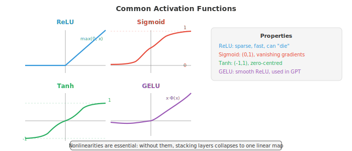
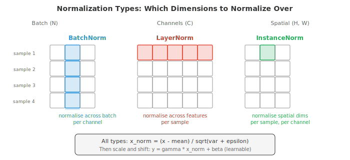
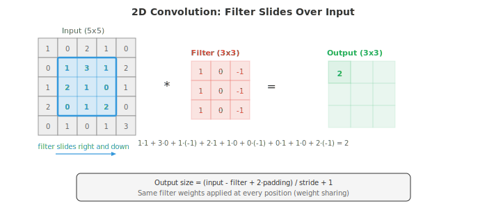
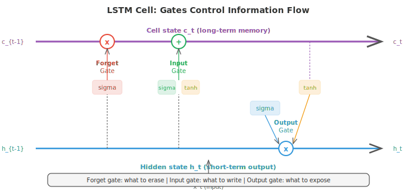
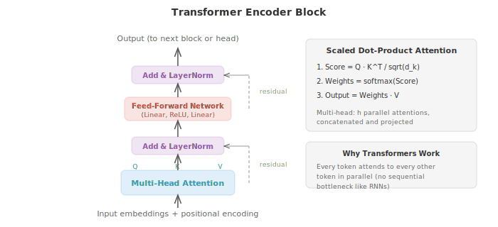

# Глубокое обучение

*Глубокое обучение объединяет нелинейные слои для построения иерархических представлений, которые автоматически преобразуют необработанные входные данные в полезные признаки. В этом файле рассматриваются многослойные перцептроны (MLP), функции активации, обратное распространение ошибки, свёрточные нейронные сети (CNN), рекуррентные нейронные сети (RNN), сети LSTM, механизмы внимания, трансформеры, генеративно-состязательные сети (GAN), вариационные автокодировщики (VAE), диффузионные модели и методы нормализации.*

- Что делает нейронную сеть «глубокой»? Мелкая сеть имеет один скрытый слой, глубокая — множество. Глубина позволяет сети строить иерархические представления: ранние слои изучают простые признаки (грани, тона), а последующие слои объединяют их в сложные концепты (лица, предложения). Именно эта композиционность обеспечивает мощь глубокого обучения.

- Простейшая глубокая сеть — это **многослойный перцептрон (MLP)**, также называемый полносвязной или плотной сетью. Каждый слой вычисляет:

$$h = \sigma(Wx + b)$$

- Здесь $W$ — матрица весов (глава 02), $b$ — вектор смещения, а $\sigma$ — нелинейная функция активации. Выход одного слоя становится входом для следующего. Без нелинейности наслоение слоев было бы бессмысленным: $W_2(W_1 x) = (W_2 W_1)x$, что является просто еще одним линейным преобразованием. Это в точности соответствует схлопыванию матричного умножения из главы 02.

- **Функции активации** привносят нелинейность, которая делает глубину значимой.

- **ReLU** (Rectified Linear Unit): $\text{ReLU}(x) = \max(0, x)$. Это наиболее широко используемая функция активации. Она быстро вычисляется, не насыщается при положительных входных значениях и создает разреженные активации (многие нейроны выдают ровно ноль). Недостаток: нейроны с отрицательным входом всегда выдают ноль, и если они «застревают» в этом состоянии, они «умирают» и перестают обучаться.

- **Сигмоида**: $\sigma(x) = \frac{1}{1+e^{-x}}$, сжимает входные значения в диапазон $(0, 1)$. Полезна для выходных слоев в задачах бинарной классификации, но проблематична в скрытых слоях, так как градиенты затухают, когда вход далек от нуля (кривая становится почти плоской).

- **Tanh**: $\tanh(x) = \frac{e^x - e^{-x}}{e^x + e^{-x}}$, сжимает значения в диапазон $(-1, 1)$. Центрирована относительно нуля (в отличие от сигмоиды), что способствует прохождению градиента, но все еще страдает от затухания градиентов на экстремальных значениях.

- **GELU** (Gaussian Error Linear Unit): $\text{GELU}(x) = x \cdot \Phi(x)$, где $\Phi$ — стандартная нормальная функция распределения (CDF). Это гладкая аппроксимация ReLU, которая пропускает небольшие отрицательные значения. GELU является стандартной функцией активации в GPT и BERT.

- **Swish**: $\text{Swish}(x) = x \cdot \sigma(x)$, еще один гладкий гейт. На практике похожа на GELU.



- Плотный слой с $d_{\text{in}}$ входами и $d_{\text{out}}$ выходами имеет $d_{\text{in}} \times d_{\text{out}} + d_{\text{out}}$ параметров (веса плюс смещения). Матричное умножение $Wx$ — это просто умножение матрицы на вектор из главы 02. В пакетном режиме (batch setting) вход представляет собой матрицу $X$ размерности $(B, d_{\text{in}})$, а выход — $XW^T + b$ размерности $(B, d_{\text{out}})$.

- **Теорема о универсальной аппроксимации** гласит, что один скрытый слой с достаточным количеством нейронов может аппроксимировать любую непрерывную функцию на компактном домене с произвольной точностью. Может показаться, что глубина не имеет значения, но подвох заключается в словах «достаточное количество нейронов». На практике глубокие сети могут представлять те же функции с экспоненциально меньшим количеством параметров, чем мелкие. Глубина дает эффективность, а не просто выразительность.

- По мере увеличения глубины сетей возникают две патологии градиента. **Затухающие градиенты**: когда градиенты проходят через множество слоев (через цепное правило, глава 03), они умножаются на множество множителей. Если эти множители стабильно меньше 1 (как при насыщении сигмоиды или tanh), градиент экспоненциально стремится к нулю. Ранние слои почти не обучаются. **Взрывающиеся градиенты**: если множители стабильно больше 1, градиенты растут экспоненциально, вызывая численное переполнение и нестабильное обучение.

- Решения проблем затухающих/взрывающихся градиентов:
  - Использование функций активации ReLU или GELU (градиент равен 1 для положительных входов, нет насыщения)
  - Тщательная инициализация весов
  - Слои нормализации
  - Остаточные связи (skip connections)
  - Обрезка градиентов (для взрывающихся градиентов): ограничение нормы градиента максимальным значением

- **Инициализация весов** важна, так как она определяет масштаб активаций и градиентов в начале обучения. Если веса слишком велики, активации взрываются; если слишком малы — затухают.

- **Инициализация Ксавье (Glorot)** задает веса из распределения с дисперсией $\frac{2}{d_{\text{in}} + d_{\text{out}}}$. Это позволяет поддерживать дисперсию активаций примерно постоянной по слоям при условии использования линейных или tanh-активаций.

- **Инициализация Хе (Kaiming)** использует дисперсию $\frac{2}{d_{\text{in}}}$, которая откалибрована для ReLU-активаций (поскольку ReLU обнуляет половину активаций, требуется удвоенная дисперсия для компенсации).

- **Слои нормализации** стабилизируют обучение, гарантируя, что входы каждого слоя имеют согласованную статистику (примерно нулевое среднее и единичную дисперсию).

- **Пакетная нормализация (BatchNorm)** нормализует данные по размерности батча: для каждого канала/признака вычисляются среднее и дисперсия по всем выборкам в мини-батче, затем выполняется нормализация. Она добавляет обучаемые параметры масштаба ($\gamma$) и сдвига ($\beta$), чтобы сеть могла отменить нормализацию, если это необходимо:

$$\hat{x} = \frac{x - \mu_B}{\sqrt{\sigma_B^2 + \epsilon}}, \quad y = \gamma \hat{x} + \beta$$

- У BatchNorm есть проблема: она зависит от размера батча. При очень маленьких батчах статистика получается зашумленной. Во время инференса используются скользящие средние вместо статистики батча, что создает расхождение между обучением и тестированием.

- **Нормализация слоев (LayerNorm)** нормализует данные по размерности признаков для каждой отдельной выборки. Она не зависит от других выборок в батче, что делает её стандартным выбором для трансформеров и рекуррентных сетей.

- **Нормализация экземпляров (Instance Normalisation)** нормализует данные по пространственным размерностям для каждой выборки и каждого канала независимо. Популярна в задачах переноса стиля.

- **Групповая нормализация (Group Normalisation)** разделяет каналы на группы и выполняет нормализацию внутри каждой из них. Это компромисс между LayerNorm и InstanceNorm.



- **Dropout** — это метод регуляризации, который случайным образом обнуляет долю $p$ нейронов во время обучения. Это заставляет нейронную сеть не полагаться на какой-то один нейрон, поощряя избыточные представления. На этапе тестирования все нейроны активны. **Инвертированный dropout (Inverted dropout)** масштабирует активации на $\frac{1}{1-p}$ во время обучения, чтобы не требовалось масштабирование при тестировании. Это стандартная реализация.

- **Свёрточные нейронные сети (CNN)** используют пространственную структуру. Вместо соединения каждого входа с каждым выходом (как в полносвязных слоях), свёрточный слой перемещает небольшой фильтр (ядро) по входным данным, вычисляя скалярное произведение в каждой позиции. Одни и те же веса фильтра используются во всех позициях, что радикально сокращает количество параметров и обеспечивает инвариантность к сдвигу.

- **Операция свёртки** для 2D-входа с фильтром $K$ размера $k \times k$:

$$(\text{input} * K)[i,j] = \sum_{m=0}^{k-1} \sum_{n=0}^{k-1} \text{input}[i+m, j+n] \cdot K[m, n]$$



- Размер выхода зависит от трех гиперпараметров. **Шаг (Stride)** определяет, на сколько пикселей сдвигается фильтр между позициями (шаг 2 уменьшает пространственные размерности вдвое). **Паддинг (Padding)** добавляет нули вокруг границы входа (паддинг "same" сохраняет пространственный размер, "valid" — нет). Формула размера выхода: $\text{out} = \lfloor (\text{in} - k + 2p) / s \rfloor + 1$.

- Слои **пулинга (Pooling)** уменьшают размерность карт признаков. Max pooling берет максимальное значение в каждом окне; average pooling берет среднее. Пулинг уменьшает пространственные размерности, сохраняя при этом наиболее важную информацию.

- **Дилатированные свёртки (Dilated convolutions)** вставляют промежутки между элементами фильтра, увеличивая рецептивное поле без увеличения количества параметров. Коэффициент расширения (dilation rate) 2 означает, что фильтр 3x3 покрывает область 5x5.

- **Свёртки 1x1** — это свёртки с фильтром 1x1. Они не учитывают пространственных соседей, а вместо этого смешивают информацию между каналами. Их можно представить как применение полносвязного слоя в каждой пространственной позиции. Они используются для недорогого изменения количества каналов.

- **Skip-связи (Skip connections)** (остаточные связи) позволяют входу пропускать один или несколько слоев: $\text{output} = F(x) + x$. Слой должен выучить только остаток $F(x) = \text{output} - x$, что проще, когда оптимальное преобразование близко к тождественному. ResNet (остаточные сети) используют этот трюк для стеков из более чем 100 слоев, решая проблему деградации, при которой более глубокие сети работали хуже, чем менее глубокие.

- CNN выстраивают **иерархию признаков**. Ранние слои обнаруживают края и текстуры. Средние слои объединяют их в части (глаза, колеса). Поздние слои распознают объекты целиком. Рецептивное поле каждого слоя (область входа, которую он "видит") растет с глубиной.

- **Эмбеддинги** отображают дискретные токены (слова, символы, ID элементов) в плотные векторы. Слой эмбеддингов — это просто таблица поиска: матрица $E$ формы (размер словаря, размерность эмбеддинга). Поиск токена $i$ означает выбор строки $i$ матрицы $E$. Это эквивалентно умножению на one-hot вектор, что является частным случаем матрично-векторного умножения (глава 02). Эмбеддинги обучаются в процессе тренировки, поэтому похожие токены в итоге получают похожие векторы.

- **Токенизация** — это процесс преобразования необработанного текста в последовательность токенов. Токенизация на уровне слов разбивает текст по пробелам, но не может обрабатывать неизвестные слова. **Токенизация на уровне подслов (Subword tokenisation)** (BPE, WordPiece, SentencePiece) разбивает текст на часто встречающиеся единицы подслов, балансируя размер словаря и покрытие. Слово "unhappiness" может превратиться в ["un", "happiness"] или ["un", "happ", "iness"].

- **Рекуррентные нейронные сети (RNN)** обрабатывают последовательности по одному элементу за раз, поддерживая скрытое состояние, которое передает информацию дальше:

$$h_t = \tanh(W_h h_{t-1} + W_x x_t + b)$$

- Скрытое состояние $h_t$ — это сжатое резюме всего, что сеть видела до момента времени $t$. Одни и те же веса $W_h$ и $W_x$ используются на всех временных шагах (разделение весов, подобно тому как CNN разделяют пространственные веса).

- Обычные RNN плохо справляются с длинными последовательностями из-за затухающих градиентов: градиентный сигнал от шага $t$ к шагу $t - k$ проходит через $k$ умножений на $W_h$ и экспоненциально уменьшается (или взрывается).

- **LSTM** (Long Short-Term Memory) решает эту проблему, вводя отдельное состояние ячейки $c_t$, которое проходит сквозь время с минимальными помехами. Три вентиля (gates) управляют тем, какая информация входит, выходит и сохраняется:

- **Вентиль забывания (forget gate)** решает, что стереть из состояния ячейки: $f_t = \sigma(W_f [h_{t-1}, x_t] + b_f)$
- **Вентиль входа (input gate)** решает, какую новую информацию записать: $i_t = \sigma(W_i [h_{t-1}, x_t] + b_i)$, с кандидатами значений $\tilde{c}_t = \tanh(W_c [h_{t-1}, x_t] + b_c)$
- Обновление состояния ячейки: $c_t = f_t \odot c_{t-1} + i_t \odot \tilde{c}_t$
- **Вентиль выхода (output gate)** решает, что передать дальше: $o_t = \sigma(W_o [h_{t-1}, x_t] + b_o)$, и $h_t = o_t \odot \tanh(c_t)$



- Состояние ячейки работает как конвейерная лента: информация может проходить без изменений через множество временных шагов (вентиль забывания остается близким к 1), что решает проблему затухающего градиента для долгосрочных зависимостей.

- **GRU** (Gated Recurrent Unit) упрощает LSTM, объединяя состояние ячейки и скрытое состояние в одно и используя два вентиля вместо трех: вентиль обновления (объединяет забывание и вход) и вентиль сброса. GRU имеют меньше параметров и часто работают сопоставимо с LSTM.

- Фундаментальное ограничение RNN (включая LSTM) — последовательная обработка: вы должны обработать токен 1 перед токеном 2, а его — перед токеном 3. Это препятствует распараллеливанию и создает информационное "бутылочное горлышко", так как весь контекст должен сжиматься через скрытое состояние фиксированного размера.

- **Внимание (attention)** решает обе эти проблемы. Вместо сжатия всего входного сигнала в фиксированный вектор, внимание позволяет модели обращаться ко всем входным позициям и решать, какие из них релевантны для текущего выхода.

- Современная формулировка использует **запросы, ключи и значения (queries, keys, and values — Q, K, V)**. Представьте это как поиск в библиотеке: у вас есть запрос (что вы ищете), ключи (метки на каждой книге) и значения (содержимое самой книги). Вы сравниваете свой запрос со всеми ключами, чтобы понять, какие значения нужно извлечь.

- **Масштабированное скалярное произведение внимания (scaled dot-product attention)**:

$$\text{Attention}(Q, K, V) = \text{softmax}\!\left(\frac{QK^T}{\sqrt{d_k}}\right) V$$

- $QK^T$ вычисляет сходство между каждым запросом и каждым ключом. Это матричное умножение (глава 02), а элементы являются скалярными произведениями, которые измеряют косинусное сходство (глава 01). Деление на $\sqrt{d_k}$ предотвращает слишком большие значения скалярных произведений (которые привели бы к насыщению softmax и созданию распределений, близких к one-hot, с затухающими градиентами). Softmax преобразует сходства в распределение вероятностей. Умножение на $V$ дает взвешенную комбинацию значений.

- **Многоголовое внимание (multi-head attention)** выполняет $h$ параллельных операций внимания, каждая из которых использует различные обученные проекции Q, K и V. Это позволяет модели одновременно учитывать информацию из разных подпространств представлений. Одна «голова» может фокусироваться на синтаксических связях, в то время как другая — на семантических. Выходы конкатенируются и проецируются:

$$\text{MultiHead}(Q, K, V) = \text{Concat}(\text{head}_1, \ldots, \text{head}_h) W^O$$

- Архитектура **Трансформер (Transformer)** (Vaswani et al., 2017) полностью построена на слоях внимания и полносвязных слоях (feed-forward layers) без использования рекурсии. Блок энкодера повторяет: многоголовое самовнимание, сложение и нормализацию слоя (add and layer-norm), полносвязную сеть, сложение и нормализацию слоя. Блок декодера добавляет маскированное самовнимание (предотвращающее просмотр будущих токенов моделью) и слой кросс-внимания, который обращается к выходу энкодера.



- **Позиционное кодирование (positional encoding)** необходимо, так как внимание перестановочно-эквивариантно, что означает, что оно рассматривает вход как множество, а не как последовательность. Без информации о позиции фразы «the cat sat on the mat» и «the mat sat on the cat» были бы идентичны. Оригинальный Трансформер использует синусоидальные позиционные кодировки:

$$PE_{(pos, 2i)} = \sin\!\left(\frac{pos}{10000^{2i/d}}\right), \quad PE_{(pos, 2i+1)} = \cos\!\left(\frac{pos}{10000^{2i/d}}\right)$$

- Каждая позиция получает уникальный вектор, который модель может использовать для различения позиций. Современные модели чаще используют обученные позиционные эмбеддинги или относительные позиционные кодировки (RoPE, ALiBi).

- Трансформеры обрабатывают все токены параллельно (матрица самовнимания $QK^T$ вычисляется за одно матричное умножение), что делает их обучение на современном оборудовании намного быстрее, чем у RNN. Компромисс заключается в том, что сложность самовнимания составляет $O(n^2)$ относительно длины последовательности (каждый токен учитывает все остальные), тогда как у RNN она составляет $O(n)$. Именно поэтому для моделей с длинным контекстом требуются специальные варианты внимания (разреженное внимание, линейное внимание, flash attention).

- **Визуальные трансформеры (Vision Transformers, ViT)** применяют Трансформер к изображениям, разбивая изображение на патчи фиксированного размера (например, 16x16), выравнивая каждый патч в вектор и рассматривая патчи как последовательность токенов. В начало добавляется обучаемый токен [CLS], и его финальное представление используется для классификации. Несмотря на отсутствие индуктивных смещений, присущих свёрточным сетям, ViT соответствуют или превосходят CNN при обучении на достаточном объеме данных.

- **MLP-Mixer** — это еще более простая архитектура, которая заменяет и внимание, и свёртку на MLP. Она чередует MLP «смешивания токенов» (применяемые к пространственным позициям) и MLP «смешивания каналов» (применяемые к признакам). Она показывает конкурентоспособные результаты, что говорит о том, что ключевое преимущество современных архитектур заключается не в самом внимании, а в эффективном смешивании информации между токенами и признаками.

- **Автокодировщики (autoencoders)** обучаются создавать сжатые представления, тренируя сеть восстанавливать собственный вход. Энкодер отображает вход в низкоразмерное «бутылочное горлышко» (латентный код), а декодер отображает его обратно:

$$z = f_{\text{enc}}(x), \quad \hat{x} = f_{\text{dec}}(z), \quad \mathcal{L} = \|x - \hat{x}\|^2$$

- «Бутылочное горлышко» заставляет сеть выучивать наиболее важные признаки. Автокодировщики используются для снижения размерности, шумоподавления (обучение на зашумленном входе, восстановление чистого выхода) и обнаружения аномалий (высокая ошибка восстановления сигнализирует о необычном входе).

- **Вариационные автокодировщики (Variational Autoencoders, VAEs)** добавляют вероятностный аспект. Вместо кодирования в одну точку $z$, энкодер выдает параметры распределения (среднее $\mu$ и дисперсию $\sigma^2$ Гауссова распределения). Латентный код берется из этого распределения: $z = \mu + \sigma \odot \epsilon$, где $\epsilon \sim \mathcal{N}(0, I)$. Этот **трюк репараметризации (reparameterisation trick)** делает выборку дифференцируемой, чтобы через нее могли проходить градиенты.

- Функция потерь VAE состоит из двух слагаемых:

$$\mathcal{L} = \underbrace{\|x - \hat{x}\|^2}_{\text{reconstruction}} + \underbrace{D_{\text{KL}}(q(z|x) \| p(z))}_{\text{regularisation}}$$

- Слагаемое дивергенции Кульбака-Лейблера (из главы 05) подталкивает выученное апостериорное распределение $q(z|x)$ к априорному $p(z) = \mathcal{N}(0, I)$, гарантируя, что латентное пространство является гладким и хорошо структурированным. Затем можно делать выборку из априорного распределения и декодировать ее для генерации новых данных. Именно это делает VAE генеративными моделями.

## Задачи по программированию (используйте CoLab или ноутбук)

1. Создайте простую MLP с нуля на JAX. Обучите ее на задаче классификации 2D-данных (например, концентрические окружности) и визуализируйте границу принятия решений.
```python
import jax
import jax.numpy as jnp
import matplotlib.pyplot as plt
from sklearn.datasets import make_circles

# Data
X, y = make_circles(n_samples=500, noise=0.1, factor=0.5, random_state=42)
X, y = jnp.array(X), jnp.array(y, dtype=jnp.float32)

# Initialise a 2-layer MLP: 2 -> 16 -> 16 -> 1
def init_params(key):
    k1, k2, k3 = jax.random.split(key, 3)
    return {
        'W1': jax.random.normal(k1, (2, 16)) * 0.5,
        'b1': jnp.zeros(16),
        'W2': jax.random.normal(k2, (16, 16)) * 0.5,
        'b2': jnp.zeros(16),
        'W3': jax.random.normal(k3, (16, 1)) * 0.5,
        'b3': jnp.zeros(1),
    }

def forward(params, x):
    h = jnp.maximum(0, x @ params['W1'] + params['b1'])  # ReLU
    h = jnp.maximum(0, h @ params['W2'] + params['b2'])   # ReLU
    logit = (h @ params['W3'] + params['b3']).squeeze()
    return jax.nn.sigmoid(logit)

def loss_fn(params, X, y):
    pred = forward(params, X)
    return -jnp.mean(y * jnp.log(pred + 1e-7) + (1 - y) * jnp.log(1 - pred + 1e-7))

grad_fn = jax.jit(jax.grad(loss_fn))
params = init_params(jax.random.PRNGKey(0))
lr = 0.1

for step in range(2000):
    grads = grad_fn(params, X, y)
    params = {k: params[k] - lr * grads[k] for k in params}

# Plot decision boundary
xx, yy = jnp.meshgrid(jnp.linspace(-2, 2, 200), jnp.linspace(-2, 2, 200))
grid = jnp.column_stack([xx.ravel(), yy.ravel()])
zz = forward(params, grid).reshape(xx.shape)

plt.figure(figsize=(7, 6))
plt.contourf(xx, yy, zz, levels=[0, 0.5, 1], alpha=0.3, colors=['#e74c3c', '#3498db'])
plt.scatter(X[y==0,0], X[y==0,1], c='#e74c3c', s=10, label='Class 0')
plt.scatter(X[y==1,0], X[y==1,1], c='#3498db', s=10, label='Class 1')
plt.title("MLP Decision Boundary on Concentric Circles")
plt.legend(); plt.grid(alpha=0.3); plt.show()

acc = jnp.mean((forward(params, X) > 0.5) == y)
print(f"Accuracy: {acc:.2%}")
```

2. Реализуйте одномерную свёртку с нуля. Примените простой фильтр для детекции границ к сигналу и сравните результат со встроенной функцией `jnp.convolve`.

```python
import jax.numpy as jnp
import matplotlib.pyplot as plt

def conv1d(signal, kernel):
    """1D convolution (valid mode) from scratch."""
    n, k = len(signal), len(kernel)
    output = jnp.zeros(n - k + 1)
    for i in range(n - k + 1):
        output = output.at[i].set(jnp.sum(signal[i:i+k] * kernel))
    return output

# Create a signal with a step function
t = jnp.linspace(0, 4, 200)
signal = jnp.where(t < 1, 0.0, jnp.where(t < 2, 1.0, jnp.where(t < 3, 0.5, 1.5)))

# Edge detection kernel
edge_kernel = jnp.array([-1.0, 0.0, 1.0])

# Our implementation vs built-in
our_output = conv1d(signal, edge_kernel)
jnp_output = jnp.convolve(signal, edge_kernel, mode='valid')

fig, axes = plt.subplots(3, 1, figsize=(10, 6), sharex=True)
axes[0].plot(t, signal, color='#3498db', linewidth=1.5)
axes[0].set_title("Original Signal"); axes[0].set_ylabel("Value")

axes[1].plot(t[:len(our_output)], our_output, color='#e74c3c', linewidth=1.5)
axes[1].set_title("After Edge Detection (our conv1d)"); axes[1].set_ylabel("Value")

axes[2].plot(t[:len(jnp_output)], jnp_output, color='#27ae60', linewidth=1.5, linestyle='--')
axes[2].set_title("After Edge Detection (jnp.convolve)"); axes[2].set_ylabel("Value")
axes[2].set_xlabel("t")

plt.tight_layout(); plt.show()
print(f"Outputs match: {jnp.allclose(our_output, jnp_output)}")
```

3. Реализуйте механизм масштабированного скалярного внимания (scaled dot-product attention) с нуля. Вычислите веса внимания для небольшого примера и визуализируйте матрицу внимания в виде тепловой карты.

```python
import jax
import jax.numpy as jnp
import matplotlib.pyplot as plt

def scaled_dot_product_attention(Q, K, V):
    """Scaled dot-product attention."""
    d_k = Q.shape[-1]
    scores = Q @ K.T / jnp.sqrt(d_k)
    weights = jax.nn.softmax(scores, axis=-1)
    output = weights @ V
    return output, weights

# Example: 4 tokens, embedding dim 8
key = jax.random.PRNGKey(42)
k1, k2, k3 = jax.random.split(key, 3)
seq_len, d_model = 4, 8

Q = jax.random.normal(k1, (seq_len, d_model))
K = jax.random.normal(k2, (seq_len, d_model))
V = jax.random.normal(k3, (seq_len, d_model))

output, weights = scaled_dot_product_attention(Q, K, V)

print(f"Q shape: {Q.shape}")
print(f"Attention weights shape: {weights.shape}")
print(f"Output shape: {output.shape}")
print(f"\nAttention weights (rows sum to 1):")
print(weights)
print(f"Row sums: {weights.sum(axis=-1)}")

# Visualise attention
fig, ax = plt.subplots(figsize=(5, 4))
im = ax.imshow(weights, cmap='Blues', vmin=0, vmax=1)
ax.set_xlabel("Key position"); ax.set_ylabel("Query position")
ax.set_title("Attention Weights")
tokens = ['tok 0', 'tok 1', 'tok 2', 'tok 3']
ax.set_xticks(range(4)); ax.set_xticklabels(tokens)
ax.set_yticks(range(4)); ax.set_yticklabels(tokens)
for i in range(4):
    for j in range(4):
        ax.text(j, i, f"{weights[i,j]:.2f}", ha='center', va='center', fontsize=10)
plt.colorbar(im); plt.tight_layout(); plt.show()
```

4. Создайте простой автокодировщик, который сжимает двумерные данные через одномерное «бутылочное горлышко» (bottleneck) и восстанавливает их. Визуализируйте латентное пространство и результаты реконструкции.

```python
import jax
import jax.numpy as jnp
import matplotlib.pyplot as plt
from sklearn.datasets import make_moons

# Data
X, _ = make_moons(n_samples=500, noise=0.05, random_state=42)
X = jnp.array(X)

# Autoencoder: 2 -> 8 -> 1 -> 8 -> 2
def init_ae(key):
    k1, k2, k3, k4 = jax.random.split(key, 4)
    return {
        'enc_W1': jax.random.normal(k1, (2, 8)) * 0.5, 'enc_b1': jnp.zeros(8),
        'enc_W2': jax.random.normal(k2, (8, 1)) * 0.5, 'enc_b2': jnp.zeros(1),
        'dec_W1': jax.random.normal(k3, (1, 8)) * 0.5, 'dec_b1': jnp.zeros(8),
        'dec_W2': jax.random.normal(k4, (8, 2)) * 0.5, 'dec_b2': jnp.zeros(2),
    }

def encode(p, x):
    h = jnp.tanh(x @ p['enc_W1'] + p['enc_b1'])
    return h @ p['enc_W2'] + p['enc_b2']

def decode(p, z):
    h = jnp.tanh(z @ p['dec_W1'] + p['dec_b1'])
    return h @ p['dec_W2'] + p['dec_b2']

def ae_loss(p, X):
    z = encode(p, X)
    X_hat = decode(p, z)
    return jnp.mean((X - X_hat) ** 2)

grad_fn = jax.jit(jax.grad(ae_loss))
params = init_ae(jax.random.PRNGKey(0))
lr = 0.01

for step in range(3000):
    grads = grad_fn(params, X)
    params = {k: params[k] - lr * grads[k] for k in params}

z = encode(params, X)
X_hat = decode(params, z)

fig, axes = plt.subplots(1, 2, figsize=(12, 5))
axes[0].scatter(X[:,0], X[:,1], c=z.squeeze(), cmap='viridis', s=10)
axes[0].set_title("Original Data (coloured by latent code)")
axes[1].scatter(X_hat[:,0], X_hat[:,1], c=z.squeeze(), cmap='viridis', s=10)
axes[1].set_title("Reconstruction from 1D bottleneck")
for ax in axes:
    ax.set_aspect('equal'); ax.grid(alpha=0.3)
plt.tight_layout(); plt.show()

print(f"Reconstruction MSE: {ae_loss(params, X):.4f}")
```
