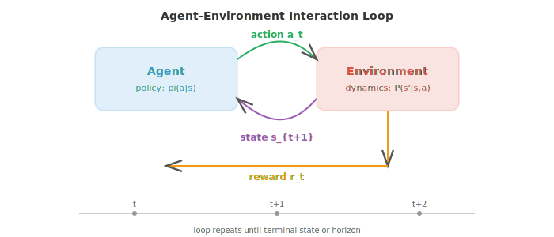
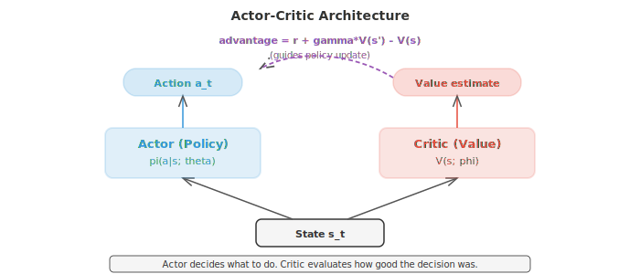

# 强化学习

*强化学习训练智能体通过试错最大化累积奖励来做出序列决策。本文件涵盖 MDP、价值函数、Bellman 方程、Q-learning、策略梯度、actor-critic 方法、PPO 和 RLHF，这些是游戏智能体和语言模型对齐背后的框架。*

- 监督学习（supervised learning）需要带标签的数据。无监督学习（unsupervised learning）在无标签数据中寻找模式。**强化学习（RL）** 与两者都不同：智能体通过与环境的交互、采取动作、获得奖励来学习。这里没有正确标签；智能体必须通过试错发现好的行为。

- 想象教狗学一个新把戏。你不会给它看一个正确行为的数据集。相反，它去尝试，你对好的动作给零食，久而久之它就弄明白你想要什么。RL 把这个过程形式化。

- RL 的设定有五个核心组件。**agent（智能体）** 是学习者和决策者。**environment（环境）** 是智能体之外、与之交互的一切。在每个时间步，智能体观察到一个 **state（状态）** $s_t$，选择一个 **action（动作）** $a_t$，获得一个 **reward（奖励）** $r_t$，并转移到新状态 $s_{t+1}$。智能体的目标是最大化它随时间累积获得的总奖励。



- **策略（policy）** $\pi$ 是智能体的策略：从状态到动作的映射。确定性策略对每个状态给出一个动作：$a = \pi(s)$。随机策略给出动作上的一个概率分布：$\pi(a \mid s)$。RL 的目标是找到最优策略，即最大化期望累积奖励的那个策略。

- RL 的数学框架是 **马尔可夫决策过程（Markov Decision Process, MDP）**，由一个元组 $(S, A, P, R, \gamma)$ 定义：状态集合 $S$，动作集合 $A$，转移概率 $P(s' \mid s, a)$，奖励函数 $R(s, a)$，以及折扣因子 $\gamma$。

- **马尔可夫性质（Markov property）**（来自第 05 章）说明未来只依赖当前状态，而不依赖到达此状态的历史：$P(s_{t+1} \mid s_t, a_t, s_{t-1}, \ldots) = P(s_{t+1} \mid s_t, a_t)$。这意味着状态包含做出决策所需的所有信息。

- **折扣因子（discount factor）** $\gamma \in [0, 1)$ 决定智能体对未来奖励相对于即时奖励的重视程度。从时刻 $t$ 起的折扣回报为：

$$G_t = r_t + \gamma r_{t+1} + \gamma^2 r_{t+2} + \cdots = \sum_{k=0}^{\infty} \gamma^k r_{t+k}$$

- 当 $\gamma = 0$ 时，智能体完全短视，只关心下一个奖励。当 $\gamma$ 接近 1 时，智能体目光长远。折扣因子还保证了级数收敛（如果奖励有界），这对数学上的良定义性很重要。

- **价值函数（value function）** 估计处于一个状态（或在一个状态下采取一个动作）有多好。**状态价值函数** $V^\pi(s)$ 是从状态 $s$ 出发并遵循策略 $\pi$ 的期望回报：

$$V^\pi(s) = \mathbb{E}_\pi \left[ G_t \mid s_t = s \right]$$

- **动作价值函数** $Q^\pi(s, a)$ 是从状态 $s$ 出发、采取动作 $a$、然后遵循 $\pi$ 的期望回报：

$$Q^\pi(s, a) = \mathbb{E}_\pi \left[ G_t \mid s_t = s, a_t = a \right]$$

- 两者关系：$V^\pi(s) = \sum_a \pi(a \mid s) \, Q^\pi(s, a)$。状态价值是动作价值按策略加权的平均。

- **Bellman 方程（Bellman equation）** 表达了一种递归关系：一个状态的价值等于即时奖励加上下一状态价值的折扣值。对于状态价值函数：

$$V^\pi(s) = \sum_a \pi(a \mid s) \sum_{s'} P(s' \mid s, a) \left[ R(s, a) + \gamma \, V^\pi(s') \right]$$

- 对于最优价值函数 $V^{*}(s)$，智能体总是选择最好的动作：

$$V^{*}(s) = \max_a \sum_{s'} P(s' \mid s, a) \left[ R(s, a) + \gamma \, V^{*}(s') \right]$$

- 类似地，关于 $Q^{*}$ 的 **Bellman 最优方程**：

$$Q^{*}(s, a) = \sum_{s'} P(s' \mid s, a) \left[ R(s, a) + \gamma \max_{a'} Q^{*}(s', a') \right]$$

- 一旦你有了 $Q^{*}$，最优策略就很简单：永远选择 Q 值最高的动作：$\pi^{*}(s) = \arg\max_a Q^{*}(s, a)$。

- **动态规划（dynamic programming）** 方法在已知转移概率和奖励（完整模型）时求解 MDP。**策略评估** 通过迭代应用 Bellman 方程直到收敛来计算给定策略的 $V^\pi$。**策略改进** 利用价值函数，以贪心方式构造一个更好的策略：$\pi'(s) = \arg\max_a \sum_{s'} P(s' \mid s, a)[R(s,a) + \gamma V^\pi(s')]$。

- **策略迭代** 在评估和改进之间交替，直到策略不再变化。它保证收敛到最优策略。

- **价值迭代** 把两步合二为一：反复应用 Bellman 最优方程直到 $V^{*}$ 收敛，然后提取策略。

$$V(s) \leftarrow \max_a \sum_{s'} P(s' \mid s, a) \left[ R(s, a) + \gamma \, V(s') \right]$$

- 动态规划要求已知 $P(s' \mid s, a)$，这往往不现实。在大多数实际问题中，智能体不知道环境的动力学；它只能与之交互。这就是 **无模型（model-free）** 方法登场的地方。

- **时序差分（Temporal Difference, TD）学习** 在不知道模型的情况下从经验中学习。关键思想是 **自举（bootstrapping）**：不等到一集结束才计算真实回报 $G_t$，而是用当前价值函数来估计它：

$$V(s_t) \leftarrow V(s_t) + \alpha \left[ r_t + \gamma \, V(s_{t+1}) - V(s_t) \right]$$

- 方括号中的项就是 **TD 误差**：即 **TD 目标**（$r_t + \gamma V(s_{t+1})$）与当前估计 $V(s_t)$ 之差。如果 TD 误差为正，说明这个状态比预期更好，于是我们提高它的价值。如果为负，就降低它。


- TD 学习在每一步之后都更新（而不是等到完整 episode 结束），这使它比蒙特卡洛方法高效得多。它也适用于持续（非分集式）环境。

- **SARSA**（State-Action-Reward-State-Action）是把 TD 学习应用到 Q 值上。智能体在状态 $s$ 下采取动作 $a$，观察到奖励 $r$ 和下一状态 $s'$，然后根据自身策略选择下一个动作 $a'$：

$$Q(s, a) \leftarrow Q(s, a) + \alpha \left[ r + \gamma \, Q(s', a') - Q(s, a) \right]$$

- SARSA 是 **on-policy** 的：它用智能体实际采取的动作（包含探索）来更新。这让 SARSA 更保守；它学到的策略考虑了自身的探索噪声。

- **Q-learning** 是最著名的 RL 算法。它像 SARSA，但不用智能体实际采取的动作，而是用最好的可能动作：

$$Q(s, a) \leftarrow Q(s, a) + \alpha \left[ r + \gamma \max_{a'} Q(s', a') - Q(s, a) \right]$$

- Q-learning 是 **off-policy** 的：不论遵循什么策略，它都学习最优 Q 值。智能体可以随机探索，同时仍能学到最优动作价值。这让 Q-learning 更激进、往往收敛更快，但可能高估价值。

- **探索与利用（exploration vs exploitation）** 是根本性两难：智能体应当利用已知（选择估计价值最高的动作）还是探索未知动作（它们可能更好）？

- 最简单的策略是 **epsilon-greedy**：以概率 $\epsilon$ 采取随机动作（探索）；以概率 $1 - \epsilon$ 采取贪心动作（利用）。常见的调度从一个较高的 $\epsilon$（大量探索）开始，并随时间衰减。

- 表格方法（为每个状态-动作对在表中存一个值）适用于小的离散状态空间。对于大或连续的状态空间，需要函数近似。**Deep Q-Networks（DQN）** 用一个神经网络来近似 $Q(s, a; \theta)$，其中 $\theta$ 是网络权重。

- DQN 引入了两项关键的稳定化技术。**Experience replay**：不从连续转移（高度相关）中学习，而是把转移存入一个回放缓冲区，并采样随机小批量用于训练。这打破相关性并高效复用数据。

- **Target network**：用网络的一个单独、缓慢更新的副本来计算 TD 目标。否则每次更新网络时目标都会移动，造成 "chasing your own tail" 的不稳定。目标网络周期性更新（硬更新：每 $N$ 步一次）或连续更新（软更新：$\theta^{-} \leftarrow \tau\theta + (1-\tau)\theta^{-}$）。

- DQN 的损失就是预测 Q 值与 TD 目标之间的 MSE：

$$\mathcal{L}(\theta) = \mathbb{E} \left[ \left( r + \gamma \max_{a'} Q(s', a'; \theta^{-}) - Q(s, a; \theta) \right)^2 \right]$$

- 到目前为止所有方法都是学习价值函数并从中导出策略。**策略梯度（policy gradient）** 方法采取不同路线：直接参数化策略 $\pi(a \mid s; \theta)$，通过对期望回报做梯度上升来优化它。

- **策略梯度定理（policy gradient theorem）** 给出期望回报关于策略参数的梯度：

$$\nabla_\theta J(\theta) = \mathbb{E}_\pi \left[ \nabla_\theta \log \pi(a \mid s; \theta) \cdot G_t \right]$$

- 它的含义是：提高导致高回报的动作的概率，降低导致低回报的动作的概率。对数概率梯度给出改变策略的方向，而 $G_t$ 决定改变多少。

- **REINFORCE** 是最简单的策略梯度算法。跑一个 episode，为每一步计算回报 $G_t$，并更新：

$$\theta \leftarrow \theta + \alpha \, \nabla_\theta \log \pi(a_t \mid s_t; \theta) \cdot G_t$$

- REINFORCE 方差很高，因为 $G_t$ 是期望回报的噪声很大的单样本估计。常见的修正方法是减去一个 **baseline**（通常是平均回报或一个学到的价值函数），以在不引入偏差的情况下降低方差：

$$\theta \leftarrow \theta + \alpha \, \nabla_\theta \log \pi(a_t \mid s_t; \theta) \cdot (G_t - b)$$

- **Actor-Critic** 方法使用两个网络。**actor** 是策略 $\pi(a \mid s; \theta)$。**critic** 是一个价值函数 $V(s; \phi)$，作为 baseline。优势 $A_t = r_t + \gamma V(s_{t+1}) - V(s_t)$ 替代 $G_t - b$：

$$\theta \leftarrow \theta + \alpha \, \nabla_\theta \log \pi(a_t \mid s_t; \theta) \cdot A_t$$

- critic 通过最小化 TD 误差来更新，就像基于价值的方法。actor 用策略梯度更新，critic 的优势估计降低方差。这取两者之长。



- **PPO**（Proximal Policy Optimization）是实践中最广泛使用的策略梯度算法。它解决一个关键问题：如果策略更新过大，性能可能灾难性地崩溃。

- PPO 使用一个 **截断的替代目标**。设 $r_t(\theta) = \frac{\pi(a_t | s_t; \theta)}{\pi(a_t | s_t; \theta_{\text{old}})}$ 为新策略与旧策略之间的概率比。损失为：

$$\mathcal{L}^{\text{CLIP}}(\theta) = \mathbb{E} \left[ \min\!\left( r_t(\theta) A_t, \; \text{clip}(r_t(\theta), 1-\epsilon, 1+\epsilon) A_t \right) \right]$$

- 截断（通常 $\epsilon = 0.2$）防止比率偏离 1 太远，使更新小而稳定。如果优势为正（动作是好的），比率被限制在 $1 + \epsilon$。如果为负（动作是坏的），比率被限制在 $1 - \epsilon$。这比早期的信赖域方法（TRPO）更简单也更稳定。

- PPO 正是用于通过 **RLHF**（Reinforcement Learning from Human Feedback）训练 ChatGPT 风格模型的方法。在 RLHF 中，奖励模型基于人类偏好数据训练（人类更偏好两个输出中的哪一个？），然后 PPO 优化语言模型的策略来最大化这个学到的奖励。

- **DPO**（Direct Preference Optimization）通过完全消除奖励模型来简化 RLHF。DPO 不训练奖励模型再跑 RL，而是推导出一个闭式损失，直接从偏好数据优化策略：

$$\mathcal{L}_{\text{DPO}}(\theta) = -\mathbb{E} \left[ \log \sigma\!\left( \beta \log \frac{\pi_\theta(y_w \mid x)}{\pi_{\text{ref}}(y_w \mid x)} - \beta \log \frac{\pi_\theta(y_l \mid x)}{\pi_{\text{ref}}(y_l \mid x)} \right) \right]$$

- 这里 $y_w$ 是偏好（获胜）的回复，$y_l$ 是不偏好（落败）的回复。DPO 提高偏好输出的相对概率，并且实现起来比基于 PPO 的 RLHF 简单得多。

- RL 算法中有两个重要区分。**On-policy vs off-policy**：on-policy 方法（SARSA、PPO）从当前策略生成的数据中学习；off-policy 方法（Q-learning、DQN）可以从任何策略生成的数据中学习。off-policy 方法样本效率更高（复用旧数据），但可能不够稳定。

- **Model-based vs model-free**：无模型方法（迄今讨论的一切）直接从经验中学习价值或策略。基于模型的方法学习一个环境模型（$P(s' \mid s, a)$ 和 $R(s, a)$）并用它做规划（在不实际采取动作的情况下想象未来轨迹）。基于模型的方法样本效率更高，但增加了学习准确模型的复杂性。

- 总结 RL 全景：

| 方法 | 类型 | 关键思想 | 优势 |
|---|---|---|---|
| Value Iteration | DP, model-based | Bellman 最优性 | 精确解（小 MDP） |
| SARSA | TD, on-policy | on-policy 地学 Q | 保守、安全 |
| Q-Learning | TD, off-policy | 学 Q*、贪心目标 | 简单有效 |
| DQN | Deep, off-policy | 神经 Q + replay + target net | 扩展到高维状态 |
| REINFORCE | Policy gradient | log-prob * return 的梯度 | 简单的策略优化 |
| Actor-Critic | PG + value | actor + critic 降低方差 | 实用且灵活 |
| PPO | PG, 截断 | 类信赖域的稳定性 | 工业标准 |
| DPO | 直接偏好 | 跳过奖励模型 | 更简单的 RLHF |

## 编程任务（使用 CoLab 或 notebook）

1. 为一个简单的 gridworld 实现 value iteration。计算最优价值函数并提取最优策略。把两者分别可视化为热力图和箭头图。
```python
import jax.numpy as jnp
import matplotlib.pyplot as plt

# 4x4 gridworld: goal at (3,3), reward -1 per step, 0 at goal
grid_size = 4
gamma = 0.99
goal = (3, 3)

# Actions: up, down, left, right
actions = [(-1, 0), (1, 0), (0, -1), (0, 1)]
action_names = ['up', 'down', 'left', 'right']
action_arrows = ['\u2191', '\u2193', '\u2190', '\u2192']

def step(s, a):
    """Deterministic transition."""
    ns = (max(0, min(grid_size-1, s[0]+a[0])),
          max(0, min(grid_size-1, s[1]+a[1])))
    return ns

# Value iteration
V = jnp.zeros((grid_size, grid_size))
for iteration in range(100):
    V_new = jnp.array(V)
    for i in range(grid_size):
        for j in range(grid_size):
            if (i, j) == goal:
                continue
            values = []
            for a in actions:
                ns = step((i, j), a)
                values.append(-1 + gamma * float(V[ns[0], ns[1]]))
            V_new = V_new.at[i, j].set(max(values))
    if jnp.max(jnp.abs(V_new - V)) < 1e-6:
        print(f"Converged in {iteration+1} iterations")
        break
    V = V_new

# Extract policy
policy = [['' for _ in range(grid_size)] for _ in range(grid_size)]
for i in range(grid_size):
    for j in range(grid_size):
        if (i, j) == goal:
            policy[i][j] = 'G'
            continue
        best_a = max(range(4), key=lambda a: -1 + gamma * float(V[step((i,j), actions[a])[0], step((i,j), actions[a])[1]]))
        policy[i][j] = action_arrows[best_a]

fig, axes = plt.subplots(1, 2, figsize=(10, 4))
im = axes[0].imshow(V, cmap='YlOrRd_r')
axes[0].set_title("Optimal Value Function")
for i in range(grid_size):
    for j in range(grid_size):
        axes[0].text(j, i, f"{V[i,j]:.1f}", ha='center', va='center', fontsize=10)
plt.colorbar(im, ax=axes[0])

axes[1].imshow(jnp.ones((grid_size, grid_size)), cmap='Greys', vmin=0, vmax=2)
axes[1].set_title("Optimal Policy")
for i in range(grid_size):
    for j in range(grid_size):
        axes[1].text(j, i, policy[i][j], ha='center', va='center', fontsize=18)
plt.tight_layout(); plt.show()
```

2. 在一个简单的 gridworld 上实现表格 Q-learning。训练智能体，绘制学习曲线，并展示学到的 Q 值。
```python
import jax
import jax.numpy as jnp
import matplotlib.pyplot as plt

grid_size = 5
goal = (4, 4)
actions = [(-1,0), (1,0), (0,-1), (0,1)]

# Q-table
Q = {}
for i in range(grid_size):
    for j in range(grid_size):
        Q[(i,j)] = [0.0] * 4

alpha = 0.1
gamma = 0.95
epsilon = 1.0
epsilon_decay = 0.995
min_epsilon = 0.01

def step(s, a_idx):
    a = actions[a_idx]
    ns = (max(0, min(grid_size-1, s[0]+a[0])),
          max(0, min(grid_size-1, s[1]+a[1])))
    r = 0.0 if ns == goal else -1.0
    done = ns == goal
    return ns, r, done

key = jax.random.PRNGKey(42)
rewards_per_episode = []

for ep in range(500):
    s = (0, 0)
    total_reward = 0
    for _ in range(100):
        key, subkey = jax.random.split(key)
        if float(jax.random.uniform(subkey)) < epsilon:
            key, subkey = jax.random.split(key)
            a = int(jax.random.randint(subkey, (), 0, 4))
        else:
            a = max(range(4), key=lambda i: Q[s][i])

        ns, r, done = step(s, a)
        total_reward += r
        # Q-learning update
        Q[s][a] += alpha * (r + gamma * max(Q[ns]) - Q[s][a])
        s = ns
        if done:
            break
    rewards_per_episode.append(total_reward)
    epsilon = max(min_epsilon, epsilon * epsilon_decay)

plt.figure(figsize=(8, 4))
# Smooth the curve
window = 20
smoothed = [sum(rewards_per_episode[max(0,i-window):i+1])/min(i+1, window)
            for i in range(len(rewards_per_episode))]
plt.plot(smoothed, color='#3498db', linewidth=1.5)
plt.xlabel("Episode"); plt.ylabel("Total Reward (smoothed)")
plt.title("Q-Learning on Gridworld")
plt.grid(alpha=0.3); plt.show()

# Show learned policy
arrow = ['\u2191', '\u2193', '\u2190', '\u2192']
print("Learned policy:")
for i in range(grid_size):
    row = ""
    for j in range(grid_size):
        if (i,j) == goal:
            row += " G "
        else:
            row += f" {arrow[max(range(4), key=lambda a: Q[(i,j)][a])]} "
    print(row)
```

3. 在多臂老虎机问题上实现 REINFORCE。展示策略在训练中如何演化以偏好最好的臂。
```python
import jax
import jax.numpy as jnp
import matplotlib.pyplot as plt

# 5-armed bandit with different expected rewards
true_rewards = jnp.array([0.2, 0.5, 0.8, 0.3, 0.1])
n_arms = len(true_rewards)

# Policy: softmax over logits
logits = jnp.zeros(n_arms)
lr = 0.1
key = jax.random.PRNGKey(42)

policy_history = []
reward_history = []

for step in range(2000):
    probs = jax.nn.softmax(logits)
    policy_history.append(probs)

    # Sample action
    key, subkey = jax.random.split(key)
    action = jax.random.choice(subkey, n_arms, p=probs)

    # Get reward (Bernoulli)
    key, subkey = jax.random.split(key)
    reward = float(jax.random.uniform(subkey) < true_rewards[action])
    reward_history.append(reward)

    # REINFORCE update
    # grad log pi(a) = e_a - probs (for softmax parameterisation)
    grad_log_pi = -probs.at[action].add(1.0)  # one-hot(a) - probs
    logits = logits + lr * reward * grad_log_pi

policy_history = jnp.stack(policy_history)

fig, axes = plt.subplots(1, 2, figsize=(12, 4))
colors = ['#3498db', '#e74c3c', '#27ae60', '#9b59b6', '#f39c12']
for i in range(n_arms):
    axes[0].plot(policy_history[:, i], color=colors[i],
                 label=f'Arm {i} (true={true_rewards[i]:.1f})', linewidth=1.5)
axes[0].set_xlabel("Step"); axes[0].set_ylabel("P(arm)")
axes[0].set_title("Policy Evolution (REINFORCE)")
axes[0].legend(fontsize=8); axes[0].grid(alpha=0.3)

# Smoothed reward
window = 50
smoothed = [sum(reward_history[max(0,i-window):i+1])/min(i+1,window)
            for i in range(len(reward_history))]
axes[1].plot(smoothed, color='#27ae60', linewidth=1.5)
axes[1].axhline(y=0.8, color='#e74c3c', linestyle='--', alpha=0.5, label='Best arm')
axes[1].set_xlabel("Step"); axes[1].set_ylabel("Avg Reward")
axes[1].set_title("Reward Over Time"); axes[1].legend()
axes[1].grid(alpha=0.3)
plt.tight_layout(); plt.show()
```
