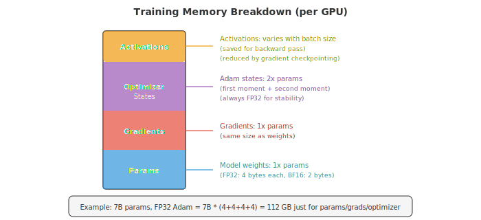
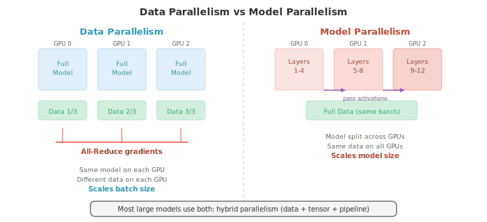
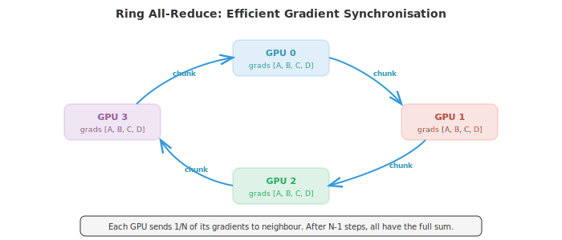
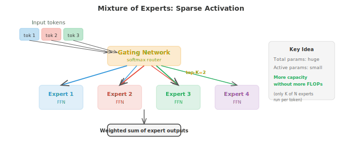

# Распределенное глубокое обучение

*Распределенное обучение распределяет вычисления между несколькими GPU и машинами для обучения моделей, которые слишком велики или требуют слишком много времени для одного устройства. В этом файле рассматриваются смешанная точность, параллелизм данных, параллелизм моделей, конвейерный параллелизм, ZeRO, FSDP, тензорный параллелизм и коммуникационные примитивы, такие как all-reduce, необходимые для обучения LLM в больших масштабах.*

- Обучение большой нейронной сети на одном GPU рано или поздно упирается в предел. Модель может не поместиться в память, или обучение может занять месяцы. Распределенное обучение распределяет работу между несколькими устройствами (GPU, TPU или целыми машинами), чтобы обучать быстрее и создавать более крупные модели. В этом файле рассматриваются методы, которые делают это возможным.

- Чтобы понять, почему распределение имеет значение, начнем с **вычислительной стоимости** обучения. Один прямой проход через полносвязный слой с $d_{\text{in}}$ входами и $d_{\text{out}}$ выходами на батче из $B$ примеров требует примерно $2 \cdot B \cdot d_{\text{in}} \cdot d_{\text{out}}$ FLOP (операций с плавающей запятой): одно умножение и одно сложение для каждого элемента выходной матрицы. Обратный проход стоит примерно в два раза дороже прямого (вычисление градиентов как по входам, так и по весам), поэтому один шаг обучения на полносвязном слое составляет около $6 \cdot B \cdot d_{\text{in}} \cdot d_{\text{out}}$ FLOP.

- Для слоя трансформера со скрытой размерностью $d$ блок самовнимания включает четыре проекции (Q, K, V и выходную), каждая из которых стоит $O(B \cdot n \cdot d^2)$ FLOP (где $n$ — длина последовательности), плюс вычисление матрицы внимания со сложностью $O(B \cdot n^2 \cdot d)$. Блок полносвязной сети (feed-forward) имеет два плотных слоя, обычно расширяющих размерность до $4d$ и обратно: $O(B \cdot n \cdot 8d^2)$. Итого на слой: примерно $O(B \cdot n \cdot 12d^2 + B \cdot n^2 \cdot d)$. Умножьте это на количество слоев, и вы поймете, почему для обучения моделей масштаба GPT требуются тысячи GPU-часов.

- **Предел памяти** (memory wall) часто является более жестким ограничением. Во время обучения память GPU должна одновременно хранить четыре компонента:



- **Параметры**: веса модели. Модели с 7 миллиардами параметров в формате FP32 (4 байта на параметр) требуется 28 ГБ только для весов.
- **Градиенты**: того же размера, что и параметры. Еще 28 ГБ.
- **Состояния оптимизатора**: Adam поддерживает два дополнительных буфера (оценки первого и второго моментов), каждый размером с параметры. Они хранятся в FP32 для численной стабильности, даже если модель использует меньшую точность. Для нашей модели 7B это $2 \times 28 = 56$ ГБ.
- **Активации**: промежуточные значения, сохраняемые во время прямого прохода для использования в обратном проходе. Размер зависит от размера батча, длины последовательности и ширины модели. Это часто самый крупный компонент, который растет линейно с размером батча.

- Для нашей модели 7B с Adam в FP32: 28 (параметры) + 28 (градиенты) + 56 (оптимизатор) = 112 ГБ, еще до учета активаций. Один GPU A100 на 80 ГБ не может вместить это. Вот почему распределенные стратегии необходимы.

- **Обучение со смешанной точностью** — это первая линия обороны. Вместо хранения всего в FP32 (32-битная плавающая запятая) вы обучаете модель, используя FP16 или BF16 (16-битные) для прямого и обратного проходов, сохраняя при этом мастер-копию весов в FP32 для обновления оптимизатора.

- **FP16** обладает высокой точностью (10-битная мантисса), но ограниченным диапазоном, что может привести к переполнению или потере значимости (overflow/underflow). Масштабирование функции потерь (умножение функции потерь на большой коэффициент перед обратным проходом с последующим делением градиентов на тот же коэффициент) смягчает эту проблему.

- **BF16** (brain float) имеет тот же диапазон экспоненты, что и FP32 (8-битная экспонента), но меньшую точность (7-битная мантисса). Он почти никогда не переполняется и редко требует масштабирования функции потерь, что упрощает его использование. BF16 является стандартом для обучения современных трансформеров.

- Смешанная точность примерно вдвое сокращает память для активаций и градиентов (основные затраты во время прямого/обратного проходов), сохраняя при этом состояния оптимизатора в FP32 для численной стабильности.

- **Параллелизм данных** — это самая простая распределенная стратегия. Вы реплицируете всю модель на $N$ GPU, разбиваете каждый мини-батч на $N$ равных частей и отправляете по одной части на каждый GPU. Каждый GPU независимо выполняет прямой и обратный проходы на своей части. Затем градиенты усредняются по всем GPU (с использованием операции all-reduce), и каждый GPU обновляет свою локальную копию модели.

- С точки зрения модели это эквивалентно обучению с мини-батчем, который в $N$ раз больше. Если каждый GPU обрабатывает батч размера $B$, эффективный размер батча составляет $N \cdot B$.



- Усреднение градиентов может выполняться синхронно или асинхронно. **Синхронный SGD** ожидает завершения работы всех GPU перед усреднением, обеспечивая математическую эквивалентность обучению на одном GPU с большим батчем. Недостатком является то, что самый медленный GPU («отстающий») задерживает всех остальных.

- **Асинхронный SGD** позволяет каждому GPU обновлять общий сервер параметров независимо, не дожидаясь остальных. Это устраняет проблему «отстающего», но вводит «устаревшие градиенты»: GPU может вычислить градиенты на основе слегка устаревших параметров. Устаревшие градиенты добавляют шум и могут замедлить сходимость. На практике предпочтителен синхронный SGD с эффективной коммуникацией.

- **Накопление градиентов** — это программный трюк для имитации больших размеров батча на ограниченном оборудовании. Вместо одного обновления на мини-батч вы выполняете несколько прямых/обратных проходов и накапливаете градиенты, а затем делаете одно обновление. Это дает тот же результат, что и при большем батче, без необходимости в дополнительной памяти GPU для активаций (в памяти одновременно находится только один мини-батч активаций).

- Когда сама модель слишком велика, чтобы поместиться на одном GPU, вам нужен **параллелизм моделей**. Существует два основных вида.

- **Тензорный параллелизм** разделяет отдельные слои между GPU. Большое матричное умножение $Y = XW$ можно разделить по столбцам: разбить $W$ на $[W_1, W_2]$ между двумя GPU, вычислить $Y_1 = XW_1$ и $Y_2 = XW_2$ параллельно, а затем объединить результаты. Это работает для проекций внимания и полносвязных слоев. Это требует быстрой связи между GPU (обычно NVLink внутри узла), так как частичные результаты должны объединяться на каждом слое.

- **Конвейерный параллелизм** (pipeline parallelism) распределяет разные слои по разным GPU. GPU 0 выполняет слои 1–4, GPU 1 — слои 5–8 и так далее. Данные проходят через конвейер подобно сборочной линии. Наивный подход страдает от «пузырей конвейера»: пока GPU 0 выполняет прямой проход для микро-батча 1, GPU 1–3 простаивают. **Микро-батчинг** (micro-batching) смягчает эту проблему, разбивая мини-батч на более мелкие микро-батчи, которые проходят через конвейер последовательно, что позволяет загрузить все GPU большую часть времени.

- **Гибридный параллелизм** сочетает параллелизм по данным, тензорный параллелизм и конвейерный параллелизм. Типичная конфигурация для большой модели может использовать тензорный параллелизм внутри узла (8 GPU, соединенных быстрым интерфейсом NVLink), конвейерный параллелизм между узлами и параллелизм по данным между группами узлов. Именно так обучаются такие модели, как GPT-4 и Llama.

- Эффективность распределенного обучения сильно зависит от **коммуникации**. Ключевой операцией является **all-reduce**: имея значение на каждом из $N$ GPU, вычислить сумму (или среднее) и распределить результат на все GPU.

- Наивный all-reduce отправляет все данные на один GPU, суммирует их и рассылает обратно. Это дает сложность $O(N)$ по коммуникации и создает «бутылочное горлышко» на корневом узле.

- **Ring all-reduce** гораздо эффективнее. GPU в количестве $N$ располагаются в кольцо. Каждый GPU разбивает свои данные на $N$ фрагментов. За $N - 1$ шагов каждый GPU отправляет один фрагмент своему соседу и получает фрагмент от другого соседа, накапливая частичные суммы. После еще $N - 1$ шагов полная сумма распространяется на все GPU. Общий объем данных, передаваемых на один GPU: $2(N-1)/N$ от размера данных, что при росте $N$ стремится к $2\times$. Важно, что это значение не растет с увеличением $N$, что делает алгоритм оптимальным по пропускной способности.



- **Серверы параметров** (parameter servers) — это альтернативная архитектура, где выделенные серверные узлы хранят параметры модели. Воркеры вычисляют градиенты и отправляют их на сервер, который обновляет параметры и отправляет их обратно. Это проще, но может создавать коммуникационные задержки на сервере.

- **NCCL** (NVIDIA Collective Communications Library) — стандартная библиотека для коммуникации между GPU. Она предоставляет оптимизированные реализации all-reduce, all-gather, broadcast и других коллективных операций, автоматически выбирая лучший алгоритм для топологии сети.

- **Законы масштабирования** (scaling laws) описывают, как производительность модели улучшается с ростом вычислительных мощностей, данных и размера модели. Оригинальные законы масштабирования Kaplan et al. (2020) показали, что функция потерь убывает как степенная функция от каждого из этих параметров:

$$L(N) \propto N^{-\alpha_N}, \quad L(D) \propto D^{-\alpha_D}, \quad L(C) \propto C^{-\alpha_C}$$

- где $N$ — количество параметров, $D$ — размер датасета, а $C$ — бюджет вычислений.

- **Законы масштабирования Chinchilla** (Hoffmann et al., 2022) показали, что большинство моделей были недообучены: при заданном бюджете вычислений следует обучать меньшую модель на большем объеме данных, чем считалось ранее. Оптимальное соотношение составляет примерно 20 токенов на параметр. Модель 7B должна увидеть около 140B токенов, а не 300B, которые использовались в Llama 1 для модели 65B. Это открытие сместило фокус в сторону «вычислительно-оптимального» обучения.

- **Смесь экспертов** (Mixture of Experts, MoE) — это архитектура, которая масштабирует емкость модели без пропорционального увеличения вычислений. Вместо одной полносвязной сети (FFN) на слой трансформера используется $N$ сетей-«экспертов» (каждая из которых является стандартной FFN). **Сеть-гейт** (маршрутизатор) анализирует каждый токен и отправляет его к топ-$K$ экспертам (обычно $K = 1$ или $K = 2$).



- Общее количество параметров намного больше (потому что у вас $N$ экспертов), но количество FLOP на токен остается примерно постоянным (потому что на каждый токен активируются только $K$ экспертов). Например, Mixtral 8x7B имеет 47B параметров, но использует только около 13B на прямой проход, обеспечивая производительность гораздо более крупной модели при затратах меньшей.

- MoE создает определенные трудности. **Балансировка нагрузки**: если маршрутизатор отправляет большинство токенов одному и тому же эксперту, остальные простаивают. Дополнительная функция потерь (auxiliary loss) стимулирует равномерную маршрутизацию. **Коммуникация**: разные эксперты могут находиться на разных GPU, поэтому маршрутизация токенов требует коммуникации «все-ко-всем» (all-to-all), что является дорогостоящей операцией.

- **Отказоустойчивость** критически важна, когда обучение длится недели или месяцы на тысячах GPU. Если один GPU выходит из строя, нельзя допустить потери всего прогресса. **Чекпоинтинг** (checkpointing) периодически сохраняет веса модели, состояния оптимизатора и состояние обучения (скорость обучения, количество шагов, позицию в данных) на диск. В случае сбоя обучение возобновляется с последнего чекпоинта.

- **Градиентный чекпоинтинг** (также называемый перевычислением активаций) — это оптимизация памяти, а не механизм отказоустойчивости. Во время прямого прохода вместо сохранения всех активаций для обратного прохода сохраняются только активации в определенных контрольных точках. Во время обратного прохода недостающие активации перевычисляются из контрольных точек. Это обмен вычислений на память: стоимость прямого прохода возрастает примерно на 33%, но память для активаций может сократиться в $\sqrt{L}$ раз (где $L$ — количество слоев).

- Подводя итог, обучение передовой модели сочетает все эти методы: смешанную точность BF16, параллелизм по данным на тысячах GPU с использованием ring all-reduce, тензорный параллелизм внутри узлов, конвейерный параллелизм между узлами, градиентный чекпоинтинг для экономии памяти, MoE для эффективности параметров и регулярный чекпоинтинг для отказоустойчивости. Системная инженерия здесь столь же сложна, как и проектирование алгоритмов.

- Сводка инструментов распределенного обучения:

| Техника | Что делает | Компромисс |
|---|---|---|
| Смешанная точность (BF16) | Сокращает вдвое память для активаций/градиентов | Незначительные численные различия |
| Параллелизм по данным | Масштабирует размер батча по GPU | Накладные расходы на синхронизацию градиентов |
| Тензорный параллелизм | Разделяет слои между GPU | Требует быстрого соединения |
| Конвейерный параллелизм | Разделяет этапы модели между GPU | «Пузыри» конвейера (потеря вычислений) |
| Накопление градиентов | Имитирует большие батчи | Медленнее (несколько прямых/обратных проходов) |
| Градиентный чекпоинтинг | Снижает память для активаций | ~33% больше вычислений |
| Ring all-reduce | Эффективное усреднение градиентов | Ограничено пропускной способностью для больших моделей |
| MoE | Больше емкость, те же FLOP | Балансировка нагрузки, сложность маршрутизации |
| Законы масштабирования | Помогают распределять вычисления | Эмпирические, могут не работать на всех масштабах |

## Задачи по программированию (используйте CoLab или ноутбук)

1. Вычислите количество FLOP и требования к памяти для слоя трансформера. Зная размерность скрытого состояния $d$, длину последовательности $n$, размер батча $B$ и количество слоев, оцените общую стоимость обучения.

```python
import jax.numpy as jnp

def transformer_layer_flops(d, n, B):
    """Approximate FLOPs for one transformer layer forward pass."""
    # QKV projections: 3 * (B * n * d * d) * 2 (multiply-add)
    qkv_flops = 3 * 2 * B * n * d * d
    # Attention: (B * n * n * d) * 2 for QK^T, (B * n * n * d) * 2 for attn*V
    attn_flops = 2 * 2 * B * n * n * d
    # Output projection: (B * n * d * d) * 2
    out_flops = 2 * B * n * d * d
    # FFN: two layers, d->4d and 4d->d: 2 * (B * n * d * 4d) * 2
    ffn_flops = 2 * 2 * B * n * d * 4 * d
    return qkv_flops + attn_flops + out_flops + ffn_flops

def transformer_layer_memory(d, n, B, dtype_bytes=2):
    """Approximate activation memory (bytes) for one layer."""
    # QKV: 3 * B * n * d
    qkv_mem = 3 * B * n * d * dtype_bytes
    # Attention weights: B * heads * n * n (approx B * n * n * sizeof)
    attn_mem = B * n * n * dtype_bytes
    # FFN intermediate: B * n * 4d
    ffn_mem = B * n * 4 * d * dtype_bytes
    return qkv_mem + attn_mem + ffn_mem

# Example: GPT-2 scale
d, n, B, L = 1024, 1024, 8, 24
fwd_flops = transformer_layer_flops(d, n, B)
total_flops = 3 * L * fwd_flops  # 3x for forward + backward
act_mem = L * transformer_layer_memory(d, n, B)
param_count = L * (12 * d * d + 13 * d)  # approximate

print(f"Model: d={d}, n={n}, B={B}, L={L}")
print(f"Parameters: {param_count / 1e6:.0f}M")
print(f"FLOPs per step: {total_flops / 1e12:.2f} TFLOPs")
print(f"Activation memory: {act_mem / 1e9:.2f} GB (BF16)")
print(f"Parameter memory (FP32): {param_count * 4 / 1e9:.2f} GB")
print(f"Adam optimizer memory: {param_count * 8 / 1e9:.2f} GB")
print(f"Total training memory: {(param_count * 16 + act_mem) / 1e9:.2f} GB")
```

2. Смоделируйте обучение с параллелизмом по данным (data-parallel training). Разделите датасет между несколькими «виртуальными GPU», вычислите градиенты независимо, усредните их и проверьте, совпадает ли результат с обучением на одном GPU.

```python
import jax
import jax.numpy as jnp

# Simple linear model: y = wx + b
key = jax.random.PRNGKey(0)
X = jax.random.normal(key, (64, 4))
w_true = jnp.array([1.0, -2.0, 3.0, 0.5])
y = X @ w_true + 0.1 * jax.random.normal(key, (64,))

def loss_fn(w, X, y):
    return jnp.mean((X @ w - y) ** 2)

grad_fn = jax.grad(loss_fn)

# Single GPU: full batch gradient
w = jnp.zeros(4)
grad_single = grad_fn(w, X, y)

# Data parallel: split across 4 "GPUs"
n_gpus = 4
chunk_size = len(X) // n_gpus
grads = []
for i in range(n_gpus):
    X_chunk = X[i*chunk_size:(i+1)*chunk_size]
    y_chunk = y[i*chunk_size:(i+1)*chunk_size]
    grads.append(grad_fn(w, X_chunk, y_chunk))

# All-reduce: average gradients
grad_parallel = jnp.mean(jnp.stack(grads), axis=0)

print("Single-GPU gradient:", grad_single)
print("Data-parallel gradient (avg):", grad_parallel)
print(f"Match: {jnp.allclose(grad_single, grad_parallel, atol=1e-5)}")

# Train both and compare
w_single, w_parallel = jnp.zeros(4), jnp.zeros(4)
lr = 0.1
for step in range(100):
    w_single = w_single - lr * grad_fn(w_single, X, y)

    grads = [grad_fn(w_parallel, X[i*chunk_size:(i+1)*chunk_size],
                     y[i*chunk_size:(i+1)*chunk_size]) for i in range(n_gpus)]
    avg_grad = jnp.mean(jnp.stack(grads), axis=0)
    w_parallel = w_parallel - lr * avg_grad

print(f"\nAfter 100 steps:")
print(f"Single-GPU weights: {w_single}")
print(f"Data-parallel weights: {w_parallel}")
print(f"Max difference: {jnp.max(jnp.abs(w_single - w_parallel)):.2e}")
```

3. Реализуйте простой слой «смеси экспертов» (Mixture of Experts). Создайте сеть-гейт (gating network), которая направляет токены к топ-K экспертам, и объедините их выходные данные.

```python
import jax
import jax.numpy as jnp

def expert_fn(x, W1, b1, W2, b2):
    """Simple 2-layer FFN expert."""
    h = jnp.maximum(0, x @ W1 + b1)  # ReLU
    return h @ W2 + b2

def moe_layer(x, gate_W, experts_params, top_k=2):
    """
    MoE forward pass.
    x: (batch, d_model)
    gate_W: (d_model, n_experts)
    experts_params: list of (W1, b1, W2, b2) per expert
    """
    n_experts = len(experts_params)

    # Gating: compute routing scores
    gate_logits = x @ gate_W  # (batch, n_experts)
    gate_probs = jax.nn.softmax(gate_logits, axis=-1)

    # Top-K selection
    top_k_indices = jnp.argsort(-gate_probs, axis=-1)[:, :top_k]
    top_k_probs = jnp.take_along_axis(gate_probs, top_k_indices, axis=-1)
    # Renormalise
    top_k_probs = top_k_probs / jnp.sum(top_k_probs, axis=-1, keepdims=True)

    # Compute expert outputs (simplified: run all experts, mask later)
    expert_outputs = jnp.stack([
        expert_fn(x, *experts_params[i]) for i in range(n_experts)
    ], axis=1)  # (batch, n_experts, d_model)

    # Gather top-K expert outputs and weight them
    batch_idx = jnp.arange(x.shape[0])[:, None]
    selected_outputs = expert_outputs[batch_idx, top_k_indices]  # (batch, top_k, d_model)
    output = jnp.sum(selected_outputs * top_k_probs[:, :, None], axis=1)

    return output, gate_probs

# Setup
key = jax.random.PRNGKey(42)
batch, d_model, d_ff, n_experts = 8, 16, 32, 4

# Initialise experts
experts_params = []
for i in range(n_experts):
    k1, k2, key = jax.random.split(key, 3)[0], jax.random.split(key, 3)[1], jax.random.split(key, 3)[2]
    experts_params.append((
        jax.random.normal(k1, (d_model, d_ff)) * 0.1,
        jnp.zeros(d_ff),
        jax.random.normal(k2, (d_ff, d_model)) * 0.1,
        jnp.zeros(d_model),
    ))

key, subkey = jax.random.split(key)
gate_W = jax.random.normal(subkey, (d_model, n_experts)) * 0.1
x = jax.random.normal(key, (batch, d_model))

output, gate_probs = moe_layer(x, gate_W, experts_params, top_k=2)

print(f"Input shape: {x.shape}")
print(f"Output shape: {output.shape}")
print(f"Gate probabilities (first sample): {gate_probs[0]}")
print(f"Expert usage (avg across batch):")
for i in range(n_experts):
    usage = jnp.mean(gate_probs[:, i])
    print(f"  Expert {i}: {usage:.3f}")
```
