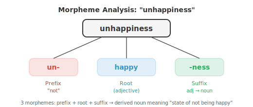

# Лингвистические основы

*Лингвистика предоставляет структурный словарь, который системы NLP (обработки естественного языка) неявно изучают и используют. В этом файле рассматриваются морфология, синтаксис, семантика, прагматика, фонология, составляющие и зависимостные синтаксические деревья, а также дистрибутивная гипотеза — наука о человеческом языке, которая лежит в основе токенизации, грамматики и смысла в ИИ.*

- Прежде чем мы сможем создавать системы, которые понимают или генерируют язык, нам нужно понять, как работает сам язык.

- Лингвистика — это научное изучение языка, и она предоставляет концептуальный словарь, который NLP постоянно заимствует.

- Даже современные нейронные модели, которые изучают язык на основе «сырых» данных, неявно заново открывают многие структуры, которые лингвисты каталогизировали десятилетиями.

- Язык имеет структуру на каждом уровне: звуки, из которых состоят слова; части, из которых состоят слова; правила, объединяющие слова в предложения; смысл, который несут эти предложения; и то, как контекст формирует интерпретацию. Мы будем прорабатывать каждый уровень снизу вверх.

- **Морфология** — это изучение внутренней структуры слов. Слова не являются атомарными; они построены из более мелких значимых единиц, называемых **морфемами**.

- Слово «unhappiness» содержит три морфемы: «un-» (префикс, означающий «не»), «happy» (корень) и «-ness» (суффикс, превращающий прилагательное в существительное). Каждая морфема вносит свой вклад в значение.

- **Корень** (или основа) — это основная морфема, несущая главный смысл. «Happy», «run», «compute» — это корни.

- **Аффикс** — это морфема, которая присоединяется к корню для его модификации.

- В английском языке есть **префиксы** (перед корнем: un-, re-, pre-) и **суффиксы** (после: -ing, -ed, -tion). В некоторых языках также есть инфиксы (вставляются внутрь корня) и циркумфиксы (обрамляют корень).



- Существует два вида морфологических процессов. **Флексия** (словоизменение) меняет грамматические свойства слова, не меняя его основного значения или части речи: «run» становится «runs» (третье лицо), «running» (продолженное время), «ran» (прошедшее время). Слово остается глаголом с тем же значением.

- **Деривация** (словообразование) создает новое слово, часто меняя часть речи: «happy» (прилагательное) становится «happiness» (существительное), «compute» (глагол) становится «computation» (существительное), которое становится «computational» (прилагательное). Каждая деривация меняет значение и грамматическую категорию.

- Языки сильно различаются по морфологической сложности. Английский язык относительно **аналитический** (мало морфем на слово, опора на порядок слов).

- Турецкий и финский языки являются **агглютинативными** (слова могут содержать множество морфем, соединенных вместе). Арабский и иврит используют **темплатную** (корневую) морфологию (корни представляют собой скелеты из согласных, например k-t-b для «писать», а для создания разных слов вставляются гласные паттерны: kitab «книга», kataba «он писал», maktub «написанный»).

- Морфология важна для NLP, потому что она влияет на токенизацию. Токенизатор на уровне слов рассматривает «run», «runs», «running» и «ran» как четыре несвязанных символа.

- Морфологически осведомленная система распознает, что у них общий корень. Токенизация на уровне подслов (BPE, WordPiece), которую мы рассмотрим в файле 02, является статистической аппроксимацией морфологического анализа.

- **Синтаксис** — это изучение того, как слова объединяются в фразы и предложения. В каждом языке есть правила, регулирующие порядок слов и структуру; их нарушение приводит к бессмыслице.

- «The cat sat on the mat» — грамматически правильное английское предложение; «Mat the on sat cat the» — нет.

- Существует две основные концепции описания синтаксической структуры.

- **Грамматика составляющих** (также называемая фразовой грамматикой) утверждает, что предложения строятся путем вложения фраз во фразы. Предложение (S) состоит из именной группы (NP) и глагольной группы (VP).

- Именная группа может состоять из определителя (Det), за которым следует существительное (N). Глагольная группа может состоять из глагола (V), за которым следует именная группа. Эти правила строят дерево:


- Это дерево называется **деревом составляющих** (или деревом разбора). Каждый внутренний узел — это тип фразы, каждый лист — слово. Дерево отражает иерархическую группировку: «on the mat» — это единица (предложная группа), «sat on the mat» — это единица (глагольная группа), а всё вместе — предложение.

- **Контекстно-свободная грамматика (КС-грамматика)** формализует эти правила. Она состоит из набора правил вывода, каждое из которых имеет вид $A \to \alpha$, где $A$ — нетерминальный символ (тип фразы, такой как NP или VP), а $\alpha$ — последовательность терминалов (слов) и нетерминалов. Например:

```
S  → NP VP
NP → Det N
NP → Det N PP
VP → V NP
VP → V PP
PP → P NP
Det → "the" | "a"
N  → "cat" | "mat" | "dog"
V  → "sat" | "chased"
P  → "on" | "under"
```

- Начиная с S и многократно применяя правила, можно сгенерировать все предложения, которые допускает грамматика. Парсинг (синтаксический разбор) — это обратный процесс: по заданному предложению найти дерево (или деревья), которое его породило. Предложение с несколькими допустимыми деревьями разбора является **синтаксически неоднозначным**. «I saw the man with the telescope» имеет два варианта разбора: я использовал телескоп, чтобы увидеть человека, или я увидел человека, у которого был телескоп.

- **Зависимостная грамматика** предлагает другой взгляд. Вместо вложения фраз она описывает прямые отношения между словами. Каждое слово в предложении зависит ровно от одного другого слова (своего **вершины**), за исключением корня предложения. Результатом является **дерево зависимостей**, где ребра помечены грамматическими отношениями (подлежащее, дополнение, определение и т. д.).


- В зависимостном представлении «sat» является корнем. «Cat» зависит от «sat» как подлежащее (nsubj). «On» зависит от «sat» как предложный модификатор. «Mat» зависит от «on» как дополнение предлога. Каждое слово «подвешено» ровно к одной вершине, образуя дерево.

- Грамматика зависимостей стала доминирующей структурой в современном NLP, поскольку деревья зависимостей легче строить с помощью статистических парсеров, а отношения в них более прямо соотносятся с семантическими ролями (кто сделал что и кому).

- **Валентность** описывает, сколько аргументов требует глагол. «Спать» — **непереходный** глагол (один аргумент: тот, кто спит). «Есть» — **переходный** глагол (два: тот, кто ест, и то, что едят). «Давать» — **дитранзитивный** глагол (три: дающий, предмет и получатель). Знание валентности глагола ограничивает набор допустимых деревьев разбора.

- **Семантика** — это наука о значении. Синтаксис говорит о том, как структурировано предложение; семантика — о том, что оно означает.

- **Лексическая семантика** касается значения отдельных слов. Слова связаны друг с другом систематическим образом:

    - **Синонимия**: слова с (почти) одинаковым значением. «Большой» и «крупный» — синонимы. Истинная, идеальная синонимия встречается редко; почти всегда есть тонкие различия в коннотации или употреблении.
    - **Антонимия**: слова с противоположными значениями. «Горячий» и «холодный», «покупать» и «продавать».
    - **Гиперонимия/гипонимия**: отношения «является видом». «Собака» — гипоним «животного» (собака — это вид животного). «Животное» — гипероним «собаки». Они образуют таксономические иерархии.
    - **Меронимия**: отношения «часть целого». «Колесо» — мероним «автомобиля».
    - **Полисемия**: одно слово с несколькими связанными значениями. «Банк» означает финансовое учреждение или берег реки. Контекст помогает снять неоднозначность.

- **Разрешение лексической многозначности (WSD)** — это задача определения того, какое значение многозначного слова имеется в виду в данном контексте. В предложении «Я положил деньги в банк» правильным является финансовое значение. В предложении «Мы сидели на берегу реки» — географическое. WSD была центральной проблемой в раннем NLP; современные контекстные эмбеддинги (ELMo, BERT) в значительной степени решают её, создавая разные векторные представления для разных случаев использования одного и того же слова.

- **Композиционная семантика** изучает, как значения отдельных слов объединяются, формируя значение фразы или предложения. Принцип **композиционности** (приписываемый Фреге) гласит, что значение сложного выражения определяется значениями его частей и правилами их объединения. «Кот погнался за собакой» означает не то же самое, что «собака погналась за котом», потому что синтаксическая структура (кто является подлежащим, а кто дополнением) взаимодействует со значениями слов.

- Не все значения являются композиционными. **Идиомы**, такие как «сыграть в ящик» (означающая «умереть»), имеют значения, которые невозможно вывести из их частей. Это вызов для любого композиционного подхода.

- **Дистрибутивная семантика** — это вычислительный подход к значению, лежащий в основе современного NLP. **Дистрибутивная гипотеза** (Ферс, 1957) гласит: «О слове можно судить по его окружению». Слова, которые встречаются в схожих контекстах, как правило, имеют схожие значения. Это теоретический фундамент для векторных представлений слов (Word2Vec, GloVe), которые мы рассмотрим в файле 03.

- **Прагматика** изучает, как контекст влияет на значение. Одно и то же предложение может означать разные вещи в зависимости от того, кто его говорит, когда, где и почему.

- «Можешь передать соль?» синтаксически является вопросом «да/нет» о способности. Прагматически это просьба. Вы не ответите «Да, могу» и не останетесь сидеть на месте. Понимание этого требует знаний, выходящих за рамки буквальных слов, а именно — знания конвенций **речевых актов**.

- **Теория речевых актов** (Остин, Сёрл) различает:
    - **Локутивный акт**: буквальное содержание («Можешь передать соль?»)
    - **Иллокутивный акт**: намеренная функция (просьба)
    - **Перлокутивный акт**: эффект, произведенный на слушателя (он передает соль)

- **Импликатура** (Грайс) — это значение, которое подразумевается, но не выражено явно. Если кто-то спрашивает: «Джон хороший повар?», а вы отвечаете: «Он британец», вы не ответили на вопрос буквально, но слушатель может сделать вывод (справедливо или нет, опираясь на культурные стереотипы), что вы имеете в виду «нет». **Кооперативный принцип** Грайса гласит, что говорящие обычно стараются быть информативными, правдивыми, релевантными и ясными, а слушатели интерпретируют высказывания, исходя из того, что эти максимы соблюдаются.

- **Кореференция** — это прагматическое явление, при котором разные выражения относятся к одной и той же сущности. В предложении «Алиса пошла в магазин. Она купила молоко» слово «она» относится к Алисе. Разрешение кореференции необходимо для понимания текста из нескольких предложений и является ключевой задачей NLP.

- **Структура дискурса** описывает, как предложения соединяются, образуя связный текст. У повествования есть начало, середина и конец. У аргументации есть тезисы и доказательства. **Теория риторической структуры (RST)** анализирует текст как дерево дискурсивных отношений (уточнение, противопоставление, причина и т. д.) между сегментами.

- Прагматика — это область, где NLP сталкивается с наибольшими трудностями. Современные языковые модели справляются с большей частью синтаксиса и семантики неявно за счет обучающих данных, но прагматическое рассуждение, понимание сарказма, импликатур и контекстно-зависимых значений остается передовым рубежом.

- **Фонология** изучает звуковые системы языков. Хотя эта глава посвящена тексту, краткий обзор служит мостом к главе об аудио и речи (Глава 09).

- **Фонема** — это минимальная единица звука, различающая значения. В английском языке около 44 фонем. Слова «bat» и «pat» различаются одной фонемой (/b/ против /p/), что полностью меняет значение. Это называется **минимальной парой**.

- **Аллофоны** — это различные физические реализации одной и той же фонемы, которые не меняют значения. Звук «p» в слове «pin» (аспирированный, с придыханием) и «p» в слове «spin» (неаспирированный) являются аллофонами /p/ в английском языке; носитель языка воспринимает их как один и тот же звук.

- **Международный фонетический алфавит (IPA)** предоставляет стандартизированную нотацию для фонем всех языков. Слово «cat» транскрибируется как /kæt/. IPA — это мост между письменным текстом и речевыми системами.

- **Просодия** охватывает ритм, ударение и интонацию речи. Фраза «I didn't say he stole the money» имеет семь разных значений в зависимости от того, на какое слово падает ударение. Просодия несет информацию, которую теряет текст сам по себе, поэтому системы синтеза речи должны моделировать её очень тщательно.

- В области обработки естественного языка (NLP) фонологические знания проявляются в синтезе речи (преобразование графем в фонемы), распознавании речи (отображение акустических сигналов в фонемы) и даже в исправлении орфографии и транслитерации.

## Задачи по программированию (используйте CoLab или ноутбук)

1. Создайте простой морфологический анализатор, который разбивает английские слова на вероятные морфемы, используя список распространенных префиксов и суффиксов.
```python
prefixes = ['un', 're', 'pre', 'dis', 'mis', 'over', 'under', 'out', 'non']
suffixes = ['ing', 'ed', 'ly', 'ness', 'ment', 'tion', 'able', 'ible', 'er', 'est', 'ful', 'less', 'ous']

def analyse_morphemes(word):
    """Simple morpheme analysis using known affixes."""
    parts = []
    remaining = word.lower()

    # Check prefixes
    for p in sorted(prefixes, key=len, reverse=True):
        if remaining.startswith(p) and len(remaining) > len(p) + 2:
            parts.append(f"[prefix: {p}]")
            remaining = remaining[len(p):]
            break

    # Check suffixes
    for s in sorted(suffixes, key=len, reverse=True):
        if remaining.endswith(s) and len(remaining) > len(s) + 2:
            root = remaining[:-len(s)]
            parts.append(f"[root: {root}]")
            parts.append(f"[suffix: {s}]")
            remaining = None
            break

    if remaining is not None:
        parts.append(f"[root: {remaining}]")

    return parts

for word in ['unhappiness', 'reusable', 'disconnected', 'overreacting', 'kindness']:
    print(f"{word:20s} → {' + '.join(analyse_morphemes(word))}")
```

2. Реализуйте простой парсер контекстно-свободной грамматики (CFG), используя метод рекурсивного спуска. Определите небольшую грамматику и разберите предложение в дерево составляющих.
```python
class CFGParser:
    """Recursive descent parser for a tiny English grammar."""
    def __init__(self, tokens):
        self.tokens = tokens
        self.pos = 0

    def peek(self):
        return self.tokens[self.pos] if self.pos < len(self.tokens) else None

    def consume(self, expected=None):
        tok = self.peek()
        if expected and tok != expected:
            return None
        self.pos += 1
        return tok

    def parse_det(self):
        if self.peek() in ('the', 'a'):
            return ('Det', self.consume())
        return None

    def parse_noun(self):
        if self.peek() in ('cat', 'dog', 'mat', 'man'):
            return ('N', self.consume())
        return None

    def parse_verb(self):
        if self.peek() in ('sat', 'chased', 'saw'):
            return ('V', self.consume())
        return None

    def parse_prep(self):
        if self.peek() in ('on', 'under', 'with'):
            return ('P', self.consume())
        return None

    def parse_np(self):
        save = self.pos
        det = self.parse_det()
        noun = self.parse_noun()
        if det and noun:
            # Check for optional PP
            pp = self.parse_pp()
            if pp:
                return ('NP', det, noun, pp)
            return ('NP', det, noun)
        self.pos = save
        return None

    def parse_pp(self):
        save = self.pos
        prep = self.parse_prep()
        np = self.parse_np()
        if prep and np:
            return ('PP', prep, np)
        self.pos = save
        return None

    def parse_vp(self):
        save = self.pos
        verb = self.parse_verb()
        if verb:
            np = self.parse_np()
            if np:
                return ('VP', verb, np)
            pp = self.parse_pp()
            if pp:
                return ('VP', verb, pp)
        self.pos = save
        return None

    def parse_sentence(self):
        np = self.parse_np()
        vp = self.parse_vp()
        if np and vp and self.pos == len(self.tokens):
            return ('S', np, vp)
        return None

def print_tree(tree, indent=0):
    if isinstance(tree, str):
        print(' ' * indent + tree)
    elif isinstance(tree, tuple):
        print(' ' * indent + tree[0])
        for child in tree[1:]:
            print_tree(child, indent + 2)

sentences = [
    "the cat sat on the mat",
    "a dog chased the cat",
]

for sent in sentences:
    tokens = sent.split()
    parser = CFGParser(tokens)
    tree = parser.parse_sentence()
    print(f"\n'{sent}':")
    if tree:
        print_tree(tree)
    else:
        print("  (no parse found)")
```

3. Исследуйте лексические отношения, построив простой граф слов. Имея небольшой словарь с отношениями синонимии, антонимии и гиперонимии, найдите пути между словами.
```python
relations = {
    ('big', 'large'): 'synonym',
    ('big', 'small'): 'antonym',
    ('small', 'tiny'): 'synonym',
    ('dog', 'animal'): 'hypernym',
    ('cat', 'animal'): 'hypernym',
    ('puppy', 'dog'): 'hypernym',
    ('happy', 'glad'): 'synonym',
    ('happy', 'sad'): 'antonym',
    ('hot', 'cold'): 'antonym',
    ('hot', 'warm'): 'synonym',
}

# Build adjacency list
from collections import defaultdict, deque

graph = defaultdict(list)
for (w1, w2), rel in relations.items():
    graph[w1].append((w2, rel))
    graph[w2].append((w1, rel))

def find_path(start, end):
    """BFS to find a path between two words through the relation graph."""
    queue = deque([(start, [(start, None)])])
    visited = {start}
    while queue:
        node, path = queue.popleft()
        if node == end:
            return path
        for neighbor, rel in graph[node]:
            if neighbor not in visited:
                visited.add(neighbor)
                queue.append((neighbor, path + [(neighbor, rel)]))
    return None

pairs = [('big', 'tiny'), ('puppy', 'cat'), ('happy', 'sad')]
for w1, w2 in pairs:
    path = find_path(w1, w2)
    if path:
        steps = " → ".join(f"{w}({r})" if r else w for w, r in path)
        print(f"{w1} → {w2}: {steps}")
    else:
        print(f"{w1} → {w2}: no path found")
```
