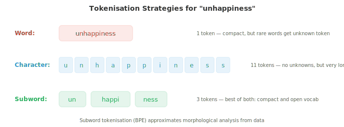
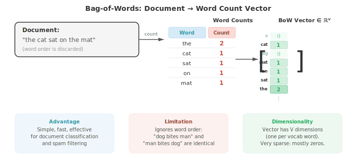

# Обработка текста и классическое NLP

*Обработка текста преобразует необработанные символы в структурированные представления, которые могут использовать модели. В этом файле рассматриваются токенизация (пословная, по подсловам, BPE, WordPiece), нормализация текста, редакционное расстояние, TF-IDF, n-граммные языковые модели, POS-теггинг, NER и анализ тональности — классический пайплайн NLP, который до сих пор лежит в основе современных систем.*

- Необработанный текст хаотичен. Прежде чем любая модель NLP сможет работать с языком, текст должен быть очищен, нормализован и преобразован в структурированное представление. В этом файле рассматривается пайплайн от необработанных символов до признаков, которые могут использовать модели, а также классические алгоритмы NLP, доминировавшие до эпохи глубокого обучения.

- **Нормализация текста** преобразует необработанный текст в каноническую форму. Цель состоит в том, чтобы уменьшить нерелевантные вариации, чтобы "Hello", "hello", "HELLO" и "héllo" обрабатывались соответствующим образом.

- **Приведение к нижнему регистру (case folding)** преобразует текст в строчные буквы. Это объединяет "The" и "the" в один токен. Это помогает в большинстве задач, но в некоторых случаях разрушает полезную информацию: "US" (страна) против "us" (местоимение) или "Apple" (компания) против "apple" (фрукт).

- **Unicode-нормализация** учитывает тот факт, что один и тот же символ может быть закодирован несколькими способами. Символ "é" может быть представлен как одна кодовая точка (U+00E9) или как базовый "e" плюс комбинируемый акцент (U+0065 + U+0301). NFC-нормализация объединяет их в одну кодовую точку; NFD — разлагает их. Без нормализации две визуально идентичные строки могут не совпасть.

- **Редакционное расстояние (edit distance)** измеряет степень различия двух строк. **Расстояние Левенштейна** подсчитывает минимальное количество операций вставки, удаления и замены одного символа, необходимых для преобразования одной строки в другую. Для "kitten" → "sitting" редакционное расстояние равно 3 (k→s, e→i, вставка g).

- Редакционное расстояние вычисляется с помощью динамического программирования (мы рассмотрим его в главе об алгоритмах). Определим $D[i][j]$ как расстояние между первыми $i$ символами строки $s$ и первыми $j$ символами строки $t$:

```math
D[i][j] = \begin{cases} j & \text{if } i = 0 \\ i & \text{if } j = 0 \\ D[i{-}1][j{-}1] & \text{if } s[i] = t[j] \\ 1 + \min(D[i{-}1][j], \; D[i][j{-}1], \; D[i{-}1][j{-}1]) & \text{otherwise} \end{cases}
```

- Редакционное расстояние лежит в основе исправления опечаток, нечеткого поиска и выравнивания последовательностей ДНК. В NLP оно используется для обработки опечаток и поиска похожих слов.

- **Токенизация** разбивает текст на дискретные единицы (токены), которые может обработать модель. Это первый и, пожалуй, самый важный этап предобработки. Выбор стратегии токенизации глубоко влияет на поведение модели.

- **Токенизация по пробелам** разбивает текст по пробелам. Это просто, но наивно: "New York" становится двумя токенами, "don't" — одним токеном (или разбивается на "don" и "'t" в зависимости от разделителя), а в таких языках, как китайский и японский, пробелы между словами вообще отсутствуют.

- **Токенизация на основе правил** использует созданные вручную шаблоны (регулярные выражения) для обработки сокращений, пунктуации и особых случаев. "I'm" → "I" + "'m", "U.S.A." остается одним токеном. Каждому языку нужны свои правила, что требует больших трудозатрат.

- **Токенизация по подсловам (subword tokenisation)** — это современное решение. Вместо разбиения по границам слов она изучает словарь частых подсловных единиц на основе данных. Это элегантно решает проблему неизвестных слов: если "unhappiness" отсутствует в словаре, оно может быть разбито на "un" + "happi" + "ness", сохраняя морфологическую структуру.



- **Byte-Pair Encoding (BPE)** начинает со словаря, состоящего из отдельных символов. Алгоритм многократно находит наиболее частую пару соседних токенов и объединяет их в новый токен. После достаточного количества объединений распространенные слова становятся отдельными токенами, а редкие слова разбиваются на частые подсловные фрагменты.

- Алгоритм BPE:
    1. Инициализировать словарь всеми отдельными символами из обучающего корпуса.
    2. Подсчитать частоту каждой пары соседних токенов.
    3. Объединить наиболее частую пару в новый токен.
    4. Повторять шаги 2-3 до достижения желаемого количества объединений (размера словаря).

- Например, начиная с "l o w" (5 раз), "l o w e r" (2 раза), "n e w e s t" (6 раз): наиболее частой парой может быть "e s" → объединяем в "es". Затем "es t" → "est". Затем "n e w" → "new". Итоговый словарь содержит как полные слова, так и подсловные фрагменты.

- **WordPiece** (используется в BERT) похож на BPE, но выбирает объединения на основе правдоподобия, а не частоты. Он объединяет пару, которая максимизирует правдоподобие языковой модели для обучающих данных. Токены подслов, которые не стоят в начале слова, помечаются префиксом "##" (например, "playing" → "play" + "##ing").

- **Unigram** (используется в SentencePiece) использует противоположный подход: начать с большого словаря и итеративно удалять токены, удаление которых меньше всего вредит правдоподобию обучающих данных. Итоговый словарь — это набор подсловных единиц, которые лучше всего объясняют корпус.

- **SentencePiece** — это не зависящая от языка библиотека токенизации, которая рассматривает входные данные как поток байтов (без предварительной токенизации по пробелам). Это позволяет ей работать с любым языком, включая те, где нет пробелов. Она реализует алгоритмы BPE и Unigram.

- Размер словаря — ключевой гиперпараметр. Типичные значения варьируются от 30 000 до 100 000 токенов. Большие словари означают меньше токенов на последовательность (более эффективно), но требуют большую таблицу эмбеддингов. Меньшие словари означают больше разбиений на подслова и более длинные последовательности.

- Оба метода сводят слова к базовой форме, но различаются по подходу.

- **Стемминг (stemming)** отсекает суффиксы с помощью грубых правил. Стеммер Портера сводит "running" к "run", "happiness" к "happi", а "studies" к "studi". Это быстро, но неточно: "university" и "universe" оба сводятся к "univers", несмотря на отсутствие связи между ними.

- **Лемматизация (lemmatisation)** использует словарь и морфологический анализ для поиска истинной словарной формы (леммы). "Running" → "run", "better" → "good", "mice" → "mouse". Это требует знания части речи: "saw" как глагол лемматизируется в "see", но как существительное остается "saw".

- Современная токенизация на основе подслов в значительной степени вытеснила стемминг и лемматизацию в нейронных методах NLP, однако они остаются полезными в задачах информационного поиска, а также при работе с небольшими моделями или ограниченными данными.

- **Частеречная разметка (POS-теггинг)** присваивает каждому слову грамматическую категорию: существительное, глагол, прилагательное, детерминатив и т. д. Это одна из старейших задач NLP, фундаментальная для синтаксического анализа.

- Набор тегов Penn Treebank является наиболее распространенным для английского языка и включает 36 тегов (NN для существительного в единственном числе, NNS для существительного во множественном числе, VB для начальной формы глагола, VBD для прошедшего времени, JJ для прилагательного и т. д.).

- Частеречная разметка сложна, поскольку многие слова многозначны. Слово «book» может быть существительным («the book») или глаголом («book a flight»). У слова «run» существуют десятки значений в разных частях речи. Контекст имеет решающее значение.

- Ранние теггеры использовали **скрытые марковские модели (HMM)** из главы 05. Скрытыми состояниями являются POS-теги, а наблюдениями — слова. Переходные вероятности отражают последовательности тегов (после детерминатива с высокой вероятностью следует существительное или прилагательное), а вероятности испускания показывают, какие слова встречаются с какими тегами. Алгоритм Витерби находит наиболее вероятную последовательность тегов.

- HMM-модель для частеречной разметки:

$$\hat{t}_{1:n} = \arg\max_{t_{1:n}} \prod_{i=1}^{n} P(w_i \mid t_i) \cdot P(t_i \mid t_{i-1})$$

- Современные POS-теггеры используют нейронные сети (двунаправленные LSTM или трансформеры) и достигают точности более 97% для английского языка, приближаясь к уровню человека.

- **Распознавание именованных сущностей (NER)** идентифицирует и классифицирует собственные имена и другие специфические сущности в тексте: имена людей, организации, локации, даты, денежные суммы и т. д.

- В предложении «Apple CEO Tim Cook announced the event in Cupertino on Monday» система NER должна выделить: Apple (ORG), Tim Cook (PER), Cupertino (LOC), Monday (DATE).

- NER обычно формулируется как задача **последовательной разметки** с использованием **BIO-теггинга** (также называемого IOB-теггингом). Каждый токен получает тег:
    - **B-TYPE**: начало сущности типа TYPE
    - **I-TYPE**: внутри (продолжение) сущности типа TYPE
    - **O**: вне любой сущности

- Фраза «Tim Cook visited New York» преобразуется в: Tim/B-PER Cook/I-PER visited/O New/B-LOC York/I-LOC. Тег B отмечает начало новой сущности, что важно, когда две сущности одного типа стоят рядом.


- Классические методы NER использовали **условные случайные поля (CRF)** из главы 05, которые моделируют условную вероятность всей последовательности тегов при заданном входе. В отличие от HMM, которые являются генеративными ($P(x, y)$), CRF являются дискриминативными и моделируют $P(y \mid x)$ напрямую. Линейно-цепная CRF определяет:

$$P(y_{1:n} \mid x_{1:n}) = \frac{1}{Z(x)} \exp\!\left(\sum_{i=1}^{n} \left[\sum_k \lambda_k f_k(y_i, x, i) + \sum_j \mu_j g_j(y_i, y_{i-1}, x, i)\right]\right)$$

- Здесь $f_k$ — это **признаки испускания** (насколько вероятен тег $y_i$ при заданном входе в позиции $i$), а $g_j$ — **признаки перехода** (насколько вероятен тег $y_i$ при заданном предыдущем теге $y_{i-1}$).

- Функция разбиения $Z(x) = \sum_{y'} \exp(\ldots)$ суммирует значения по всем возможным последовательностям тегов для нормализации распределения. Обучение максимизирует условное логарифмическое правдоподобие, что требует эффективного вычисления $Z(x)$ с помощью прямого алгоритма (глава 05).

- Ключевое преимущество перед независимой классификацией каждого токена: признаки перехода в CRF накладывают структурные ограничения (например, I-PER может следовать только за B-PER или I-PER, но никогда не появляется после O).

- Современные NER-системы надстраивают CRF поверх нейронного энкодера (BiLSTM-CRF или BERT-CRF), где нейронная сеть вычисляет оценки испускания, а слой CRF обучается структуре переходов.

- **Синтаксический анализ** преобразует предложение в его синтаксическую структуру: дерево составляющих или дерево зависимостей (оба описаны в файле 01).

- **Алгоритм CYK** (Кока — Янгера — Касами) выполняет разбор предложений с контекстно-свободными грамматиками с помощью динамического программирования.

- Он требует, чтобы грамматика была приведена к **нормальной форме Хомского** (каждое правило имеет либо два нетерминала, либо один терминал в правой части). Алгоритм заполняет треугольную таблицу снизу вверх: ячейки представляют собой фрагменты предложения, и каждая ячейка хранит нетерминалы, которые могут породить этот фрагмент.

- Сложность алгоритма CYK составляет $O(n^3 \cdot |G|)$, где $n$ — длина предложения, а $|G|$ — размер грамматики. Это точный метод, но он медленный для больших грамматик.

- **Парсинг со сдвигом и сверткой (shift-reduce parsing)** обрабатывает предложение слева направо, поддерживая стек. На каждом шаге алгоритм либо выполняет **сдвиг** (помещает следующее слово в стек), либо **свертку** (извлекает элементы из стека и заменяет их фразой). Обученный классификатор принимает решение о действии на каждом шаге. Это работает за время $O(n)$, что намного быстрее, чем CYK.

- **Парсинг зависимостей** в настоящее время более распространен на практике, чем парсинг составляющих. Основными подходами являются парсеры зависимостей на основе переходов (подобные shift-reduce) и графовые парсеры (которые оценивают все возможные ребра и находят максимальное остовное дерево). Нейронные парсеры зависимостей, использующие BiLSTM или трансформеры, достигают передового уровня (state of the art).

- До появления эмбеддингов в NLP документы представлялись в виде векторов с помощью простых методов подсчета.

- Модель **«мешка слов» (bag-of-words, BoW)** представляет документ как вектор частот слов, полностью игнорируя порядок слов. Если словарь содержит $V$ слов, каждый документ является вектором в $\mathbb{R}^V$ (что отсылает к векторным пространствам из главы 01). Значение для слова $w$ — это количество вхождений $w$ в документ.



- Модель BoW проста, но удивительно эффективна для таких задач, как классификация документов и фильтрация спама. Ее главный недостаток в том, что она считает все слова одинаково важными: «the» и «revolutionary» получают равный вес.

- **TF-IDF** (Term Frequency-Inverse Document Frequency) исправляет это, взвешивая слова в зависимости от их информативности. Слова, которые часто встречаются в одном документе, но редко во всем корпусе, вероятно, важны для этого документа.

$$\text{TF-IDF}(t, d) = \text{TF}(t, d) \times \text{IDF}(t)$$

- **Частота термина (Term frequency)** $\text{TF}(t, d)$ — это часто количество вхождений термина $t$ в документ $d$ (или его логарифм: $1 + \log(\text{count})$).

- **Обратная частота документа (Inverse document frequency)** $\text{IDF}(t) = \log\frac{N}{|\{d : t \in d\}|}$, где $N$ — общее количество документов. Слова, встречающиеся в каждом документе (например, «the»), получают IDF, близкий к 0. Редкие слова получают высокий IDF.

- Векторы TF-IDF можно сравнивать с помощью косинусного сходства (из главы 01) для измерения сходства документов. Это основа классического информационного поиска и поисковых систем.

- **Языковая модель** присваивает вероятность последовательности слов. Она отвечает на вопрос: насколько вероятным является это предложение? Языковые модели играют центральную роль в машинном переводе, распознавании речи, исправлении орфографии и генерации текста.

- Вероятность предложения $w_1, w_2, \ldots, w_n$ согласно цепному правилу теории вероятностей (глава 05) равна:

$$P(w_1, w_2, \ldots, w_n) = \prod_{i=1}^{n} P(w_i \mid w_1, \ldots, w_{i-1})$$

- Это точное, но непрактичное решение: потребовалось бы хранить вероятности для каждой возможной предыстории. **Марковское предположение** (глава 05) сокращает предысторию до последних $k-1$ слов, давая **n-грамную модель** (где $n = k$).

- **Биграмная модель** ($n = 2$) учитывает только предыдущее слово:

$$P(w_i \mid w_1, \ldots, w_{i-1}) \approx P(w_i \mid w_{i-1})$$

- **Триграмная модель** ($n = 3$) учитывает два предыдущих слова. Вероятности n-грамм оцениваются путем подсчета в корпусе:

$$P(w_i \mid w_{i-1}) = \frac{\text{count}(w_{i-1}, w_i)}{\text{count}(w_{i-1})}$$

- **Перплексия (Perplexity)** измеряет, насколько хорошо языковая модель предсказывает тестовую выборку. Это обратная вероятность тестовой выборки, нормализованная по количеству слов:

$$\text{PPL} = P(w_1, \ldots, w_N)^{-1/N} = \exp\!\left(-\frac{1}{N} \sum_{i=1}^{N} \log P(w_i \mid w_{<i})\right)$$

- Более низкая перплексия означает, что модель меньше «удивлена» тестовыми данными и, следовательно, лучше. Модель, которая присваивает равномерную вероятность словарю из 10 000 слов, имеет перплексию 10 000. Хорошая биграмная модель может достичь перплексии около 200. Современные нейронные языковые модели достигают перплексии ниже 20.

- Заметим, что перплексия — это экспонента кросс-энтропии (из теории информации в главе 05). Минимизация функции потерь кросс-энтропии во время обучения напрямую минимизирует перплексию.

- **Сглаживание (Smoothing)** решает проблему нулевой вероятности: если n-грамма никогда не встречалась при обучении, модель присваивает ей вероятность 0, что делает вероятность всего предложения равной 0. **Сглаживание Лапласа** (add-1) добавляет небольшое значение к счетчику каждой n-граммы:

$$P_{\text{Laplace}}(w_i \mid w_{i-1}) = \frac{\text{count}(w_{i-1}, w_i) + 1}{\text{count}(w_{i-1}) + V}$$

- Это слишком агрессивно для больших словарей (слишком много вероятностной массы забирается у наблюдаемых n-грамм). **Сглаживание Кнесера-Нея (Kneser-Ney smoothing)** является «золотым стандартом» для n-грамных моделей. Оно объединяет две идеи: абсолютное дисконтирование и вероятность продолжения для отката (backoff).

- Во-первых, **абсолютное дисконтирование** вычитает фиксированную величину $d$ (обычно $d \approx 0.75$) из каждого наблюдаемого счетчика, вместо добавления псевдосчетчиков. Высвобожденная вероятностная масса перераспределяется между невидимыми n-граммами. Интерполированная форма выглядит так:

$$P_{\text{KN}}(w_i \mid w_{i-1}) = \frac{\max(\text{count}(w_{i-1}, w_i) - d, \; 0)}{\text{count}(w_{i-1})} + \lambda(w_{i-1}) \cdot P_{\text{cont}}(w_i)$$

- где $\lambda(w_{i-1})$ — нормализующая константа, распределяющая дисконтированную массу. Ключевым нововведением является **вероятность продолжения** $P_{\text{cont}}(w_i)$, которая измеряет, в скольких различных контекстах появляется $w_i$, а не как часто оно появляется в целом:

$$P_{\text{cont}}(w_i) = \frac{|\{w' : \text{count}(w', w_i) > 0\}|}{|\{(w', w'') : \text{count}(w', w'') > 0\}|}$$

- Числитель подсчитывает, сколько различных слов предшествуют $w_i$ в корпусе. Слово вроде «Francisco» встречается в немногих контекстах (почти всегда после «San»), поэтому, даже если «San Francisco» очень частотно, «Francisco» получает низкую вероятность продолжения и не будет ошибочно предсказано в других контекстах.

- И наоборот, общеупотребительные слова, такие как «the», встречаются после множества различных слов и получают высокую вероятность продолжения. Это отражает интуицию о том, что для оценки отката универсальность слова важнее, чем его общая частота.

- N-грамные модели десятилетиями были передовым уровнем (state of the art). Они быстры, интерпретируемы и не требуют обучения (только подсчет). Однако они плохо справляются с долгосрочными зависимостями («The keys that I left on the table **are** missing» требует знания того, что подлежащее «keys» стоит во множественном числе, что далеко от глагола). Нейронные языковые модели, начиная с RNN и заканчивая трансформерами, решают это ограничение.

## Задачи по программированию (используйте CoLab или ноутбук)

1. Реализуйте расстояние редактирования Левенштейна с помощью динамического программирования. Протестируйте его на парах слов и используйте для простого исправления орфографии.
```python
import jax.numpy as jnp

def edit_distance(s, t):
    """Compute Levenshtein edit distance using DP."""
    m, n = len(s), len(t)
    D = [[0] * (n + 1) for _ in range(m + 1)]

    for i in range(m + 1):
        D[i][0] = i
    for j in range(n + 1):
        D[0][j] = j

    for i in range(1, m + 1):
        for j in range(1, n + 1):
            if s[i-1] == t[j-1]:
                D[i][j] = D[i-1][j-1]
            else:
                D[i][j] = 1 + min(D[i-1][j], D[i][j-1], D[i-1][j-1])

    return D[m][n]

# Test
pairs = [("kitten", "sitting"), ("sunday", "saturday"), ("hello", "hallo")]
for s, t in pairs:
    print(f"d('{s}', '{t}') = {edit_distance(s, t)}")

# Simple spelling correction
dictionary = ["the", "their", "there", "then", "than", "this", "that", "these", "those"]
misspelled = "thier"
corrections = sorted(dictionary, key=lambda w: edit_distance(misspelled, w))
print(f"\nClosest to '{misspelled}': {corrections[:3]}")
```

2. Реализуйте BPE-токенизацию с нуля. Начните с посимвольных токенов и итеративно объединяйте наиболее частые пары.
```python
from collections import Counter

def get_pairs(corpus):
    """Count adjacent token pairs across all words."""
    pairs = Counter()
    for word, freq in corpus.items():
        symbols = word.split()
        for i in range(len(symbols) - 1):
            pairs[(symbols[i], symbols[i+1])] += freq
    return pairs

def merge_pair(pair, corpus):
    """Merge all occurrences of a pair in the corpus."""
    new_corpus = {}
    bigram = ' '.join(pair)
    replacement = ''.join(pair)
    for word, freq in corpus.items():
        new_word = word.replace(bigram, replacement)
        new_corpus[new_word] = freq
    return new_corpus

# Training corpus with word frequencies
text = "low low low low low lower lower newest newest newest newest newest newest"
word_freqs = Counter(text.split())
# Initialise: split each word into characters with end-of-word marker
corpus = {' '.join(word) + ' _': freq for word, freq in word_freqs.items()}

print("Initial corpus:")
for word, freq in corpus.items():
    print(f"  {word}: {freq}")

# Run BPE for 10 merges
for i in range(10):
    pairs = get_pairs(corpus)
    if not pairs:
        break
    best_pair = max(pairs, key=pairs.get)
    corpus = merge_pair(best_pair, corpus)
    print(f"\nMerge {i+1}: {best_pair} (freq={pairs[best_pair]})")
    for word, freq in corpus.items():
        print(f"  {word}: {freq}")
```

3. Постройте биграммную языковую модель и вычислите перплексию для тестового предложения. Проведите эксперимент с использованием сглаживания Лапласа (Laplace smoothing).

```python
from collections import Counter, defaultdict
import math

# Training corpus
train = """the cat sat on the mat . the dog chased the cat .
the cat ran from the dog . a dog sat on a mat .""".split()

# Count bigrams and unigrams
bigrams = Counter(zip(train[:-1], train[1:]))
unigrams = Counter(train)
vocab_size = len(set(train))

def bigram_prob(w2, w1, alpha=0):
    """P(w2 | w1) with optional Laplace smoothing."""
    return (bigrams[(w1, w2)] + alpha) / (unigrams[w1] + alpha * vocab_size)

# Compute perplexity
test = "the cat sat on a mat .".split()

for alpha in [0, 1, 0.1]:
    log_prob = 0
    for w1, w2 in zip(test[:-1], test[1:]):
        p = bigram_prob(w2, w1, alpha=alpha)
        if p > 0:
            log_prob += math.log(p)
        else:
            log_prob += float('-inf')

    ppl = math.exp(-log_prob / (len(test) - 1)) if log_prob > float('-inf') else float('inf')
    print(f"Smoothing α={alpha}: perplexity = {ppl:.2f}")
```

4. Реализуйте TF-IDF с нуля и используйте косинусное сходство для поиска наиболее похожего документа для заданного запроса.

```python
import jax.numpy as jnp
import math
from collections import Counter

documents = [
    "the cat sat on the mat",
    "the dog chased the cat around the park",
    "a mat was placed on the floor by the door",
    "the quick brown fox jumped over the lazy dog",
]

# Build vocabulary
vocab = sorted(set(word for doc in documents for word in doc.split()))
word_to_idx = {w: i for i, w in enumerate(vocab)}
V = len(vocab)
N = len(documents)

# Compute TF-IDF matrix
doc_freq = Counter()
for doc in documents:
    for word in set(doc.split()):
        doc_freq[word] += 1

tfidf_matrix = jnp.zeros((N, V))
for i, doc in enumerate(documents):
    word_counts = Counter(doc.split())
    for word, count in word_counts.items():
        tf = 1 + math.log(count)
        idf = math.log(N / doc_freq[word])
        j = word_to_idx[word]
        tfidf_matrix = tfidf_matrix.at[i, j].set(tf * idf)

# Query
query = "cat on the mat"
query_vec = jnp.zeros(V)
query_counts = Counter(query.split())
for word, count in query_counts.items():
    if word in word_to_idx:
        tf = 1 + math.log(count)
        idf = math.log(N / doc_freq.get(word, 1))
        query_vec = query_vec.at[word_to_idx[word]].set(tf * idf)

# Cosine similarity (from chapter 01)
def cosine_sim(a, b):
    return jnp.dot(a, b) / (jnp.linalg.norm(a) * jnp.linalg.norm(b) + 1e-8)

print(f"Query: '{query}'\n")
for i, doc in enumerate(documents):
    sim = cosine_sim(query_vec, tfidf_matrix[i])
    print(f"  Doc {i} (sim={sim:.3f}): '{doc}'")
```
