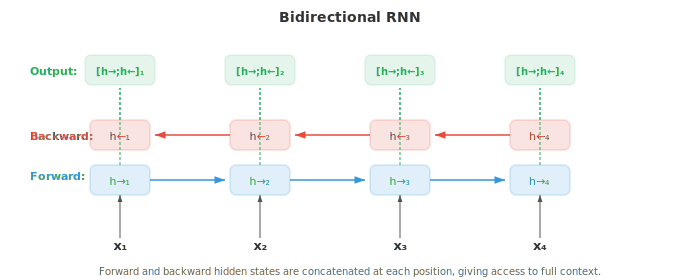
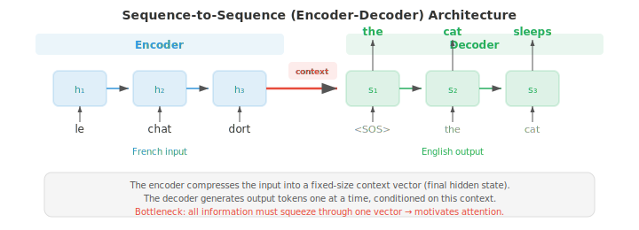
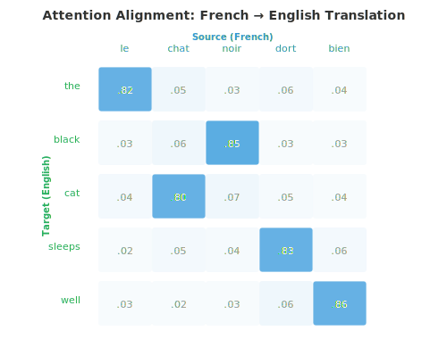
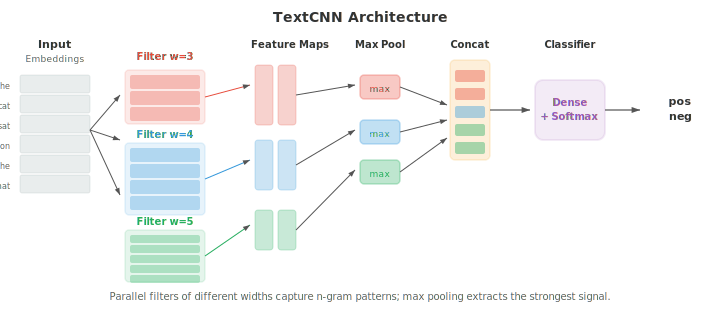

# Embedding 与序列模型

*词 embedding 把稀疏的、符号化的文本压缩到稠密向量空间，在其中语义相似性化为几何上的邻近。本文件涵盖 Word2Vec（CBOW、Skip-gram）、GloVe、FastText、RNN、LSTM、GRU、带 attention 的 seq2seq 以及 encoder-decoder 范式——从词袋模型到上下文表示的演进。*

- 在文件 01 中，我们介绍了分布式假设：出现在相似语境中的词往往意义相似。在文件 02 中，我们用稀疏的、手工设计的特征（如 TF-IDF 向量）表示文本。这些向量生活在非常高维的空间中（每个词表词一维）且大部分为零。**词 embedding（word embedding）**将这一信息压缩为稠密的低维向量，捕捉语义关系，并且直接从数据中学习。

- **Word2Vec**（Mikolov 等, 2013）通过在一个简单的预测任务上训练浅层神经网络来学习词 embedding。有两种架构。

- **连续词袋（Continuous Bag of Words, CBOW）**模型从周围的上下文词预测目标词。给定一个上下文词窗口（如 "the cat ___ on the"），模型对它们的 embedding 向量取平均，并通过一个线性层预测缺失的词（"sat"）。训练目标是最大化：

$$P(w_t \mid w_{t-k}, \ldots, w_{t-1}, w_{t+1}, \ldots, w_{t+k})$$

- **Skip-gram** 模型做相反的事：给定目标词，预测周围的上下文词。对于目标词 "sat"，模型分别尝试预测 "the"、"cat"、"on"、"the"。目标最大化：

$$P(w_{t+j} \mid w_t) \quad \text{for each } j \in [-k, k], \; j \neq 0$$


- Skip-gram 对罕见词效果更好，因为每个词生成多个训练样本（每个上下文位置一个）。CBOW 更快，对常见词略好，因为它对多个上下文信号取平均。

- 在完整词表上训练很昂贵，因为 softmax 分母对所有 $V$ 个词求和。**负采样（negative sampling）**通过将问题转化为二分类来近似：把真实上下文词（正样本）与随机采样的噪声词（负样本）区分开。模型不再计算完整 softmax，只为目标词、真实上下文词和少量负样本更新 embedding：

$$\mathcal{L} = \log \sigma(v_{w_O}^T v_{w_I}) + \sum_{i=1}^{k} \mathbb{E}_{w_i \sim P_n} [\log \sigma(-v_{w_i}^T v_{w_I})]$$

- 这里 $v_{w_I}$ 是输入词 embedding，$v_{w_O}$ 是输出（上下文）词 embedding，$P_n$ 是噪声分布，通常取一元频率的 3/4 次方（它降低像 "the" 这种极高频词的权重）。

- 为什么这个简单的目标能产生有意义的 embedding？Levy 和 Goldberg（2014）表明，带负采样的 skip-gram 隐式地分解一个**移位的逐点互信息（PMI）**矩阵。在收敛时，两个词向量的点积近似：

$$v_w^T v_c \approx \text{PMI}(w, c) - \log k$$

- 其中 $\text{PMI}(w, c) = \log \frac{P(w, c)}{P(w) P(c)}$ 衡量词 $w$ 和 $c$ 共现比偶然期望多多少（第 05 章信息论），$k$ 是负样本数。共现远超偶然的词 PMI 高，因此点积大（embedding 相似）。共现少于期望的词 PMI 为负，embedding 不相似。这揭示 Word2Vec 与经典的分布式语义方法（如对共现矩阵做 SVD 的潜在语义分析）在做同一件事，但更可扩展、在线进行。

- Word2Vec embedding 最令人惊讶的性质是它通过向量算术捕捉**类比（analogy）**。向量 $v_{\text{king}} - v_{\text{man}} + v_{\text{woman}}$ 最接近 $v_{\text{queen}}$。这之所以奏效，是因为 embedding 空间把语义关系编码为近似线性的方向："皇室" 方向大约是 $v_{\text{king}} - v_{\text{man}}$，把它加到 $v_{\text{woman}}$ 上就落在 $v_{\text{queen}}$ 附近。这联系到第 01 章的线性代数：语义关系是向量平移。

- **GloVe**（Global Vectors for Word Representation，Pennington 等, 2014）采取不同方法。它不是一次从局部上下文窗口学习，而是构建一个全局词共现矩阵 $X$，其中 $X_{ij}$ 统计词 $j$ 在整个语料中出现在词 $i$ 上下文中的次数。模型随后学习 embedding，使其点积近似对数共现：

$$w_i^T \tilde{w}_j + b_i + \tilde{b}_j = \log X_{ij}$$

- 损失函数用一个截断函数 $f(X_{ij})$ 对每对加权，防止极频繁的共现占主导：

$$\mathcal{L} = \sum_{i,j=1}^{V} f(X_{ij}) \left(w_i^T \tilde{w}_j + b_i + \tilde{b}_j - \log X_{ij}\right)^2$$

- GloVe 把全局矩阵分解（如潜在语义分析）的好处与 Word2Vec 的局部上下文学习结合起来。实践中，GloVe 和 Word2Vec 产生的 embedding 质量相当。

- **FastText**（Bojanowski 等, 2017）通过把每个词表示为字符 n-gram 的集合来扩展 skip-gram。词 "where" 在 $n = 3$ 时变为："<wh"、"whe"、"her"、"ere"、"re>"，加上整词 token "<where>"。词的 embedding 是其所有 n-gram embedding 之和。

- 这有一个关键优势：FastText 能为训练中从未见过的词产生 embedding。词 "whereabouts" 与 "where" 共享 n-gram，因此即使 "whereabouts" 从未出现在训练数据中，它的 embedding 也会合理。这对形态丰富的语言（文件 01）特别有用，因为这些语言的词有许多屈折形式。

- **embedding 评估**通常使用两类基准。**类比任务**测试 $v_a - v_b + v_c \approx v_d$（如 "Paris" $-$ "France" $+$ "Italy" $\approx$ "Rome"）。**相似性基准**把词对之间的余弦相似度（第 01 章）与人类判断比较。常见数据集包括 WordSim-353、SimLex-999 和 Google 类比测试集。一个实践中的告诫：在类比上表现出色的 embedding 未必最适合情感分类这类下游任务。最好的评估往往是任务本身。

- 在第 06 章中，我们介绍了 RNN、LSTM 和 GRU 作为处理序列数据的架构。这里我们关注它们如何具体应用于语言任务。

- **语言模型 RNN** 一次读入一个 token，并在每步预测下一个 token。隐藏状态 $h_t$ 把整个历史 $w_1, \ldots, w_t$ 压缩为一个固定大小的向量，线性层加 softmax 把 $h_t$ 映射到词表上的分布。训练用对真实下一个 token 的交叉熵损失，这等同于最小化困惑度（文件 02）。关键局限：固定大小的隐藏状态必须编码关于历史的一切，而早期 token 的信息会被逐渐覆盖。

- **双向 RNN** 在两个方向上处理序列：一个 RNN 从左到右读，另一个从右到左读。在每个位置 $t$，前向隐藏状态 $\overrightarrow{h}_t$ 和后向隐藏状态 $\overleftarrow{h}_t$ 拼接成上下文感知表示 $h_t = [\overrightarrow{h}_t ; \overleftarrow{h}_t]$。这让模型能同时访问过去和未来的上下文，对于词性标注和 NER（文件 02）等任务很强大，因为一个词的标签取决于它前后两侧的词。双向 RNN 不能用于语言建模，因为在预测未来 token 时不能偷看它们。



- **深度堆叠 RNN** 把多个 RNN 层叠在一起。第 $l$ 层在所有时间步的隐藏状态成为第 $l + 1$ 层的输入序列。堆叠 2-4 层通常能通过构建分层表示来提升性能，类似于更深的 CNN 构建特征层级（第 06 章）。超过 4 层时，梯度消失和过拟合会成为问题，除非在层间添加残差连接。

- **sequence-to-sequence（seq2seq）**架构（Sutskever 等, 2014）将变长输入序列映射到变长输出序列。它由一个 **encoder** RNN（读入输入并压缩为上下文向量，即最终隐藏状态）和一个 **decoder** RNN（在该上下文向量条件下一次生成一个 token 的输出）组成。



- Seq2seq 是机器翻译的突破性架构。encoder 读入法语句子，decoder 生成英语翻译。decoder 从一个特殊的序列起始 token 开始，自回归地生成 token，直到产生序列结束 token。一个实用技巧：反转输入序列（喂入 "chat le" 而非 "le chat"）能改善结果，因为它使第一个输入词在计算图中更接近第一个输出词，缩短了梯度路径。

- 瓶颈问题：整个输入必须被压缩到单个固定大小的向量。对长句子而言，这个向量无法承载所有信息，性能退化。这催生了 **attention 机制**。

- 第 06 章介绍了现代的 Q、K、V 形式的 attention。原始的 NLP attention 机制表述不同，是作为 encoder 与 decoder 状态之间的对齐模型。

- **Bahdanau attention**（加性 attention，Bahdanau 等, 2015）用一个学习的前馈网络计算 decoder 隐藏状态 $s_t$ 与每个 encoder 隐藏状态 $h_i$ 之间的对齐分数：

$$e_{ti} = v^T \tanh(W_s s_{t-1} + W_h h_i)$$

- 分数经 softmax 归一化为 attention 权重，上下文向量是 encoder 状态的加权和：

$$\alpha_{ti} = \frac{\exp(e_{ti})}{\sum_j \exp(e_{tj})}, \quad c_t = \sum_i \alpha_{ti} h_i$$

- decoder 随后同时使用 $s_{t-1}$ 和 $c_t$ 产生下一个输出。关键洞见：不再是整句一个固定上下文向量，每个 decoder 步骤得到 encoder 状态的不同加权组合，使模型能"回看"输入的相关部分。

- **Luong attention**（乘性 attention，Luong 等, 2015）简化了分数计算。**dot** 变体用 $e_{ti} = s_t^T h_i$。**general** 变体用 $e_{ti} = s_t^T W h_i$。它们比 Bahdanau 的加性分数快，因为用矩阵乘法而非前馈网络。Luong attention 还用当前 decoder 状态 $s_t$（而非 $s_{t-1}$）计算上下文向量，使其能访问更多信息，但计算略有不同。



- attention 权重常被可视化为热力图，显示 decoder 在产生每个输出 token 时关注哪些输入 token。在翻译中，这些热力图大致描绘源语言与目标语言之间的词对齐，对角线模式因重排而被打破（如形容词-名词顺序在法语和英语中不同）。

- 在推理时，decoder 必须在每步选择一个 token。**贪心解码（greedy decoding）**在每个位置选概率最高的 token，但这可能导致次优序列：一个局部好的选择可能迫使模型进入一个全局糟糕的句子。**束搜索（beam search）**在每步维护前 $k$（束宽）个部分序列，用所有可能的下一个 token 扩展每个，并总体保留最好的 $k$ 个。

- 当束宽 $k = 1$ 时，束搜索退化为贪心解码。典型值是 $k = 4$ 到 $k = 10$。更大的束找到更好的序列但成比例地更慢。束搜索还需要**长度归一化**以避免偏向更短序列，因为更短的序列因相乘项更少而天然有更高的总概率。归一化分数为：

$$\text{score}(y) = \frac{1}{|y|^\alpha} \sum_{t=1}^{|y|} \log P(y_t \mid y_{<t})$$

- 其中 $|y|$ 是序列长度，$\alpha$（通常 0.6-0.7）控制长度惩罚的强度。$\alpha = 0$ 时无长度归一化。$\alpha = 1$ 时分数是每 token 对数概率（几何均值）。中间值在偏向简洁输出与不过早截断之间取得平衡。

- RNN 顺序处理文本，而 **1D CNN** 通过在 token 序列上滑动滤波器并行处理。每个滤波器检测一个局部模式（一个 n-gram 特征）。

- **TextCNN**（Kim, 2014）把多个不同宽度（如 3、4、5 个 token）的 1D 卷积滤波器应用于输入 embedding 矩阵。每个滤波器产生一个 feature map，**max-over-time pooling** 从每个 feature map 中取唯一的最大值，捕捉无论位置如何该模式是否在文本中出现过。所有滤波器的池化特征被拼接并送入分类器。



- TextCNN 快速且对情感分析等文本分类任务惊人地有效。它捕捉局部 n-gram 模式但无法建模长距离依赖：宽度为 5 的滤波器只能看到 5 个连续 token。**膨胀因果卷积（dilated causal convolutions）**通过在滤波器元素之间插入间隔（膨胀）来解决。以指数增长的膨胀率（1、2、4、8……）堆叠层使感受野指数级增长而不增加参数，让模型能捕捉跨越数百 token 的依赖。

- 目前讨论的所有 embedding（Word2Vec、GloVe、FastText）无论上下文如何，每个词类型只产生一个向量。"Bank" 无论指金融机构还是河岸都得到同样的 embedding。这是 **上下文 embedding（contextual embedding）** 要解决的根本局限。

- **ELMo**（Embeddings from Language Models，Peters 等, 2018）通过在输入文本上运行深度双向 LSTM 语言模型产生上下文词表示。前向 LSTM 在每个位置预测下一个词；一个独立的后向 LSTM 预测前一个词。二者都作为语言模型在大语料上训练。

- 在每个位置 $k$，ELMo 用任务相关的学习权重组合所有 $L$ 层的隐藏状态：

$$\text{ELMo}_k = \gamma \sum_{j=0}^{L} s_j \, h_{k,j}$$

- 这里 $h_{k,j}$ 是位置 $k$、层 $j$ 的隐藏状态（层 0 是原始 token embedding），$s_j$ 是经 softmax 归一化的标量权重，$\gamma$ 是任务相关的缩放因子。不同层捕捉不同信息：较低层捕捉语法（词性标签、词形态），较高层捕捉语义（词义、语义角色）。通过用学习到的权重混合所有层，ELMo embedding 能适应多样的下游任务。

- ELMo 标志着 **pre-train then fine-tuning** 范式的开端：在大规模无标注文本上训练大型语言模型，然后将其表示用于下游任务。ELMo 具体地把预训练表示作为固定或轻度调谐的特征，与任务相关输入拼接。BERT 和 GPT（文件 04）进一步推动这一范式，对整个模型端到端 fine-tuning，效果显著更好。

- 从 Word2Vec 到 ELMo 的演进揭示了 NLP 中反复出现的主题：从静态到动态表示，从局部到全局上下文，从浅层到深层模型。每一步以计算成本换取更丰富的表示。Transformer（文件 04）用 attention 完全取代循环，完成这一演进，同时实现深度上下文化和并行计算。

## 编码任务（使用 CoLab 或 notebook）

1. 从头实现带负采样的 Word2Vec skip-gram。在小语料上训练并用 PCA 可视化学到的 embedding。
```python
import jax
import jax.numpy as jnp
import matplotlib.pyplot as plt

# Small corpus
corpus = """the king ruled the kingdom . the queen ruled the kingdom .
the prince is the son of the king . the princess is the daughter of the queen .
a man worked in the castle . a woman worked in the castle .
the king and queen lived in the castle . the prince and princess played outside .""".lower().split()

vocab = sorted(set(corpus))
word2idx = {w: i for i, w in enumerate(vocab)}
idx2word = {i: w for w, i in word2idx.items()}
V = len(vocab)

# Generate skip-gram pairs with window size 2
window = 2
pairs = []
for i, word in enumerate(corpus):
    for j in range(max(0, i - window), min(len(corpus), i + window + 1)):
        if i != j:
            pairs.append((word2idx[word], word2idx[corpus[j]]))

pairs = jnp.array(pairs)
print(f"Vocabulary: {V} words, Training pairs: {len(pairs)}")

# Model parameters
embed_dim = 16
key = jax.random.PRNGKey(42)
k1, k2 = jax.random.split(key)
W_in = jax.random.normal(k1, (V, embed_dim)) * 0.1    # input embeddings
W_out = jax.random.normal(k2, (V, embed_dim)) * 0.1   # output embeddings

# Negative sampling loss for one pair
def neg_sampling_loss(W_in, W_out, target, context, neg_ids):
    v_in = W_in[target]      # (embed_dim,)
    v_out = W_out[context]   # (embed_dim,)
    v_neg = W_out[neg_ids]   # (k, embed_dim)

    pos_loss = -jax.nn.log_sigmoid(jnp.dot(v_in, v_out))
    neg_loss = -jnp.sum(jax.nn.log_sigmoid(-v_neg @ v_in))
    return pos_loss + neg_loss

# Training loop
num_neg = 5
lr = 0.05

@jax.jit
def train_step(W_in, W_out, target, context, neg_ids):
    loss, (g_in, g_out) = jax.value_and_grad(neg_sampling_loss, argnums=(0, 1))(
        W_in, W_out, target, context, neg_ids)
    return loss, W_in - lr * g_in, W_out - lr * g_out

key = jax.random.PRNGKey(0)
for epoch in range(50):
    total_loss = 0.0
    for i in range(len(pairs)):
        key, subkey = jax.random.split(key)
        neg_ids = jax.random.randint(subkey, (num_neg,), 0, V)
        loss, W_in, W_out = train_step(W_in, W_out, pairs[i, 0], pairs[i, 1], neg_ids)
        total_loss += loss
    if (epoch + 1) % 10 == 0:
        print(f"Epoch {epoch+1}: avg loss = {total_loss / len(pairs):.4f}")

# Visualise with PCA (chapter 01)
embeddings = W_in
mean = embeddings.mean(axis=0)
centered = embeddings - mean
U, S, Vt = jnp.linalg.svd(centered, full_matrices=False)
coords = centered @ Vt[:2].T  # project onto top 2 PCs

plt.figure(figsize=(10, 8))
for i, word in idx2word.items():
    plt.scatter(coords[i, 0], coords[i, 1], c='#3498db', s=40)
    plt.annotate(word, (coords[i, 0] + 0.02, coords[i, 1] + 0.02), fontsize=9)
plt.title("Word2Vec Skip-gram Embeddings (PCA projection)")
plt.grid(alpha=0.3); plt.show()
```

2. 构建一个字符级 RNN 语言模型，从一个小训练串学习生成文本。
```python
import jax
import jax.numpy as jnp

# Tiny training text
text = "to be or not to be that is the question "
chars = sorted(set(text))
char2idx = {c: i for i, c in enumerate(chars)}
idx2char = {i: c for c, i in char2idx.items()}
V = len(chars)
data = jnp.array([char2idx[c] for c in text])

# RNN parameters
hidden_dim = 64
key = jax.random.PRNGKey(0)
k1, k2, k3, k4, k5 = jax.random.split(key, 5)

params = {
    'Wx': jax.random.normal(k1, (V, hidden_dim)) * 0.1,
    'Wh': jax.random.normal(k2, (hidden_dim, hidden_dim)) * 0.05,
    'bh': jnp.zeros(hidden_dim),
    'Wy': jax.random.normal(k3, (hidden_dim, V)) * 0.1,
    'by': jnp.zeros(V),
}

def rnn_step(params, h, x_idx):
    x = jnp.eye(V)[x_idx]  # one-hot
    h = jnp.tanh(x @ params['Wx'] + h @ params['Wh'] + params['bh'])
    logits = h @ params['Wy'] + params['by']
    return h, logits

def loss_fn(params, inputs, targets):
    h = jnp.zeros(hidden_dim)
    total_loss = 0.0
    for t in range(len(inputs)):
        h, logits = rnn_step(params, h, inputs[t])
        log_probs = jax.nn.log_softmax(logits)
        total_loss -= log_probs[targets[t]]
    return total_loss / len(inputs)

grad_fn = jax.jit(jax.grad(loss_fn))

# Training
inputs = data[:-1]
targets = data[1:]
lr = 0.01

for step in range(500):
    grads = grad_fn(params, inputs, targets)
    params = {k: params[k] - lr * grads[k] for k in params}
    if (step + 1) % 100 == 0:
        l = loss_fn(params, inputs, targets)
        print(f"Step {step+1}: loss = {l:.4f}")

# Generate text
def generate(params, seed_char, length=60):
    h = jnp.zeros(hidden_dim)
    idx = char2idx[seed_char]
    result = [seed_char]
    key = jax.random.PRNGKey(42)
    for _ in range(length):
        h, logits = rnn_step(params, h, idx)
        key, subkey = jax.random.split(key)
        idx = jax.random.categorical(subkey, logits)
        result.append(idx2char[int(idx)])
    return ''.join(result)

print(f"\nGenerated: {generate(params, 't')}")
```

3. 实现一个带 Bahdanau attention 的玩具 seq2seq 模型用于序列反转。可视化 attention 对齐矩阵。
```python
import jax
import jax.numpy as jnp
import matplotlib.pyplot as plt

# Task: reverse a sequence of digits (e.g., [3, 1, 4] -> [4, 1, 3])
vocab_size = 10  # digits 0-9
SOS, EOS = 10, 11  # special tokens
total_vocab = 12
embed_dim, hidden_dim = 16, 32
max_len = 5

key = jax.random.PRNGKey(42)
keys = jax.random.split(key, 8)

params = {
    'embed': jax.random.normal(keys[0], (total_vocab, embed_dim)) * 0.1,
    'enc_Wx': jax.random.normal(keys[1], (embed_dim, hidden_dim)) * 0.1,
    'enc_Wh': jax.random.normal(keys[2], (hidden_dim, hidden_dim)) * 0.05,
    'dec_Wx': jax.random.normal(keys[3], (embed_dim, hidden_dim)) * 0.1,
    'dec_Wh': jax.random.normal(keys[4], (hidden_dim, hidden_dim)) * 0.05,
    # Bahdanau attention
    'Ws': jax.random.normal(keys[5], (hidden_dim, hidden_dim)) * 0.1,
    'Wh_att': jax.random.normal(keys[6], (hidden_dim, hidden_dim)) * 0.1,
    'v_att': jax.random.normal(keys[7], (hidden_dim,)) * 0.1,
    # Output projection (from hidden + context to vocab)
    'Wo': jax.random.normal(keys[0], (hidden_dim * 2, total_vocab)) * 0.1,
}

def encode(params, seq):
    """Encode input sequence, return all hidden states."""
    h = jnp.zeros(hidden_dim)
    states = []
    for t in range(len(seq)):
        x = params['embed'][seq[t]]
        h = jnp.tanh(x @ params['enc_Wx'] + h @ params['enc_Wh'])
        states.append(h)
    return jnp.stack(states), h

def bahdanau_attention(params, dec_state, enc_states):
    """Compute Bahdanau attention weights and context vector."""
    scores = jnp.tanh(enc_states @ params['Wh_att'] + dec_state @ params['Ws'])
    e = scores @ params['v_att']  # (src_len,)
    alpha = jax.nn.softmax(e)
    context = alpha @ enc_states
    return context, alpha

def decode_step(params, dec_h, prev_token, enc_states):
    x = params['embed'][prev_token]
    dec_h = jnp.tanh(x @ params['dec_Wx'] + dec_h @ params['dec_Wh'])
    context, alpha = bahdanau_attention(params, dec_h, enc_states)
    combined = jnp.concatenate([dec_h, context])
    logits = combined @ params['Wo']
    return dec_h, logits, alpha

def seq2seq_loss(params, src, tgt):
    enc_states, enc_final = encode(params, src)
    dec_h = enc_final
    loss = 0.0
    prev_token = SOS
    for t in range(len(tgt)):
        dec_h, logits, _ = decode_step(params, dec_h, prev_token, enc_states)
        log_probs = jax.nn.log_softmax(logits)
        loss -= log_probs[tgt[t]]
        prev_token = tgt[t]
    return loss / len(tgt)

# Generate training data: reverse sequences
key = jax.random.PRNGKey(0)
train_srcs, train_tgts = [], []
for _ in range(200):
    key, subkey = jax.random.split(key)
    length = jax.random.randint(subkey, (), 3, max_len + 1)
    key, subkey = jax.random.split(key)
    seq = jax.random.randint(subkey, (int(length),), 0, vocab_size)
    train_srcs.append(seq)
    train_tgts.append(seq[::-1])  # reverse

# Training
grad_fn = jax.grad(seq2seq_loss)
lr = 0.01

for epoch in range(100):
    total_loss = 0.0
    for src, tgt in zip(train_srcs, train_tgts):
        grads = grad_fn(params, src, tgt)
        params = {k: params[k] - lr * grads[k] for k in params}
        total_loss += seq2seq_loss(params, src, tgt)
    if (epoch + 1) % 20 == 0:
        print(f"Epoch {epoch+1}: avg loss = {total_loss / len(train_srcs):.4f}")

# Visualise attention for one example
test_src = jnp.array([3, 1, 4, 1, 5])
test_tgt = test_src[::-1]

enc_states, enc_final = encode(params, test_src)
dec_h = enc_final
attentions = []
prev_token = SOS
for t in range(len(test_tgt)):
    dec_h, logits, alpha = decode_step(params, dec_h, prev_token, enc_states)
    attentions.append(alpha)
    prev_token = test_tgt[t]

att_matrix = jnp.stack(attentions)
fig, ax = plt.subplots(figsize=(6, 5))
im = ax.imshow(att_matrix, cmap='Blues')
ax.set_xlabel("Source position"); ax.set_ylabel("Target position")
src_labels = [str(int(x)) for x in test_src]
tgt_labels = [str(int(x)) for x in test_tgt]
ax.set_xticks(range(len(src_labels))); ax.set_xticklabels(src_labels)
ax.set_yticks(range(len(tgt_labels))); ax.set_yticklabels(tgt_labels)
for i in range(len(tgt_labels)):
    for j in range(len(src_labels)):
        ax.text(j, i, f"{att_matrix[i,j]:.2f}", ha='center', va='center', fontsize=9)
ax.set_title("Bahdanau Attention Alignment (sequence reversal)")
plt.colorbar(im); plt.tight_layout(); plt.show()
```
