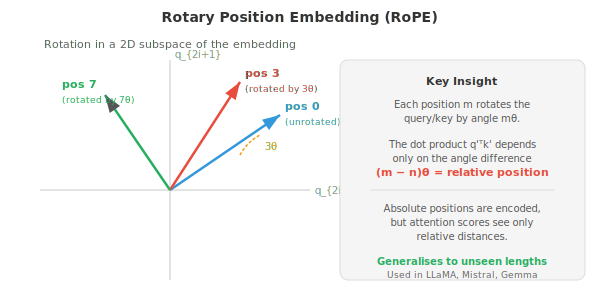
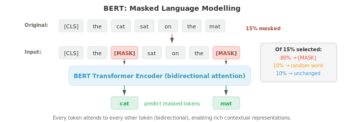
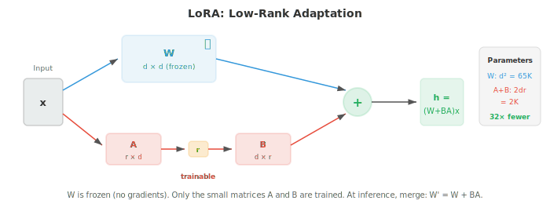
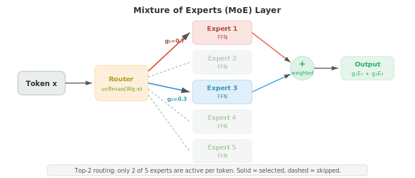

# Трансформеры и языковые модели

*Трансформеры заменили рекурсию механизмом самовнимания и стали доминирующей архитектурой для понимания и генерации языка. В этом файле рассматриваются BERT, GPT, T5, позиционное кодирование (синусоидальное, RoPE), задачи предобучения (MLM, CLM), дообучение (fine-tuning), промпт-инжиниринг и законы масштабирования — фундамент современных LLM.*

- В главе 06 мы представили архитектуру трансформера: самовнимание, многоголовое внимание, позиционное кодирование и структуру энкодер-декодер. Здесь мы сосредоточимся на том, как трансформеры адаптируются для конкретных парадигм NLP, на моделях, определивших современное NLP (BERT, GPT, T5), и на методах, которые делают их практичными при масштабировании.

- Вспомним основную операцию: **масштабированное скалярное произведение внимания** (scaled dot-product attention) вычисляет $\text{softmax}(QK^T / \sqrt{d_k}) V$, где запросы (queries), ключи (keys) и значения (values) являются линейными проекциями входных данных. **Многоголовое внимание** (multi-head attention) запускает $h$ параллельных голов внимания, каждая из которых имеет свои обученные проекции, и конкатенирует результаты. Блок трансформера дополняет это остаточными связями (residual connections), нормализацией слоев и позиционно-зависимой полносвязной сетью (глава 06).

- Тонким, но важным архитектурным решением является расположение **нормализации слоя** (layer normalisation). В оригинальном трансформере используется **post-norm**: остаточная связь и нормализация идут после подслоя, как $\text{LayerNorm}(x + \text{Sublayer}(x))$.

- В большинстве современных моделей используется **pre-norm**: нормализация перед подслоем, как $x + \text{Sublayer}(\text{LayerNorm}(x))$. Pre-norm более стабильна во время обучения, так как остаточная связь пропускает градиенты напрямую через путь тождественного преобразования, не затрагивая их нормализацией. Это упрощает обучение очень глубоких моделей без тщательного прогрева скорости обучения (learning rate warmup).

- **Полносвязный подслой** (feed-forward sublayer) в каждом блоке трансформера представляет собой двухслойный MLP, применяемый независимо к каждой позиции токена:

$$\text{FFN}(x) = W_2 \cdot \text{GELU}(W_1 x + b_1) + b_2$$

- Внутренняя размерность обычно в 4 раза превышает размерность модели (например, $d_{\text{model}} = 768$, $d_{\text{ff}} = 3072$). На этот FFN приходится около двух третей параметров в каждом блоке, и считается, что он функционирует как память «ключ-значение», хранящая фактические знания, полученные в процессе обучения.

- **Позиционное кодирование** дает модели информацию о порядке токенов, поскольку само внимание является эквивариантным к перестановкам. Оригинальное **синусоидальное кодирование** (глава 06) использует фиксированные функции синуса и косинуса на разных частотах. **Обучаемые позиционные эмбеддинги** просто добавляют обучаемый вектор для каждой позиции (используются в BERT и GPT-2). Оба являются абсолютными кодировками: позиция 5 получает один и тот же вектор независимо от контекста.

- **Ротационное позиционное эмбеддирование (RoPE)** кодирует позицию путем поворота векторов запросов и ключей в 2D-подпространствах. Для пары размерностей $(q_{2i}, q_{2i+1})$ поворот на угол $m\theta_i$ (где $m$ — позиция, а $\theta_i = 10000^{-2i/d}$) применяется следующим образом:

```math
\begin{bmatrix} q'_{2i} \\ q'_{2i+1} \end{bmatrix} = \begin{bmatrix} \cos m\theta_i & -\sin m\theta_i \\ \sin m\theta_i & \cos m\theta_i \end{bmatrix} \begin{bmatrix} q_{2i} \\ q_{2i+1} \end{bmatrix}
```



- Прелесть RoPE заключается в том, что скалярное произведение $q'^T k'$ между повернутыми запросами и ключами зависит только от относительной позиции $m - n$, а не от абсолютных позиций.

- Чтобы понять почему, запишем поворот как $q' = R_m q$ и $k' = R_n k$, где $R_m$ — блочно-диагональная матрица поворота. Оценка внимания принимает вид:

$$q'^T k' = (R_m q)^T (R_n k) = q^T R_m^T R_n \, k = q^T R_{n-m} \, k$$

- Последний шаг следует из свойства группы поворотов: $R_m^T R_n = R_{n-m}$ (поворот назад на $m$, а затем вперед на $n$ эквивалентен повороту на $n - m$).

- Это означает, что оценка внимания зависит только от относительного расстояния $n - m$, а не от абсолютных позиций $m$ и $n$ по отдельности.

- Модель получает естественное представление о расстоянии без каких-либо обученных позиционных параметров и может обобщаться на последовательности длины, не встречавшиеся во время обучения.

- **ALiBi** (Attention with Linear Biases) использует еще более простой подход: он добавляет фиксированный линейный штраф к оценкам внимания в зависимости от расстояния, как $\text{score}_{ij} = q_i^T k_j - m \cdot |i - j|$, где $m$ — наклон, специфичный для каждой головы. Разные головы используют разные наклоны, позволяя одним головам фокусироваться локально, а другим — глобально. ALiBi не требует обучаемых параметров для позиции и хорошо обобщается на последовательности, которые длиннее тех, что были в обучающей выборке.

- Три доминирующие парадигмы для языковых моделей на основе трансформеров — это **только энкодер** (encoder-only), **только декодер** (decoder-only) и **энкодер-декодер** (encoder-decoder). Они различаются тем, что модель может видеть (маска внимания) и как они обучаются.


- **BERT** (Bidirectional Encoder Representations from Transformers, Devlin et al., 2019) — это каноническая модель «только энкодер». Она обрабатывает текст с полным двунаправленным вниманием: каждый токен может обращаться к любому другому токену, как слева, так и справа. Это дает BERT богатые контекстные представления, но означает, что он не может генерировать текст авторегрессионно.

- BERT предобучается с помощью двух задач. **Маскированное языковое моделирование (MLM)** случайным образом маскирует 15% входных токенов и обучает модель предсказывать их. Из выбранных токенов 80% заменяются на токен [MASK], 10% — на случайное слово, и 10% остаются без изменений (чтобы модель не научилась предсказывать только тогда, когда видит [MASK]). Целевая функция обучения:

$$\mathcal{L}_{\text{MLM}} = -\sum_{i \in \mathcal{M}} \log P(w_i \mid w_{\backslash \mathcal{M}})$$

- где $\mathcal{M}$ — множество маскированных позиций, а $w_{\backslash \mathcal{M}}$ — предложение с маскированными позициями. Это задача **шумоподавления** (denoising): модель учится восстанавливать поврежденные входные данные.



- **Next Sentence Prediction (NSP)** обучает BERT предсказывать, являются ли два предложения последовательными в исходном тексте. Для этой задачи бинарной классификации используется специальный токен [CLS] в начале входной последовательности. NSP была включена для помощи в таких задачах, как ответы на вопросы, требующие понимания связей между предложениями, хотя более поздние работы (RoBERTa) показали, что она дает незначительный вклад и может быть исключена.

- Предобученные представления BERT адаптируются к прикладным задачам путем добавления «головы» (простого линейного слоя) поверх модели и дообучения (fine-tuning) всей модели целиком. Для задач классификации используется представление токена [CLS]. Для задач на уровне токенов (NER, POS-тегирование) используется представление каждого токена. Этот подход **дообучения** переносит лингвистические знания, полученные в ходе предобучения, на новые задачи при относительно небольшом объеме размеченных данных.

- **GPT** (Generative Pre-trained Transformer, Radford et al., 2018) — это каноническая модель, состоящая только из декодера. Она использует **каузальное (авторегрессионное) внимание**: каждый токен может обращать внимание только на токены в предыдущих позициях (и на самого себя). Это достигается путем маскирования будущих позиций в матрице внимания (установкой их оценок в $-\infty$ перед применением softmax). Цель обучения — простая **каузальная языковая модель**: предсказать следующий токен на основе всех предыдущих.

$$\mathcal{L}_{\text{CLM}} = -\sum_{i=1}^{n} \log P(w_i \mid w_1, \ldots, w_{i-1})$$

- Это та же цель обучения n-граммной языковой модели из файла 02, но с параметризацией трансформера, которая может учитывать весь предшествующий контекст, а не только последние $k-1$ токенов.

- **GPT-2** масштабировала этот подход до 1,5 миллиардов параметров и продемонстрировала высокую эффективность в режиме zero-shot: без какого-либо дообучения модель могла выполнять задачи, опираясь на промпт на естественном языке («Переведи с английского на французский: ...»).

- **GPT-3** (175 миллиардов параметров) показала, что один лишь масштаб может обеспечить **обучение в контексте (in-context learning)**: предоставляя несколько примеров «вход-выход» в промпте, модель могла выполнять новые задачи без обновления градиентов.

- **Энкодер-декодер модели**, такие как **T5** (Text-to-Text Transfer Transformer, Raffel et al., 2020), представляют любую задачу NLP как задачу «текст-в-текст»: входные данные — это текстовая строка (возможно, с префиксом задачи, например «переведи с английского на немецкий:»), а выходные данные — тоже текстовая строка. Энкодер обрабатывает входные данные с помощью двунаправленного внимания, а декодер генерирует выходные данные авторегрессионно с использованием перекрестного внимания (cross-attention) к энкодеру.

- T5 предобучается с помощью **заполнения пропусков (span corruption)**: случайные непрерывные фрагменты токенов заменяются на специальные токены-заполнители, и модель должна восстановить исходные токены. Например, «The cat sat on the mat» может превратиться во входную последовательность «The [X] on [Y]», а целевым результатом будет «[X] cat sat [Y] the mat». Это обобщение MLM от BERT на фрагменты вместо отдельных токенов.

- **BART** (Lewis et al., 2020) — еще одна энкодер-декодер модель, предобученная с помощью задачи шумоподавления, но она применяет более широкий набор стратегий искажения: маскирование токенов, удаление токенов, маскирование фрагментов, перестановку предложений и ротацию документа. Разнообразие искажений заставляет модель изучать более устойчивые представления.

- По мере роста языковых моделей **полное дообучение (full fine-tuning)** (обновление всех параметров) становится непрактичным: для модели со 175 млрд параметров требуются сотни гигабайт только для хранения состояний оптимизатора. Методы **параметрически эффективного дообучения (PEFT)** адаптируют лишь малую часть параметров.

- **Адаптеры (Adapters)** вставляют небольшие «узкие» слои (обычно два линейных слоя с нелинейностью: проекция в меньшую размерность и обратная проекция) между существующими слоями трансформера. Обучаются только веса адаптеров; веса исходной модели заморожены. Это добавляет менее 5% новых параметров, при этом сохраняя производительность полного дообучения в большинстве задач.

- **LoRA** (Low-Rank Adaptation) модифицирует сами весовые матрицы без добавления новых слоев. Вместо обновления полной матрицы весов $W$, LoRA изучает разложение обновления низкого ранга: $W' = W + BA$, где $B$ имеет размерность $d \times r$, а $A$ — $r \times d$, при этом $r \ll d$ (обычно $r = 4$ до $r = 64$). Исходная матрица $W$ заморожена; обучаются только $A$ и $B$. Во время инференса обновление может быть объединено с исходными весами без дополнительных задержек:

$$W' = W + BA$$



- **Префиксное дообучение (Prefix tuning)** добавляет последовательность обучаемых «виртуальных токенов» к матрицам ключей и значений каждого слоя внимания. Модель обращает внимание на эти векторы префикса так, как если бы они были реальными токенами, и обучаются только параметры префикса. Это похоже на prompt tuning, но работает в пространстве активаций, а не в пространстве эмбеддингов.

- **Промпт-инжиниринг (Prompt engineering)** — это искусство проектирования входного текста, который вызывает желаемое поведение предобученной модели без обновления параметров.

    - **Zero-shot промптинг** описывает задачу на естественном языке («Классифицируй тональность следующего отзыва:»).

    - **Few-shot промптинг** предоставляет примеры «вход-выход» перед основным запросом.

    - **Chain-of-thought (CoT)** промптинг добавляет фразу «Давай подумаем пошагово» или включает цепочки рассуждений в примеры, что значительно улучшает результаты в задачах на арифметические и логические рассуждения, направляя модель к декомпозиции проблем.

- **Обучение в контексте (In-context learning, ICL)** — это феномен, при котором большие языковые модели могут учиться выполнять задачи на основе примеров, предоставленных в промпте, без обновления градиентов. Веса модели не меняются; она использует примеры как своего рода неявную спецификацию.

- Механизм работы ICL остается предметом активных исследований; одна из гипотез заключается в том, что слои внимания реализуют форму градиентного спуска в процессе прямого прохода, эффективно «обучаясь» на примерах из контекста.

- **Законы масштабирования (scaling laws)** описывают предсказуемые взаимосвязи между размером модели, объемом данных, вычислительным бюджетом и производительностью (измеряемой через функцию потерь). Каплан и др. (2020) обнаружили, что функция потерь подчиняется степенному закону для каждой переменной:

$$L(N) \propto N^{-\alpha_N}, \quad L(D) \propto D^{-\alpha_D}, \quad L(C) \propto C^{-\alpha_C}$$

- где $N$ — количество параметров, $D$ — размер датасета, а $C$ — вычислительный бюджет. Эти степенные законы сохраняются на многих порядках величин и предполагают, что простое увеличение масштаба приводит к предсказуемым улучшениям.


- **Законы масштабирования Chinchilla** (Hoffmann et al., 2022) пересмотрели этот подход, показав, что большинство крупных моделей недообучены. При фиксированном вычислительном бюджете $C$ оптимальное распределение ресурсов масштабирует размер модели и объем обучающих данных в равной степени:

$$N_{\text{opt}} \propto C^{0.5}, \quad D_{\text{opt}} \propto C^{0.5}$$

- Это означает, что при удвоении вычислительного бюджета следует увеличить как размер модели, так и размер датасета в $\sqrt{2}$ раз, а не просто увеличивать модель.

- Каплан и др. рекомендовали масштабировать $N$ быстрее, чем $D$, что приводило к созданию очень больших, но недообученных моделей. Модель Chinchilla (70 млрд параметров, 1,4 трлн токенов) достигла производительности Gopher (280 млрд параметров, 300 млрд токенов) при том же вычислительном бюджете, что доказывает: предыдущие модели испытывали острую нехватку данных.

- Практическое правило: обучайте модель примерно на 20 токенах на каждый параметр.

- **Смесь экспертов (Mixture of Experts, MoE)** — это архитектура, которая масштабирует емкость модели без пропорционального увеличения вычислений. Вместо одного большого полносвязного слоя (FFN) MoE использует несколько слоев **экспертов** (FFN-слоев) и **сеть управления** (маршрутизатор), которая выбирает, каких экспертов активировать для каждого токена.

- Функция управления вычисляет оценку маршрутизации для каждого эксперта и выбирает топ-$k$ (обычно $k = 1$ или $k = 2$):

$$G(x) = \text{TopK}(\text{softmax}(W_g x))$$

- Только выбранные эксперты обрабатывают токен, поэтому вычислительные затраты масштабируются с учетом $k$ (количества активных экспертов), а не общего количества экспертов $E$. Модель с 8 экспертами и маршрутизацией топ-2 имеет в 4 раза больше параметров, чем плотная (dense) модель, но требует лишь в 2 раза больше вычислений.



- Критической проблемой в MoE является **балансировка нагрузки**: если маршрутизатор отправляет большинство токенов нескольким популярным экспертам, остальные простаивают. При обучении добавляется вспомогательная **функция потерь для балансировки нагрузки**, которая поощряет равномерное использование экспертов:

$$\mathcal{L}_{\text{balance}} = E \cdot \sum_{i=1}^{E} f_i \cdot p_i$$

- где $f_i$ — доля токенов, назначенных эксперту $i$, а $p_i$ — средняя вероятность маршрутизации для эксперта $i$. Это произведение минимизируется, когда и доли токенов, и вероятности распределены равномерно (каждая равна $1/E$).

- **Параллелизм экспертов** распределяет различных экспертов по разным ускорителям. Во время прямого прохода этап коммуникации «все-ко-всем» (all-to-all) направляет токены на устройство, где находится назначенный им эксперт, а затем возвращает результаты обратно. Эти затраты на коммуникацию являются главной инженерной проблемой MoE при масштабировании. Такие модели, как Switch Transformer, Mixtral и GShard, используют MoE для достижения высокой производительности при практичных затратах на инференс.

- Создание моделей — это только половина дела; измерение того, работают ли они, — вторая половина. Оценка в задачах обработки естественного языка (NLP) уникально сложна, поскольку язык неоднозначен, субъективен и открыт для интерпретаций.

- Перевод может быть правильным во многих отношениях. Резюме может быть хорошим, даже если оно не содержит ни одного слова из эталонного текста.

- Ответ чат-бота может быть полезным, безвредным и честным, однако разумные люди могут с ним не согласиться.

- **Точное совпадение (Exact match, EM)** — простейшая метрика: совпадает ли выход модели в точности с эталонным ответом? Она используется для задач с короткими, однозначными ответами, такими как экстрактивное вопросно-ответное взаимодействие (SQuAD) или математические задачи с закрытой формой ответа.

- Метрика EM строга: "New York City" и "new york city" не совпадут, если не применить нормализацию, но её простота делает её однозначной.

- **Токеновые метрики** рассматривают NLP как задачу классификации на уровне токенов, используя точность (precision), полноту (recall) и F1-меру из главы 06.

- **Точность (Precision)** измеряет, какая доля предсказанных моделью токенов верна: $P = \text{TP} / (\text{TP} + \text{FP})$. Модель, которая предсказывает очень мало сущностей, но угадывает их все, имеет высокую точность.

- **Полнота (Recall)** измеряет, какую долю эталонных токенов нашла модель: $R = \text{TP} / (\text{TP} + \text{FN})$. Модель, которая предсказывает каждый токен как сущность, имеет идеальную полноту, но ужасную точность.

- **F1-мера** — это гармоническое среднее точности и полноты:

$$F_1 = \frac{2PR}{P + R}$$

- Гармоническое среднее (в отличие от арифметического) штрафует за дисбаланс: если $P$ или $R$ низки, $F_1$ будет низким. Для задачи распознавания именованных сущностей (NER, файл 02) F1 вычисляется для каждого типа сущности, а затем усредняется по всем типам (macro-average). Для тегирования частей речи (POS tagging) чаще используется точность на уровне токенов, так как каждый токен получает тег.

- **F1-мера на уровне сегментов (Span-level F1)** (используется в SQuAD) сравнивает набор токенов в предсказанном сегменте с набором в эталонном сегменте. Это более снисходительный подход, чем точное совпадение: если эталонный ответ — "the Eiffel Tower", а модель предсказывает "Eiffel Tower", F1-мера сегмента будет высокой (4 перекрывающихся токена из 5), даже если EM равен нулю.

- **BLEU** (Bilingual Evaluation Understudy, Papineni et al., 2002) — классическая метрика для машинного перевода. Она измеряет n-граммное перекрытие между кандидатным переводом и одним или несколькими эталонными переводами. Оценка объединяет точность на нескольких уровнях n-грамм (от униграмм до 4-грамм) со штрафом за краткость:

$$\text{BLEU} = \text{BP} \cdot \exp\!\left(\sum_{n=1}^{N} w_n \log p_n\right)$$

- где $p_n$ — **модифицированная n-граммная точность**: количество каждой n-граммы в кандидате ограничивается (клиппируется) её максимальным количеством в любом из эталонов, что предотвращает получение высокой оценки вырожденными кандидатами вроде "the the the the". Веса $w_n$ обычно равномерны ($w_n = 1/N$, при $N = 4$).

- **Штраф за краткость** $\text{BP} = \min(1, \exp(1 - r/c))$ наказывает кандидатов, которые короче эталона ($c$ — длина кандидата, $r$ — длина эталона). Без этого штрафа модель могла бы достичь высокой точности, выдавая очень малое количество «безопасных» слов.

- BLEU неплохо коррелирует с оценками людей на уровне корпуса (в среднем по множеству предложений), но плохо — на уровне отдельных предложений.

- Эта метрика поощряет точные совпадения n-грамм и упускает из виду допустимые перефразирования: «the cat is on the mat» и «a feline sits atop the rug» имеют нулевое пересечение биграмм, несмотря на идентичный смысл.

- BLEU также полностью игнорирует полноту (recall) — кандидат, генерирующий только самые частотные слова, получает высокий балл по точности (precision).

- **ROUGE** (Recall-Oriented Understudy for Gisting Evaluation, Lin, 2004) — стандартная метрика для суммаризации. В отличие от BLEU, которая делает упор на точность, ROUGE делает упор на полноту: какая доля n-грамм эталона присутствует в кандидате?

- **ROUGE-N** вычисляет полноту n-грамм: $\text{ROUGE-N} = \frac{|\text{n-grams}_{\text{ref}} \cap \text{n-grams}_{\text{cand}}|}{|\text{n-grams}_{\text{ref}}|}$. Чаще всего используются ROUGE-1 (униграммы) и ROUGE-2 (биграммы).

- ROUGE-L использует **наибольшую общую подпоследовательность (LCS)** между кандидатом и эталоном, что позволяет учитывать порядок слов в предложении без требования последовательных совпадений.

- Длина LCS, нормализованная на длину эталона, дает полноту, нормализованная на длину кандидата — точность, а F-мера объединяет их.

- LCS вычисляется с помощью динамического программирования за время $O(mn)$ (аналогично редакционному расстоянию из файла 02):

$$R_{\text{LCS}} = \frac{\text{LCS}(X, Y)}{m}, \quad P_{\text{LCS}} = \frac{\text{LCS}(X, Y)}{n}, \quad F_{\text{LCS}} = \frac{(1 + \beta^2) R_{\text{LCS}} P_{\text{LCS}}}{R_{\text{LCS}} + \beta^2 P_{\text{LCS}}}$$

- где $m$ и $n$ — длины эталона и кандидата, а $\beta$ обычно выбирается так, чтобы отдавать предпочтение полноте ($\beta \to \infty$ дает чистую полноту).

- **METEOR** (Metric for Evaluation of Translation with Explicit ORdering, Banerjee and Lavie, 2005) устраняет недостатки BLEU, включая использование синонимов, стемминг и порядок слов.

- Сначала выполняется выравнивание слов между кандидатом и эталоном с использованием точных совпадений, совпадений основ (через стеммер Портера из файла 02) и совпадений синонимов (через WordNet из файла 01).

- Затем вычисляется гармоническое среднее точности и полноты униграмм с весами в пользу полноты, а также применяется штраф за фрагментацию, который наказывает кандидатов, где совпадающие слова появляются в ином порядке, чем в эталоне.

- **ChrF** (Character n-gram F-score) вычисляет F-меру по символьным n-граммам, а не по n-граммам слов. Это делает метрику устойчивой к морфологическим изменениям (критически важно для агглютинативных языков из файла 01) и частично решает проблемы, связанные с токенизацией. ChrF++ добавляет к символьным n-граммам биграммы слов.

- Эта метрика стала рекомендованной для машинного перевода наряду с BLEU, особенно для морфологически богатых языков.

- **Перплексия** (файл 02) измеряет, насколько хорошо языковая модель предсказывает отложенную тестовую выборку. Это стандартная внутренняя метрика для языковых моделей: $\text{PPL} = \exp(-\frac{1}{N} \sum_{i} \log P(w_i \mid w_{<i}))$. Чем ниже значение, тем лучше.

- Перплексию можно сравнивать только между моделями, использующими одинаковую токенизацию, поскольку разные токенизаторы создают последовательности разной длины $N$ для одного и того же текста.

- Модель с большим словарем обычно имеет более низкую перплексию на токен, но обрабатывает меньше токенов на предложение.

- **Бит на байт** (BPB) нормализует результат по количеству UTF-8 байтов в тексте, а не по количеству токенов, что делает метрику независимой от токенизации:

```math
\text{BPB} = \frac{-\sum_{i} \log_2 P(w_i \mid w_{<i})}{\text{number of UTF-8 bytes}}
```

- **BERTScore** (Zhang et al., 2020) выходит за рамки поверхностного сопоставления n-грамм, вычисляя сходство в пространстве эмбеддингов. Каждый токен кандидата сопоставляется с наиболее похожим токеном эталона с использованием косинусного сходства контекстуальных эмбеддингов (обычно из предобученной модели BERT). Оценки агрегируются в точность, полноту и F1:

$$R_{\text{BERT}} = \frac{1}{|r|} \sum_{r_i \in r} \max_{c_j \in c} \cos(r_i, c_j), \quad P_{\text{BERT}} = \frac{1}{|c|} \sum_{c_j \in c} \max_{r_i \in r} \cos(c_j, r_i)$$

- где $r_i$ и $c_j$ — контекстуальные эмбеддинги токенов эталона и кандидата. Это позволяет уловить семантическое сходство, которое упускают метрики на основе n-грамм: «automobile» и «car» получают высокий балл, так как их BERT-эмбеддинги близки, даже если у них нет общих символов.

- **BLEURT** (Sellam et al., 2020) идет дальше, дообучая модель BERT непосредственно на экспертных оценках качества. На вход подается пара «эталон — кандидат», а на выходе получается скалярная оценка качества. BLEURT обучается на синтетических данных (случайные возмущения эталонных переводов, оцененные метриками вроде BLEU и METEOR), а затем дообучается на оценках людей. Она коррелирует с человеческими суждениями лучше, чем любая поверхностная метрика.

- **COMET** (Crosslingual Optimized Metric for Evaluation of Translation, Rei et al., 2020) — обучаемая метрика для машинного перевода, которая учитывает исходное предложение, эталон и кандидата, а не только эталон и кандидата. Она использует мультиязычный энкодер (XLM-R) для получения эмбеддингов всех трех компонентов и предсказывает оценку качества. Видя исходный текст, COMET может обнаружить смысловые ошибки, которые пропускают метрики, использующие только эталон (например, беглый, но фактически неверный перевод).

- **LLM-as-judge** — современный подход к оценке в больших масштабах. Вместо вычисления метрик по отношению к эталонам, мощной языковой модели (GPT-4, Claude) дается промпт оценить качество ответов модели. Судья получает входные данные, ответ модели и, опционально, эталонный ответ, после чего выставляет рейтинг (например, от 1 до 5) или делает парное сравнение (ответ А лучше ответа Б).

- **Парное сравнение** (используется в Chatbot Arena) — наиболее надежный формат LLM-as-judge. Судья видит два ответа и выбирает лучший, вместо того чтобы присваивать абсолютные баллы. Это позволяет избежать проблем калибровки (у разных судей могут быть разные критерии для оценки «3 из 5»). Результаты агрегируются в **рейтинги Эло** (из шахмат), где каждая модель начинает с базового рейтинга и получает или теряет очки в зависимости от побед и поражений в матчах с другими моделями. Ожидаемая вероятность победы модели $A$ над моделью $B$ составляет:

$$P(A \succ B) = \frac{1}{1 + 10^{(R_B - R_A) / 400}}$$

- где $R_A, R_B$ — рейтинги Эло. После каждого сравнения рейтинги обновляются: $R_A' = R_A + K(S - P(A \succ B))$, где $S \in \{0, 1\}$ — фактический результат, а $K$ определяет величину обновления. Модели, которые стабильно побеждают сильных противников, быстро растут в рейтинге; модели, проигрывающие слабым противникам, падают.

- **Позиционное смещение (position bias)** — известная проблема LLM-судей: они склонны отдавать предпочтение ответу, представленному первым (или, в некоторых моделях, вторым). **Перестановка (swapping)** (оценка каждой пары дважды с ответами в разном порядке) и усреднение результатов позволяют смягчить этот эффект.

- **Смещение по объему (verbosity bias)** — еще одна проблема: судьи склонны предпочитать более длинные и подробные ответы, даже если краткий ответ лучше.

- **Самосогласованность (self-consistency)** проверяет, дает ли судья одинаковую оценку при многократном оценивании одного и того же входного сигнала. Высокая дисперсия указывает на то, что сигнал оценки зашумлен.

- **Согласованность между аннотаторами (inter-annotator agreement)** (каппа Коэна или альфа Криппендорфа) измеряет, согласны ли между собой несколько судей, что дает верхнюю границу надежности оценки.

- **Загрязнение (contamination)** — критическая проблема: если данные для оценки присутствовали в обучающей выборке модели, результаты бенчмарков оказываются завышенными и бессмысленными.

- Это особенно актуально для LLM, обученных на данных, собранных из интернета, где популярные бенчмарки, скорее всего, присутствуют. Стратегии смягчения включают: использование отложенных тестовых выборок, которые не публикуются в открытом доступе, создание динамических бенчмарков, периодически генерирующих новые вопросы, **канареечные строки (canary strings)** (уникальные идентификаторы, внедренные в данные бенчмарка для обнаружения утечек), а также сравнение производительности на загрязненных и чистых подмножествах.

- **Стандартные бенчмарки NLU** оценивают понимание языка в различных задачах.

- **GLUE** (General Language Understanding Evaluation) и **SuperGLUE** — это многозадачные бенчмарки, охватывающие анализ тональности (SST-2), текстовое сходство (STS-B), логический вывод на естественном языке (MNLI, RTE), кореференцию (WSC) и ответы на вопросы (BoolQ).

- Модели оцениваются по каждой задаче отдельно, а итоговый балл вычисляется с помощью агрегированной метрики. GLUE в настоящее время считается «насыщенным» (модели превосходят человеческий уровень в большинстве задач); SuperGLUE остается более сложным.

- **MMLU** (Massive Multitask Language Understanding) оценивает знания и навыки рассуждения по 57 академическим дисциплинам (математика, история, право, медицина, компьютерные науки и т. д.) с использованием вопросов с множественным выбором.

- Он проверяет, усвоила ли модель обширные знания в процессе предварительного обучения. Баллы приводятся по каждой дисциплине и в виде макросреднего значения.

- **MMLU-Pro** добавляет более сложные вопросы на многошаговое рассуждение с 10 вариантами ответа вместо 4.

- **HellaSwag** проверяет здравый смысл, предлагая модели выбрать наиболее правдоподобное продолжение сценария. Неправильные ответы генерируются состязательно (с использованием других моделей), чтобы выглядеть правдоподобно, но быть семантически неверными.

- **WinoGrande** проверяет разрешение кореференции на основе здравого смысла с помощью минимальных пар, различающихся одним словом.

- **ARC** (AI2 Reasoning Challenge) использует школьные научные вопросы в простых и сложных наборах, проверяя фактические знания и способность к рассуждению.

- **Бенчмарки на рассуждение и математику** оценивают способности к решению задач, которые отличают сильные LLM от слабых.

- **GSM8K** (Grade School Math 8K) содержит 8500 элементарных математических текстовых задач, требующих многошагового арифметического рассуждения. Это стандартный бенчмарк для базового математического рассуждения и оценки промптинга с цепочкой рассуждений (chain-of-thought) (файл 04).

- **MATH** — это более сложный датасет математических задач олимпиадного уровня по алгебре, теории чисел, геометрии, комбинаторике и теории вероятностей. Задачи требуют многошагового символьного рассуждения, а MATH-500 — это часто используемое подмножество из 500 задач.

- Задачи **AIME** (American Invitational Mathematics Examination) соответствуют уровню математических олимпиад: для их правильного решения требуется глубокое математическое рассуждение в много шагов. DeepSeek-R1 набирает 79,8% на AIME 2024, демонстрируя, что модели, обученные рассуждению с помощью обучения с подкреплением (файл 05), могут приближаться к уровню сильных участников-людей.

- **HumanEval** и **MBPP** (Mostly Basic Programming Problems) оценивают генерацию кода, проверяя, проходит ли код модели модульные тесты. HumanEval содержит 164 задачи на Python с сигнатурами функций и строками документации; модель должна сгенерировать тело функции.

- Метрика называется **pass@k**: вероятность того, что хотя бы одно из $k$ сгенерированных решений пройдет все тесты. Для одной выборки:

$$\text{pass@}k = 1 - \frac{\binom{n-c}{k}}{\binom{n}{k}}$$

- где $n$ — общее количество сгенерированных образцов, а $c$ — количество прошедших тесты. Эта формула корректирует смещение, возникающее при простом выборе лучшего из $k$ образцов.

- **SWE-bench** идет дальше, оценивая, могут ли модели решать реальные проблемы GitHub путем модификации существующих кодовых баз — это гораздо более сложный тест на практические навыки программной инженерии.

- **GPQA** (Graduate-Level Google-Proof QA) содержит вопросы экспертного уровня по биологии, физике и химии, которые сложны даже для профильных специалистов. Он проверяет, обладает ли модель подлинным пониманием, а не просто сопоставлением паттернов. Подмножество «Diamond» является самым сложным.

- **Бенчмарки безопасности и согласования (alignment)** оценивают, являются ли модели полезными, безвредными и честными.

- **TruthfulQA** проверяет, воспроизводят ли модели распространенные заблуждения. Вопросы составлены так, что самые популярные ответы из интернета являются неверными (например, «Что будет, если проглотить жвачку?»: распространенный миф гласит, что она остается в организме на 7 лет, но правдивый ответ — она выходит естественным путем). Модели, которые запомнили популярные, но неверные утверждения, получают низкие баллы.

- **BBQ** (Bias Benchmark for QA) проверяет наличие социальных смещений по таким категориям, как возраст, пол, раса и религия. Вопросы структурированы так, что предвзятая модель будет систематически выбирать стереотипные ответы. **Toxigen** оценивает склонность модели генерировать токсичный контент в отношении определенных демографических групп.

- **MT-Bench** оценивает способность к многоходовому диалогу, используя 80 тщательно разработанных вопросов по письму, ролевым играм, рассуждению, математике, программированию, извлечению информации, STEM и гуманитарным наукам. Судья-LLM (GPT-4) оценивает ответы по шкале от 1 до 10. Многоходовый формат проверяет, могут ли модели поддерживать диалог, сохранять контекст и обрабатывать уточняющие запросы.

- **Chatbot Arena** (LMSYS) использует реальных пользователей для проведения слепого попарного сравнения анонимных моделей. Пользователи отправляют промпты и голосуют за лучший ответ, не зная, какая модель его сгенерировала. Полученная таблица лидеров Elo считается наиболее экологически валидной оценкой качества LLM общего назначения, поскольку она отражает реальные предпочтения пользователей на разнообразных, нефильтрованных промптах.

- **AlpacaEval** автоматизирует попарную оценку, сравнивая выходы модели с эталонной моделью (GPT-4) на фиксированном наборе инструкций. Модель-судья определяет процент побед.

- **AlpacaEval 2.0** использует процент побед с контролем длины для коррекции смещения в сторону многословности.

- **Оценка специфических задач** требует специализированных метрик для узких предметных областей.

- **Коэффициент ошибок в словах (WER)** для распознавания речи: $\text{WER} = (S + D + I) / N$, где $S$, $D$, $I$ — ошибки замены, удаления и вставки, а $N$ — количество слов в эталоне. Это расстояние редактирования (файл 02), нормализованное по длине эталона и примененное на уровне слов.

- **Slot F1** для диалоговых систем, ориентированных на выполнение задач, измеряет, корректно ли модель извлекает структурированную информацию из высказываний пользователя (например, извлечение "destination: Paris" и "date: tomorrow" из фразы "Book me a flight to Paris tomorrow").

- **Точность цитирования** для RAG-систем (файл 05) проверяет, действительно ли сгенерированные моделью цитаты подтверждают сделанные утверждения. Утверждение проверяется по найденному фрагменту, а метрика подсчитывает долю утверждений, которые полностью, частично или вовсе не подтверждаются.

- **Ловушки при оценке** встречаются часто и могут обесценить результаты сравнения по всему бенчмарку.

- **Натаскивание на тест (Teaching to the test)**: оптимизация под показатели бенчмарка в ущерб реальным способностям. Модель, дообученная на тестах с множественным выбором в стиле MMLU, покажет высокий результат на MMLU, но может не справиться с теми же вопросами в формате открытого ответа.

- **Манипуляция метриками (Metric gaming)**: модели можно оптимизировать для получения выходов, которые показывают хорошие результаты по автоматическим метрикам (высокий BLEU, низкая перплексия), не являясь при этом по-настоящему качественными. Перевод, оптимальный по BLEU, часто представляет собой безопасный, обобщенный парафраз, а не естественный и связный текст.

- **Насыщение бенчмарков**: когда модели приближаются к уровню человека или превосходят его на каком-либо бенчмарке, он перестает быть информативным. GLUE, SQuAD 1.1 и ряд других уже насыщены.

- В этой области постоянно создаются более сложные бенчмарки, но цикл создания, насыщения и замены затрудняет лонгитюдное сравнение.

- **Оценка человеком** остается «золотым стандартом», но она дорога, медленна и ее трудно воспроизвести. Разные группы аннотаторов (краудворкеры против экспертов в предметной области, разные культуры, разные языки) выносят разные суждения. Для воспроизводимости необходимо указывать степень согласия между аннотаторами и их демографические характеристики.

## Задачи по программированию (используйте CoLab или ноутбук)

1. Реализуйте полный блок энкодера Transformer с нуля (многоголовое внимание, полносвязный слой, остаточные связи, нормализация слоя). Примените его к простой задаче классификации последовательностей.
```python
import jax
import jax.numpy as jnp
import matplotlib.pyplot as plt

def layer_norm(x, gamma, beta, eps=1e-5):
    mean = x.mean(axis=-1, keepdims=True)
    var = x.var(axis=-1, keepdims=True)
    return gamma * (x - mean) / jnp.sqrt(var + eps) + beta

def multi_head_attention(Q, K, V, W_q, W_k, W_v, W_o, n_heads):
    B, T, D = Q.shape
    head_dim = D // n_heads

    q = Q @ W_q  # (B, T, D)
    k = K @ W_k
    v = V @ W_v

    # Reshape to (B, n_heads, T, head_dim)
    q = q.reshape(B, T, n_heads, head_dim).transpose(0, 2, 1, 3)
    k = k.reshape(B, T, n_heads, head_dim).transpose(0, 2, 1, 3)
    v = v.reshape(B, T, n_heads, head_dim).transpose(0, 2, 1, 3)

    scores = q @ k.transpose(0, 1, 3, 2) / jnp.sqrt(head_dim)
    weights = jax.nn.softmax(scores, axis=-1)
    out = (weights @ v).transpose(0, 2, 1, 3).reshape(B, T, D)
    return out @ W_o, weights

def transformer_block(x, params):
    # Pre-norm multi-head self-attention
    normed = layer_norm(x, params['ln1_g'], params['ln1_b'])
    attn_out, weights = multi_head_attention(
        normed, normed, normed,
        params['W_q'], params['W_k'], params['W_v'], params['W_o'],
        n_heads=4
    )
    x = x + attn_out

    # Pre-norm feed-forward
    normed = layer_norm(x, params['ln2_g'], params['ln2_b'])
    ff = jax.nn.gelu(normed @ params['W1'] + params['b1'])
    ff = ff @ params['W2'] + params['b2']
    x = x + ff
    return x, weights

# Initialise parameters
d_model, d_ff, n_heads = 32, 128, 4
key = jax.random.PRNGKey(42)
keys = jax.random.split(key, 10)

params = {
    'W_q': jax.random.normal(keys[0], (d_model, d_model)) * 0.05,
    'W_k': jax.random.normal(keys[1], (d_model, d_model)) * 0.05,
    'W_v': jax.random.normal(keys[2], (d_model, d_model)) * 0.05,
    'W_o': jax.random.normal(keys[3], (d_model, d_model)) * 0.05,
    'ln1_g': jnp.ones(d_model), 'ln1_b': jnp.zeros(d_model),
    'ln2_g': jnp.ones(d_model), 'ln2_b': jnp.zeros(d_model),
    'W1': jax.random.normal(keys[4], (d_model, d_ff)) * 0.05,
    'b1': jnp.zeros(d_ff),
    'W2': jax.random.normal(keys[5], (d_ff, d_model)) * 0.05,
    'b2': jnp.zeros(d_model),
}

# Test with random input
x = jax.random.normal(keys[6], (2, 8, d_model))  # batch=2, seq_len=8
out, attn_weights = transformer_block(x, params)
print(f"Input shape:  {x.shape}")
print(f"Output shape: {out.shape}")
print(f"Attention weights shape: {attn_weights.shape}")  # (B, n_heads, T, T)

# Visualise attention patterns for each head
fig, axes = plt.subplots(1, 4, figsize=(16, 3.5))
for h in range(4):
    im = axes[h].imshow(attn_weights[0, h], cmap='Blues', vmin=0)
    axes[h].set_title(f"Head {h}")
    axes[h].set_xlabel("Key pos"); axes[h].set_ylabel("Query pos")
plt.suptitle("Multi-Head Attention Patterns")
plt.tight_layout(); plt.show()
```

2. Реализуйте причинное (авторегрессионное) маскирование внимания и сравните его с двунаправленным вниманием. Покажите, как маска предотвращает передачу информации от будущих токенов к прошлым.
```python
import jax
import jax.numpy as jnp
import matplotlib.pyplot as plt

def attention(Q, K, V, mask=None):
    d_k = Q.shape[-1]
    scores = Q @ K.T / jnp.sqrt(d_k)
    if mask is not None:
        scores = jnp.where(mask, scores, -1e9)
    weights = jax.nn.softmax(scores, axis=-1)
    return weights @ V, weights

seq_len, d_model = 6, 8
key = jax.random.PRNGKey(0)
k1, k2, k3 = jax.random.split(key, 3)
Q = jax.random.normal(k1, (seq_len, d_model))
K = jax.random.normal(k2, (seq_len, d_model))
V = jax.random.normal(k3, (seq_len, d_model))

# Bidirectional (encoder-style): all positions visible
bidir_mask = jnp.ones((seq_len, seq_len), dtype=bool)
bidir_out, bidir_weights = attention(Q, K, V, bidir_mask)

# Causal (decoder-style): only past and current positions visible
causal_mask = jnp.tril(jnp.ones((seq_len, seq_len), dtype=bool))
causal_out, causal_weights = attention(Q, K, V, causal_mask)

fig, axes = plt.subplots(1, 3, figsize=(14, 4))
tokens = [f"t{i}" for i in range(seq_len)]

axes[0].imshow(bidir_weights, cmap='Blues', vmin=0, vmax=0.5)
axes[0].set_title("Bidirectional Attention\n(BERT-style)")
axes[0].set_xticks(range(seq_len)); axes[0].set_xticklabels(tokens)
axes[0].set_yticks(range(seq_len)); axes[0].set_yticklabels(tokens)

axes[1].imshow(causal_mask.astype(float), cmap='Greys', vmin=0, vmax=1)
axes[1].set_title("Causal Mask\n(1 = allowed, 0 = blocked)")
axes[1].set_xticks(range(seq_len)); axes[1].set_xticklabels(tokens)
axes[1].set_yticks(range(seq_len)); axes[1].set_yticklabels(tokens)

axes[2].imshow(causal_weights, cmap='Blues', vmin=0, vmax=0.5)
axes[2].set_title("Causal Attention\n(GPT-style)")
axes[2].set_xticks(range(seq_len)); axes[2].set_xticklabels(tokens)
axes[2].set_yticks(range(seq_len)); axes[2].set_yticklabels(tokens)

for ax in axes:
    ax.set_xlabel("Key"); ax.set_ylabel("Query")
plt.tight_layout(); plt.show()

# Verify: in causal attention, output at position i depends only on positions <= i
print("Causal attention weight at position 2 (should only attend to 0, 1, 2):")
print(f"  Weights: {causal_weights[2]}")
print(f"  Sum of future weights (should be ~0): {causal_weights[2, 3:].sum():.6f}")
```

3. Реализуйте LoRA (Low-Rank Adaptation) и покажите, как этот метод модифицирует матрицу весов, используя значительно меньше обучаемых параметров, чем при полном дообучении.

```python
import jax
import jax.numpy as jnp

d_model = 256
rank = 4  # LoRA rank (much smaller than d_model)

key = jax.random.PRNGKey(42)
k1, k2, k3 = jax.random.split(key, 3)

# Original frozen weight matrix
W_frozen = jax.random.normal(k1, (d_model, d_model)) * 0.02

# LoRA matrices (only these are trainable)
B = jnp.zeros((d_model, rank))       # initialised to zero
A = jax.random.normal(k2, (rank, d_model)) * 0.01  # random init

# Forward pass: W_effective = W_frozen + B @ A
x = jax.random.normal(k3, (8, d_model))

# Without LoRA
y_original = x @ W_frozen.T

# With LoRA
W_effective = W_frozen + B @ A
y_lora = x @ W_effective.T

# Parameter counts
full_params = d_model * d_model
lora_params = d_model * rank + rank * d_model  # B + A

print(f"Model dimension: {d_model}")
print(f"LoRA rank: {rank}")
print(f"Full fine-tuning parameters: {full_params:,}")
print(f"LoRA parameters: {lora_params:,}")
print(f"Parameter reduction: {full_params / lora_params:.1f}x")
print(f"\nSince B is initialised to zeros, initial LoRA output matches original:")
print(f"  Max difference: {jnp.abs(y_original - y_lora).max():.2e}")

# Simulate training: only update A and B
def lora_forward(A, B, W_frozen, x):
    return x @ (W_frozen + B @ A).T

def dummy_loss(A, B, W_frozen, x, target):
    pred = lora_forward(A, B, W_frozen, x)
    return jnp.mean((pred - target) ** 2)

# Target: some transformation of x
target = x @ jax.random.normal(jax.random.PRNGKey(99), (d_model, d_model)).T * 0.02

grad_fn = jax.jit(jax.grad(dummy_loss, argnums=(0, 1)))
lr = 0.01

for step in range(200):
    gA, gB = grad_fn(A, B, W_frozen, x, target)
    A = A - lr * gA
    B = B - lr * gB

loss_before = dummy_loss(jnp.zeros_like(A), jnp.zeros_like(B), W_frozen, x, target)
loss_after = dummy_loss(A, B, W_frozen, x, target)
print(f"\nLoss before LoRA: {loss_before:.6f}")
print(f"Loss after LoRA:  {loss_after:.6f}")
print(f"Effective weight change rank: {jnp.linalg.matrix_rank(B @ A)}")
```