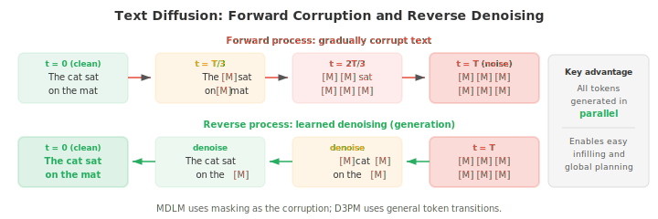
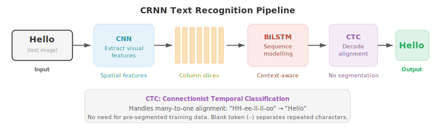
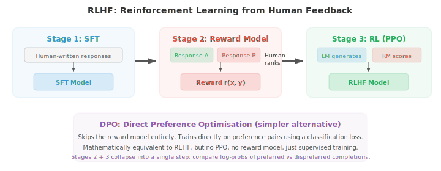
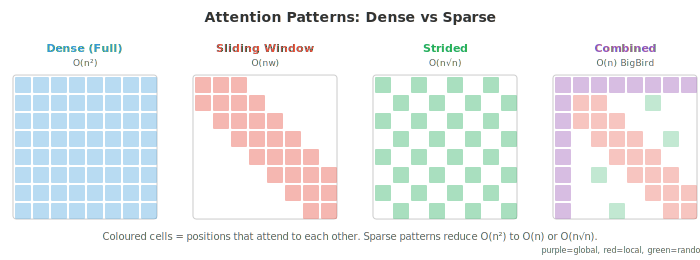
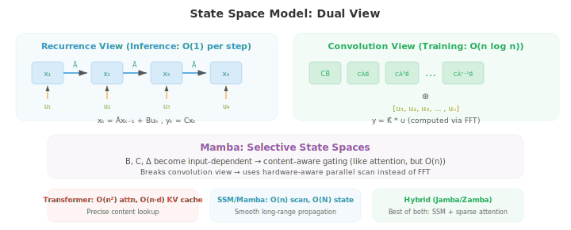
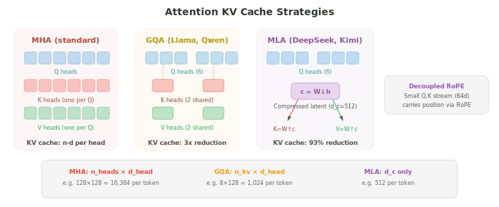

# 高级文本生成

*高级文本生成超越朴素的自回归解码，旨在改善质量、可控性和速度。本文件涵盖文本扩散模型（D3PM、MDLM）、OCR、用于对齐的 RLHF 和 DPO、长上下文方法（RoPE 缩放、ring attention）、检索增强生成以及用于加速推理的投机解码。*

- 标准自回归生成（文件 04）从左到右一次一个 token 地产生文本。这简单有效，但本质上是顺序的，不允许全局规划，对输出的控制有限。本文件涵盖超越朴素自回归解码的方法：文本扩散模型、光学字符识别、通过人类反馈的可控生成、处理长上下文、检索增强生成以及用于加速推理的投机解码。

- **文本扩散模型（text diffusion models）**把扩散框架（第 08 章为图像引入）应用到离散文本。核心挑战是文本是离散的：你不能像给像素加噪那样给 token 加连续高斯噪声。多种方法解决此问题。

- **D3PM**（Discrete Denoising Diffusion Probabilistic Models，Austin 等, 2021）用转移矩阵直接在离散 token 上定义前向破坏过程。在每个前向步骤，一个 token 有一定概率被替换为另一个 token（均匀噪声）、被掩蔽（吸收态）或保持不变。反向过程学习去噪，从被破坏的 token 预测干净 token。步骤 $t$ 的转移矩阵 $Q_t$ 控制破坏：

$$q(x_t \mid x_{t-1}) = \text{Cat}(x_t ; \, x_{t-1} Q_t)$$

- 其中 $\text{Cat}$ 表示类别分布，$x$ 是 one-hot 向量。多步前向过程 $q(x_t \mid x_0)$ 有闭式：$q(x_t \mid x_0) = \text{Cat}(x_t ; \, x_0 \bar{Q}_t)$，其中 $\bar{Q}_t = Q_1 Q_2 \cdots Q_t$ 是截至步骤 $t$ 所有转移矩阵的乘积。训练最小化一个跨时间步分解的变分下界（ELBO），类似于连续情形（第 08 章）：

$$\mathcal{L}_{\text{D3PM}} = D_{\text{KL}}(q(x_T \mid x_0) \| p(x_T)) + \sum_{t=2}^{T} D_{\text{KL}}(q(x_{t-1} \mid x_t, x_0) \| p_\theta(x_{t-1} \mid x_t)) - \log p_\theta(x_0 \mid x_1)$$

- 第一项确保完全破坏的分布匹配先验（均匀或全掩蔽）。KL 项之和训练模型反转每个破坏步骤：真实的反向后验 $q(x_{t-1} \mid x_t, x_0)$ 可用贝叶斯规则和已知转移矩阵闭式计算，模型 $p_\theta(x_{t-1} \mid x_t)$ 被训练以匹配它。

- 由于两个分布都是类别分布，KL 散度就是词表项上的简单求和。最后一项衡量从最少破坏状态的重构质量。

- **MDLM**（Masked Diffusion Language Models，Sahoo 等, 2024）通过把掩蔽作为唯一破坏操作来简化 D3PM：前向过程逐步用 `<think>` token 替换 token，反向过程预测原始 token。这把文本扩散与掩码语言建模（BERT，文件 04）联系起来，扩散时间步控制被掩蔽 token 的比例。$t = 0$ 时文本完全干净；$t = T$ 时完全掩蔽。

- **连续文本扩散**通过在连续 embedding 空间中工作来绕开离散问题。token 先被映射到它们的 embedding 向量（第 06 章），在此连续空间中加噪，去噪模型（通常是 Transformer）学习反转过程。生成时，模型产生连续向量，再通过找最近 embedding 映射回离散 token。挑战在于连续空间中的小误差可能映射到完全错误的 token，因此需要仔细的取整和截断。



- 文本扩散的吸引力在于它通过迭代精修同时生成所有 token，而非从左到右。这允许全局连贯和便捷的填充（在段落中间生成缺失文本），但当前文本扩散模型在长文本的生成质量上仍落后于自回归模型。

- **文本 OCR**（Optical Character Recognition，光学字符识别）是从图像中提取文本的任务。虽然传统上不归入语言生成，现代 OCR 系统与 NLP 深度集成，并越来越多地使用语言模型组件。

- **场景文本检测（scene text detection）**在自然图像（街牌、产品标签、车牌）中定位文本区域。这很有挑战性，因为野外文本以任意角度、尺度、字体出现，且背景杂乱。检测方法通常用 CNN 或 Transformer 主干在文本区域周围产生边界框或分割掩码。

- **CRNN**（Convolutional Recurrent Neural Network，Shi 等, 2017）是经典的文本识别架构。一个 CNN 从文本图像中提取视觉特征，feature map 被切成一列列的序列（每个水平位置一列），一个双向 LSTM 读取此序列以建模上下文。输出用 **CTC**（Connectionist Temporal Classification）解码，它处理输入列与输出字符之间的对齐，无需显式分割。

- CTC 解决的根本问题：模型产生 $T$ 个输出分布（每个输入列一个），但目标文本有 $L \leq T$ 个字符。

- 我们不知道哪些列对应哪些字符。CTC 引入一个**空白 token** $\epsilon$，并定义一个多对一映射 $\mathcal{B}$，折叠重复字符并移除空白：$\mathcal{B}(\text{"HH-ee-ll-ll-oo"}) = \text{"Hello"}$（其中 "-" 是空白）。

- 目标序列 $y$ 的概率是所有折叠为 $y$ 的输入对齐之和：

$$P(y \mid x) = \sum_{\pi \in \mathcal{B}^{-1}(y)} \prod_{t=1}^{T} P(\pi_t \mid x)$$

- 其中 $\pi$ 是长度为 $T$ 的对齐路径（每列一个标签，含空白）。朴素求和所有路径是指数级的，但**前向算法**（第 05 章 HMM）用动态规划在 $O(T \cdot L)$ 时间内高效计算此和。

- 空白 token 至关重要：没有它，"Hello" 中像 "ll" 这样的重复字符就与单个 "l" 无法区分。训练最大化 $\log P(y \mid x)$，推理时通过束搜索或贪心解码在 CTC 输出上找最佳路径。

- **文档 OCR** 处理结构化文档（发票、表单、科学论文），除识别字符外还必须理解布局。LayoutLM 等现代系统把文本识别与空间位置特征结合：每个 token 既得到文本 embedding 又得到编码它在页面上 $(x, y)$ 坐标的位置 embedding。这让模型能理解出现在 "Total:" 下方的数字是总金额。



- **视觉-语言 OCR** 模型如 TrOCR 把文本识别视为图像到文本生成：一个 Vision Transformer encoder 处理图像，一个语言模型 decoder 逐字符生成文本。这利用了预训练视觉和语言模型的能力，无需手工特征工程即可处理多样的文字、字体和布局。

- **可控生成（controllable generation）**是引导语言模型产生具有期望属性的输出这一挑战：特定风格、主题、情感、安全级别或事实准确性。模型应遵循指令同时保持流畅连贯。

- **无分类器引导（Classifier-Free Guidance, CFG）**用于文本时借鉴图像生成中的技术。训练时，条件信号（如 prompt）以一定比例随机丢弃，同时训练一个条件模型和一个无条件模型。推理时，输出 logits 被插值：

$$\text{logits}_{\text{guided}} = (1 + w) \cdot \text{logits}_{\text{conditional}} - w \cdot \text{logits}_{\text{unconditional}}$$

- 其中 $w > 0$ 放大条件的影响。$w$ 越高，输出越强地遵循 prompt，但多样性下降。

- **RLHF**（Reinforcement Learning from Human Feedback，Ouyang 等, 2022）是使语言模型与人类偏好对齐的主导方法。该过程有三阶段：

- 第一，**监督微调（supervised fine-tuning, SFT）**：在高质量人类对 prompt 的作答数据集上对基础语言模型 fine-tune。

- 第二，**奖励模型训练（reward model training）**：收集人类比较（给定 prompt $x$ 和两个响应 $y_1, y_2$，哪个更好？）并训练一个奖励模型 $r_\phi(x, y)$ 预测人类偏好。奖励模型用两两排序损失训练：

$$\mathcal{L}_{\text{RM}} = -\log \sigma(r_\phi(x, y_w) - r_\phi(x, y_l))$$

- 其中 $y_w$ 是偏好响应，$y_l$ 是不偏好响应。

- 第三，**RL 微调（RL fine-tuning）**：优化语言模型以最大化奖励，同时靠近 SFT 模型（以防模式崩塌）。这使用 PPO（Proximal Policy Optimisation，第 06 章）并带一个 KL 惩罚：

$$\mathcal{L}_{\text{RL}} = -\mathbb{E}\left[r_\phi(x, y) - \beta \, D_{\text{KL}}(\pi_\theta \| \pi_{\text{SFT}})\right]$$

- KL 项防止模型偏离基础模型太远并利用奖励模型的怪癖（"reward hacking"）。



- **DPO**（Direct Preference Optimisation，Rafailov 等, 2023）通过完全消除奖励模型来简化 RLHF。关键的数学洞见是上述带 KL 约束的 RL 目标有闭式最优策略：

$$\pi^\ast(y \mid x) = \frac{1}{Z(x)} \pi_{\text{ref}}(y \mid x) \exp\!\left(\frac{r(x, y)}{\beta}\right)$$

- 其中 $Z(x)$ 是归一化配分函数。反解奖励得到 $r(x, y) = \beta \log \frac{\pi^\ast(y \mid x)}{\pi_{\text{ref}}(y \mid x)} + \beta \log Z(x)$。把这个隐式奖励代入 Bradley-Terry 偏好模型 $P(y_w \succ y_l) = \sigma(r(x, y_w) - r(x, y_l))$，可使不可处理的 $Z(x)$ 项相消，直接得到 DPO 损失：

$$\mathcal{L}_{\text{DPO}} = -\log \sigma\!\left(\beta \log \frac{\pi_\theta(y_w \mid x)}{\pi_{\text{ref}}(y_w \mid x)} - \beta \log \frac{\pi_\theta(y_l \mid x)}{\pi_{\text{ref}}(y_l \mid x)}\right)$$

- 这在数学上等价于 RLHF，但把奖励模型和 RL 训练合并为单个监督步骤。

- sigmoid 内部的表达式可读作："相对于参考模型，增大偏好响应的相对概率，降低不偏好响应的相对概率。"

- $\beta$ 参数控制策略可偏离参考多远。实践中，DPO 更易实现（只需计算两个补全在当前模型和参考模型下的对数概率），并避免了 PPO 训练的不稳定性。

- **Constitutional AI**（Bai 等, 2022）自动化对齐过程的部分环节。它不收集人类比较，而是用语言模型本身根据一组原则（"宪法"）批判并修订自身输出，如"选择危害较小的响应"。AI 生成的比较随后用于偏好训练（RLAIF：RL from AI Feedback）。

- **长上下文方法**解决标准 self-attention 的 $O(n^2)$ 内存和计算成本，它限制了序列长度。当 $n$ 增长到数万乃至数十万 token 时，标准 attention 不可行。

- **稀疏 attention（sparse attention）**用稀疏模式取代稠密 $n \times n$ attention 矩阵，每个 token 只关注其他 token 的一个子集。常见模式包括**局部 attention（local attention）**（每个 token 关注固定大小邻域窗口）、**跨步 attention（strided attention）**（每隔 $k$ 个 token 关注一次）和**随机 attention（random attention）**（关注一个随机子集）。这些模式的组合（BigBird、Longformer 使用）实现 $O(n)$ 或 $O(n \sqrt{n})$ 复杂度，同时保持捕捉局部和全局依赖的能力。



- **滑动窗口 attention（sliding window attention）**限制每个 token 只关注前 $w$ 个 token（其局部窗口）。这是 $O(nw)$ 而非 $O(n^2)$，但长距离信息必须跨层通过重叠窗口传播。$L$ 层、窗口大小 $w$ 时，有效感受野为 $L \times w$ 个 token。

- **Ring attention** 把长序列分布到多个设备上，以环拓扑排列。每个设备持有序列的一块，为自己的块计算 attention，同时把键值块发送给环中下一个设备。这把计算与通信重叠，允许任意长度的序列，仅受所有设备总内存而非单个设备内存的限制。

- **内存增强模型（memory-augmented models）**通过给 Transformer 配备外部内存库来扩展上下文。每层模型可用 attention 从此内存读写。Memorizing Transformers 缓存先前块的键值对，并在后续块中关注它们，有效把上下文扩展到训练窗口之外。检索是近似的（对缓存键用 $k$-近邻搜索）以保持高效。

- 上述方法是长上下文的**架构**方案。同样重要的是模型如何被**训练**以有效使用长上下文。

- **渐进式上下文扩展**是标准做法。从一开始就在很长序列上训练是昂贵到不可行的（$O(n^2)$ attention 成本），因此模型在短上下文长度（通常 4K–8K token）上 pre-training，然后**继续 pre-training** 分阶段扩展到目标长度。

- Llama 3.1 在 8000 亿 token 上从 8K 扩展到 128K，序列长度逐步增加。DeepSeek-V3 在 4K 上训练，再扩展到 32K，再扩展到 128K。

- 每个阶段使用适量 token（相对于完整 pre-training 预算），因为模型只需学习如何使用更长位置，无需重新学习语言本身。

- 扩展期间必须调整位置编码。**RoPE 插值**缩小位置索引，使模型看到与训练时相同的旋转角，只是分布到更长序列上。如果模型在长度 $L$ 上训练，要扩展到 $L' = 4L$，就把所有位置索引除以 4。

- 这意味着模型永远不会见到它未遇到的旋转角，但相邻位置间的有效分辨率下降。

- **RoPE 外推**保持原始位置索引不变，直接对超出 $L$ 的位置应用 RoPE，依赖模型对未见角度的泛化。

- 插值稳定得多；外推在无基频调整（ABF）的情况下性能迅速退化。

- **YaRN**（Yet another RoPE extensioN）通过认识到并非所有 RoPE 维度应被同等对待，改进了朴素插值。

- 高频维度（$\theta_i = \theta_{\text{base}}^{-2i/d}$ 中 $i$ 小）在训练长度内旋转多次，能很好地外推。

- 低频维度（$i$ 大）旋转缓慢，对长度扩展更敏感。

- YaRN 只对低频维度插值，对高频维度外推，并对 attention logits 应用温度缩放 $t$ 以补偿分布偏移：

$$\text{score}'_{ij} = \frac{q_i^T k_j}{t \sqrt{d_k}}$$

- 其中 $t > 1$ 使 attention 分布变平，防止模型在位置信号被压缩时过于尖锐地关注邻近 token。

- **长上下文数据策划**是一个关键且常被低估的挑战。大多数 pre-training 语料由短文档（新闻、网页、社交媒体帖子）组成。

- 长上下文训练需要一个真正行使完整上下文窗口的数据混合：书籍、代码仓库、长篇科学文章、多轮对话日志，以及按主题拼接的相关文档。

- 如果模型只在被填充或打包以填满上下文窗口的短文档上训练，它会学会忽略远处 token，因为它们从不相关。

- **序列打包（sequence packing）**是一种训练效率技术：多个文档被拼接为一个训练序列以避免填充浪费，attention mask 阻止跨文档关注。

- 对长上下文训练，打包策略至关重要：打包许多不相关的短文档会教会模型远处 token 是噪声，而打包更少但真正长的文档会教会它使用完整上下文。

- 一个已知的失败模式是**"lost in the middle"**现象（Liu 等, 2023）：语言模型倾向于有效使用上下文窗口开头和结尾的信息，但对放在中间的信息感到困难。

- 这类似于人类记忆中的序列位置效应（首因和近因）。

- 它部分源于训练数据分布（重要信息常在文档开头或结尾），部分源于关注邻近和初始 token 的 attention 模式。

- 在关键信息位置多样的长上下文训练中能缓解但无法完全解决此问题。

- **大海捞针（needle-in-a-haystack）**评估测试模型能否从长干扰上下文（"草堆"）中各位置放置的具体事实（"针"）中检索。

- 一个具有真正长上下文能力的模型应能无视针的位置实现近乎完美的检索。

- 此测试清楚地揭示了 lost-in-the-middle 效应，用于基准测试上下文扩展方法。

- **长上下文 fine-tuning**在 pre-training 之后使用定向 SFT 数据：长多轮对话、证据散布在数千 token 中的文档问答、长篇摘要以及仓库级代码理解。

- Qwen3 在此阶段使用**Dual Chunk Attention（DCA）**，把长序列作为块对处理，块内 attention 为完整，块间 attention 高效，在 fine-tuning 期间实现 4 倍的有效序列容量。

- **状态空间模型（State Space Models, SSM）**为长序列建模提供根本不同的方法。它不修改 attention，而是用一个受连续时间控制理论启发的线性动态系统完全取代它。

- 一个 SSM 通过一个由以下方程支配的潜状态 $x(t) \in \mathbb{R}^N$ 把输入序列 $u(t)$ 映射到输出 $y(t)$：

$$x'(t) = Ax(t) + Bu(t), \quad y(t) = Cx(t) + Du(t)$$

- 其中 $A \in \mathbb{R}^{N \times N}$ 是状态转移矩阵，$B \in \mathbb{R}^{N \times 1}$ 是输入投影，$C \in \mathbb{R}^{1 \times N}$ 是输出投影，$D$ 是跳跃连接。

- 为把它应用到离散序列（token），连续系统用步长 $\Delta$ **离散化**。零阶保持离散化给出：

$$\bar{A} = \exp(\Delta A), \quad \bar{B} = (\Delta A)^{-1}(\exp(\Delta A) - I) \cdot \Delta B$$

- 离散递推变为 $x_k = \bar{A} x_{k-1} + \bar{B} u_k$，$y_k = C x_k + D u_k$，看起来像 RNN：用隐藏状态一次处理一个 token。

- 与 RNN 不同，此递推也可展开为**全局卷积**：因为系统是线性的，输出为 $y = \bar{K} \ast u$，其中 kernel $\bar{K} = (C\bar{B}, \, C\bar{A}\bar{B}, \, C\bar{A}^2\bar{B}, \ldots)$ 只依赖固定参数。

- 这种**对偶视角**——递推用于高效自回归推理（每步 $O(1)$）和卷积用于高效并行训练（经 FFT 的 $O(n \log n)$）——是 SSM 的核心洞见。



- **S4**（Structured State Spaces for Sequence Modeling，Gu 等, 2022）通过解决关键数值挑战使 SSM 实用化：状态矩阵 $A$ 必须捕捉长距离依赖，但朴素参数化会导致梯度消失或爆炸动态（与朴素 RNN 相同的问题）。

- S4 用 **HiPPO**（High-order Polynomial Projection Operators）矩阵初始化 $A$，该矩阵源自连续信号的最优多项式逼近理论。HiPPO 矩阵有特定结构，可证明使状态能维持整个输入历史的压缩表示，并优雅衰减：

```math
A_{nk} = -\begin{cases} (2n+1)^{1/2}(2k+1)^{1/2} & \text{if } n > k \\ n+1 & \text{if } n = k \\ 0 & \text{if } n < k \end{cases}
```

- 这种下三角结构确保状态作为输入信号在 Legendre 多项式下的在线逼近。计算 $\bar{A}^k$ 用于长 kernel 很昂贵，所以 S4 利用 HiPPO 矩阵可分解为低秩项和对角项之和，实现 $O(n \log n)$ 的 kernel 计算。

- **Mamba**（Gu 和 Dao, 2023）引入了关键创新**选择性状态空间（selective state spaces）**：让 SSM 参数依赖输入。在 S4 中，矩阵 $A$、$B$、$C$ 和步长 $\Delta$ 是固定的——相同动态应用于每个 token，无关内容。Mamba 让 $B$、$C$ 和 $\Delta$ 成为输入的函数：

$$B_k = \text{Linear}(u_k), \quad C_k = \text{Linear}(u_k), \quad \Delta_k = \text{softplus}(\text{Linear}(u_k))$$

- 这种选择性允许模型在每个位置决定把什么信息存入状态、忽略什么——类似于 attention 选择相关 token，但无二次成本。步长 $\Delta_k$ 控制"门"：大 $\Delta$ 使状态强烈整合当前输入（连续动态推进大步，有效重置状态），小 $\Delta$ 保留现有状态并忽略当前输入。

- 权衡是依赖输入的参数打破了卷积视角（kernel 不再固定），所以 Mamba 不能用基于 FFT 的训练。它改用一种**硬件感知的并行扫描（hardware-aware parallel scan）**算法，利用递推的结合律：状态更新 $(x_k, u_k) \mapsto x_{k+1}$ 可表示为一系列结合运算，用前缀和（扫描）并行化，类似于硬件设计中的并行前缀加法。这在 GPU 上以 $O(n)$ 时间、$O(\log n)$ 深度运行，几乎匹敌卷积的效率。

- Mamba 实现了真正的每 token $O(1)$ 推理（只更新固定大小状态，无随上下文增长的 KV 缓存），在长序列长度上比 Transformer 基本上更省内存。状态大小 $N$（通常 16）远小于 Transformer 的 KV 缓存（后者存储 $O(n \cdot d)$ 个值）。实践中，在相同参数量下，Mamba 在语言建模基准上匹敌或超越 Transformer 质量，并在长序列上推理显著更快。

- **混合架构**把 SSM 层与 attention 层结合，多数层用 SSM（高效长距离传播），散布少数 attention 层（精确的基于内容的检索）。Jamba 和 Zamba 等模型交替 Mamba 和 Transformer block，在保持大部分推理效率优势的同时取得比纯 SSM 更好的质量。这表明 attention 和 SSM 捕捉互补能力：SSM 擅长平滑的长距离状态传播，attention 擅长精确的、依赖内容的查找。

- **检索增强生成（Retrieval-Augmented Generation, RAG）**通过在推理时让语言模型访问外部知识库来弥补其知识局限。RAG 不只依赖训练时编码到模型参数中的知识，而是检索相关文档并以此为条件生成。

- 经典的**检索器-阅读器架构（retriever-reader architecture）**有两个组件。**检索器（retriever）**接收一个查询并从语料中取回 top-$k$ 最相关的段落。**阅读器（reader）**（一个语言模型）在查询和检索段落共同条件下生成答案。检索器可用稀疏方法（BM25，扩展自文件 02 的 TF-IDF）或稠密方法。

- **稠密段落检索（Dense Passage Retrieval, DPR）**用双 encoder 架构：一个 encoder 把问题映射为向量，另一个把段落映射为向量。二者通常基于 BERT。索引时所有段落被编码并存储。查询时问题被编码，用近似最近邻搜索（如 FAISS）找到最近段落。相似度度量是问题向量与段落向量的点积。

- **分块策略（chunking strategies）**显著影响检索质量。文档必须被切分为段落，既要小到检索器可处理，又要大到包含完整想法。固定大小分块（如 256 token，50 token 重叠）简单但可能尴尬地切断句子。语义分块在段落或小节边界切分。分层分块在不同粒度上创建摘要树。


- RAG 有几个优势：无需重训模型即可更新知识库，模型可引用来源，且因能把回答建立在检索文本上而减少幻觉。主要挑战是检索质量（若检索了错误段落，模型可能自信地给出错误答案）和延迟（检索给推理增加一步）。

- **投机解码（speculative decoding）**通过使用一个小而快的**草稿模型（draft model）**并行提出多个 token，再由大的**目标模型（target model）**在单次前向传播中验证，从而加速自回归生成。

- 算法如下：草稿模型自回归地生成 $k$ 个候选 token（这很快，因为草稿模型小）。

- 目标模型随后在单次前向传播中同时为所有 $k$ 个 token 打分（这高效，因为工作被批处理）。

- 对每个从草稿分布 $p_d(t)$ 采样的候选 token $t$，以 $\min(1, \, p_{\text{target}}(t) / p_d(t))$ 的概率接受。若拒绝，则从**调整分布** $p_{\text{adj}}(t) = \max(0, \, p_{\text{target}}(t) - p_d(t))$（归一化）中重新采样一个修正 token。

- 此接受-拒绝方案保证输出分布与仅用目标模型完全相同。

- 为看清为何，考虑发射 token $t$ 的有效概率。它可被直接接受（概率 $p_d(t) \cdot \min(1, p_{\text{target}}(t)/p_d(t))$）或通过重采样产生。

- 对 $p_{\text{target}}(t) \leq p_d(t)$ 的 token，直接接受贡献 $p_{\text{target}}(t)$。对 $p_{\text{target}}(t) > p_d(t)$ 的 token，直接接受贡献 $p_d(t)$，重采样贡献余下部分 $p_{\text{target}}(t) - p_d(t)$（考虑拒绝概率后）。

- 两种情况下，发射 $t$ 的总概率都等于 $p_{\text{target}}(t)$。草稿模型只影响速度，不影响质量。


- 加速取决于接受率：若草稿模型与目标模型对齐良好，多数 token 被接受，墙钟时间大致为草稿模型的时间。典型加速为 2-3 倍，无质量损失。

- **Medusa**（Cai 等, 2024）采取不同方法：它不用单独的草稿模型，而是在目标模型本身添加多个轻量预测头。每个头同时预测不同的未来 token 位置（提前 $k = 1, 2, 3, \ldots$ 步）。每步，Medusa 用树结构提出几个候选延续，目标模型 attention 层的单次前向传播验证哪些候选一致。这完全避免了单独草稿模型的需要。

- **并行生成**方法更广泛地旨在打破自回归解码的顺序瓶颈。Jacobi 解码用猜测初始化所有位置并迭代地并行精修直到收敛，把生成视为不动点迭代。非自回归模型（Non-Autoregressive, NAT）在单次前向传播中同时生成所有 token，但通常质量退化，需要迭代精修、CTC 损失或从自回归教师蒸馏等技术来弥合差距。

- 上述技术——对齐、长上下文、检索、高效解码、状态空间模型——汇聚于现代生产 LLM 中。

- 本文件剩余部分调研前沿模型的架构创新，展示文件 01–04 的理论思想与上述方法如何在实践中结合。

- **分组查询 attention（Grouped Query Attention, GQA）**是最广泛采用的 attention 效率技术。标准 multi-head attention（MHA）每个 head 维护独立的键和值投影，每个 token 需缓存 $n_{\text{heads}} \times d_{\text{head}}$ 个值。GQA 把多个查询 head 分组共享一个键-值 head。

- 在 64 个查询 head 和 8 个 KV head（Llama 3、Qwen、Gemma 的常见配置）下，每个 KV head 被 8 个查询 head 共享，KV 缓存比 MHA 减少 8 倍。

- 输出质量与 MHA 几乎相同，因为查询仍可关注不同模式，只是共享相同键-值子空间。多查询 attention（MQA）是所有查询共享单个 KV head 的极端情形，但 GQA 提供更好的质量-效率权衡。

- **多头部潜在 attention（Multi-head Latent Attention, MLA）**在 DeepSeek-V2 中引入，实现更激进的 KV 缓存压缩。它不缓存完整键值投影（即使有 GQA），MLA 把隐藏状态降投影到低秩**潜在向量** $c_t \in \mathbb{R}^{d_c}$，其中 $d_c \ll n_{\text{heads}} \times d_{\text{head}}$：

$$c_t = W_{\text{down}} \, h_t$$

- 只缓存此压缩向量。attention 时，完整键值表示通过升投影重构：$k_t = W_{\text{up}}^K c_t$，$v_t = W_{\text{up}}^V c_t$。在 DeepSeek-V3（总参数 6710 亿，激活 370 亿）中，压缩维度 $d_c = 512$，而完整 MHA 为 $128 \times 128 = 16{,}384$，KV 缓存减少 93%。

- 一个微妙之处：标准 RoPE 依赖位置，与共享压缩不兼容，所以 MLA 使用**解耦 RoPE（decoupled RoPE）**：每 head 64 维的一小股独立查询和键流通过 RoPE 承载位置信息，而表示的主体通过压缩潜在路径流动。



- **大规模下的位置编码**已与原始正弦方案显著分化。所有前沿模型都用 **RoPE**（文件 04），但为长上下文做了关键修改。原始 RoPE 公式 $\theta_i = \theta_{\text{base}}^{-2i/d}$ 中的基频 $\theta_{\text{base}}$ 通常为 10,000，这限制了超出训练长度的外推。

- **调整的基频（Adjusted Base Frequency, ABF）**简单地把 $\theta_{\text{base}}$ 增加到 500,000（Llama 3）或 1,000,000（Qwen3、Gemma 3），拉伸旋转周期使模型在训练中遇到更少的完整旋转，从而能外推更远。

- **YaRN**（Yet another RoPE extensioN）应用频率相关插值：低频维度被插值（缩小），高频维度被外推，一个温度因子调整 attention 分布。DeepSeek-V3、Qwen 和 Kimi K2 都使用基于 YaRN 的扩展，从 4K–8K pre-training 的模型达到 128K 上下文。

- **iRoPE**（interleaved RoPE，Llama 4 引入）采取更激进的方法：每第 4 个 attention 层**完全不使用位置编码**（NoPE），其他层使用标准 RoPE 加分块 attention。

- NoPE 层可无任何位置偏差地关注所有位置，而 RoPE 层提供局部顺序。结合推理时的温度缩放，这使 Llama 4 Scout 的 1000 万 token 上下文窗口成为可能——比任何纯 RoPE 方法高出几个数量级。

- **大规模混合专家（Mixture of Experts at scale）**已成为前沿模型的主导架构（文件 04 介绍了 MoE 基础）。关键设计选择是专家数、路由稀疏度和负载均衡。

- **路由稀疏度**差异显著：DeepSeek-V3 用 256 个专家加 top-8 路由（32 倍稀疏），Qwen3 用 128 个专家加 top-8（16 倍稀疏），Mixtral 用 8 个专家加 top-2（4 倍稀疏），Llama 4 Maverick 用 128 个专家加 top-1 加一个共享专家（128 倍稀疏）。

- 更高稀疏度意味着相同激活计算下更多总参数，但需要更仔细的负载均衡和通信基础设施。

- **无辅助损失的负载均衡（Auxiliary-loss-free load balancing）**（DeepSeek-V3）取代了传统的负载均衡损失（文件 04），后者被发现会损害模型质量。取而代之，每个专家维护一个动态偏置项，按训练步调整：过载专家的偏置降低（接收更少 token），欠载专家的偏置升高。这实现了均衡路由，且无辅助损失污染主训练信号。

- **共享专家（shared experts）**出现在大多数 MoE 设计中：一个或多个处理每个 token 的专家 FFN，与路由无关。它们处理所有 token 都需要的常见模式（基本语法、功能词），释放被路由的专家去专精。Llama 4 用 1 个共享专家加每个 token 1 个路由专家（非常稀疏）；DeepSeek-V3 用 1 个共享加 8 个路由。

- **交替稠密层与 MoE 层**提供另一设计维度。Gemma 2 和 3 交替局部/全局 attention 层（Gemma 3 中比例 5:1，局部层用 1024-token 滑动窗口，只有全局层缓存完整 128K 上下文）。

- Llama 4 Maverick 在稠密 FFN 层与 MoE 层间交替。Kimi K2 使用混合稀疏层（在专家层中穿插一个稠密层）。这种异构设计允许不同层服务不同功能。

- **多 token 预测（Multi-Token Prediction, MTP）**，用于 DeepSeek-V3，训练模型不仅预测下一个 token 还预测之后的那个。在每个位置，一个次要预测模块（共享主模型 embedding）预测一个额外未来 token。MTP 损失相对主下一 token 损失加权为 0.1–0.3。除改善训练时的表示质量外，MTP 头可在推理时作为投机解码的草稿头，提供免费加速。

- **知识蒸馏（knowledge distillation）**是一种训练策略，大型"教师"模型的输出指导较小"学生"模型的训练。Gemma 2 和 3 广泛使用蒸馏：较小模型（2B、4B）在 50 倍计算最优数据量上训练，以教师的概率分布为软目标。这就是为什么 Gemma 3-4B 在质量上匹敌 Gemma 2-27B。

- 蒸馏损失取代或补充标准交叉熵：学生最小化其输出分布与教师之间的 KL 散度：

$$\mathcal{L}_{\text{distill}} = D_{\text{KL}}(p_{\text{teacher}}(\cdot \mid x) \| p_{\text{student}}(\cdot \mid x))$$

- DeepSeek-R1 用 80 万精心策划的思维链样本将其 6710 亿参数推理模型蒸馏到小至 15 亿的稠密模型，产生推理能力不成比例地强的小模型。

- **通过强化学习推理**代表 LLM 能力最近的重大进展。DeepSeek-R1 证明在基础模型上纯强化学习（无监督微调）能引发思维链推理、自我验证和错误纠正——当模型因正确最终答案获得奖励时，这些行为自发涌现。

- DeepSeek-R1 使用 **GRPO**（Group Relative Policy Optimisation），它消除了 PPO 所需的价值网络。对每个 prompt，GRPO 采样一组 $G$ 个输出，计算它们的奖励，并在组内归一化优势：

$$A_i = \frac{r_i - \text{mean}(r_1, \ldots, r_G)}{\text{std}(r_1, \ldots, r_G)}$$

- 策略梯度随后用这些组相对优势，带一个裁剪目标（类似 PPO 的裁剪）。

- 消除 critic 网络使 RL 训练的内存和计算需求减半，使得用 RL 训练 6710 亿参数模型切实可行。

- 一个关键设计选择：DeepSeek-R1 使用**基于规则的奖励**（把数学答案与标准答案核对、运行代码测试用例）而非神经奖励模型，因为神经奖励模型在此规模下被发现易受 reward hacking。

- **Qwen3 的混合思考模式**把推理（用 `<think>` tags for step-by-step chain-of-thought）和快速直接响应集成到单个模型中，允许用户控制一个 "thinking budget" 来权衡延迟与推理深度。

- 这是通过在思考与非思考数据上同时训练实现的，而非通过单独的模型检查点。

- **大规模下的训练稳定**需要标准实践之外的新技术。**Logit soft-capping**（Gemma 2）把 attention 分数通过 $s \cdot \tanh(\text{logits} / s)$，以软上限 $s$（通常 30–50）防止无界增长。

- **QK-Norm**（Qwen3）在计算 attention 分数前对查询和键向量应用 RMSNorm，取代了对 QKV bias 的需求。**QK-Clip**（Kimi K2 的 MuonClip 优化器）在训练期间监视最大 attention logit，并在超过阈值时重新缩放查询-键权重矩阵，实现了 1T 参数模型的稳定预训练，零不稳定事件。

- **FP8 混合精度训练**（DeepSeek-V3）在前向和反向传播的计算密集型矩阵乘法中使用 8 位浮点，同时保持主权重为更高精度。

- 这与 BF16/FP16 训练相比，吞吐量大致翻倍，质量损失可忽略。DeepSeek-V3 训练其 6710 亿参数模型仅耗费 280 万 H800 GPU 小时——仅占可比模型的一小部分——主要归功于此项和其他工程优化。

## 编码任务（使用 CoLab 或 notebook）

1. 从头实现一个简单的检索增强生成流水线。用 TF-IDF（文件 02）索引一组文档，为查询检索最相关的段落，并将其前置到 prompt。
```python
import jax.numpy as jnp
import math
from collections import Counter

# Knowledge base: a set of short passages
knowledge_base = [
    "The Eiffel Tower is a wrought-iron lattice tower in Paris, France. It was constructed from 1887 to 1889 as the centerpiece of the 1889 World's Fair.",
    "The Great Wall of China is a series of fortifications built along the northern borders of China. Construction began in the 7th century BC.",
    "Photosynthesis is the process by which plants convert sunlight, water, and carbon dioxide into glucose and oxygen using chlorophyll.",
    "The theory of general relativity, published by Albert Einstein in 1915, describes gravity as the curvature of spacetime caused by mass and energy.",
    "Python is a high-level programming language known for its simple syntax and readability. It was created by Guido van Rossum and released in 1991.",
    "The mitochondria are organelles found in eukaryotic cells. They generate most of the cell's supply of ATP, used as a source of chemical energy.",
]

# Build TF-IDF index (reusing concepts from file 02)
def tokenise(text):
    return text.lower().split()

vocab = sorted(set(w for doc in knowledge_base for w in tokenise(doc)))
word2idx = {w: i for i, w in enumerate(vocab)}
V = len(vocab)
N = len(knowledge_base)

# Document frequencies
doc_freq = Counter()
for doc in knowledge_base:
    for w in set(tokenise(doc)):
        doc_freq[w] += 1

def tfidf_vector(text):
    words = tokenise(text)
    counts = Counter(words)
    vec = jnp.zeros(V)
    for w, c in counts.items():
        if w in word2idx:
            tf = 1 + math.log(c)
            idf = math.log(N / (doc_freq.get(w, 0) + 1))
            vec = vec.at[word2idx[w]].set(tf * idf)
    return vec

# Index all documents
doc_vectors = jnp.stack([tfidf_vector(doc) for doc in knowledge_base])

def cosine_sim(a, b):
    return jnp.dot(a, b) / (jnp.linalg.norm(a) * jnp.linalg.norm(b) + 1e-8)

def retrieve(query, top_k=2):
    """Retrieve top-k most relevant passages for a query."""
    q_vec = tfidf_vector(query)
    sims = jnp.array([cosine_sim(q_vec, doc_vectors[i]) for i in range(N)])
    top_indices = jnp.argsort(-sims)[:top_k]
    return [(int(i), float(sims[i]), knowledge_base[int(i)]) for i in top_indices]

# Test retrieval
queries = [
    "Who built the Eiffel Tower?",
    "How do plants make food?",
    "What did Einstein discover?",
]

for query in queries:
    results = retrieve(query, top_k=1)
    print(f"\nQuery: '{query}'")
    for idx, sim, passage in results:
        print(f"  Retrieved (sim={sim:.3f}): '{passage[:80]}...'")

    # RAG-style prompt construction
    context = results[0][2]
    rag_prompt = f"Context: {context}\n\nQuestion: {query}\nAnswer:"
    print(f"  RAG prompt:\n    {rag_prompt[:120]}...")
```

2. 用玩具草稿模型和目标模型实现投机解码。展示被接受的输出与目标模型分布匹配。
```python
import jax
import jax.numpy as jnp

# Simulate a draft model (fast, less accurate) and target model (slow, accurate)
vocab_size = 8
seq_len = 5

key = jax.random.PRNGKey(42)

# Target model: returns logits given a sequence
def target_model(seq, key):
    """Simulated target model: produces token logits (expensive)."""
    # In practice this would be a large Transformer forward pass
    k1, k2 = jax.random.split(key)
    logits = jax.random.normal(k1, (len(seq), vocab_size)) * 2
    # Make it somewhat predictable: bias toward token (seq[-1] + 1) % vocab_size
    for i in range(len(seq)):
        logits = logits.at[i, (seq[i] + 1) % vocab_size].add(3.0)
    return logits

def draft_model(seq, key):
    """Simulated draft model: similar but noisier (cheap)."""
    k1, k2 = jax.random.split(key)
    logits = jax.random.normal(k1, (len(seq), vocab_size))
    for i in range(len(seq)):
        logits = logits.at[i, (seq[i] + 1) % vocab_size].add(2.0)
    return logits

def sample_token(logits, key):
    return jax.random.categorical(key, logits)

def speculative_decode(prefix, draft_steps=3, key=jax.random.PRNGKey(0)):
    """Speculative decoding: draft proposes, target verifies."""
    seq = list(prefix)
    total_accepted = 0
    total_proposed = 0

    for _ in range(4):  # generate 4 rounds
        key, *subkeys = jax.random.split(key, draft_steps + 3)

        # Draft model proposes draft_steps tokens
        draft_tokens = []
        draft_probs = []
        draft_seq = list(seq)
        for i in range(draft_steps):
            d_logits = draft_model(jnp.array(draft_seq), subkeys[i])
            d_probs = jax.nn.softmax(d_logits[-1])
            tok = sample_token(d_logits[-1], subkeys[i])
            draft_tokens.append(int(tok))
            draft_probs.append(d_probs)
            draft_seq.append(int(tok))

        # Target model scores all draft tokens in one pass
        target_logits = target_model(jnp.array(draft_seq), subkeys[draft_steps])
        target_start = len(seq) - 1  # position of last prefix token

        # Accept/reject each draft token
        accepted = 0
        for i in range(draft_steps):
            t_probs = jax.nn.softmax(target_logits[target_start + i])
            d_prob = draft_probs[i][draft_tokens[i]]
            t_prob = t_probs[draft_tokens[i]]

            # Accept with probability min(1, target_prob / draft_prob)
            accept_prob = jnp.minimum(1.0, t_prob / (d_prob + 1e-10))
            key, accept_key = jax.random.split(key)
            if jax.random.uniform(accept_key) < accept_prob:
                seq.append(draft_tokens[i])
                accepted += 1
            else:
                # Reject: sample from adjusted distribution
                key, resample_key = jax.random.split(key)
                adjusted = jnp.maximum(0, t_probs - draft_probs[i])
                adjusted = adjusted / (adjusted.sum() + 1e-10)
                new_tok = jax.random.categorical(resample_key, jnp.log(adjusted + 1e-10))
                seq.append(int(new_tok))
                break

        total_accepted += accepted
        total_proposed += draft_steps

    return seq, total_accepted, total_proposed

# Run speculative decoding
prefix = [0, 1]
result_seq, accepted, proposed = speculative_decode(prefix)
acceptance_rate = accepted / proposed if proposed > 0 else 0

print(f"Prefix: {prefix}")
print(f"Generated sequence: {result_seq}")
print(f"Draft proposals: {proposed}")
print(f"Accepted: {accepted}")
print(f"Acceptance rate: {acceptance_rate:.1%}")
print(f"Speedup potential: {(accepted + proposed) / proposed:.2f}x")
```

3. 构建一个简单的 DPO 训练循环。给定偏好与不偏好补全对，用 DPO 损失更新一个小模型。
```python
import jax
import jax.numpy as jnp

# Tiny language model: linear projection from one-hot to logits
vocab_size = 10
seq_len = 4

key = jax.random.PRNGKey(42)
k1, k2 = jax.random.split(key)

# Current policy parameters (trainable)
theta = jax.random.normal(k1, (vocab_size, vocab_size)) * 0.1
# Reference policy parameters (frozen copy of initial theta)
theta_ref = theta.copy()

def log_prob_sequence(params, sequence):
    """Compute log P(sequence) under a simple autoregressive model."""
    total = 0.0
    for t in range(1, len(sequence)):
        # Simple: logits at position t depend on token at t-1
        logits = params[sequence[t-1]]
        log_probs = jax.nn.log_softmax(logits)
        total += log_probs[sequence[t]]
    return total

def dpo_loss(theta, theta_ref, preferred, dispreferred, beta=0.1):
    """Direct Preference Optimisation loss for one pair."""
    log_pi_w = log_prob_sequence(theta, preferred)
    log_pi_l = log_prob_sequence(theta, dispreferred)
    log_ref_w = log_prob_sequence(theta_ref, preferred)
    log_ref_l = log_prob_sequence(theta_ref, dispreferred)

    # DPO objective
    return -jax.nn.log_sigmoid(
        beta * ((log_pi_w - log_ref_w) - (log_pi_l - log_ref_l))
    )

# Preference dataset: (prompt_prefix, preferred_completion, dispreferred_completion)
preferences = [
    (jnp.array([1, 3, 5, 7]), jnp.array([1, 3, 5, 2])),  # prefer 7 over 2 at end
    (jnp.array([0, 2, 4, 6]), jnp.array([0, 2, 4, 9])),  # prefer 6 over 9
    (jnp.array([3, 3, 3, 3]), jnp.array([3, 3, 3, 0])),  # prefer repeating over 0
    (jnp.array([5, 6, 7, 8]), jnp.array([5, 6, 7, 1])),  # prefer 8 over 1
]

grad_fn = jax.jit(jax.grad(dpo_loss))
lr = 0.05

print("Training DPO...")
for epoch in range(100):
    total_loss = 0.0
    for preferred, dispreferred in preferences:
        loss = dpo_loss(theta, theta_ref, preferred, dispreferred)
        grads = grad_fn(theta, theta_ref, preferred, dispreferred)
        theta = theta - lr * grads
        total_loss += loss
    if (epoch + 1) % 20 == 0:
        avg_loss = total_loss / len(preferences)
        print(f"  Epoch {epoch+1}: avg DPO loss = {avg_loss:.4f}")

# Check: the model should now prefer the preferred completions
print("\nPreference check after DPO training:")
for preferred, dispreferred in preferences:
    lp_w = log_prob_sequence(theta, preferred)
    lp_l = log_prob_sequence(theta, dispreferred)
    print(f"  Preferred {list(preferred.astype(int))}: logP={lp_w:.3f}  "
          f"Dispreferred {list(dispreferred.astype(int))}: logP={lp_l:.3f}  "
          f"{'correct' if lp_w > lp_l else 'WRONG'}")
```
