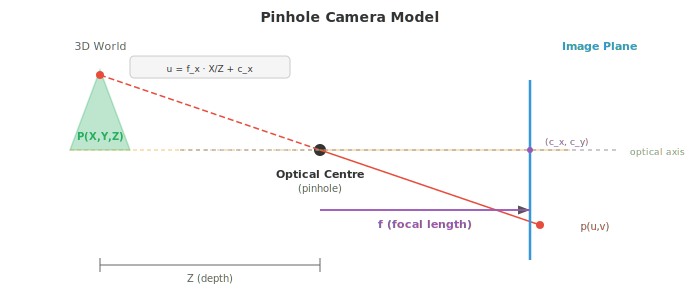
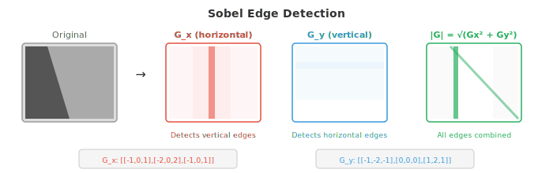

# 图像基础

*图像基础解释了数字图像在被任何模型处理之前是如何表示、形成和预处理的。本文件涵盖像素、色彩空间（RGB、HSV、YCbCr、LAB）、针孔相机模型、卷积、边缘检测（Sobel、Canny）、直方图以及特征描述子（SIFT、ORB），这是低层视觉的工具箱。*

- **数字图像**（digital image）是一个二维数字网格。网格中的每个单元称为一个**像素**（picture element，像素），其值表示亮度或颜色。灰度图像是一个二维矩阵，每个像素保存一个亮度值，对于 8 位图像，该值通常从 0（黑色）到 255（白色）。

- 彩色图像将其扩展到三个通道。在 **RGB** 色彩空间中，每个像素存储三个值：红色、绿色和蓝色的强度。

- 彩色图像是形状为 (height, width, 3) 的三维张量（矩阵）。以不同强度混合这三个通道，可以产生可见色彩的全部光谱。


- **位深**（bit depth）决定了每个通道能表示多少个不同的强度级别。

- 8 位图像每个通道有 $2^8 = 256$ 个级别，可产生 $256^3 \approx 16.7$ 万种可能的颜色。16 位图像每个通道有 65,536 个级别，用于对细微强度差异敏感的医学成像和 HDR 摄影。

- RGB 对显示器很方便，但其他色彩空间更适合不同的任务。

- **HSV**（色相 Hue、饱和度 Saturation、明度 Value）将颜色信息与亮度分离。色相是纯色（在色环上为 0-360 度），饱和度是颜色的鲜艳程度（0 = 灰色，1 = 纯色），明度是亮度。HSV 适合基于颜色的分割，因为可以只对色相设定阈值，而与光照条件无关。在 HSV 中检测 "红色物体" 比在 RGB 中容易得多。

- **YCbCr** 将亮度（Y，感知亮度）与色度（Cb、Cr，色差信号）分离。这是 JPEG 压缩和视频编解码器使用的色彩空间。人眼对亮度比对颜色更敏感，因此色度可以以较低的分辨率存储（色度子采样），几乎不会产生可感知的损失。

- **LAB**（CIELAB）的设计使得两个颜色之间的数值距离对应于感知差异。在 LAB 空间中相等的步长对人眼观察者而言看起来也相等。L 通道是亮度，A 从绿色到红色，B 从蓝色到黄色。当需要进行感知均匀的颜色比较时使用 LAB。

- **成像**（image formation）描述了三维场景如何变成二维图像。最简单的模型是**针孔相机**：来自场景的光线穿过一个小孔并投射到其后的传感器平面上。世界坐标中的一个点 $(X, Y, Z)$ 投影到像素坐标 $(u, v)$：

```math
\begin{bmatrix} u \\ v \\ 1 \end{bmatrix} = \frac{1}{Z} \begin{bmatrix} f_x & 0 & c_x \\ 0 & f_y & c_y \\ 0 & 0 & 1 \end{bmatrix} \begin{bmatrix} X \\ Y \\ Z \end{bmatrix}
```

- 这个 3x3 矩阵就是**内参矩阵** $K$。它编码了相机的内部属性：焦距 $f_x, f_y$（镜头汇聚光线的能力有多强）和主点 $(c_x, c_y)$（光轴与传感器的交点，通常位于图像中心附近）。对于给定的相机和镜头组合，这些参数是固定的。



- **外参**描述了相机在世界中的位置：一个旋转矩阵 $R$（3x3，来自第 02 章）和一个平移向量 $t$（3x1）。它们一起将世界坐标变换为相机坐标。完整的投影是：

$$\mathbf{p} = K [R \mid t] \mathbf{P}$$

- 其中 $\mathbf{P} = [X, Y, Z, 1]^T$ 是齐次坐标下的三维点，$\mathbf{p} = [u, v, 1]^T$ 是投影后的像素。$[R \mid t]$ 矩阵是 3x4 的，将旋转和平移并排堆叠。这全部是第 02 章的线性代数内容。

- 真实的镜头会引入**畸变**。

    - **径向畸变**将直线弯曲成曲线（桶形畸变使图像向外凸出；枕形畸变使图像向内挤压）。
    **切向畸变**由镜头未与传感器完全平行引起。

- 相机标定从已知图案（如棋盘格）的图像中估计内参和畸变系数，然后对图像进行校正（去畸变）。

- **空间滤波**是经典图像处理的基础。**滤波器**（或 kernel）是一个小矩阵（通常是 3x3 或 5x5），在图像上滑动。在每个位置，滤波器的值与重叠的图像块逐元素相乘并求和，产生一个输出像素。这是一种 **2D 卷积**，与驱动 CNN（文件 02）的操作相同，但这里的滤波器权重是手工设计的，而不是学习得到的。

$$(\text{image} * K)[i,j] = \sum_{m} \sum_{n} \text{image}[i+m, j+n] \cdot K[m, n]$$

- 这是第 06 章 1D 卷积的 2D 扩展。滤波器决定了操作检测什么：不同的滤波器检测不同的特征。

- **模糊**通过对相邻像素取平均来平滑图像。**盒式滤波器**（box filter）对所有邻居赋予相等的权重。

- **高斯滤波器**按 2D 高斯（第 05 章）对邻居加权，给近处像素更大的权重，远处像素更小的权重。高斯模糊是最常见的平滑操作，由 $\sigma$ 参数化：$\sigma$ 越大，平滑程度越高。

- **中值滤波**用邻域的中值替换每个像素，而不是加权平均。它在去除椒盐噪声（随机的黑白像素）的同时能保留边缘，因为中值对离群值具有鲁棒性（如第 04 章所讨论）。

- **边缘检测**识别像素强度急剧变化的边界。边缘携带了图像中大部分的结构信息；仅凭边缘就能识别物体。

- **Sobel 算子**使用两个 3x3 滤波器来估计水平和垂直方向的梯度：

```math
G_x = \begin{bmatrix} -1 & 0 & 1 \\ -2 & 0 & 2 \\ -1 & 0 & 1 \end{bmatrix}, \quad G_y = \begin{bmatrix} -1 & -2 & -1 \\ 0 & 0 & 0 \\ 1 & 2 & 1 \end{bmatrix}
```

- 将图像与 $G_x$ 卷积得到水平梯度（对垂直边缘响应强烈），$G_y$ 给出垂直梯度（对水平边缘响应强烈）。

- 梯度幅值 $\sqrt{G_x^2 + G_y^2}$ 和方向 $\arctan(G_y / G_x)$ 共同描述了每个像素处的边缘强度和方向。这是第 03 章梯度在图像域的对应物。



- **Canny 边缘检测器**是边缘检测的黄金标准。它包含四个步骤：
    1. 用高斯滤波器平滑图像以减少噪声
    2. 计算梯度幅值和方向（使用 Sobel）
    3. **非极大值抑制**：只保留沿梯度方向的局部极大像素，从而细化边缘
    4. **滞后阈值化**：使用两个阈值（高和低）。高于高阈值的像素是确定的边缘。处于两个阈值之间的像素只有在与确定边缘连通时才被视为边缘。低于低阈值的像素被丢弃。

- Canny 中的两个阈值使其比单一阈值更鲁棒：强边缘总是被保留，而弱边缘只有在属于连续边缘结构时才被保留。

- **频域**分析揭示了在空间域中难以察觉的模式。**2D 傅里叶变换**（扩展第 03 章的 1D 版本）将图像分解为不同频率和方向的 2D 正弦图案之和：

$$F(u, v) = \sum_{x=0}^{M-1} \sum_{y=0}^{N-1} f(x, y) \cdot e^{-j2\pi(ux/M + vy/N)}$$

- 低频对应于平滑、缓慢变化的区域（天空、墙壁）。高频对应于急剧变化（边缘、纹理、噪声）。**幅度谱**显示每个频率上存在多少能量，**相位谱**编码空间排列。

- **低通滤波**去除高频，使图像平滑（在空间域中相当于高斯模糊）。**高通滤波**去除低频，强调边缘和细节。**带通滤波**只保留一个频率范围，对纹理分析有用。

- 在实践中，对于大滤波器，频域滤波可能比空间卷积更快，因为空间域的卷积等价于频域的逐元素乘法（**卷积定理**）。这与第 03 章的傅里叶变换性质直接相关。

- **直方图**汇总了像素强度的分布。直方图统计具有每个强度值的像素数量（8 位图像为 0-255）。它与第 04 章的频率分布相同，只是应用于像素值。


- 偏暗图像的直方图集中在左侧（低值）。偏亮图像集中在右侧。低对比度图像的直方图较窄。高对比度图像的直方图宽且分布均匀。

- **直方图均衡化**拉伸直方图使其覆盖整个强度范围，从而提高对比度。其思想是找到一个映射，使像素强度的累积分布函数（CDF）近似线性。这是第 04 章 CDF 概念的直接应用。

- **Otsu 方法**自动寻找将图像分割为前景和背景的最佳阈值。它尝试所有可能的阈值，并选择使类内方差最小（等价于使类间方差最大）的阈值。这是第 04 章方差概念应用于像素强度总体。

- **特征提取**识别图像中可用于匹配、识别和三维重建的独特点或区域。好的特征应当是可重复的（在不同视角下能再次找到）、独特的（与其他特征可区分）且计算高效的。

- **角点检测**寻找图像强度在多个方向上显著变化的点。平滑区域在任何方向上变化都很小。边缘在一个方向上有变化。角点在至少两个方向上有变化，使其局部唯一，因此是可靠的地标。

- **Harris 角点检测器**分析每个像素处的**结构张量**（也称为二阶矩矩阵）：

```math
M = \sum_{(x,y) \in W} w(x,y) \begin{bmatrix} I_x^2 & I_x I_y \\ I_x I_y & I_y^2 \end{bmatrix}
```

- 其中 $I_x$ 和 $I_y$ 是图像梯度（用 Sobel 计算），$W$ 是局部窗口，$w$ 是高斯加权函数。$M$ 的特征值（来自第 02 章）告诉你特征的类型：
    - 两个特征值都小：平坦区域（无特征）
    - 一个大一个小：边缘
    - 两个都大：角点

- Harris 不显式计算特征值，而是使用角点响应函数：$R = \det(M) - k \cdot (\text{trace}(M))^2$，其中 $\det(M) = \lambda_1 \lambda_2$，$\text{trace}(M) = \lambda_1 + \lambda_2$（均来自第 02 章）。大的正值 $R$ 表示角点。常数 $k$ 通常取 0.04-0.06。

- **Shi-Tomasi** 检测器将其简化为 $R = \min(\lambda_1, \lambda_2)$，直接检查较小的特征值是否足够大。这在实践中更稳定一些。

- **斑点检测**寻找与周围环境不同的区域。与角点（点特征）不同，斑点具有特征尺寸。

- **SIFT**（Scale-Invariant Feature Transform，尺度不变特征变换，Lowe，2004）在多个尺度上检测斑点，并构造对旋转、尺度不变、对光照变化部分不变的描述子。其工作流程是：
    1. 使用逐渐增大的 $\sigma$ 的高斯模糊构建**尺度空间**（见下文）
    2. 在跨尺度的高斯差分（DoG）中寻找极值
    3. 精化关键点位置并去除低对比度点和边缘响应
    4. 基于局部梯度方向分配主方向
    5. 在关键点周围的 16x16 块中用梯度直方图构建 128 维描述子

- **SURF**（Speeded-Up Robust Features）使用盒式滤波器和积分图像近似 SIFT，以加快计算。**ORB**（Oriented FAST and Rotated BRIEF）是一个快速、开源的替代方案，将 FAST 角点检测器与 BRIEF 二值描述子相结合，并加入了旋转不变性。

- **HOG**（Histogram of Oriented Gradients，方向梯度直方图）描述子将图像划分为小单元格，在每个单元格内计算梯度方向直方图，并在单元格块上进行归一化。HOG 捕获了边缘方向的分布，这对物体形状极具信息量。在深度学习之前，HOG + SVM（第 06 章）是行人检测和物体识别的主流方法。

- **图像金字塔**以多个分辨率表示图像。
    - **高斯金字塔**通过反复模糊和下采样（将分辨率减半）来构建。每一层都是原始图像的更粗糙版本。
    - **拉普拉斯金字塔**存储连续高斯层之间的差异，捕获每次下采样步骤中丢失的细节。拉普拉斯金字塔是可逆的：可以从中重建原始图像。


- **尺度空间**将物体存在于不同尺度这一想法形式化。一棵树是一个大斑点；树上的一片叶子是一个小斑点。要同时检测两者，需要跨尺度搜索。图像的尺度空间是用逐渐增大的 $\sigma$ 的高斯与图像卷积所产生的图像族：

$$L(x, y, \sigma) = G(x, y, \sigma) * I(x, y)$$

- 其中 $G$ 是标准差为 $\sigma$ 的 2D 高斯。在多个尺度上持续存在的特征更可能是有意义的结构而非噪声。尺度空间是 SIFT 以及整个现代计算机视觉中使用的多尺度处理的理论基础，包括目标检测中的特征金字塔网络（文件 03）。

## 编码任务（使用 CoLab 或 notebook）

1. 加载一张图像，将其转换为不同的色彩空间（RGB、HSV、LAB），并可视化各个通道。观察颜色信息在不同空间中是如何不同地分布的。
```python
import jax.numpy as jnp
import matplotlib.pyplot as plt
from PIL import Image
import numpy as np

# Create a synthetic test image with distinct colours
H, W = 128, 256
img = np.zeros((H, W, 3), dtype=np.uint8)
img[:, :64] = [255, 50, 50]     # red
img[:, 64:128] = [50, 255, 50]  # green
img[:, 128:192] = [50, 50, 255] # blue
img[:, 192:] = [255, 255, 50]   # yellow

# Add a brightness gradient
for y in range(H):
    scale = 0.3 + 0.7 * y / H
    img[y] = (img[y] * scale).astype(np.uint8)

img_jnp = jnp.array(img, dtype=jnp.float32) / 255.0

# Manual RGB to HSV conversion
def rgb_to_hsv(rgb):
    r, g, b = rgb[..., 0], rgb[..., 1], rgb[..., 2]
    maxc = jnp.max(rgb, axis=-1)
    minc = jnp.min(rgb, axis=-1)
    diff = maxc - minc + 1e-7

    # Hue
    h = jnp.where(maxc == minc, 0.0,
        jnp.where(maxc == r, 60 * ((g - b) / diff % 6),
        jnp.where(maxc == g, 60 * ((b - r) / diff + 2),
                              60 * ((r - g) / diff + 4))))
    s = jnp.where(maxc < 1e-7, 0.0, diff / maxc)
    v = maxc
    return jnp.stack([h / 360, s, v], axis=-1)

hsv = rgb_to_hsv(img_jnp)

fig, axes = plt.subplots(2, 3, figsize=(14, 8))
for i, (ch, name) in enumerate(zip([img_jnp[...,0], img_jnp[...,1], img_jnp[...,2]],
                                     ['Red', 'Green', 'Blue'])):
    axes[0, i].imshow(ch, cmap='gray', vmin=0, vmax=1)
    axes[0, i].set_title(f'RGB: {name}'); axes[0, i].axis('off')

for i, (ch, name) in enumerate(zip([hsv[...,0], hsv[...,1], hsv[...,2]],
                                     ['Hue', 'Saturation', 'Value'])):
    axes[1, i].imshow(ch, cmap='gray', vmin=0, vmax=1)
    axes[1, i].set_title(f'HSV: {name}'); axes[1, i].axis('off')

plt.suptitle('RGB vs HSV Channels')
plt.tight_layout(); plt.show()
```

2. 从零开始使用 2D 卷积实现 Sobel 边缘检测和高斯模糊。将它们应用于一张图像并比较结果。
```python
import jax
import jax.numpy as jnp
import matplotlib.pyplot as plt

def conv2d(image, kernel):
    """2D convolution (valid mode) from scratch."""
    H, W = image.shape
    kH, kW = kernel.shape
    out_h, out_w = H - kH + 1, W - kW + 1
    output = jnp.zeros((out_h, out_w))
    for i in range(out_h):
        for j in range(out_w):
            patch = image[i:i+kH, j:j+kW]
            output = output.at[i, j].set(jnp.sum(patch * kernel))
    return output

# Create a test image: white rectangle on dark background
img = jnp.zeros((64, 64))
img = img.at[15:50, 20:45].set(1.0)
# Add some noise
key = jax.random.PRNGKey(42)
img = img + jax.random.normal(key, img.shape) * 0.05

# Sobel filters
sobel_x = jnp.array([[-1, 0, 1], [-2, 0, 2], [-1, 0, 1]], dtype=jnp.float32)
sobel_y = jnp.array([[-1, -2, -1], [0, 0, 0], [1, 2, 1]], dtype=jnp.float32)

# Gaussian blur kernel (5x5, sigma=1)
ax = jnp.arange(-2, 3, dtype=jnp.float32)
xx, yy = jnp.meshgrid(ax, ax)
gaussian = jnp.exp(-(xx**2 + yy**2) / (2 * 1.0**2))
gaussian = gaussian / gaussian.sum()

# Apply filters
gx = conv2d(img, sobel_x)
gy = conv2d(img, sobel_y)
edges = jnp.sqrt(gx**2 + gy**2)
blurred = conv2d(img, gaussian)

fig, axes = plt.subplots(1, 4, figsize=(16, 4))
for ax, data, title in zip(axes,
    [img, edges, blurred, gx],
    ['Original', 'Edge Magnitude', 'Gaussian Blur', 'Horizontal Gradient']):
    ax.imshow(data, cmap='gray')
    ax.set_title(title); ax.axis('off')
plt.tight_layout(); plt.show()
```

3. 从零开始实现直方图均衡化，并将其应用于低对比度灰度图像。比较前后直方图。
```python
import jax.numpy as jnp
import matplotlib.pyplot as plt

# Create a low-contrast image (values clustered in a narrow range)
key = __import__('jax').random.PRNGKey(42)
img = __import__('jax').random.uniform(key, (128, 128)) * 0.3 + 0.3  # values in [0.3, 0.6]

def histogram_equalise(img, n_bins=256):
    """Histogram equalisation for a grayscale image."""
    # Quantise to bins
    bins = jnp.linspace(0, 1, n_bins + 1)
    hist = jnp.histogram(img, bins=bins)[0]

    # Compute CDF
    cdf = jnp.cumsum(hist)
    cdf_normalised = (cdf - cdf.min()) / (cdf.max() - cdf.min())

    # Map each pixel through the CDF
    indices = jnp.clip((img * n_bins).astype(jnp.int32), 0, n_bins - 1)
    equalised = cdf_normalised[indices]
    return equalised

eq_img = histogram_equalise(img)

fig, axes = plt.subplots(2, 2, figsize=(12, 10))
axes[0, 0].imshow(img, cmap='gray', vmin=0, vmax=1)
axes[0, 0].set_title('Original (Low Contrast)'); axes[0, 0].axis('off')
axes[0, 1].imshow(eq_img, cmap='gray', vmin=0, vmax=1)
axes[0, 1].set_title('After Histogram Equalisation'); axes[0, 1].axis('off')

axes[1, 0].hist(img.ravel(), bins=64, color='#3498db', alpha=0.8)
axes[1, 0].set_title('Histogram Before'); axes[1, 0].set_xlim(0, 1)
axes[1, 1].hist(eq_img.ravel(), bins=64, color='#e74c3c', alpha=0.8)
axes[1, 1].set_title('Histogram After'); axes[1, 1].set_xlim(0, 1)

plt.tight_layout(); plt.show()
```

4. 从零开始实现 Harris 角点检测器。在一张简单图像中检测角点并可视化。
```python
import jax
import jax.numpy as jnp
import matplotlib.pyplot as plt

def harris_corners(img, k=0.05, threshold=0.01):
    """Harris corner detection from scratch."""
    # Compute gradients with Sobel
    sobel_x = jnp.array([[-1, 0, 1], [-2, 0, 2], [-1, 0, 1]], dtype=jnp.float32)
    sobel_y = jnp.array([[-1, -2, -1], [0, 0, 0], [1, 2, 1]], dtype=jnp.float32)

    # Pad image for valid convolution to preserve size
    img_pad = jnp.pad(img, 1, mode='edge')
    H, W = img.shape

    Ix = jnp.zeros_like(img)
    Iy = jnp.zeros_like(img)
    for i in range(H):
        for j in range(W):
            patch = img_pad[i:i+3, j:j+3]
            Ix = Ix.at[i, j].set(jnp.sum(patch * sobel_x))
            Iy = Iy.at[i, j].set(jnp.sum(patch * sobel_y))

    # Structure tensor components
    Ixx = Ix * Ix
    Iyy = Iy * Iy
    Ixy = Ix * Iy

    # Gaussian smoothing of structure tensor (approximate with window sum)
    w = 3  # window half-size
    R = jnp.zeros_like(img)
    pad_xx = jnp.pad(Ixx, w, mode='constant')
    pad_yy = jnp.pad(Iyy, w, mode='constant')
    pad_xy = jnp.pad(Ixy, w, mode='constant')

    for i in range(H):
        for j in range(W):
            sxx = jnp.sum(pad_xx[i:i+2*w+1, j:j+2*w+1])
            syy = jnp.sum(pad_yy[i:i+2*w+1, j:j+2*w+1])
            sxy = jnp.sum(pad_xy[i:i+2*w+1, j:j+2*w+1])
            det = sxx * syy - sxy * sxy
            trace = sxx + syy
            R = R.at[i, j].set(det - k * trace * trace)

    # Threshold
    corners = R > threshold * R.max()
    return R, corners

# Test image: checkerboard pattern (lots of corners)
block = 16
n = 4
checker = jnp.zeros((block * n, block * n))
for i in range(n):
    for j in range(n):
        if (i + j) % 2 == 0:
            checker = checker.at[i*block:(i+1)*block, j*block:(j+1)*block].set(1.0)

R, corners = harris_corners(checker)
cy, cx = jnp.where(corners)

fig, axes = plt.subplots(1, 3, figsize=(14, 4))
axes[0].imshow(checker, cmap='gray')
axes[0].set_title('Checkerboard'); axes[0].axis('off')
axes[1].imshow(R, cmap='hot')
axes[1].set_title('Harris Response'); axes[1].axis('off')
axes[2].imshow(checker, cmap='gray')
axes[2].scatter(cx, cy, c='#e74c3c', s=15, marker='x')
axes[2].set_title(f'Detected Corners ({len(cx)})'); axes[2].axis('off')
plt.tight_layout(); plt.show()
```
