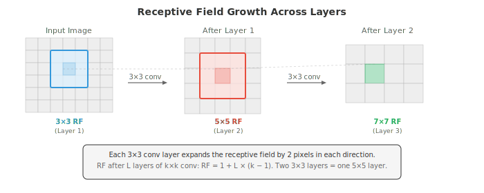
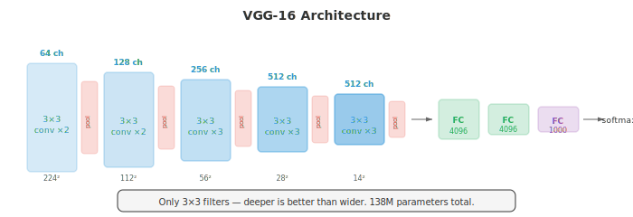
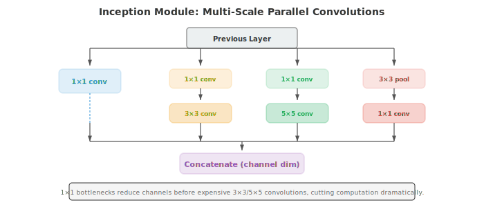
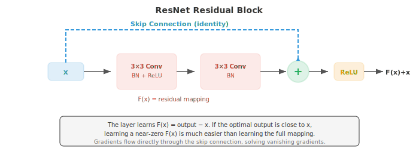
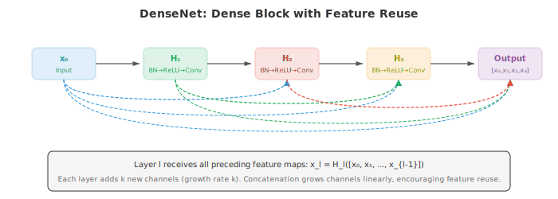
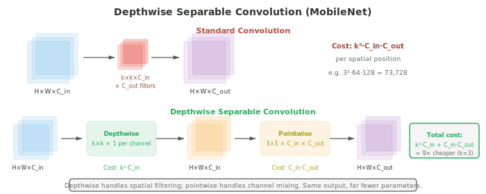
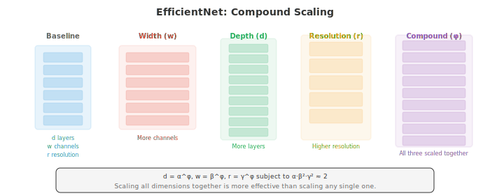
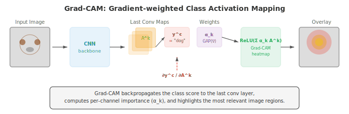

# Свёрточные нейронные сети

*Свёрточные нейронные сети обучаются иерархиям пространственных признаков непосредственно на данных пикселей, заменяя фильтры, разработанные вручную, на оптимизируемые градиентным спуском. В этом файле рассматриваются механика свёртки, пулинг, шаг (stride), расширение (dilation), рецептивные поля и знаковые архитектуры (LeNet, AlexNet, VGG, ResNet, Inception, EfficientNet), которые определили развитие классификации изображений.*

- В файле 01 мы вручную разрабатывали фильтры для обнаружения границ, размытия и поиска углов. Возникает закономерный вопрос: можно ли обучить оптимальные фильтры на данных? Именно этим и занимаются свёрточные нейронные сети (CNN).

- Вместо того чтобы подбирать веса фильтров вручную, CNN обучают их с помощью градиентного спуска (глава 06), обнаруживая признаки, которые непосредственно полезны для решаемой задачи.

- В главе 06 мы представили операцию свёртки, основы CNN и идею обучения фильтров. Здесь мы глубже погрузимся в архитектурные инновации, которые сделали CNN доминирующей парадигмой в компьютерном зрении на протяжении более десяти лет.

- Вспомним основную **операцию свёртки**: фильтр $K$ размера $k \times k$ скользит по входной карте признаков, вычисляя скалярное произведение в каждой позиции (глава 06). Размер выходных данных контролируется тремя гиперпараметрами:

    - **Шаг (Stride)**: количество пикселей, на которое фильтр смещается между позициями. Шаг 1 означает, что фильтр сдвигается на один пиксель за раз. Шаг 2 означает сдвиг на два пикселя, что уменьшает пространственные размерности вдвое. Свёрточный слой с шагом является альтернативой пулингу для понижающей дискретизации (downsampling).
    - **Паддинг (Padding)**: добавление нулей вокруг границы входных данных. Паддинг типа "Same" ($p = \lfloor k/2 \rfloor$) сохраняет пространственные размерности. Паддинг типа "Valid" ($p = 0$) уменьшает их.
    - **Расширение (Dilation)**: вставка пропусков между элементами фильтра. Фильтр 3x3 с расширением 2 охватывает рецептивное поле 5x5, используя всего 9 параметров. Расширенные свёртки увеличивают рецептивное поле без увеличения вычислительных затрат.

- Пространственный размер выходных данных после свёртки:

$$\text{out} = \left\lfloor \frac{\text{in} - k + 2p}{s} \right\rfloor + 1$$

- где $\text{in}$ — размер входных данных, $k$ — размер ядра, $p$ — паддинг, а $s$ — шаг. Эта формула применяется независимо к высоте и ширине.

- **Рецептивное поле** нейрона — это область исходных входных данных, которая может влиять на его значение. 
    - Ранние слои имеют небольшие рецептивные поля (они видят локальные паттерны, такие как границы). 
    - Более глубокие слои имеют большие рецептивные поля (они видят более крупные структуры, такие как части объектов). 
    
- Рецептивное поле растет с каждым слоем: примерно на $k - 1$ пиксель на свёрточный слой (больше при использовании шага или расширения). 



- Слои **пулинга (pooling)** уменьшают пространственные размерности, сохраняя при этом наиболее важную информацию. 
    - **Max pooling** выбирает максимальное значение в каждом окне, сохраняя самую сильную активацию (наиболее выраженный признак). 
    - **Average pooling** вычисляет среднее значение, сглаживая карту признаков. Пулинг 2x2 с шагом 2 уменьшает обе пространственные размерности вдвое.

- **Глобальный средний пулинг (Global Average Pooling, GAP)** усредняет всю пространственную область каждого канала в одно число, создавая вектор, длина которого равна количеству каналов. GAP заменяет полносвязные слои в конце многих современных архитектур, значительно сокращая количество параметров и выступая в качестве структурного регуляризатора.

- **Пакетная нормализация (Batch Normalisation, BatchNorm)** нормализует активации внутри каждого мини-батча, приводя их к нулевому среднему и единичной дисперсии, а затем применяет обучаемые масштаб и сдвиг (глава 06). В CNN BatchNorm применяется по каждому каналу: статистика вычисляется по батчу и пространственным измерениям для каждого канала независимо. Это стабилизирует обучение, позволяет использовать более высокую скорость обучения и действует как мягкий регуляризатор.

- **Dropout** (глава 06) случайным образом обнуляет нейроны во время обучения. 

- В CNN **пространственный dropout (Spatial Dropout, Dropout2D)** отбрасывает целые каналы карт признаков, а не отдельные пиксели, что более эффективно, так как соседние пиксели в карте признаков сильно коррелируют.

- **Аугментация данных** искусственно расширяет обучающую выборку путем применения случайных преобразований к каждому изображению во время обучения: горизонтальные отражения, случайные кропы, повороты, изменение цветовых характеристик (яркость, контраст, насыщенность, оттенок) и cutout (маскирование случайных прямоугольных областей). Сеть видит каждое изображение во множестве различных форм, что заставляет её изучать инвариантные к преобразованиям признаки, а не запоминать конкретные паттерны пикселей.

- Продвинутые стратегии аугментации включают **Mixup** (смешивание двух изображений и их меток: $\tilde{x} = \lambda x_i + (1-\lambda) x_j$, $\tilde{y} = \lambda y_i + (1-\lambda) y_j$), **CutMix** (вставка прямоугольного фрагмента одного изображения в другое и смешивание меток пропорционально площади) и **RandAugment** (случайная выборка последовательности аугментаций из фиксированного набора с единым параметром интенсивности).

- История архитектур CNN — это история создания всё более глубоких и эффективных конструкций, каждая из которых решала проблему, ограничивавшую её предшественника.

- **LeNet-5** (LeCun et al., 1998) была первой CNN, разработанной для распознавания рукописных цифр. Два свёрточных слоя, за которыми следовали три полносвязных слоя, с использованием среднего пулинга и функций активации tanh. Она доказала, что обученные фильтры превосходят признаки, разработанные вручную, но по современным меркам она была крошечной (60 тыс. параметров).

- **AlexNet** (Krizhevsky et al., 2012) выиграла соревнование ImageNet с огромным отрывом, спровоцировав революцию в глубоком обучении. Ключевые инновации: активация ReLU (вместо tanh, которая страдает от затухающих градиентов), dropout для регуляризации, аугментация данных и обучение на GPU. Пять свёрточных слоев, три полносвязных слоя, 60 миллионов параметров.

- **VGG** (Simonyan and Zisserman, 2014) показала, что использование только фильтров 3x3, уложенных в глубокую структуру, работает лучше, чем использование более крупных фильтров. Два последовательных фильтра 3x3 имеют такое же рецептивное поле, как один фильтр 5x5, но содержат меньше параметров ($2 \times 3^2 = 18$ против $5^2 = 25$) и обладают дополнительной нелинейностью. VGG-16 (16 слоев) и VGG-19 (19 слоев) до сих пор широко используются в качестве экстракторов признаков. Архитектура удивительно проста: свёрточные блоки с увеличивающимся количеством каналов (64, 128, 256, 512), каждый из которых сопровождается max pooling.



- **GoogLeNet/Inception** (Szegedy et al., 2014) представили **Inception-модуль**: вместо выбора одного размера фильтра используются параллельные свёртки 1x1, 3x3 и 5x5, их выходы конкатенируются, и сети предоставляется возможность решить, какой масштаб наиболее полезен. Свёртки 1x1 используются в качестве «бутылочного горлышка» (bottleneck) перед более крупными фильтрами для сокращения вычислений. GoogLeNet достиг более высокой точности, чем VGG, при использовании в 12 раз меньшего количества параметров (6.8 млн против 138 млн).



- Inception-модуль извлекает признаки в нескольких масштабах одновременно. Фильтр 1x1 улавливает поточечные паттерны, 3x3 — локальную текстуру, а 5x5 — более крупные структуры. Конкатенация объединяет все перспективы в богатое представление.

- **ResNet** (He et al., 2016) решил **проблему деградации**: более глубокие сети работали хуже, чем менее глубокие, не из-за переобучения, а из-за сложности их оптимизации. Решением стало **пропускающее соединение** (skip connection, или остаточное соединение):

$$\text{output} = F(x) + x$$

- Слой обучается вычислять остаток $F(x) = \text{output} - x$. Если оптимальное преобразование близко к тождественному (что часто встречается в глубоких сетях), обучение близкого к нулю остатка гораздо проще, чем обучение полного отображения. Пропускающие соединения также обеспечивают прямой «хайвей» для градиента, уменьшая проблему затухающих градиентов. ResNet позволил обучать сети со 152 слоями, что значительно глубже всего, что было ранее.



- Когда размерности входа и выхода различаются (из-за шага или изменения количества каналов), **проектирующее сокращение** (projection shortcut) применяет свёртку 1x1 к $x$ для согласования размерностей: $\text{output} = F(x) + W_s x$.

- **Блок «бутылочного горлышка»** (используемый в ResNet-50 и более глубоких моделях) использует три свёртки: 1x1 для уменьшения количества каналов, 3x3 для пространственной обработки и 1x1 для восстановления количества каналов. Это дешевле, чем две свёртки 3x3, и позволяет создавать гораздо более глубокие сети.

- **DenseNet** (Huang et al., 2017) развивает идею пропускающих соединений: каждый слой соединён с каждым последующим слоем внутри плотного блока. Слой $l$ получает карты признаков от всех предыдущих слоёв в качестве входа: $x_l = H_l([x_0, x_1, \ldots, x_{l-1}])$, где $[\cdot]$ обозначает конкатенацию вдоль размерности каналов. Это способствует повторному использованию признаков, усиливает поток градиентов и сокращает общее количество параметров.



- **Эффективные архитектуры** нацелены на развёртывание на мобильных устройствах и периферийном оборудовании, где вычислительные ресурсы, память и энергия ограничены.

- **MobileNet** (Howard et al., 2017) заменяет стандартные свёртки на **глубинные сепарабельные свёртки** (depthwise separable convolutions), которые факторизуют операцию на два этапа:
    1. **Глубинная свёртка** (depthwise convolution): применение одного фильтра $k \times k$ на каждый входной канал (без взаимодействия между каналами)
    2. **Поточечная свёртка** (pointwise convolution): применение свёрток 1x1 для объединения информации между каналами

- Стандартная свёртка $k \times k$ с $C_{\text{in}}$ входными каналами и $C_{\text{out}}$ выходными каналами требует $k^2 \cdot C_{\text{in}} \cdot C_{\text{out}}$ умножений на каждую пространственную позицию. Глубинная сепарабельная свёртка требует $k^2 \cdot C_{\text{in}} + C_{\text{in}} \cdot C_{\text{out}}$, что даёт сокращение примерно в $k^2$ раз. Для фильтра 3x3 это примерно в 9 раз дешевле.



- **MobileNet-V2** представила **инвертированный остаточный блок**: расширение каналов с помощью свёртки 1x1, применение глубинной свёртки в расширенном пространстве, затем проекция обратно вниз с помощью свёртки 1x1. Пропускающее соединение размещается на узких (бутылочных) слоях, инвертируя паттерн ResNet. Коэффициент расширения обычно равен 6.

- **EfficientNet** (Tan and Le, 2019) представила **составное масштабирование** (compound scaling): вместо независимого масштабирования только глубины, только ширины или только разрешения, все три измерения масштабируются вместе с использованием фиксированного коэффициента. При заданном коэффициенте масштабирования $\phi$:

$$\text{depth}: d = \alpha^\phi, \quad \text{width}: w = \beta^\phi, \quad \text{resolution}: r = \gamma^\phi$$

- при условии $\alpha \cdot \beta^2 \cdot \gamma^2 \approx 2$ (так что общие вычисления примерно удваиваются при каждом увеличении $\phi$ на единицу). Поиск по сетке определяет $\alpha = 1.2$, $\beta = 1.1$, $\gamma = 1.15$ в качестве базовых коэффициентов. Модели от EfficientNet-B0 до B7 масштабируются постепенно, достигая передового уровня точности при гораздо меньшем количестве параметров и FLOPs, чем предыдущие модели.



- **ShuffleNet** снижает стоимость свёрток 1x1 (которые доминируют в архитектурах типа MobileNet) за счёт использования **групповых свёрток** с последующим **перемешиванием каналов** (channel shuffle). Групповые свёртки разделяют каналы на группы и выполняют свёртку внутри каждой группы независимо, но это препятствует потоку информации между группами. Операция перемешивания переупорядочивает каналы между группами, восстанавливая обмен информацией с пренебрежимо малыми затратами.

- **Перенос обучения** (transfer learning) — это практика использования модели, обученной на одной задаче, и её адаптации к другой задаче. В компьютерном зрении это почти всегда означает начало работы с модели, предварительно обученной на ImageNet (1.4 миллиона изображений, 1000 классов), и её адаптацию к специфическому для предметной области датасету (медицинские изображения, спутниковые снимки, производственные дефекты).

- **Извлечение признаков (Feature extraction)**: заморозьте все свёрточные слои, удалите финальную классификационную «голову» и обучите только новую «голову» поверх них. Замороженные слои выступают в роли универсального экстрактора признаков. Этот подход хорошо работает, когда целевой домен похож на ImageNet, а целевой датасет невелик.

- **Тонкая настройка (Fine-tuning)**: разморозьте некоторые или все свёрточные слои и проводите обучение с низкой скоростью обучения. Предобученные веса служат отправной точкой, а не фиксированными признаками. Тонкая настройка обычно начинается с размораживания только последних слоев (которые улавливают высокоуровневые, специфичные для задачи признаки) с последующим опциональным размораживанием более ранних слоев.

- Обучение с переносом (transfer learning) работает, потому что ранние слои свёрточной нейронной сети (CNN) изучают универсальные признаки (границы, текстуры, цвета), которые полезны для разных задач, в то время как более поздние слои изучают специфичные для задачи признаки. Сеть, обученная классифицировать животных, всё ещё содержит полезные детекторы границ для классификации зданий.

- **Визуализация свёрточных нейронных сетей** позволяет понять, чему научилась сеть, и помогает отлаживать неожиданное поведение.

- **Карты активации** (карты признаков) показывают выход каждого фильтра для заданного входного изображения. Активации ранних слоев выглядят как карты границ; более глубокие слои создают всё более абстрактные, пространственно грубые активации.

- **Grad-CAM** (Gradient-weighted Class Activation Mapping, Selvaraju et al., 2017) подсвечивает области входного изображения, которые были наиболее важны для предсказания модели. Принцип работы:
    1. Вычисление градиента оценки целевого класса по отношению к картам признаков последнего свёрточного слоя (используя цепное правило из главы 03)
    2. Применение глобального среднего пулинга к этим градиентам для получения весов важности для каждого канала
    3. Вычисление взвешенной комбинации карт признаков и применение ReLU

$$L_{\text{Grad-CAM}} = \text{ReLU}\!\left(\sum_k \alpha_k A^k\right), \quad \alpha_k = \frac{1}{Z} \sum_i \sum_j \frac{\partial y^c}{\partial A^k_{ij}}$$

- где $A^k$ — $k$-я карта признаков, $\alpha_k$ — вес важности для канала $k$, а $y^c$ — оценка для класса $c$. Результатом является грубая тепловая карта, показывающая, какие области повлияли на классификацию. ReLU применяется, потому что нас интересуют признаки, оказывающие положительное влияние на класс.



- **Инверсия признаков (Feature inversion)** восстанавливает входное изображение из его представления в виде признаков путём оптимизации случайного изображения до соответствия целевым признакам (используя градиентный спуск по значениям пикселей). Это позволяет увидеть, какую информацию сеть сохраняет на каждом слое. Ранние слои восстанавливают почти идеальные изображения; более глубокие слои создают узнаваемые, но искаженные изображения, что показывает потерю мелких пространственных деталей при сохранении семантического содержания.

- **Deep Dream** и **нейронный перенос стиля** — это творческие приложения визуализации признаков. Deep Dream максимизирует активацию нейронов на выбранном слое для создания сюрреалистичных изображений с усиленными паттернами. Нейронный перенос стиля оптимизирует целевое изображение так, чтобы оно соответствовало признакам содержания (из глубокого слоя) одного изображения и признакам стиля (матрица Грама активаций фильтров, которая фиксирует статистику текстур) другого.

## Задания по программированию (используйте CoLab или ноутбук)

1. Реализуйте простую свёрточную нейронную сеть с нуля на JAX, используя два свёрточных слоя, макс-пулинг и классификационную «голову». Обучите её на задаче классификации синтетических 2D-паттернов.
```python
import jax
import jax.numpy as jnp
import jax.lax as lax
import matplotlib.pyplot as plt

def conv2d(x, kernel, stride=1):
    """Simple 2D convolution for single input, single filter."""
    return lax.conv(x[None, None], kernel[None, None], (stride, stride), 'SAME')[0, 0]

def max_pool(x, size=2):
    """2x2 max pooling."""
    H, W = x.shape
    x = x[:H//size*size, :W//size*size]
    return x.reshape(H//size, size, W//size, size).max(axis=(1, 3))

def init_cnn(key):
    k1, k2, k3 = jax.random.split(key, 3)
    return {
        'conv1': jax.random.normal(k1, (5, 5)) * 0.3,
        'conv2': jax.random.normal(k2, (3, 3)) * 0.3,
        'fc_w': jax.random.normal(k3, (64, 1)) * 0.1,
        'fc_b': jnp.zeros(1),
    }

def forward_cnn(params, img):
    # Conv1 -> ReLU -> Pool
    h = jnp.maximum(0, conv2d(img, params['conv1']))
    h = max_pool(h)
    # Conv2 -> ReLU -> Pool
    h = jnp.maximum(0, conv2d(h, params['conv2']))
    h = max_pool(h)
    # Flatten and classify
    flat = h.ravel()
    # Pad or truncate to fixed size
    flat = jnp.pad(flat, (0, max(0, 64 - len(flat))))[:64]
    logit = (flat @ params['fc_w'] + params['fc_b']).squeeze()
    return jax.nn.sigmoid(logit)

# Generate synthetic data: class 0 = low-freq pattern, class 1 = high-freq
def make_data(key, n=200):
    images, labels = [], []
    for i in range(n):
        k1, key = jax.random.split(key)
        x, y = jnp.meshgrid(jnp.linspace(0, 4*jnp.pi, 32), jnp.linspace(0, 4*jnp.pi, 32))
        if i < n // 2:
            img = jnp.sin(x) + jax.random.normal(k1, (32, 32)) * 0.1
            labels.append(0)
        else:
            img = jnp.sin(4 * x) * jnp.sin(4 * y) + jax.random.normal(k1, (32, 32)) * 0.1
            labels.append(1)
        images.append(img)
    return images, jnp.array(labels, dtype=jnp.float32)

key = jax.random.PRNGKey(42)
images, labels = make_data(key)
params = init_cnn(jax.random.PRNGKey(0))

def loss_fn(params, img, label):
    pred = forward_cnn(params, img)
    return -(label * jnp.log(pred + 1e-7) + (1 - label) * jnp.log(1 - pred + 1e-7))

grad_fn = jax.grad(loss_fn)
lr = 0.01

for epoch in range(5):
    total_loss = 0.0
    for img, label in zip(images, labels):
        grads = grad_fn(params, img, label)
        params = {k: params[k] - lr * grads[k] for k in params}
        total_loss += loss_fn(params, img, label)
    print(f"Epoch {epoch}: loss = {total_loss / len(images):.4f}")

# Test accuracy
preds = jnp.array([forward_cnn(params, img) > 0.5 for img in images])
acc = jnp.mean(preds == labels)
print(f"Accuracy: {acc:.2%}")
```

2. Визуализируйте, как различные размеры фильтров влияют на поле зрения (receptive field). Покажите, что два последовательных фильтра $3 \times 3$ покрывают то же поле зрения, что и один фильтр $5 \times 5$, но с меньшим количеством параметров.
```python
import jax.numpy as jnp
import matplotlib.pyplot as plt

def compute_receptive_field(layers):
    """Compute receptive field size from a list of (kernel_size, stride) tuples."""
    rf = 1  # start with 1 pixel
    stride_product = 1
    for k, s in layers:
        rf += (k - 1) * stride_product
        stride_product *= s
    return rf

# Compare architectures
configs = {
    'Single 5x5': [(5, 1)],
    'Two 3x3':    [(3, 1), (3, 1)],
    'Three 3x3':  [(3, 1), (3, 1), (3, 1)],
    'Single 7x7': [(7, 1)],
    '3x3 stride 2 + 3x3': [(3, 2), (3, 1)],
}

print(f"{'Config':<25} {'RF':>4} {'Params (per channel)':>20}")
print('-' * 55)
for name, layers in configs.items():
    rf = compute_receptive_field(layers)
    # Parameters: sum of k^2 for each layer (per input-output channel pair)
    params = sum(k * k for k, s in layers)
    print(f"{name:<25} {rf:>4} {params:>20}")

# Visualise receptive fields
fig, axes = plt.subplots(1, 3, figsize=(14, 4))
for ax, (name, rf_size) in zip(axes, [('5x5 filter', 5), ('Two 3x3 filters', 5), ('Three 3x3 filters', 7)]):
    grid = jnp.zeros((9, 9))
    c = 4  # centre
    half = rf_size // 2
    grid = grid.at[c-half:c+half+1, c-half:c+half+1].set(1.0)
    ax.imshow(grid, cmap='Blues', vmin=0, vmax=1)
    ax.set_title(f'{name}\nRF = {rf_size}x{rf_size}')
    ax.set_xticks(range(9)); ax.set_yticks(range(9))
    ax.grid(True, alpha=0.3)
plt.suptitle('Receptive Field Comparison')
plt.tight_layout(); plt.show()
```

3. Реализуйте Grad-CAM с нуля. Используя заранее созданную простую CNN, вычислите карту активации, взвешенную по градиентам, для конкретного класса и визуализируйте её в виде тепловой карты.
```python
import jax
import jax.numpy as jnp
import matplotlib.pyplot as plt

def simple_cnn(params, img):
    """Simple CNN that returns both the prediction and last conv activations."""
    # Conv layer (our "last conv layer" for Grad-CAM)
    H, W = img.shape
    k = params['conv'].shape[0]
    pad = k // 2
    img_pad = jnp.pad(img, pad, mode='edge')
    activation_map = jnp.zeros((H, W))
    for i in range(H):
        for j in range(W):
            activation_map = activation_map.at[i, j].set(
                jnp.sum(img_pad[i:i+k, j:j+k] * params['conv'])
            )
    activation_map = jnp.maximum(0, activation_map)  # ReLU

    # Global average pool -> dense -> output
    pooled = activation_map.mean()
    logit = pooled * params['w'] + params['b']
    return jax.nn.sigmoid(logit), activation_map

# Create test image: bright region on the left (class indicator)
img = jnp.zeros((32, 32))
img = img.at[8:24, 4:16].set(1.0)
img = img.at[5:10, 20:28].set(0.3)

key = jax.random.PRNGKey(42)
params = {
    'conv': jax.random.normal(key, (5, 5)) * 0.3,
    'w': jnp.array(2.0),
    'b': jnp.array(-0.5),
}

# Compute Grad-CAM
def class_score(params, img):
    pred, _ = simple_cnn(params, img)
    return pred

# Get activation map and gradients
pred, act_map = simple_cnn(params, img)
grad_fn = jax.grad(lambda img: simple_cnn(params, img)[0])
img_grad = grad_fn(img)

# Weight = global average of gradients (simplified 1-channel Grad-CAM)
alpha = img_grad.mean()
grad_cam = jnp.maximum(0, alpha * act_map)  # ReLU
grad_cam = (grad_cam - grad_cam.min()) / (grad_cam.max() - grad_cam.min() + 1e-8)

fig, axes = plt.subplots(1, 3, figsize=(14, 4))
axes[0].imshow(img, cmap='gray'); axes[0].set_title('Input Image'); axes[0].axis('off')
axes[1].imshow(act_map, cmap='viridis'); axes[1].set_title('Activation Map'); axes[1].axis('off')
axes[2].imshow(img, cmap='gray', alpha=0.6)
axes[2].imshow(grad_cam, cmap='jet', alpha=0.4)
axes[2].set_title(f'Grad-CAM (pred={pred:.2f})'); axes[2].axis('off')
plt.tight_layout(); plt.show()
```

4. Сравните глубинно-разделимую свёртку (depthwise separable convolution) со стандартной свёрткой. Подсчитайте количество параметров и FLOP для обеих и покажите, что они дают схожие результаты при значительно меньших вычислительных затратах.
```python
import jax
import jax.numpy as jnp

def standard_conv(x, kernel):
    """Standard convolution: (H, W, C_in) * (k, k, C_in, C_out) -> (H, W, C_out)."""
    H, W, C_in = x.shape
    k, _, _, C_out = kernel.shape
    pad = k // 2
    x_pad = jnp.pad(x, ((pad, pad), (pad, pad), (0, 0)), mode='constant')
    out = jnp.zeros((H, W, C_out))
    for i in range(H):
        for j in range(W):
            patch = x_pad[i:i+k, j:j+k, :]  # (k, k, C_in)
            for c in range(C_out):
                out = out.at[i, j, c].set(jnp.sum(patch * kernel[:, :, :, c]))
    return out

def depthwise_separable_conv(x, dw_kernel, pw_kernel):
    """Depthwise separable: depthwise (k,k,C_in) then pointwise (C_in, C_out)."""
    H, W, C_in = x.shape
    k = dw_kernel.shape[0]
    pad = k // 2
    x_pad = jnp.pad(x, ((pad, pad), (pad, pad), (0, 0)), mode='constant')

    # Depthwise: one filter per channel
    dw_out = jnp.zeros((H, W, C_in))
    for i in range(H):
        for j in range(W):
            for c in range(C_in):
                patch = x_pad[i:i+k, j:j+k, c]
                dw_out = dw_out.at[i, j, c].set(jnp.sum(patch * dw_kernel[:, :, c]))

    # Pointwise: 1x1 conv across channels
    out = dw_out @ pw_kernel
    return out

# Setup
H, W, C_in, C_out, k = 8, 8, 16, 32, 3
key = jax.random.PRNGKey(42)
k1, k2, k3, k4 = jax.random.split(key, 4)

x = jax.random.normal(k1, (H, W, C_in))
std_kernel = jax.random.normal(k2, (k, k, C_in, C_out)) * 0.1
dw_kernel = jax.random.normal(k3, (k, k, C_in)) * 0.1
pw_kernel = jax.random.normal(k4, (C_in, C_out)) * 0.1

# Compare
std_params = k * k * C_in * C_out
dw_params = k * k * C_in + C_in * C_out

std_flops = H * W * k * k * C_in * C_out
dw_flops = H * W * (k * k * C_in + C_in * C_out)

print(f"Standard conv:            {std_params:>8,} params,  {std_flops:>10,} FLOPs")
print(f"Depthwise separable conv: {dw_params:>8,} params,  {dw_flops:>10,} FLOPs")
print(f"Parameter reduction:      {std_params / dw_params:.1f}x")
print(f"FLOP reduction:           {std_flops / dw_flops:.1f}x")

std_out = standard_conv(x, std_kernel)
ds_out = depthwise_separable_conv(x, dw_kernel, pw_kernel)
print(f"\nStandard output shape:    {std_out.shape}")
print(f"Depthwise sep output shape: {ds_out.shape}")
```
