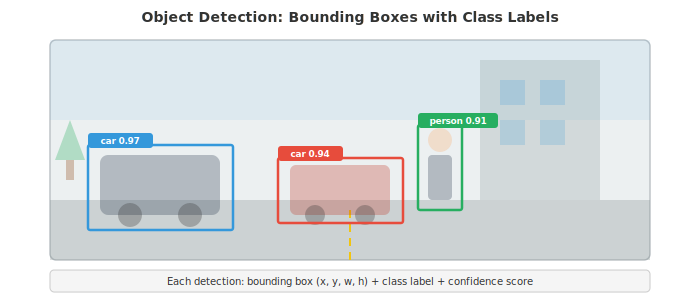
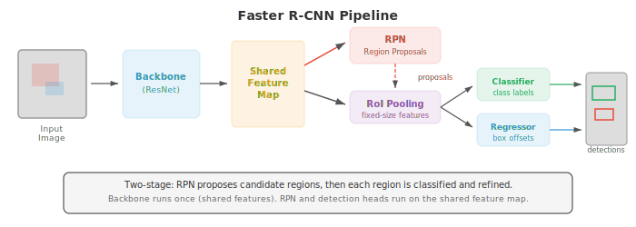
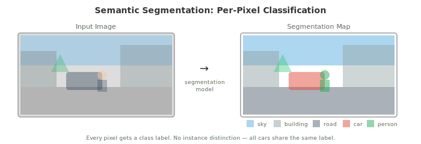
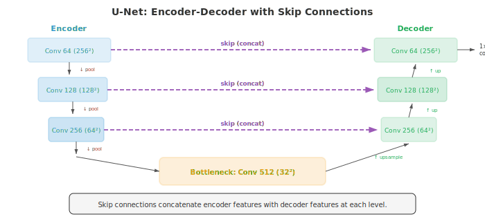

# 目标检测与分割

*目标检测定位并分类图像中的每一个物体；分割为每个像素分配一个标签。本文件涵盖 IoU、mAP、锚框、R-CNN 系列、YOLO、SSD、特征金字塔网络、语义/实例/全景分割（U-Net、Mask R-CNN、SAM）以及它们的评测指标。*

- 图像分类（文件 02）回答 "这张图像里有什么？" 目标检测提出一个更难的问题："这张图像里有哪些物体，它们在哪里？"

- 分割更进一步："哪些像素属于哪个物体或类别？" 这些任务构成一个空间理解逐步精确的层级。

- **目标检测**（object detection）模型输出一组**边界框**（bounding box），每个由四个坐标（左上角 $x, y$，宽度，高度）和一个带置信度分数的类别标签定义。一张图像可能包含零个、一个或来自多个类别的数百个物体。



- **交并比**（Intersection over Union，IoU）衡量预测边界框与真实标注的匹配程度。它是重叠面积除以并集面积：

$$\text{IoU} = \frac{\text{Area of Intersection}}{\text{Area of Union}}$$

- IoU 为 1 表示完全重叠；IoU 为 0 表示完全不重叠。"正确" 检测的标准阈值是 IoU $\geq 0.5$，但也使用更严格的阈值（0.75、0.9）。

- 如果一个检测与某个真实标注框的 IoU 超过阈值且类别正确，则它是一个**真正例（true positive，TP）**。

- **假正例（false positive，FP）**是不与任何真实标注匹配的预测框。

- **假负例（false negative，FN）**是没有预测匹配的真实标注物体。这些是第 06 章相同的精度/召回概念。

- **平均精度**（Average Precision，AP）汇总一个类别的检测质量。对每个类别，按置信度分数对所有检测排序，在每个排序位置计算精度和召回，并计算精度-召回曲线下的面积：

$$\text{AP} = \int_0^1 p(r) \, dr$$

- 在实践中，曲线是经过插值的：在每个召回级别，精度被设为任何召回 $\geq r$ 处的最大精度。这平滑了曲线并使其单调递减。

- **平均精度均值**（Mean Average Precision，mAP）对所有类别求 AP 的平均。"mAP@0.5" 使用 IoU 阈值 0.5。"mAP@[.5:.95]"（COCO 标准）在 0.5 到 0.95 之间以 0.05 步长对十个 IoU 阈值取 mAP 的平均，同时奖励检测和精确定位。

- **非极大值抑制**（Non-Maximum Suppression，NMS）去除重复检测。当模型为同一物体预测多个重叠框时，NMS 保留置信度最高的框，并去除所有与它在 IoU 阈值之上重叠的其他框。这按类别在模型产生原始预测之后应用。

- **两阶段检测器**首先提出候选区域，然后对每个候选进行分类和精化。

- **R-CNN**（Girshick 等，2014）是第一个成功的深度学习检测器。它使用选择性搜索（一种经典算法）提出约 2000 个候选区域，将每个区域变形为固定大小，独立地通过 CNN 运行每个区域，并用一个 SVM 分类（第 06 章）。R-CNN 精确但极其缓慢：每张图像要运行 CNN 2000 次。

- **Fast R-CNN**（Girshick，2015）通过在整个图像上运行一次 CNN 产生共享 feature map，然后使用 **RoI 池化**（Region of Interest pooling，感兴趣区域池化）从该共享 map 中为每个候选提取特征，解决了冗余问题。

- RoI 池化取 feature map 中一个可变大小的区域，通过将该区域划分为网格并在每个单元格内做最大池化，产生固定大小的输出。这快得多，因为昂贵的 CNN 计算只发生一次。

- **Faster R-CNN**（Ren 等，2015）通过引入**区域提议网络**（Region Proposal Network，RPN）消除了外部区域提议算法。RPN 是一个小型 CNN，在共享 feature map 之上运行并直接预测提议。RPN 在 feature map 上滑动一个小窗口，在每个位置预测 $k$ 个提议（每个**锚框**（anchor box）一个）。



- **锚框**（anchor box）是 feature map 每个空间位置上预定义的边界框，覆盖不同的尺度和长宽比（例如，三种尺度 $\times$ 三种比例 = 每个位置 9 个锚框）。RPN 为每个锚框预测两件事：一个 objectness 分数（物体 vs 背景）和将锚框精化为更紧凑提议的坐标偏移。这种参数化使回归问题更简单：网络不再预测绝对坐标，而是预测对一个合理起始框的小幅调整。

- 锚框偏移参数化为：

$$t_x = \frac{x - x_a}{w_a}, \quad t_y = \frac{y - y_a}{h_a}, \quad t_w = \log\frac{w}{w_a}, \quad t_h = \log\frac{h}{h_a}$$

- 其中 $(x, y, w, h)$ 是预测框的中心和大小，$(x_a, y_a, w_a, h_a)$ 是锚框。宽高的对数变换确保预测框始终为正，并使回归对尺度不变。

- Faster R-CNN 用多任务损失训练：用于类别标签的分类损失（第 05 章的 cross-entropy），加上用于边界框回归的 **smooth L1 损失**。Smooth L1 对离群值不如 L2 敏感：

```math
\text{smooth}_{L1}(x) = \begin{cases} 0.5x^2 & \text{if } |x| < 1 \\ |x| - 0.5 & \text{otherwise} \end{cases}
```

- **特征金字塔网络**（Feature Pyramid Networks，FPN）（Lin 等，2017）通过构建一个带有横向连接的自顶向下路径，将高层语义与低层空间细节融合，来解决多尺度问题。主干在多个尺度上产生 feature map（每个池化层将分辨率减半）。FPN 增加了一条自顶向下的路径，其中每一层接收上一层上采样的特征，并通过横向 1x1 卷积将其与对应的自底向上层融合。结果是一个 feature map 金字塔，每层既有强语义又有良好的空间分辨率。

- 小物体从金字塔的高分辨率层检测；大物体从低分辨率层检测。FPN 现在是大多数现代检测架构的标准组件。

- **单阶段检测器**完全跳过提议步骤，在单次前向传递中预测类别标签和边界框。这更快，但在历史上不如两阶段检测器精确，直到 focal loss 缩小了差距。

- **YOLO**（You Only Look Once，Redmon 等，2016）将图像划分为 $S \times S$ 网格。每个网格单元预测 $B$ 个边界框和 $C$ 个类别概率。如果一个物体的中心落在某个网格单元内，该单元负责检测它。YOLO 极其快速，因为整个检测是单次前向传递，没有提议阶段。

- **YOLOv2** 增加了锚框、批量归一化和多尺度训练。**YOLOv3** 使用了特征金字塔网络并在三个尺度上预测。**YOLOv4-v8** 通过更好的主干、路径聚合网络和 mosaic 数据增强（训练时将四张图像拼在一起以增加上下文多样性）持续改进。

- **SSD**（Single Shot MultiBox Detector，Liu 等，2016）在主干内的多个 feature map 尺度上预测，每个尺度都使用锚框。早期（高分辨率）feature map 检测小物体；后期（低分辨率）map 检测大物体。SSD 比 Faster R-CNN 更快且精度具有竞争力。

- **RetinaNet**（Lin 等，2017）识别了单阶段检测器的核心问题：类别不平衡。绝大多数锚框对应于背景，这产生了大量易分的负样本，主导了损失并淹没了稀有正样本的梯度。

- **Focal loss** 通过降低易分样本的权重来解决这个问题：

$$\text{FL}(p_t) = -\alpha_t (1 - p_t)^\gamma \log(p_t)$$

- 其中 $p_t$ 是对正确类别的预测概率。当模型既自信又正确时（$p_t$ 高），$(1 - p_t)^\gamma$ 很小，减少了易分负样本的损失贡献。超参数 $\gamma$（通常为 2）控制降权的强度。当 $\gamma = 0$ 时，focal loss 退化为标准的 cross-entropy。借助 focal loss，RetinaNet 以单阶段速度达到了与两阶段检测器相当的精度。

- **无锚框检测**（anchor-free detection）完全消除了锚框，减少了超参数调整并简化了流程。

- **FCOS**（Fully Convolutional One-Stage，Tian 等，2019）在 feature map 的每个空间位置预测从该位置到最近边界框四条边的距离（左、上、右、下）以及一个类别标签。一个 **centerness** 分数对远离物体中心的预测降权，提高质量。FCOS 使用 FPN 处理多尺度。

- **CenterNet**（Zhou 等，2019）将物体作为点检测：它预测一张热图，其中峰值对应物体中心，然后在每个峰值处回归宽度和高度。检测变成关键点估计。这很优雅且无锚框，但需要仔细的热图后处理。

- **CornerNet** 将物体作为一对角点（左上和右下）检测。它预测两张热图（每种角点各一张）并使用**关联嵌入**（associative embedding）将对应的角点匹配成边界框。这避免了锚框的需要，并能处理任意形状的物体。

- **语义分割**（semantic segmentation）为图像中的每个像素分配一个类别标签。与检测（输出框）不同，分割产生密集的像素级 map。街景可能将每个像素标注为道路、人行道、汽车、行人、建筑、天空等。



- **全卷积网络**（Fully Convolutional Networks，FCN）（Long 等，2015）通过用卷积层替代全连接层，将分类 CNN 适配为分割，使网络能输出空间 map 而非单一类别。上采样（通过转置卷积或双线性插值）将输出恢复到输入分辨率。来自浅层的跳跃连接补充了下采样中丢失的空间细节。

- **转置卷积**（transposed convolution，有时称为 "反卷积"）是卷积的上采样对应物。带步长的卷积减小空间维度，而转置卷积增大空间维度。它在输入元素之间插入零，然后应用标准卷积，有效地学习如何上采样。

- **U-Net**（Ronneberger 等，2015）引入了一种对称的 encoder-decoder 架构，每一层都有跳跃连接。编码器（收缩路径）在增加通道的同时减小空间分辨率，就像分类 CNN 一样。解码器（扩展路径）将分辨率上采样回到完整。跳跃连接在每个层级将编码器 feature map 与解码器 feature map 拼接，为解码器提供精细的空间细节。这种高层语义与低层细节的结合产生了锐利、精确的分割边界。



- U-Net 最初是为生物医学图像分割而设计的（那里训练数据稀缺），其架构已成为许多后续模型的基础，包括潜在扩散模型中的 U-Net（文件 04）。

- **DeepLab**（Chen 等，2014-2018）引入了两个分割的关键创新：

    - **空洞（空洞）卷积**（Atrous/dilated convolution）：在滤波器元素之间插入间隔的标准卷积，由空洞率 $r$ 控制。一个 dilation 为 $r$ 的 3x3 滤波器的感受野为 $(2r + 1) \times (2r + 1)$，而只使用 9 个参数。这在不进行下采样的情况下捕获多尺度上下文，保留空间分辨率。

    - **空洞空间金字塔池化**（Atrous Spatial Pyramid Pooling，ASPP）：并行应用多个不同空洞率的空洞卷积（例如，率 1、6、12、18），拼接结果，并用 1x1 卷积融合。ASPP 同时捕获多尺度的上下文，精神上类似于 Inception 模块（文件 02），但使用空洞而非不同的 kernel 大小。

- DeepLab 还使用**条件随机场**（Conditional Random Field，CRF）（第 05 章）作为后处理步骤，通过鼓励空间上相近且颜色相似的像素共享同一标签来精化分割边界。

- **实例分割**（instance segmentation）结合检测与分割：它识别每个单独的物体实例并为每个产生像素级掩码。场景中的两辆车会得到两个独立的掩码，而不仅仅是两者都标记为 "车"。

- **Mask R-CNN**（He 等，2017）通过增加一个预测每个检测到的物体的二值掩码的小型分割头，扩展了 Faster R-CNN。其架构是 Faster R-CNN + 一个掩码分支：掩码分支接收 RoI 池化的特征并输出每类一个 $m \times m$ 的二值掩码。它使用 **RoIAlign** 替代 RoI 池化：在精确采样的点上做双线性插值，而非量化的网格单元格，这避免了量化导致的空间错位。这一小变化显著提高了掩码质量。

- Mask R-CNN 用多任务损失训练：分类损失 + 边界框回归损失 + 掩码损失（逐像素二值 cross-entropy）。掩码分支为每个类别独立预测掩码；只使用与预测类别对应的掩码，这把掩码预测与分类解耦，使两者都得到改善。

- **全景分割**（panoptic segmentation）将语义分割和实例分割统一为单一任务。每个像素同时获得一个类别标签（语义）和一个实例 ID（实例，用于像汽车和人这样的 "thing" 类）。"Stuff" 类（天空、道路、草地）只获得语义标签，因为它们是没有可数实例的无定形区域。

- 全景质量（panoptic quality，PQ）指标通过分解为分割质量（匹配段的平均 IoU）和识别质量（匹配段的 F1 分数）来评估：

$$\text{PQ} = \underbrace{\frac{\sum_{(p,g) \in \text{TP}} \text{IoU}(p,g)}{|\text{TP}|}}_{\text{SQ}} \times \underbrace{\frac{|\text{TP}|}{|\text{TP}| + \frac{1}{2}|\text{FP}| + \frac{1}{2}|\text{FN}|}}_{\text{RQ}}$$

- **实时分割**对自动驾驶和增强现实等应用至关重要，那里的延迟预算很紧（通常每帧不到 30 毫秒）。

- **BiSeNet**（Bilateral Segmentation Network，双边分割网络，Yu 等，2018）使用两条并行路径：一条具有宽而浅的层以保留空间细节的**空间路径**，和一条具有深而窄的层以捕获语义的**上下文路径**。两者的输出被融合，同时兼顾速度和精度。

- **DDRNet**（Deep Dual-Resolution Network，深度双分辨率网络，Hong 等，2021）在整个网络中保持不同分辨率的两个分支，并在它们之间反复交换信息。高分辨率分支保留空间细节，而低分辨率分支捕获全局上下文。多个双边融合模块在两个方向上合并信息。

- 实时分割的总体趋势是避免沉重的 encoder-decoder 模式，而是在整个网络中保持足够的分辨率，以些许精度换取大幅降低的延迟。

## 编码任务（使用 CoLab 或 notebook）

1. 从零开始实现 IoU 计算和非极大值抑制。对一组重叠的边界框应用 NMS 并可视化结果。
```python
import jax.numpy as jnp
import matplotlib.pyplot as plt
import matplotlib.patches as patches

def compute_iou(box1, box2):
    """Compute IoU between two boxes [x1, y1, x2, y2]."""
    x1 = jnp.maximum(box1[0], box2[0])
    y1 = jnp.maximum(box1[1], box2[1])
    x2 = jnp.minimum(box1[2], box2[2])
    y2 = jnp.minimum(box1[3], box2[3])

    intersection = jnp.maximum(0, x2 - x1) * jnp.maximum(0, y2 - y1)
    area1 = (box1[2] - box1[0]) * (box1[3] - box1[1])
    area2 = (box2[2] - box2[0]) * (box2[3] - box2[1])
    union = area1 + area2 - intersection

    return intersection / (union + 1e-6)

def nms(boxes, scores, iou_threshold=0.5):
    """Non-Maximum Suppression."""
    order = jnp.argsort(-scores)  # sort by descending confidence
    keep = []

    remaining = list(range(len(scores)))
    order_list = order.tolist()

    while order_list:
        idx = order_list[0]
        keep.append(idx)
        order_list = order_list[1:]

        new_order = []
        for j in order_list:
            iou = compute_iou(boxes[idx], boxes[j])
            if iou < iou_threshold:
                new_order.append(j)
        order_list = new_order

    return keep

# Example: overlapping detections of the same object
boxes = jnp.array([
    [50, 60, 150, 160],   # high confidence
    [55, 65, 155, 165],   # overlapping duplicate
    [52, 58, 148, 158],   # overlapping duplicate
    [200, 100, 300, 200], # different object
    [205, 105, 305, 205], # overlapping duplicate
])
scores = jnp.array([0.95, 0.80, 0.70, 0.90, 0.60])

keep = nms(boxes, scores, iou_threshold=0.5)

fig, axes = plt.subplots(1, 2, figsize=(14, 5))
colors = ['#3498db', '#e74c3c', '#27ae60', '#9b59b6', '#f39c12']

for ax, title, indices in zip(axes, ['Before NMS', 'After NMS'],
                               [range(len(boxes)), keep]):
    ax.set_xlim(0, 400); ax.set_ylim(0, 300)
    ax.set_aspect('equal'); ax.invert_yaxis()
    ax.set_title(title)
    for i in indices:
        b = boxes[i]
        rect = patches.Rectangle((b[0], b[1]), b[2]-b[0], b[3]-b[1],
                                  linewidth=2, edgecolor=colors[i],
                                  facecolor='none')
        ax.add_patch(rect)
        ax.text(b[0], b[1]-5, f'{scores[i]:.2f}', color=colors[i], fontsize=10)

plt.tight_layout(); plt.show()
print(f"Kept {len(keep)} of {len(boxes)} boxes after NMS")
```

2. 实现一个简化的区域提议网络（RPN）。给定一个 feature map，在多个尺度和长宽比下生成锚框，并预测 objectness 分数和边界框偏移。
```python
import jax
import jax.numpy as jnp
import matplotlib.pyplot as plt
import matplotlib.patches as patches

def generate_anchors(feature_h, feature_w, stride, scales, ratios):
    """Generate anchor boxes for each position on the feature map."""
    anchors = []
    for y in range(feature_h):
        for x in range(feature_w):
            cx = (x + 0.5) * stride
            cy = (y + 0.5) * stride
            for s in scales:
                for r in ratios:
                    w = s * jnp.sqrt(r)
                    h = s / jnp.sqrt(r)
                    anchors.append([cx - w/2, cy - h/2, cx + w/2, cy + h/2])
    return jnp.array(anchors)

def rpn_forward(feature_map, params):
    """Simplified RPN: predicts objectness and box offsets per anchor."""
    H, W, C = feature_map.shape
    n_anchors = params['cls_w'].shape[1]

    # Slide a 1x1 conv over the feature map (simplified)
    cls_scores = feature_map.reshape(-1, C) @ params['cls_w']  # (H*W, n_anchors)
    box_offsets = feature_map.reshape(-1, C) @ params['reg_w']  # (H*W, n_anchors*4)

    cls_scores = jax.nn.sigmoid(cls_scores)
    return cls_scores.ravel(), box_offsets.reshape(-1, 4)

# Setup
feature_h, feature_w, channels = 4, 4, 16
stride = 16  # each feature map cell covers 16x16 pixels
scales = [32, 64, 128]
ratios = [0.5, 1.0, 2.0]
n_anchors_per_pos = len(scales) * len(ratios)

key = jax.random.PRNGKey(42)
k1, k2, k3 = jax.random.split(key, 3)

feature_map = jax.random.normal(k1, (feature_h, feature_w, channels))
params = {
    'cls_w': jax.random.normal(k2, (channels, n_anchors_per_pos)) * 0.01,
    'reg_w': jax.random.normal(k3, (channels, n_anchors_per_pos * 4)) * 0.01,
}

anchors = generate_anchors(feature_h, feature_w, stride, scales, ratios)
scores, offsets = rpn_forward(feature_map, params)

print(f"Feature map: {feature_h}x{feature_w}, stride={stride}")
print(f"Anchors per position: {n_anchors_per_pos}")
print(f"Total anchors: {len(anchors)}")
print(f"Objectness scores shape: {scores.shape}")
print(f"Box offsets shape: {offsets.shape}")

# Visualise anchors for one position
fig, ax = plt.subplots(figsize=(6, 6))
img_size = feature_h * stride
ax.set_xlim(0, img_size); ax.set_ylim(0, img_size)
ax.invert_yaxis(); ax.set_aspect('equal')

pos_idx = feature_h // 2 * feature_w + feature_w // 2  # centre position
colors = ['#3498db', '#e74c3c', '#27ae60']
for i, s in enumerate(scales):
    for j, r in enumerate(ratios):
        idx = pos_idx * n_anchors_per_pos + i * len(ratios) + j
        a = anchors[idx]
        rect = patches.Rectangle((a[0], a[1]), a[2]-a[0], a[3]-a[1],
                                  linewidth=1.5, edgecolor=colors[i],
                                  facecolor='none', linestyle=['--', '-', ':'][j])
        ax.add_patch(rect)

ax.scatter([img_size/2], [img_size/2], c='red', s=50, zorder=5)
ax.set_title(f'Anchors at centre position\n3 scales × 3 ratios = {n_anchors_per_pos}')
ax.grid(True, alpha=0.3)
plt.tight_layout(); plt.show()
```

3. 实现一个带跳跃连接的简化 U-Net encoder-decoder，用于 1D 分割（对一维信号进行二值标注）。
```python
import jax
import jax.numpy as jnp
import matplotlib.pyplot as plt

def conv1d_same(x, kernel):
    """1D convolution with same padding."""
    k = len(kernel)
    pad = k // 2
    x_pad = jnp.pad(x, pad, mode='edge')
    n = len(x)
    out = jnp.zeros(n)
    for i in range(n):
        out = out.at[i].set(jnp.sum(x_pad[i:i+k] * kernel))
    return out

def downsample(x):
    return x[::2]

def upsample(x, target_len):
    return jnp.interp(jnp.linspace(0, 1, target_len), jnp.linspace(0, 1, len(x)), x)

def unet_1d(x, params):
    """Simplified 1D U-Net with 2 encoder/decoder levels."""
    # Encoder
    e1 = jnp.maximum(0, conv1d_same(x, params['enc1']))
    e1_down = downsample(e1)

    e2 = jnp.maximum(0, conv1d_same(e1_down, params['enc2']))
    e2_down = downsample(e2)

    # Bottleneck
    bottleneck = jnp.maximum(0, conv1d_same(e2_down, params['bottleneck']))

    # Decoder with skip connections
    d2_up = upsample(bottleneck, len(e2))
    d2 = jnp.maximum(0, conv1d_same(d2_up + e2, params['dec2']))  # skip connection

    d1_up = upsample(d2, len(e1))
    d1 = conv1d_same(d1_up + e1, params['dec1'])  # skip connection

    return jax.nn.sigmoid(d1)

# Create signal with labelled regions
n = 128
t = jnp.linspace(0, 4 * jnp.pi, n)
signal = jnp.sin(t) + 0.5 * jnp.sin(3 * t)
labels = (signal > 0.5).astype(jnp.float32)  # binary segmentation target

key = jax.random.PRNGKey(42)
keys = jax.random.split(key, 5)
params = {
    'enc1': jax.random.normal(keys[0], (5,)) * 0.3,
    'enc2': jax.random.normal(keys[1], (5,)) * 0.3,
    'bottleneck': jax.random.normal(keys[2], (3,)) * 0.3,
    'dec2': jax.random.normal(keys[3], (5,)) * 0.3,
    'dec1': jax.random.normal(keys[4], (5,)) * 0.3,
}

def loss_fn(params, signal, labels):
    pred = unet_1d(signal, params)
    return -jnp.mean(labels * jnp.log(pred + 1e-7) + (1 - labels) * jnp.log(1 - pred + 1e-7))

grad_fn = jax.jit(jax.grad(loss_fn))
lr = 0.05

for step in range(500):
    grads = grad_fn(params, signal, labels)
    params = {k: params[k] - lr * grads[k] for k in params}

pred = unet_1d(signal, params)

fig, axes = plt.subplots(3, 1, figsize=(12, 7), sharex=True)
axes[0].plot(t, signal, color='#3498db', linewidth=1.5)
axes[0].set_title('Input Signal'); axes[0].set_ylabel('Value')

axes[1].fill_between(t, 0, labels, alpha=0.3, color='#27ae60')
axes[1].set_title('Ground Truth Labels'); axes[1].set_ylabel('Label')

axes[2].plot(t, pred, color='#e74c3c', linewidth=1.5)
axes[2].fill_between(t, 0, (pred > 0.5).astype(float), alpha=0.2, color='#e74c3c')
axes[2].set_title('U-Net Prediction'); axes[2].set_ylabel('Probability')
axes[2].set_xlabel('t')

plt.tight_layout(); plt.show()
print(f"Final loss: {loss_fn(params, signal, labels):.4f}")
print(f"Pixel accuracy: {jnp.mean((pred > 0.5) == labels):.2%}")
```
