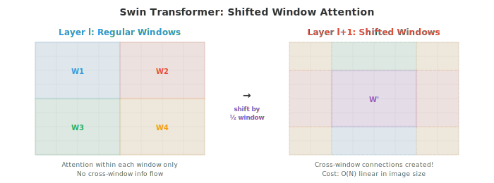
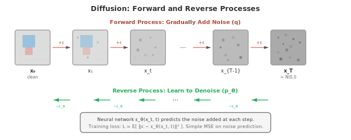

# 视觉 Transformer 与生成

*视觉 Transformer 将自注意力应用于图像块，以数据驱动的空间学习挑战 CNN 的主导地位。本文件涵盖 ViT、DeiT、Swin Transformer、基于 GAN（StyleGAN）、VAE 和扩散模型（DDPM、Stable Diffusion）的图像生成，以及超分辨率和神经风格迁移。*

- CNN（文件 02）内建了强的空间归纳偏置：局部连接性、权重共享和平移等变性。视觉 Transformer（ViT）提出了一个发人深省的问题：如果我们完全放弃这些偏置，仅用第 06 章的 attention 机制让模型从数据中学习空间结构，会怎样？

- **视觉 Transformer**（Vision Transformer，ViT）（Dosovitskiy 等，2021）将标准 Transformer encoder 直接应用于图像。核心思想是将图像视为一个 patch 序列，正如 NLP 将文本视为 token 序列。

- 过程如下：
    1. 将图像（高 $H$，宽 $W$，通道 $C$）切分为大小为 $P \times P$ 的非重叠 patch 网格。这产生 $N = HW / P^2$ 个 patch。
    2. 将每个 patch 展平为长度为 $P^2 \cdot C$ 的向量，通过一个学习到的线性 embedding（一次矩阵乘法，第 02 章）投影到模型维度 $D$。
    3. 在序列前添加一个可学习的 **[CLS] token** embedding（类似 BERT 的 [CLS]，第 07 章）。该 token 对所有 patch 进行 attention，其最终表示用于分类。
    4. 添加**位置 embedding**（每个位置一个可学习向量）以提供空间信息，因为 attention 是置换等变的。
    5. 将 $(N + 1)$ 个 token embedding 的序列通过一个标准 Transformer encoder（多头自注意力 + FFN，第 06 章）。
    6. [CLS] token 的最终表示通过一个分类头（一个小 MLP）。

![ViT 流水线：图像切分为 16x16 patch，每个展平并线性投影，前置 [CLS] token，添加位置 embedding，然后由 Transformer encoder 块处理](../images/vit_pipeline.svg)

- **patch embedding** 等价于一个 kernel 大小为 $P$、步长为 $P$（不重叠）的卷积。ViT 字面上将 2D 图像转换为 1D 序列，然后用与语言相同的架构处理它。

- ViT 的归纳偏置少于 CNN：它不强加局部连接性或平移等变性。这意味着它需要更多训练数据才能从头学习空间结构。在小数据集上，CNN 优于 ViT。但当在非常大的数据集（JFT-300M，3 亿张图像）上训练时，ViT 匹配或超过最好的 CNN，这表明 CNN 的归纳偏置有助于数据效率，但对最终性能而言并非必要。

- ViT 的自注意力在 patch 数量上是 $O(N^2)$ 的。对于 224x224、patch 为 16x16 的图像，$N = 196$，可以承受。但对于更高分辨率图像或更小的 patch，二次方代价变得不可承受。

- **DeiT**（Data-efficient Image Transformer，Touvron 等，2021）表明，仅使用 ImageNet（无需庞大的 JFT 数据集）即可有效训练 ViT，方法是使用强数据增强、正则化（随机深度、标签平滑、dropout）以及**知识蒸馏**：一个预训练的 CNN 教师提供软标签，ViT 学生学习匹配。DeiT 在 [CLS] token 旁增加了一个 **distillation token**，被训练来预测教师的输出。

- **Swin Transformer**（Liu 等，2021）解决了 ViT 的两个主要局限：其随图像尺寸的二次方代价，以及缺乏层次化 feature map（检测和分割所需）。

- Swin 引入了**移位窗口**：不再对所有 patch 进行全局自注意力，而是在局部窗口（例如 7x7 patch）内计算 attention。这使代价对图像尺寸是线性的：$O(N)$ 而非 $O(N^2)$。但仅靠局部窗口会阻碍区域间的信息流动。

- **窗口移位**解决了这个问题：在交替的层中，窗口划分被移动半个窗口大小。这创建了跨窗口连接，使信息在层间能流到图像的所有部分，而无需全局 attention 的代价。



- Swin 还通过跨阶段合并 patch 来构建**层次化表示**。在每个阶段之后，相邻的 2x2 patch 被拼接并投影，使通道维度加倍、空间分辨率减半。这产生了类似于 CNN 和 FPN（文件 03）的多尺度 feature map，使 Swin 能直接与 Faster R-CNN 等检测头和 U-Net 等分割头兼容。

- **PVT**（Pyramid Vision Transformer）采用类似的层次化方法和空间缩减 attention：在每个阶段，在计算 attention 之前对 keys 和 values 进行空间下采样，在保持全局感受野的同时降低二次方代价。

- **自监督视觉学习**从无标注图像中训练表示。标签收集昂贵，但图像丰富。目标是学习能很好地迁移到下游任务的特征，而无需任何人工标注。

- **对比学习**训练模型识别同一图像的两个增强视图（"正对"）应当有相似的表示，而不同图像的视图（"负对"）应当有不相似的表示。

- **SimCLR**（Chen 等，2020）为批次中的每张图像创建两个增强视图，用共享主干 + 投影头编码两者，并应用 **NT-Xent 损失**（归一化温度缩放 cross-entropy）：

$$\ell_{i,j} = -\log \frac{\exp(\text{sim}(z_i, z_j) / \tau)}{\sum_{k \neq i} \exp(\text{sim}(z_i, z_k) / \tau)}$$

- 其中 $\text{sim}$ 是余弦相似度（第 01 章），$\tau$ 是温度参数。分子把正对拉近；分母把负对推开。SimCLR 需要大批量（4096+）以提供足够的负样本。

- **MoCo**（Momentum Contrast，He 等，2020）通过维护一个负 embedding 的**动量更新队列**解决了大批量需求。查询编码器由梯度下降更新；键编码器作为查询编码器的指数移动平均（EMA，第 04 章）更新：$\theta_k \leftarrow m \theta_k + (1 - m) \theta_q$，其中 $m = 0.999$。队列存储最近的键 embedding，提供了大量且一致的负样本集，而无需巨大的批量。

- **BYOL**（Bootstrap Your Own Latent，Grill 等，2020）完全消除了负对。它使用两个网络：一个 "在线" 网络和一个 "目标" 网络（在线网络的 EMA）。在线网络预测目标网络对另一增强视图的表示。没有负样本，BYOL 通过预测头的不对称性和 EMA 目标避免了坍缩问题（模型对所有输入输出相同向量）。

- **DINO**（Self-Distillation with No Labels，Caron 等，2021）将自蒸馏应用于 ViT。学生网络预测教师网络（学生的 EMA）在不同增强视图上的输出。教师使用较大的裁剪；学生使用较小的裁剪。DINO 产生的特征包含关于场景布局的显式信息：DINO 训练的 ViT 的自注意力 map 无需任何分割监督即可自然地分割物体。

- **掩码图像建模**是 BERT 掩码语言建模（第 07 章）的视觉对应物。大部分输入 patch 被掩码，模型学习重建它们。

- **MAE**（Masked Autoencoders，He 等，2022）掩码 75% 的 patch，训练一个 ViT encoder-decoder 重建缺失的像素值。只有未被掩码的 patch 由 encoder 处理（预训练期间节省 4 倍计算），轻量级 decoder 从编码的可见 patch 加上可学习的掩码 token 重建完整图像。

- **BEiT**（BERT Pre-training of Image Transformers，Bao 等，2022）掩码 patch 并预测离散的视觉 token（从预训练的 dVAE 分词器获得）而非原始像素。这类似于 BERT 对离散词 token 的预测，避免了像素重建的低层细节。

- **图像生成**旨在产生训练集中不存在的新颖、逼真的图像。核心挑战是建模自然图像的高维概率分布。

- **生成对抗网络**（Generative Adversarial Networks，GAN）（Goodfellow 等，2014）使用两个相互竞争的网络：一个从随机噪声生成假图像的**生成器** $G$，和一个试图区分真假图像的**判别器** $D$。它们对抗训练：$G$ 试图欺骗 $D$，$D$ 试图抓住 $G$。

$$\min_G \max_D \; \mathbb{E}_{x \sim p_{\text{data}}}[\log D(x)] + \mathbb{E}_{z \sim p(z)}[\log(1 - D(G(z)))]$$

- 生成器取一个随机潜在向量 $z$（从简单分布如高斯采样）并通过一系列转置卷积映射为图像。判别器是一个标准 CNN 分类器。在平衡点，$G$ 产生与真实数据无法区分的图像，$D$ 对所有输入输出 0.5。

- **模式坍缩**是 GAN 的主要失败模式：生成器学会只产生少数能欺骗判别器的图像类型，忽略训练数据的多样性。生成器找到一小撮 "安全" 输出，而非覆盖完整分布。

- 稳定 GAN 训练的技巧包括：谱归一化（约束判别器的 Lipschitz 常数）、渐进式增长（先以低分辨率训练，再逐步提高）、特征匹配（匹配中间判别器特征的统计量而非最终输出）以及使用 Wasserstein 距离代替原始 JS 散度目标。

- **StyleGAN**（Karras 等，2019）是高质量图像合成最具影响力的 GAN 架构。其关键创新是**基于风格的生成器**：不再将潜在向量 $z$ 直接馈入生成器，而是先通过一个**映射网络**（一个 8 层 MLP）映射为风格向量 $w$。该风格向量通过**自适应实例归一化**（adaptive instance normalisation，AdaIN）注入到生成器的每一层，调制 feature map 统计量：

$$\text{AdaIN}(x, y) = y_{s} \cdot \frac{x - \mu(x)}{\sigma(x)} + y_{b}$$

- 其中 $y_s$ 和 $y_b$ 是由 $w$ 导出的尺度和偏置。不同层控制不同方面：浅层控制粗略特征（姿态、脸型），中层控制中等特征（发型、眼睛），深层控制精细细节（雀斑、发质）。StyleGAN 能生成 1024x1024 分辨率的光照真实人脸。

- **变分自编码器**（Variational Autoencoders，VAE）（第 06 章）提供了另一种生成方法。与 GAN 不同，VAE 有原则性的概率框架和明确的训练目标（ELBO）。它们产生的图像通常比 GAN 更模糊，但提供了更平滑、更有结构的潜在空间。VAE 是潜在扩散模型中用于在图像与潜在空间之间压缩的 encoder-decoder 对。

- **扩散模型**已成为图像生成的主导范式，在质量和多样性上都超过了 GAN。其概念上很简单：逐步向数据添加噪声，直到变成纯高斯噪声（**前向过程**），然后学习逐步逆转这一过程（**反向过程**）。

- **前向过程**在 $T$ 个时间步上添加高斯噪声：

$$q(x_t | x_{t-1}) = \mathcal{N}(x_t; \sqrt{1 - \beta_t} \, x_{t-1}, \beta_t I)$$

- 其中 $\beta_t$ 是随时间递增的噪声调度。经过足够步数后，无论原始图像 $x_0$ 是什么，$x_T$ 都近似为纯高斯噪声。使用重参数化技巧（第 06 章）并设 $\alpha_t = 1 - \beta_t$，$\bar{\alpha}_t = \prod_{s=1}^{t} \alpha_s$，可以直接从 $x_0$ 采样 $x_t$：

$$x_t = \sqrt{\bar{\alpha}_t} \, x_0 + \sqrt{1 - \bar{\alpha}_t} \, \epsilon, \quad \epsilon \sim \mathcal{N}(0, I)$$

- **反向过程**学习去噪：从纯噪声 $x_T$ 出发，模型预测每一步添加的噪声 $\epsilon$ 并减去以恢复 $x_{t-1}$。这由神经网络 $\epsilon_\theta$ 参数化（通常是文件 03 的 U-Net），用一个简单的 MSE 损失训练：

$$\mathcal{L} = \mathbb{E}_{t, x_0, \epsilon}\left[\|\epsilon - \epsilon_\theta(x_t, t)\|^2\right]$$



- **DDPM**（Denoising Diffusion Probabilistic Models，Ho 等，2020）确立了这个框架。采样需要遍历所有 $T$ 步（通常 1000），速度慢。**DDIM**（Denoising Diffusion Implicit Models，Song 等，2021）将采样过程重新表述为确定性映射，允许大步跳过（例如 50 步代替 1000 步）且几乎无质量损失。

- **基于分数的模型**（Song 和 Ermon，2019）提供了另一种视角。模型不预测噪声 $\epsilon$，而是估计**分数函数** $\nabla_{x_t} \log p(x_t)$，即对数概率对含噪图像的梯度。该梯度指向数据分布中概率更高（更干净）的区域。采样沿此梯度用 Langevin 动力学进行。基于分数的模型和 DDPM 在**随机微分方程**（stochastic differential equations，SDE）的框架下得到统一：前向过程是添加噪声的 SDE，反向过程是时间逆转的 SDE。

- **无分类器引导**（classifier-free guidance）（Ho 和 Salimans，2022）控制样本质量与多样性之间的权衡。模型既有条件训练（带文本提示或类别标签），也无条件训练（条件随机丢弃）。采样时，预测是加权组合：

$$\hat{\epsilon} = \epsilon_\theta(x_t, \varnothing) + s \cdot (\epsilon_\theta(x_t, c) - \epsilon_\theta(x_t, \varnothing))$$

- 其中 $c$ 是条件，$\varnothing$ 是空条件，$s > 1$ 是引导尺度。$s$ 越大，产生的图像越强地匹配条件，但多样性越低。$s = 1$ 给出未引导模型；$s = 7.5$ 是常用默认值。

- **潜在扩散**（latent diffusion）（Rombach 等，2022；Stable Diffusion）将扩散过程从像素空间转移到学习到的潜在空间。预训练的 VAE encoder 将图像压缩到更低维的潜在表示（通常是 4 倍或 8 倍空间下采样），扩散在该压缩空间中进行，VAE decoder 从去噪的潜在表示重建像素。这效率大幅提升：在像素空间扩散 512x512 图像意味着处理 $512 \times 512 \times 3$ 的张量，而在潜在空间只有 $64 \times 64 \times 4$ 的张量。

- 潜在扩散中的去噪 U-Net 接收含噪潜在表示、时间步（编码为正弦 embedding，类似于 transformer 中的位置编码）以及条件信号（来自冻结的 CLIP 或 T5 文本编码器的文本 embedding）。文本条件通过 U-Net 内的 cross-attention 层进入：文本 embedding 作为 keys 和 values，图像特征作为 queries。这使模型能在每个空间位置对文本提示的相关部分进行 attention。

- **Flow matching** 是扩散的一种新兴替代方案，它学习噪声与数据之间的直接传输路径，而非 DDPM 的迭代去噪。

- **连续归一化流**（continuous normalising flow，CNF）定义了一个与时间相关的速度场 $v_\theta(x, t)$，将样本从简单分布 $p_0$（噪声）沿平滑轨迹推到数据分布 $p_1$。该变换遵循一个常微分方程（ODE）：

$$\frac{dx}{dt} = v_\theta(x, t), \quad t \in [0, 1]$$

- 从 $x_0 \sim \mathcal{N}(0, I)$ 出发，将 ODE 向前积分到 $t = 1$，产生来自数据分布的样本。速度场由神经网络参数化，并被训练以匹配一个目标条件流。

- **最优传输**（Optimal Transport，OT）flow matching（Lipman 等，2023）使用噪声与数据之间的直线作为目标流：从噪声样本 $x_0$ 到数据样本 $x_1$ 的条件路径简单地为 $x_t = (1 - t) x_0 + t x_1$，目标速度为 $v = x_1 - x_0$。训练损失变为：

$$\mathcal{L} = \mathbb{E}_{t, x_0, x_1} \left[\|v_\theta(x_t, t) - (x_1 - x_0)\|^2\right]$$

- **整流流**（rectified flows）（Liu 等，2022）迭代地拉直学到的流路径。在初始训练遍历后，模型通过模拟 ODE 生成（噪声，数据）对。这些对相比随机配对更紧密对齐，用于重新训练模型。重复此过程会得到越来越直的路径，可用更少的 ODE 步（甚至单步）穿越，实现极快生成。

- Flow matching 相对扩散有几个优势：训练目标更简单（直接的速度回归，无噪声调度），采样 ODE 更平滑（需要更少的积分步），且与最优传输的联系提供了理论基础。Stable Diffusion 3 和 Flux 使用 flow matching 而非传统 DDPM。

## 编码任务（使用 CoLab 或 notebook）

1. 从零开始实现 ViT 的 patch embedding。将图像切分为 patch，展平，投影到模型维度，添加位置 embedding，并前置 [CLS] token。
```python
import jax
import jax.numpy as jnp
import matplotlib.pyplot as plt

def create_patch_embedding(image, patch_size, d_model, params):
    """Convert an image into a sequence of patch embeddings."""
    H, W, C = image.shape
    n_patches_h = H // patch_size
    n_patches_w = W // patch_size
    n_patches = n_patches_h * n_patches_w

    # Extract patches
    patches = []
    for i in range(n_patches_h):
        for j in range(n_patches_w):
            patch = image[i*patch_size:(i+1)*patch_size,
                          j*patch_size:(j+1)*patch_size, :]
            patches.append(patch.ravel())
    patches = jnp.stack(patches)  # (N, P*P*C)

    # Linear projection to d_model
    embeddings = patches @ params['proj_w'] + params['proj_b']  # (N, d_model)

    # Prepend CLS token
    cls_token = params['cls_token']  # (1, d_model)
    embeddings = jnp.concatenate([cls_token, embeddings], axis=0)  # (N+1, d_model)

    # Add position embeddings
    embeddings = embeddings + params['pos_embed']  # (N+1, d_model)

    return embeddings, patches

# Setup
H, W, C = 32, 32, 3
patch_size = 8
d_model = 64
n_patches = (H // patch_size) * (W // patch_size)  # 16

key = jax.random.PRNGKey(42)
keys = jax.random.split(key, 5)

# Create a synthetic image with distinct quadrants
image = jnp.zeros((H, W, C))
image = image.at[:16, :16, 0].set(1.0)   # red top-left
image = image.at[:16, 16:, 1].set(1.0)   # green top-right
image = image.at[16:, :16, 2].set(1.0)   # blue bottom-left
image = image.at[16:, 16:, :2].set(1.0)  # yellow bottom-right

params = {
    'proj_w': jax.random.normal(keys[0], (patch_size**2 * C, d_model)) * 0.02,
    'proj_b': jnp.zeros(d_model),
    'cls_token': jax.random.normal(keys[1], (1, d_model)) * 0.02,
    'pos_embed': jax.random.normal(keys[2], (n_patches + 1, d_model)) * 0.02,
}

embeddings, patches = create_patch_embedding(image, patch_size, d_model, params)

print(f"Image shape: {image.shape}")
print(f"Patch size: {patch_size}x{patch_size}")
print(f"Number of patches: {n_patches}")
print(f"Patch vector length: {patch_size**2 * C}")
print(f"Embedding shape: {embeddings.shape}  (CLS + {n_patches} patches)")

# Visualise patches
fig, axes = plt.subplots(2, 5, figsize=(14, 6))
axes[0, 0].imshow(image); axes[0, 0].set_title('Full Image'); axes[0, 0].axis('off')
for idx in range(min(9, n_patches)):
    ax = axes[(idx+1) // 5, (idx+1) % 5]
    patch_img = patches[idx].reshape(patch_size, patch_size, C)
    ax.imshow(patch_img); ax.set_title(f'Patch {idx}'); ax.axis('off')
plt.suptitle('ViT Patch Decomposition')
plt.tight_layout(); plt.show()
```

2. 实现一个简单的 GAN 训练循环。在 2D 数据上训练生成器和判别器，并可视化生成的分布收敛到真实分布。
```python
import jax
import jax.numpy as jnp
import matplotlib.pyplot as plt

def generator(z, params):
    h = jnp.tanh(z @ params['g_w1'] + params['g_b1'])
    h = jnp.tanh(h @ params['g_w2'] + params['g_b2'])
    return h @ params['g_w3'] + params['g_b3']

def discriminator(x, params):
    h = jax.nn.leaky_relu(x @ params['d_w1'] + params['d_b1'], 0.2)
    h = jax.nn.leaky_relu(h @ params['d_w2'] + params['d_b2'], 0.2)
    return jax.nn.sigmoid(h @ params['d_w3'] + params['d_b3'])

def init_params(key):
    keys = jax.random.split(key, 6)
    z_dim, h_dim, data_dim = 2, 32, 2
    scale = 0.1
    return {
        'g_w1': jax.random.normal(keys[0], (z_dim, h_dim)) * scale,
        'g_b1': jnp.zeros(h_dim),
        'g_w2': jax.random.normal(keys[1], (h_dim, h_dim)) * scale,
        'g_b2': jnp.zeros(h_dim),
        'g_w3': jax.random.normal(keys[2], (h_dim, data_dim)) * scale,
        'g_b3': jnp.zeros(data_dim),
        'd_w1': jax.random.normal(keys[3], (data_dim, h_dim)) * scale,
        'd_b1': jnp.zeros(h_dim),
        'd_w2': jax.random.normal(keys[4], (h_dim, h_dim)) * scale,
        'd_b2': jnp.zeros(h_dim),
        'd_w3': jax.random.normal(keys[5], (h_dim, 1)) * scale,
        'd_b3': jnp.zeros(1),
    }

def d_loss(params, real_data, fake_data):
    real_score = discriminator(real_data, params)
    fake_score = discriminator(fake_data, params)
    return -jnp.mean(jnp.log(real_score + 1e-7) + jnp.log(1 - fake_score + 1e-7))

def g_loss(params, fake_data):
    fake_score = discriminator(fake_data, params)
    return -jnp.mean(jnp.log(fake_score + 1e-7))

# Real data: ring distribution
key = jax.random.PRNGKey(42)
theta = jax.random.uniform(key, (512,)) * 2 * jnp.pi
real_data = jnp.stack([jnp.cos(theta), jnp.sin(theta)], axis=1)
real_data = real_data + jax.random.normal(key, real_data.shape) * 0.05

params = init_params(jax.random.PRNGKey(0))
d_grad = jax.grad(d_loss)
g_grad = jax.grad(g_loss)
lr = 0.001

snapshots = []
for step in range(3000):
    key, k1 = jax.random.split(key)
    z = jax.random.normal(k1, (512, 2))
    fake_data = generator(z, params)

    # Update discriminator
    grads = d_grad(params, real_data, fake_data)
    for k in ['d_w1', 'd_b1', 'd_w2', 'd_b2', 'd_w3', 'd_b3']:
        params[k] = params[k] - lr * grads[k]

    # Update generator
    fake_data = generator(z, params)
    grads = g_grad(params, fake_data)
    for k in ['g_w1', 'g_b1', 'g_w2', 'g_b2', 'g_w3', 'g_b3']:
        params[k] = params[k] - lr * grads[k]

    if step in [0, 500, 1500, 2999]:
        snapshots.append((step, fake_data.copy()))

fig, axes = plt.subplots(1, 4, figsize=(16, 4))
for ax, (step, fake) in zip(axes, snapshots):
    ax.scatter(real_data[:, 0], real_data[:, 1], s=5, alpha=0.3, c='#3498db', label='Real')
    ax.scatter(fake[:, 0], fake[:, 1], s=5, alpha=0.3, c='#e74c3c', label='Generated')
    ax.set_title(f'Step {step}'); ax.set_xlim(-2, 2); ax.set_ylim(-2, 2)
    ax.set_aspect('equal'); ax.legend(markerscale=3)
plt.suptitle('GAN Training: Generator Learns the Ring Distribution')
plt.tight_layout(); plt.show()
```

3. 实现扩散前向过程：在递增的时间步上向图像添加噪声并可视化渐进破坏。然后实现单步去噪。
```python
import jax
import jax.numpy as jnp
import matplotlib.pyplot as plt

def noise_schedule(T, beta_start=0.0001, beta_end=0.02):
    """Linear noise schedule."""
    betas = jnp.linspace(beta_start, beta_end, T)
    alphas = 1.0 - betas
    alpha_bars = jnp.cumprod(alphas)
    return betas, alphas, alpha_bars

def forward_diffusion(x0, t, alpha_bars, key):
    """Add noise to x0 at timestep t."""
    alpha_bar_t = alpha_bars[t]
    noise = jax.random.normal(key, x0.shape)
    xt = jnp.sqrt(alpha_bar_t) * x0 + jnp.sqrt(1 - alpha_bar_t) * noise
    return xt, noise

# Create a simple 2D "image" (checkerboard)
img = jnp.zeros((32, 32))
for i in range(4):
    for j in range(4):
        if (i + j) % 2 == 0:
            img = img.at[i*8:(i+1)*8, j*8:(j+1)*8].set(1.0)

T = 1000
betas, alphas, alpha_bars = noise_schedule(T)

# Visualise forward process
timesteps = [0, 50, 200, 500, 999]
key = jax.random.PRNGKey(42)

fig, axes = plt.subplots(1, len(timesteps), figsize=(16, 3.5))
for ax, t in zip(axes, timesteps):
    key, subkey = jax.random.split(key)
    xt, noise = forward_diffusion(img, t, alpha_bars, subkey)
    ax.imshow(xt, cmap='gray', vmin=-2, vmax=2)
    ax.set_title(f't={t}\n$\\bar{{\\alpha}}$={alpha_bars[t]:.3f}')
    ax.axis('off')
plt.suptitle('Diffusion Forward Process: Progressive Noise Addition')
plt.tight_layout(); plt.show()

# Simple denoising: train a tiny network to predict noise at t=200
t_denoise = 200
key, k1 = jax.random.split(key)
xt, true_noise = forward_diffusion(img, t_denoise, alpha_bars, k1)

# Tiny "denoiser": just learn a constant noise estimate (for illustration)
noise_estimate = jnp.zeros_like(img)
lr = 0.01
for step in range(100):
    residual = noise_estimate - true_noise
    noise_estimate = noise_estimate - lr * residual

# Reverse one step
alpha_bar_t = alpha_bars[t_denoise]
x_denoised = (xt - jnp.sqrt(1 - alpha_bar_t) * noise_estimate) / jnp.sqrt(alpha_bar_t)

fig, axes = plt.subplots(1, 3, figsize=(12, 4))
axes[0].imshow(img, cmap='gray'); axes[0].set_title('Original $x_0$'); axes[0].axis('off')
axes[1].imshow(xt, cmap='gray', vmin=-2, vmax=2)
axes[1].set_title(f'Noisy $x_{{200}}$'); axes[1].axis('off')
axes[2].imshow(x_denoised, cmap='gray')
axes[2].set_title('Denoised (one step)'); axes[2].axis('off')
plt.tight_layout(); plt.show()

mse = jnp.mean((x_denoised - img)**2)
print(f"Denoising MSE: {mse:.4f}")
```
