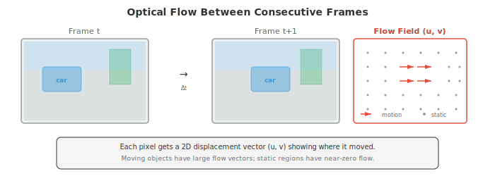

# 视频与 3D 视觉

*视频与 3D 视觉将图像理解扩展到时间和空间域。本文件涵盖光流、视频分类（3D CNN、TimeSformer）、目标跟踪（SORT、DeepSORT）、动作识别、深度估计（单目和立体）、点云、NeRF 和 3D 高斯泼溅。*

- 文件 01-04 将图像视为孤立的快照。但视觉世界是连续的：物体移动、场景变化、深度存在。本文件将计算机视觉扩展到时间域（视频）和空间域（3D），涵盖模型如何理解运动、跟踪物体、估计深度和重建场景。

- **视频**是随时间采集的图像（帧）序列。在每秒 30 帧下，10 秒的片段包含 300 帧。关键挑战是建模**时间维度**：物体如何运动、场景如何演化、如何跨帧关联信息？

- **光流**估计两帧连续帧之间像素的表观运动。对于第 $t$ 帧中的每个像素，光流产生一个 2D 位移向量 $(u, v)$，指向该像素在第 $t+1$ 帧中移动到的位置。结果是与图像同样大小的密集运动场。



- 光流在**亮度恒常假设**下计算：像素移动时其强度不变。如果第 $t$ 帧中位置 $(x, y)$ 的像素强度为 $I(x, y, t)$，并在小时间间隔 $\delta t$ 内移动 $(u, v)$：

$$I(x + u\delta t, \, y + v\delta t, \, t + \delta t) = I(x, y, t)$$

- 取一阶泰勒展开（第 03 章）并除以 $\delta t$：

$$I_x u + I_y v + I_t = 0$$

- 其中 $I_x, I_y$ 是空间梯度（Sobel，文件 01），$I_t$ 是时间梯度（连续帧之差）。这就是**光流约束方程**。一个方程，两个未知数（$u, v$）：我们需要额外的约束。

- **Lucas-Kanade** 假设流在小窗口（例如 5x5 像素）内是常数。这给出一个超定方程组（25 个方程，2 个未知数），用最小二乘求解（第 06 章的法方程）：

```math
\begin{bmatrix} u \\ v \end{bmatrix} = \begin{bmatrix} \sum I_x^2 & \sum I_x I_y \\ \sum I_x I_y & \sum I_y^2 \end{bmatrix}^{-1} \begin{bmatrix} -\sum I_x I_t \\ -\sum I_y I_t \end{bmatrix}
```

- 这个 2x2 矩阵是文件 01 的结构张量（与 Harris 角点检测中使用的同一矩阵）。Lucas-Kanade 对小运动效果良好，但当物体在帧间移动超过几个像素时会失效。

- **Farneback 方法**对每个像素的邻域拟合一个多项式展开，估计最能解释帧间变化的位移场。它产生密集流（每个像素一个向量），并能处理比 Lucas-Kanade 更大的运动。

- 现代**深度学习光流**方法（FlowNet、RAFT）从成对帧端到端地学习预测光流。**RAFT**（Recurrent All-Pairs Field Transforms，Teed 和 Deng，2020）在两帧中所有像素对之间计算 4D 相关体，并使用基于 GRU 的更新算子迭代地精化流估计。RAFT 达到了最先进的精度，并已成为标准的光流主干。

- **双流网络**（Simonyan 和 Zisserman，2014）是视频理解的早期方法。一个流处理单张 RGB 帧（外观），另一个流处理一组光流帧（运动）。两流在最后融合（通过平均或拼接）。该架构明确分离了 "事物看起来怎样" 和 "它们如何运动"。

- **3D 卷积网络**将 2D 卷积扩展到时间维度。3D 卷积应用一个大小为 $k \times k \times k_t$ 的滤波器，跨越空间和时间维度，直接学习时空特征。

- **C3D**（Tran 等，2015）堆叠 3x3x3 滤波器的 3D 卷积，表明时间卷积无需显式光流即可学习运动特征。代价高昂：3D 卷积的参数和计算比其 2D 对应物多 $k_t$ 倍。

- **I3D**（Inflated 3D，Carreira 和 Zisserman，2017）采取了更实用的方法：从预训练的 2D CNN（如 Inception 或 ResNet）出发，沿时间维度重复权重并除以 $k_t$，将所有 2D 滤波器 "膨胀" 为 3D。这把 ImageNet 预训练迁移到视频，同时添加时间建模。2D 的 $k \times k$ 滤波器变为 $k \times k \times k_t$ 滤波器，初始化为 $W_{\text{3D}}[:,:,j] = W_{\text{2D}} / k_t$，对所有时间位置 $j$。

- **SlowFast 网络**（Feichtenhofer 等，2019）使用两条在不同时间分辨率上操作的并行通路：
    - **慢通路**以低帧率（例如每 16 帧取一帧）处理帧，具有高空间分辨率和众多通道，捕获精细空间细节。
    - **快通路**以高帧率（每 2 帧取一帧）处理帧，降低空间分辨率并减少通道（通常是慢通路的 $1/8$），捕获快速时间变化。
    - 横向连接通过带步长的卷积将快通路的信息融合到慢通路。

- 其洞见是空间和时间信息有不同的带宽需求：物体外观变化缓慢，但运动可能很快。SlowFast 通过设计匹配这种不对称性。

- **TimeSformer**（Bertasius 等，2021）将视觉 Transformer 应用于视频。它将完整的时空 attention（代价会高得不可承受：对 $T$ 帧和每帧 $N$ 个 patch 为 $O((T \times N)^2)$）分解为**分离式 attention**：每个块在时间 attention（每个 patch 在相同空间位置跨时间进行 attention）和空间 attention（每个 patch 在同一帧内跨空间进行 attention）之间交替。这把代价从 $O(T^2 N^2)$ 降到 $O(T^2 + N^2)$。

- **VideoMAE**（Tong 等，2022）将掩码自编码器思想（文件 04）扩展到视频。使用极高的掩码率（90-95%），因为视频具有高时间冗余：相邻帧看起来几乎相同，所以掩码大部分 patch 仍留下足够信息用于重建。VideoMAE 在无标注视频上预训练 ViT 主干并迁移到下游任务。

- **动作识别**将视频片段分类为众多动作类别之一（例如 "跑步"、"做饭"、"弹吉他"）。它是图像分类的视频对应物。标准基准包括 Kinetics-400（400 个动作类，约 30 万片段）、Something-Something（174 个需要时间推理的细粒度动作）和 ActivityNet（200 个类，含长的未裁剪视频）。

- **时序动作检测**超越分类：给定一段长的未裁剪视频，找出每个动作的开始时间、结束时间和类别。这是目标检测的时间对应物。如 ActionFormer 等方法使用 Transformer 处理时间特征并预测动作边界。

- **视频目标跟踪**在一个物体在第一帧中被识别后，跨帧跟踪该特定物体。

- **SORT**（Simple Online and Realtime Tracking，Bewley 等，2016）将一个检测模型（在每帧中独立检测物体）与用于运动预测的**卡尔曼滤波器**和用于分配的**匈牙利算法**相结合。

- **卡尔曼滤波器**为每个被跟踪物体维护一个状态估计（位置、速度、大小），并用线性运动模型预测它在下一帧中的位置。当新检测到来时，卡尔曼滤波器结合预测与观测（按各自的不确定性加权）更新其估计。这是第 05 章的贝叶斯更新应用于跟踪。

- **匈牙利算法**求解双线性分配问题：给定 $M$ 个被跟踪物体和 $N$ 个新检测，找到使总成本最小（使用文件 03 的 IoU 距离）的最优一对一匹配。未匹配的检测启动新轨迹；未匹配的轨迹在宽限期内后被终止。

- **DeepSORT** 通过增加**深度外观特征**扩展 SORT：每个检测到的物体通过一个小型 CNN 产生一个外观 embedding（一个描述符向量）。匹配成本将 IoU 距离与 embedding 空间中的余弦距离（第 01 章）结合。这处理了遮挡和重识别：即使一个物体被另一个物体挡住数帧，其外观 embedding 也允许在它重新出现时重新匹配。

- **ByteTrack**（Zhang 等，2022）通过使用每个检测来改进跟踪，包括低置信度的检测。大多数跟踪器丢弃低于置信度阈值的检测。ByteTrack 先将高置信度检测匹配到现有轨迹，再将剩余低置信度检测匹配到未匹配的轨迹。这恢复了被暂时遮挡或模糊（因此检测置信度低）的物体。

- **3D 视觉**恢复在 2D 图像投影中丢失的第三空间维度（文件 01）。

- **深度估计**预测从相机到场景中每个点的距离。

- **立体深度**使用两个相隔已知基线 $b$ 的相机。同一点在左右图像中出现在不同的水平位置上（这一偏移称为**视差** $d$）。深度与视差成反比：

$$Z = \frac{f \cdot b}{d}$$

- 其中 $f$ 是焦距，$b$ 是基线距离。计算视差需要在两幅图像之间找到对应点（立体匹配），这是沿水平扫描线的一维搜索（因为相机是水平对准的，3D 中同一高度的点在两幅图像中投影到同一行）。

- **单目深度估计**从单张图像预测深度，这在根本上是病态的（无穷多个 3D 场景可产生同一 2D 图像）。然而人类利用相对大小、纹理梯度、遮挡和大气雾霭等线索毫不费力地做到。深度网络从训练数据中学习这些线索。

- 如 **MiDaS** 和 **Depth Anything** 等模型从单张图像预测相对深度图（排序哪些物体更近）。它们在多种数据集上以尺度不变损失训练，尽管理论上有歧义，仍产生相当精确的结果。

- **点云**是 3D 点 $(x, y, z)$ 的集合，可选地带颜色或其他属性，由 LiDAR 传感器或立体重建捕获。与图像不同，点云是无序且不规则分布的。

- **PointNet**（Qi 等，2017）通过独立地对每个点应用共享 MLP 处理点云，然后用最大池化聚合（最大池化是置换不变的，解决了排序问题）。**PointNet++** 增加了层次化分组，以在多尺度下捕获局部结构。

- **神经辐射场**（Neural Radiance Fields，NeRF）（Mildenhall 等，2020）将 3D 场景表示为一个连续函数，将 3D 位置 $(x, y, z)$ 和观察方向 $(\theta, \phi)$ 映射为颜色 $(r, g, b)$ 和密度 $\sigma$。该函数由一个 MLP 参数化：

$$F_\theta: (x, y, z, \theta, \phi) \to (r, g, b, \sigma)$$

- 要渲染一个像素，从相机通过该像素向场景投射一条光线。沿光线采样点，MLP 在每个点预测颜色和密度。像素颜色通过**体渲染**计算：沿光线对按密度加权的颜色积分：

$$C(\mathbf{r}) = \int_{t_n}^{t_f} T(t) \cdot \sigma(\mathbf{r}(t)) \cdot \mathbf{c}(\mathbf{r}(t), \mathbf{d}) \, dt$$

- 其中 $T(t) = \exp(-\int_{t_n}^{t} \sigma(\mathbf{r}(s)) \, ds)$ 是累积透射率（到目前为止已被吸收了多少光）。在实践中，该积分通过沿光线采样 $N$ 个点并求和来近似：

$$\hat{C} = \sum_{i=1}^{N} T_i \cdot (1 - \exp(-\sigma_i \delta_i)) \cdot c_i$$

- NeRF 通过最小化渲染像素与一组已标定照片的真实像素之间的 MSE 来训练。训练后，NeRF 可从任何相机位置渲染光照真实的新视角。其局限是速度：渲染需要对 MLP 求值数百万次（每个像素每个采样点一次），使实时渲染困难。

- **3D 高斯泼溅**（3D Gaussian Splatting，Kerbl 等，2023）通过将场景表示为 3D 高斯基元的集合而非连续的体积函数，解决了 NeRF 的速度局限。每个高斯基元具有 3D 位置（均值）、3D 协方差矩阵（控制形状和朝向）、不透明度和颜色（表示为球谐函数以实现视角相关效果）。

- 渲染将每个 3D 高斯投影到图像平面上（产生一个 2D 高斯 "泼溅"），按深度排序，并使用 alpha 混合从前到后合成。这是一种在 GPU 上实时运行（100+ FPS）的光栅化过程，比 NeRF 的光线行进快数量级。高斯泼溅在实现实时渲染的同时匹配或超过 NeRF 质量。

- **SLAM**（Simultaneous Localisation and Mapping，同时定位与建图）是在未知环境中构建地图并同时跟踪相机在其中位置的问题。它对机器人、自动驾驶和 AR 至关重要。

- **视觉里程计**通过跨图像跟踪特征来逐帧估计相机运动。特征点（文件 01 的 SIFT、ORB）在连续帧之间匹配，并从对应关系中使用**本质矩阵**（编码两个视图之间的几何关系，由文件 01 的内参和外参推导而来）估计相机的旋转和平移。

- **基于特征的 SLAM** 通过维护持久地图来扩展视觉里程计。**ORB-SLAM**（Mur-Artal 等，2015）是使用最广泛的基于特征的 SLAM 系统。它有三个并行线程：
    1. **跟踪**：将每帧新 ORB 特征与地图匹配，用 PnP（Perspective-n-Point）和 RANSAC 估计相机位姿
    2. **局部建图**：从匹配特征三角化新地图点，使用光束法平差优化它们的位置（最小化所有看到每个点的视图上的重投影误差）
    3. **回环检测**：检测相机何时重访先前已建图的区域（使用视觉词袋），然后通过全局优化地图来校正累积漂移

- **LiDAR SLAM** 使用来自 LiDAR 传感器的 3D 点云代替（或补充）相机图像。LiDAR 提供直接的深度测量，使几何估计更鲁棒，但硬件成本更高。如 LOAM（LiDAR Odometry and Mapping）等方法使用迭代最近点（ICP）配准在连续扫描之间对齐点云。

- **视觉-惯性 SLAM** 融合相机数据与来自 IMU（加速度计 + 陀螺仪）的测量。IMU 提供高频的旋转和加速度估计，填补相机帧之间的空隙，并处理快速运动或暂时的视觉特征丢失。

- **VR/AR** 应用是计算机视觉最严苛的消费者之一。

- **姿态估计**从图像确定人体（或人脸或手）的位置和朝向。**身体姿态**通常表示为一组 2D 或 3D 关键点位置（关节：肩、肘、腕、髋、膝、踝）。如 **OpenPose** 和 **MediaPipe** 等模型使用热图回归预测这些关键点：对每个关节，模型输出一张热图，其中峰值指示关节位置。

- **自顶向下**方法先用边界框检测器检测人（文件 03），再在每个框内估计姿态。**自底向上**方法先检测图像中所有关键点，再使用部分亲和域（编码相连关节之间关联的向量场）将它们分组成个体。

- **场景重建**从传感器数据构建环境的 3D 模型。在 AR 中，这使虚拟物体能放在真实表面上、被真实物体遮挡，并投射虚拟阴影。实时场景重建方法（如 ARKit 和 ARCore 中基于深度传感器的系统）构建随用户移动而更新的环境稀疏网格。

- VR 中的**实时渲染**约束极其严苛：双眼需要各自以 90+ FPS 渲染（以避免眩晕），头部运动到显示更新的延迟低于 20 毫秒。如**注视点渲染**（仅在高分辨率下渲染用户正在注视的位置，使用眼动追踪）和**重投影**（基于新头部位姿扭曲前一帧以填补下一帧渲染时的空隙）等技术对满足这些约束至关重要。

- 实时神经渲染（3D 高斯泼溅）、鲁棒跟踪（视觉-惯性 SLAM）和高效姿态估计的融合，正使光照真实、交互式的 AR/VR 体验日益可行。

## 编码任务（使用 CoLab 或 notebook）

1. 从零开始实现 Lucas-Kanade 光流算法。在两个合成的、其中一个方块向右移动的帧之间计算光流。
```python
import jax.numpy as jnp
import matplotlib.pyplot as plt

def lucas_kanade(frame1, frame2, window_size=5):
    """Lucas-Kanade optical flow."""
    # Compute gradients
    Ix = jnp.zeros_like(frame1)
    Iy = jnp.zeros_like(frame1)
    It = frame2 - frame1

    # Sobel-like gradients
    Ix = Ix.at[1:-1, :].set((frame1[2:, :] - frame1[:-2, :]) / 2)
    Iy = Iy.at[:, 1:-1].set((frame1[:, 2:] - frame1[:, :-2]) / 2)

    H, W = frame1.shape
    half_w = window_size // 2
    u = jnp.zeros_like(frame1)
    v = jnp.zeros_like(frame1)

    for i in range(half_w, H - half_w):
        for j in range(half_w, W - half_w):
            Ix_win = Ix[i-half_w:i+half_w+1, j-half_w:j+half_w+1].ravel()
            Iy_win = Iy[i-half_w:i+half_w+1, j-half_w:j+half_w+1].ravel()
            It_win = It[i-half_w:i+half_w+1, j-half_w:j+half_w+1].ravel()

            A = jnp.stack([Ix_win, Iy_win], axis=1)
            ATA = A.T @ A
            ATb = -A.T @ It_win

            # Check if the system is well-conditioned
            det = ATA[0,0] * ATA[1,1] - ATA[0,1] * ATA[1,0]
            if jnp.abs(det) > 1e-6:
                flow = jnp.linalg.solve(ATA, ATb)
                u = u.at[i, j].set(flow[0])
                v = v.at[i, j].set(flow[1])

    return u, v

# Create two frames: a white square that moves right
frame1 = jnp.zeros((64, 64))
frame1 = frame1.at[20:40, 15:35].set(1.0)

frame2 = jnp.zeros((64, 64))
frame2 = frame2.at[20:40, 20:40].set(1.0)  # shifted 5 pixels right

u, v = lucas_kanade(frame1, frame2, window_size=7)

# Visualise
fig, axes = plt.subplots(1, 3, figsize=(14, 4))
axes[0].imshow(frame1, cmap='gray'); axes[0].set_title('Frame 1'); axes[0].axis('off')
axes[1].imshow(frame2, cmap='gray'); axes[1].set_title('Frame 2'); axes[1].axis('off')

# Quiver plot of flow (subsample for clarity)
step = 4
Y, X = jnp.mgrid[0:64:step, 0:64:step]
axes[2].imshow(frame1, cmap='gray', alpha=0.5)
axes[2].quiver(X, Y, u[::step, ::step], v[::step, ::step],
               color='#e74c3c', scale=50, width=0.005)
axes[2].set_title('Optical Flow'); axes[2].axis('off')

plt.tight_layout(); plt.show()

# Check average flow in the moving region
region_u = u[20:40, 15:35]
print(f"Average horizontal flow in object region: {region_u[region_u != 0].mean():.2f} pixels")
```

2. 实现一个简单的用于 2D 目标跟踪的卡尔曼滤波器。模拟一条带噪轨迹，展示卡尔曼滤波器如何平滑估计。
```python
import jax
import jax.numpy as jnp
import matplotlib.pyplot as plt

def kalman_predict(x, P, F, Q):
    """Kalman filter prediction step."""
    x_pred = F @ x
    P_pred = F @ P @ F.T + Q
    return x_pred, P_pred

def kalman_update(x_pred, P_pred, z, H, R):
    """Kalman filter update step."""
    y = z - H @ x_pred                        # innovation
    S = H @ P_pred @ H.T + R                  # innovation covariance
    K = P_pred @ H.T @ jnp.linalg.inv(S)      # Kalman gain
    x_updated = x_pred + K @ y
    P_updated = (jnp.eye(len(x_pred)) - K @ H) @ P_pred
    return x_updated, P_updated

# State: [x, y, vx, vy]
dt = 1.0
F = jnp.array([[1, 0, dt, 0],    # state transition
                [0, 1, 0, dt],
                [0, 0, 1, 0],
                [0, 0, 0, 1]])
H = jnp.array([[1, 0, 0, 0],     # observation: we measure x, y
                [0, 1, 0, 0]])
Q = jnp.eye(4) * 0.01            # process noise
R = jnp.eye(2) * 4.0             # measurement noise (noisy detector)

# Simulate ground truth: circular motion
n_steps = 50
t = jnp.linspace(0, 2 * jnp.pi, n_steps)
true_x = 10 * jnp.cos(t) + 20
true_y = 10 * jnp.sin(t) + 20

# Noisy observations
key = jax.random.PRNGKey(42)
noise = jax.random.normal(key, (n_steps, 2)) * 2.0
obs_x = true_x + noise[:, 0]
obs_y = true_y + noise[:, 1]

# Run Kalman filter
x = jnp.array([obs_x[0], obs_y[0], 0.0, 0.0])  # initial state
P = jnp.eye(4) * 10.0                             # initial uncertainty

kalman_x, kalman_y = [], []
for i in range(n_steps):
    x, P = kalman_predict(x, P, F, Q)
    z = jnp.array([obs_x[i], obs_y[i]])
    x, P = kalman_update(x, P, z, H, R)
    kalman_x.append(x[0])
    kalman_y.append(x[1])

kalman_x = jnp.array(kalman_x)
kalman_y = jnp.array(kalman_y)

# Visualise
plt.figure(figsize=(8, 8))
plt.plot(true_x, true_y, 'k-', linewidth=2, label='Ground Truth')
plt.scatter(obs_x, obs_y, c='#e74c3c', s=20, alpha=0.5, label='Noisy Observations')
plt.plot(kalman_x, kalman_y, '#3498db', linewidth=2, label='Kalman Filter')
plt.legend(); plt.grid(alpha=0.3)
plt.title('Kalman Filter Tracking')
plt.xlabel('x'); plt.ylabel('y')
plt.axis('equal'); plt.show()

obs_error = jnp.mean(jnp.sqrt((obs_x - true_x)**2 + (obs_y - true_y)**2))
kalman_error = jnp.mean(jnp.sqrt((kalman_x - true_x)**2 + (kalman_y - true_y)**2))
print(f"Observation RMSE: {obs_error:.2f}")
print(f"Kalman filter RMSE: {kalman_error:.2f}")
print(f"Error reduction: {(1 - kalman_error/obs_error) * 100:.1f}%")
```

3. 实现一个简化的 NeRF 式体渲染流水线。通过一个简单的 3D 场景（已知颜色和密度的球体）投射光线，并通过沿每条光线积分来渲染图像。
```python
import jax
import jax.numpy as jnp
import matplotlib.pyplot as plt

def render_ray(origin, direction, spheres, n_samples=64, t_near=1.0, t_far=6.0):
    """Volume render a single ray through a scene of spheres."""
    t_vals = jnp.linspace(t_near, t_far, n_samples)
    deltas = jnp.concatenate([jnp.diff(t_vals), jnp.array([1e-3])])

    colour = jnp.zeros(3)
    transmittance = 1.0

    for i in range(n_samples):
        point = origin + t_vals[i] * direction

        # Compute density and colour at this point
        density = 0.0
        point_colour = jnp.zeros(3)

        for center, radius, col, sigma in spheres:
            dist = jnp.linalg.norm(point - center)
            # Soft sphere: density falls off with distance from surface
            d = jnp.exp(-jnp.maximum(0, dist - radius) * sigma) * sigma
            density += d
            point_colour += d * jnp.array(col)

        # Normalise colour by total density
        point_colour = jnp.where(density > 1e-6, point_colour / density, point_colour)

        # Volume rendering equation
        alpha = 1.0 - jnp.exp(-density * deltas[i])
        colour += transmittance * alpha * point_colour
        transmittance *= (1.0 - alpha)

    return colour

# Scene: three coloured spheres
spheres = [
    (jnp.array([0.0, 0.0, 4.0]), 0.8, [1.0, 0.2, 0.2], 5.0),   # red
    (jnp.array([1.5, 0.5, 5.0]), 0.6, [0.2, 1.0, 0.2], 5.0),   # green
    (jnp.array([-1.0, -0.5, 3.5]), 0.5, [0.2, 0.2, 1.0], 5.0), # blue
]

# Camera setup
img_h, img_w = 64, 64
focal = 60.0
origin = jnp.array([0.0, 0.0, 0.0])

image = jnp.zeros((img_h, img_w, 3))
for i in range(img_h):
    for j in range(img_w):
        # Compute ray direction
        px = (j - img_w / 2) / focal
        py = -(i - img_h / 2) / focal
        direction = jnp.array([px, py, 1.0])
        direction = direction / jnp.linalg.norm(direction)

        colour = render_ray(origin, direction, spheres)
        image = image.at[i, j].set(jnp.clip(colour, 0, 1))

plt.figure(figsize=(6, 6))
plt.imshow(image)
plt.title('NeRF-style Volume Rendering\n(3 spheres)')
plt.axis('off')
plt.tight_layout(); plt.show()
print(f"Image shape: {image.shape}")
print(f"Rendered {img_h * img_w} rays with 64 samples each")
```
