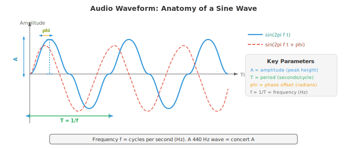
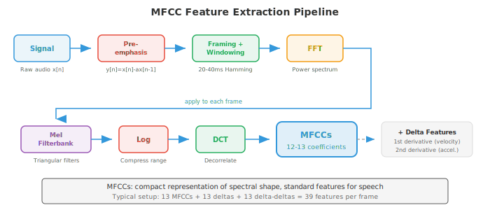

# 数字信号处理

*数字信号处理将原始音频 waveform 转换为 ML 模型可以学习的结构化表示。本文件涵盖声音的物理原理、采样与量化、Fourier transform（DFT、FFT）、spectrogram、mel 滤波器组、MFCC 与加窗，即所有语音与音频 AI 的特征提取流水线。*

- **声音**是一种通过介质（空气、水、固体）传播的压力波。一个振动物体（声带、吉他弦、扬声器纸盆）推拉空气分子，形成交替的高压区（compression）与低压区（rarefaction）。

- 这些压力变化以约 343 m/s 的速度在空气中向外传播，到达耳朵后使鼓膜振动，并被转换为神经信号。

- 可以这样想象声音：向平静的池塘投一颗石子，石子是振动源，涟漪就是压力波，而水面上随波起伏的软木塞就是响应波到达的麦克风或鼓膜。

- 软木塞起伏的高度就是 **amplitude**，每秒起伏的次数就是 **frequency**，而波到达时它从最高点还是最低点开始起振就是 **phase**。

- **waveform** 是压力（或经麦克风将声音转换为电信号后的电压）随时间变化的图。最简单的 waveform 是 **pure tone**（纯音），即单一正弦波：

$$x(t) = A \sin(2\pi f t + \phi)$$

- 其中：
    - $A$ 是 amplitude（偏离零点的峰值，决定响度），
    - $f$ 是以 Hz 为单位的 frequency（每秒周期数，决定音高），
    - $\phi$ 是以弧度为单位的 phase（波的时间偏移）。

- **period**（周期）为 $T = 1/f$，即一个完整周期持续的时间。



- **Amplitude** 决定感知到的响度。amplitude 翻倍，功率变为四倍（因为功率与 amplitude 的平方成正比）。

- 人类听觉的 amplitude 范围极大，因此使用对数刻度：**decibel**（分贝，dB）。声压级为：

$$L = 20 \log_{10}\left(\frac{A}{A_\text{ref}}\right) \text{ dB}$$

- 其中 $A_\text{ref}$ 是参考 amplitude（通常为听觉阈值 $20 \mu\text{Pa}$）。耳语约 30 dB，正常对话约 60 dB，摇滚演唱会约 110 dB。每增加 6 dB 大致使 amplitude 翻倍；每增加 10 dB 大致使感知响度翻倍。这里的对数与第 03 章中的函数相同。

- **Frequency** 决定音高。低 frequency（20-250 Hz）听起来低沉；高 frequency（2000-20000 Hz）听起来高亢。人类听觉范围约为 20 Hz 到 20 kHz。音乐中的标准音 A 为 440 Hz。frequency 翻倍使音高升高一个 **octave**（八度）。

- 大多数自然声音并非纯音，而是许多 frequency 的复杂混合，这也是钢琴和小提琴演奏同一音符听起来不同的原因：它们具有相同的 **fundamental frequency**（基频），但 **harmonics**（基频的整数倍）及其相对 amplitude（即 **timbre**，音色）不同。

- **Phase** 决定波在其周期中的起始位置。两束 amplitude 与 frequency 相同但 phase 不同的波可以发生相长干涉（phase 对齐，amplitude 叠加）或相消干涉（phase 相反，amplitude 抵消）。

- phase 在立体声音频与波束成形中至关重要，但在许多语音处理流水线中常被舍弃，因为人类对音高与音色的感知几乎与 phase 无关。

- 现实世界的音频信号是时间的 **continuous**（连续）函数，但计算机处理的是离散数字。**Sampling**（采样）通过以固定间隔测量信号取值，将连续信号转换为离散序列。

- **sample rate**（采样率）$f_s$ 是每秒测量的次数。CD 音频使用 $f_s = 44{,}100$ Hz；电话语音使用 8000 Hz；现代语音模型通常使用 16000 Hz。

- **Nyquist-Shannon 采样定理**指出，当且仅当 sample rate 至少为信号中最高 frequency 的两倍时，连续信号才能从其样本中完美重建：

$$f_s \geq 2 f_\text{max}$$

- frequency $f_s / 2$ 称为 **Nyquist frequency**（奈奎斯特频率）。如果信号包含高于 Nyquist frequency 的成分，这些 frequency 会折回有效范围内，表现为虚假的低频成分。这种现象称为 **aliasing**（混叠）。aliasing 是不可逆的：一旦发生，原始信号无法从样本中恢复。

- aliasing 的日常类比是电影中的车轮效应：以略高于帧率旋转的车轮看起来在缓慢倒转，因为摄像机对旋转的采样不足。在音频中，以 16 kHz 采样一个 15 kHz 的音（$f_\text{Nyquist} = 8$ kHz）会混叠为 $16 - 15 = 1$ kHz，变成完全不同的音高。


- 为防止 aliasing，**anti-aliasing filter**（抗混叠滤波器，一种低通滤波器）在采样前去除所有高于 $f_s/2$ 的 frequency。这由模数转换器（ADC）硬件在信号数字化之前完成。

- **Quantisation**（量化）将每个连续取值的样本映射到有限级集合中最接近的值。一个 $n$ 位量化器有 $2^n$ 级。CD 音频使用 16 位量化（$2^{16} = 65{,}536$ 级）；电话语音通常使用 8 位并配合 $\mu$-law 或 A-law **companding**（压扩，一种将更多级分配给小幅值的非线性映射，以匹配人类感知）。量化引入 **quantisation noise**（量化噪声），这是一种方差为 $\Delta^2/12$ 的舍入误差，其中 $\Delta$ 是各级之间的步长。

- **Time-domain analysis**（时域分析）直接从 waveform 提取特征，不转换到其他域。这些特征简单、计算快，并捕捉信号的基本性质。

- 一帧 $N$ 个样本的 **Energy**（能量）衡量整体响度：

$$E = \sum_{n=0}^{N-1} x[n]^2$$

- 语音段能量高；静音段能量低。Energy 就是第 01 章中应用于信号向量的平方 $\ell_2$ 范数。

- **Zero-crossing rate**（ZCR，过零率）统计信号在一帧内改变符号的次数：

$$\text{ZCR} = \frac{1}{2(N-1)} \sum_{n=1}^{N-1} |\text{sign}(x[n]) - \text{sign}(x[n-1])|$$

- ZCR 高表示高频成分或噪声；ZCR 低表示低频或浊音（声带周期性振动的语音）。ZCR 是一种粗糙的 frequency 估计：$f$ Hz 的纯音每秒过零 $2f$ 次。

- **Autocorrelation**（自相关）衡量信号与其延迟副本的相似程度：

$$R[k] = \sum_{n=0}^{N-1-k} x[n] \cdot x[n+k]$$

- 在 lag $k = 0$ 时，autocorrelation 等于 energy。对于周期信号，autocorrelation 在等于周期及其整数倍的 lag 处出现峰值。这是 **pitch detection**（基频检测）的标准方法：找到 $k=0$ 之后 $R[k]$ 的第一个显著峰值，pitch 即为 $f_s / k_\text{peak}$。autocorrelation 与第 01 章的点积相关：$R[k]$ 是信号与其 $k$ 偏移版本的点积。

- **Frequency-domain analysis**（频域分析）揭示信号的频谱内容，这些信息在 waveform 中不可见。核心工具是 **Discrete Fourier Transform**（DFT，离散傅里叶变换），它将 $N$ 个样本的信号分解为 $N$ 个复数值 frequency 成分：

$$X[k] = \sum_{n=0}^{N-1} x[n] \cdot e^{-j 2\pi k n / N}, \quad k = 0, 1, \ldots, N-1$$

- 每个 $X[k]$ 是一个复数，其模长 $|X[k]|$ 给出 $f_k = k \cdot f_s / N$ Hz 处 frequency 成分的 amplitude，其相角 $\angle X[k]$ 给出 phase 偏移。DFT 是从时域基（单位脉冲）到频域基（复指数）的基变换，是第 02 章基概念的直接应用。DFT 可写成矩阵乘法 $\mathbf{X} = W \mathbf{x}$，其中 $W$ 是 $N \times N$ 的 DFT 矩阵，元素 $W_{kn} = e^{-j2\pi kn/N}$。

- **Fast Fourier Transform**（FFT，快速傅里叶变换）是一种以 $O(N \log N)$ 运算而非朴素 $O(N^2)$ 计算 DFT 的算法，通过递归地将问题拆分为偶数索引与奇数索引子问题实现（Cooley-Tukey 算法）。这种加速使实时频谱分析切实可行。FFT 是整个计算领域最重要的算法之一。

- **power spectrum**（功率谱）$|X[k]|^2$ 展示能量在各 frequency 上的分布。**magnitude spectrum**（幅度谱）$|X[k]|$ 展示 amplitude。绘制这些图谱可以看出哪些 frequency 在信号中占主导：元音在基频的整数倍处有强 harmonics；擦音（如 "s"）在宽泛的高频范围有能量。

- **spectrogram**（语谱图）是信号 frequency 内容随时间变化的可视化表示。其计算方式为：将信号切成若干短重叠帧，对每帧计算 FFT，再将所得幅度谱并排堆叠。横轴是时间，纵轴是 frequency，每点的颜色（或亮度）表示 magnitude。spectrogram 是音频处理中最重要的可视化工具。


- **mel scale**（梅尔尺度）是一种反映人类音高感知的感知 frequency 尺度。人类将相等的 frequency 比例感知为相等的音高间隔（正如将相等的强度比例感知为相等的响度间隔）。在约 1000 Hz 以下，mel scale 近似线性；在 1000 Hz 以上近似对数：

$$m = 2595 \log_{10}\left(1 + \frac{f}{700}\right)$$

- 其逆函数为 $f = 700(10^{m/2595} - 1)$。mel scale 解释了为何音乐半音在 log-frequency 轴上等距分布：A4（440 Hz）到 A5（880 Hz）与 A5 到 A6（1760 Hz）都听起来像 "升高一个 octave'，尽管以 Hz 为单位的间隔分别是 440 和 880。

- **mel filterbank**（mel 滤波器组）是一组在 mel scale 上均匀分布的三角带通滤波器。每个滤波器覆盖一个 frequency 频带，对该频带内的频谱能量求和，得到一个数值。典型语音系统使用 40-80 个 mel 滤波器。低频滤波器窄（在我们感知敏感处 frequency 分辨率高），高频滤波器宽（在我们不敏感处分辨率低）。这模仿了人类耳蜗的 frequency 分辨率。


- **Mel-Frequency Cepstral Coefficients**（MFCC，梅尔频率倒谱系数）是语音与音频的经典特征表示。它将 mel 频谱压缩为少量去相关系数，这些系数捕捉 spectral envelope（谱包络）的形状（编码了声道构型，因而编码了语音身份），同时舍弃细粒度谱细节（编码了音高与 phase）。

- MFCC 流水线：
    1. **Pre-emphasis**（预加重）：施加一阶高通滤波 $y[n] = x[n] - \alpha x[n-1]$（通常 $\alpha = 0.97$），以增强被声道衰减的高频。
    2. **Framing**（分帧）：将信号切成重叠帧（通常长 25 ms，hop 为 10 ms）。
    3. **Windowing**（加窗）：将每帧乘以窗函数（Hamming），以减少 spectral leakage（见下文）。
    4. **FFT**：计算每个加窗帧的功率谱。
    5. **Mel filterbank**：将三角 mel 滤波器组施加于功率谱，得到 mel 频带能量。
    6. **Log**：对 mel 频带能量取对数。对数压缩了动态范围，并将（频谱成分的）乘法转换为加法，匹配人类响度感知。
    7. **DCT**：对 log-mel 能量施加离散余弦变换。DCT 对 mel 频带去相关（因为相邻频带高度相关），并将能量压缩到前几个系数。保留前 13 个系数（MFCC-0 到 MFCC-12）。



- 步骤 7 的 DCT 本质上是 '谱的 Fourier transform'（因此得名 **cepstrum** = spectrum 的字母重排）。低阶倒谱系数捕捉宽泛的谱形状（声道共振，称为 **formants**），高阶系数捕捉细粒度谱细节（pitch harmonics）。只保留前 13 个，就保留了 formant 信息并舍弃了 pitch 细节。

- **Delta** 与 **delta-delta** MFCC（MFCC 的一阶与二阶时间导数，通过相邻帧的有限差分计算）捕捉谱形状的动态，增加时间上下文。一个完整的 MFCC 特征向量常为 39 维：13 静态 + 13 delta + 13 delta-delta。

- 现代神经网络模型（第 06 章）已在很大程度上用学习到的特征取代了 MFCC：log-mel spectrogram（步骤 6 的输出，跳过 DCT）是深度学习 ASR 与音频分类的标准输入。模型自行学习去相关。尽管如此，MFCC 在低资源场景、经典 ML 流水线以及理解信号处理基础方面仍然重要。

- **Windowing**（加窗）是在计算 FFT 之前将信号帧乘以平滑窗函数的过程。若不加窗，FFT 假设该帧无限重复；帧的突变起始与终止会产生人为的不连续，将能量扩散到所有 frequency，这种伪影称为 **spectral leakage**（频谱泄漏）。

- **Rectangular window**（矩形窗）$w[n] = 1$ 对所有 $n$：无渐变，泄漏最大，但主瓣最宽（给定帧长下 frequency 分辨率最好）。实践中很少使用。

- **Hamming window**（汉明窗）：$w[n] = 0.54 - 0.46 \cos(2\pi n / (N-1))$。边缘渐近零，大幅减少泄漏。语音处理的标准选择。

- **Hann window**（汉宁窗，也称 Hanning）：$w[n] = 0.5 - 0.5 \cos(2\pi n / (N-1))$。边缘恰好为零。与 Hamming 非常相似，但旁瓣抑制略好。

- **Blackman window**（布莱克曼窗）：$w[n] = 0.42 - 0.5 \cos(2\pi n / (N-1)) + 0.08 \cos(4\pi n / (N-1))$。旁瓣抑制更好，但主瓣更宽（frequency 分辨率更差）。用于旁瓣伪影特别棘手时。

- 存在一个根本性权衡：泄漏少的窗主瓣更宽，意味着无法分辨两个靠近的 frequency。这就是 **spectral resolution vs. leakage tradeoff**（谱分辨率与泄漏的权衡），是第 03 章不确定原理的推论。

- **Overlap-add**（OLA，重叠-相加）是从加窗、处理过的帧重建信号的技术。帧之间重叠（通常 50-75%），处理后将加窗输出相加。若窗与重叠选择得当（例如 Hann 窗配 50% 重叠），重叠的窗相加为常数，实现完美重建。这对任何基于帧的音频修改（降噪、变调、时间拉伸）都不可或缺。

- **Short-Time Fourier Transform**（STFT，短时傅里叶变换）是 spectrogram 背后的形式化框架。它对信号的每个加窗帧施加 DFT：

```math
\text{STFT}\{x[n]\}(m, k) = \sum_{n=0}^{N-1} x[n + mH] \cdot w[n] \cdot e^{-j 2\pi k n / N}
```

- 其中 $m$ 是帧索引，$H$ 是 hop size（相邻帧之间的样本数），$w[n]$ 是窗函数，$N$ 是 FFT 大小。输出是一个二维复数值矩阵：信号的 **time-frequency representation**（时频表示）。

- STFT 体现了根本性的 **time-frequency tradeoff**（时频权衡）：
    - 长帧（大 $N$）：frequency 分辨率高（能区分接近的 frequency）但时间分辨率差（无法定位 frequency 何时变化）。
    - 短帧（小 $N$）：时间分辨率高但 frequency 分辨率差。
    - 时间分辨率与 frequency 分辨率的乘积有下界：$\Delta t \cdot \Delta f \geq \frac{1}{4\pi}$。这就是 **Gabor limit**（Gabor 极限），是物理学中海森堡不确定原理在信号处理中的对应。

- 典型语音 STFT 参数：25 ms 帧长（16 kHz 时 $N = 400$），10 ms hop（$H = 160$），Hamming 窗，512 点 FFT（从 400 零填充以提高效率并使谱插值更平滑）。

- **Filtering**（滤波）通过放大某些 frequency、衰减其他 frequency 来改变信号的 frequency 内容。**filter**（滤波器）是一个接收输入信号并产生输出信号的系统。滤波器由其 **frequency response**（频率响应）$H(f)$ 表征，描述施加于每个 frequency 的增益与 phase 偏移。

- **Low-pass filter**（低通滤波器）：通过截止 frequency $f_c$ 以下的 frequency，衰减其上的 frequency。去除高频噪声与细节。采样前的 anti-aliasing filter 就是一种低通滤波器。

- **High-pass filter**（高通滤波器）：通过 $f_c$ 以上的 frequency，衰减其以下的 frequency。去除低频轰鸣与 DC 偏移。MFCC 提取中的 pre-emphasis 滤波器（$y[n] = x[n] - 0.97 x[n-1]$）是一种简单的高通滤波器。

- **Band-pass filter**（带通滤波器）：通过区间 $[f_1, f_2]$ 内的 frequency，衰减区间外的。mel filterbank 中每个三角都是一个带通滤波器。

- **Band-stop (notch) filter**（带阻/陷波滤波器）：衰减特定窄 frequency 范围。用于去除特定干扰（如 50/60 Hz 电力线嗡声）。

- **Finite Impulse Response**（FIR，有限冲激响应）滤波器将每个输出样本计算为当前与过去输入样本的加权和：

$$y[n] = \sum_{k=0}^{M} b_k \cdot x[n-k]$$

- 权重 $b_k$ 是 **filter coefficients**（滤波器系数，也称 **taps**）。滤波器阶数为 $M$。FIR 滤波器总是稳定的（输出不会发散），且可设计成具有完美线性 phase（所有 frequency 延迟相同，保持 waveform 形状）。其缺点是，实现锐利截止需要很多 taps（高 $M$），增加计算量。输出是输入与系数向量的卷积，正是第 06 章的一维卷积运算。

- **Infinite Impulse Response**（IIR，无限冲激响应）滤波器使用反馈：输出同时依赖过去输入与过去输出：

```math
y[n] = \sum_{k=0}^{M} b_k \cdot x[n-k] - \sum_{k=1}^{L} a_k \cdot y[n-k]
```

- 反馈项 $a_k$ 形成递归结构，其冲激响应在理论上是无限长的。IIR 滤波器以远少于 FIR 的系数实现锐利截止，但可能不稳定（若传递函数的极点位于单位圆外则输出无界增长，这是 $z$ 变换中的概念）。它们还具有非线性 phase，可能扭曲 waveform 形状。经典滤波器设计（Butterworth、Chebyshev、elliptic）都是 IIR。

- 离散时间滤波器的 **transfer function**（传递函数）通过 $z$ 变换得到：

$$H(z) = \frac{\sum_{k=0}^{M} b_k z^{-k}}{1 + \sum_{k=1}^{L} a_k z^{-k}}$$

- 分子的根称为 **zeros**（零点），分母的根称为 **poles**（极点）。pole-zero 图完整刻画了滤波器的行为。靠近单位圆的 poles 放大邻近 frequency；靠近单位圆的 zeros 衰减它们。FIR 滤波器只有 zeros（分母为 1）。这联系到第 02 章与第 03 章的特征值与求根概念。

- **Convolution theorem**（卷积定理）：时域的卷积等于频域的逐元素乘法。这意味着滤波既可以直接将信号与滤波器冲激响应卷积，也可以将它们的 Fourier transform 相乘再反变换。对于长滤波器，频域方法（使用 FFT）更快：$O(N \log N)$ 对比 $O(NM)$。

- **inverse STFT**（iSTFT，逆短时傅里叶变换）从 STFT 表示重建时域信号。这对任何在频域修改音频的系统（降噪、source separation、voice conversion）都不可或缺。重建使用 overlap-add：

```math
x[n] = \frac{\sum_{m} w[n - mH] \cdot \text{IDFT}\{X(m, k)\}[n - mH]}{\sum_{m} w[n - mH]^2}
```

- 分母对窗重叠进行归一化，确保当合成窗与分析窗匹配且重叠足够时实现完美重建。

- **语音 DSP 流水线小结**：原始音频以 16 kHz 采样、预加重、切成 25 ms Hamming 加窗帧、hop 10 ms，每帧经 FFT、通过 mel filterbank、对数压缩，然后要么保留为 log-mel 特征（供神经网络模型）要么经 DCT 得到 MFCC（供经典模型）。整条流水线将一维时域信号转换为适合下游机器学习的二维时频表示，这将是第 02 篇文件的主题。

## 编程任务（使用 CoLab 或 notebook）

1. 生成一个正弦波，以不同采样率采样，并演示 aliasing。绘制连续信号、正确采样版本和欠采样（混叠）版本。
```python
import jax.numpy as jnp
import matplotlib.pyplot as plt

# Parameters
f_signal = 5.0  # 5 Hz signal
duration = 1.0  # 1 second

# "Continuous" signal (very high sample rate)
t_cont = jnp.linspace(0, duration, 10000)
x_cont = jnp.sin(2 * jnp.pi * f_signal * t_cont)

# Properly sampled (fs = 50 Hz, well above Nyquist = 10 Hz)
fs_good = 50
t_good = jnp.arange(0, duration, 1.0 / fs_good)
x_good = jnp.sin(2 * jnp.pi * f_signal * t_good)

# Under-sampled (fs = 7 Hz, below Nyquist = 10 Hz) -> aliasing
fs_bad = 7
t_bad = jnp.arange(0, duration, 1.0 / fs_bad)
x_bad = jnp.sin(2 * jnp.pi * f_signal * t_bad)

# The aliased frequency: |f_signal - fs_bad| = |5 - 7| = 2 Hz
f_alias = abs(f_signal - fs_bad)
x_alias_cont = jnp.sin(2 * jnp.pi * f_alias * t_cont)

fig, axes = plt.subplots(3, 1, figsize=(12, 9))

# Plot 1: original signal
axes[0].plot(t_cont, x_cont, color='#3498db', linewidth=1.5, label=f'Original {f_signal} Hz')
axes[0].set_title(f'Original {f_signal} Hz Signal')
axes[0].set_xlabel('Time (s)'); axes[0].set_ylabel('Amplitude')
axes[0].legend(); axes[0].grid(True, alpha=0.3)

# Plot 2: proper sampling
axes[1].plot(t_cont, x_cont, color='#3498db', linewidth=1, alpha=0.4, label='Original')
axes[1].stem(t_good, x_good, linefmt='#27ae60', markerfmt='o', basefmt='k-',
             label=f'Sampled at {fs_good} Hz (above Nyquist)')
axes[1].set_title(f'Proper Sampling: fs = {fs_good} Hz > 2 x {f_signal} Hz')
axes[1].set_xlabel('Time (s)'); axes[1].set_ylabel('Amplitude')
axes[1].legend(); axes[1].grid(True, alpha=0.3)

# Plot 3: aliased sampling
axes[2].plot(t_cont, x_cont, color='#3498db', linewidth=1, alpha=0.4, label='Original')
axes[2].stem(t_bad, x_bad, linefmt='#e74c3c', markerfmt='o', basefmt='k-',
             label=f'Sampled at {fs_bad} Hz (below Nyquist)')
axes[2].plot(t_cont, x_alias_cont, color='#f39c12', linewidth=1.5, linestyle='--',
             label=f'Aliased signal appears as {f_alias} Hz')
axes[2].set_title(f'Aliased Sampling: fs = {fs_bad} Hz < 2 x {f_signal} Hz')
axes[2].set_xlabel('Time (s)'); axes[2].set_ylabel('Amplitude')
axes[2].legend(); axes[2].grid(True, alpha=0.3)

plt.tight_layout(); plt.show()
```

2. 计算并可视化由多个正弦波组成的信号的 FFT。展示幅度谱并识别构成 frequency。
```python
import jax.numpy as jnp
import matplotlib.pyplot as plt

# Create a composite signal: 220 Hz + 440 Hz + 880 Hz (A3 + A4 + A5)
fs = 8000  # 8 kHz sample rate
duration = 0.1  # 100 ms
t = jnp.arange(0, duration, 1.0 / fs)
n_samples = len(t)

# Three frequency components with different amplitudes
x = 1.0 * jnp.sin(2 * jnp.pi * 220 * t) + \
    0.6 * jnp.sin(2 * jnp.pi * 440 * t) + \
    0.3 * jnp.sin(2 * jnp.pi * 880 * t)

# Compute FFT
X = jnp.fft.fft(x)
freqs = jnp.fft.fftfreq(n_samples, d=1.0 / fs)
magnitude = jnp.abs(X) / n_samples  # normalise

# Only plot positive frequencies
pos_mask = freqs >= 0
freqs_pos = freqs[pos_mask]
mag_pos = magnitude[pos_mask] * 2  # double to account for negative freq energy

fig, axes = plt.subplots(2, 1, figsize=(12, 7))

# Time domain
axes[0].plot(t * 1000, x, color='#3498db', linewidth=1)
axes[0].set_title('Composite Signal: 220 Hz + 440 Hz + 880 Hz')
axes[0].set_xlabel('Time (ms)'); axes[0].set_ylabel('Amplitude')
axes[0].grid(True, alpha=0.3)

# Frequency domain
axes[1].plot(freqs_pos, mag_pos, color='#e74c3c', linewidth=1.5)
axes[1].set_title('Magnitude Spectrum (FFT)')
axes[1].set_xlabel('Frequency (Hz)'); axes[1].set_ylabel('Magnitude')
axes[1].set_xlim(0, 1500)
# Annotate peaks
for f_peak, amp in [(220, 1.0), (440, 0.6), (880, 0.3)]:
    axes[1].annotate(f'{f_peak} Hz', xy=(f_peak, amp), fontsize=10,
                     ha='center', va='bottom', color='#9b59b6',
                     arrowprops=dict(arrowstyle='->', color='#9b59b6'))
axes[1].grid(True, alpha=0.3)

plt.tight_layout(); plt.show()
```

3. 用 JAX 从零构建完整的 MFCC 流水线：预加重、分帧、加窗、FFT、mel 滤波器组、对数、DCT。将 mel 滤波器组和所得 MFCC 作为热图可视化。
```python
import jax
import jax.numpy as jnp
import matplotlib.pyplot as plt

# --- Generate a synthetic speech-like signal ---
key = jax.random.PRNGKey(42)
fs = 16000
duration = 1.0
t = jnp.arange(0, duration, 1.0 / fs)

# Simulate voiced speech: fundamental + harmonics with amplitude decay
f0 = 150.0  # fundamental frequency
x = sum(jnp.sin(2 * jnp.pi * f0 * k * t) / k for k in range(1, 8))
# Add some noise
x = x + 0.1 * jax.random.normal(key, t.shape)
x = x / jnp.max(jnp.abs(x))  # normalise

# --- Step 1: Pre-emphasis ---
alpha = 0.97
x_pre = jnp.concatenate([x[:1], x[1:] - alpha * x[:-1]])

# --- Step 2: Framing ---
frame_len = int(0.025 * fs)   # 25 ms = 400 samples
hop_len = int(0.010 * fs)     # 10 ms = 160 samples
n_frames = (len(x_pre) - frame_len) // hop_len + 1
frames = jnp.stack([x_pre[i * hop_len : i * hop_len + frame_len]
                     for i in range(n_frames)])

# --- Step 3: Hamming window ---
hamming = 0.54 - 0.46 * jnp.cos(2 * jnp.pi * jnp.arange(frame_len) / (frame_len - 1))
windowed = frames * hamming

# --- Step 4: FFT ---
n_fft = 512
spectra = jnp.fft.rfft(windowed, n=n_fft)
power_spectra = jnp.abs(spectra) ** 2 / n_fft

# --- Step 5: Mel filterbank ---
n_mels = 40
f_min, f_max = 0.0, fs / 2.0

def hz_to_mel(f):
    return 2595 * jnp.log10(1 + f / 700)

def mel_to_hz(m):
    return 700 * (10 ** (m / 2595) - 1)

mel_min = hz_to_mel(f_min)
mel_max = hz_to_mel(f_max)
mel_points = jnp.linspace(mel_min, mel_max, n_mels + 2)
hz_points = mel_to_hz(mel_points)

freq_bins = jnp.floor((n_fft + 1) * hz_points / fs).astype(jnp.int32)
n_freqs = n_fft // 2 + 1
filterbank = jnp.zeros((n_mels, n_freqs))

for m in range(n_mels):
    f_left = freq_bins[m]
    f_center = freq_bins[m + 1]
    f_right = freq_bins[m + 2]
    # Rising slope
    for k in range(int(f_left), int(f_center)):
        if f_center != f_left:
            filterbank = filterbank.at[m, k].set((k - f_left) / (f_center - f_left))
    # Falling slope
    for k in range(int(f_center), int(f_right)):
        if f_right != f_center:
            filterbank = filterbank.at[m, k].set((f_right - k) / (f_right - f_center))

# Apply filterbank
mel_spectra = jnp.dot(power_spectra, filterbank.T)

# --- Step 6: Log ---
log_mel = jnp.log(mel_spectra + 1e-10)

# --- Step 7: DCT (type-II) ---
n_mfcc = 13
n_mel_channels = log_mel.shape[1]
dct_matrix = jnp.zeros((n_mfcc, n_mel_channels))
for i in range(n_mfcc):
    for j in range(n_mel_channels):
        dct_matrix = dct_matrix.at[i, j].set(
            jnp.cos(jnp.pi * i * (j + 0.5) / n_mel_channels)
        )
mfccs = jnp.dot(log_mel, dct_matrix.T)

# --- Visualisation ---
fig, axes = plt.subplots(3, 1, figsize=(14, 11))

# Mel filterbank
freq_axis = jnp.linspace(0, fs / 2, n_freqs)
for m in range(n_mels):
    color = '#3498db' if m % 2 == 0 else '#e74c3c'
    axes[0].plot(freq_axis, filterbank[m], color=color, alpha=0.6, linewidth=0.8)
axes[0].set_title(f'Mel Filterbank ({n_mels} filters)')
axes[0].set_xlabel('Frequency (Hz)'); axes[0].set_ylabel('Weight')
axes[0].grid(True, alpha=0.3)

# Log-mel spectrogram
im1 = axes[1].imshow(log_mel.T, aspect='auto', origin='lower',
                      extent=[0, duration, 0, n_mels], cmap='viridis')
axes[1].set_title('Log-Mel Spectrogram')
axes[1].set_xlabel('Time (s)'); axes[1].set_ylabel('Mel Band')
plt.colorbar(im1, ax=axes[1], label='Log Energy')

# MFCCs
im2 = axes[2].imshow(mfccs.T, aspect='auto', origin='lower',
                      extent=[0, duration, 0, n_mfcc], cmap='coolwarm')
axes[2].set_title(f'MFCCs (first {n_mfcc} coefficients)')
axes[2].set_xlabel('Time (s)'); axes[2].set_ylabel('MFCC Index')
plt.colorbar(im2, ax=axes[2], label='Coefficient Value')

plt.tight_layout(); plt.show()
```

4. 实现 FIR 低通与高通滤波器，并可视化它们对包含低频与高频成分信号的影响。同时展示时域与频域视图。
```python
import jax
import jax.numpy as jnp
import matplotlib.pyplot as plt

# Create a signal with low (100 Hz) and high (2000 Hz) components
fs = 8000
duration = 0.05  # 50 ms for clear visualisation
t = jnp.arange(0, duration, 1.0 / fs)

x_low = jnp.sin(2 * jnp.pi * 100 * t)
x_high = 0.5 * jnp.sin(2 * jnp.pi * 2000 * t)
x = x_low + x_high

# Design a simple FIR low-pass filter using windowed sinc
def fir_lowpass(cutoff_hz, fs, n_taps=51):
    """Design FIR low-pass filter using windowed sinc method."""
    fc = cutoff_hz / fs  # normalised cutoff
    n = jnp.arange(n_taps)
    mid = (n_taps - 1) / 2.0
    # Sinc function (ideal low-pass impulse response)
    h = jnp.where(n == mid, 2 * fc,
                  jnp.sin(2 * jnp.pi * fc * (n - mid)) / (jnp.pi * (n - mid)))
    # Apply Hamming window
    window = 0.54 - 0.46 * jnp.cos(2 * jnp.pi * n / (n_taps - 1))
    h = h * window
    h = h / jnp.sum(h)  # normalise to unity gain at DC
    return h

def apply_filter(x, h):
    """Apply FIR filter via convolution."""
    return jnp.convolve(x, h, mode='same')

# Low-pass filter at 500 Hz (passes 100 Hz, blocks 2000 Hz)
h_lp = fir_lowpass(500, fs, n_taps=51)
x_lp = apply_filter(x, h_lp)

# High-pass = delta - low-pass (spectral inversion)
delta = jnp.zeros(51)
delta = delta.at[25].set(1.0)
h_hp = delta - h_lp
x_hp = apply_filter(x, h_hp)

# Compute spectra for all signals
def compute_spectrum(signal, fs):
    X = jnp.fft.rfft(signal)
    freqs = jnp.fft.rfftfreq(len(signal), d=1.0 / fs)
    mag = jnp.abs(X) / len(signal) * 2
    return freqs, mag

fig, axes = plt.subplots(3, 2, figsize=(14, 10))

# Time domain plots
for i, (sig, title, color) in enumerate([
    (x, 'Original (100 Hz + 2000 Hz)', '#3498db'),
    (x_lp, 'Low-pass filtered (< 500 Hz)', '#27ae60'),
    (x_hp, 'High-pass filtered (> 500 Hz)', '#e74c3c')
]):
    axes[i, 0].plot(t * 1000, sig[:len(t)], color=color, linewidth=1)
    axes[i, 0].set_title(f'Time Domain: {title}')
    axes[i, 0].set_xlabel('Time (ms)'); axes[i, 0].set_ylabel('Amplitude')
    axes[i, 0].grid(True, alpha=0.3)

# Frequency domain plots
for i, (sig, title, color) in enumerate([
    (x, 'Original', '#3498db'),
    (x_lp, 'Low-pass', '#27ae60'),
    (x_hp, 'High-pass', '#e74c3c')
]):
    freqs, mag = compute_spectrum(sig, fs)
    axes[i, 1].plot(freqs, mag, color=color, linewidth=1.5)
    axes[i, 1].set_title(f'Spectrum: {title}')
    axes[i, 1].set_xlabel('Frequency (Hz)'); axes[i, 1].set_ylabel('Magnitude')
    axes[i, 1].set_xlim(0, 3000)
    axes[i, 1].axvline(x=500, color='#f39c12', linestyle='--', alpha=0.7,
                        label='Cutoff (500 Hz)')
    axes[i, 1].legend(); axes[i, 1].grid(True, alpha=0.3)

plt.tight_layout(); plt.show()
```
