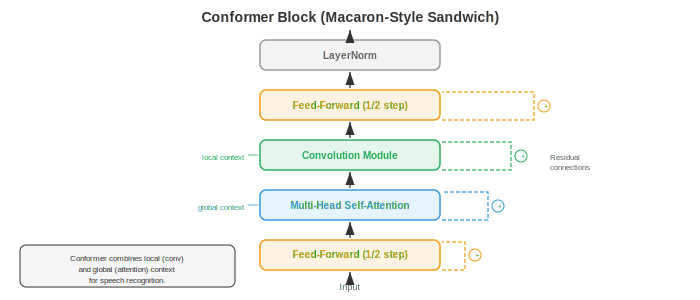
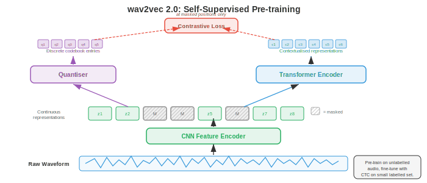

# 自动语音识别

*自动语音识别将口语音频转换为书面文字，架起人类语音与机器可读语言之间的桥梁。本文件涵盖 GMM-HMM、CTC loss、RNN-Transducer、基于 attention 的 encoder-decoder 模型（LAS）、Whisper 与 end-to-end ASR，从经典流水线到现代神经架构。*

- **自动语音识别**（Automatic Speech Recognition，ASR）是将口语音频转换为书面文字的任务。它是 AI 中最古老的问题之一（1950 年代的早期系统只能识别单个数字），也是商业部署最广泛的技术之一（语音助手、转录服务、字幕生成）。

- 其难度源自语音的极大变异性：不同说话人、口音、语速、背景噪声、麦克风特性，以及将连续声学信号映射到离散单词这一根本性歧义。

- 可以把 ASR 想象成法庭速记员。速记员听到连续的声音流，在脑中将其切分为单词，利用上下文消解歧义（"they're" 与 "their" 与 "there"），并打出结果。ASR 系统做同样的事，但分成多个阶段，这些阶段可以显式化并独立或联合优化。

- **经典 ASR 流水线**以一串不同阶段处理音频：原始音频被转换为特征（MFCC 或 log-mel spectrogram，见第 01 篇文件），**acoustic model**（声学模型）为每帧特征与每个语音单元的匹配度打分，**pronunciation model**（发音模型，词典）将语音单元映射为单词，**language model**（语言模型）为单词序列的可能性打分，**decoder**（解码器）搜索使组合得分最大的单词序列。每个组件分别训练和调优。


- **Phonemes**（音素）是区分语言中单词的最小语音单元。英语约有 39-44 个 phonemes（确切数量取决于方言与所用音素清单）。例如，"bat" 与 "pat" 仅在一个 phoneme 上不同（/b/ 与 /p/）。大多数 ASR 系统建模 **context-dependent phonemes**，称为 **triphones**（三音素）：由其左右邻居定义的 phoneme（例如 "b_t" 语境中的 "a" 与 "c_t" 语境中的 "a" 是不同单元），因为一个 phoneme 的声学实现受其邻居强烈影响（这称为 **coarticulation**，协同发音）。

- 可能的 triphone 数量极大（40 个 phoneme 的三方 = 64,000），因此 **decision tree clustering**（决策树聚类）将声学相似的 triphone 聚为 **senones**（通常 2000-10,000 类）。每个 senone 有自己的 acoustic model。这种聚类是第 06 章决策树算法的一种形式。

- **GMM-HMM**（Gaussian Mixture Model - Hidden Markov Model，高斯混合模型-隐马尔可夫模型）是 1980 年代到 2010 年代初主导的声学建模方法。HMM（来自第 05 章）建模语音的时间结构：每个 phoneme 是一个左到右的 3-5 状态 HMM，每个状态代表一个子语音段（起始、中部、结束）。状态间转移隐式建模时长。

- 在每个 HMM 状态，emission probability（给定状态时某特征向量的似然）由 **Gaussian mixture model**（GMM，高斯混合模型）建模：多元 Gaussian 分布（来自第 05 章）的加权和：

```math
p(\mathbf{x} | s) = \sum_{m=1}^{M} w_m \cdot \mathcal{N}(\mathbf{x} ; \boldsymbol{\mu}_m, \boldsymbol{\Sigma}_m)
```

- 其中 $\mathbf{x}$ 是特征向量（例如 39 维 MFCC），$s$ 是 HMM 状态，$M$ 是混合分量数（通常 8-64），$w_m$ 是混合权重，$\boldsymbol{\mu}_m$、$\boldsymbol{\Sigma}_m$ 是每个 Gaussian 分量的均值与协方差。协方差矩阵通常取对角形式以提高计算效率（假设特征各维独立，这对 MFCC 因 DCT 去相关而近似成立）。

- 训练使用 **Baum-Welch algorithm**（EM 的特例，来自第 05 章）从带标注的语音数据迭代估计 GMM 参数与 HMM 转移概率。解码（寻找最可能的状态序列）使用 **Viterbi algorithm**（动态规划，来自第 05 章）：

```math
\delta_t(j) = \max_{i} \left[ \delta_{t-1}(i) \cdot a_{ij} \right] \cdot b_j(\mathbf{x}_t)
```

- 其中 $\delta_t(j)$ 是时刻 $t$ 结束于状态 $j$ 的最佳路径的概率，$a_{ij}$ 是从状态 $i$ 转移到状态 $j$ 的概率，$b_j(\mathbf{x}_t)$ 是状态 $j$ 下特征 $\mathbf{x}_t$ 的 emission probability。

- **DNN-HMM**（Hinton 等，2012）用深度神经网络（DNN，来自第 06 章）取代 GMM emission 模型，从一窗特征帧预测 senone 后验概率 $p(s | \mathbf{x})$。HMM 仍负责时间结构与序列化，但神经网络提供了更具判别力的 emission 得分。这种混合方法相对 GMM 将词错率降低了 20-30%，是 2012-2016 年的主导范式。

- **WFST decoding**（Weighted Finite-State Transducer，加权有限状态转换器解码）是传统 ASR 的标准解码框架。每个组件（HMM 拓扑 H、上下文依赖 C、词典 L、语法/语言模型 G）表示为一个加权有限状态转换器，它们被复合成单个搜索图 $H \circ C \circ L \circ G$。Viterbi 搜索在该复合图中寻找最低代价路径。WFST 允许模块化组合知识源并进行高效动态规划搜索。其数学框架源自有限自动机理论（与第 05 章的状态机相关）。

- **End-to-end ASR**（端到端 ASR）消除了独立组件（pronunciation model、phoneme inventory、WFST decoder），训练单个神经网络直接将音频特征映射为字符或 word pieces。关键挑战是 **alignment problem**（对齐问题）：输入（每秒数百个特征帧）与输出（每秒几个字符）长度差异极大，训练时它们之间的对齐未知。

- **Connectionist Temporal Classification**（CTC，连接时序分类）（Graves 等，2006）通过引入特殊的 **blank** token 解决对齐问题，允许网络输出任意字符与 blank 序列，只要合并相邻重复并去除 blank 后得到正确转录即可。例如，转录 "cat" 可由输出序列 "--cc-aa-t--"（其中 "-" 为 blank）产生。

- 形式上，CTC 定义了一个多对一映射 $\mathcal{B}$，从所有长度为 $T$ 的输出序列（字母表加 blank）集合映射到标签序列。标签序列 $\mathbf{y}$ 的概率是对所有塌缩为它的对齐求和：

$$P(\mathbf{y} | \mathbf{x}) = \sum_{\boldsymbol{\pi} \in \mathcal{B}^{-1}(\mathbf{y})} \prod_{t=1}^{T} p(\pi_t | \mathbf{x})$$


- 朴素计算该求和需要枚举指数级多的对齐，但 **CTC forward-backward algorithm** 利用动态规划在 $O(T \cdot |\mathbf{y}|)$ 内高效完成，类似于第 05 章的 HMM forward-backward 算法。

- CTC 作出 **conditional independence assumption**（条件独立假设）：给定输入，每个时间步的输出独立于所有其他输出。这意味着 CTC 无法建模输出依赖（例如无法学到 "q" 后几乎总跟 "u"）。必须借助外部语言模型处理此类依赖。

- **CTC decoding**（CTC 解码）选项：
    - **Greedy decoding**（贪心解码）：每步取最可能 token 再合并。快但次优。
    - **Beam search**（束搜索）：每步保留前 $k$ 个部分假设，将塌缩到同一前缀的假设合并。可纳入语言模型得分。
    - **Prefix beam search**：一种改进的 beam search，正确处理 CTC blank 合并，确保假设在合并后比较。

- **RNN-Transducer**（RNN-T）（Graves，2012）通过添加显式的 **prediction network**（一个类似语言模型的 RNN）扩展 CTC，使每个输出以之前的输出为条件，去除了条件独立假设。RNN-T 有三个组件：
    - **Encoder**：处理音频特征生成隐藏表示 $\mathbf{h}_t^\text{enc}$（通常是 LSTM 或 Conformer 层的堆栈）。
    - **Prediction network**：一个自回归 RNN，从已输出的标签生成隐藏表示 $\mathbf{h}_u^\text{pred}$。
    - **Joint network**：在每个 (time, label) 位置组合 encoder 与 prediction network 的输出，生成下一个 token（含 blank）的分布：

$$p(y | t, u) = \text{softmax}(W \cdot \text{tanh}(W_\text{enc} \mathbf{h}_t^\text{enc} + W_\text{pred} \mathbf{h}_u^\text{pred} + b))$$

- RNN-T 每个时间步可输出零个或多个标签（通过在推进到下一时间步前输出非 blank token，或输出 blank 推进但不输出）。训练使用在二维 (time, label) 网格上的 forward-backward 算法，复杂度 $O(T \cdot U)$，$U$ 为输出长度。RNN-T 是设备端流式 ASR 的主导架构（用于 Google Pixel 手机等类似产品），因为它天然支持流式：encoder 从左到右处理音频，prediction network 增量生成输出。

- **Listen, Attend and Spell**（LAS）（Chan 等，2016）是基于 attention 的 encoder-decoder 模型（第 06 章的序列到序列架构）。它有三个组件：
    - **Listener**（encoder）：金字塔型双向 LSTM，处理完整输入序列并通过 8 倍下采样（在每层拼接相邻隐藏状态对）生成更短的 encoder 隐藏状态序列。
    - **Attention**：在每个 decoder 步，对所有 encoder 状态计算 attention 权重以形成 context vector（第 07 章的 attention 机制）。
    - **Speller**（decoder）：自回归 LSTM，以 context vector 与已生成字符为条件，逐字符生成输出转录。

- LAS 取得不错的结果，但要求解码前整句可用（因为 attention 覆盖所有 encoder 状态），不适合流式应用。它在超长语句上也表现不佳，因为长序列上的 attention 变得弥散。

- **Conformer**（Gulati 等，2020）将卷积捕捉局部模式的能力与 self-attention 建模全局依赖的能力结合。每个 Conformer 块以三明治结构包含四个模块：
    1. **Feed-forward module**（半步）：带残差连接的前馈网络，残差权重为半。
    2. **Multi-head self-attention module**：标准 transformer self-attention（来自第 07 章），配相对位置编码。
    3. **Convolution module**：pointwise 卷积、gated linear unit（GLU）、一维 depthwise 卷积、batch normalisation、Swish 激活，再加一个 pointwise 卷积。depthwise 卷积捕捉局部上下文（类似特征序列上的 n-gram）。
    4. **Feed-forward module**（半步）：与模块 1 相同。

- 输出为：$\mathbf{y} = \text{LayerNorm}(\mathbf{x} + \frac{1}{2}\text{FFN}_1 + \text{MHSA} + \text{Conv} + \frac{1}{2}\text{FFN}_2)$。这种通心粉式结构（FFN-Attention-Conv-FFN）配半步残差由经验发现优于其他排列。Conformer 已成为 CTC 与 RNN-T 系统的默认 encoder，优于纯 transformer 与纯 LSTM encoder。



- **Whisper**（Radford 等，2023）是 OpenAI 的大规模基于 attention 的 ASR 模型。它采用标准 encoder-decoder transformer 架构（来自第 07 章），在 680,000 小时从互联网抓取的弱监督数据（音频配近似转录）上训练。关键设计选择：
    - 输入：80 通道 log-mel spectrogram（来自第 01 篇文件），25 ms 窗、10 ms hop，归一化到零均值单位方差。
    - Encoder：标准 transformer encoder，使用正弦位置嵌入与 pre-activation layer normalisation。
    - Decoder：transformer decoder，使用 byte-level BPE tokenizer（来自第 07 章）自回归生成 token。
    - 多任务：单个模型处理转录、翻译、语言识别与时间戳预测，由 decoder prompt 中的特殊 task token 条件化。
    - 训练数据的规模（而非架构创新）是 Whisper 在跨域、跨口音、跨语言上强泛化的主要驱动因素。

- **wav2vec 2.0**（Baevski 等，2020）是用于语音表示的 **self-supervised**（自监督）预训练框架。核心思想是从大量无标注音频学习语音表示，再用少量标注数据 fine-tuning。这遵循与 BERT（第 07 章）相同的自监督范式，但适配于连续音频信号。

- wav2vec 2.0 架构有三部分：
    - **Feature encoder**：多层一维 CNN，处理原始 waveform 样本，以 20 ms 帧率生成 latent 表示 $\mathbf{z}_t$（16 kHz 下每 320 个样本一个向量）。
    - **Quantisation module**：使用 **product quantisation**（乘积量化，将向量分组并各自独立量化，从 $G$ 个各含 $V$ 项的 codebook 中选取）将 latent 表示离散化为有限 codebook。这为对比学习目标生成目标 $\mathbf{q}_t$。
    - **Context network**：transformer encoder，接收（部分被掩码的）latent 表示并生成上下文化表示 $\mathbf{c}_t$。



- 预训练时，latent 表示的随机片段被 **masked**（替换为可学习的 mask embedding），模型需从一组干扰项（从同一语句其他位置采样的负例）中识别出 mask 位置的真实量化表示。contrastive loss 为：

$$\mathcal{L} = -\log \frac{\exp(\text{sim}(\mathbf{c}_t, \mathbf{q}_t) / \kappa)}{\sum_{\tilde{\mathbf{q}} \in Q_t} \exp(\text{sim}(\mathbf{c}_t, \tilde{\mathbf{q}}) / \kappa)}$$

- 其中 $\text{sim}$ 是余弦相似度，$\kappa$ 是温度参数，$Q_t$ 包含真实量化目标加干扰项。额外的 **diversity loss** 鼓励均匀使用所有 codebook 项。该 loss 本质上是 InfoNCE contrastive loss，与视觉自监督学习中使用的对比目标同族。

- 预训练后，在顶部加一个线性投影与 CTC head，并在标注数据上 fine-tuning。wav2vec 2.0 仅用 10 分钟标注数据（配合 53,000 小时无标注音频预训练）就取得了接近 SOTA 的结果，展示了自监督学习在低资源语音识别中的威力。

- **HuBERT**（Hsu 等，2021）是另一种自监督方法，用 **masked prediction** 目标取代 contrastive 目标（预测被掩码帧的离散聚类分配）。目标由离线聚类步骤产生（首轮对 MFCC 做 k-means，后续轮对 HuBERT 特征做 k-means）。HuBERT 相对 wav2vec 2.0 简化了训练流水线（无需 quantisation module 或 contrastive 采样），并取得可比或更优的结果。

- **Fast Conformer**（Rekesh 等，2023，NVIDIA NeMo）用 **down-sampled attention** 机制取代标准 Conformer 中的二次 self-attention：在计算 attention 前先压缩输入序列（通常通过步幅卷积 8× 压缩），之后再扩展回去。这把 attention 代价从 $O(T^2)$ 降到 $O(T^2/64)$ 同时保留全局上下文，使在超长语句（数分钟）上训练不会内存溢出。Fast Conformer 是 NVIDIA NeMo 工具包的默认 encoder，是其生产级模型的骨干。

- **Parakeet**（NVIDIA，2024）是基于 Fast Conformer encoder 配 CTC 与 RNN-T decoder 的英文 ASR 模型家族，在 64,000 小时英文语音上训练。Parakeet 模型（0.6B 与 1.1B 参数）在发布时取得了各标准基准上最低的词错率，在大多数英文测试集上超越 Whisper large-v3。关键要素是高效的 Fast Conformer 架构、激进的数据增强（SpecAugment、速度扰动、噪声混合）以及大规模监督训练数据——表明对已知组件的精心工程化仍能推进 SOTA。

- **Canary**（NVIDIA，2024）将 NeMo 框架扩展到多语言与多任务 ASR。它使用 Fast Conformer encoder 配基于 attention 的 decoder（而非 CTC 或 RNN-T），在单个模型中处理多种语言的转录与翻译（类似 Whisper 的多任务设计，但用更高效的 Fast Conformer 骨干）。Canary 模型支持英语、德语、西班牙语与法语，准确率具竞争力。

- **Moonshine**（Useful Sensors，2024）是专为 **on-device and edge deployment**（设备端与边缘部署）优化的 ASR 模型家族。其 encoder 使用混合架构，用一个小型 CNN 加几层 transformer 取代初始 transformer/conformer 层，大幅减小模型尺寸（base 模型低于 30M 参数）。Moonshine 面向在 CPU 与低功耗设备上的实时流式场景，而 Whisper 在这些场景下太大太慢，以一定精度换取 5-10× 更低的延迟与内存占用。

- **Distil-Whisper**（Gandhi 等，2023）应用 **knowledge distillation**（第 06 章）将 Whisper 压缩为更小更快的模型。学生模型仅用 2 层 decoder（Whisper 为 32 层）而保留完整 encoder，并被训练以匹配 Whisper 的输出分布。Distil-Whisper 在 WER 上与教师相差不到 1%，同时快 6×，适用于完整 Whisper 太慢的实时应用。

- **Universal Speech Model (USM)**（Zhang 等，2023，Google）将自监督预训练扩展到 300+ 语言的 1200 万小时无标注音频，随后监督 fine-tuning。USM 表明 wav2vec 2.0 / 自监督范式可扩展到真正的大规模数据规模，在标注数据极少的低资源语言上取得强劲表现。

- **Massively Multilingual Speech (MMS)**（Pratap 等，2023，Meta）将 wav2vec 2.0 预训练扩展到超过 1,100 种语言，使用宗教录音与其他多语言音频来源。MMS 覆盖的语言远超以往任何 ASR 系统，首次为许多低资源语言提供语音识别能力。

- 现代 ASR 的格局正收敛到几种主导模式：(1) Conformer 家族 encoder 配 CTC 或 RNN-T 用于流式；(2) encoder-decoder transformer 用于离线/多任务；(3) 自监督预训练用于低资源场景；(4) 规模化——更多数据与更大模型持续提升准确率。它们之间的选择取决于部署约束：延迟预算、可用算力、语言数、应用是流式还是批处理。

- **Language model integration**（语言模型集成）通过纳入超出 acoustic model 所捕捉的语言学知识来改进 ASR。基本思想是在解码时将 acoustic model 得分 $p(\mathbf{x} | \mathbf{y})$（音频与转录的匹配程度）与 language model 得分 $p(\mathbf{y})$（转录作为句子的似然）组合。

- **Shallow fusion**（浅融合）在 beam search 时组合得分：

$$\hat{\mathbf{y}} = \arg\max_\mathbf{y} \left[ \log p_\text{AM}(\mathbf{y} | \mathbf{x}) + \lambda \log p_\text{LM}(\mathbf{y}) \right]$$

- 其中 $\lambda$ 是可调权重，$p_\text{LM}$ 是外部语言模型（通常是第 07 章的 n-gram 或神经 LM）。该方法简单有效，但要求 LM 与 ASR 模型使用相同 token 词表。

- **Deep fusion**（深融合，Gulcehre 等，2015）将语言模型集成到 decoder 网络内部：LM 隐藏状态与 decoder 隐藏状态拼接，通过门控机制后再做输出投影。整个系统（含预训练 LM）联合 fine-tuning。这允许更深度的整合，但训练更复杂。

- **Cold fusion**（冷融合，Sriram 等，2018）类似 deep fusion，但 ASR decoder 从零训练并集成语言模型，而非 fine-tuning 预训练 decoder。这迫使 acoustic model 学习与 LM 互补的信息，而非重复 LM 已知的内容。

- **Rescoring**（N-best rescoring，重打分）是两遍方法：先用 beam search 生成 $N$ 个候选转录，再用更强大的语言模型（如大型 transformer LM）重排序。实现简单，且可使用对首遍解码太慢的超大 LM。

- **Internal language model estimation**（ILME，内部语言模型估计）处理一个微妙问题：end-to-end 模型隐式地从训练转录中学到一个内部 LM，在 shallow fusion 时可能与外部 LM 冲突（本质上是重复计数语言先验）。ILME 估计内部 LM 并在融合时减去其得分：

$$\hat{\mathbf{y}} = \arg\max_\mathbf{y} \left[ \log p_\text{E2E}(\mathbf{y} | \mathbf{x}) - \beta \log p_\text{ILM}(\mathbf{y}) + \lambda \log p_\text{LM}(\mathbf{y}) \right]$$

- **Streaming vs. offline ASR**（流式 vs. 离线 ASR）是根本性的架构选择。离线（或批处理）ASR 在产出任何输出前处理整句。流式 ASR 随音频到达增量产出，延迟有界。

- 流式对实时应用至关重要：实时字幕、语音助手（用户期望在说完前就得到响应）、电话通话转录。挑战在于某些未来上下文对识别有帮助（知道下一个词是 "York" 可消歧 "New"），但流式系统无法等待任意长的未来上下文。

- **Unidirectional encoders**（单向 encoder，左到右 LSTM、因果卷积、因果 transformer）天然支持流式，因为每个输出只依赖过去与当前输入。双向 encoder（查看未来上下文）不直接支持流式。

- **Chunked attention**（也称 blockwise 或 segmental attention）将输入划分为定长块，self-attention 仅在每块内（可选地扩展到之前几块）应用。这将延迟限制为块大小加处理时间，同时在每块内仍允许一定的局部双向上下文。权衡是块越小准确率越差。

- **Lookahead**（前瞻）允许流式 encoder 在为当前帧产出前窥视少量未来帧（如 300-900 ms）。这通过给单向计算添加少量右上下文实现。lookahead 窗口增加延迟但显著提升准确率。

- 流式 ASR 的 **Latency**（延迟）有若干组成：
    - **Algorithmic latency**（算法延迟）：从音频到达到模型可处理之间的延迟（由块大小、lookahead、特征提取决定）。
    - **Computational latency**（计算延迟）：运行模型前向传播的时间。
    - **Endpointer latency**（端点检测延迟）：检测用户说完的延迟。
    - **First-token latency**（首 token 延迟）：第一个词出现的速度。**Finalization latency**（最终确认延迟）：最终输出被确认的速度（流式系统常产出临时输出，随更多音频到达被修正）。

- ASR 的 **Evaluation metrics**（评估指标）：

- **Word Error Rate**（WER，词错率）是主要指标。它通过用编辑距离（将一个串转为另一个所需的最少替换、删除、插入数）将 hypothesis（系统输出）与 reference（真值转录）对齐后计算：

$$\text{WER} = \frac{S + D + I}{N}$$

- 其中 $S$ 为替换、$D$ 为删除、$I$ 为插入，$N$ 为 reference 中总词数。若插入很多，WER 可超过 100%。对清晰朗读语音，5% 的 WER 大致为人类水平；对话或噪声语音困难得多（10-20%+）。

- **Character Error Rate**（CER，字符错率）是字符级而非词级的同一公式。对没有明确词边界的语言（中文、日文）以及评估接近的错配更有信息量（"cat" vs "bat" 的 WER 为 100%，但 CER 为 33%）。

- **Word Information Lost**（WIL）与 **Word Information Preserved**（WIP）是信息论替代指标，比 WER 更精确地考虑 reference 与 hypothesis 的相关性，但较少被报告。

- **Real-Time Factor**（RTF，实时因子）衡量计算效率：处理时间与音频时长的比值。RTF < 1 表示系统快于实时；RTF > 1 表示无法跟上实时音频。流式系统必须保持 RTF < 1。

- **Data augmentation**（数据增强）对鲁棒 ASR 至关重要。常用技术：
    - **Speed perturbation**（速度扰动）：以 0.9× 与 1.1× 速度重采样音频（改变音高与时长）。
    - **SpecAugment**（Park 等，2019）：在 spectrogram 上掩码随机 frequency 频带与时间步。这是音频版的 dropout，是 ASR 最有效的正则化技术之一，无需额外数据。
    - **Noise augmentation**（噪声增强）：将清晰语音与录制噪声以各种信噪比混合。
    - **Room impulse response simulation**（房间冲激响应仿真）：将清晰语音与仿真房间声学卷积以模拟混响环境。

- ASR 的 **Tokenisation**（分词）决定模型的输出词表。选项包括：
    - **Characters**（字符）：简单、词表小（英文约 30），但输出序列长且无隐式语言建模。
    - **Word pieces / BPE**（来自第 07 章）：平衡词表大小与序列长度的子词单元。现代系统的标准（Whisper 使用约 50,000 token 的 byte-level BPE）。
    - **Words**（词）：词表大（50,000+）、输出序列短，但无法处理未登录词。
    - **Phonemes**：语言学动因强、紧凑，但需发音词典。

- ASR 的演进可概括为从高度工程化的模块化系统（GMM-HMM + WFST 解码，1990-2010 年代）到混合系统（DNN-HMM，2012-2016）到 end-to-end 系统（将流水线越来越多地吸收进单个神经网络，CTC、RNN-T、LAS，2016-2020）再到利用海量无标注或弱标注数据的大规模预训练模型（wav2vec 2.0、Whisper，2020 至今）的进展。每次过渡都简化了工程并提升准确率，遵循机器学习从数据学习表示而非手工设计表示的更广趋势（与第 06 章图像特征被 CNN 取代、第 07 章 NLP 特征被 transformer 取代是同一故事）。

## 编程任务（使用 CoLab 或 notebook）

1. 用 JAX 从零实现 CTC loss。构造一个短 logits 序列与目标标签的玩具例子，计算 CTC forward 算法得到总概率，并计算负对数似然 loss。
```python
import jax
import jax.numpy as jnp
import matplotlib.pyplot as plt

def ctc_forward(log_probs, targets):
    """
    CTC forward algorithm (log-domain for numerical stability).
    log_probs: (T, V) log probabilities over vocabulary (index 0 = blank)
    targets: (U,) target label indices (no blanks)
    Returns: log probability of the target sequence under CTC.
    """
    T, V = log_probs.shape
    U = len(targets)

    # Build the extended label sequence with blanks: [blank, y1, blank, y2, ..., yU, blank]
    S = 2 * U + 1
    labels = jnp.zeros(S, dtype=jnp.int32)  # all blanks
    for i in range(U):
        labels = labels.at[2 * i + 1].set(targets[i])

    # Initialise alpha (log domain)
    NEG_INF = -1e30
    alpha = jnp.full((T, S), NEG_INF)
    alpha = alpha.at[0, 0].set(log_probs[0, labels[0]])        # start with blank
    alpha = alpha.at[0, 1].set(log_probs[0, labels[1]])        # or first label

    # Fill forward
    for t in range(1, T):
        for s in range(S):
            # Same state
            a = alpha[t - 1, s]
            # From previous state
            if s > 0:
                a = jnp.logaddexp(a, alpha[t - 1, s - 1])
            # Skip blank (if current and two-back labels are different)
            if s > 1 and labels[s] != 0 and labels[s] != labels[s - 2]:
                a = jnp.logaddexp(a, alpha[t - 1, s - 2])
            alpha = alpha.at[t, s].set(a + log_probs[t, labels[s]])

    # Total log probability: sum of last two states at final time step
    log_prob = jnp.logaddexp(alpha[T - 1, S - 1], alpha[T - 1, S - 2])
    return log_prob, alpha

# --- Toy example ---
T = 12   # input length (time steps)
V = 5    # vocab size (0=blank, 1='c', 2='a', 3='t', 4='x')
targets = jnp.array([1, 2, 3])  # "c", "a", "t"

# Create random logits and convert to log-probabilities
key = jax.random.PRNGKey(42)
logits = jax.random.normal(key, (T, V))
log_probs = jax.nn.log_softmax(logits, axis=-1)

log_prob, alpha = ctc_forward(log_probs, targets)
ctc_loss = -log_prob

print(f"Target sequence: {targets.tolist()} ('c', 'a', 't')")
print(f"Input length T={T}, Vocab size V={V}")
print(f"CTC log-probability: {log_prob:.4f}")
print(f"CTC loss (neg log-prob): {ctc_loss:.4f}")

# Visualise the forward variable (alpha) lattice
fig, ax = plt.subplots(figsize=(12, 5))
# Convert from log to linear for visualisation
alpha_linear = jnp.exp(alpha - jnp.max(alpha))  # normalise for visibility
im = ax.imshow(alpha_linear.T, aspect='auto', origin='lower', cmap='viridis')
ax.set_xlabel('Time step (t)')
ax.set_ylabel('Extended label index (s)')

label_names = ['_', 'c', '_', 'a', '_', 't', '_']  # _ = blank
ax.set_yticks(range(len(label_names)))
ax.set_yticklabels(label_names)
ax.set_title(f'CTC Forward Variable (alpha lattice) | Loss = {ctc_loss:.2f}')
plt.colorbar(im, ax=ax, label='Normalised probability')
plt.tight_layout(); plt.show()
```

2. 用 JAX 构建一个简单的 encoder-decoder 基于 attention 的 ASR 模型（最小 LAS 式架构）。使用一维卷积 encoder 和带 dot-product attention 的单层 decoder。在合成数据上运行并可视化 attention 权重。
```python
import jax
import jax.numpy as jnp
import matplotlib.pyplot as plt

# --- Minimal attention-based encoder-decoder for ASR ---

def init_params(key, input_dim, hidden_dim, vocab_size):
    """Initialise parameters for a tiny LAS-like model."""
    keys = jax.random.split(key, 8)
    scale = 0.1
    params = {
        # Encoder: simple linear projection (simulating conv output)
        'enc_w': jax.random.normal(keys[0], (input_dim, hidden_dim)) * scale,
        'enc_b': jnp.zeros(hidden_dim),
        # Attention: query, key, value projections
        'attn_q': jax.random.normal(keys[1], (hidden_dim, hidden_dim)) * scale,
        'attn_k': jax.random.normal(keys[2], (hidden_dim, hidden_dim)) * scale,
        'attn_v': jax.random.normal(keys[3], (hidden_dim, hidden_dim)) * scale,
        # Decoder RNN (simple Elman RNN for illustration)
        'dec_wh': jax.random.normal(keys[4], (hidden_dim, hidden_dim)) * scale,
        'dec_wx': jax.random.normal(keys[5], (vocab_size, hidden_dim)) * scale,
        'dec_wc': jax.random.normal(keys[6], (hidden_dim, hidden_dim)) * scale,
        'dec_b': jnp.zeros(hidden_dim),
        # Output projection
        'out_w': jax.random.normal(keys[7], (hidden_dim, vocab_size)) * scale,
        'out_b': jnp.zeros(vocab_size),
    }
    return params

def encode(params, x):
    """Encoder: linear projection (placeholder for conv/LSTM stack)."""
    return jnp.tanh(x @ params['enc_w'] + params['enc_b'])

def attend(params, query, enc_out):
    """Dot-product attention over encoder outputs."""
    q = query @ params['attn_q']                   # (hidden,)
    k = enc_out @ params['attn_k']                 # (T_enc, hidden)
    v = enc_out @ params['attn_v']                 # (T_enc, hidden)
    d_k = q.shape[-1]
    scores = (k @ q) / jnp.sqrt(d_k)              # (T_enc,)
    weights = jax.nn.softmax(scores)               # (T_enc,)
    context = weights @ v                          # (hidden,)
    return context, weights

def decode_step(params, h_prev, y_prev_onehot, enc_out):
    """Single decoder step: RNN + attention."""
    # Embed previous token
    y_emb = y_prev_onehot @ params['dec_wx']       # (hidden,)
    # Attend to encoder
    context, attn_w = attend(params, h_prev, enc_out)
    # RNN update
    h = jnp.tanh(h_prev @ params['dec_wh'] + y_emb + context @ params['dec_wc']
                  + params['dec_b'])
    # Output logits
    logits = h @ params['out_w'] + params['out_b']
    return h, logits, attn_w

# --- Setup ---
key = jax.random.PRNGKey(0)
input_dim = 40       # e.g., 40 mel bands
hidden_dim = 64
vocab_size = 10      # small vocab for demo
T_enc = 30           # encoder time steps
T_dec = 8            # decoder steps

params = init_params(key, input_dim, hidden_dim, vocab_size)

# Synthetic input: random mel-like features
key, subkey = jax.random.split(key)
x = jax.random.normal(subkey, (T_enc, input_dim))

# Encode
enc_out = encode(params, x)

# Decode (teacher forcing with random targets)
key, subkey = jax.random.split(key)
targets = jax.random.randint(subkey, (T_dec,), 0, vocab_size)

h = jnp.zeros(hidden_dim)
all_logits = []
all_attn = []

for t in range(T_dec):
    y_prev = jax.nn.one_hot(targets[t] if t > 0 else 0, vocab_size)
    h, logits, attn_w = decode_step(params, h, y_prev, enc_out)
    all_logits.append(logits)
    all_attn.append(attn_w)

all_attn = jnp.stack(all_attn)  # (T_dec, T_enc)
all_logits = jnp.stack(all_logits)  # (T_dec, vocab_size)

# --- Visualise attention weights ---
fig, axes = plt.subplots(1, 2, figsize=(14, 5))

im = axes[0].imshow(all_attn, aspect='auto', cmap='Blues', origin='lower')
axes[0].set_xlabel('Encoder time step')
axes[0].set_ylabel('Decoder step')
axes[0].set_title('Attention Weights (decoder -> encoder)')
plt.colorbar(im, ax=axes[0])

# Show predicted token distribution for each decoder step
im2 = axes[1].imshow(jax.nn.softmax(all_logits, axis=-1), aspect='auto',
                      cmap='Oranges', origin='lower')
axes[1].set_xlabel('Vocabulary index')
axes[1].set_ylabel('Decoder step')
axes[1].set_title('Output Token Probabilities')
plt.colorbar(im2, ax=axes[1])

plt.suptitle('Minimal Attention-based ASR Model (untrained)')
plt.tight_layout(); plt.show()
```

3. 用动态规划（编辑距离）从零计算 Word Error Rate（WER），并对多个 hypothesis 相对 reference 评估。可视化编辑距离矩阵。
```python
import jax.numpy as jnp
import matplotlib.pyplot as plt
import numpy as np

def compute_wer(reference, hypothesis):
    """
    Compute WER using dynamic programming (Levenshtein distance on words).
    Returns WER, number of substitutions, deletions, insertions, and the DP matrix.
    """
    ref_words = reference.split()
    hyp_words = hypothesis.split()
    N = len(ref_words)
    M = len(hyp_words)

    # DP matrix: d[i][j] = edit distance between ref[:i] and hyp[:j]
    d = np.zeros((N + 1, M + 1), dtype=np.int32)
    # Backtrack matrix to count S, D, I
    ops = np.zeros((N + 1, M + 1, 3), dtype=np.int32)  # [sub, del, ins]

    for i in range(N + 1):
        d[i][0] = i  # all deletions
    for j in range(M + 1):
        d[0][j] = j  # all insertions

    for i in range(1, N + 1):
        for j in range(1, M + 1):
            if ref_words[i - 1] == hyp_words[j - 1]:
                sub_cost = d[i - 1][j - 1]  # match, no edit
            else:
                sub_cost = d[i - 1][j - 1] + 1  # substitution
            del_cost = d[i - 1][j] + 1      # deletion
            ins_cost = d[i][j - 1] + 1      # insertion

            d[i][j] = min(sub_cost, del_cost, ins_cost)

    # Backtrack to count operations
    i, j = N, M
    S, D, I = 0, 0, 0
    while i > 0 or j > 0:
        if i > 0 and j > 0 and d[i][j] == d[i-1][j-1] and ref_words[i-1] == hyp_words[j-1]:
            i -= 1; j -= 1  # correct
        elif i > 0 and j > 0 and d[i][j] == d[i-1][j-1] + 1:
            S += 1; i -= 1; j -= 1  # substitution
        elif i > 0 and d[i][j] == d[i-1][j] + 1:
            D += 1; i -= 1  # deletion
        elif j > 0 and d[i][j] == d[i][j-1] + 1:
            I += 1; j -= 1  # insertion
        else:
            break

    wer = (S + D + I) / N if N > 0 else 0.0
    return wer, S, D, I, d

# --- Test cases ---
reference = "the cat sat on the mat"
hypotheses = [
    "the cat sat on the mat",          # perfect
    "the cat sit on the mat",          # 1 substitution
    "the cat on the mat",              # 1 deletion
    "the big cat sat on the mat",      # 1 insertion
    "a dog sat in a rug",              # multiple errors
]

print(f"Reference: '{reference}'\n")
print(f"{'Hypothesis':<40s} {'WER':>6s} {'S':>3s} {'D':>3s} {'I':>3s}")
print("-" * 60)
results = []
for hyp in hypotheses:
    wer, S, D, I, dp = compute_wer(reference, hyp)
    results.append((hyp, wer, S, D, I, dp))
    print(f"'{hyp}':<40s} {wer:>6.1%} {S:>3d} {D:>3d} {I:>3d}")

# Visualise the DP matrix for the worst case
worst = results[-1]
hyp_words = worst[0].split()
ref_words = reference.split()
dp_matrix = worst[5]

fig, axes = plt.subplots(1, 2, figsize=(14, 5))

# DP matrix
im = axes[0].imshow(dp_matrix, cmap='YlOrRd', origin='upper')
axes[0].set_xticks(range(len(hyp_words) + 1))
axes[0].set_xticklabels([''] + hyp_words, rotation=45, ha='right', fontsize=9)
axes[0].set_yticks(range(len(ref_words) + 1))
axes[0].set_yticklabels([''] + ref_words, fontsize=9)
axes[0].set_xlabel('Hypothesis words')
axes[0].set_ylabel('Reference words')
axes[0].set_title(f'Edit Distance Matrix\nWER = {worst[1]:.1%}')
for i in range(dp_matrix.shape[0]):
    for j in range(dp_matrix.shape[1]):
        axes[0].text(j, i, str(dp_matrix[i, j]), ha='center', va='center', fontsize=8)
plt.colorbar(im, ax=axes[0])

# WER comparison bar chart
names = [f'Hyp {i+1}' for i in range(len(results))]
wers = [r[1] * 100 for r in results]
colors = ['#27ae60' if w == 0 else '#f39c12' if w < 30 else '#e74c3c' for w in wers]
axes[1].barh(names, wers, color=colors)
axes[1].set_xlabel('WER (%)')
axes[1].set_title('Word Error Rate Comparison')
for i, (w, r) in enumerate(zip(wers, results)):
    axes[1].text(w + 1, i, f'{w:.0f}% (S={r[2]}, D={r[3]}, I={r[4]})',
                 va='center', fontsize=9)
axes[1].set_xlim(0, max(wers) * 1.4)

plt.tight_layout(); plt.show()
```

4. 在 log-mel spectrogram 上实现 SpecAugment（frequency masking 与 time masking），并对比可视化原始版本与增强版本。用合成信号生成 spectrogram。
```python
import jax
import jax.numpy as jnp
import matplotlib.pyplot as plt

# --- Generate synthetic log-mel spectrogram ---
key = jax.random.PRNGKey(42)
fs = 16000
duration = 2.0
t = jnp.arange(0, duration, 1.0 / fs)

# Simulate speech: chirp signal with harmonics
f0 = 120.0
x = sum(jnp.sin(2 * jnp.pi * f0 * k * t * (1 + 0.1 * t)) / k for k in range(1, 10))
key, subkey = jax.random.split(key)
x = x + 0.05 * jax.random.normal(subkey, t.shape)

# Compute log-mel spectrogram (simplified)
frame_len = 400  # 25 ms
hop_len = 160    # 10 ms
n_fft = 512
n_mels = 80

n_frames = (len(x) - frame_len) // hop_len + 1
hamming = 0.54 - 0.46 * jnp.cos(2 * jnp.pi * jnp.arange(frame_len) / (frame_len - 1))

frames = jnp.stack([x[i * hop_len : i * hop_len + frame_len] for i in range(n_frames)])
windowed = frames * hamming
spectra = jnp.abs(jnp.fft.rfft(windowed, n=n_fft)) ** 2

# Simple mel filterbank
def hz_to_mel(f): return 2595 * jnp.log10(1 + f / 700)
def mel_to_hz(m): return 700 * (10 ** (m / 2595) - 1)

mel_points = jnp.linspace(hz_to_mel(0), hz_to_mel(fs / 2), n_mels + 2)
hz_pts = mel_to_hz(mel_points)
bins = jnp.floor((n_fft + 1) * hz_pts / fs).astype(jnp.int32)

n_freqs = n_fft // 2 + 1
fb = jnp.zeros((n_mels, n_freqs))
for m in range(n_mels):
    lo, mid, hi = int(bins[m]), int(bins[m+1]), int(bins[m+2])
    for k in range(lo, mid):
        if mid != lo:
            fb = fb.at[m, k].set((k - lo) / (mid - lo))
    for k in range(mid, hi):
        if hi != mid:
            fb = fb.at[m, k].set((hi - k) / (hi - mid))

log_mel = jnp.log(spectra @ fb.T + 1e-10)

# --- SpecAugment ---
def spec_augment(spec, key, n_freq_masks=2, freq_mask_width=15,
                 n_time_masks=2, time_mask_width=25):
    """Apply SpecAugment: frequency and time masking."""
    augmented = spec.copy()
    T, F = spec.shape

    # Frequency masking
    for _ in range(n_freq_masks):
        key, k1, k2 = jax.random.split(key, 3)
        f_width = jax.random.randint(k1, (), 1, freq_mask_width + 1)
        f_start = jax.random.randint(k2, (), 0, max(1, F - freq_mask_width))
        mask = (jnp.arange(F) >= f_start) & (jnp.arange(F) < f_start + f_width)
        augmented = jnp.where(mask[None, :], 0.0, augmented)

    # Time masking
    for _ in range(n_time_masks):
        key, k1, k2 = jax.random.split(key, 3)
        t_width = jax.random.randint(k1, (), 1, time_mask_width + 1)
        t_start = jax.random.randint(k2, (), 0, max(1, T - time_mask_width))
        mask = (jnp.arange(T) >= t_start) & (jnp.arange(T) < t_start + t_width)
        augmented = jnp.where(mask[:, None], 0.0, augmented)

    return augmented

key, subkey = jax.random.split(key)
log_mel_aug = spec_augment(log_mel, subkey)

# --- Visualise ---
fig, axes = plt.subplots(2, 1, figsize=(14, 8))

im0 = axes[0].imshow(log_mel.T, aspect='auto', origin='lower', cmap='inferno',
                       extent=[0, duration, 0, n_mels])
axes[0].set_title('Original Log-Mel Spectrogram')
axes[0].set_xlabel('Time (s)'); axes[0].set_ylabel('Mel Band')
plt.colorbar(im0, ax=axes[0], label='Log Energy')

im1 = axes[1].imshow(log_mel_aug.T, aspect='auto', origin='lower', cmap='inferno',
                       extent=[0, duration, 0, n_mels])
axes[1].set_title('After SpecAugment (frequency + time masking)')
axes[1].set_xlabel('Time (s)'); axes[1].set_ylabel('Mel Band')
plt.colorbar(im1, ax=axes[1], label='Log Energy')

plt.tight_layout(); plt.show()
```
