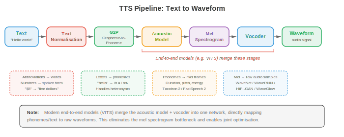
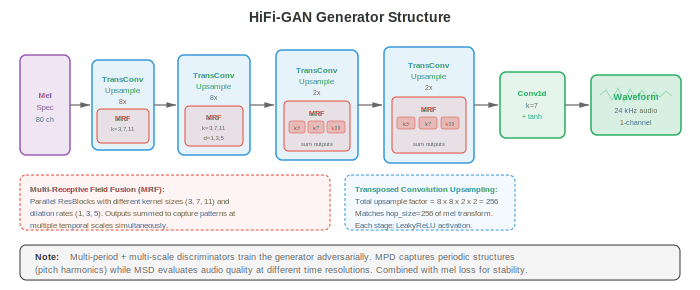
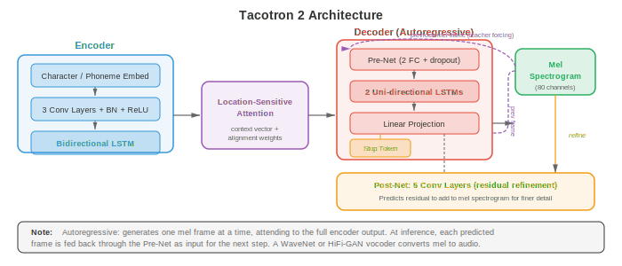
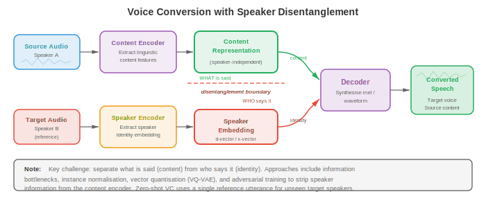

# 文本到语音与语音合成

*文本到语音合成反转了 ASR 流水线，从书面文字生成自然听感的音频。本文件涵盖 TTS 流水线（文本规范化、G2P、acoustic model、vocoder）、Tacotron、WaveNet、HiFi-GAN、voice cloning、voice conversion 与语音活动检测（VAD）。*

- 在第 01 篇文件中我们构建了信号处理工具箱：waveform、spectrogram、mel 滤波器组与 MFCC。在第 02 篇文件中我们把语音转为文字。现在我们把箭头反过来：给定文字，合成自然的语音。这就是 **text-to-speech (TTS)**，这个问题也开启了 voice conversion、voice cloning 与 voice activity detection 的大门。

- 可以把 TTS 想象成一场舞台演出。剧本就是文字输入。导演（acoustic model）决定每句台词该听起来如何——音高、节奏、重音。乐队（vocoder）随后演绎这部总谱，产生观众听到的实际声波。现代神经 TTS 用堪比真人的表现取代了基于规则系统的生硬机械发音。



- **Text-to-speech 流水线** 标准 TTS 流水线有四个阶段：(1) 文本规范化、(2) phoneme 转换、(3) acoustic model、(4) vocoder。一些现代系统将阶段 3 与 4 合并为单个 end-to-end 模型，但概念上的分解仍有用。

- **Text normalisation**（文本规范化）将原始文本转为可发音形式。缩写展开（"Dr." 展为 "Doctor"），数字转为词（"1984" 转为 "nineteen eighty-four"），货币符号口述化（"$5" 转为 "five dollars"），URL 与特殊字符被处理。该阶段常为基于规则、带语言特定语法，虽也存在神经规范化模型。此处错误会传播到下游每个阶段：若 "St." 被读作 "saint" 而非 "street"，整句都错。

- **Grapheme-to-phoneme (G2P) conversion**（字素到音素转换）将规范化文本映射为 phoneme 序列。英语以极不规则著称（"though"、"through"、"tough" 中 "ough" 都不同），因此常用词由词典查询（CMU Pronouncing Dictionary）处理，未登录词由神经序列到序列模型（第 06 章的 encoder-decoder 或第 07 章的 transformer）处理。浅层正字法的语言（西班牙语、芬兰语）需要更简单的 G2P。输出通常是 IPA（International Phonetic Alphabet）序列或等价的内部 phoneme 集。

- **Acoustic model** 消费 phoneme 序列并产出中间声学表示，几乎总是 **mel spectrogram**（第 01 篇文件）。mel spectrogram 捕捉每帧的 spectral envelope，编码了 vocoder 重建 waveform 所需的感知相关信息。acoustic model 必须决定 timing（每个 phoneme 持续多久）、pitch（基频 $F_0$）与 energy（响度）。

- **Vocoder** 接收 mel spectrogram 并生成原始音频 waveform。这是一个不适定的反问题：许多 waveform 可产生同一 spectrogram，因为 phase 信息被舍弃。经典 vocoder（Griffin-Lim、WORLD）使用迭代或信号模型方法，但神经 vocoder 现在在质量上占主导。

- **Vocoder：WaveNet**（van den Oord 等，2016）是首个产生近乎与真人录音难以区分的神经 vocoder。它自回归地建模 waveform，以所有先前样本为条件预测每个样本 $x_t$：

$$P(x) = \prod_{t=1}^{T} P(x_t \mid x_1, \ldots, x_{t-1}, c)$$

- 其中 $c$ 是条件信号（mel spectrogram）。每个样本 16 位，因此朴素地在 65536 个值上做 softmax 不可行。WaveNet 使用 **mu-law companding** 压缩到 256 个量化级，后续变体使用 mixture of logistics 分布。

- WaveNet 的核心构件是 **dilated causal convolution**（空洞因果卷积）。causal 意为滤波器权重只看过去样本（无未来泄漏）。dilated 意为滤波器以指数增长的间隔跳过样本：扩张因子 $1, 2, 4, 8, \ldots, 512$。这在保持参数量线性的同时给出指数大的感受野。

- 每层的 gated activation 为：

$$z = \tanh(W_{f} \ast x) \odot \sigma(W_{g} \ast x)$$

- 其中 $W_f$ 与 $W_g$ 是滤波器与门卷积权重，$\ast$ 表示 dilated causal convolution，$\odot$ 是逐元素乘法。这种门控机制（来自第 06 章的 LSTM）让网络控制信息流。

- WaveNet 质量极佳但推理速度令人痛苦：生成一秒 24 kHz 音频需要 24000 次顺序前向传播。这驱动了后续所有 vocoder 研究。

- **WaveRNN**（Kalchbrenner 等，2018）用单层循环网络取代 WaveNet 的深度卷积堆栈。它将每个 16 位样本拆为粗（高 8 位）与细（低 8 位）分量，各用一个 GRU（第 06 章）预测。这种双 softmax 方法在保持高质量的同时大幅减少计算。经内核仔细优化后，WaveRNN 在移动 CPU 上足够快以实时运行。

- **WaveGlow**（Prenger 等，2019）是基于 **flow**（流）的 vocoder，完全避免自回归生成。它使用一串可逆变换（affine coupling layer，第 06 章的 normalising flow）将简单 Gaussian 分布映射到 waveform 分布。训练通过变量替换公式最大化精确对数似然：

$$\log P(x) = \log P(z) + \sum_{i} \log \left| \det \frac{\partial f_i}{\partial f_{i-1}} \right|$$

- 其中 $z = f(x)$ 是将 $x$ 通过 flow 得到的 latent 变量。推理时，从 $z \sim \mathcal{N}(0, I)$ 采样，在单次并行前向中通过反转 flow 推出。WaveGlow 以模型大小（coupling layer 用大网络）换取生成速度。

- **HiFi-GAN**（Kong 等，2020）使用 **generative adversarial network** 从 mel spectrogram 合成 waveform。generator 通过一系列 transposed convolution 对 mel spectrogram 上采样，每个后接一个 **multi-receptive field fusion (MRF)** 模块。MRF 模块并行应用多个具有不同 kernel size 与 dilation rate 的残差块，然后求和输出。这使 generator 能同时捕捉多个时间尺度的模式。



- HiFi-GAN 使用两种判别器。**multi-period discriminator (MPD)** 将一维 waveform 以不同周期（2、3、5、7、11）折叠成二维，再应用二维卷积。这捕捉不同基频处的周期结构。**multi-scale discriminator (MSD)** 在原始 waveform、2× 下采样与 4× 下采样版本上操作，捕捉不同时间分辨率的模式。

- 训练目标组合对抗 loss、**mel spectrogram reconstruction loss**（合成与真值音频 mel spectrogram 的 L1 距离）与 **feature matching loss**（判别器中间特征的 L1 距离）：

$$\mathcal{L}_G = \mathcal{L}_{\text{adv}}(G) + \lambda_{\text{mel}} \mathcal{L}_{\text{mel}}(G) + \lambda_{\text{fm}} \mathcal{L}_{\text{fm}}(G)$$

- HiFi-GAN 取得与 WaveNet 相当的合成质量，同时快 1000× 以上，使单 GPU 上实时生成成为可能。

- **Neural source-filter (NSF) model** 将传统信号处理与神经网络结合。在经典 source-filter 模型中，浊音由一个 source 激励（基频 $F_0$ 处的周期脉冲列）经声道滤波器（spectral envelope）产生。NSF 模型用神经网络取代手工滤波器但保留显式 source 信号。输入 $F_0$ 轮廓提供纯数据驱动 vocoder 有时难以胜任的精细 pitch 控制。

- **Acoustic model：Tacotron**（Wang 等，2017）是首个将字符序列直接转为 mel spectrogram 的 end-to-end 神经 TTS 系统。它使用带 attention 的 encoder-decoder 架构（第 07 章）。encoder 用卷积组、highway 网络与双向 GRU 处理字符/phoneme 序列。decoder 是自回归 GRU，一次预测一帧 mel，以上一帧与 attention context 为输入。

- **Tacotron 2**（Shen 等，2018）显著改进了架构。encoder 是 3 层一维卷积堆栈接双向 LSTM（第 06 章）。decoder 是 2 层 LSTM，配 **location-sensitive attention**，它不仅以 encoder 输出与 decoder 状态为条件，还以之前步骤的累积 attention 权重为条件。这防止了 attention 跳过或重复词这一常见失败模式。



- decoder 步 $i$ 对 encoder 位置 $j$ 的 location-sensitive attention energy 为：

$$e_{i,j} = w^T \tanh(W_s s_{i-1} + W_h h_j + W_f f_{i,j} + b)$$

- 其中 $s_{i-1}$ 是上一 decoder 状态，$h_j$ 是位置 $j$ 的 encoder 输出，$f_{i,j}$ 是对累积 attention 权重 $\sum_{k<i} \alpha_{k,j}$ 做一维卷积得到的位置特征。attention 权重 $\alpha_{i,j} = \text{softmax}(e_{i,j})$。

- Tacotron 2 的 decoder 还在每步预测一个 **stop token** 概率，指示 mel spectrogram 何时结束。输出 mel spectrogram 再传给 vocoder（最初为 WaveNet，后被 HiFi-GAN 等取代）。

- Tacotron 2 的自回归性质意味着合成速度受 mel 帧数限制。对典型的每秒 80 帧 mel spectrogram，5 秒语句需 400 个顺序 decoder 步。

- **FastSpeech**（Ren 等，2019）用 **non-autoregressive**（非自回归）acoustic model 解决速度问题。FastSpeech 不再顺序生成 mel 帧，而是并行生成所有帧。关键挑战是确定每个 phoneme 应产生多少 mel 帧，FastSpeech 用 **duration predictor** 处理。

- duration predictor 是一个小型卷积网络，预测每个 phoneme 的整数时长（mel 帧数）。训练时，真值时长从预训练的自回归教师模型（Tacotron 2）的 attention 对齐中提取。推理时，用预测时长通过 **length regulator** 将 phoneme 级隐藏序列扩展到帧级——即把每个 phoneme 的隐藏表示重复预测的帧数。

- **FastSpeech 2**（Ren 等，2021）通过去除师生蒸馏改进 FastSpeech。它使用 forced alignment（来自第 02 篇文件的 acoustic model 框架）直接提取真值时长，并在时长之外添加显式的 **variance adaptor** 用于 pitch（$F_0$）与 energy。每个 adaptor 是一个小型卷积预测器，其输出条件化 decoder：

```math
\begin{aligned}
\hat{d}_i &= \text{DurationPredictor}(h_i) \\
\hat{p}_i &= \text{PitchPredictor}(h_i) \\
\hat{e}_i &= \text{EnergyPredictor}(h_i)
\end{aligned}
```

- 其中 $h_i$ 是 phoneme $i$ 的 encoder 隐藏状态。训练时用真值；推理时用预测值，对韵律有显式控制。这种可控性是 FastSpeech 2 的一大优势：调整 pitch、速度或 energy 如缩放预测器输出一般简单。

- FastSpeech 2 推理通常比 Tacotron 2 快 10-20×，并避免常见的自回归失败模式如跳词、重复与 attention 崩溃。

- **VITS**（Kim 等，2021）是 **end-to-end** TTS 模型，直接从文本生成 waveform，消除独立 vocoder 阶段。VITS 将条件变分自编码器（第 06 章）与 normalising flow 及对抗训练结合。posterior encoder 将真值 mel spectrogram 映射到 latent 空间，prior encoder 将 phoneme（经基于 transformer 的文本 encoder 与 duration predictor）映射到同一 latent 空间，decoder（基于 HiFi-GAN）从 latent 样本生成 waveform。

- VITS 的训练目标组合：
    - **Reconstruction loss**：VAE 迫使 latent 分布编码声学信息
    - **KL divergence**：对齐文本条件先验与音频条件后验
    - **Adversarial loss**：判别器保证 waveform 质量
    - **Duration loss**：训练随机 duration predictor

- VITS 质量高于两阶段系统（FastSpeech 2 + HiFi-GAN），因为 acoustic model 与 vocoder 联合优化，避免了两阶段系统中预测与真值 mel spectrogram 不匹配造成的退化。

- **VALL-E**（Wang 等，2023）将 TTS 根本性地重构为离散音频 token 上的 **language modelling problem**。它使用神经音频 codec（EnCodec）将语音表示为来自多个 codebook level 的离散码序列。给定文本 prompt 与一段 3 秒 enrollment 语句（同样编码为离散 token），VALL-E 用 transformer 语言模型自回归预测音频 token。

- VALL-E 使用两个模型：一个 **autoregressive (AR) model** 逐 token 生成第一个 codebook level，一个 **non-autoregressive (NAR) model** 以第一个 level 与彼此为条件并行预测剩余 codebook level。这种 codec 语言模型方法实现了惊人的 zero-shot voice cloning：3 秒样本足以再现说话人的声音、音色乃至情感色彩。

- **StyleTTS**（Li 等，2022）与 **StyleTTS 2** 将语音解耦为内容与风格两部分。style encoder 从参考音频提取 style vector，捕捉说话人身份、韵律与录音条件。推理时，风格可从学到的先验分布采样或从参考语句迁移。StyleTTS 2 使用 diffusion model（第 08 章）作为风格先验，生成多样且自然的韵律。

- **Kokoro**（2024）是一个轻量、高质量的开源 TTS 模型，以小尺寸（约 82M 参数）与令人印象深刻的自然度著称。它使用 StyleTTS 2 启发的架构配基于 diffusion 的风格先验与 fine-tuning 的 ISTFTNet vocoder，后者直接预测 STFT 系数（第 01 篇文件）而非原始 waveform 样本。尽管尺寸仅为 VALL-E 等模型的一小部分，Kokoro 在英语、日语、法语、韩语与中文上取得接近人类的自然度，表明精心策划的训练数据与高效架构设计可与暴力规模竞争。Kokoro 的小体积使其适合本地与边缘部署。

- **Orpheus**（Canopy Labs，2025）是基于 VALL-E 开创的 **codec language model** 范式的开源 TTS 模型家族（1B 与 3B 参数）。Orpheus 以 LLM 骨干（fine-tuned Llama 3）进一步推进该理念，直接生成 SNAC 音频 codec token。其突出特征是拟人化的情感表现力：它处理笑声、叹气、犹豫与情感韵律时自然度惊人。Orpheus 可在输入文本中用 `[laugh]` 或 `[sigh]` 等 tag 提示，对副语言表达进行精细控制。

- **Dia**（Nari Labs，2025）是一个开源对话 TTS 模型，从单个文本转录生成真实的多说话人对话。基于 1.6B 参数的 encoder-decoder transformer，Dia 处理话轮转换、说话人特定声音与非语言线索（笑声、停顿）。它还支持从短音频 prompt 进行 voice cloning，在对话上下文中实现 zero-shot 说话人生成。

- **Sesame CSM**（Conversational Speech Model，2025）聚焦自然的多轮对话语音。Sesame 不优化朗读式 TTS，而是建模真实对话的动态：backchannel（"uh huh"）、打断、说话人间的节奏变化与情感响应。模型使用以对话上下文（文本与音频历史）为条件的 transformer 骨干，产出随对话流自适应风格的语音。

- **Fish Speech**（Fish Audio，2024）是一个开源 TTS 系统，使用双自回归架构：大语言模型从文本生成 semantic token，较小模型将其转为 VQGAN acoustic token，再由 vocoder 解码为 waveform。Fish Speech 支持从 10-15 秒参考进行 zero-shot voice cloning，延迟低、适合实时应用。其模块化设计允许独立替换组件（如不同 vocoder）。

- **ChatTTS**（2024）是面向聊天机器人与虚拟助手等对话应用的开源对话 TTS 模型。它生成自然、对话风格的语音，并通过文本输入中嵌入的特殊 token 对韵律特征（笑声、停顿、填充词）进行精细控制。ChatTTS 支持中英混合合成与多说话人生成。

- **Bark**（Suno，2023）是基于 transformer 的开源模型，从文本 prompt 生成语音、音乐与音效。它使用三阶段 transformer 流水线（文本 → semantic token → 粗 acoustic token → 细 acoustic token），支持 voice cloning、多语言合成以及音乐与环境声等非语音音频。Bark 的通用性以可控性为代价——它比专用 TTS 系统精度低但更灵活。

- **Parler-TTS**（Hugging Face，2024）采用 **natural language description** 方式控制声音：用户无需参考音频片段即可获得风格，只需提供如 "a female speaker with a warm, expressive voice in a quiet room" 的文本描述。Parler-TTS 在标注语音数据上训练，每条语句配有一段关于说话风格的自然语言描述，实现无需任何参考音频的直观控制。

- **Neuphonic** 是基于 API 的 TTS 平台，针对超低延迟语音合成优化，面向实时语音代理与对话式 AI 应用。它通过在完整输入文本到位前即开始生成音频的流式架构，实现低于 100 ms 的首音时间。Neuphonic 关注部署与延迟优化层而非新颖模型架构，为现代神经 TTS 提供生产级基础设施。

- **KittenTTS** 是为高效与低资源部署设计的紧凑、快速 TTS 模型。它优先考虑最小延迟与小模型尺寸，面向边缘与嵌入式应用，以一定自然度换取在 CPU 与移动设备上的实时性能。

- 现代 TTS 格局正分化为两种范式：(1) **codec language model**（VALL-E、Orpheus、Fish Speech）将语音生成视为离散音频码上的 next-token 预测，利用 LLM 的缩放定律；(2) **flow/diffusion-based model**（VITS、StyleTTS 2、Kokoro）通过迭代精炼生成连续 mel spectrogram 或 waveform。codec LM 擅长 zero-shot cloning 与表现力；flow/diffusion 模型通常更小更快。两者都在快速向人类级自然度收敛。

- **Prosody modelling**（韵律建模）控制语音的"音乐性"：pitch、duration、energy、节奏与语调。没有好的韵律，即使单个 phoneme 清晰，合成语音听起来也平淡机械。可以把韵律想象成单调 GPS 语音与富有表现力的有声书朗读者之间的差别。

- **Pitch**（基频 $F_0$）是感知到的语音高低。问句末尾升高，陈述末尾降低，情感语音中持续变化。$F_0$ 用 CREPE（神经 pitch 跟踪器）或 YIN（基于 autocorrelation，来自第 01 篇文件）等算法从音频提取。在 TTS 中，pitch 由 acoustic model 预测（FastSpeech 2 的 pitch predictor）或隐式学习（Tacotron 2）。

- **Duration** 决定语速与节奏。重读音节更长，功能词更短，停顿标记短语边界。duration 建模在非自回归模型中显式（FastSpeech），在自回归模型中隐式（Tacotron 的 attention 对齐决定 duration）。

- **Energy**（响度）承载强调。"I didn't say HE stole it" 与 "I didn't say he STOLE it" 含义不同，完全通过 energy 模式传达。

- **Style embedding** 捕捉更高层韵律模式。**Global Style Token (GST)** 框架（Wang 等，2018）学习一组 style token（对所学 embedding 集合的软 attention），捕捉如"兴奋""悲伤""耳语"等说话风格。style embedding 从参考语句提取并加到 encoder 输出，允许推理时进行风格迁移。

- **Voice conversion (VC)** 在保持语言内容的同时改变语句的说话人身份。想象录下自己的声音并让输出听起来像特定目标说话人。VC 需要把说话人身份与内容解耦。



- **Speaker embedding**（第 04 篇文件详述）将说话人身份编码为定维向量。可来自预训练的说话人确认模型（x-vector、ECAPA-TDNN）。在 VC 中，源语音被编码为与说话人无关的内容表示，再用目标 speaker embedding 解码。

- **Disentangled representation** 将语音分解为独立因子：内容（phoneme）、说话人身份、pitch 与节奏。方法包括：
    - **Information bottleneck**：将内容表示压缩到丢失说话人信息的程度（AutoVC）
    - **Adversarial training**：在内容表示上训练说话人分类器并用梯度反转去除说话人信息
    - **Vector quantisation**：VQ-VAE 强制内容通过离散瓶颈，天然剥离说话人身份（因为 codebook 项表示语音类别而非说话人特征）

- **Voice cloning** 以目标说话人声音合成语音。**Multi-speaker TTS** 在许多说话人的数据上训练，以 speaker embedding 条件化模型。推理时，从 enrollment 音频提取新说话人的 embedding 并用于条件化生成。

- **Few-shot voice cloning** 用少量数据（几分钟）适配新说话人。speaker encoder 从 enrollment 音频提取 embedding，TTS 模型以该 embedding 为条件生成语音。这是 SV2TTS（Jia 等，2018）所用的方法：独立训练的 speaker encoder、以 speaker embedding 为条件的 Tacotron 2 合成器与 WaveRNN vocoder。

- **Zero-shot voice cloning** 无需任何适配：单条短语句（3-30 秒）即可。VALL-E 通过将 enrollment 音频作为语言模型的 prompt 实现。模型学会以同一声音继续生成，因为它在大规模多说话人数据上训练，其中语句内的声音一致性是统计常态。

- **Voice activity detection (VAD)** 在每帧回答一个简单的二元问题：是否有人在说话？尽管简单，VAD 是 ASR（第 02 篇文件）、speaker diarisation（第 04 篇文件）与降噪（第 05 篇文件）的关键预处理步骤。好的 VAD 通过跳过静音减少计算，并通过防止噪声被当作语音处理提升准确率。

- 经典 VAD 使用 energy 阈值（语音比静音响）、zero-crossing rate（语音有特征性的过零模式）与谱特征。这些在低信噪比的噪声环境下失效。

- **Neural VAD** 模型将问题视为帧级二元分类。小型 RNN 或 CNN 接收声学特征（第 01 篇文件的 log mel 能量）并预测语音/非语音概率。

- **WebRTC VAD**（Google）是经典的轻量 VAD，使用基于 GMM 的分类器作用于简单谱特征。它在四个激进级别（0-3）上运行，速度极快，但在音乐、非语音发声与低信噪比环境下表现不佳。因其零依赖的简洁性，仍作为基线被广泛使用。

- **Silero VAD**（Silero Team，2021）是事实上的生产级神经 VAD 标准。其架构是一小组 depthwise separable 一维卷积（第 08 章 MobileNet 思想应用于音频）后接单层 LSTM 处理时间上下文，最后线性 head 产生每帧语音概率。整个模型小于 2MB（约 1M 参数），以 30-100 ms 块处理音频。
    - **输入**：原始 16 kHz 音频（无手工特征提取——卷积前端直接从 waveform 自学特征）。
    - **Windowed stateful inference**：LSTM 隐藏状态在块间延续，故模型可处理流式音频而无需重处理整个历史。每次调用处理 30、60 或 100 ms 块并返回 $[0, 1]$ 的语音概率。
    - **Adaptive thresholding**：Silero VAD 不用单一固定阈值，而使用独立的起始与结束阈值配最小语音/静音时长，防止噪声边界上的快速翻转。语音段必须超过起始阈值并持续最小时长才被确认，静音必须持续低于结束阈值才关闭该段。
    - **性能**：Silero VAD 在 CPU 上以 1-2% 的实时因子运行（处理 1 秒音频约 10-20 ms），适合边缘设备、手机与实时流水线。它在噪声与音乐密集音频上显著优于 WebRTC VAD，同时小到可设备端部署。
    - Silero VAD 常用作 Whisper（第 02 篇文件）的前端，将长音频切分为语句级块以供转录，并用于 speaker diarisation 流水线（第 04 篇文件）以在提取 speaker embedding 前识别语音区段。

- **Acoustic activity detection (AAD)** 将 VAD 推广到检测任何声学活动，不限于语音。这在智能家居设备、安防系统与野生动物监测中有用。AAD 模型检测如玻璃破碎、狗叫或警报等事件，常用第 04 篇文件描述的音频分类框架。

- **TTS 的评估指标** 同时度量客观质量与主观自然度：
    - **Mean Opinion Score (MOS)**：人类听者在 1-5 尺度上评分自然度。金标准，但昂贵且慢。
    - **Mel cepstral distortion (MCD)**：合成与参考 mel 倒谱的距离。越低越好，但与感知不总是相关。
    - **PESQ / POLQA**：最初为电话设计的标准化感知评估指标。
    - **Speaker similarity**：合成与参考音频 speaker embedding 的余弦相似度（与 voice cloning 相关）。
    - **Intelligibility**：将合成音频送入 ASR 系统（第 02 篇文件）并计算 WER 来度量。

## 编程任务（使用 CoLab 或 notebook）

- **任务 1：从 mel spectrogram 实现 Griffin-Lim vocoder。** 实现 Griffin-Lim 迭代相位重建算法，将 mel spectrogram 转回 waveform。这演示了 vocoder 问题以及为何需要神经 vocoder。

```python
import jax
import jax.numpy as jnp
import matplotlib.pyplot as plt

# Generate a synthetic waveform (sum of harmonics simulating a vowel)
sr = 16000
duration = 1.0
t = jnp.linspace(0, duration, int(sr * duration))
f0 = 220.0  # fundamental frequency
waveform = (
    0.6 * jnp.sin(2 * jnp.pi * f0 * t) +
    0.3 * jnp.sin(2 * jnp.pi * 2 * f0 * t) +
    0.1 * jnp.sin(2 * jnp.pi * 3 * f0 * t)
)

# Compute STFT
n_fft = 1024
hop_length = 256
window = jnp.hanning(n_fft)

def stft(signal, n_fft, hop_length, window):
    """Compute Short-Time Fourier Transform."""
    n_frames = 1 + (len(signal) - n_fft) // hop_length
    frames = jnp.stack([
        signal[i * hop_length : i * hop_length + n_fft] * window
        for i in range(n_frames)
    ])
    return jnp.fft.rfft(frames, n=n_fft)

def istft(stft_matrix, hop_length, window, length):
    """Compute inverse STFT with overlap-add."""
    n_fft = (stft_matrix.shape[1] - 1) * 2
    n_frames = stft_matrix.shape[0]
    frames = jnp.fft.irfft(stft_matrix, n=n_fft)
    frames = frames * window[None, :]
    output = jnp.zeros(length)
    for i in range(n_frames):
        start = i * hop_length
        end = start + n_fft
        if end <= length:
            output = output.at[start:end].add(frames[i])
    return output

# Forward STFT
S = stft(waveform, n_fft, hop_length, window)
magnitude = jnp.abs(S)

# Mel filterbank
n_mels = 80
mel_low = 0.0
mel_high = 2595 * jnp.log10(1 + (sr / 2) / 700)
mel_points = jnp.linspace(mel_low, mel_high, n_mels + 2)
hz_points = 700 * (10 ** (mel_points / 2595) - 1)
freq_bins = jnp.floor((n_fft + 1) * hz_points / sr).astype(int)

mel_filterbank = jnp.zeros((n_mels, n_fft // 2 + 1))
for m in range(n_mels):
    f_left = freq_bins[m]
    f_center = freq_bins[m + 1]
    f_right = freq_bins[m + 2]
    for k in range(f_left, f_center):
        mel_filterbank = mel_filterbank.at[m, k].set(
            (k - f_left) / max(f_center - f_left, 1)
        )
    for k in range(f_center, f_right):
        mel_filterbank = mel_filterbank.at[m, k].set(
            (f_right - k) / max(f_right - f_center, 1)
        )

# To mel and back (pseudo-inverse)
mel_spec = magnitude @ mel_filterbank.T
magnitude_reconstructed = mel_spec @ jnp.linalg.pinv(mel_filterbank.T)
magnitude_reconstructed = jnp.maximum(magnitude_reconstructed, 1e-7)

# Griffin-Lim algorithm
def griffin_lim(magnitude, n_iter, hop_length, window, signal_length):
    """Iterative phase reconstruction."""
    n_fft = (magnitude.shape[1] - 1) * 2
    key = jax.random.PRNGKey(42)
    phase = jax.random.uniform(key, magnitude.shape, minval=-jnp.pi, maxval=jnp.pi)

    for _ in range(n_iter):
        complex_spec = magnitude * jnp.exp(1j * phase)
        signal = istft(complex_spec, hop_length, window, signal_length)
        reanalysis = stft(signal, n_fft, hop_length, window)
        phase = jnp.angle(reanalysis)

    complex_spec = magnitude * jnp.exp(1j * phase)
    return istft(complex_spec, hop_length, window, signal_length)

reconstructed = griffin_lim(magnitude_reconstructed, n_iter=60, hop_length=hop_length,
                            window=window, signal_length=len(waveform))

# Plot comparison
fig, axes = plt.subplots(3, 1, figsize=(12, 8))

axes[0].plot(t[:1000], waveform[:1000], color='#3498db', linewidth=0.8)
axes[0].set_title('Original Waveform')
axes[0].set_ylabel('Amplitude')

axes[1].imshow(jnp.log1p(mel_spec.T), aspect='auto', origin='lower', cmap='magma')
axes[1].set_title('Mel Spectrogram (intermediate representation)')
axes[1].set_ylabel('Mel bin')

axes[2].plot(t[:1000], reconstructed[:1000], color='#e74c3c', linewidth=0.8)
axes[2].set_title('Griffin-Lim Reconstructed Waveform (60 iterations)')
axes[2].set_xlabel('Time (s)')
axes[2].set_ylabel('Amplitude')

plt.tight_layout()
plt.show()

# Measure reconstruction error
mse = jnp.mean((waveform[:len(reconstructed)] - reconstructed[:len(waveform)]) ** 2)
print(f"MSE between original and reconstructed: {mse:.6f}")
print("Note: phase information loss through mel inversion causes artifacts.")
```

- **任务 2：Duration predictor（FastSpeech 式）。** 训练一个小型卷积 duration predictor，将 phoneme embedding 映射到时长。这是实现非自回归 TTS 的核心组件。

```python
import jax
import jax.numpy as jnp
import jax.random as jr
import matplotlib.pyplot as plt

# Simulate phoneme sequences with ground-truth durations
# In real TTS, durations come from forced alignment or teacher attention
def generate_synthetic_data(key, n_samples=200, max_phonemes=30, embed_dim=64):
    """Generate synthetic phoneme embeddings and durations."""
    keys = jr.split(key, 4)
    lengths = jr.randint(keys[0], (n_samples,), 5, max_phonemes)

    all_embeddings = []
    all_durations = []
    all_masks = []

    for i in range(n_samples):
        L = int(lengths[i])
        emb = jr.normal(keys[1], (max_phonemes, embed_dim))
        # Durations: vowels (even indices) are longer, consonants shorter
        base_dur = jnp.where(jnp.arange(max_phonemes) % 2 == 0, 8.0, 4.0)
        noise = jr.normal(jr.fold_in(keys[2], i), (max_phonemes,)) * 1.5
        dur = jnp.clip(base_dur + noise, 1.0, 20.0).astype(jnp.float32)
        mask = (jnp.arange(max_phonemes) < L).astype(jnp.float32)

        all_embeddings.append(emb)
        all_durations.append(dur * mask)
        all_masks.append(mask)

    return (jnp.stack(all_embeddings), jnp.stack(all_durations),
            jnp.stack(all_masks))

key = jr.PRNGKey(42)
embeddings, durations, masks = generate_synthetic_data(key)

# Duration predictor: 2-layer 1D convolution + linear projection
def init_duration_predictor(key, embed_dim=64, hidden_dim=128, kernel_size=3):
    """Initialise duration predictor weights."""
    keys = jr.split(key, 4)
    scale1 = jnp.sqrt(2.0 / (embed_dim * kernel_size))
    scale2 = jnp.sqrt(2.0 / (hidden_dim * kernel_size))
    params = {
        'conv1_w': jr.normal(keys[0], (kernel_size, embed_dim, hidden_dim)) * scale1,
        'conv1_b': jnp.zeros(hidden_dim),
        'conv2_w': jr.normal(keys[1], (kernel_size, hidden_dim, hidden_dim)) * scale2,
        'conv2_b': jnp.zeros(hidden_dim),
        'linear_w': jr.normal(keys[2], (hidden_dim, 1)) * jnp.sqrt(2.0 / hidden_dim),
        'linear_b': jnp.zeros(1),
    }
    return params

def duration_predictor(params, x):
    """Predict log-durations from phoneme embeddings. x: (batch, seq, embed)."""
    # Conv layer 1 with ReLU
    h = jax.lax.conv_general_dilated(
        x.transpose(0, 2, 1),  # (batch, embed, seq)
        params['conv1_w'].transpose(2, 1, 0),  # (out, in, kernel)
        window_strides=(1,), padding='SAME'
    ).transpose(0, 2, 1) + params['conv1_b']  # back to (batch, seq, hidden)
    h = jax.nn.relu(h)

    # Conv layer 2 with ReLU
    h = jax.lax.conv_general_dilated(
        h.transpose(0, 2, 1),
        params['conv2_w'].transpose(2, 1, 0),
        window_strides=(1,), padding='SAME'
    ).transpose(0, 2, 1) + params['conv2_b']
    h = jax.nn.relu(h)

    # Linear projection to scalar
    log_dur = (h @ params['linear_w'] + params['linear_b']).squeeze(-1)
    return log_dur

# Loss: MSE on log-durations (standard in FastSpeech)
def loss_fn(params, embeddings, durations, masks):
    log_dur_pred = duration_predictor(params, embeddings)
    log_dur_true = jnp.log(jnp.clip(durations, 1.0, None))
    sq_err = (log_dur_pred - log_dur_true) ** 2 * masks
    return jnp.sum(sq_err) / jnp.sum(masks)

grad_fn = jax.jit(jax.value_and_grad(loss_fn))

# Training loop
params = init_duration_predictor(jr.PRNGKey(0))
lr = 1e-3
losses = []

for epoch in range(300):
    loss_val, grads = grad_fn(params, embeddings, durations, masks)
    params = jax.tree.map(lambda p, g: p - lr * g, params, grads)
    losses.append(float(loss_val))

# Evaluate on a sample
log_dur_pred = duration_predictor(params, embeddings[:1])
dur_pred = jnp.exp(log_dur_pred[0])
dur_true = durations[0]
mask = masks[0]
valid_len = int(jnp.sum(mask))

fig, axes = plt.subplots(1, 2, figsize=(14, 5))

axes[0].plot(losses, color='#3498db', linewidth=1.5)
axes[0].set_xlabel('Epoch')
axes[0].set_ylabel('MSE Loss (log-duration)')
axes[0].set_title('Duration Predictor Training')
axes[0].set_yscale('log')

x_pos = jnp.arange(valid_len)
width = 0.35
axes[1].bar(x_pos - width/2, dur_true[:valid_len], width, color='#27ae60',
            label='Ground truth', alpha=0.8)
axes[1].bar(x_pos + width/2, dur_pred[:valid_len], width, color='#e74c3c',
            label='Predicted', alpha=0.8)
axes[1].set_xlabel('Phoneme index')
axes[1].set_ylabel('Duration (frames)')
axes[1].set_title('Duration Prediction vs Ground Truth')
axes[1].legend()

plt.tight_layout()
plt.show()
```

- **任务 3：使用上采样卷积的简单神经 vocoder。** 构建一个最小 HiFi-GAN 式 generator，用 transposed convolution 与残差块将 mel spectrogram 上采样为 waveform。

```python
import jax
import jax.numpy as jnp
import jax.random as jr
import matplotlib.pyplot as plt

def init_residual_block(key, channels, kernel_size, dilation):
    """Initialise a dilated residual convolution block."""
    k1, k2 = jr.split(key)
    scale = jnp.sqrt(2.0 / (channels * kernel_size))
    return {
        'conv1_w': jr.normal(k1, (kernel_size, channels, channels)) * scale,
        'conv1_b': jnp.zeros(channels),
        'conv2_w': jr.normal(k2, (kernel_size, channels, channels)) * scale,
        'conv2_b': jnp.zeros(channels),
        'dilation': dilation
    }

def residual_block(params, x):
    """x: (batch, time, channels). Dilated conv residual block with LeakyReLU."""
    h = jax.nn.leaky_relu(x, negative_slope=0.1)
    # Simplified: use standard conv (dilation handled conceptually)
    h = jax.lax.conv_general_dilated(
        h.transpose(0, 2, 1),
        params['conv1_w'].transpose(2, 1, 0),
        window_strides=(1,),
        padding='SAME',
        rhs_dilation=(params['dilation'],)
    ).transpose(0, 2, 1) + params['conv1_b']
    h = jax.nn.leaky_relu(h, negative_slope=0.1)
    h = jax.lax.conv_general_dilated(
        h.transpose(0, 2, 1),
        params['conv2_w'].transpose(2, 1, 0),
        window_strides=(1,),
        padding='SAME'
    ).transpose(0, 2, 1) + params['conv2_b']
    return x + h

def init_generator(key, n_mels=80, upsample_rates=(8, 8, 4),
                   channels=128):
    """Initialise a minimal HiFi-GAN-style generator."""
    keys = jr.split(key, 10)
    params = {}

    # Input projection: mel bins -> channels
    params['input_w'] = jr.normal(keys[0], (7, n_mels, channels)) * 0.02
    params['input_b'] = jnp.zeros(channels)

    # Upsample blocks (transposed convolutions)
    in_ch = channels
    for i, rate in enumerate(upsample_rates):
        k_size = rate * 2
        scale = jnp.sqrt(2.0 / (in_ch * k_size))
        out_ch = in_ch // 2
        params[f'up{i}_w'] = jr.normal(keys[i+1], (k_size, in_ch, out_ch)) * scale
        params[f'up{i}_b'] = jnp.zeros(out_ch)
        # Residual blocks at each scale
        params[f'res{i}_0'] = init_residual_block(jr.fold_in(keys[i+4], 0),
                                                    out_ch, 3, 1)
        params[f'res{i}_1'] = init_residual_block(jr.fold_in(keys[i+4], 1),
                                                    out_ch, 3, 3)
        in_ch = out_ch

    # Output projection to mono waveform
    params['output_w'] = jr.normal(keys[8], (7, in_ch, 1)) * 0.02
    params['output_b'] = jnp.zeros(1)
    params['upsample_rates'] = upsample_rates

    return params

def generator_forward(params, mel):
    """mel: (batch, time, n_mels) -> waveform: (batch, time * prod(rates), 1)."""
    # Input projection
    h = jax.lax.conv_general_dilated(
        mel.transpose(0, 2, 1),
        params['input_w'].transpose(2, 1, 0),
        window_strides=(1,), padding='SAME'
    ).transpose(0, 2, 1) + params['input_b']

    for i, rate in enumerate(params['upsample_rates']):
        h = jax.nn.leaky_relu(h, negative_slope=0.1)
        # Upsample via transposed convolution
        k_size = rate * 2
        h = jax.lax.conv_transpose(
            h.transpose(0, 2, 1),
            params[f'up{i}_w'].transpose(2, 1, 0),
            strides=(rate,),
            padding='SAME'
        ).transpose(0, 2, 1) + params[f'up{i}_b']
        # Residual blocks
        h = residual_block(params[f'res{i}_0'], h)
        h = residual_block(params[f'res{i}_1'], h)

    h = jax.nn.leaky_relu(h, negative_slope=0.1)
    out = jax.lax.conv_general_dilated(
        h.transpose(0, 2, 1),
        params['output_w'].transpose(2, 1, 0),
        window_strides=(1,), padding='SAME'
    ).transpose(0, 2, 1) + params['output_b']

    return jnp.tanh(out)

# Create a synthetic mel spectrogram (simulating a vowel)
n_mels = 80
n_frames = 50
mel = jnp.zeros((1, n_frames, n_mels))
# Add energy in low-frequency mel bins (simulating formants)
mel = mel.at[:, :, 5:15].set(1.0)
mel = mel.at[:, :, 20:25].set(0.6)

# Initialise and run generator
key = jr.PRNGKey(42)
params = init_generator(key, n_mels=n_mels, upsample_rates=(8, 8, 4),
                         channels=128)
waveform = generator_forward(params, mel)

print(f"Input mel shape:  {mel.shape}")
print(f"Output waveform shape: {waveform.shape}")
print(f"Upsample factor: {8 * 8 * 4} = {8*8*4}x")

fig, axes = plt.subplots(2, 1, figsize=(12, 6))

axes[0].imshow(mel[0].T, aspect='auto', origin='lower', cmap='magma')
axes[0].set_title('Input Mel Spectrogram')
axes[0].set_ylabel('Mel bin')
axes[0].set_xlabel('Frame')

waveform_np = waveform[0, :, 0]
axes[1].plot(waveform_np[:2000], color='#9b59b6', linewidth=0.5)
axes[1].set_title('Generator Output Waveform (untrained - random noise)')
axes[1].set_ylabel('Amplitude')
axes[1].set_xlabel('Sample')

plt.tight_layout()
plt.show()
print("Note: The output is noise because the generator is untrained.")
print("In practice, adversarial + mel loss training shapes this into speech.")
```

- **任务 4：用简单 RNN 做语音活动检测。** 在合成音频特征上训练一个小型基于 GRU 的 VAD 模型，将帧分类为语音或静音。

```python
import jax
import jax.numpy as jnp
import jax.random as jr
import matplotlib.pyplot as plt

# Generate synthetic log-mel energy features with speech/silence labels
def generate_vad_data(key, n_sequences=100, n_frames=200, n_features=40):
    """Simulate log-mel features: speech regions are higher energy with structure."""
    keys = jr.split(key, 5)
    all_features = []
    all_labels = []

    for i in range(n_sequences):
        k = jr.fold_in(keys[0], i)
        k1, k2, k3 = jr.split(k, 3)

        # Random speech/silence pattern
        label = jnp.zeros(n_frames)
        n_segments = jr.randint(k1, (), 2, 6)
        for seg in range(int(n_segments)):
            start = jr.randint(jr.fold_in(k2, seg), (), 0, n_frames - 20)
            length = jr.randint(jr.fold_in(k3, seg), (), 10, 50)
            end = jnp.minimum(start + length, n_frames)
            label = label.at[int(start):int(end)].set(1.0)

        # Features: speech frames have higher energy + spectral structure
        noise = jr.normal(jr.fold_in(keys[1], i), (n_frames, n_features)) * 0.3
        speech_pattern = jnp.outer(label, jnp.exp(-jnp.arange(n_features) / 15.0))
        features = speech_pattern * 2.0 + noise + 0.1

        all_features.append(features)
        all_labels.append(label)

    return jnp.stack(all_features), jnp.stack(all_labels)

key = jr.PRNGKey(123)
features, labels = generate_vad_data(key)
train_features, train_labels = features[:80], labels[:80]
test_features, test_labels = features[80:], labels[80:]

# Simple GRU-based VAD model
def init_vad_model(key, input_dim=40, hidden_dim=64):
    keys = jr.split(key, 6)
    scale_ih = jnp.sqrt(2.0 / input_dim)
    scale_hh = jnp.sqrt(2.0 / hidden_dim)
    return {
        'W_z': jr.normal(keys[0], (input_dim, hidden_dim)) * scale_ih,
        'U_z': jr.normal(keys[1], (hidden_dim, hidden_dim)) * scale_hh,
        'b_z': jnp.zeros(hidden_dim),
        'W_r': jr.normal(keys[2], (input_dim, hidden_dim)) * scale_ih,
        'U_r': jr.normal(keys[3], (hidden_dim, hidden_dim)) * scale_hh,
        'b_r': jnp.zeros(hidden_dim),
        'W_h': jr.normal(keys[4], (input_dim, hidden_dim)) * scale_ih,
        'U_h': jr.normal(keys[5], (hidden_dim, hidden_dim)) * scale_hh,
        'b_h': jnp.zeros(hidden_dim),
        'W_out': jr.normal(jr.fold_in(keys[0], 99), (hidden_dim, 1)) * 0.1,
        'b_out': jnp.zeros(1),
    }

def gru_step(params, h, x):
    """Single GRU step."""
    z = jax.nn.sigmoid(x @ params['W_z'] + h @ params['U_z'] + params['b_z'])
    r = jax.nn.sigmoid(x @ params['W_r'] + h @ params['U_r'] + params['b_r'])
    h_tilde = jnp.tanh(x @ params['W_h'] + (r * h) @ params['U_h'] + params['b_h'])
    h_new = (1 - z) * h + z * h_tilde
    return h_new

def vad_forward(params, x):
    """x: (batch, time, features) -> logits: (batch, time)."""
    batch_size, n_frames, _ = x.shape
    hidden_dim = params['W_z'].shape[1]
    h = jnp.zeros((batch_size, hidden_dim))

    outputs = []
    for t in range(n_frames):
        h = gru_step(params, h, x[:, t, :])
        logit = (h @ params['W_out'] + params['b_out']).squeeze(-1)
        outputs.append(logit)

    return jnp.stack(outputs, axis=1)

def bce_loss(params, features, labels):
    """Binary cross-entropy loss for VAD."""
    logits = vad_forward(params, features)
    probs = jax.nn.sigmoid(logits)
    probs = jnp.clip(probs, 1e-7, 1 - 1e-7)
    loss = -(labels * jnp.log(probs) + (1 - labels) * jnp.log(1 - probs))
    return jnp.mean(loss)

grad_fn = jax.jit(jax.value_and_grad(bce_loss))

# Training
params = init_vad_model(jr.PRNGKey(0))
lr = 5e-3
losses = []

for epoch in range(200):
    loss_val, grads = grad_fn(params, train_features, train_labels)
    params = jax.tree.map(lambda p, g: p - lr * g, params, grads)
    losses.append(float(loss_val))
    if epoch % 50 == 0:
        print(f"Epoch {epoch}: loss = {loss_val:.4f}")

# Evaluate on test set
test_logits = vad_forward(params, test_features)
test_preds = (jax.nn.sigmoid(test_logits) > 0.5).astype(jnp.float32)
accuracy = jnp.mean(test_preds == test_labels)
print(f"\nTest accuracy: {accuracy:.4f}")

# Visualise a test example
idx = 0
fig, axes = plt.subplots(3, 1, figsize=(14, 7))

axes[0].imshow(test_features[idx].T, aspect='auto', origin='lower', cmap='magma')
axes[0].set_title('Log-Mel Energy Features')
axes[0].set_ylabel('Mel bin')

axes[1].fill_between(range(200), test_labels[idx], alpha=0.4, color='#27ae60',
                     label='Ground truth')
axes[1].plot(jax.nn.sigmoid(test_logits[idx]), color='#e74c3c',
             linewidth=1.5, label='Predicted probability')
axes[1].axhline(0.5, color='gray', linestyle='--', linewidth=0.8)
axes[1].set_ylabel('Speech probability')
axes[1].legend()
axes[1].set_title('VAD Predictions')

axes[2].fill_between(range(200), test_labels[idx], alpha=0.4, color='#27ae60',
                     label='Ground truth')
axes[2].fill_between(range(200), test_preds[idx], alpha=0.4, color='#f39c12',
                     label='Predicted (threshold=0.5)')
axes[2].set_ylabel('Speech / Silence')
axes[2].set_xlabel('Frame')
axes[2].legend()
axes[2].set_title('VAD Binary Decision')

plt.tight_layout()
plt.show()
```
