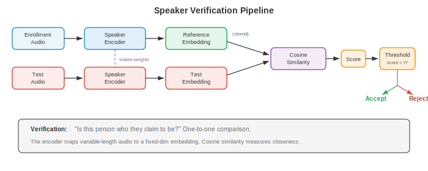
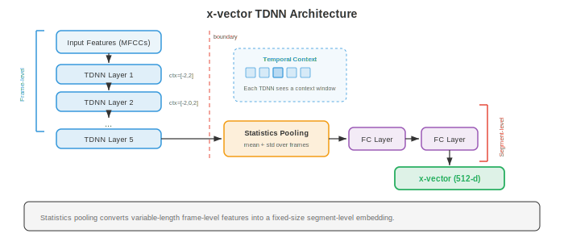
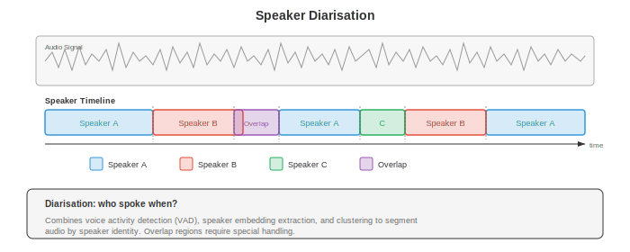
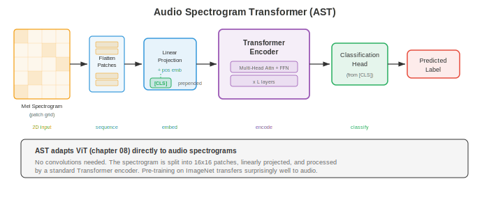

# Анализ дикторов и аудио

*Анализ дикторов и аудио позволяет определить, кто говорит, когда говорит и какие неречевые звуки присутствуют в записи. В этом файле рассматриваются верификация и идентификация диктора, i-векторы, d-векторы, x-векторы, диаризация дикторов, классификация аудиособытий, поиск музыкальной информации и распознавание эмоций по речи.*

- В файле 01 мы заложили основы обработки сигналов: спектрограммы, MFCC и мел-фильтры. В файле 02 мы распознавали сказанное. Теперь мы задаемся вопросом, кто это сказал, когда и что еще происходит в аудиозаписи. Распознавание диктора, диаризация, классификация аудио и анализ музыки имеют общую черту: обучение компактных эмбеддингов, которые улавливают нужные инварианты для конкретной задачи, что перекликается с идеями об эмбеддингах из главы 06.

- Представьте идентификацию диктора как узнавание голоса друга по телефону. Вам не нужно понимать слова; что-то в тембре, темпе и качестве голоса уникально для этого человека. Системы распознавания диктора учатся извлекать именно этот «голосовой отпечаток» из необработанного аудио, игнорируя то, что сказано, и фокусируясь на том, как это сказано.

- **Распознавание диктора** — это общий термин для двух связанных задач:
    - **Верификация диктора** (SV): по заявленной личности и аудиофрагменту определить, является ли говорящий тем, за кого себя выдает. Это бинарное решение (принять или отклонить), лежащее в основе голосовой аутентификации («Привет, Siri, это мой голос?»).
    - **Идентификация диктора** (SI): по аудиофрагменту и галерее известных дикторов определить, кто именно произнес этот фрагмент. Это задача многоклассовой классификации.



- Обе задачи используют одно и то же базовое представление: **эмбеддинг диктора** фиксированной размерности, который отражает личность говорящего независимо от того, что он говорит. Разница заключается только в этапе принятия решения: верификация сравнивает два эмбеддинга, идентификация находит ближайший эмбеддинг среди кандидатов.

- **Косинусное сходство** — это стандартная метрика для сравнения эмбеддингов дикторов. Для эмбеддинга регистрации $e$ и тестового эмбеддинга $t$:

$$s = \frac{e \cdot t}{\|e\| \, \|t\|}$$

- Пороговое значение $\theta$ определяет решение о принятии/отклонении: если $s > \theta$, принять. Порог позволяет найти баланс между **частотой ложных допусков (FAR)** и **частотой ложных отказов (FRR)**. **Равная частота ошибок (EER)**, при которой FAR = FRR, является стандартной метрикой оценки. Чем ниже EER, тем лучше производительность. Передовые системы (state of the art) достигают EER ниже 1% на стандартных бенчмарках (VoxCeleb).

- **i-векторы** (Dehak et al., 2010) были доминирующим способом получения эмбеддингов дикторов до появления глубокого обучения. Идея основана на факторном анализе (матричное разложение из главы 02 и снижение размерности из главы 04). **Универсальная фоновая модель (UBM)**, большая GMM, обученная на разнообразных дикторах, определяет пространство супервекторов. Супервектор GMM для каждого высказывания проецируется в низкоразмерное **пространство общей вариативности**:

$$M = m + Tw$$

- где $M$ — супервектор GMM высказывания, $m$ — супервектор средних значений UBM, $T$ — матрица общей вариативности (обученная на данных), а $w$ — i-вектор, низкоразмерное (обычно 400–600) представление, улавливающее вариативность как диктора, так и канала.

- Чтобы исключить вариативность канала из i-векторов, **вероятностный линейный дискриминантный анализ (PLDA)** моделирует i-вектор как сумму латентных переменных, специфичных для диктора и для канала. PLDA предоставляет обоснованный логарифмический коэффициент правдоподобия для верификации:

$$\text{score}(w_1, w_2) = \log \frac{P(w_1, w_2 \mid \text{same speaker})}{P(w_1 \mid \text{speaker}_1) \, P(w_2 \mid \text{speaker}_2)}$$

- **d-векторы** (Variani et al., 2014) стали первыми нейросетевыми эмбеддингами дикторов. DNN, обученная для классификации дикторов на покадровых признаках, извлекает представление фиксированной размерности путем усреднения активаций последнего скрытого слоя по всем кадрам высказывания. Простые, но эффективные d-векторы показали, что нейронные сети могут обучаться выделять признаки, дискриминирующие диктора, без сложного статистического аппарата i-векторов.

- **x-векторы** (Snyder et al., 2018) значительно продвинули нейросетевые эмбеддинги дикторов, используя архитектуру **нейронной сети с временной задержкой (TDNN)**. TDNN — это одномерные свёртки с определенными окнами контекста на каждом слое, связанные с расширенными свёртками из WaveNet (файл 03), но применяемые к покадровым признакам, а не к необработанным отсчетам формы волны.



- Архитектура x-вектора состоит из трех этапов:
    - **Покадровые слои**: стек слоев TDNN обрабатывает MFCC (из файла 01) с прогрессивно расширяющимся временным контекстом. Каждый слой видит фиксированное окно контекста (например, $\{t-2, t-1, t, t+1, t+2\}$ для первого слоя, шире для последующих).
    - **Статистический пулинг**: после покадровых слоев вычисляются среднее значение и стандартное отклонение покадровых выходов по всему высказыванию, что дает вектор фиксированной размерности независимо от длительности высказывания:

```math
\begin{aligned}
\mu &= \frac{1}{T} \sum_{t=1}^{T} h_t \\
\sigma &= \sqrt{\frac{1}{T} \sum_{t=1}^{T} (h_t - \mu)^2}
\end{aligned}
```

- где $h_t$ — выход на уровне фреймов в момент времени $t$. Конкатенация $[\mu; \sigma]$ представляет собой пулинг-представление.
    - **Слои сегментного уровня**: полносвязные слои обрабатывают пулинг-представление. Выход первого слоя сегментного уровня (перед softmax) является x-векторным эмбеддингом.

- x-векторы обучаются с использованием стандартной функции потерь перекрестной энтропии (cross-entropy loss) по идентификаторам дикторов. Несмотря на обучение для классификации, выученное промежуточное представление (x-вектор) хорошо обобщается на новых дикторов, поскольку сеть учится извлекать признаки, дискриминативные для дикторов, а не запоминать конкретных людей.

- **ECAPA-TDNN** (Desplanques et al., 2020) — современный передовой уровень (state of the art) архитектур на основе TDNN для распознавания дикторов. Она вводит три улучшения по сравнению с x-векторами:
    - **Блоки Squeeze-Excitation (SE)**: механизм внимания по каналам (из главы 08, SENet), который перевзвешивает каналы признаков на основе глобального контекста, позволяя модели выделять каналы, релевантные для диктора.
    - **Мультимасштабные признаки в стиле Res2Net**: внутри каждого блока TDNN каналы разделяются на группы, которые обрабатываются иерархически, создавая признаки с разным временным разрешением (аналогично извлечению мультимасштабных признаков из главы 08).
    - **Внимательный статистический пулинг (attentive statistics pooling)**: вместо усреднения с равными весами механизм внимания взвешивает вклад каждого фрейма в пулинг-статистику. Фреймы с более дискриминативным для диктора контентом (например, гласные, которые несут больше информации о дикторе) получают более высокие веса внимания:

$$\alpha_t = \frac{\exp(v^T f(h_t))}{\sum_{\tau} \exp(v^T f(h_\tau))}$$

- где $f$ — небольшая нейронная сеть, а $v$ — выученный вектор внимания. Взвешенные среднее и стандартное отклонение принимают вид $\tilde{\mu} = \sum_t \alpha_t h_t$ и $\tilde{\sigma} = \sqrt{\sum_t \alpha_t (h_t - \tilde{\mu})^2}$.

- ECAPA-TDNN обычно обучается с использованием **AAM-Softmax** (Additive Angular Margin Softmax), которая добавляет штраф в виде углового отступа к функции потерь классификации, сближая эмбеддинги одного и того же диктора и отдаляя эмбеддинги разных дикторов друг от друга на гиперсфере:

$$L = -\log \frac{e^{s \cos(\theta_{y_i} + m)}}{e^{s \cos(\theta_{y_i} + m)} + \sum_{j \neq y_i} e^{s \cos \theta_j}}$$

- где $\theta_{y_i}$ — угол между эмбеддингом и вектором весов истинного класса, $m$ — отступ (обычно 0.2), а $s$ — масштабный коэффициент (обычно 30). Эта функция потерь пришла из распознавания лиц (ArcFace из главы 08) и крайне эффективна для верификации дикторов.

- **Диаризация дикторов** отвечает на вопрос «кто и когда говорил» в записи с несколькими говорящими. Представьте это как раскрашивание временной шкалы: каждый цвет представляет отдельного диктора, и система должна определить, когда активен каждый из них, включая перекрывающуюся речь.



- **Кластеризация для диаризации** — это традиционный подход на основе пайплайна:
    - **Сегментация**: разделение аудио на короткие сегменты (обычно 1-2 секунды) с помощью скользящего окна или детекции смены диктора.
    - **Извлечение эмбеддингов**: извлечение эмбеддинга диктора (x-вектор, ECAPA-TDNN) для каждого сегмента.
    - **Кластеризация**: группировка сегментов по дикторам. Стандартом является **агломеративная иерархическая кластеризация (AHC)**: начинаем с того, что каждый сегмент является отдельным кластером, затем итеративно объединяем два наиболее похожих кластера до выполнения критерия остановки (на основе порога расстояния или целевого количества дикторов).
    - **Ресегментация**: уточнение границ с помощью перевыравнивания на основе алгоритма Витерби.

- Количество дикторов обычно заранее неизвестно, что делает эту задачу сложнее стандартной кластеризации. Спектральная кластеризация с порогом на основе собственных значений для определения $k$ — еще один распространенный подход.

- **Сквозная нейронная диаризация (EEND)** (Fujita et al., 2019) формулирует диаризацию как задачу многометочной классификации. Нейронная сеть (обычно модель на основе самовнимания, трансформер из главы 07) принимает всю запись целиком и выдает бинарную метку активности для каждого диктора на каждом фрейме. Это позволяет напрямую обрабатывать перекрывающуюся речь, что является главным недостатком методов на основе кластеризации.

- Выход EEND для $S$ дикторов на фрейме $t$ равен:

$$\hat{y}_{t,s} = \sigma(f_s(h_t))$$

- где $h_t$ — выход трансформера на фрейме $t$, а $f_s$ — линейная проекция для диктора $s$. Функция потерь при обучении — бинарная перекрестная энтропия, просуммированная по дикторам и фреймам. Ключевая сложность заключается в том, что количество дикторов должно быть фиксированным или обрабатываться архитектурой с переменным выходом (EEND-EDA использует энкодер-декодер с аттракторами).

- **Перестановочно-инвариантное обучение (PIT)** для диаризации решает проблему неоднозначности меток: поскольку дикторы не имеют естественного порядка, функция потерь вычисляется для всех возможных назначений «диктор — выход», и выбирается минимум (это тот же PIT, что используется в разделении источников, рассмотренном в файле 05).

- **Классификация аудио** присваивает метку целому аудиоклипу. В отличие от ASR (файл 02), которая транскрибирует речь, классификация аудио охватывает более широкий спектр: звуки окружающей среды (сирена, дождь, лай собаки), музыкальные жанры (рок, джаз, классика) и общие аудиособытия.

- Стандартный подход следует парадигме классификации изображений из главы 08: представление аудио в виде спектрограммы (2D-изображение «время-частота»), а затем применение классификатора на основе CNN или трансформера. Этот подход со спектральными изображениями опирается на десятилетия прогресса в компьютерном зрении.

- **Классификация звуков окружающей среды (ESC)** использует датасеты вроде ESC-50 (50 классов, 2000 клипов) и UrbanSound8K. Типичные архитектуры — это CNN (глава 06), применяемые к лог-мел спектрограммам. Аугментация данных критически важна: растяжение по времени, изменение высоты тона, добавление фонового шума и **SpecAugment** (подход с маскированием из файла 02, примененный к спектрограммам) — всё это улучшает обобщающую способность.

- **Детекция аудиособытий (Sound Event Detection, SED)** — это временной аналог классификации: важно не только то, какие события присутствуют, но и когда они начинаются и заканчиваются. **AudioSet** (Gemmeke et al., 2017) — это крупномасштабный бенчмарк с 527 классами событий и более чем 2 миллионами 10-секундных клипов из YouTube, каждый из которых слабо размечен (метки на уровне клипа, а не на уровне фреймов).

- **Слабоконтролируемое SED** должно обучаться предсказаниям на уровне кадров на основе меток на уровне клипа. Стандартный подход использует CNN, которая выдает вероятности классов для каждого кадра, а затем агрегирует их в предсказания для клипа с помощью пулинга на основе внимания (attention pooling):

$$\hat{Y}_c = \sigma\left(\sum_t \alpha_{t,c} \cdot f_{t,c}\right)$$

- где $f_{t,c}$ — логит для класса $c$ на уровне кадра в момент времени $t$, а $\alpha_{t,c}$ — вес внимания. Предсказание для клипа $\hat{Y}_c$ обучается с использованием метки на уровне клипа.

- **Классификация акустических сцен (ASC)** категоризирует общую обстановку: «аэропорт», «парк», «станция метро», «офис». Это холистическая задача: модель должна улавливать общую акустическую текстуру, а не конкретные события. Серия соревнований DCASE ежегодно проводит бенчмаркинг систем ASC, при этом системы-победители обычно используют ансамбли CNN, работающие с многоразрешающими спектрограммами.

- **Аудиоэмбеддинги** — это представления общего назначения, полученные на основе крупномасштабных аудиоданных, аналогичные векторным представлениям слов (глава 07) или признакам изображений (глава 08), которые переносятся на последующие задачи.

- **VGGish** (Hershey et al., 2017) адаптирует сеть классификации изображений VGG (глава 08) для аудио. Она обрабатывает фрагменты лог-мел-спектрограмм длительностью 0,96 секунды с помощью VGG-подобной CNN, предварительно обученной на AudioSet, создавая 128-мерный эмбеддинг для каждого фрагмента. Эмбеддинги VGGish служат аудиопризнаками общего назначения для последующих задач, подобно тому как CNN, предобученные на ImageNet, предоставляют визуальные признаки.

- **PANNs** (Pre-trained Audio Neural Networks, Kong et al., 2020) — это семейство архитектур CNN (CNN6, CNN10, CNN14), обученных на полном наборе данных AudioSet для тегирования аудио. CNN14, наиболее широко используемая модель, представляет собой 14-слойную CNN со свёртками $3 \times 3$, применяемыми к лог-мел-спектрограммам. PANNs создают 2048-мерные эмбеддинги, которые позволяют достичь передового уровня (state of the art) в трансферном обучении для различных аудиозадач.

- **Audio Spectrogram Transformer (AST)** (Gong et al., 2021) применяет архитектуру Vision Transformer (ViT, глава 08) непосредственно к аудиоспектрограммам. Спектрограмма разбивается на фрагменты $16 \times 16$ (точно так же, как ViT разбивает изображения), каждый фрагмент линейно проецируется в токен-эмбеддинг, добавляются позиционные эмбеддинги, и стандартный энкодер трансформера (глава 07) обрабатывает полученную последовательность. Выход токена [CLS] используется для классификации.



- AST выигрывает от **предобучения на ImageNet**: поскольку спектрограммы являются 2D-изображениями, AST инициализируется из ViT, предобученного на изображениях ImageNet, а затем дообучается на аудио. Этот кросс-модальный перенос на удивление эффективен, поскольку оба домена разделяют низкоуровневые признаки (границы, текстуры), а позиционные эмбеддинги могут быть интерполированы для обработки спектрограмм разных размеров.

- **HTS-AT** (Chen et al., 2022) улучшает AST с помощью иерархической архитектуры Swin Transformer (внимание со сдвигающимся окном из главы 08), снижая вычислительные затраты и одновременно повышая производительность за счет многомасштабного извлечения признаков.

- **BEATs** (Chen et al., 2023) использует стратегию предобучения, специфичную для аудио: итеративное маскированное предсказание с дискретным токенизатором (подобно подходу wav2vec 2.0 из файла 02, но примененному к общему аудио). Токенизатор постепенно уточняется, создавая все более семантически значимые дискретные аудиотокены.

- **Диаризация говорящих с использованием эмбеддингов** объединяет эмбеддинги говорящих с временным моделированием. Современные системы, такие как Pyannote.audio, используют трехэтапный пайплайн: (1) нейронная модель сегментации, которая обнаруживает реплики говорящих и перекрывающуюся речь, (2) этап извлечения эмбеддингов (ECAPA-TDNN), применяемый к каждому обнаруженному сегменту, и (3) кластеризация для присвоения идентификаторов говорящих на протяжении всей записи.

- **Music information retrieval (MIR)** применяет анализ аудио к музыке. Спектральные представления из файла 01 здесь особенно полезны, поскольку музыка обладает богатой гармонической структурой.

- **Отслеживание ритма (Beat tracking)** обнаруживает ритмический пульс музыки. Стандартный подход вычисляет **огибающую интенсивности начала звуков (onset strength envelope)** на основе спектрограммы (обнаруживая рост энергии, сигнализирующий о начале нот), затем находит темп с помощью автокорреляции или темпограммы и, наконец, отслеживает отдельные позиции ударов с помощью динамического программирования, чтобы найти последовательность моментов ударов, которая наилучшим образом соответствует огибающей интенсивности при сохранении постоянного темпа.

- **Распознавание аккордов** идентифицирует гармоническое содержание во времени. Входными данными обычно является **хромаграмма** (также называемая профилем высоты тона): 12-мерное представление, которое объединяет все октавы, показывая энергию в каждом из 12 классов высоты тона (До, До#, Ре, ..., Си). CNN или RNN (глава 06) классифицирует каждый временной кадр в одну из стандартных меток аккордов (До мажор, Ля минор, Соль-септаккорд и т. д.).

- Хромаграмма вычисляется на основе STFT (файл 01) путем отображения каждого частотного бина в соответствующий класс высоты тона:

$$\text{chroma}(p) = \sum_{k : \text{pitch}(k) \bmod 12 = p} |X(k)|^2$$

- где $p \in \{0, 1, \ldots, 11\}$ — класс высоты тона, а $\text{pitch}(k)$ отображает частотный бин $k$ в номер MIDI-ноты.

- **Основы разделения источников** (подробно описаны в файле 05) позволяют разделить музыкальную запись на отдельные инструменты (вокал, ударные, бас, прочее). Это является центральным элементом приложений MIR, таких как ремикширование, караоке и транскрипция музыки. Модели, такие как Demucs (файл 05), достигают удивительно высокого качества разделения на стандартном бенчмарке MUSDB18.

- **Музыкальное тегирование** присваивает метки песням (жанр, настроение, инструменты, эпоха). По сути, это классификация аудио, примененная к музыке, с использованием того же подхода CNN-на-спектрограммах. Million Song Dataset и MagnaTagATune являются стандартными бенчмарками.

- **Аудиофингерпринтинг** идентифицирует конкретную запись по короткому фрагменту, даже при наличии шума, реверберации или артефактов сжатия. Классической системой является Shazam, которая хеширует точки созвездий (выраженные пики в спектрограмме). Нейросетевые подходы обучают устойчивые эмбеддинги, которые инвариантны к акустической деградации, оставаясь при этом различимыми для разных записей, что перекликается с обучением инвариантных признаков из главы 06 и главы 08.

## Задачи по программированию (используйте CoLab или ноутбук)

- **Задача 1: Извлечение эмбеддингов диктора с помощью статистического пулинга (statistics pooling).** Создайте простую модель в стиле x-vector, которая обрабатывает признаки на уровне фреймов через слои TDNN и статистический пулинг для получения эмбеддингов диктора.

```python
import jax
import jax.numpy as jnp
import jax.random as jr
import matplotlib.pyplot as plt

# Simulate frame-level MFCC features for multiple speakers
def generate_speaker_data(key, n_speakers=5, utterances_per_speaker=20,
                          n_frames=100, n_features=40):
    """Generate synthetic speaker data with speaker-dependent patterns."""
    keys = jr.split(key, 3)
    all_features = []
    all_labels = []

    # Each speaker has a characteristic spectral pattern
    speaker_patterns = jr.normal(keys[0], (n_speakers, n_features)) * 0.5

    for spk in range(n_speakers):
        for utt in range(utterances_per_speaker):
            k = jr.fold_in(keys[1], spk * utterances_per_speaker + utt)
            noise = jr.normal(k, (n_frames, n_features)) * 0.3
            features = speaker_patterns[spk][None, :] + noise
            all_features.append(features)
            all_labels.append(spk)

    perm = jr.permutation(keys[2], len(all_features))
    features = jnp.stack(all_features)[perm]
    labels = jnp.array(all_labels)[perm]
    return features, labels

key = jr.PRNGKey(42)
features, labels = generate_speaker_data(key)
n_speakers = 5
n_features = 40

# x-vector-style model
def init_xvector(key, n_features=40, hidden=128, embed_dim=64, n_speakers=5):
    keys = jr.split(key, 8)
    params = {
        # TDNN layer 1: context [-2, 2]
        'tdnn1_w': jr.normal(keys[0], (5, n_features, hidden)) * jnp.sqrt(2.0 / (5 * n_features)),
        'tdnn1_b': jnp.zeros(hidden),
        # TDNN layer 2: context [-2, 2]
        'tdnn2_w': jr.normal(keys[1], (5, hidden, hidden)) * jnp.sqrt(2.0 / (5 * hidden)),
        'tdnn2_b': jnp.zeros(hidden),
        # TDNN layer 3: context [-3, 3]
        'tdnn3_w': jr.normal(keys[2], (7, hidden, hidden)) * jnp.sqrt(2.0 / (7 * hidden)),
        'tdnn3_b': jnp.zeros(hidden),
        # Segment-level layers (after pooling: 2*hidden -> embed_dim)
        'seg1_w': jr.normal(keys[3], (2 * hidden, embed_dim)) * jnp.sqrt(2.0 / (2 * hidden)),
        'seg1_b': jnp.zeros(embed_dim),
        # Classification head
        'cls_w': jr.normal(keys[4], (embed_dim, n_speakers)) * jnp.sqrt(2.0 / embed_dim),
        'cls_b': jnp.zeros(n_speakers),
    }
    return params

def xvector_forward(params, x, return_embedding=False):
    """x: (batch, frames, features) -> logits or embeddings."""
    # TDNN layers (1D convolutions)
    h = jax.lax.conv_general_dilated(
        x.transpose(0, 2, 1), params['tdnn1_w'].transpose(2, 1, 0),
        window_strides=(1,), padding='SAME'
    ).transpose(0, 2, 1) + params['tdnn1_b']
    h = jax.nn.relu(h)

    h = jax.lax.conv_general_dilated(
        h.transpose(0, 2, 1), params['tdnn2_w'].transpose(2, 1, 0),
        window_strides=(1,), padding='SAME'
    ).transpose(0, 2, 1) + params['tdnn2_b']
    h = jax.nn.relu(h)

    h = jax.lax.conv_general_dilated(
        h.transpose(0, 2, 1), params['tdnn3_w'].transpose(2, 1, 0),
        window_strides=(1,), padding='SAME'
    ).transpose(0, 2, 1) + params['tdnn3_b']
    h = jax.nn.relu(h)

    # Statistics pooling: mean and std over time
    mu = jnp.mean(h, axis=1)
    sigma = jnp.std(h, axis=1)
    pooled = jnp.concatenate([mu, sigma], axis=-1)

    # Segment-level layer -> embedding
    embedding = jax.nn.relu(pooled @ params['seg1_w'] + params['seg1_b'])

    if return_embedding:
        return embedding

    # Classification
    logits = embedding @ params['cls_w'] + params['cls_b']
    return logits

def cross_entropy_loss(params, features, labels):
    logits = xvector_forward(params, features)
    one_hot = jax.nn.one_hot(labels, n_speakers)
    log_probs = jax.nn.log_softmax(logits)
    return -jnp.mean(jnp.sum(one_hot * log_probs, axis=-1))

grad_fn = jax.jit(jax.value_and_grad(cross_entropy_loss))

# Train
params = init_xvector(jr.PRNGKey(0))
lr = 1e-3
losses = []

for epoch in range(300):
    loss_val, grads = grad_fn(params, features, labels)
    params = jax.tree.map(lambda p, g: p - lr * g, params, grads)
    losses.append(float(loss_val))

# Extract embeddings and visualise with t-SNE-style 2D projection (using PCA)
embeddings = xvector_forward(params, features, return_embedding=True)

# Simple PCA to 2D
emb_centered = embeddings - jnp.mean(embeddings, axis=0)
_, _, Vt = jnp.linalg.svd(emb_centered, full_matrices=False)
proj_2d = emb_centered @ Vt[:2].T

fig, axes = plt.subplots(1, 2, figsize=(14, 5))

axes[0].plot(losses, color='#3498db', linewidth=1.5)
axes[0].set_xlabel('Epoch')
axes[0].set_ylabel('Cross-Entropy Loss')
axes[0].set_title('Speaker Classification Training')
axes[0].set_yscale('log')

colors = ['#3498db', '#e74c3c', '#27ae60', '#f39c12', '#9b59b6']
for spk in range(n_speakers):
    mask = labels == spk
    axes[1].scatter(proj_2d[mask, 0], proj_2d[mask, 1], c=colors[spk],
                    label=f'Speaker {spk}', alpha=0.7, s=30)
axes[1].set_xlabel('PC 1')
axes[1].set_ylabel('PC 2')
axes[1].set_title('Speaker Embeddings (PCA projection)')
axes[1].legend()

plt.tight_layout()
plt.show()

# Verification demo: cosine similarity
emb_norm = embeddings / jnp.linalg.norm(embeddings, axis=-1, keepdims=True)
sim_matrix = emb_norm @ emb_norm.T
print(f"Embedding shape: {embeddings.shape}")
print(f"Avg same-speaker similarity: {jnp.mean(sim_matrix[labels[:, None] == labels[None, :]]):.4f}")
print(f"Avg diff-speaker similarity: {jnp.mean(sim_matrix[labels[:, None] != labels[None, :]]):.4f}")
```

- **Задача 2: Верификация диктора с использованием оценки косинусного сходства.** Имея заранее вычисленные эмбеддинги дикторов, реализуйте систему верификации, которая вычисляет EER (Equal Error Rate) и строит кривую DET.

```python
import jax
import jax.numpy as jnp
import jax.random as jr
import matplotlib.pyplot as plt

def generate_verification_pairs(key, n_speakers=20, dim=64, n_pairs=2000):
    """Generate speaker embeddings and verification trial pairs."""
    keys = jr.split(key, 5)

    # Speaker centroids with some variance
    centroids = jr.normal(keys[0], (n_speakers, dim))
    centroids = centroids / jnp.linalg.norm(centroids, axis=-1, keepdims=True)

    # Generate enrollment and test embeddings with intra-speaker variance
    enroll_embs = []
    test_embs = []
    trial_labels = []  # 1 = same speaker (target), 0 = different (impostor)

    for i in range(n_pairs):
        k1, k2, k3 = jr.split(jr.fold_in(keys[1], i), 3)
        is_target = jr.bernoulli(k1).astype(int)

        spk1 = jr.randint(k2, (), 0, n_speakers)
        emb1 = centroids[spk1] + jr.normal(jr.fold_in(k3, 0), (dim,)) * 0.15

        if is_target:
            spk2 = spk1
        else:
            spk2 = (spk1 + jr.randint(jr.fold_in(k3, 1), (), 1, n_speakers)) % n_speakers

        emb2 = centroids[spk2] + jr.normal(jr.fold_in(k3, 2), (dim,)) * 0.15

        enroll_embs.append(emb1)
        test_embs.append(emb2)
        trial_labels.append(int(is_target))

    return (jnp.stack(enroll_embs), jnp.stack(test_embs),
            jnp.array(trial_labels))

key = jr.PRNGKey(42)
enroll, test, labels = generate_verification_pairs(key)

# Compute cosine similarity scores
enroll_norm = enroll / jnp.linalg.norm(enroll, axis=-1, keepdims=True)
test_norm = test / jnp.linalg.norm(test, axis=-1, keepdims=True)
scores = jnp.sum(enroll_norm * test_norm, axis=-1)

# Compute FAR and FRR at various thresholds
thresholds = jnp.linspace(-1.0, 1.0, 500)

target_scores = scores[labels == 1]
impostor_scores = scores[labels == 0]

fars = []
frrs = []
for thresh in thresholds:
    far = jnp.mean(impostor_scores >= thresh)  # false accepts
    frr = jnp.mean(target_scores < thresh)     # false rejects
    fars.append(float(far))
    frrs.append(float(frr))

fars = jnp.array(fars)
frrs = jnp.array(frrs)

# Find EER: where FAR ≈ FRR
eer_idx = jnp.argmin(jnp.abs(fars - frrs))
eer = float((fars[eer_idx] + frrs[eer_idx]) / 2)
eer_threshold = float(thresholds[eer_idx])

print(f"Equal Error Rate (EER): {eer:.4f} ({eer*100:.2f}%)")
print(f"EER threshold: {eer_threshold:.4f}")

fig, axes = plt.subplots(1, 3, figsize=(18, 5))

# Score distributions
bins = jnp.linspace(-0.5, 1.0, 60)
axes[0].hist(target_scores, bins=bins, alpha=0.6, color='#27ae60',
             label='Target (same speaker)', density=True)
axes[0].hist(impostor_scores, bins=bins, alpha=0.6, color='#e74c3c',
             label='Impostor (different speaker)', density=True)
axes[0].axvline(eer_threshold, color='#f39c12', linestyle='--', linewidth=2,
                label=f'EER threshold = {eer_threshold:.3f}')
axes[0].set_xlabel('Cosine Similarity Score')
axes[0].set_ylabel('Density')
axes[0].set_title('Score Distributions')
axes[0].legend()

# FAR vs FRR
axes[1].plot(thresholds, fars, color='#e74c3c', linewidth=2, label='FAR')
axes[1].plot(thresholds, frrs, color='#3498db', linewidth=2, label='FRR')
axes[1].axvline(eer_threshold, color='#f39c12', linestyle='--', linewidth=1.5)
axes[1].scatter([eer_threshold], [eer], color='#f39c12', s=100, zorder=5,
                label=f'EER = {eer:.4f}')
axes[1].set_xlabel('Threshold')
axes[1].set_ylabel('Error Rate')
axes[1].set_title('FAR and FRR vs Threshold')
axes[1].legend()

# DET curve (FAR vs FRR)
axes[2].plot(fars, frrs, color='#9b59b6', linewidth=2)
axes[2].plot([0, 1], [0, 1], 'k--', alpha=0.3)
axes[2].scatter([eer], [eer], color='#f39c12', s=100, zorder=5,
                label=f'EER = {eer:.4f}')
axes[2].set_xlabel('False Acceptance Rate')
axes[2].set_ylabel('False Rejection Rate')
axes[2].set_title('DET Curve')
axes[2].set_xlim([0, 0.5])
axes[2].set_ylim([0, 0.5])
axes[2].legend()
axes[2].set_aspect('equal')

plt.tight_layout()
plt.show()
```

- **Задача 3: Эмбеддинг патчей аудиоспектрограммы (в стиле AST).** Реализуйте слой извлечения патчей и эмбеддинга для Audio Spectrogram Transformer, визуализировав процесс токенизации спектрограммы.

```python
import jax
import jax.numpy as jnp
import jax.random as jr
import matplotlib.pyplot as plt

# Generate a synthetic spectrogram (harmonic structure + noise)
def generate_spectrogram(key, n_time=128, n_freq=128):
    """Create a synthetic spectrogram with harmonic patterns."""
    k1, k2 = jr.split(key)
    spec = jr.normal(k1, (n_time, n_freq)) * 0.1

    # Add harmonic bands (simulating speech formants)
    for f0 in [15, 30, 45, 70]:
        width = 3
        envelope = jnp.exp(-0.5 * ((jnp.arange(n_freq) - f0) / width) ** 2)
        time_mod = 0.5 + 0.5 * jnp.sin(2 * jnp.pi * jnp.arange(n_time) / 40)
        spec += jnp.outer(time_mod, envelope)

    return jnp.clip(spec, 0, None)

key = jr.PRNGKey(42)
spectrogram = generate_spectrogram(key)
n_time, n_freq = spectrogram.shape

# Patch extraction parameters
patch_h = 16  # time
patch_w = 16  # frequency
stride_h = 16
stride_w = 16
embed_dim = 192  # ViT-Small dimension

n_patches_h = n_time // stride_h
n_patches_w = n_freq // stride_w
n_patches = n_patches_h * n_patches_w

print(f"Spectrogram: {n_time} x {n_freq}")
print(f"Patch size: {patch_h} x {patch_w}")
print(f"Number of patches: {n_patches_h} x {n_patches_w} = {n_patches}")

# Extract patches
def extract_patches(spec, patch_h, patch_w, stride_h, stride_w):
    """Extract non-overlapping patches from spectrogram."""
    patches = []
    positions = []
    for i in range(0, spec.shape[0] - patch_h + 1, stride_h):
        for j in range(0, spec.shape[1] - patch_w + 1, stride_w):
            patch = spec[i:i+patch_h, j:j+patch_w]
            patches.append(patch.flatten())
            positions.append((i, j))
    return jnp.stack(patches), positions

patches, positions = extract_patches(spectrogram, patch_h, patch_w, stride_h, stride_w)
print(f"Patches shape: {patches.shape}")  # (n_patches, patch_h * patch_w)

# Linear projection (patch embedding)
patch_dim = patch_h * patch_w
k1, k2 = jr.split(jr.PRNGKey(0))
W_embed = jr.normal(k1, (patch_dim, embed_dim)) * jnp.sqrt(2.0 / patch_dim)
b_embed = jnp.zeros(embed_dim)

# Learnable positional embeddings
pos_embed = jr.normal(k2, (n_patches + 1, embed_dim)) * 0.02  # +1 for CLS

# CLS token
cls_token = jnp.zeros((1, embed_dim))

# Forward pass
patch_tokens = patches @ W_embed + b_embed  # (n_patches, embed_dim)
tokens = jnp.concatenate([cls_token, patch_tokens], axis=0)  # (n_patches+1, embed_dim)
tokens = tokens + pos_embed  # Add positional embeddings

print(f"Token sequence shape: {tokens.shape}")
print(f"Each token has dimension: {embed_dim}")

# Visualisation
fig, axes = plt.subplots(2, 2, figsize=(14, 10))

# Original spectrogram with patch grid
axes[0, 0].imshow(spectrogram.T, aspect='auto', origin='lower', cmap='magma')
for i in range(0, n_time + 1, stride_h):
    axes[0, 0].axvline(i - 0.5, color='white', linewidth=0.5, alpha=0.5)
for j in range(0, n_freq + 1, stride_w):
    axes[0, 0].axhline(j - 0.5, color='white', linewidth=0.5, alpha=0.5)
axes[0, 0].set_title(f'Spectrogram with {patch_h}x{patch_w} Patch Grid')
axes[0, 0].set_xlabel('Time frame')
axes[0, 0].set_ylabel('Frequency bin')

# Individual patches visualised
n_show = min(16, n_patches)
patch_grid = patches[:n_show].reshape(n_show, patch_h, patch_w)
combined = jnp.concatenate([patch_grid[i] for i in range(min(8, n_show))], axis=1)
axes[0, 1].imshow(combined.T, aspect='auto', origin='lower', cmap='magma')
axes[0, 1].set_title(f'First {min(8, n_show)} Patches (concatenated)')
axes[0, 1].set_xlabel('Patch index (horizontal)')
axes[0, 1].set_ylabel('Frequency within patch')

# Token embeddings similarity matrix
token_norms = tokens / jnp.linalg.norm(tokens, axis=-1, keepdims=True)
sim = token_norms @ token_norms.T
im = axes[1, 0].imshow(sim, cmap='RdBu_r', vmin=-1, vmax=1)
axes[1, 0].set_title('Token Similarity Matrix (cosine)')
axes[1, 0].set_xlabel('Token index')
axes[1, 0].set_ylabel('Token index')
plt.colorbar(im, ax=axes[1, 0], fraction=0.046)

# Positional embedding similarity
pos_norms = pos_embed / jnp.linalg.norm(pos_embed, axis=-1, keepdims=True)
pos_sim = pos_norms @ pos_norms.T
im2 = axes[1, 1].imshow(pos_sim, cmap='RdBu_r', vmin=-1, vmax=1)
axes[1, 1].set_title('Positional Embedding Similarity')
axes[1, 1].set_xlabel('Position index')
axes[1, 1].set_ylabel('Position index')
plt.colorbar(im2, ax=axes[1, 1], fraction=0.046)

plt.tight_layout()
plt.show()
```

- **Задача 4: Вычисление простого хромаграмма для анализа аккордов.** Вычислите и визуализируйте хромаграмму на основе синтетического гармонического сигнала, демонстрируя свертку по классам высоты тона, используемую в поиске музыкальной информации (music information retrieval).

```python
import jax
import jax.numpy as jnp
import matplotlib.pyplot as plt

# Generate a synthetic musical signal: C major chord -> G major chord
sr = 16000
duration = 2.0
t = jnp.linspace(0, duration, int(sr * duration))

# C major (C4=261.6, E4=329.6, G4=392.0) for first half
# G major (G3=196.0, B3=246.9, D4=293.7) for second half
half = len(t) // 2

c_major = (0.5 * jnp.sin(2 * jnp.pi * 261.63 * t[:half]) +
           0.4 * jnp.sin(2 * jnp.pi * 329.63 * t[:half]) +
           0.3 * jnp.sin(2 * jnp.pi * 392.00 * t[:half]))

g_major = (0.5 * jnp.sin(2 * jnp.pi * 196.00 * t[:half]) +
           0.4 * jnp.sin(2 * jnp.pi * 246.94 * t[:half]) +
           0.3 * jnp.sin(2 * jnp.pi * 293.66 * t[:half]))

signal = jnp.concatenate([c_major, g_major])

# Compute STFT
n_fft = 4096  # high resolution for pitch accuracy
hop_length = 512
window = jnp.hanning(n_fft)

def stft(signal, n_fft, hop_length, window):
    n_frames = 1 + (len(signal) - n_fft) // hop_length
    frames = jnp.stack([
        signal[i * hop_length : i * hop_length + n_fft] * window
        for i in range(n_frames)
    ])
    return jnp.fft.rfft(frames, n=n_fft)

S = stft(signal, n_fft, hop_length, window)
power_spec = jnp.abs(S) ** 2
freqs = jnp.fft.rfftfreq(n_fft, 1.0 / sr)

# Compute chromagram by mapping frequency bins to pitch classes
# MIDI note number from frequency: 69 + 12 * log2(f / 440)
note_names = ['C', 'C#', 'D', 'D#', 'E', 'F', 'F#', 'G', 'G#', 'A', 'A#', 'B']

def freq_to_chroma(freq):
    """Map frequency to pitch class (0-11). Returns -1 for freq <= 0."""
    midi = 69 + 12 * jnp.log2(jnp.clip(freq, 1e-10, None) / 440.0)
    return jnp.round(midi).astype(int) % 12

# Build chromagram: sum power spectrum energy for each pitch class
chromagram = jnp.zeros((power_spec.shape[0], 12))
valid_freqs = freqs[1:]  # skip DC
valid_power = power_spec[:, 1:]

for p in range(12):
    # Find frequency bins belonging to this pitch class
    chroma_bins = freq_to_chroma(valid_freqs)
    mask = (chroma_bins == p).astype(jnp.float32)
    chromagram = chromagram.at[:, p].set(
        jnp.sum(valid_power * mask[None, :], axis=1)
    )

# Normalise each frame
chromagram = chromagram / (jnp.max(chromagram, axis=1, keepdims=True) + 1e-8)

# Visualisation
fig, axes = plt.subplots(3, 1, figsize=(14, 10))

# Waveform
axes[0].plot(t[:3000], signal[:3000], color='#3498db', linewidth=0.5,
             label='C major')
axes[0].plot(t[half:half+3000], signal[half:half+3000], color='#e74c3c',
             linewidth=0.5, label='G major')
axes[0].set_title('Waveform: C major → G major')
axes[0].set_ylabel('Amplitude')
axes[0].set_xlabel('Time (s)')
axes[0].legend()

# Spectrogram (log scale)
time_axis = jnp.arange(power_spec.shape[0]) * hop_length / sr
axes[1].imshow(jnp.log1p(power_spec[:, :500].T), aspect='auto', origin='lower',
               cmap='magma', extent=[0, time_axis[-1], 0, freqs[500]])
axes[1].set_title('Power Spectrogram')
axes[1].set_ylabel('Frequency (Hz)')
axes[1].set_xlabel('Time (s)')

# Chromagram
im = axes[2].imshow(chromagram.T, aspect='auto', origin='lower', cmap='YlOrRd',
                     extent=[0, time_axis[-1], -0.5, 11.5])
axes[2].set_yticks(range(12))
axes[2].set_yticklabels(note_names)
axes[2].set_title('Chromagram (pitch class energy over time)')
axes[2].set_ylabel('Pitch class')
axes[2].set_xlabel('Time (s)')
plt.colorbar(im, ax=axes[2], fraction=0.046, label='Normalised energy')

# Mark expected active pitch classes
mid_frame = chromagram.shape[0] // 2
print(f"C major region - expected: C, E, G")
print(f"  Chroma values: {dict(zip(note_names, [f'{v:.2f}' for v in chromagram[mid_frame//2]]))}")
print(f"G major region - expected: G, B, D")
print(f"  Chroma values: {dict(zip(note_names, [f'{v:.2f}' for v in chromagram[mid_frame + mid_frame//2]]))}")

plt.tight_layout()
plt.show()
```
