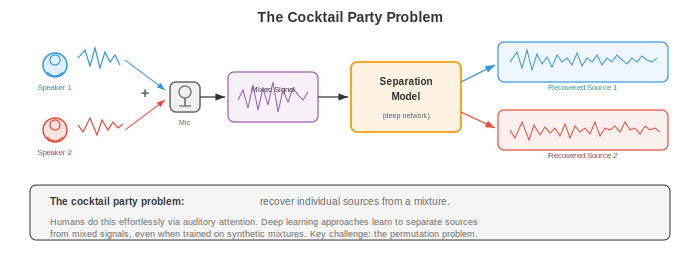
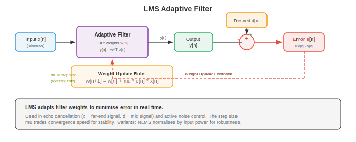

# 源分离与噪声消除

*源分离与噪声消除从混合音频中恢复单个信号；即计算上的鸡尾酒会问题。本文件涵盖 ICA、NMF、时频掩蔽、beamforming、深度学习分离网络（Conv-TasNet、SepFormer）、speech enhancement 与自适应噪声消除。*

- 想象置身于一个拥挤的鸡尾酒会。数十人同时交谈、音乐播放、玻璃杯碰撞，你却能聚焦于一段对话并清晰跟随。这种非凡能力，即 **cocktail party problem**（鸡尾酒会问题，Cherry，1953），人类听觉系统毫不费力地解决，机器却极为困难。本文件涵盖尝试该任务的算法：分离混合音频源、消除不想要的噪声、在不利条件下增强语音。

- 第 01 篇文件的信号处理基础（STFT、spectrogram、filterbank）是此处每个方法的根基。第 02 章的矩阵分解技术（NMF、ICA、SVD）提供经典工具箱。第 06 章的深度学习架构（CNN、RNN、attention）与第 04/05 章的概率论构成现代方法的基础。



- **问题表述**：在一个或多个麦克风处观测到混合信号 $x(t)$。最简情况下，混合是 $C$ 个源信号之和：

$$x(t) = \sum_{c=1}^{C} s_c(t) + n(t)$$

- 其中 $s_c(t)$ 是第 $c$ 个源信号，$n(t)$ 是背景噪声。目标是从 $x(t)$ 恢复各 $s_c(t)$。单麦克风情形严重欠定：一个方程、$C$ 个未知。需额外假设（统计独立、谱结构、学习到的先验）才能使问题可解。

- 在频域（经第 01 篇文件的 STFT），混合变为：

$$X(t, f) = \sum_{c=1}^{C} S_c(t, f) + N(t, f)$$

- 许多分离方法在时频域工作：为每个源估计一个 **mask** $M_c(t, f) \in [0, 1]$，再以 $\hat{S}_c(t, f) = M_c(t, f) \cdot X(t, f)$ 恢复源。**ideal binary mask (IBM)** 在源 $c$ 主导该时频格时令 $M_c(t, f) = 1$，否则为 0。**ideal ratio mask (IRM)** 是软版本：

$$\text{IRM}_c(t, f) = \frac{|S_c(t, f)|^2}{\sum_{j=1}^{C} |S_j(t, f)|^2}$$

- **Independent Component Analysis (ICA)**（独立成分分析）是当麦克风数等于或超过源数时的经典方法。ICA（第 02 章）寻找一个线性解混矩阵 $W$ 使 $\hat{s} = Wx$，其中恢复的源 $\hat{s}$ 在统计上最大独立。关键假设是源信号非高斯且独立，这对语音和音乐通常成立。

- 对多麦克风的瞬时混合模型 $x = As$（$A$ 为混合矩阵），ICA 通过最大化输出的非高斯性（FastICA 用 negentropy）或最小化互信息来恢复 $W \approx A^{-1}$。ICA 在受控环境下效果良好，但当混合涉及卷积（房间混响）、源多于麦克风或独立性假设被违反时失效。

- **Non-negative Matrix Factorisation (NMF)**（非负矩阵分解）将幅度谱 $V \in \mathbb{R}_+^{F \times T}$ 分解为两个非负矩阵之积（第 02 章）：

$$V \approx WH$$

- 其中 $W \in \mathbb{R}_+^{F \times K}$ 是 $K$ 个谱基向量构成的字典，$H \in \mathbb{R}_+^{K \times T}$ 是随时间变化的激活系数。非负约束有物理动因：幅度非负，声音以加性方式叠加。

- 对源分离，NMF 为每个源学习独立字典：$W_{\text{speech}}$ 捕捉语音的谱模式（formant 结构），$W_{\text{noise}}$ 捕捉噪声模式。混合被分解为 $V \approx W_{\text{speech}} H_{\text{speech}} + W_{\text{noise}} H_{\text{noise}}$，各源通过掩蔽恢复。NMF 用乘性更新最小化，以 Frobenius 范数或 KL 散度为代价：

```math
\begin{aligned}
\text{Frobenius:} \quad D_F(V \| WH) &= \|V - WH\|_F^2 \\
\text{KL:} \quad D_{KL}(V \| WH) &= \sum_{f,t} \left[ V_{ft} \log \frac{V_{ft}}{(WH)_{ft}} - V_{ft} + (WH)_{ft} \right]
\end{aligned}
```

- **Beamforming**（波束成形）利用麦克风阵列的空间信息。当源信号以不同延迟（因空间布局）到达不同麦克风时，这些延迟可用于增强一个方向的信号同时抑制其他方向。


- **Delay-and-sum beamforming**（延迟求和波束成形）是最简方法。若目标源相对阵列位于角 $\theta$，麦克风 $m$ 处的时延为 $\tau_m(\theta) = d_m \sin \theta / c$，其中 $d_m$ 是麦克风位置，$c$ 是声速。波束成形器输出对齐并求和麦克风信号：

$$y(t) = \frac{1}{M} \sum_{m=1}^{M} x_m(t - \tau_m(\theta))$$

- 目标方向的信号相干叠加，其他方向的信号非相干叠加，提供空间滤波。阵列几何决定空间分辨率：阵列越大波束越窄。

- **Minimum Variance Distortionless Response (MVDR)** 波束成形优化权重以最小化总输出功率同时无失真地通过目标方向：

```math
\begin{aligned}
\min_{\mathbf{w}} \quad & \mathbf{w}^H \Phi_{nn} \mathbf{w} \\
\text{subject to} \quad & \mathbf{w}^H \mathbf{d}(\theta) = 1
\end{aligned}
```

- 其中 $\Phi_{nn}$ 是噪声空间协方差矩阵，$\mathbf{d}(\theta)$ 是方向 $\theta$ 的导向向量。闭式解为：

$$\mathbf{w}_{\text{MVDR}} = \frac{\Phi_{nn}^{-1} \mathbf{d}(\theta)}{\mathbf{d}(\theta)^H \Phi_{nn}^{-1} \mathbf{d}(\theta)}$$

- MVDR 通过使用估计的噪声协方差自适应噪声环境，提供比 delay-and-sum 更好的干扰抑制。它广泛用于助听器、智能扬声器与 teleconferencing 系统。

- **深度学习用于 source separation** 大幅提升了性能，尤其是在经典方法挣扎的单麦克风情形。通用范式：编码混合、用神经网络估计 mask 或源表示、解码恢复各源。

- **Deep clustering**（深度聚类，Hershey 等，2016）将每个时频格嵌入到高维空间，其中同源格彼此靠近、不同源格彼此远离。双向 LSTM（第 06 章）将每个时频格 $(t, f)$ 映射到 embedding $v_{t,f} \in \mathbb{R}^D$。训练目标为：

$$\mathcal{L} = \|VV^T - YY^T\|_F^2$$

- 其中 $V$ 是 embedding 矩阵，$Y$ 是源分配的 one-hot 矩阵。乘积 $VV^T$ 是亲和矩阵（两格 embedding 的相似度），$YY^T$ 是理想亲和（同源为 1，否则为 0）。推理时对 embedding 做 K-means 聚类产生二元 mask。

- **Conv-TasNet**（Luo 与 Mesgarani，2019）完全在时域运行，绕过 STFT。它有三个组件：


- **Encoder**：一维卷积将混合 waveform 的短段映射为 latent 表示。对混合 $x \in \mathbb{R}^T$，encoder 输出为 $w = \text{ReLU}(U \ast x) \in \mathbb{R}^{N \times L}$，其中 $U$ 是可学习基（类似 STFT 基但从数据学习），$N$ 是基函数数，$L$ 是段数。encoder kernel size 与 stride（通常 2ms 与 1ms）决定时间分辨率。

- **Separator**：**Temporal Convolutional Network (TCN)** 处理编码后的混合并输出 $C$ 个 mask。TCN 以指数增长的扩张因子 $1, 2, 4, \ldots, 2^{B-1}$ 在块中堆叠 dilated 一维 depthwise separable convolution（来自第 08 章的高效卷积），重复 $R$ 次。这在保持计算高效的同时给出极大感受野。

- **Decoder**：transposed 一维卷积（用学习的基 $V$）将每个掩蔽表示转回时域：$\hat{s}_c = V^T (M_c \odot w)$。

- Conv-TasNet 显著优于基于 spectrogram 的方法，因为学习的 encoder-decoder 基能捕捉 STFT 幅度丢弃的信息（尤其是 phase）。

- **Dual-Path RNN (DPRNN)**（Luo 等，2020）处理分离中的长序列建模问题。DPRNN 不用单个 RNN 或 TCN 处理整个编码序列，而是将序列切成重叠块并沿两条路径应用 RNN：**intra-chunk** 路径（建模每块内的局部模式）与 **inter-chunk** 路径（建模跨块的全局模式）。这把 RNN 序列长度从 $L$ 降到每维 $\sqrt{L}$：

```math
\begin{aligned}
\text{Intra-chunk:} \quad & h_{k,n}^{\text{intra}} = \text{BiLSTM}_{\text{intra}}(z_{k,n}) \\
\text{Inter-chunk:} \quad & h_{k,n}^{\text{inter}} = \text{BiLSTM}_{\text{inter}}(h_{k,n}^{\text{intra}})
\end{aligned}
```

- 其中 $k$ 索引块、$n$ 索引块内位置。intra-chunk LSTM 对固定 $k$ 沿 $n$ 处理；inter-chunk LSTM 对固定 $n$ 沿 $k$ 处理。

- **SepFormer**（Subakan 等，2021）用 transformer（第 07 章）取代双路径框架中的 RNN。intra-chunk transformer 用 self-attention 捕捉局部依赖，inter-chunk transformer 捕捉全局依赖。multi-head attention 无消失梯度问题地建模长程依赖的能力（第 06 章）使 SepFormer 对长录音特别有效。SepFormer 在 WSJ0-2mix 基准上取得 SOTA 结果。

- **Permutation Invariant Training (PIT)**（置换不变训练）解决监督 source separation 中的根本问题：标签分配歧义。若网络有两个输出（对应两个说话人），哪个输出对应哪个说话人？没有自然顺序。PIT 对所有可能分配计算 loss 并取最小：

$$\mathcal{L}_{\text{PIT}} = \min_{\pi \in \mathcal{P}} \sum_{c=1}^{C} \ell(\hat{s}_{\pi(c)}, s_c)$$

- 其中 $\mathcal{P}$ 是 $\{1, \ldots, C\}$ 所有置换的集合，$\ell$ 是每源 loss（通常是 scale-invariant signal-to-distortion ratio，SI-SDR）。$C = 2$ 个源时仅 2 种置换；$C = 3$ 时 6 种。对更大 $C$ 用 Hungarian 算法高效计算。

- **Scale-Invariant Signal-to-Distortion Ratio (SI-SDR)** 是 source separation 的标准评估指标：

```math
\begin{aligned}
s_{\text{target}} &= \frac{\langle \hat{s}, s \rangle}{\|s\|^2} s \\
e_{\text{noise}} &= \hat{s} - s_{\text{target}} \\
\text{SI-SDR} &= 10 \log_{10} \frac{\|s_{\text{target}}\|^2}{\|e_{\text{noise}}\|^2}
\end{aligned}
```

- 其中 $\hat{s}$ 是估计源，$s$ 是真值。SI-SDR 对估计的整体尺度不变，这是期望的，因为绝对音量不如分离质量重要。SI-SDR（dB）越高越好。SOTA 系统在 WSJ0-2mix 上取得约 20-22 dB 的 SI-SDR 提升。

- **Music source separation**（音乐源分离）将音乐录音分离为 stems：人声、鼓、贝斯与其他乐器。这支持卡拉 OK（去除人声）、混音（调整乐器电平）与转录（一次分析一件乐器）等应用。

- **Open-Unmix**（Stoter 等，2019）是参考基线，用 3 层双向 LSTM 在幅度 STFT 域预测每个源的软 mask。它用专用模型独立处理每个源。简单但有效，Open-Unmix 在 MUSDB18 上建立了可复现基准。

- **Demucs**（Defossez 等，2019；更新为 Hybrid Demucs，2021）使用直接作用于 waveform 的 U-Net 架构（第 08 章）。encoder 通过步幅卷积压缩混合，decoder 通过带 skip connection 的 transposed convolution 扩展回去，每个源有自己的 decoder head。**Hybrid Demucs** 结合时域与频域处理：encoder 有并行的时域与 STFT 分支，其特征在 decoder 前融合。这同时捕捉精细时间细节与谱结构。

- Demucs 在 MUSDB18 上取得 SOTA 分离质量，尤其人声分离。其 U-Net 架构令人联想到第 08 章的图像分割架构，把分离问题当作一种"音频分割"。

- **Active noise cancellation (ANC)**（主动降噪）通过产生与噪声相消干涉的反噪声信号来减少不想要的声音。可想象降噪耳机：麦克风拾取环境噪声，ANC 系统产生反转版本，合成信号（噪声 + 反噪声）理想地相消为静音。

- 物理很简单：若噪声为 $n(t)$，在同一点产生 $-n(t)$ 即得静音：$n(t) + (-n(t)) = 0$。挑战在于反噪声必须在时间、幅度与 phase 上精确对齐。即使很小误差也会产生残余噪声或伪影。

- **Feedforward ANC** 使用在噪声到达听者前拾取噪声的参考麦克风。系统有时间处理噪声并产生反噪声。参考信号经自适应滤波，其输出在误差麦克风（听者附近）处从噪声中减去。这对可预测的宽带噪声（引擎嗡声、风扇噪声）效果良好。

- **Feedback ANC** 仅使用听者耳处的误差麦克风。系统从残余信号（听者实际听到的）估计噪声并调整反噪声。Feedback ANC 更简单（无需参考麦克风）但带宽有限且可能不稳定。

- **Adaptive filtering**（自适应滤波）是 ANC 背后的数学引擎。滤波系数必须持续适应变化的噪声环境。最常用算法是 **Least Mean Squares (LMS)** 滤波器。



- **LMS algorithm**：一个系数为 $\mathbf{w} = [w_0, w_1, \ldots, w_{L-1}]^T$ 的 FIR 滤波器处理参考信号 $\mathbf{x}(n) = [x(n), x(n-1), \ldots, x(n-L+1)]^T$。输出为 $y(n) = \mathbf{w}^T \mathbf{x}(n)$，误差为 $e(n) = d(n) - y(n)$（$d(n)$ 为期望/主信号），权重更新为：

$$\mathbf{w}(n+1) = \mathbf{w}(n) + \mu \, e(n) \, \mathbf{x}(n)$$

- 其中 $\mu$ 是步长（学习率）。这是对均方误差 $E[e^2(n)]$ 的随机梯度下降步，用瞬时梯度估计 $-2 e(n) \mathbf{x}(n)$ 代替真实梯度（第 03 章梯度下降与第 06 章 SGD）。

- 步长 $\mu$ 控制收敛速度与稳态误差的权衡。太大滤波器振荡或发散；太小适应迟缓。稳定条件为 $0 < \mu < 2 / (\lambda_{\max})$，其中 $\lambda_{\max}$ 是输入自相关矩阵 $R = E[\mathbf{x}\mathbf{x}^T]$ 的最大特征值。

- **Normalised LMS (NLMS)** 用输入功率归一化步长，使收敛与信号电平无关：

$$\mathbf{w}(n+1) = \mathbf{w}(n) + \frac{\mu}{\|\mathbf{x}(n)\|^2 + \epsilon} \, e(n) \, \mathbf{x}(n)$$

- 其中 $\epsilon$ 是防止除零的小正则化常数。NLMS 比 LMS 更可靠地收敛，因为有效步长自适应于输入功率。

- **Recursive Least Squares (RLS)** 是收敛更快的替代方法，最小化加权最小二乘代价 $\sum_{k=1}^{n} \lambda^{n-k} e^2(k)$，其中 $\lambda \in (0, 1]$ 是遗忘因子。RLS 维护逆自相关矩阵的估计并递归更新，以每样本 $O(L^2)$ 计算（对比 LMS 的 $O(L)$）为代价实现最优收敛。

- **Noise reduction 与 speech enhancement**（降噪与语音增强）旨在改善嘈杂录音中的语音质量与可懂度。与分离不同源的 source separation 不同，speech enhancement 专门针对语音加噪声的情形，从带噪观测中恢复干净语音。

- **Spectral subtraction**（谱减法）是最简方法。在仅噪声帧（由第 03 篇文件的 VAD 检测）估计噪声谱 $|\hat{N}(f)|^2$，然后从每帧减去：

$$|\hat{S}(f)|^2 = \max(|X(f)|^2 - \alpha |\hat{N}(f)|^2, \beta |X(f)|^2)$$

- 其中 $\alpha$ 是过减因子（通常 1-4，激进减除更多噪声但引入更多伪影），$\beta$ 是防止负值并减少"musical noise"伪影（孤立的音调残余，听起来像随机音符）的谱底。

- **Wiener filtering**（维纳滤波）提供干净语音谱的最小均方误差估计：

$$\hat{S}(t, f) = \frac{|S(t,f)|^2}{|S(t,f)|^2 + |N(t,f)|^2} \cdot X(t, f) = G(t, f) \cdot X(t, f)$$

- Wiener 增益 $G(t, f) = \text{SNR}(t, f) / (1 + \text{SNR}(t, f))$ 取值 0（纯噪声）到 1（纯语音），作为软 mask。挑战在于估计语音与噪声功率谱。**a priori SNR** $\xi(t, f) = |S(t,f)|^2 / |N(t,f)|^2$ 用"decision-directed"方法估计：当前帧估计与上一帧 Wiener 滤波输出的平滑组合。

- **Neural speech enhancement**（神经语音增强）用深度学习估计 mask（如 Wiener 增益）或直接估计干净 spectrogram。架构从简单前馈网络到 U-Net（第 08 章）、CRN（Convolutional Recurrent Network）与 transformer。

- **DCCRN**（Deep Complex Convolutional Recurrent Network）在复数 STFT（幅度与 phase）上操作，使用自然处理实部与虚部的复数值卷积。这避免了仅幅度方法受困的 phase 估计问题。

- **FullSubNet** 使用双路径架构，含全频带模型（捕捉全局谱模式）与子频带模型（捕捉局部 harmonic 细节）。全频带模型处理整个频谱，子频带模型处理以每个频率 bin 为中心的窄频带。它们的输出组合为最终 mask 估计。

- **DNS (Deep Noise Suppression) Challenge**（Microsoft）每年为 speech enhancement 系统基准。获胜者通常使用带多样噪声类型的大规模训练、数据增强（在各种 SNR 下加噪、混响、codec 伪影）与可实时运行的架构。

- **Echo cancellation**（回声消除）消除双向通信中的声学回声。当你通话时，远端说话人的声音从扬声器播放、在房间内反射、被你的麦克风拾取，产生远端听到的回声。**Acoustic Echo Cancellation (AEC)** 建模扬声器到麦克风的声学路径并减去预测回声。

- 声学路径建模为以远端信号为输入的自适应 FIR 滤波器（用 LMS 或 NLMS）。滤波器建模房间冲激响应，包括直射路径、早期反射与晚期混响。房间冲激响应可长达数百毫秒，需数千 taps 的滤波器。

- **Double-talk detection**（双方对讲检测）对 AEC 至关重要：当近端与远端说话人同时讲话时，自适应滤波器必须冻结（停止更新）以防止它消除近端说话人的语音。双方对讲检测器比较误差信号能量与远端信号能量；误差能量的突增若不能由远端信号解释，则提示近端语音。

- 远端信号 $x(n)$ 与麦克风信号 $d(n)$ 的**归一化互相关**提供双方对讲指标：

$$\xi(n) = \frac{|\sum_{k=0}^{L-1} x(n-k) d(n-k)|}{\sqrt{\sum_{k} x^2(n-k)} \sqrt{\sum_{k} d^2(n-k)}}$$

- 单方对讲（仅远端）时 $\xi$ 高，因为 $d$ 主要是 $x$ 的回声。双方对讲时 $\xi$ 下降，因为近端语音与 $x$ 不相关。

- 现代 AEC 系统结合自适应滤波与神经网络：自适应滤波器提供初始回声估计，神经网络（类似上述 speech enhancement 模型）清理残余回声并处理线性滤波器无法捕捉的非线性（扬声器失真）。

- **分离与增强的评估指标**：
    - **SI-SDR**（定义如上）：source separation 的标准。
    - **SDR**（Signal-to-Distortion Ratio）：来自 BSS Eval，度量包括伪影与干扰在内的总体分离质量。
    - **PESQ**（Perceptual Evaluation of Speech Quality）：预测主观质量分数的 ITU 标准。范围：-0.5 到 4.5。
    - **STOI**（Short-Time Objective Intelligibility）：预测语音可懂度。范围：0 到 1。
    - **DNSMOS**：Microsoft 的深度降噪 MOS 预测器，一个训练用于预测人类 MOS 分数的神经网络，无需干净参考音频。

## 编程任务（使用 CoLab 或 notebook）

- **任务 1：用于 source separation 的 Independent Component Analysis。** 实现 FastICA 分离两个混合音频源，演示确定情形（源与麦克风相等）下经典的鸡尾酒会解决方案。

```python
import jax
import jax.numpy as jnp
import jax.random as jr
import matplotlib.pyplot as plt

# Generate two source signals
sr = 8000
duration = 1.0
t = jnp.linspace(0, duration, int(sr * duration))

# Source 1: sinusoidal (like a tone)
s1 = jnp.sin(2 * jnp.pi * 440 * t) + 0.3 * jnp.sin(2 * jnp.pi * 880 * t)

# Source 2: sawtooth-like (rich harmonics)
s2 = 2 * (t * 200 % 1) - 1  # sawtooth at 200 Hz

# Normalise sources
s1 = s1 / jnp.max(jnp.abs(s1))
s2 = s2 / jnp.max(jnp.abs(s2))
sources = jnp.stack([s1, s2])  # (2, T)

# Mixing matrix (unknown to the algorithm)
A = jnp.array([[0.8, 0.4],
               [0.3, 0.9]])
mixtures = A @ sources  # (2, T)

# FastICA implementation
def whiten(X):
    """Centre and whiten the data."""
    X_centered = X - jnp.mean(X, axis=1, keepdims=True)
    cov = (X_centered @ X_centered.T) / X_centered.shape[1]
    eigvals, eigvecs = jnp.linalg.eigh(cov)
    D_inv_sqrt = jnp.diag(1.0 / jnp.sqrt(eigvals + 1e-8))
    whitening = D_inv_sqrt @ eigvecs.T
    return whitening @ X_centered, whitening

def fastica(X, n_components=2, max_iter=200, tol=1e-6):
    """FastICA using tanh non-linearity (approximation to negentropy)."""
    X_white, whitening = whiten(X)
    n, T = X_white.shape

    key = jr.PRNGKey(42)
    W = jr.normal(key, (n_components, n))
    # Orthogonalise W
    U, _, Vt = jnp.linalg.svd(W, full_matrices=False)
    W = U @ Vt

    for iteration in range(max_iter):
        W_old = W.copy()

        # For each component
        for i in range(n_components):
            w = W[i]
            # w^T X_white: (T,)
            wx = w @ X_white  # (T,)

            # g(u) = tanh(u), g'(u) = 1 - tanh^2(u)
            g_wx = jnp.tanh(wx)
            g_prime_wx = 1 - g_wx ** 2

            # Newton update: w_new = E[X * g(w^T X)] - E[g'(w^T X)] * w
            w_new = jnp.mean(X_white * g_wx[None, :], axis=1) - \
                    jnp.mean(g_prime_wx) * w

            # Decorrelate from previous components (deflation)
            for j in range(i):
                w_new = w_new - jnp.dot(w_new, W[j]) * W[j]

            w_new = w_new / jnp.linalg.norm(w_new)
            W = W.at[i].set(w_new)

        # Check convergence
        convergence = jnp.min(jnp.abs(jnp.diag(W @ W_old.T)))
        if convergence > 1 - tol:
            print(f"FastICA converged in {iteration + 1} iterations")
            break

    # Unmixing matrix
    unmixing = W @ whitening
    recovered = unmixing @ X
    return recovered, unmixing

recovered, W_unmix = fastica(mixtures)

# Fix sign ambiguity (ICA can flip signs)
for i in range(2):
    if jnp.corrcoef(recovered[i], sources[i])[0, 1] < -0.5:
        recovered = recovered.at[i].set(-recovered[i])

# If sources are swapped, fix permutation
corr_00 = jnp.abs(jnp.corrcoef(recovered[0], sources[0])[0, 1])
corr_01 = jnp.abs(jnp.corrcoef(recovered[0], sources[1])[0, 1])
if corr_01 > corr_00:
    recovered = recovered[::-1]

# Normalise for display
recovered = recovered / jnp.max(jnp.abs(recovered), axis=1, keepdims=True)

fig, axes = plt.subplots(3, 2, figsize=(14, 9))

axes[0, 0].plot(t[:1000], s1[:1000], color='#3498db', linewidth=0.8)
axes[0, 0].set_title('Source 1 (Original)')
axes[0, 0].set_ylabel('Amplitude')

axes[0, 1].plot(t[:1000], s2[:1000], color='#e74c3c', linewidth=0.8)
axes[0, 1].set_title('Source 2 (Original)')

axes[1, 0].plot(t[:1000], mixtures[0, :1000], color='#9b59b6', linewidth=0.8)
axes[1, 0].set_title('Mixture 1 (Microphone 1)')
axes[1, 0].set_ylabel('Amplitude')

axes[1, 1].plot(t[:1000], mixtures[1, :1000], color='#9b59b6', linewidth=0.8)
axes[1, 1].set_title('Mixture 2 (Microphone 2)')

axes[2, 0].plot(t[:1000], recovered[0, :1000], color='#27ae60', linewidth=0.8)
axes[2, 0].set_title('Recovered Source 1 (FastICA)')
axes[2, 0].set_ylabel('Amplitude')
axes[2, 0].set_xlabel('Time (s)')

axes[2, 1].plot(t[:1000], recovered[1, :1000], color='#f39c12', linewidth=0.8)
axes[2, 1].set_title('Recovered Source 2 (FastICA)')
axes[2, 1].set_xlabel('Time (s)')

plt.tight_layout()
plt.show()

# Report correlation with originals
for i in range(2):
    corr = jnp.corrcoef(recovered[i], sources[i])[0, 1]
    print(f"Source {i+1} recovery correlation: {corr:.4f}")
```

- **任务 2：基于 NMF 的 spectrogram 源分离。** 用非负矩阵分解（第 02 章）将 spectrogram 分离为两个分量，演示 NMF 如何为每个源学习谱字典。

```python
import jax
import jax.numpy as jnp
import jax.random as jr
import matplotlib.pyplot as plt

# Generate two signals with distinct spectral characteristics
sr = 8000
duration = 1.0
t = jnp.linspace(0, duration, int(sr * duration))

# Source 1: low-frequency harmonic (simulating bass)
src1 = (jnp.sin(2 * jnp.pi * 100 * t) +
        0.5 * jnp.sin(2 * jnp.pi * 200 * t) +
        0.3 * jnp.sin(2 * jnp.pi * 300 * t))

# Source 2: high-frequency harmonic (simulating a flute)
src2 = (jnp.sin(2 * jnp.pi * 800 * t) +
        0.4 * jnp.sin(2 * jnp.pi * 1600 * t))

# Time-varying amplitudes (sources active at different times)
env1 = jnp.where(t < 0.5, 1.0, 0.3)
env2 = jnp.where(t > 0.3, 1.0, 0.2)
src1 = src1 * env1
src2 = src2 * env2

mixture = src1 + src2

# Compute magnitude spectrogram (STFT)
n_fft = 512
hop = 128
window = jnp.hanning(n_fft)

def compute_stft(signal, n_fft, hop, window):
    n_frames = 1 + (len(signal) - n_fft) // hop
    frames = jnp.stack([
        signal[i * hop : i * hop + n_fft] * window
        for i in range(n_frames)
    ])
    return jnp.fft.rfft(frames, n=n_fft)

S_mix = compute_stft(mixture, n_fft, hop, window)
V = jnp.abs(S_mix).T  # (F, T) - frequency x time
phase = jnp.angle(S_mix).T

F, T = V.shape
print(f"Spectrogram shape: {F} freq bins x {T} time frames")

# NMF: V ≈ WH using multiplicative update rules
def nmf(V, K, n_iter=200, key=jr.PRNGKey(0)):
    """Non-negative Matrix Factorisation with Frobenius norm."""
    k1, k2 = jr.split(key)
    W = jnp.abs(jr.normal(k1, (F, K))) * 0.1 + 0.01  # (F, K)
    H = jnp.abs(jr.normal(k2, (K, T))) * 0.1 + 0.01  # (K, T)

    costs = []
    for i in range(n_iter):
        # Multiplicative update for H
        WtV = W.T @ V
        WtWH = W.T @ W @ H + 1e-8
        H = H * (WtV / WtWH)

        # Multiplicative update for W
        VHt = V @ H.T
        WHHt = W @ H @ H.T + 1e-8
        W = W * (VHt / WHHt)

        cost = jnp.sum((V - W @ H) ** 2)
        costs.append(float(cost))

    return W, H, costs

# Run NMF with K=2 components
K = 2
W, H, costs = nmf(V, K, n_iter=300)

# Reconstruct each source using soft masks
V_hat = W @ H
mask1 = (W[:, 0:1] @ H[0:1, :]) / (V_hat + 1e-8)
mask2 = (W[:, 1:2] @ H[1:2, :]) / (V_hat + 1e-8)

V_src1 = mask1 * V
V_src2 = mask2 * V

# Visualisation
fig, axes = plt.subplots(3, 2, figsize=(14, 10))

# Mixture spectrogram
axes[0, 0].imshow(jnp.log1p(V), aspect='auto', origin='lower', cmap='magma')
axes[0, 0].set_title('Mixture Spectrogram |X|')
axes[0, 0].set_ylabel('Frequency bin')

# NMF convergence
axes[0, 1].plot(costs, color='#3498db', linewidth=1.5)
axes[0, 1].set_title('NMF Convergence')
axes[0, 1].set_xlabel('Iteration')
axes[0, 1].set_ylabel('Frobenius cost')
axes[0, 1].set_yscale('log')

# Spectral basis vectors W
freq_hz = jnp.arange(F) * sr / n_fft
axes[1, 0].plot(freq_hz, W[:, 0], color='#27ae60', linewidth=1.5,
                label='Basis 1 (low freq)')
axes[1, 0].plot(freq_hz, W[:, 1], color='#e74c3c', linewidth=1.5,
                label='Basis 2 (high freq)')
axes[1, 0].set_title('Learned Spectral Bases W')
axes[1, 0].set_xlabel('Frequency (Hz)')
axes[1, 0].set_ylabel('Magnitude')
axes[1, 0].legend()

# Temporal activations H
time_s = jnp.arange(T) * hop / sr
axes[1, 1].plot(time_s, H[0], color='#27ae60', linewidth=1.5,
                label='Activation 1')
axes[1, 1].plot(time_s, H[1], color='#e74c3c', linewidth=1.5,
                label='Activation 2')
axes[1, 1].set_title('Temporal Activations H')
axes[1, 1].set_xlabel('Time (s)')
axes[1, 1].set_ylabel('Activation')
axes[1, 1].legend()

# Separated spectrograms
axes[2, 0].imshow(jnp.log1p(V_src1), aspect='auto', origin='lower', cmap='magma')
axes[2, 0].set_title('Separated Source 1 (low-frequency)')
axes[2, 0].set_ylabel('Frequency bin')
axes[2, 0].set_xlabel('Time frame')

axes[2, 1].imshow(jnp.log1p(V_src2), aspect='auto', origin='lower', cmap='magma')
axes[2, 1].set_title('Separated Source 2 (high-frequency)')
axes[2, 1].set_xlabel('Time frame')

plt.tight_layout()
plt.show()

print(f"Reconstruction error: {jnp.sum((V - W @ H)**2):.2f}")
print(f"NMF learns spectral bases that capture each source's frequency profile.")
```

- **任务 3：用于噪声消除的 LMS 自适应滤波器。** 实现 LMS 与 NLMS 算法用于回声/噪声消除，展示收敛行为与步长的影响。

```python
import jax
import jax.numpy as jnp
import jax.random as jr
import matplotlib.pyplot as plt

# Simulate an echo cancellation scenario
# Far-end signal -> room impulse response -> echo at microphone
# Near-end speech is the desired signal we want to preserve

sr = 8000
duration = 2.0
n_samples = int(sr * duration)
key = jr.PRNGKey(42)
keys = jr.split(key, 5)

# Far-end signal (reference): random speech-like signal
far_end = jr.normal(keys[0], (n_samples,)) * 0.5

# Room impulse response (unknown to the algorithm)
rir_length = 64
rir = jnp.zeros(rir_length)
rir = rir.at[0].set(0.8)   # direct path
rir = rir.at[5].set(0.3)   # early reflection
rir = rir.at[12].set(-0.2) # reflection
rir = rir.at[25].set(0.1)  # late reflection
rir = rir.at[40].set(-0.05)

# Echo: convolution of far-end with RIR
echo = jnp.convolve(far_end, rir)[:n_samples]

# Near-end speech (active in a portion of the signal)
near_end = jnp.zeros(n_samples)
start, end = n_samples // 3, 2 * n_samples // 3
near_speech = 0.3 * jnp.sin(
    2 * jnp.pi * 300 * jnp.linspace(0, (end - start) / sr, end - start)
)
near_end = near_end.at[start:end].set(near_speech)

# Microphone signal: echo + near-end + noise
noise = jr.normal(keys[1], (n_samples,)) * 0.01
mic_signal = echo + near_end + noise

# LMS adaptive filter
def lms_filter(reference, desired, filter_length, mu):
    """Standard LMS adaptive filter."""
    n = len(reference)
    w = jnp.zeros(filter_length)
    output = jnp.zeros(n)
    error = jnp.zeros(n)
    w_history = []

    for i in range(filter_length, n):
        x = reference[i:i-filter_length:-1]  # reversed segment
        if len(x) < filter_length:
            x = jnp.pad(x, (0, filter_length - len(x)))
        x = reference[max(0, i-filter_length+1):i+1][::-1]

        y = jnp.dot(w, x)
        e = desired[i] - y
        w = w + mu * e * x

        output = output.at[i].set(y)
        error = error.at[i].set(e)

        if i % 500 == 0:
            w_history.append(w.copy())

    return output, error, w_history

# NLMS adaptive filter
def nlms_filter(reference, desired, filter_length, mu, eps=1e-6):
    """Normalised LMS adaptive filter."""
    n = len(reference)
    w = jnp.zeros(filter_length)
    output = jnp.zeros(n)
    error = jnp.zeros(n)

    for i in range(filter_length, n):
        x = reference[max(0, i-filter_length+1):i+1][::-1]

        y = jnp.dot(w, x)
        e = desired[i] - y
        norm_factor = jnp.dot(x, x) + eps
        w = w + (mu / norm_factor) * e * x

        output = output.at[i].set(y)
        error = error.at[i].set(e)

    return output, error

# Run LMS with different step sizes
filter_len = 64
mu_values = [0.001, 0.01, 0.05]
colors_mu = ['#3498db', '#e74c3c', '#27ae60']

fig, axes = plt.subplots(2, 2, figsize=(14, 10))

# Original signals
t = jnp.arange(n_samples) / sr
axes[0, 0].plot(t, mic_signal, color='#9b59b6', linewidth=0.5, alpha=0.7,
                label='Mic (echo + near-end)')
axes[0, 0].plot(t, echo, color='#e74c3c', linewidth=0.5, alpha=0.7,
                label='Echo (to cancel)')
axes[0, 0].plot(t, near_end, color='#27ae60', linewidth=0.8,
                label='Near-end speech (to preserve)')
axes[0, 0].set_title('Signal Components')
axes[0, 0].set_xlabel('Time (s)')
axes[0, 0].set_ylabel('Amplitude')
axes[0, 0].legend(fontsize=8)

# LMS convergence for different step sizes
for mu, color in zip(mu_values, colors_mu):
    _, err, _ = lms_filter(far_end, mic_signal, filter_len, mu)
    # Smoothed squared error
    sq_err = err ** 2
    window_size = 200
    smoothed = jnp.convolve(sq_err, jnp.ones(window_size)/window_size,
                             mode='valid')
    axes[0, 1].plot(smoothed, color=color, linewidth=1.2,
                    label=f'mu={mu}')

axes[0, 1].set_title('LMS Convergence (smoothed MSE)')
axes[0, 1].set_xlabel('Sample')
axes[0, 1].set_ylabel('Squared Error')
axes[0, 1].set_yscale('log')
axes[0, 1].legend()

# Best LMS result
_, err_lms, w_hist = lms_filter(far_end, mic_signal, filter_len, 0.01)
axes[1, 0].plot(t, mic_signal, color='#9b59b6', linewidth=0.5, alpha=0.4,
                label='Before cancellation')
axes[1, 0].plot(t, err_lms, color='#3498db', linewidth=0.5, alpha=0.8,
                label='After LMS cancellation')
axes[1, 0].plot(t, near_end, color='#27ae60', linewidth=0.8, alpha=0.5,
                label='True near-end')
axes[1, 0].set_title('LMS Echo Cancellation Result (mu=0.01)')
axes[1, 0].set_xlabel('Time (s)')
axes[1, 0].set_ylabel('Amplitude')
axes[1, 0].legend(fontsize=8)

# NLMS result
_, err_nlms = nlms_filter(far_end, mic_signal, filter_len, 0.5)
axes[1, 1].plot(t, mic_signal, color='#9b59b6', linewidth=0.5, alpha=0.4,
                label='Before cancellation')
axes[1, 1].plot(t, err_nlms, color='#f39c12', linewidth=0.5, alpha=0.8,
                label='After NLMS cancellation')
axes[1, 1].plot(t, near_end, color='#27ae60', linewidth=0.8, alpha=0.5,
                label='True near-end')
axes[1, 1].set_title('NLMS Echo Cancellation Result (mu=0.5)')
axes[1, 1].set_xlabel('Time (s)')
axes[1, 1].set_ylabel('Amplitude')
axes[1, 1].legend(fontsize=8)

plt.tight_layout()
plt.show()

# Measure echo reduction
echo_power = jnp.mean(echo ** 2)
lms_residual = jnp.mean(err_lms[n_samples//2:] ** 2)  # after convergence
nlms_residual = jnp.mean(err_nlms[n_samples//2:] ** 2)
print(f"Echo power: {10*jnp.log10(echo_power):.1f} dB")
print(f"LMS residual: {10*jnp.log10(lms_residual):.1f} dB "
      f"(ERLE: {10*jnp.log10(echo_power/lms_residual):.1f} dB)")
print(f"NLMS residual: {10*jnp.log10(nlms_residual):.1f} dB "
      f"(ERLE: {10*jnp.log10(echo_power/nlms_residual):.1f} dB)")
```

- **任务 4：用于 speech enhancement 的时频掩蔽。** 实现简单的谱掩蔽方法（ideal ratio mask）并与谱减法对比，可视化合成带噪语音信号的分离质量。

```python
import jax
import jax.numpy as jnp
import jax.random as jr
import matplotlib.pyplot as plt

# Create synthetic "speech" and "noise" signals
sr = 8000
duration = 2.0
t = jnp.linspace(0, duration, int(sr * duration))

# Speech: harmonic series with time-varying amplitude (simulating speech)
speech = jnp.zeros_like(t)
for f0 in [150, 300, 450, 600, 900]:
    amp_env = 0.5 + 0.5 * jnp.sin(2 * jnp.pi * 2.0 * t)  # 2 Hz modulation
    speech = speech + (0.5 / (f0/150)) * amp_env * jnp.sin(2 * jnp.pi * f0 * t)
speech = speech / jnp.max(jnp.abs(speech))

# Noise: band-limited noise
key = jr.PRNGKey(42)
noise_raw = jr.normal(key, t.shape) * 0.4

# Mix at a given SNR
snr_db = 5.0
speech_power = jnp.mean(speech ** 2)
noise_power = jnp.mean(noise_raw ** 2)
noise_scale = jnp.sqrt(speech_power / (noise_power * 10 ** (snr_db / 10)))
noise = noise_raw * noise_scale
mixture = speech + noise

# STFT
n_fft = 512
hop = 128
window = jnp.hanning(n_fft)

def stft(signal, n_fft, hop, window):
    n_frames = 1 + (len(signal) - n_fft) // hop
    frames = jnp.stack([
        signal[i * hop : i * hop + n_fft] * window
        for i in range(n_frames)
    ])
    return jnp.fft.rfft(frames, n=n_fft)

def istft(S, hop, window, length):
    n_fft = (S.shape[1] - 1) * 2
    n_frames = S.shape[0]
    frames = jnp.fft.irfft(S, n=n_fft) * window[None, :]
    output = jnp.zeros(length)
    window_sum = jnp.zeros(length)
    for i in range(n_frames):
        start = i * hop
        end = start + n_fft
        if end <= length:
            output = output.at[start:end].add(frames[i])
            window_sum = window_sum.at[start:end].add(window ** 2)
    window_sum = jnp.maximum(window_sum, 1e-8)
    return output / window_sum

S_speech = stft(speech, n_fft, hop, window)
S_noise = stft(noise, n_fft, hop, window)
S_mix = stft(mixture, n_fft, hop, window)

mag_speech = jnp.abs(S_speech)
mag_noise = jnp.abs(S_noise)
mag_mix = jnp.abs(S_mix)
phase_mix = jnp.angle(S_mix)

# Method 1: Ideal Ratio Mask (oracle - upper bound)
irm = mag_speech ** 2 / (mag_speech ** 2 + mag_noise ** 2 + 1e-8)
S_irm = (irm * mag_mix) * jnp.exp(1j * phase_mix)
enhanced_irm = istft(S_irm, hop, window, len(mixture))

# Method 2: Spectral subtraction
# Estimate noise from first 0.2s (assumed silence)
noise_frames = int(0.2 * sr / hop)
noise_est = jnp.mean(mag_mix[:noise_frames] ** 2, axis=0, keepdims=True)
alpha = 2.0  # over-subtraction factor
beta = 0.02  # spectral floor
mag_sub = jnp.maximum(mag_mix ** 2 - alpha * noise_est, beta * mag_mix ** 2)
mag_sub = jnp.sqrt(mag_sub)
S_sub = mag_sub * jnp.exp(1j * phase_mix)
enhanced_sub = istft(S_sub, hop, window, len(mixture))

# Method 3: Wiener filter
snr_est = mag_mix ** 2 / (noise_est + 1e-8)
wiener_gain = snr_est / (1 + snr_est)
S_wiener = (wiener_gain * mag_mix) * jnp.exp(1j * phase_mix)
enhanced_wiener = istft(S_wiener, hop, window, len(mixture))

# Compute SI-SDR for each method
def si_sdr(estimate, reference):
    """Scale-invariant signal-to-distortion ratio."""
    ref = reference[:len(estimate)]
    est = estimate[:len(reference)]
    s_target = (jnp.dot(est, ref) / (jnp.dot(ref, ref) + 1e-8)) * ref
    e_noise = est - s_target
    return 10 * jnp.log10(jnp.dot(s_target, s_target) /
                           (jnp.dot(e_noise, e_noise) + 1e-8))

si_sdr_mix = si_sdr(mixture, speech)
si_sdr_irm_val = si_sdr(enhanced_irm, speech)
si_sdr_sub_val = si_sdr(enhanced_sub, speech)
si_sdr_wiener_val = si_sdr(enhanced_wiener, speech)

# Visualisation
fig, axes = plt.subplots(3, 2, figsize=(14, 12))

# Spectrograms
axes[0, 0].imshow(jnp.log1p(mag_speech.T), aspect='auto', origin='lower',
                   cmap='magma')
axes[0, 0].set_title('Clean Speech Spectrogram')
axes[0, 0].set_ylabel('Frequency bin')

axes[0, 1].imshow(jnp.log1p(mag_mix.T), aspect='auto', origin='lower',
                   cmap='magma')
axes[0, 1].set_title(f'Noisy Mixture ({snr_db:.0f} dB SNR)')

# Masks
axes[1, 0].imshow(irm.T, aspect='auto', origin='lower', cmap='RdYlGn')
axes[1, 0].set_title('Ideal Ratio Mask (Oracle)')
axes[1, 0].set_ylabel('Frequency bin')

axes[1, 1].imshow(wiener_gain.T, aspect='auto', origin='lower', cmap='RdYlGn',
                   vmin=0, vmax=1)
axes[1, 1].set_title('Estimated Wiener Gain')

# Enhanced waveforms comparison
n_show = 3000
axes[2, 0].plot(t[:n_show], speech[:n_show], color='#27ae60', linewidth=0.8,
                alpha=0.5, label='Clean')
axes[2, 0].plot(t[:n_show], mixture[:n_show], color='#e74c3c', linewidth=0.5,
                alpha=0.4, label='Noisy')
axes[2, 0].plot(t[:n_show], enhanced_irm[:n_show], color='#3498db',
                linewidth=0.8, label='IRM enhanced')
axes[2, 0].set_title('Waveform Comparison (IRM)')
axes[2, 0].set_xlabel('Time (s)')
axes[2, 0].set_ylabel('Amplitude')
axes[2, 0].legend(fontsize=8)

# SI-SDR bar chart
methods = ['Mixture', 'Spectral\nSubtraction', 'Wiener\nFilter', 'Ideal Ratio\nMask']
sdr_values = [float(si_sdr_mix), float(si_sdr_sub_val),
              float(si_sdr_wiener_val), float(si_sdr_irm_val)]
bar_colors = ['#e74c3c', '#f39c12', '#9b59b6', '#27ae60']
bars = axes[2, 1].bar(methods, sdr_values, color=bar_colors, alpha=0.8)
axes[2, 1].set_ylabel('SI-SDR (dB)')
axes[2, 1].set_title('Enhancement Quality Comparison')
for bar, val in zip(bars, sdr_values):
    axes[2, 1].text(bar.get_x() + bar.get_width()/2., bar.get_height() + 0.3,
                    f'{val:.1f}', ha='center', fontsize=10)
axes[2, 1].axhline(0, color='gray', linestyle='--', linewidth=0.8)

plt.tight_layout()
plt.show()

print(f"SI-SDR (noisy mixture):        {si_sdr_mix:.2f} dB")
print(f"SI-SDR (spectral subtraction): {si_sdr_sub_val:.2f} dB")
print(f"SI-SDR (Wiener filter):        {si_sdr_wiener_val:.2f} dB")
print(f"SI-SDR (ideal ratio mask):     {si_sdr_irm_val:.2f} dB (oracle upper bound)")
```
