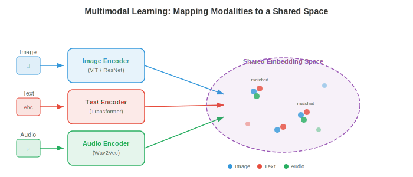
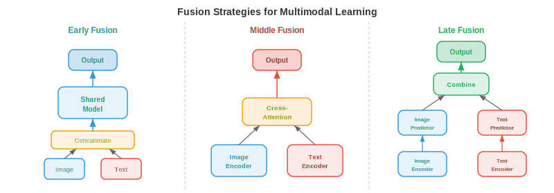
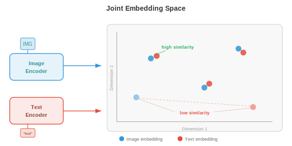
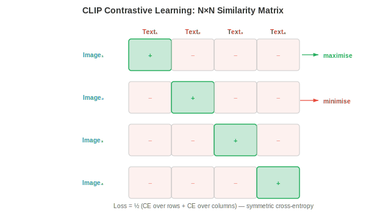
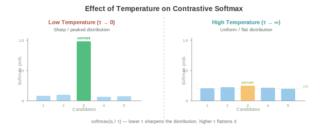
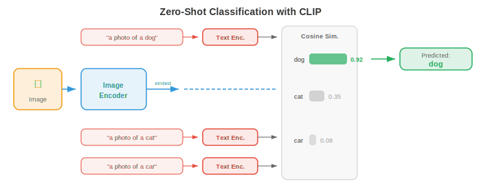
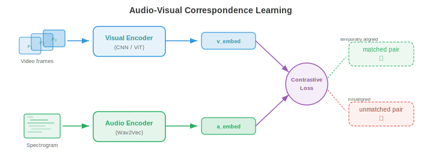
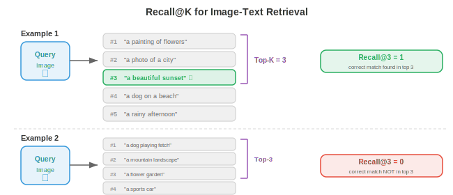

# Мультимодальные представления

*Мультимодальные представления объединяют зрение, язык и аудио в общие пространства эмбеддингов. В этом файле рассматриваются стратегии слияния (fusion), CLIP, ALIGN, SigLIP, контрастивные функции потерь (InfoNCE, NT-Xent), zero-shot классификация и оценка качества поиска.*

- Представьте, что вы сидите в кафе. Вы видите дымящуюся чашку на столе, слышите звон керамики, чувствуете запах обжаренных кофейных зерен и ощущаете тепло, исходящее от кружки. Ни одно из чувств не дает вам полной картины: ваш мозг объединяет эти сигналы в единое восприятие «горячего кофе». **Мультимодальное обучение** делает то же самое для машин: оно комбинирует информацию из нескольких модальностей (зрение, язык, аудио и другие) для построения более богатых и устойчивых представлений, чем те, что может дать любая отдельная модальность.

- **Модальность** — это отдельный канал информации. В машинном обучении наиболее распространенными модальностями являются изображения (сетки пикселей), текст (последовательности токенов), аудио (сигналы или спектрограммы, как в главе 9), видео (последовательности кадров) и структурированные данные (таблицы, графы). Каждая модальность обладает своей статистической структурой: изображения пространственно когерентны, текст последователен и дискретен, аудио темпорально и непрерывно. Задача мультимодального обучения заключается в наведении мостов между этими фундаментально различными типами данных.

- Зачем объединять модальности? Потому что они предоставляют взаимодополняющую информацию. Фотография собаки говорит вам о ее породе и цвете, но не о кличке. Подпись вроде «мой золотистый ретривер Макс» сообщает кличку и породу, но не точную позу. Вместе изображение и текст дают более полную картину, чем по отдельности. Эта взаимодополняемость является основной мотивацией: мультимодальные модели могут отвечать на вопросы, генерировать контент и принимать решения, которые не под силу ни одной унимодальной модели.



## Стратегии слияния (Fusion)

- Подумайте о групповом проекте. Вы можете объединить идеи двумя способами: все работают вместе в одной комнате с самого начала (обмениваясь черновыми заметками и набросками) или каждый пишет свой раздел независимо, а затем вы объединяете готовые документы. Это соответствует **раннему слиянию** (early fusion) и **позднему слиянию** (late fusion) в мультимодальном обучении.

- **Раннее слияние** (также называемое слиянием на уровне признаков) объединяет или смешивает «сырые» или низкоуровневые признаки из разных модальностей до начала какой-либо серьезной обработки. Например, можно объединить пиксельные признаки изображения с эмбеддингами токенов текста и подать полученную последовательность в один трансформер. Модель может с самого начала изучать тонкие кросс-модальные взаимодействия, но пространство входных данных становится большим, и модели приходится учиться обрабатывать очень разные типы данных одновременно.

- Формально, если даны векторы признаков $x_{\text{img}} \in \mathbb{R}^{d_1}$ и $x_{\text{txt}} \in \mathbb{R}^{d_2}$ из двух модальностей, раннее слияние просто объединяет их:

$$x_{\text{fused}} = [x_{\text{img}}; x_{\text{txt}}] \in \mathbb{R}^{d_1 + d_2}$$

- Этот объединенный вектор затем обрабатывается общей нейронной сетью. Преимущество заключается в том, что модель может обнаруживать кросс-модальные корреляции на каждом слое. Недостатком являются вычислительные затраты и сложность выравнивания очень разных типов признаков (плотные значения пикселей против разреженных индексов токенов).

- **Позднее слияние** (также называемое слиянием на уровне решений) обрабатывает каждую модальность независимо через свой собственный энкодер, создавая высокоуровневое представление или даже итоговое предсказание для каждой из них. Затем эти выходные данные объединяются, как правило, путем усреднения оценок, голосования или с помощью обученного слоя комбинации. Позднее слияние проще и позволяет повторно использовать готовые предобученные унимодальные модели, но оно не может уловить низкоуровневые кросс-модальные взаимодействия, поскольку модальности никогда не «видят» «сырые» признаки друг друга.

- Если даны предсказания для каждой модальности $\hat{y}_1$ и $\hat{y}_2$, простое правило позднего слияния выглядит так:

$$\hat{y} = \alpha \hat{y}_1 + (1 - \alpha) \hat{y}_2$$

- где $\alpha \in [0, 1]$ — обученный или подобранный вручную вес смешивания.

- **Промежуточное слияние** (middle fusion) — это прагматичный «золотой стандарт», используемый большинством современных систем. Каждая модальность сначала обрабатывается своим энкодером (извлекающим специфичные для модальности признаки), а затем закодированные представления объединяются на промежуточном этапе работы сети, часто через слои кросс-внимания (cross-attention). Это позволяет каждому энкодеру специализироваться на своей модальности, сохраняя при этом возможность богатых кросс-модальных взаимодействий. Flamingo, LLaVA и большинство моделей «зрение-язык» (файл 02) используют промежуточное слияние.



- Выбор стратегии слияния зависит от доступности данных, вычислительного бюджета и задачи. Раннее слияние мощно, но требует больших объемов данных. Позднее слияние дешево, но ограничено. Промежуточное слияние с кросс-вниманием стало доминирующим подходом в крупномасштабных мультимодальных моделях, поскольку оно балансирует между выразительностью и модульностью.

## Совместные пространства эмбеддингов

- Представьте универсального переводчика, который может взять любое предложение на любом языке и отобразить его в одну и ту же точку в общем «пространстве смыслов». Предложение «собака на пляже» на английском, французском или японском языках попало бы в одну и ту же координату. **Совместные пространства эмбеддингов** делают именно это, но между модальностями: изображение собаки на пляже и текст «собака на пляже» должны отображаться в близкие точки в одном и том же векторном пространстве.

- Формально мы обучаем две функции-энкодера: $f_\theta : \mathcal{X}_1 \to \mathbb{R}^d$ для модальности 1 (например, изображения) и $g_\phi : \mathcal{X}_2 \to \mathbb{R}^d$ для модальности 2 (например, текст). Обе отображают свои входные данные в одно и то же $d$-мерное пространство. Цель обучения состоит в том, чтобы семантически соответствующие пары $(x_1, x_2)$ имели эмбеддинги $f_\theta(x_1)$ и $g_\phi(x_2)$, которые находятся близко друг к другу (высокое косинусное сходство), в то время как несоответствующие пары находились бы далеко друг от друга.

- Это прямое обобщение пространств эмбеддингов слов из главы 7. Напомним, что Word2Vec и GloVe размещали семантически похожие слова рядом друг с другом в векторном пространстве. Пространства совместных эмбеддингов расширяют эту идею на разные модальности: вместо сходства «слово-слово» мы измеряем сходство «изображение-текст», «аудио-текст» или даже «изображение-аудио».

- Метрикой сходства почти всегда является **косинусное сходство** (глава 1):

$$\text{sim}(u, v) = \frac{u \cdot v}{\|u\| \|v\|}$$

- При $L_2$-нормализации всех эмбеддингов на единичную гиперсферу косинусное сходство сводится к простому скалярному произведению $u \cdot v$, которое крайне эффективно вычисляется и может быть ускорено с помощью библиотек для поиска приближенных ближайших соседей.



- Сила пространства совместных эмбеддингов заключается в возможности **zero-shot переноса**. Как только вы выровняли эмбеддинги изображений и текста, вы можете классифицировать изображения по категориям, на которых никогда не обучались: просто представьте названия категорий в виде текста и найдите, какой текстовый эмбеддинг ближе всего к эмбеддингу изображения. Дообучение под конкретную задачу не требуется. Это ключевая идея, лежащая в основе CLIP и его последователей.

## Контрастивное обучение для мультимодального выравнивания

- Представьте упражнение в классе, где студентам дают перемешанные пары фотографий и подписей и просят сопоставить каждую фотографию с правильной подписью. Чтобы сделать это хорошо, нужно понимать как визуальный контент, так и язык, а также знать, как они связаны. **Контрастивное обучение** тренирует модели именно таким образом: имея батч пар (изображение, текст), модель должна определить, какое изображение соответствует какому тексту.

- Как мы видели в главе 8 (файл 04), контрастивное обучение в унимодальной постановке (SimCLR, MoCo) сближает аугментированные представления одного и того же изображения и отдаляет представления разных изображений. Мультимодальное контрастивное обучение заменяет «аугментированные представления» на «соответствующие модальности»: изображение и его подпись составляют положительную пару; изображение в паре с любой другой подписью из батча — отрицательную пару.

### CLIP

- **CLIP** (Contrastive Language-Image Pre-training, Radford et al., 2021) — это фундаментальная модель для мультимодального контрастивного обучения. Она совместно обучает энкодер изображений (ViT или ResNet, глава 8) и текстовый энкодер (трансформер, глава 7) на 400 миллионах пар (изображение, текст), собранных из интернета.

- Получив батч из $N$ пар «изображение-текст», CLIP вычисляет матрицу косинусных сходств $N \times N$ между всеми эмбеддингами изображений и всеми эмбеддингами текста. Диагональные элементы — это соответствующие пары (положительные); все внедиагональные элементы — несоответствующие (отрицательные). Функция потерь при обучении увеличивает значения диагональных элементов и уменьшает значения внедиагональных.

- Используется симметричная кросс-энтропия. Для изображения $i$, сопряженного с текстом $j = i$, функция потерь «изображение-текст» имеет вид:

$$\mathcal{L}_{i \to t} = -\frac{1}{N} \sum_{i=1}^{N} \log \frac{\exp(\text{sim}(z_i^{\text{img}}, z_i^{\text{txt}}) / \tau)}{\sum_{k=1}^{N} \exp(\text{sim}(z_i^{\text{img}}, z_k^{\text{txt}}) / \tau)}$$

- а функция потерь «текст-изображение» аналогична, но с поменянными ролями:

$$\mathcal{L}_{t \to i} = -\frac{1}{N} \sum_{i=1}^{N} \log \frac{\exp(\text{sim}(z_i^{\text{txt}}, z_i^{\text{img}}) / \tau)}{\sum_{k=1}^{N} \exp(\text{sim}(z_i^{\text{txt}}, z_k^{\text{img}}) / \tau)}$$

- Итоговая функция потерь CLIP — это среднее значение:

$$\mathcal{L}_{\text{CLIP}} = \frac{1}{2}(\mathcal{L}_{i \to t} + \mathcal{L}_{t \to i})$$

- Здесь $\tau$ — обучаемый параметр **температуры** (инициализируется значением $\tau = 0.07$). Температура управляет «резкостью» распределения softmax: низкое значение $\tau$ заставляет модель сильнее фокусироваться на ближайшем соответствии, высокое $\tau$ распределяет вероятность более равномерно. CLIP обучается $\tau$ совместно с весами модели, а не рассматривает его как фиксированный гиперпараметр.



- Энкодер изображений в CLIP обычно представляет собой ViT-L/14 (большой Vision Transformer с патчами 14x14, глава 8, файл 04). Текстовый энкодер — это 12-слойный трансформер с причинно-следственной маскировкой (как в GPT, глава 7, файл 04). Оба энкодера проецируют свои выходы в общее 512- или 768-мерное пространство с помощью обучаемого линейного проекционного слоя, за которым следует $L_2$-нормализация.

- Самое примечательное свойство CLIP — это **zero-shot классификация изображений**. Чтобы классифицировать изображение по одной из $K$ категорий, вы создаете $K$ текстовых промптов вида «a photo of a {class name}», получаете эмбеддинг каждого промпта с помощью текстового энкодера, получаете эмбеддинг изображения с помощью энкодера изображений и выбираете класс, чей текстовый эмбеддинг имеет наибольшее косинусное сходство с эмбеддингом изображения. На ImageNet модель CLIP достигает конкурентоспособной точности, не видя ни одного обучающего примера из ImageNet.

### ALIGN

- **ALIGN** (Jia et al., 2021) масштабирует подход CLIP на более шумный и крупный датасет: 1,8 миллиарда пар «изображение-текст» с минимальной фильтрацией. В то время как CLIP тщательно отбирал данные, ALIGN показывает, что масштаб может компенсировать шум. ALIGN использует энкодер изображений EfficientNet и текстовый энкодер BERT, обучаясь с той же контрастивной функцией потерь. Ключевой вывод заключается в том, что при достаточном объеме данных не требуется дорогостоящая очистка: контрастивная целевая функция естественным образом снижает вес шумных пар, так как они порождают противоречивые градиенты.

### SigLIP

- **SigLIP** (Sigmoid Loss for Language-Image Pre-training, Zhai et al., 2023) заменяет контрастивную функцию потерь на основе softmax из CLIP на более простую сигмоидальную функцию потерь. Вместо того чтобы рассматривать матрицу сходства $N \times N$ как задачу классификации (каждая строка — это softmax по столбцам), SigLIP рассматривает каждый элемент независимо как задачу бинарной классификации: является ли данная пара (изображение, текст) соответствующей или нет?

- Функция потерь SigLIP для отдельной пары $(i, j)$ имеет вид:

$$\mathcal{L}_{ij} = -y_{ij} \log \sigma(z_i^{\text{img}} \cdot z_j^{\text{txt}} / \tau) - (1 - y_{ij}) \log(1 - \sigma(z_i^{\text{img}} \cdot z_j^{\text{txt}} / \tau))$$

- где $y_{ij} = 1$, если $i = j$ (совпадение), и $y_{ij} = 0$ в противном случае, а $\sigma$ — это сигмоидная функция.

- Решающее преимущество SigLIP заключается в том, что он устраняет необходимость в глобальной нормализации softmax по всему батчу. В CLIP знаменатель softmax требует сбора всех эмбеддингов со всех устройств, что является узким местом при обмене данными в распределенном обучении. Сигмоидная функция потерь SigLIP для каждой пары может вычисляться локально, что позволяет более эффективно масштабироваться до очень больших батчей. SigLIP достигает качества CLIP при меньших затратах на обучение.

## Контрастивные функции потерь: подробности

- Функции потерь, используемые в контрастивном обучении, имеют общую структуру: все они стремятся сделать показатель сходства положительных пар выше, чем отрицательных, с некоторым понятием «отступа» (margin) или «температуры», контролирующим степень жесткости обучения модели. Давайте формализуем ключевые варианты.

### InfoNCE

- **InfoNCE** (Noise-Contrastive Estimation, van den Oord et al., 2018) — это теоретическая основа функции потерь CLIP. Для заданного запроса $q$, одного положительного ключа $k^+$ и $K$ отрицательных ключей $\{k_1^-, \ldots, k_K^-\}$ функция потерь имеет вид:

$$\mathcal{L}_{\text{InfoNCE}} = -\log \frac{\exp(q \cdot k^+ / \tau)}{\exp(q \cdot k^+ / \tau) + \sum_{j=1}^{K} \exp(q \cdot k_j^- / \tau)}$$

- Это задача классификации по $(K+1)$ классам: определить положительный пример среди $K+1$ кандидатов. InfoNCE является нижней границей взаимной информации между запросом и положительным ключом, поэтому ее максимизация приводит к выравниванию представлений семантически соответствующих входных данных. Граница становится более точной по мере увеличения количества отрицательных примеров $K$, что объясняет, почему контрастивные методы выигрывают от использования больших батчей.

### NT-Xent

- **NT-Xent** (Normalised Temperature-scaled Cross-Entropy, Chen et al., 2020) — это функция потерь, используемая в SimCLR (глава 8, файл 04), которая по сути представляет собой InfoNCE, применяемую симметрично внутри батча. Для батча из $N$ пар $2N$ аугментированных представлений создают $2N - 2$ отрицательных примера для каждого якоря (все представления, кроме самого себя и соответствующего ему положительного примера). Функция потерь для положительной пары $(i, j)$ выглядит так:

$$\ell_{i,j} = -\log \frac{\exp(\text{sim}(z_i, z_j) / \tau)}{\sum_{k=1}^{2N} \mathbf{1}_{[k \neq i]} \exp(\text{sim}(z_i, z_k) / \tau)}$$

- NT-Xent и InfoNCE — это одна и та же математическая формула; названия различаются, поскольку они были введены в разных контекстах (самообучение в компьютерном зрении против теории обучения представлений).

### Роль температуры

- **Температура** $\tau$ — один из важнейших гиперпараметров в контрастивном обучении. Чтобы развить интуицию, представьте температуру в физическом смысле: при высокой температуре молекулы движутся хаотично (softmax «плоский», все отрицательные примеры выглядят одинаково плохими); при низкой температуре молекулы переходят в жесткие структуры (softmax «острый», значение имеют только самые сложные отрицательные примеры).

- Формально, при $\tau \to 0$ softmax приближается к жесткому argmax, который выбирает только один самый сложный отрицательный пример. При $\tau \to \infty$ все отрицательные примеры вносят равный вклад. На практике для нормализованных эмбеддингов хорошо подходят значения $\tau \in [0.01, 0.1]$. Слишком низкая температура вызывает нестабильность обучения (градиенты становятся очень большими для сложных отрицательных примеров); слишком высокая температура делает функцию потерь нечувствительной к нарушениям.

- CLIP инициализирует $\tau = 0.07$ и обучает ее как логарифмически параметризованный скаляр $\tau = \exp(t)$, где $t$ обновляется градиентным спуском вместе с весами модели. Это позволяет модели автоматически регулировать сложность контрастивной задачи в процессе обучения.



### Triplet Loss и альтернативы на основе отступа

- До того как InfoNCE стала доминировать, **triplet loss** (триплетная функция потерь) была стандартом для метрического обучения. Для заданного якоря $a$, положительного примера $p$ и отрицательного примера $n$:

$$\mathcal{L}_{\text{triplet}} = \max(0, \|a - p\|^2 - \|a - n\|^2 + m)$$

- где $m$ — это отступ (margin), который гарантирует, что положительный пример находится как минимум на расстоянии $m$ ближе, чем отрицательный. Triplet loss работает с отдельными триплетами, а не с батчами, что делает ее менее эффективной с точки зрения использования выборки, чем InfoNCE. Она также чувствительна к стратегии майнинга: случайные отрицательные примеры часто слишком просты (функция потерь равна нулю), поэтому **майнинг сложных отрицательных примеров** (выбор ближайшего неверного соответствия) или **полужесткий майнинг** (выбор отрицательных примеров в пределах отступа) имеют решающее значение.

- InfoNCE неявно выполняет майнинг сложных отрицательных примеров по всему батчу, что является одной из причин, по которой она превосходит triplet loss при масштабировании. Нормализация softmax в InfoNCE автоматически увеличивает веса сложных отрицательных примеров (тех, что имеют высокое сходство с якорем), обеспечивая естественную учебную программу без явного майнинга.

## Поиск «изображение-текст» и классификация с нулевым выстрелом (Zero-Shot)

- Имея обученное совместное пространство эмбеддингов, можно выполнять **поиск «изображение-текст»**: по запросу-изображению находить наиболее релевантные тексты из базы данных (поиск «изображение-в-текст») или по текстовому запросу находить наиболее релевантные изображения (поиск «текст-в-изображение»). Это просто поиск ближайших соседей в общем пространстве эмбеддингов.

- Представьте библиотекаря, который может мгновенно сравнить любую фотографию с любой подписью в каталоге из миллиона элементов. Ему не нужно заранее понимать каждую возможную категорию; он просто измеряет, насколько «близка» каждая фотография к каждой подписи. Именно так модели в стиле CLIP выполняют поиск и классификацию с нулевым выстрелом.

- **Классификация с нулевым выстрелом (Zero-shot classification)** — это частный случай поиска «текст-в-изображение». Для заданных $K$ названий классов вы составляете текстовые промпты $\{t_1, \ldots, t_K\}$ (например, «фотография кошки», «фотография собаки») и переводите их в эмбеддинги. Для нового изображения $x$ предсказанный класс равен:

$$\hat{y} = \arg\max_{k} \; \text{sim}(f_\theta(x), g_\phi(t_k))$$

- Ключевая идея заключается в том, что текстовый энкодер выступает в роли гибкого классификатора. Вместо обучения нового линейного слоя для каждой последующей задачи вы просто описываете задачу на естественном языке. Именно поэтому CLIP так хорошо обобщается: текстовый энкодер видел миллионы разнообразных описаний во время предварительного обучения.

- **Промпт-инжиниринг** имеет значение. Точность CLIP в режиме zero-shot на ImageNet возрастает с 63,2% до 68,4% просто при изменении шаблона промпта с "{class name}" на "a photo of a {class name}." Еще лучше работает **промпт-ансамблирование**, при котором усредняются текстовые эмбеддинги нескольких шаблонов (например, "a photo of a {class name}", "a good photo of a {class name}", "a drawing of a {class name}") для получения более устойчивого текстового представления.



## Аудиовизуальное соответствие

- Закройте глаза и послушайте, как кто-то бьет баскетбольным мячом об пол. Вы можете определить момент удара по ритмичным звукам. Теперь откройте глаза: визуальный отскок идеально совпадает с каждым ударом. Это тесное соответствие между аудио- и визуальными событиями является бесплатным сигналом для обучения, который могут использовать машины. **Обучение на основе аудиовизуального соответствия** тренирует модели связывать звуки с их визуальными источниками без какой-либо разметки человеком.

- Эта идея поразительно похожа на CLIP, но заменяет текст аудио. Получая пары видеокадров и аудиосегментов, модель обучается в пространстве эмбеддингов, где временно согласованные аудиовизуальные пары находятся близко, а несогласованные — далеко друг от друга.

- Методы **аудиовизуальных эмбеддингов (AVE)** (Arandjelovic and Zisserman, 2017) обучают визуальный энкодер $f$ и аудиоэнкодер $g$ с использованием контрастивной функции потерь на видеоданных. Положительной парой является (видеокадр, аудиоклип из того же момента времени), а отрицательными — аудиоклипы из других видео или других моментов времени. Модель узнает, что звук лая соответствует изображению собаки, а звук гитары — изображению гитары, и все это без меток.

- Аудиоэнкодер обычно обрабатывает **лог-мел спектрограммы** (глава 9, файл 01) с помощью сверточной нейронной сети (CNN) или аудио-трансформера, создавая эмбеддинг фиксированного размера. Визуальный энкодер обрабатывает видеокадры с помощью стандартного «бэкбона» для изображений (ResNet, ViT). Оба проецируют данные в общее $d$-мерное пространство, а обучение использует ту же функцию потерь InfoNCE, что и в CLIP:

$$\mathcal{L}_{\text{AV}} = -\log \frac{\exp(\text{sim}(z^{\text{vis}}, z^{\text{aud}}) / \tau)}{\sum_{k=1}^{N} \exp(\text{sim}(z^{\text{vis}}, z_k^{\text{aud}}) / \tau)}$$



- **Приложения** аудиовизуального обучения включают: локализацию источника звука (в какой части изображения находится источник звука?), аудиовизуальное распознавание речи (объединение движений губ с аудио, как в главе 9, файл 02), аудиовизуальное разделение источников (выделение голоса одного говорящего путем наблюдения за его лицом, «проблема коктейльной вечеринки» из главы 9, файл 05) и генерацию видео, обусловленную аудио.

- **ImageBind** (Girdhar et al., 2023) расширяет этот подход на шесть модальностей: изображения, текст, аудио, глубина, тепловизионные данные и данные IMU. Ключевая идея заключается в том, что не нужно иметь парные данные для каждой комбинации. Путем выравнивания каждой модальности с изображениями (используя пары изображение-текст для текста, пары изображение-аудио для аудио и т. д.), все модальности неявно выравниваются через общее пространство эмбеддингов изображений. Эта «привязка» через общую якорную модальность создает эмерджентное выравнивание: аудио и текст становятся похожими, даже если они никогда не обучались вместе напрямую.

## Оценка

- Оценка мультимодальных моделей требует метрик, которые учитывают кросс-модальное понимание. Двумя доминирующими парадигмами оценки являются **zero-shot бенчмарки** и **метрики поиска**.

### Zero-Shot бенчмарки

- Zero-shot оценка измеряет, может ли модель выполнять задачи, для которых она не была специально обучена. Самым распространенным бенчмарком является **точность ImageNet в режиме zero-shot**: все 1000 названий классов ImageNet встраиваются как текст, каждое тестовое изображение также встраивается, и измеряется точность классификации top-1 и top-5 на основе косинусного сходства. CLIP ViT-L/14 достигает 75,5% точности top-1 в режиме zero-shot, что сопоставимо с обученным с учителем ResNet-50 на ImageNet.

- Другие zero-shot бенчмарки включают: CIFAR-10/100, STL-10, Food-101, Oxford Pets и Flowers-102. Оценка на множестве датасетов позволяет проверить, обладает ли модель подлинным общим визуальным пониманием или она просто запомнила паттерны из своих данных предварительного обучения.

- Оценка методом **линейного зондирования (linear probe)** является дополнительным тестом. Вы замораживаете предварительно обученный визуальный энкодер, извлекаете признаки для размеченного датасета и обучаете поверх них простой линейный классификатор. Это позволяет измерить качество выученных представлений независимо от механизма zero-shot поиска. Признаки CLIP являются отличными признаками для линейного зондирования, часто соответствуя или превосходя результаты обучения с учителем.

### Метрики поиска

- Для задач поиска (изображение по тексту и текст по изображению) стандартной метрикой является **Recall@K** (R@K): доля запросов, для которых правильное соответствие входит в топ-$K$ результатов поиска. Распространенными значениями являются R@1, R@5 и R@10.

- Формально, для набора из $Q$ запросов:

$$\text{R@}K = \frac{1}{Q} \sum_{q=1}^{Q} \mathbf{1}[\text{rank}(q) \leq K]$$

- где $\text{rank}(q)$ — позиция правильного соответствия в ранжированном списке результатов для запроса $q$.

- Стандартные бенчмарки для поиска включают **Flickr30K** (31 000 изображений, каждое с 5 описаниями) и **MS-COCO** (123 000 изображений, каждое с 5 описаниями). Оценка проводится на тестовой выборке: по заданному изображению нужно найти правильное описание (или описания) из полного тестового набора, и наоборот.

- **Медианный ранг** (MedR) — это дополнительная метрика: медианная позиция правильного соответствия по всем запросам. У идеальной модели MedR = 1. Чем меньше значение, тем лучше.

- Помимо поиска, мультимодальные модели также оцениваются на бенчмарках композиционного понимания, таких как **Winoground** (который проверяет, может ли модель отличить «кружку в собаке» от «собаки в кружке») и **ARO** (Attribute, Relation, Order), которые проверяют, действительно ли модель понимает структуру языка или просто сопоставляет «мешки слов». Модели типа CLIP часто испытывают трудности с этим, что выявляет фундаментальное ограничение: контрастивное предварительное обучение выравнивает глобальную семантику, но может не улавливать тонкую композиционную структуру.



## Подводя итоги

- Мультимодальные представления, рассмотренные в этом файле, составляют основу для всего, что последует в этой главе. Совместные эмбеддинг-пространства, обученные с помощью CLIP и его преемников, являются тем «клеем», который связывает зрение и язык. Файл 02 развивает эту основу с помощью моделей «зрение-язык», которые выходят за рамки поиска и генерируют текст по изображениям. Файл 03 исследует, как изображения и видео токенизируются для использования в последовательностных моделях. Файл 04 охватывает кросс-модальную генерацию (текст в изображение, текст в видео). А файл 05 рассматривает унифицированные архитектуры, которые обрабатывают несколько модальностей в рамках одной модели.

- Основной вывод: контрастивное обучение на парных данных создает эмбеддинг-пространства, где различные модальности взаимозаменяемы. Эмбеддинг изображения и эмбеддинг текста становятся «объектами одного типа», что позволяет выполнять классификацию с нулевым снимком (zero-shot), поиск и бесшовную интеграцию в более крупные системы. Простота этой идеи — просто сближать совпадающие пары и отдалять несовпадающие — скрывает её необычайную эффективность.

## Задачи по программированию (используйте CoLab или ноутбук)

1. Реализуйте контрастивную функцию потерь CLIP с нуля. Создайте случайные эмбеддинги изображений и текста, вычислите матрицу сходства и рассчитайте симметричную кросс-энтропию.
```python
import jax
import jax.numpy as jnp
import matplotlib.pyplot as plt

def clip_loss(image_embeds, text_embeds, temperature=0.07):
    """Compute symmetric CLIP contrastive loss."""
    # L2 normalise embeddings
    image_embeds = image_embeds / jnp.linalg.norm(image_embeds, axis=1, keepdims=True)
    text_embeds = text_embeds / jnp.linalg.norm(text_embeds, axis=1, keepdims=True)

    # Compute cosine similarity matrix (N x N)
    logits = image_embeds @ text_embeds.T / temperature  # (N, N)

    # Labels: the diagonal (i-th image matches i-th text)
    N = logits.shape[0]
    labels = jnp.arange(N)

    # Symmetric cross-entropy: image-to-text + text-to-image
    loss_i2t = -jnp.mean(jax.nn.log_softmax(logits, axis=1)[jnp.arange(N), labels])
    loss_t2i = -jnp.mean(jax.nn.log_softmax(logits, axis=0)[labels, jnp.arange(N)])
    return (loss_i2t + loss_t2i) / 2, logits * temperature

# Simulate a batch of 8 image-text pairs in 64-dim space
key = jax.random.PRNGKey(42)
k1, k2 = jax.random.split(key)
N, D = 8, 64
image_embeds = jax.random.normal(k1, (N, D))
text_embeds = jax.random.normal(k2, (N, D))

loss, sim_matrix = clip_loss(image_embeds, text_embeds)
print(f"CLIP loss (random embeddings): {loss:.4f}")

# Visualise the similarity matrix
fig, ax = plt.subplots(figsize=(6, 5))
im = ax.imshow(sim_matrix, cmap='coolwarm', vmin=-1, vmax=1)
ax.set_xlabel("Text index"); ax.set_ylabel("Image index")
ax.set_title(f"Cosine Similarity Matrix (loss={loss:.3f})")
plt.colorbar(im); plt.tight_layout(); plt.show()
# Try changing temperature (0.01, 0.1, 1.0) and observe how loss changes
# Try making matched pairs similar: set text_embeds = image_embeds + small noise
```

2. Создайте игрушечную модель совместного эмбеддинга, которая учится выравнивать 2D-«изображения» (случайные векторы) с «подписями» (другие случайные векторы), используя функцию потерь InfoNCE и градиентный спуск.
```python
import jax
import jax.numpy as jnp
import matplotlib.pyplot as plt

def info_nce_loss(img_enc, txt_enc, img_data, txt_data, tau=0.1):
    """InfoNCE over a batch of paired (image, text) data."""
    z_img = img_data @ img_enc  # (N, D)
    z_txt = txt_data @ txt_enc  # (N, D)
    # L2 normalise
    z_img = z_img / jnp.linalg.norm(z_img, axis=1, keepdims=True)
    z_txt = z_txt / jnp.linalg.norm(z_txt, axis=1, keepdims=True)
    logits = z_img @ z_txt.T / tau
    labels = jnp.arange(logits.shape[0])
    return -jnp.mean(jax.nn.log_softmax(logits, axis=1)[jnp.arange(len(labels)), labels])

# Create 32 paired samples: img in R^8, txt in R^6, embed into R^4
key = jax.random.PRNGKey(0)
k1, k2, k3, k4 = jax.random.split(key, 4)
N, d_img, d_txt, d_embed = 32, 8, 6, 4

img_data = jax.random.normal(k1, (N, d_img))
txt_data = jax.random.normal(k2, (N, d_txt))

# Learnable projection matrices
img_enc = jax.random.normal(k3, (d_img, d_embed)) * 0.1
txt_enc = jax.random.normal(k4, (d_txt, d_embed)) * 0.1

grad_fn = jax.jit(jax.grad(info_nce_loss, argnums=(0, 1)))
lr = 0.05
losses = []

for step in range(300):
    loss = info_nce_loss(img_enc, txt_enc, img_data, txt_data)
    losses.append(float(loss))
    g_img, g_txt = grad_fn(img_enc, txt_enc, img_data, txt_data)
    img_enc = img_enc - lr * g_img
    txt_enc = txt_enc - lr * g_txt

print(f"Initial loss: {losses[0]:.3f}, Final loss: {losses[-1]:.3f}")
print(f"Random baseline (log N): {jnp.log(N):.3f}")

plt.figure(figsize=(8, 4))
plt.plot(losses, color='#2c3e50')
plt.axhline(y=0, color='green', linestyle='--', alpha=0.5, label='Perfect alignment')
plt.axhline(y=float(jnp.log(N)), color='red', linestyle='--', alpha=0.5, label='Random (log N)')
plt.xlabel("Step"); plt.ylabel("InfoNCE Loss")
plt.title("Learning a Joint Embedding Space")
plt.legend(); plt.grid(alpha=0.3); plt.tight_layout(); plt.show()
# Modify d_embed (try 2, 4, 16) to see how embedding dimension affects alignment
```

3. Реализуйте классификацию с нулевым снимком (zero-shot) с использованием предварительно вычисленных эмбеддингов. Смоделируйте «прототипы» классов как текстовые эмбеддинги и классифицируйте новые изображения с помощью поиска ближайших соседей.
```python
import jax
import jax.numpy as jnp
import matplotlib.pyplot as plt

# Simulate 5 classes, each with a prototype text embedding in R^32
key = jax.random.PRNGKey(42)
n_classes, d = 5, 32
class_names = ["cat", "dog", "car", "plane", "ship"]

# Class prototypes (imagine these came from a text encoder)
k1, k2 = jax.random.split(key)
class_prototypes = jax.random.normal(k1, (n_classes, d))
class_prototypes = class_prototypes / jnp.linalg.norm(class_prototypes, axis=1, keepdims=True)

# Generate 200 test "images" (embeddings near their class prototype + noise)
n_per_class = 40
true_labels = jnp.repeat(jnp.arange(n_classes), n_per_class)
keys = jax.random.split(k2, n_classes * n_per_class)

image_embeds = []
for i in range(n_classes):
    noise = jax.random.normal(keys[i], (n_per_class, d)) * 0.5
    cluster = class_prototypes[i] + noise
    image_embeds.append(cluster)
image_embeds = jnp.concatenate(image_embeds, axis=0)
image_embeds = image_embeds / jnp.linalg.norm(image_embeds, axis=1, keepdims=True)

# Zero-shot classification: cosine similarity with each prototype
similarities = image_embeds @ class_prototypes.T  # (200, 5)
predicted_labels = jnp.argmax(similarities, axis=1)
accuracy = jnp.mean(predicted_labels == true_labels)
print(f"Zero-shot accuracy: {accuracy:.1%}")

# Confusion matrix
conf = jnp.zeros((n_classes, n_classes), dtype=jnp.int32)
for true, pred in zip(true_labels, predicted_labels):
    conf = conf.at[true, pred].add(1)

fig, ax = plt.subplots(figsize=(6, 5))
im = ax.imshow(conf, cmap='Blues')
ax.set_xticks(range(n_classes)); ax.set_xticklabels(class_names, rotation=45)
ax.set_yticks(range(n_classes)); ax.set_yticklabels(class_names)
ax.set_xlabel("Predicted"); ax.set_ylabel("True")
for i in range(n_classes):
    for j in range(n_classes):
        ax.text(j, i, int(conf[i, j]), ha='center', va='center', fontsize=11)
ax.set_title(f"Zero-Shot Confusion Matrix (acc={accuracy:.1%})")
plt.colorbar(im); plt.tight_layout(); plt.show()
# Try increasing noise (0.5 -> 1.0 -> 2.0) to see accuracy degrade
# Try adding prompt ensembling: average 3 noisy copies of each prototype
```
