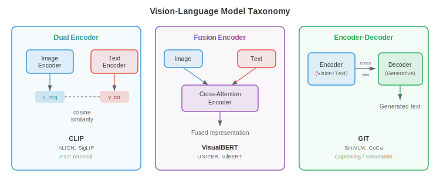
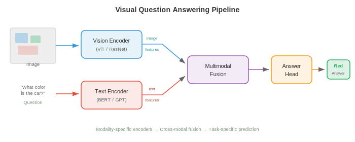
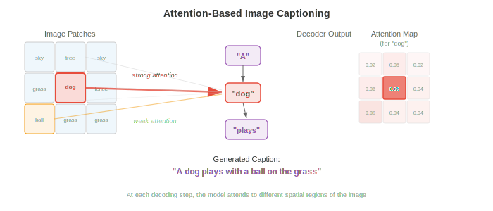
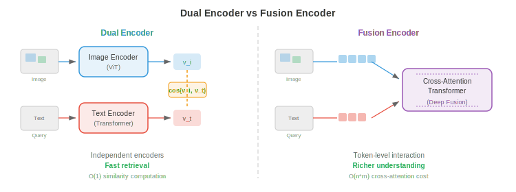
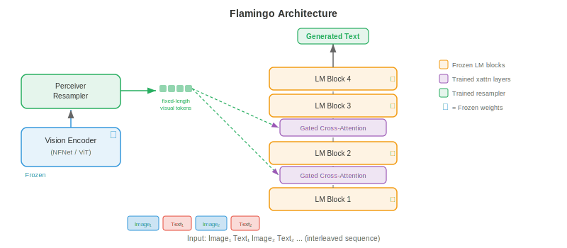
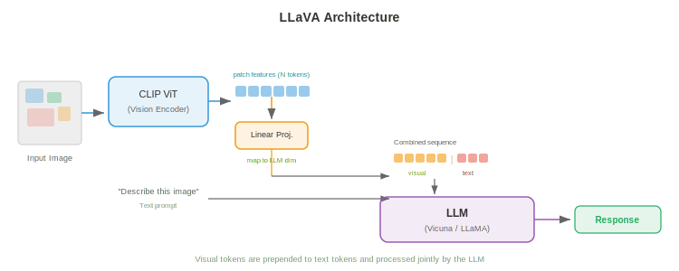
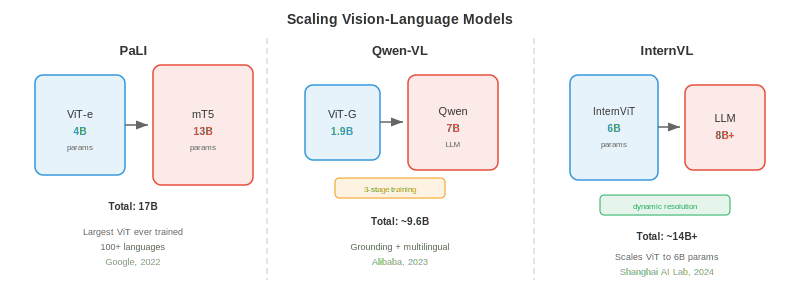
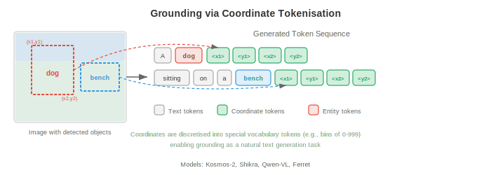
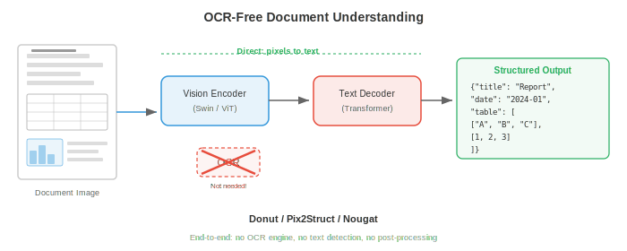
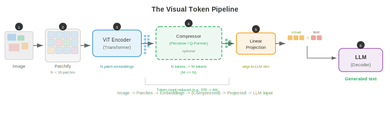

# 视觉语言模型

*视觉语言模型联合理解图像与文本，支持视觉问答、image captioning 与视觉推理。本文件涵盖 VQA、image captioning、visual grounding，以及如 VisualBERT、BLIP、LLaVA、Flamingo、PaLI、Qwen-VL 等把 vision encoder 与大语言模型融合的架构。*

- 想象一位博物馆导览，能看着一幅画并把关于它的一切娓娓道来：有哪些物件、讲述什么故事、传达何种情感，并回答访客可能提出的任何问题。**vision language model (VLM)**（视觉语言模型）正是其计算对应——一个联合理解图像与文本的系统，能描述视觉场景、回答关于它的问题、遵循视觉指令，乃至在给定自然语言查询时在图像内定位具体物件。

- VLM 处于第 8 章的 vision encoder 与第 7 章的语言模型的交叉点。核心工程挑战是桥接两个截然不同的表示世界：视觉骨干的空间连续特征图与语言模型的序列离散 token embedding。本文件中的每个架构本质上都是对"如何融合视觉与语言"这一问题的不同回答。



## 视觉问答

- 想象有人给你看一张照片并问"公园里有多少只狗？"你毫不费力地解析图像、定位狗、数出数量并给出答案。**Visual question answering (VQA)**（视觉问答）将其形式化：给定图像 $I$ 与自然语言问题 $q$，预测答案 $a$。

- 该任务可用多种方式框架。最常见的是把 VQA 视为 **open-ended classification**（开放分类）：模型从最常见答案的固定词表选择（如 VQA v2 中前 3,129 个答案）。也可作为 **generative answering**（生成式回答），模型产生自由形式文本串——这是现代 VLM 所用方法。

- 形式上，要学习函数 $f(I, q) \to a$，最大化正确答案的似然。在分类设置中变为：

$$p(a \mid I, q) = \text{softmax}(W \cdot g(v, h))$$

- 其中 $v$ 是视觉特征向量（来自 CNN 或 ViT），$h$ 是问题编码（来自 LSTM 或 Transformer），$g$ 是融合它们的函数。$g$ 的设计是真正的架构创意所在。

- **VQA v1**（Antol 等，2015）引入该基准，在 MS COCO 的 204,000 张图上设 614,000 个问题。研究者很快发现，模型可利用 **language prior**（语言先验）取得惊人高准确率——对 "how many" 问题答 "2"、对 "is there" 问题答 "yes" 而不查看图像。

- **VQA v2**（Goyal 等，2017）通过把每个问题与两张相似但答案不同的图像配对解决此问题。这迫使模型真正在视觉内容上建立推理。平衡对设置大致使数据集翻倍，使纯语言捷径大幅失效。

- 其他重要 VQA 数据集包括 **GQA**（Hudson & Manning，2019），含需多步推理的组合问题；**OK-VQA**（Marino 等，2019），需图像之外的常识；**TextVQA**（Singh 等，2019），答案依赖阅读图像内文本。



- 早期 VQA 模型用简单策略：从预训练 CNN（通常第 8 章 ResNet 或 VGGNet 的倒数第二层）提取图像特征，用 LSTM（第 6 章）编码问题，再组合。组合函数 $g$ 快速演进：从简单逐元素乘，到 bilinear pooling，到多模态 Tucker 分解。**Bilinear attention** 计算 $v^T W h$，其中 $W$ 是可学习交互矩阵，但完整 bilinear 形式有 $O(d_v \times d_h)$ 参数，过大不可行。**MLB**（multimodal low-rank bilinear pooling）将其分解为两个低秩投影，使其可行。

- VQA 的突破是 attention。**Stacked Attention Networks**（Yang 等，2016）用问题编码对空间图像区域做 attention，迭代精化聚焦图像哪部分。这一思想——让问题"查看"相关图像区域——成为标准。

## Image Captioning

- 想象一位朋友看着你的度假照叙述所见："A golden retriever is catching a frisbee on a sunny beach." **Image captioning**（图像描述）是生成图像自然语言描述的任务。与 VQA 不同，没有问题——模型自己决定什么值得描述。

- **Show and Tell**（Vinyals 等，2015）确立了 captioning 的经典 encoder-decoder 架构。CNN encoder（如 Inception 或 ResNet）产生单个图像特征向量 $v$。该向量用作 LSTM decoder 的初始隐藏状态，后者自回归地逐词生成说明：

$$p(w_t \mid w_{1:t-1}, I) = \text{LSTM}(w_{t-1}, h_{t-1})$$

- 整个模型通过最大化真值说明的对数似然 end-to-end 训练。推理时用 beam search（第 7 章）找高概率说明。

- Show and Tell 的问题是把整张图像压缩进单个向量。对复杂场景，单个向量无法捕捉所有相关细节。空间信息丢失——模型在生成不同词时无法"回看"图像的具体部分。

- **Show, Attend and Tell**（Xu 等，2015）通过引入**对图像区域的 attention** 解决此问题。CNN 不再把图像编码为一个向量，而产生空间特征网格（如 VGGNet 最后卷积层的 $14 \times 14 \times 512$）。每个解码步，模型对这些空间位置计算 attention 权重，产生突出当前词最相关区域的 context vector。

- 回忆第 6 章的 attention 机制：decoder 隐藏状态作 query，空间特征作 key 与 value，attention 权重告诉模型看何处。作者提出两个变体：**soft attention**（可微，所有区域的加权平均）与 **hard attention**（随机采样单个区域，用 REINFORCE 训练）。



- 这些模型产生的 attention 图出奇地可解释：生成 "dog" 时 attention 在狗区域达峰；生成 "beach" 时转到沙与水。这是首批令人信服地展示 attention 提供内置可解释性的演示之一。

- **CIDEr**（Vedantam 等，2015）、**METEOR**、**BLEU** 与 **SPICE** 是标准 captioning 评估指标。CIDEr 计算生成与参考说明之间的 TF-IDF 加权 n-gram 相似度，专为 captioning 评估设计。现代 VLM 通常在 MS COCO Captions 与 NoCaps 等 captioning 基准上以 CIDEr 评估。

- 后续 captioning 模型引入 **bottom-up attention**（Anderson 等，2018），先用目标检测器（Faster R-CNN，第 8 章）提出显著图像区域，captioning 模型在这些区域特征而非均匀网格上做 attention。这是基于 ViT 的 encoder 取代之前的主导方法。

## 架构模式

- 每个 VLM 都须回答一个根本设计问题：视觉与语言在何处交互？答案定义模型的架构家族。有三种主要模式，各有不同权衡。

### Dual Encoder

- 想象两位翻译独立工作——一位读法语文档，另一位读英语文档——各在共享"通用语言"中产生摘要。他们翻译时不交流，但摘要可直接比较。这就是 **dual encoder** 模式。

- vision encoder $f_v$ 与 text encoder $f_t$ 独立把各自输入映射到 $d$ 维共享 embedding 空间。图像 embedding 为 $v = f_v(I) \in \mathbb{R}^d$，文本 embedding 为 $t = f_t(q) \in \mathbb{R}^d$。相似度通过点积或余弦相似度计算：$\text{sim}(I, q) = v^T t / (\|v\| \|t\|)$。

- CLIP（Radford 等，2021），在上一篇多模态表示文件中涵盖，是典型的 dual encoder。它在 4 亿对从互联网抓取的图文对上用 contrastive 目标（InfoNCE）训练。因 encoder 独立，可预计算并缓存所有图像 embedding，使检索极高效——搜索时只需编码 query 文本。

- dual encoder 的弱点是视觉与语言从不在特征级交互。模型无法做细粒度跨模态推理：例如无法判断说明中某个具体词是否对应图像某个区域。这限制了它在 VQA 或 grounded captioning 等任务上的有用性。

### Fusion Encoder

- 现在想象两位翻译在同一房间，主动讨论两份文档。他们可指向具体段落、互相提问、构建联合理解。这就是 **fusion encoder** 模式。

- 两个模态被编码后通过 **cross-attention layer** 融合，一个模态的 token 对另一模态的 token 做 attention。图像先由 vision encoder 处理为 patch 或区域 token 序列 $V = [v_1, \ldots, v_N]$。文本被 tokenize 为 $T = [t_1, \ldots, t_M]$。在融合层，文本 token 通过 cross-attention 关注图像 token：

$$\text{CrossAttn}(T, V) = \text{softmax}\!\left(\frac{(TW_Q)(VW_K)^T}{\sqrt{d_k}}\right)(VW_V)$$

- 这实现细粒度交互：每个文本 token 可关注它所需的特定图像区域。**VisualBERT**、**VilBERT** 与 **UNITER** 等模型使用此模式。代价是无法为检索预计算独立 embedding——每个图文对需经融合层的完整前向。



### Encoder-Decoder

- **encoder-decoder** 模式把 vision encoder 与自回归生成输出 token 的文本 decoder 结合，类似第 7 章的 seq2seq 模型。vision encoder 产生上下文化图像表示，文本 decoder 在生成输出文本时对其 cross-attend。

- 该模式天然支持生成任务：captioning、自由形式答案的 VQA 与 visual dialogue。**GIT**（Generative Image-to-text Transformer，Wang 等，2022）、**CoCa**（Contrastive Captioner，Yu 等，2022）与 **PaLI** 使用此架构。CoCa 巧妙结合 dual encoder 与 encoder-decoder 模式：文本 decoder 前半层作为单模态文本 encoder（用于 contrastive learning），后半层对图像特征 cross-attend（用于生成 captioning），兼得两者之长。

- 这三种模式的选择取决于目标任务。dual encoder 最适合大规模检索。fusion encoder 最适合细粒度理解任务。encoder-decoder 对生成任务最灵活。现代 SOTA VLM 越来越采用 encoder-decoder 或 decoder-only 范式，把每个 vision-language 任务当作文本生成。

## Flamingo：少样本多模态学习

- 想象一位经验丰富的专家，多年研究艺术与文学后，能看着全新绘画风格，仅看一两例就优雅描述。**Flamingo**（Alonso 等，2022，DeepMind）基于同样原理：它利用强大的预训练语言模型与预训练 vision encoder，用使多模态任务少样本学习成为可能的轻量级架构组件连接它们。

- Flamingo 的设计哲学保守而有效：保持预训练 vision encoder（NFNet）与语言模型（Chinchilla）冻结，只学习连接它们的"胶水"。该胶水有两部分：**Perceiver Resampler** 与 **gated cross-attention layer**。

- **Perceiver Resampler** 接收 vision encoder 的变长输出（依赖图像分辨率）并压缩为固定 $N$ 个视觉 token（通常 $N = 64$）。它初始化一组 $N$ 个可学习 query 向量，用 cross-attention 让这些 query 关注完整 vision encoder 输出集。这本质上是把 Perceiver 架构（Jaegle 等，2021）用作瓶颈——无论输入图像大小都产生紧凑、定长的视觉表示。

$$z = \text{CrossAttn}(Q_{\text{learned}}, V_{\text{image}}) \in \mathbb{R}^{N \times d}$$

- **gated cross-attention layer** 交错在冻结的语言模型层之间。在每个这样的层，语言模型的文本 token 对 Perceiver Resampler 产生的视觉 token cross-attend。关键地，每个 gated cross-attention layer 含一个可学习标量门 $\alpha$，初始化为零，在把 cross-attention 输出加到残流之前乘以它：

$$\hat{x} = x + \alpha \cdot \text{CrossAttn}(x, z)$$

- 初始化 $\alpha = 0$ 意味着训练开始时 cross-attention 无贡献，模型行为与原始冻结语言模型完全一致。门在训练中逐渐开启，平滑集成视觉信息而不破坏语言模型的预训练表示。



- Flamingo 原生处理 **interleaved image-text sequence**（交错图文序列）。可给它一个含多张图与文本交错的 prompt，如："[Image 1] This is a cat. [Image 2] This is a dog. [Image 3] This is a ___." 模型把每张图经 vision encoder 与 Perceiver Resampler 处理，所得视觉 token 插入文本序列对应位置。语言模型的 causal attention mask 确保每个文本 token 只能关注当前及之前图像的视觉 token。

- 这种交错使强大的 **few-shot multimodal learning**（少样本多模态学习）成为可能。通过在上下文中提供几个图文示例，Flamingo 无需任何梯度更新就能执行新任务。在 VQAv2、OK-VQA 与 captioning 等基准上，80B 参数的 Flamingo 取得 SOTA 少样本表现，常仅用 4 或 32 个示例就匹配或超过 fine-tuned 的专用模型。

## LLaVA 与视觉指令微调

- 想象你有一位出色的语言专家（LLM）与一位出色的艺术评论家（vision encoder）。若你能教会艺术评论家"说语言专家的语言"，他们就能无缝协作。**LLaVA**（Large Language and Vision Assistant，Liu 等，2023）正是如此：它用简单线性层把视觉特征投射到 LLM 的 token embedding 空间，再在指令跟随数据上 fine-tune 整个系统。

- LLaVA 架构惊人地简单。图像由预训练 CLIP ViT-L/14 vision encoder 编码为 patch 特征网格 $V \in \mathbb{R}^{N \times d_v}$，其中 $N = 256$ patch（336px 图像配 14px patch）。**projection layer** $W$ 把这些视觉特征映射到 LLM 的 embedding 维度：

$$H_v = VW, \quad W \in \mathbb{R}^{d_v \times d_{\text{LLM}}}$$

- 投射后的视觉 token $H_v$ 简单地与文本 token embedding 拼接送入 LLM（Vicuna，fine-tuned LLaMA）作为单一序列。LLM 用其标准 causal self-attention 处理它们——无特殊 cross-attention 层、无 perceiver、只是拼接。视觉 token 被当作恰好编码视觉信息的文本 token。



- **Visual instruction tuning**（视觉指令微调）是 LLaVA 的关键训练创新。作者用 GPT-4 从 COCO 图像生成 158,000 个多模态指令跟随示例。每个示例由图像配一段对话式指令（如"详细描述这张图"、"这张图有何不寻常"、"若我是到访此地的游客，我应知道什么"）组成。模型被训练以在图像与指令下生成 GPT-4 撰写的响应。

- 训练分两阶段。**阶段 1（pre-training）**：仅 projection layer $W$ 在图文对（595K 来自 CC3M）上训练，vision encoder 与 LLM 都冻结。这教 $W$ 把视觉特征与 LLM 的 embedding 空间对齐。**阶段 2（fine-tuning）**：projection layer 与 LLM 联合在指令跟随数据上 fine-tune，vision encoder 保持冻结。这教模型遵循复杂视觉指令。

- **LLaVA-1.5** 用三项关键改动改进原版：用两层 MLP 取代单层线性投影（更具表达力的映射）、用更高分辨率图像（336px 而非 224px，产生更多 patch token）、并把学术 VQA 数据集加入训练混合。这些看似微小的改动带来基准性能的大幅跃升。

- LLaVA 方法表明无需 Flamingo 的 Perceiver Resampler 或 gated cross-attention 等复杂架构创新。简单线性投影配高质量指令微调数据就足以把 vision encoder 接到 LLM。这种简洁使 LLaVA 极具影响力——大多数后续开源 VLM 遵循类似配方。

## 扩展视觉-语言模型

- 该领域快速从概念验证 VLM 转向在数十亿图文对上训练的工业级系统。三个模型家族展示了不同的扩展方式。

### PaLI

- **PaLI**（Pathways Language and Image model，Chen 等，2022，Google）同时扩展 vision encoder 与语言模型。PaLI 用 ViT-e（4B 参数）作 vision encoder，mT5（13B 参数）作语言模型，共 17B 参数。图像被编码为 patch token 序列，前置于文本 token 送入 encoder-decoder mT5。

- PaLI 的关键洞见是 **scaling the vision encoder matters as much as scaling the language model**（扩展 vision encoder 与扩展语言模型同等重要）。以往工作通常用固定的中等规模视觉骨干（如 ViT-B 或 ViT-L），把参数预算全投给 LLM。PaLI 表明 4B 参数的 ViT-e（在 JFT-4B 上预训练，40 亿标注图像）显著提升 OCR 与空间推理等细粒度视觉任务的表现。

- PaLI 在 WebLI（109 种语言、100 亿图文对的数据集）上训练，故天然多语言。模型用混合任务预训练：image captioning、VQA 与图文匹配，全部转为 text-to-text 生成（遵循第 7 章 T5 范式）。**PaLI-X**（55B 参数）与 **PaLI-3**（5B，用 SigLIP 作 vision encoder）是后续迭代。

### Qwen-VL

- **Qwen-VL**（Bai 等，2023，阿里巴巴）在 Qwen LLM 之上加 ViT vision encoder 与单层 cross-attention 模块（类似 Flamingo 的 Perceiver Resampler），把 vision encoder 输出压缩为固定 256 个视觉 token。视觉 token 与文本 token 拼接由 Qwen LLM 处理。

- Qwen-VL 训练用三阶段配方。阶段 1：在 14 亿弱监督图文对上预训练，仅 vision encoder 解冻。阶段 2：在含 VQA、captioning、grounding 与 OCR 数据集的更高质量数据上多任务预训练，全模型解冻。阶段 3：在指令跟随与对话数据上监督 fine-tune。这种从嘈杂网页数据到策划指令数据的渐进精炼是大多数现代 VLM 共享的模式。

- **Qwen2-VL**（2024）引入 **dynamic resolution**（动态分辨率）支持：不把所有图像缩放到固定大小，而通过动态调整视觉 token 数在原生分辨率处理图像。高分辨率图像产生更多 token，低分辨率产生更少。这在不浪费低分辨率输入计算的同时提升了文档理解与细粒度识别等细节敏感任务的性能。

### InternVL

- **InternVL**（Chen 等，2024，上海 AI Lab）激进扩展 vision encoder，用 InternViT-6B——60 亿参数的 vision transformer——配语言模型。关键架构贡献是 **dynamic high-resolution processing**（动态高分辨率处理）：图像被切成 448x448 像素的 tile，每块独立由 vision encoder 处理，所得 tile 特征与全图缩略图特征拼接。这使模型能处理任意宽高比与分辨率的图像。

- InternVL-2 进一步引入 **progressive alignment training**（渐进对齐训练）：先用 contrastive 目标对齐 vision encoder（如 CLIP），再通过轻量 MLP connector 连接到 LLM，最后在指令数据上 end-to-end fine-tune。渐进策略防止 vision encoder 预训练表示的灾难性遗忘。



- 三个家族的共同主题是 **training data curation**（训练数据策划）的重要性。原始网页抓取的图文对嘈杂且常错配。连续训练阶段逐步过滤与精炼数据，从数十亿嘈杂对到数百万高质量指令示例。最终 fine-tune 数据的质量常比模型原始参数量更重要。

## Grounding 与指代

- 想象在人群中指着一个人说"the woman in the red hat"。你用语言指代一个具体空间区域。**Visual grounding**（视觉接地）是其反向：给定图像与自然语言表达，模型须识别（定位）所指对象。**Referring expression comprehension**（指代表达理解）产生边界框；**referring expression segmentation**（指代表达分割）产生像素 mask。

- 形式上，给定图像 $I$ 与指代表达 $r$（如 "the large brown dog on the left"），模型预测边界框 $b = (x, y, w, h)$ 或一组定位指代对象的坐标。数据集包括 **RefCOCO**、**RefCOCO+** 与 **RefCOCOg**，各含有多对象的图像与每个对象的无歧义指代表达。

- 早期 grounding 模型用两阶段方法：先生成区域提议（来自 Faster R-CNN 等），再用融合模型对每个提议按语言 query 打分。得分最高的区域即预测。这计算昂贵且受提议质量限制。

- 现代 VLM 把 grounding 直接集成到生成框架。关键思想是把边界框坐标表示为**文本 token**。把连续坐标空间离散化为箱（如 $x, y, w, h$ 各 1000 箱），并向词表加入 `<loc_342>` 等特殊位置 token。模型通过输出一串位置 token 生成边界框：

$$\text{Output: } \texttt{<loc\_102><loc\_215><loc\_487><loc\_398>}$$

- 该 tokenization 技巧使任何自回归语言模型无需架构改动即可做 grounding——只需学会"说坐标"。**Pix2Seq**（Chen 等，2022）为目标检测开创此方法，Qwen-VL、Ferret、Kosmos-2 等模型将其扩展到指代表达理解与短语 grounding。

- **Kosmos-2**（Peng 等，2023，Microsoft）通过把空间位置表示为嵌入在生成文本中的特殊 token 为多模态 LLM 加入 grounding 能力。例如，可生成："A `<phrase>` golden retriever `</phrase>` `<box>` `<loc_102>` `<loc_215>` `<loc_487>` `<loc_398>` `</box>` is catching a frisbee." 这种文本与空间 token 的交错使 captioning 与 grounding 同时进行。



- **Pointing**（指向）进一步推进一步：不产生边界框，模型预测单个点（通常指代对象中心）。这对交互式应用有用，如用户问"最近的出口在哪？"模型用叠加在图像上的坐标响应。**Shikra** 与 **Ferret** 等模型除基于框的 grounding 外还支持基于点的指代。

## 无 OCR 文档理解

- 传统文档理解流水线复杂：先运行 OCR 引擎提取文本与布局，再把提取的文本送入语言模型。这种多阶段方法脆弱——OCR 错误会向下游传播，空间布局信息常丢失或表示不佳。若模型能像你一样直接从像素阅读呢？

- **Donut**（Document Understanding Transformer，Kim 等，2022）完全去除 OCR。它用 Swin Transformer（第 8 章）作 vision encoder 处理文档图像，用 BART 式 Transformer decoder 直接从视觉特征生成结构化文本输出。decoder 可生成 JSON、键值对或纯文本，取决于任务。

- Donut 训练分两阶段。**Pre-training**：模型通过执行合成 OCR 学习阅读——给定文档图像，生成完整文本内容。这在从文本语料渲染的数百万合成文档图像上训练，教 vision encoder 识别字符、字体与布局。**Fine-tuning**：模型被适配到具体下游任务，如收据解析、表单理解或文档分类，通过训练它生成任务特定的结构化输出。

- Donut decoder 用一种特殊 prompt 方案：任务由一个 prompt token 指定（如分类的 `<doc_class>` 或收据解析的 `<parse_receipt>`），模型在该 prompt 条件下生成输出。该统一接口使单个模型能处理多种文档理解任务。

- **Pix2Struct**（Lee 等，2023，Google）把无 OCR 思想应用于网页理解与图表/图理解。关键预训练目标是 **screenshot parsing**（截图解析）：给定网页的掩码截图，模型生成产生可见区域的底层 HTML。这教模型理解视觉渲染与结构化标记之间的关系。

- Pix2Struct 引入 **variable-resolution input processing**（变分辨率输入处理）：不把所有图像缩放到固定大小（会扭曲宽高比、破坏细小文字），而在保持原始宽高比的同时把图像打包到固定数量的 patch。高窄的文档产生高窄的 patch 网格。这对文档理解至关重要，因为宽高比承载语义信息（收据窄而高、电子表格宽而短）。



- **Nougat**（Blecher 等，2023，Meta）把 Donut 架构专门应用于学术论文，直接从 PDF 页面图像生成完整 LaTeX 标记。它能处理复杂数学公式、表格与图——这些是传统 OCR 流水线严重挣扎的任务。模型在 PDF 页面图像与对应 LaTeX 源码对上训练。

- 无 OCR 模型的成功展示了深度学习的更广原则：直接从原始输入（像素）学习的 end-to-end 模型常优于复杂的多阶段流水线，因为它们能联合优化所有组件并学到专为最终任务定制的表示。中间 OCR 步骤是限制模型能学什么的瓶颈。

## 视觉 token 流水线

- 无论架构家族为何，每个 VLM 都须把图像转换为语言模型可处理的 token 序列。理解此流水线至关重要。过程因模型而异，但通用流程是：

- **步骤 1：patch 提取。** 图像（高 $H$、宽 $W$）被切成大小 $P \times P$ 的不重叠 patch，产生 $N = HW / P^2$ 个 patch。对 336x336 图像配 14x14 patch，$N = 576$。

- **步骤 2：视觉编码。** 每个 patch 线性投射并经 vision encoder（通常 ViT）处理。输出是上下文化 patch embedding 序列 $V = [v_1, \ldots, v_N] \in \mathbb{R}^{N \times d_v}$。这些 embedding 既携带局部外观信息也携带全局上下文（来自 self-attention）。

- **步骤 3：token 压缩（可选）。** 某些模型把 $N$ 个视觉 token 压缩为更少的 $M \ll N$ 个 token，以减轻语言模型的计算负担。Flamingo 用 Perceiver Resampler（$M = 64$）；Qwen-VL 用 cross-attention（$M = 256$）；**Q-Former**（用于 BLIP-2，Li 等，2023）用一组 $M = 32$ 个可学习 query token 对 vision encoder 输出 cross-attend。

- **步骤 4：投射。** 视觉 token（完整集或压缩集）通过线性层或 MLP 投射到语言模型的 embedding 空间。投射后，视觉 token 与文本 token embedding 同维，可与之拼接。

- **步骤 5：注入 LLM。** 投射后的视觉 token 插入 token 序列中特殊 `<image>` 占位 token 的位置，组合序列由语言模型处理。LLM 的 self-attention 允许文本 token 关注视觉 token，反之亦然。



- 视觉 token 数直接影响计算成本。每个视觉 token 参与 LLM 的 self-attention，其复杂度对序列长度是二次的。高分辨率多 patch 的图像可产生数百上千个视觉 token，主导 LLM 的上下文窗口。这就是 token 压缩重要的原因：把 576 个视觉 token 减到 64 个，把视觉对 attention 的贡献降低约 9 倍。

- **BLIP-2**（Li 等，2023）以高效桥接策略著称。它引入轻量级 **Q-Former**（带可学习 query 的小 Transformer），位于冻结 vision encoder 与冻结 LLM 之间。Q-Former 是唯一可训练组件——vision encoder 与 LLM 都保持冻结。它分两阶段预训练：先用图文 contrastive learning、matching 与 captioning 目标（把它连到 vision encoder），再用语言生成目标（把它连到 LLM）。这种模块化设计允许 BLIP-2 把任何 vision encoder 插入任何 LLM。

## 训练目标

- VLM 根据架构模式用一组目标训练：

- **Image-text contrastive loss (ITC)**（图文 contrastive loss）：在共享 embedding 空间对齐图像与文本表示，如 CLIP。这是 dual encoder 的主要目标，也常作为 fusion model 的预训练目标。loss 即上一篇文件的 InfoNCE loss。

- **Image-text matching (ITM)**（图文匹配）：二元分类目标——给定图像与文本，预测是否匹配。硬负例（相似但配不同图像的文本）使任务具挑战性，迫使模型学习细粒度对齐。

- **Language modelling (LM)**（语言建模）：标准自回归语言建模目标——给定之前所有 token 预测下一 token。对 VLM，"之前的 token"包括视觉 token，故模型学习在视觉输入条件下生成文本。这是 encoder-decoder 与 decoder-only VLM 的主要目标。

$$\mathcal{L}_{\text{LM}} = -\sum_{t=1}^{T} \log p(w_t \mid w_{<t}, V)$$

- **Prefix language modelling**（前缀语言建模）：一种变体，图像与文本前缀作为上下文（不训练），模型只训练生成续写。PaLI 与 SimVLM 等模型使用。

- 大多数现代 VLM 在预训练中组合多目标（如 BLIP 的 ITC + ITM + LM，CoCa 的 ITC + LM），再用纯 LM 目标在指令数据上 fine-tune。

## 编程任务（使用 CoLab 或 notebook）

1. 实现一个简单的基于 attention 的 image captioning decoder。用随机"图像特征"作 encoder 输出，训练 decoder 生成固定说明，观察每个解码步 attention 权重如何在空间位置间移动。
```python
import jax
import jax.numpy as jnp
import matplotlib.pyplot as plt

# Simulate a 4x4 spatial grid of image features (16 regions, dim=32)
key = jax.random.PRNGKey(42)
k1, k2, k3 = jax.random.split(key, 3)
img_features = jax.random.normal(k1, (16, 32))  # 16 spatial regions, 32-dim

# Vocabulary: 0=<start>, 1="a", 2="red", 3="car", 4=<end>
vocab_size, embed_dim, hidden_dim = 5, 16, 32
W_embed = jax.random.normal(k2, (vocab_size, embed_dim)) * 0.1
W_attn_q = jax.random.normal(k3, (hidden_dim, 32)) * 0.1  # query projection

def attend(h, img_feats, W_q):
    """Compute soft attention over image features given decoder state h."""
    query = h @ W_q  # (32,)
    scores = img_feats @ query  # (16,)
    weights = jax.nn.softmax(scores)  # (16,)
    context = weights @ img_feats  # (32,)
    return context, weights

# Simple GRU-like step (for illustration, just a linear + tanh)
W_h = jax.random.normal(jax.random.PRNGKey(0), (embed_dim + 32, hidden_dim)) * 0.1

def decode_step(h, word_idx, img_feats):
    context, attn_weights = attend(h, img_feats, W_attn_q)
    word_emb = W_embed[word_idx]  # (16,)
    inp = jnp.concatenate([word_emb, context])  # (48,)
    h_new = jnp.tanh(inp @ W_h)  # (32,)
    return h_new, attn_weights

# Run decoding for the sequence: <start> -> "a" -> "red" -> "car" -> <end>
target_seq = [0, 1, 2, 3, 4]
h = jnp.zeros(hidden_dim)
all_attn = []
for word_idx in target_seq[:-1]:
    h, attn_w = decode_step(h, word_idx, img_features)
    all_attn.append(attn_w)

# Visualise attention maps (reshaped to 4x4 grid) at each step
words = ["<start>", "a", "red", "car"]
fig, axes = plt.subplots(1, 4, figsize=(14, 3))
for i, (ax, w) in enumerate(zip(axes, words)):
    ax.imshow(all_attn[i].reshape(4, 4), cmap='viridis')
    ax.set_title(f'Attending when\ngenerating after "{w}"')
    ax.axis('off')
plt.suptitle('Attention Over Image Regions at Each Decoding Step')
plt.tight_layout(); plt.show()
# Try changing img_features to see how attention patterns shift!
```

2. 模拟视觉 token 流水线：把图像 patch 化、把 patch 投射到 embedding 空间、与文本 token embedding 拼接，并在组合序列上运行单个 self-attention 层。
```python
import jax
import jax.numpy as jnp
import matplotlib.pyplot as plt

key = jax.random.PRNGKey(7)

# Create a synthetic 8x8 "image" with 3 channels
k1, k2, k3, k4 = jax.random.split(key, 4)
image = jax.random.uniform(k1, (8, 8, 3))

# Step 1: Patchify into 4x4 patches -> 4 patches
patch_size = 4
patches = image.reshape(2, patch_size, 2, patch_size, 3)
patches = patches.transpose(0, 2, 1, 3, 4).reshape(4, patch_size * patch_size * 3)  # (4, 48)
print(f"Number of patches: {patches.shape[0]}, patch dim: {patches.shape[1]}")

# Step 2: Project patches to embedding dim (d=16)
d_model = 16
W_patch = jax.random.normal(k2, (patches.shape[1], d_model)) * 0.1
visual_tokens = patches @ W_patch  # (4, 16)

# Step 3: Create text token embeddings (simulate 3 text tokens)
text_tokens = jax.random.normal(k3, (3, d_model)) * 0.1

# Step 4: Concatenate visual + text tokens
combined = jnp.concatenate([visual_tokens, text_tokens], axis=0)  # (7, 16)
print(f"Combined sequence length: {combined.shape[0]} (4 visual + 3 text)")

# Step 5: Single-head self-attention over the combined sequence
W_Q = jax.random.normal(k4, (d_model, d_model)) * 0.1
k5, k6 = jax.random.split(k4)
W_K = jax.random.normal(k5, (d_model, d_model)) * 0.1
W_V = jax.random.normal(k6, (d_model, d_model)) * 0.1

Q = combined @ W_Q
K = combined @ W_K
V = combined @ W_V
attn_scores = (Q @ K.T) / jnp.sqrt(d_model)
attn_weights = jax.nn.softmax(attn_scores, axis=-1)  # (7, 7)

output = attn_weights @ V  # (7, 16)

# Visualise the cross-modal attention pattern
labels = ['V1', 'V2', 'V3', 'V4', 'T1', 'T2', 'T3']
fig, ax = plt.subplots(figsize=(6, 5))
im = ax.imshow(attn_weights, cmap='Blues')
ax.set_xticks(range(7)); ax.set_xticklabels(labels)
ax.set_yticks(range(7)); ax.set_yticklabels(labels)
ax.set_xlabel('Key'); ax.set_ylabel('Query')
ax.set_title('Self-Attention: Visual (V) and Text (T) Tokens')
plt.colorbar(im, ax=ax); plt.tight_layout(); plt.show()
# Observe: text tokens attend to visual tokens (cross-modal attention)!
```

3. 为 visual grounding 实现坐标 tokenization。给定边界框，将其转为离散 token；给定离散 token，重建边界框。可视化不同箱分辨率下的量化误差。
```python
import jax.numpy as jnp
import matplotlib.pyplot as plt

def encode_bbox(bbox, num_bins=1000):
    """Convert continuous bbox (x, y, w, h) in [0,1] to discrete tokens."""
    tokens = jnp.round(jnp.array(bbox) * (num_bins - 1)).astype(jnp.int32)
    return tokens

def decode_bbox(tokens, num_bins=1000):
    """Convert discrete tokens back to continuous bbox."""
    return tokens.astype(jnp.float32) / (num_bins - 1)

# Ground-truth bounding box (normalised to [0, 1])
gt_bbox = jnp.array([0.123, 0.456, 0.333, 0.222])

# Test quantisation at different bin resolutions
bin_sizes = [10, 50, 100, 500, 1000]
errors = []
for n_bins in bin_sizes:
    tokens = encode_bbox(gt_bbox, n_bins)
    reconstructed = decode_bbox(tokens, n_bins)
    error = jnp.max(jnp.abs(gt_bbox - reconstructed))
    errors.append(float(error))
    print(f"Bins={n_bins:>5d} | Tokens={tokens} | "
          f"Reconstructed={reconstructed} | Max error={error:.6f}")

fig, ax = plt.subplots(figsize=(8, 4))
ax.plot(bin_sizes, errors, 'o-', color='#e74c3c', linewidth=2, markersize=8)
ax.set_xlabel('Number of Bins'); ax.set_ylabel('Max Quantisation Error')
ax.set_title('Bounding Box Quantisation Error vs Bin Resolution')
ax.set_xscale('log'); ax.set_yscale('log')
ax.grid(True, alpha=0.3); plt.tight_layout(); plt.show()
# Try: what happens with very few bins (e.g., 5)? When is the error acceptable?
```
