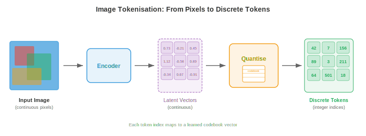
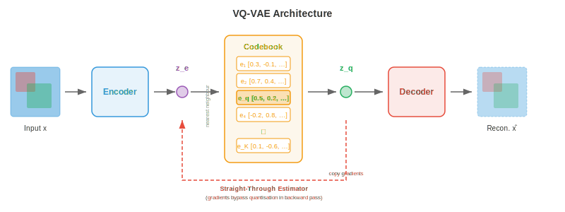
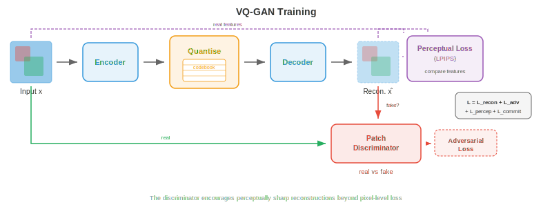
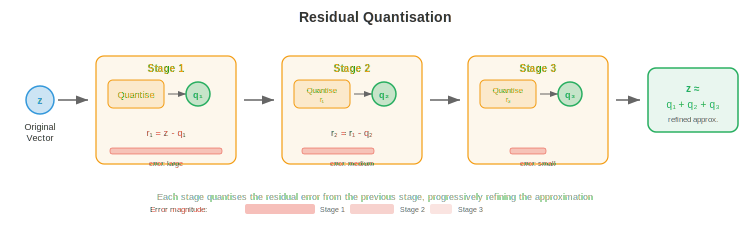
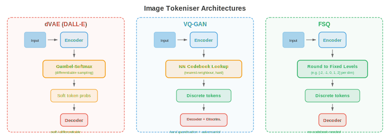
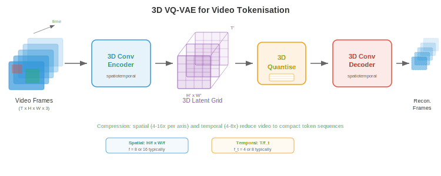
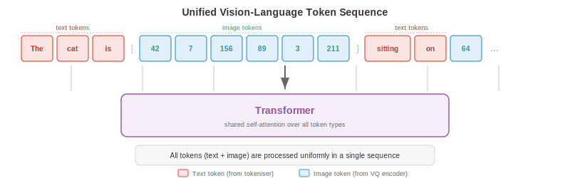

# Токенизация изображений и видео

*Токенизация изображений и видео преобразует непрерывные визуальные данные в дискретные последовательности токенов, которые трансформеры могут обрабатывать так же, как текст. В этом файле рассматриваются VQ-VAE, VQ-GAN, обучение кодовой книги (codebook), dVAE из модели DALL-E, токенизация видео и квантование без поиска (lookup-free quantisation).*

## Зачем токенизировать изображения

- Представьте язык как конечный алфавит: в английском языке примерно 26 букв, а современные языковые модели разбивают текст на 30 000–100 000 подсловных токенов. Каждое предложение становится последовательностью дискретных символов, которые трансформер может предсказывать один за другим. Изображения же, напротив, существуют в непрерывном многомерном пространстве: одно RGB-изображение размером 256x256 является точкой в $\mathbb{R}^{256 \times 256 \times 3} \approx \mathbb{R}^{196{,}608}$. Если вы хотите, чтобы языковая модель «говорила» на языке изображений с помощью того же механизма, который она использует для английского языка, вам нужно преобразовать эти непрерывные массивы пикселей в удобную последовательность дискретных токенов, взятых из конечного словаря. Такое преобразование и есть **токенизация изображений**.

- Представьте, что вы художник-мозаичист. У вас нет бесконечного количества оттенков плитки; у вас есть фиксированная палитра, скажем, из 8192 различных цветов плитки. Чтобы воспроизвести фотографию в виде мозаики, вы должны (1) решить, какой области фотографии соответствует каждая плитка, (2) подобрать ближайший цвет плитки для каждой области и (3) смириться с тем, что часть деталей будет потеряна, но общая картина останется узнаваемой. Токенизация изображений делает именно это: энкодер сжимает пространственные патчи в латентные векторы, кодовая книга сопоставляет каждый вектор с ближайшим элементом, и результатом становится сетка целочисленных индексов, по одному на каждый патч, которую может обработать дискретная модель.

- Преимущества токенизации состоят в трех аспектах. Во-первых, она значительно сжимает изображение: изображение 256x256 может превратиться в сетку токенов 16x16, сокращая длину последовательности с 65 536 пикселей до 256 токенов, что вполне приемлемо для моделей на основе внимания, стоимость которых растет квадратично от длины последовательности. Во-вторых, она унифицирует представление: текстовые и визуальные токены находятся в одном и том же дискретном словаре, что позволяет одному авторегрессионному трансформеру генерировать чередующиеся текст и изображения. В-третьих, она создает полезное «бутылочное горлышко», которое заставляет модель изучать семантически значимые коды, а не запоминать шум пикселей.



- Вспомните из главы 8, как сверточные нейронные сети извлекают иерархические карты признаков из изображений, а из главы 7 — как текстовые токенизаторы преобразуют строки в последовательности целых чисел. Токенизация изображений находится на их пересечении: она использует энкодер на основе CNN или vision transformer (глава 8) для создания пространственных признаков, а затем заимствует идею дискретного словаря (глава 7) для преобразования этих признаков в индексы токенов.

## VQ-VAE: векторное квантование

- Как мы видели в главе 6, стандартный **вариационный автоэнкодер** (VAE) кодирует входные данные в непрерывное латентное распределение и декодирует выборки из этого распределения обратно в реконструкции. Латентное пространство является непрерывным, что затрудняет его подачу в модели дискретных последовательностей. **Векторно-квантованный вариационный автоэнкодер** (VQ-VAE), представленный ван ден Оордом и соавторами (2017), заменяет непрерывное латентное пространство дискретным путем введения обучаемой кодовой книги векторов эмбеддингов и приведения каждого выхода энкодера к ближайшему элементу кодовой книги.

- Представьте библиотеку с ровно $K$ пронумерованными полками. Когда поступает новая книга (выход энкодера), библиотекарь ставит ее на ту полку, на которой уже лежат наиболее похожие на нее книги (векторы кодовой книги), и записывает номер полки. Позже, чтобы найти книгу, вам нужен только номер полки: элемент кодовой книги на этой полке будет достаточно хорошей заменой. Это и есть векторное квантование.

- Формально VQ-VAE состоит из трех компонентов:

- **Энкодер** $E$, который отображает входное изображение $\mathbf{x} \in \mathbb{R}^{H \times W \times 3}$ в пространственную сетку непрерывных латентных векторов $\mathbf{z}_e = E(\mathbf{x}) \in \mathbb{R}^{h \times w \times d}$, где $h \times w$ — пространственное разрешение после понижающей дискретизации, а $d$ — размерность эмбеддинга.

- **Кодовая книга** $\mathcal{C} = \{\mathbf{e}_1, \mathbf{e}_2, \ldots, \mathbf{e}_K\} \subset \mathbb{R}^d$, содержащая $K$ обучаемых векторов эмбеддингов. Типичные размеры кодовой книги варьируются от 512 до 16 384 элементов.

- **Декодер** $D$, который реконструирует изображение из квантованных латентных представлений.

- **Шаг квантования** заменяет каждый выход энкодера $\mathbf{z}_e(\mathbf{x})$ в пространственной позиции $(i, j)$ на ближайший к нему элемент кодовой книги:

$$\mathbf{z}_q(i,j) = \mathbf{e}_{k^\ast} \quad \text{where} \quad k^\ast = \arg\min_k \|\mathbf{z}_e(i,j) - \mathbf{e}_k\|_2$$

- Это поиск ближайшего соседа в пространстве эмбеддингов, точно такая же операция, как назначение кластеров в k-means (глава 6). Индекс $k^\ast$ является дискретным токеном для пространственной позиции $(i,j)$, а все изображение представляется как сетка целых чисел $h \times w$ из множества $\{1, \ldots, K\}$.



- Проблема заключается в том, что $\arg\min$ не является дифференцируемым: невозможно выполнить обратное распространение ошибки через дискретный выбор. VQ-VAE решает эту задачу с помощью **прямого оценочного метода** (straight-through estimator): во время прямого прохода декодер получает $\mathbf{z}_q$ (квантованный вектор); во время обратного прохода градиент функции потерь реконструкции по отношению к $\mathbf{z}_q$ копируется непосредственно в $\mathbf{z}_e$, как если бы шаг квантования был тождественной функцией. Это записывается компактно как:

$$\mathbf{z}_q = \mathbf{z}_e + \text{sg}(\mathbf{z}_q - \mathbf{z}_e)$$

- где $\text{sg}(\cdot)$ — оператор остановки градиента (stop-gradient). При прямом проходе это выражение равно $\mathbf{z}_q$; при обратном проходе градиент течет только через член $\mathbf{z}_e$.

- Полная функция потерь VQ-VAE состоит из трех слагаемых:

$$\mathcal{L} = \underbrace{\|\mathbf{x} - D(\mathbf{z}_q)\|_2^2}_{\text{reconstruction}} + \underbrace{\|\text{sg}(\mathbf{z}_e) - \mathbf{e}\|_2^2}_{\text{codebook (VQ)}} + \underbrace{\beta \|\mathbf{z}_e - \text{sg}(\mathbf{e})\|_2^2}_{\text{commitment}}$$

- **Функция потерь реконструкции** (reconstruction loss) обучает энкодер и декодер точно воспроизводить входные данные. **Функция потерь кодбука** (codebook loss, также называемая VQ loss) притягивает векторы кодбука к выходам энкодера; обратите внимание, что $\text{sg}(\mathbf{z}_e)$ означает, что энкодер не получает градиенты от этого слагаемого, поэтому обновляется только кодбук. **Функция потерь обязательства** (commitment loss) делает обратное: она поощряет выходы энкодера оставаться близкими к векторам кодбука, предотвращая «убегание» энкодера от кодбука. Гиперпараметр $\beta$ (обычно 0,25) контролирует баланс между слагаемыми кодбука и обязательства.

- На практике кодбук часто обновляется с помощью **экспоненциального скользящего среднего** (EMA), а не градиентного спуска, что является более стабильным подходом. Пусть $\mathbf{n}_k$ — количество выходов энкодера, назначенных элементу кодбука $k$, а $\mathbf{s}_k$ — их сумма. Обновление EMA выглядит так:

$$\mathbf{n}_k \leftarrow \gamma \mathbf{n}_k + (1 - \gamma) |\{(i,j) : k^\ast_{ij} = k\}|$$

$$\mathbf{s}_k \leftarrow \gamma \mathbf{s}_k + (1 - \gamma) \sum_{(i,j) : k^\ast_{ij} = k} \mathbf{z}_e(i,j)$$

$$\mathbf{e}_k \leftarrow \frac{\mathbf{s}_k}{\mathbf{n}_k}$$

- где $\gamma$ — коэффициент затухания (обычно 0,99). Это эквивалентно выполнению онлайн-алгоритма k-means на выходах энкодера.

### Коллапс кодбука

- Известным режимом отказа VQ-VAE является **коллапс кодбука** (codebook collapse, также называемый коллапсом индексов): модель учится использовать лишь малую часть из $K$ элементов кодбука, оставляя большинство элементов «мертвыми». Представьте библиотеку, где 90% полок пусты, потому что библиотекарь всегда направляет книги на одни и те же несколько популярных полок. Это растрачивает репрезентативную емкость.

- Коллапс кодбука происходит из-за того, что энкодер, кодбук и декодер совместно адаптируются в процессе обучения. Если элемент не выбирается в течение нескольких батчей, он отдаляется от многообразия энкодера, что делает его еще менее вероятным для выбора, создавая петлю положительной обратной связи.

- Несколько методов смягчают коллапс кодбука:
    - **Сброс кодбука** (codebook reset): периодическая переинициализация мертвых элементов путем копирования случайно выбранных выходов энкодера. Это дает мертвым элементам новый старт вблизи активной области латентного пространства.
    - **EMA-обновления со сглаживанием Лапласа**: добавление небольшой константы к $\mathbf{n}_k$, чтобы предотвратить нулевое количество для любого элемента, гарантируя, что все элементы получают градиентный сигнал.
    - **Настройка функции потерь обязательства**: увеличение $\beta$ заставляет выходы энкодера плотнее группироваться вокруг элементов кодбука, распределяя назначения более равномерно.
    - **Факторизованные коды**: разложение поиска по кодбуку в произведение меньших поисков (например, два кодбука размером $\sqrt{K}$ каждый), что улучшает использование за счет уменьшения эффективного размера кодбука для каждого поиска.
    - **Энтропийная регуляризация**: добавление штрафа, который поощряет равномерное распределение использования кодбука, максимизируя энтропию $H = -\sum_k p_k \log p_k$, где $p_k$ — эмпирическая вероятность назначения.


## VQ-GAN: состязательное обучение для более высокой точности

- VQ-VAE создает неплохие реконструкции, но $\ell_2$-потери на уровне пикселей имеют тенденцию генерировать размытые результаты, поскольку они штрафуют каждое отклонение пикселя одинаково, усредняя правдоподобные детали вместо выбора четких. Представьте, что вы просите кого-то нарисовать лицо, которое минимизирует среднюю разницу со всеми возможными лицами — он нарисует размытое усредненное лицо, а не четкое индивидуальное.

- **VQ-GAN** (Esser et al., 2021) решает эту проблему, объединяя фреймворк VQ-VAE с **дискриминатором** из генеративно-состязательных сетей (глава 6). Дискриминатор — это сверточная сеть на основе патчей, которая оценивает, является ли локальный патч изображения реальным (из обучающей выборки) или поддельным (от декодера). Эта состязательная функция потерь побуждает декодер создавать перцептивно четкие, реалистичные текстуры вместо попиксельных средних значений.

- Целевая функция VQ-GAN добавляет два слагаемых к функции потерь VQ-VAE:

$$\mathcal{L}_\text{VQ-GAN} = \mathcal{L}_\text{VQ-VAE} + \lambda_\text{adv} \mathcal{L}_\text{adv} + \lambda_\text{perc} \mathcal{L}_\text{perc}$$

- **Состязательная функция потерь** $\mathcal{L}_\text{adv}$ — это стандартная целевая функция GAN, применяемая к выходу декодера. Дискриминатор $\mathcal{D}$ пытается отличить реальные патчи от декодированных, а декодер (генератор) пытается его обмануть. Ненасыщающая формулировка выглядит так:

$$\mathcal{L}_\text{adv} = -\mathbb{E}[\log \mathcal{D}(D(\mathbf{z}_q))]$$

- **Перцептивная функция потерь** $\mathcal{L}_\text{perc}$ сравнивает активации признаков из предобученной сети (обычно VGG или LPIPS) между исходным и реконструированным изображениями:

$$\mathcal{L}_\text{perc} = \sum_l \|\phi_l(\mathbf{x}) - \phi_l(D(\mathbf{z}_q))\|_2^2$$

- где $\phi_l$ обозначает карту признаков на слое $l$ предобученной сети. Эта функция потерь фиксирует высокоуровневое структурное сходство, а не точность на уровне пикселей.

- Вес $\lambda_\text{adv}$ устанавливается адаптивно так, чтобы состязательный градиент и градиент реконструкции были сбалансированы, предотвращая доминирование состязательной функции потерь в начале обучения, когда реконструкции еще плохие.



- Результатом является токенизатор, который производит значительно более четкие реконструкции, чем VQ-VAE при том же размере кодбука. VQ-GAN является базовым токенизатором для многих крупных систем генерации изображений, включая оригинальный DALL-E, Parti и многочисленные модели «текст-в-изображение». Он превращает изображение 256x256 в сетку 16x16 или 32x32 дискретных токенов из кодбука размером 1024-16384, достигая коэффициентов сжатия от 16x до 64x в каждом пространственном измерении.

## Остаточное квантование и многомасштабные кодовые книги

- Единая кодовая книга накладывает жесткое ограничение на качество реконструкции: каждая пространственная позиция представляется ровно одним вектором кодовой книги, и любая деталь, которая мельче того, что может выразить кодовая книга, теряется. Представьте, что вы описываете цвет одним словом из фиксированной палитры: «бирюзовый» — это близко, но не совсем точно. Если бы вы могли добавить уточнение — «бирюзовый, но чуть более синий и немного ярче», — вы бы подобрались гораздо ближе.

- **Остаточное квантование** (residual quantisation, RQ) применяет эту идею итеративно. После того как первый этап квантования дает $\mathbf{z}_q^{(1)}$, вычисляется остаток $\mathbf{r}^{(1)} = \mathbf{z}_e - \mathbf{z}_q^{(1)}$, затем этот остаток квантуется по второй кодовой книге для получения $\mathbf{z}_q^{(2)}$, и так далее на протяжении $T$ уровней:

$$\mathbf{r}^{(0)} = \mathbf{z}_e$$

$$\mathbf{z}_q^{(t)} = \text{Quantise}(\mathbf{r}^{(t-1)}, \mathcal{C}^{(t)})$$

$$\mathbf{r}^{(t)} = \mathbf{r}^{(t-1)} - \mathbf{z}_q^{(t)}$$

- Итоговое квантованное представление равно $\hat{\mathbf{z}} = \sum_{t=1}^{T} \mathbf{z}_q^{(t)}$. При $T$ уровнях, каждый из которых использует кодовую книгу размера $K$, эффективный размер словаря составляет $K^T$, но вам нужно хранить только $T \times K$ векторов, а не $K^T$. Например, 8 уровней с $K = 1024$ дают эффективный размер $1024^8 \approx 10^{24}$ записей при хранении всего 8192 векторов.

- Каждый последующий уровень улавливает более мелкие детали: первая кодовая книга фиксирует грубую структуру, вторая — среднечастотные поправки и так далее. Это аналогично последовательному приближению в JPEG или прогрессивному рендерингу веб-изображений, где сначала появляется грубая версия, а затем постепенно добавляются детали.



- **Многомасштабные кодовые книги** расширяют эту идею, работая с разными пространственными разрешениями. Вместо многократного квантования одной и той же пространственной сетки вы квантуете на нескольких масштабах: грубая сетка фиксирует глобальную структуру, более мелкие сетки — локальные детали. Это связано с идеей пирамиды признаков из раздела о детекции объектов в главе 8, где признаки на разных масштабах фиксируют разный уровень детализации.

- **Продуктное квантование** — это родственный метод, при котором $d$-мерный латентный вектор разбивается на $M$ под-векторов размерности $d/M$, и каждый под-вектор квантуется независимо по своей собственной кодовой книге. Это дает эффективный словарь размера $K^M$ при хранении всего $M \times K$ векторов. Продуктное квантование широко используется в поиске приближенных ближайших соседей (глава 13) и было адаптировано для токенизации изображений.

- **Конечное скалярное квантование** (finite scalar quantisation, FSQ), представленное Mentzer et al. (2023), использует совершенно иной подход: вместо обучения кодовой книги оно просто округляет каждое измерение латентного вектора до одного из фиксированного набора целочисленных уровней (например, $\{-2, -1, 0, 1, 2\}$). При $L$ уровнях на измерение и $d$ измерениях размер неявной кодовой книги составляет $L^d$. FSQ полностью избегает коллапса кодовой книги, поскольку в нем нет обученных векторов кодовой книги, а есть только обученные выходы энкодера, которые округляются детерминированно. Прямой оценочный метод (straight-through estimator) справляется с недифференцируемостью операции округления.

## Токенизаторы изображений на практике

- Эволюция от VQ-VAE к VQ-GAN и остаточному квантованию породила семейство практических токенизаторов изображений, используемых в генеративных моделях передового уровня (state of the art).

### Токенизатор DALL-E (dVAE)

- Оригинальный **DALL-E** (Ramesh et al., 2021) использовал дискретный VAE (dVAE) для токенизации изображений 256x256 в сетки 32x32 из токенов кодовой книги размером 8192. dVAE заменил жесткое квантование через $\arg\min$ на релаксацию Gumbel-Softmax, что сделало прямой проход дифференцируемым во время обучения. На этапе инференса используется $\arg\max$ для получения жестких назначений токенов. dVAE обучался с комбинацией функции потерь реконструкции, дивергенции Кульбака-Лейблера относительно равномерного априорного распределения и обученного графика температуры для Gumbel-Softmax. Затем для DALL-E был обучен авторегрессионный трансформер с 12 миллиардами параметров для моделирования совместного распределения 256 текстовых токенов и 1024 токенов изображения (32x32).

### LlamaGen

- **LlamaGen** (Sun et al., 2024) показал, что можно перепрофилировать стандартную архитектуру языковой модели в стиле Llama (глава 7) для авторегрессионной генерации изображений, если у вас есть хороший токенизатор изображений. LlamaGen использует улучшенный токенизатор VQ-GAN с большой кодовой книгой (16 384 записи) и обучает обычный авторегрессионный трансформер (без специальных модификаций для изображений, помимо токенизатора) предсказывать токены изображения слева направо в порядке растрового сканирования. Ключевое понимание заключается в том, что как только изображения токенизированы в дискретные последовательности, та же парадигма предсказания следующего токена, которая работает для языка, работает и для изображений, подтверждая идею о том, что токенизация действительно преодолевает разрыв между модальностями.

### Токенизатор Cosmos

- **Токенизатор Cosmos** (NVIDIA, 2024) разработан как для изображений, так и для видео в рамках единой структуры. Он использует причинную 3D-архитектуру, которая рассматривает изображения как однокадровые видео, позволяя одному и тому же токенизатору обрабатывать обе модальности. Cosmos поддерживает как непрерывный, так и дискретный режимы токенизации: непрерывный режим выдает латентные векторы с вещественными значениями (для бэкендов диффузионных моделей), в то время как дискретный режим применяет конечное скалярное квантование для получения целочисленных токенов (для бэкендов авторегрессионных моделей). Энкодер использует причинные 3D-свёртки, так что токены каждого кадра зависят только от текущего и предыдущих кадров, что обеспечивает потоковую токенизацию видео.



## Токенизация видео

- Видео добавляет третью ось — время — к пространственным измерениям изображений. Видео представляет собой последовательность кадров, обычно с частотой 24–30 кадров в секунду, и соседние кадры обладают высокой избыточностью, поскольку визуальный мир не меняется радикально за 33 миллисекунды. Токенизация видео использует эту временную избыточность для достижения гораздо более высокого сжатия, чем при независимой токенизации каждого кадра.

- Представьте сжатие видео как перелистывание блокнота с рисунками (flip-book). Если бы вы рисовали каждую страницу с нуля, вам потребовались бы тысячи детализированных изображений. Однако большинство страниц почти идентичны соседним, поэтому можно рисовать полноценный «ключевой кадр» каждые 10 страниц, а для промежуточных страниц отмечать лишь небольшие изменения. Видео-токенизаторы обучаются этому трюку автоматически.

### 3D VQ-VAE

- Самым прямым расширением VQ-VAE для видео является **3D VQ-VAE**, который заменяет 2D-свёртки в энкодере и декодере на 3D-свёртки, работающие одновременно по пространственным и временным измерениям. Если энкодер выполняет понижающую дискретизацию с коэффициентом $f_s$ по пространству и $f_t$ по времени, видеоклип размером $T \times H \times W$ превращается в сетку токенов $(T/f_t) \times (H/f_s) \times (W/f_s)$.

- Например, при $f_s = 16$ и $f_t = 4$ видеоклип из 16 кадров размером 256x256 превращается в последовательность из $4 \times 16 \times 16 = 1024$ токенов. Это достаточно компактно для авторегрессионного моделирования трансформером, тогда как количество «сырых» пикселей составило бы $16 \times 256 \times 256 \times 3 \approx 3.1$ миллиона значений.

- 3D-свёртки совместно обучаются извлекать пространственные и временные признаки. Ранние слои улавливают локальное движение (границы, перемещающиеся между кадрами), в то время как более глубокие слои улавливают динамику более высокого уровня (появление, исчезновение или изменение формы объектов). Это тот же принцип иерархического извлечения признаков из свёрточных нейронных сетей (глава 8), расширенный вдоль оси времени.



### Каузальные видео-токенизаторы

- Стандартная 3D-свёртка «смотрит» на прошлые, текущие и будущие кадры, а это значит, что вам нужен весь видеоклип целиком, прежде чем вы сможете токенизировать любую его часть. **Каузальные видео-токенизаторы** ограничивают временные свёртки так, чтобы каждый выход зависел только от текущего и предыдущих кадров, но никогда — от будущих. Это аналогично каузальному маскированию в авторегрессионных трансформерах (глава 7): информация течет вперед во времени, но никогда назад.

- Каузальная токенизация необходима для двух сценариев использования. Во-первых, **стриминг**: вы можете токенизировать видео в реальном времени по мере поступления кадров, без буферизации будущих кадров. Во-вторых, **авторегрессионная генерация**: когда трансформер генерирует видео кадр за кадром, токены для кадра $t$ должны вычисляться без знания кадра $t+1$, поскольку кадр $t+1$ еще не был сгенерирован.

- Каузальное ограничение реализуется путем асимметричного паддинга временных свёрток: ядро временного размера $k$ дополняется $k-1$ нулями с «прошлой» стороны и нулем нулей с «будущей» стороны, что гарантирует зависимость выхода в момент времени $t$ только от входов в моменты $t-k+1, \ldots, t$.

- Одно из изящных свойств каузальных видео-токенизаторов заключается в том, что они могут токенизировать отдельное изображение («видео» из одного кадра) без какой-либо специальной обработки. У первого кадра нет контекста прошлого, поэтому его токены вычисляются только на основе самого кадра. Эта **унификация изображения и видео** означает, что один токенизатор обслуживает обе модальности, упрощая архитектуру и позволяя создавать модели, генерирующие изображения и видео с помощью одного и того же декодера.

### Стратегии временного сжатия

- Разные приложения требуют разных коэффициентов временного сжатия. Для распознавания действий (где важны тонкие движения) мягкое сжатие ($f_t = 2$) сохраняет временную детализацию. Для генерации длинных видео (где хранение тысяч кадров является непосильной задачей) необходимо агрессивное сжатие ($f_t = 8$ или выше).

- Некоторые токенизаторы используют **факторизованное сжатие**: пространственное и временное сжатие выполняются на отдельных этапах. Сначала 2D-энкодер сжимает каждый кадр независимо, создавая покадровую латентную сетку. Затем 1D-временной энкодер сжимает данные по временному измерению. Такая факторизация вычислительно дешевле, чем полная 3D-свёртка, и позволяет использовать разные коэффициенты сжатия для пространства и времени. Компромисс заключается в том, что она не может улавливать пространственно-временные паттерны (например, мяч, движущийся по диагонали) так же эффективно, как совместное 3D-кодирование.

- **Токены временной интерполяции** — это недавняя инновация, при которой токенизатор полностью кодирует только ключевые кадры, а промежуточные кадры представляет в виде облегченных кодов интерполяции, описывающих способ морфинга между ключевыми кадрами. Это повторяет классическое сжатие видео (I-кадры и P-кадры в H.264/HEVC), но в обученном латентном пространстве.


## Непрерывные и дискретные токены

- Не каждой последующей модели нужны дискретные токены. **Диффузионные модели** (глава 10, файл 04) работают с непрерывными значениями «из коробки» — они итеративно удаляют шум из гауссовской выборки, а их функции потерь (denoising score matching) определены в непрерывных пространствах. Для диффузионных бэкендов энкодер токенизатора создает непрерывные латентные векторы, которые никогда не квантуются. **Латентные диффузионные модели** (Stable Diffusion, DALL-E 3, Flux) используют энкодер-декодер типа VQ-GAN, но полностью пропускают кодовую книгу, работая в непрерывном латентном пространстве.

- **Авторегрессионные модели** (в стиле GPT), напротив, предсказывают следующий токен из конечного словаря, используя softmax по $K$ классам. Им фундаментально требуются дискретные токены. Каждая система генерации изображений, использующая авторегрессионный трансформер (DALL-E, Parti, LlamaGen, Chameleon), зависит от дискретного токенизатора.

- Таким образом, выбор между непрерывными и дискретными токенами определяется бэкендом генерации:

- Используйте **дискретные токены**, если: модель является авторегрессионной (предсказание следующего токена с функцией потерь кросс-энтропии), вы хотите использовать общий словарь с текстовыми токенами для унифицированных мультимодальных моделей или вам нужен точный контроль на уровне токенов (например, для поиска или редактирования путем замены токенов).

- Используйте **непрерывные токены**, если: модель является диффузионной или моделью потокового сопоставления (flow-matching), задача требует реконструкции с очень высокой точностью (непрерывные латентные представления полностью исключают ошибку квантования) или вы хотите использовать регрессионные функции потерь, работающие с векторами вещественных чисел.

- Некоторые современные архитектуры поддерживают оба режима. Токенизатор Cosmos, например, может выдавать либо непрерывные латентные представления (для своего режима диффузии), либо FSQ-дискретизированные токены (для своего авторегрессионного режима) из одного и того же энкодера с помощью легковесной квантующей «головы», которую можно включать или выключать.

- **Мягкое квантование (soft quantisation)** — это промежуточное решение: вместо жесткого присваивания через $\arg\min$ вычисляется взвешенное среднее $k$ ближайших элементов кодовой книги, где веса задаются через softmax от отрицательных расстояний. Это сохраняет больше информации, чем жесткое квантование, оставаясь при этом приближенно дискретным. Некоторые системы используют мягкое квантование во время обучения и жесткое квантование при инференсе.


## Приложения

### Авторегрессионная генерация изображений

- Как только изображения представлены в виде дискретных последовательностей токенов, можно обучить стандартный авторегрессионный трансформер для их моделирования. Токены изображения выстраиваются в одномерную последовательность (обычно в порядке растрового сканирования: слева направо, сверху вниз), и трансформер обучается предсказывать $p(\text{token}_i | \text{token}_1, \ldots, \text{token}_{i-1})$ с использованием стандартной функции потерь кросс-энтропии. Во время генерации токены выбираются по одному, а полученная сетка пропускается через декодер токенизатора для получения пикселей.

- Условная генерация по тексту выполняется просто: нужно добавить текстовые токены перед последовательностью токенов изображения, чтобы модель обучалась предсказывать $p(\text{image tokens} | \text{text tokens})$. Именно так DALL-E, Parti и LlamaGen выполняют генерацию изображений по тексту. Текстовые и визуальные токены используют один и тот же трансформер, один и тот же механизм внимания и часто одну и ту же таблицу эмбеддингов (где текстовые и визуальные токены занимают разные диапазоны индексов).

- Порядок растрового сканирования вносит искусственную асимметрию: верхний левый угол изображения генерируется первым, без какого-либо контекста о нижнем правом. Ряд работ решает эту проблему. **Маскированное моделирование изображений** (MaskGIT) обучает двунаправленный трансформер, который генерирует все токены одновременно, но с разной степенью уверенности, итеративно убирая маски с наиболее уверенно предсказанных токенов. **Многомасштабная генерация** сначала генерирует грубые токены (улавливающие глобальную композицию), а затем уточняет их с помощью остаточных токенов. Эти подходы жертвуют простотой чисто лево-правой генерации ради лучшей глобальной согласованности.

### Унифицированные визуально-языковые токены

- Глубинная мотивация токенизации изображений заключается в **унификации**: приведении зрения и языка к единому формату представления, чтобы одна архитектура модели могла обрабатывать и то, и другое. Как мы обсуждали в главе 7, языковые модели являются чрезвычайно мощными машинами для преобразования последовательностей. Представляя изображения в виде последовательностей токенов, мы бесплатно получаем всю инфраструктуру языкового моделирования — рецепты предобучения, законы масштабирования, RLHF, расширение длины контекста.

- **Chameleon** (Meta, 2024) — яркий пример: он использует VQ-GAN токенизатор с 8192 элементами кодовой книги для преобразования изображений в токены, которые перемежаются с текстовыми токенами в едином словаре из ~65 000 элементов (текст + изображение). Стандартный трансформер обучается на смешанных текстово-визуальных последовательностях, что позволяет ему генерировать текст по изображениям, изображения по тексту или перемешанный текстово-визуальный контент, используя один и тот же прямой проход.

- **Gemini** (Google, 2024) использует аналогичный подход в огромном масштабе, нативно понимая и генерируя изображения, аудио и текст в рамках одного трансформера, где модально-специфичные токенизаторы подают данные в общую последовательность.

- Ключевая инженерная задача в унифицированных моделях — **баланс словаря**: если 8192 из 65 000 элементов словаря являются токенами изображений, модель может выделять недостаточно ресурсов для зрения. Решения включают раздельные слои эмбеддингов для каждой модальности (общие только на уровне внимания), взвешивание функции потерь в зависимости от модальности и тщательный подбор соотношений данных во время предобучения.



## Задачи по программированию (используйте CoLab или ноутбук)

1. Реализуйте минимальный VQ-слой на JAX: получив батч векторов на выходе энкодера, выполните поиск ближайшего соседа в кодовой книге и вычислите функцию потерь VQ-VAE (реконструкция + кодовая книга + обязательство). Визуализируйте использование кодовой книги в виде гистограммы.
```python
import jax
import jax.numpy as jnp
import matplotlib.pyplot as plt

# --- Minimal VQ layer ---
key = jax.random.PRNGKey(42)
d = 8          # embedding dimension
K = 64         # codebook size
n_vectors = 256  # batch of encoder outputs

# Random encoder outputs and codebook
k1, k2 = jax.random.split(key)
z_e = jax.random.normal(k1, (n_vectors, d))       # encoder outputs
codebook = jax.random.normal(k2, (K, d)) * 0.1     # codebook (small init)

# Nearest-neighbour lookup: find closest codebook entry for each z_e
# distances[i, k] = ||z_e[i] - codebook[k]||^2
distances = (
    jnp.sum(z_e ** 2, axis=1, keepdims=True)
    - 2 * z_e @ codebook.T
    + jnp.sum(codebook ** 2, axis=1, keepdims=True).T
)
indices = jnp.argmin(distances, axis=1)       # token indices
z_q = codebook[indices]                        # quantised vectors

# VQ-VAE loss terms
beta = 0.25
loss_codebook = jnp.mean((jax.lax.stop_gradient(z_e) - z_q) ** 2)
loss_commit   = jnp.mean((z_e - jax.lax.stop_gradient(z_q)) ** 2)
loss_total    = loss_codebook + beta * loss_commit
print(f"Codebook loss: {loss_codebook:.4f}, Commitment loss: {loss_commit:.4f}")

# Codebook utilisation
unique, counts = jnp.unique(indices, return_counts=True, size=K, fill_value=-1)
plt.figure(figsize=(10, 4))
plt.bar(range(K), counts, color='#3498db', alpha=0.8)
plt.xlabel('Codebook Index'); plt.ylabel('Assignment Count')
plt.title(f'Codebook Utilisation ({jnp.sum(counts > 0)}/{K} entries used)')
plt.grid(True, alpha=0.3); plt.tight_layout(); plt.show()
# Try: increase K to 512 and observe collapse. Then add codebook reset logic.
```

2. Создайте игрушечный 2D-квантователь векторов, который учится разбивать 2D-распределение на области. Сгенерируйте случайные 2D-точки, обучите кодовую книгу с помощью EMA-обновлений и визуализируйте области Вороного.

```python
import jax
import jax.numpy as jnp
import matplotlib.pyplot as plt

# Generate 2D data from a mixture of Gaussians
key = jax.random.PRNGKey(0)
n_points = 2000
K = 16  # codebook entries
gamma = 0.99  # EMA decay

# Four clusters
keys = jax.random.split(key, 5)
centres = jnp.array([[2, 2], [-2, 2], [-2, -2], [2, -2]], dtype=jnp.float32)
data = jnp.concatenate([
    jax.random.normal(keys[i], (n_points // 4, 2)) * 0.5 + centres[i]
    for i in range(4)
])

# Initialise codebook from random data points
idx = jax.random.choice(keys[4], n_points, (K,), replace=False)
codebook = data[idx]
ema_count = jnp.ones(K)
ema_sum = codebook.copy()

# Run EMA-based codebook learning for several epochs
for epoch in range(30):
    # Assign each point to nearest codebook entry
    dists = jnp.sum((data[:, None, :] - codebook[None, :, :]) ** 2, axis=2)
    assignments = jnp.argmin(dists, axis=1)
    # EMA update
    for k in range(K):
        mask = (assignments == k)
        count_k = jnp.sum(mask)
        ema_count = ema_count.at[k].set(gamma * ema_count[k] + (1 - gamma) * count_k)
        if count_k > 0:
            sum_k = jnp.sum(data[mask], axis=0)
            ema_sum = ema_sum.at[k].set(gamma * ema_sum[k] + (1 - gamma) * sum_k)
    codebook = ema_sum / ema_count[:, None]

# Visualise assignments and codebook
fig, ax = plt.subplots(1, 1, figsize=(8, 8))
colors = plt.cm.tab20(jnp.linspace(0, 1, K))
for k in range(K):
    mask = assignments == k
    ax.scatter(data[mask, 0], data[mask, 1], c=[colors[k]], s=5, alpha=0.3)
ax.scatter(codebook[:, 0], codebook[:, 1], c='black', s=120, marker='X',
           edgecolors='white', linewidths=1.5, zorder=10, label='Codebook')
ax.set_title(f'Learned VQ Codebook ({K} entries) on 2D Data')
ax.legend(); ax.set_aspect('equal'); ax.grid(True, alpha=0.3)
plt.tight_layout(); plt.show()
# Try: increase K to 64 and observe finer tiling. Reduce gamma and see instability.
```

3. Продемонстрируйте остаточное квантование (residual quantisation): закодируйте батч векторов с помощью $T$ последовательных этапов квантования и измерьте, как ошибка реконструкции уменьшается на каждом уровне.

```python
import jax
import jax.numpy as jnp
import matplotlib.pyplot as plt

key = jax.random.PRNGKey(7)
d = 16         # embedding dimension
K = 32         # codebook size per level
T = 8          # number of residual levels
n_vectors = 512

# Random data to quantise
k1, *cb_keys = jax.random.split(key, T + 1)
z = jax.random.normal(k1, (n_vectors, d))

# Independent random codebooks for each level
codebooks = [jax.random.normal(cb_keys[t], (K, d)) * (0.5 ** t)
             for t in range(T)]

# Residual quantisation loop
residual = z.copy()
z_hat = jnp.zeros_like(z)
errors = []

for t in range(T):
    cb = codebooks[t]
    dists = (jnp.sum(residual ** 2, axis=1, keepdims=True)
             - 2 * residual @ cb.T
             + jnp.sum(cb ** 2, axis=1, keepdims=True).T)
    indices = jnp.argmin(dists, axis=1)
    z_q_t = cb[indices]
    z_hat = z_hat + z_q_t
    residual = residual - z_q_t
    mse = jnp.mean(jnp.sum((z - z_hat) ** 2, axis=1))
    errors.append(float(mse))
    print(f"Level {t+1}: MSE = {mse:.4f}")

plt.figure(figsize=(8, 5))
plt.plot(range(1, T + 1), errors, 'o-', color='#e74c3c', linewidth=2, markersize=8)
plt.xlabel('Residual Quantisation Level')
plt.ylabel('Reconstruction MSE')
plt.title('Error Reduction with Residual Quantisation')
plt.xticks(range(1, T + 1)); plt.grid(True, alpha=0.3)
plt.tight_layout(); plt.show()
# Try: use a single codebook of size K*T and compare with RQ. Which wins?
```

4. Смоделируйте простой 1D «видео-токенизатор»: сгенерируйте последовательность 1D-сигналов (имитирующих видеокадры), примените причинное временное сжатие и сравните его с непричинным сжатием с точки зрения качества реконструкции.

```python
import jax
import jax.numpy as jnp
import matplotlib.pyplot as plt

key = jax.random.PRNGKey(99)
n_frames = 16
frame_len = 64

# Generate a "video": a slowly moving Gaussian bump across frames
x_axis = jnp.linspace(-3, 3, frame_len)
frames = jnp.stack([
    jnp.exp(-0.5 * (x_axis - (-2 + 4 * t / n_frames)) ** 2)
    for t in range(n_frames)
])  # shape: (n_frames, frame_len)

# Causal temporal compression: each frame's code depends only on past frames
# Simple approach: average current frame with exponential decay of past
alpha_causal = 0.6
causal_codes = jnp.zeros_like(frames)
causal_codes = causal_codes.at[0].set(frames[0])
for t in range(1, n_frames):
    causal_codes = causal_codes.at[t].set(
        alpha_causal * frames[t] + (1 - alpha_causal) * causal_codes[t - 1]
    )

# Non-causal: average with both past and future (bilateral smoothing)
kernel = jnp.array([0.2, 0.6, 0.2])  # past, current, future
padded = jnp.concatenate([frames[:1], frames, frames[-1:]], axis=0)
noncausal_codes = jnp.stack([
    kernel[0] * padded[t] + kernel[1] * padded[t+1] + kernel[2] * padded[t+2]
    for t in range(n_frames)
])

# Reconstruction error
mse_causal = jnp.mean((frames - causal_codes) ** 2)
mse_noncausal = jnp.mean((frames - noncausal_codes) ** 2)
print(f"Causal MSE: {mse_causal:.6f}, Non-causal MSE: {mse_noncausal:.6f}")

fig, axes = plt.subplots(1, 3, figsize=(15, 5))
for ax, data, title in zip(axes,
    [frames, causal_codes, noncausal_codes],
    ['Original Frames', f'Causal (MSE={mse_causal:.5f})',
     f'Non-causal (MSE={mse_noncausal:.5f})']):
    ax.imshow(data, aspect='auto', cmap='viridis', origin='lower')
    ax.set_xlabel('Spatial Position'); ax.set_ylabel('Frame Index')
    ax.set_title(title)
plt.tight_layout(); plt.show()
# Try: vary alpha_causal and the kernel weights. What happens with alpha=1.0?
```
