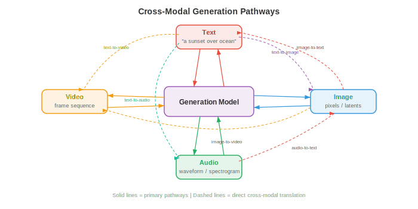
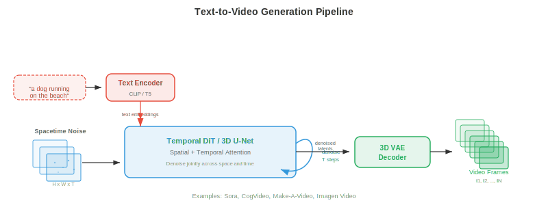
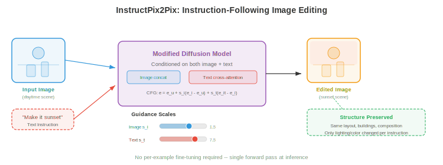
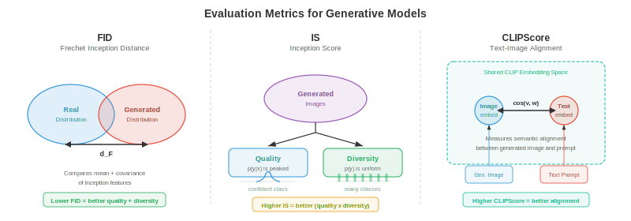

# 跨模态生成

*跨模态生成在一种模态输入下产出另一模态输出；text to image、image to text、text to audio 及更多。本文件涵盖 DALL-E、Stable Diffusion、classifier-free guidance、ControlNet、image captioning、text-to-video（Sora）与 text-to-audio 生成。*

- 在本章第 01-03 篇文件中，你学了如何表示、对齐与 tokenize 不同模态。现在进入创造性动作：从一种模态生成另一种。跨模态生成是 text-to-image 工具、视频合成系统、音乐作曲模型与 image captioning 的引擎。把它想成教机器做多媒体艺术家——你用文字描述想要的，它就画、动或谱曲。

- 核心思想是 **conditional generation**（条件生成）：给定模态 $A$（如文本）的输入，产出模态 $B$（如图像）的输出。形式上学习模型 $p_\theta(y \mid x)$，其中 $x$ 是条件信号，$y$ 是生成输出。挑战在于该条件分布极为复杂高维——一张 512x512 图像在 $\mathbb{R}^{786432}$ 中，单个文本 prompt 对应许多有效图像。



## Text-to-Image 生成

- 想象你向法庭速写师描述场景。速写师须解读你的话、回忆物体长相、空间组合、并渲染最终画。text-to-image 模型正是如此，但这些技能须从数据而非多年艺校学习。

### DALL-E：自回归图像生成

- **DALL-E**（Ramesh 等，2021）把图像生成视为序列预测问题——与驱动语言模型的范式相同（第 07 章）。关键洞见是：若能把图像表示为离散 token（回忆第 03 篇文件的 VQ-VAE），则生成图像就是逐个生成 token 序列。

- 流水线分两阶段。其一，**discrete VAE (dVAE)** 把 256x256 图像压缩为来自 8192 项 codebook 的 32x32 离散 token 网格，把图像降为 1024 token 序列。其二，训练 **transformer decoder** 建模 256 个文本 token（BPE 编码）与 1024 个图像 token（共 1280 token）的联合分布：

$$p(x_{\text{text}}, x_{\text{img}}) = \prod_{i=1}^{1280} p(x_i \mid x_1, \ldots, x_{i-1})$$

- 生成时，输入文本 token，模型自回归逐个采样图像 token。这很优雅，因为它复用语言建模的完全机制——attention、causal masking、top-k 采样——用于图像合成。

- 缺点是自回归生成本质顺序：逐个生成 1024 token 慢，且序列早期任何错误会累积。DALL-E 通过生成许多候选图像并用 CLIP（第 01 篇文件）重排序找与文本 prompt 最佳匹配来缓解。


### Stable Diffusion：带文本条件的 latent diffusion

- **Stable Diffusion**（Rombach 等，2022）采取根本不同方法。它不逐个预测 token，而从纯噪声开始逐步去噪为图像，由文本 prompt 引导。回忆第 8 章的 diffusion model——Stable Diffusion 在压缩 latent 空间而非像素空间操作，效率大幅提升。

- 架构三组件协同。**VAE encoder** 把图像从像素空间（$512 \times 512 \times 3$）压缩到 latent 表示（$64 \times 64 \times 4$），维度降 48 倍。**text encoder**（通常 CLIP 或 OpenCLIP）把文本 prompt 转为 embedding 向量序列。**U-Net denoiser** 接收含噪 latent、timestep 与文本 embedding，预测每步要减去的噪声。文本条件经 **cross-attention** 层进入 U-Net：

$$\text{Attention}(Q, K, V) = \text{softmax}\left(\frac{QK^T}{\sqrt{d}}\right)V$$

- 其中 $Q$ 来自含噪图像特征，$K, V$ 来自文本 embedding。这使模型在每个空间位置关注相关词——当去噪应出现 "red ball" 的区域时，模型关注 token "red" 与 "ball"。

- 推理时，在 latent 空间采样 $z_T \sim \mathcal{N}(0, I)$，用 U-Net 迭代去噪 $T$ 步（通常 20-50，DDIM 调度），再用 VAE decoder 把干净 latent $z_0$ 解码回像素空间。整次前向在消费级 GPU 上数秒生成 512x512 图像。


### Classifier-Free Guidance 实践

- **Classifier-free guidance (CFG)** 是使 text-to-image 模型产出实际匹配 prompt 图像的秘诀。回忆第 8 章，CFG 同时训练条件与无条件模型，再在采样时放大条件信号：

$$\hat{\epsilon} = \epsilon_\theta(x_t, \varnothing) + s \cdot (\epsilon_\theta(x_t, c) - \epsilon_\theta(x_t, \varnothing))$$

- 其中 $s$ 是 guidance scale。把 $(\epsilon_\theta(x_t, c) - \epsilon_\theta(x_t, \varnothing))$ 想成"指向 prompt 的方向"——它捕捉条件预测不同于无条件预测之处。乘以 $s > 1$ 放大此方向，把图像推近文本描述，代价是多样性。

- 实践中，Stable Diffusion 常用 $s = 7.5$。$s = 1.0$ 得原始模型输出（多样但与 prompt 松散匹配）。$s = 20+$ 图像过饱和且重复但与文本高度对齐。最优 $s$ 取决于应用：创意探索偏好低 guidance，精确 prompt 遵从需高 guidance。

### Imagen：带语言理解的级联 diffusion

- **Imagen**（Saharia 等，2022）证明强大的文本 encoder 比更大图像模型更重要。Imagen 不用 CLIP，而用冻结的 **T5-XXL** 语言模型（第 07 章）作文本 encoder，对语言语义、组合性与空间关系有更丰富理解（"a blue cube on top of a red sphere"）。

- Imagen 用 **cascaded diffusion**（级联 diffusion）方法：base diffusion 模型生成 64x64 图像，第一个 super-resolution 模型放大到 256x256，第二个到 1024x1024。每阶段是独立的条件于文本与（对放大器）低分辨率图像的 diffusion 模型。该级联避免在 base 分辨率建模细细节，使 base 专注构图与语义，放大器处理纹理与锐度。

- Imagen 还引入 **dynamic thresholding**（动态阈值）：每个去噪步，预测像素值被裁剪到基于百分位的范围而非固定 $[-1, 1]$。这防止高 guidance scale 下的饱和伪影——diffusion 模型的常见问题。

### Parti：规模化的自回归

- **Parti**（Pathways Autoregressive Text-to-Image，Yu 等，2022）以大规模复活自回归方法。如 DALL-E，它把图像转为离散 token（用 ViT-VQGAN）并用 transformer 顺序生成。但 Parti 用 200 亿参数的 encoder-decoder transformer（基于 Pathways 架构），显示自回归模型在充分扩展时可匹配 diffusion 质量。

- Parti 的 encoder-decoder 架构与 DALL-E 的 decoder-only 设计是关键差异。文本经 encoder；decoder 在生成图像 token 时 cross-attend 编码文本。这镜像机器翻译（第 07 章）——从"文本语言"翻译到"图像语言"。

### DiT 与基于流的生成

- **Diffusion Transformer (DiT)**（Peebles 与 Xie，2023）用纯 transformer 取代 diffusion 模型中的 U-Net 骨干。每个含噪 latent patch 当作 token（类似第 8 章 ViT），transformer 用 self-attention 与对文本条件的 cross-attention 处理这些 token。DiT 表明 transformer 比 U-Net 在 diffusion 上扩展更可预测——计算翻倍可靠地使 FID 减半。

- **Flow matching**（回忆第 8 章）已成为 diffusion 噪声预测范式的替代。模型不预测要减去的噪声 $\epsilon$，而预测把样本沿直线路径从噪声传送到数据的速度 $v_\theta(x_t, t)$。**Stable Diffusion 3** 与 **Flux** 采用 flow matching 配 **multimodal DiT (MM-DiT)** 架构，文本与图像 token 由带双向 attention 的 transformer 块联合处理——两模态互相 attend，而非文本仅通过 cross-attention 条件化图像特征。


## Text-to-Video 生成

- Text-to-video 是带无情额外约束的 text-to-image：**temporal coherence**（时间连贯）。每帧须内部一致（有效图像），但相邻帧也须平滑连接——对象应自然移动、光照应连续变化、"镜头"应遵循物理可行轨迹。想象画单一风景与导演电影的差别。

### 时间挑战

- 视频引入图像生成之外的三个挑战。**时间一致性** 要求对象跨帧保持身份——帧 1 的狗在帧 100 仍是同一只狗。**运动建模** 要求学习物理动态：对象如何动、重力如何作用、流体如何流。**计算成本** 严峻：10 秒 24 fps 512x512 视频含 $10 \times 24 \times 512 \times 512 \times 3 \approx 188$ 百万值，约为单张图像 240 倍数据。

### Make-A-Video 与扩展到视频的方法

- **Make-A-Video**（Singer 等，2022）采取务实方法：从预训练 text-to-image 模型出发，加时间层。关键洞见是已有在数十亿图文对上训练的强文本-图像模型，只需从（无标注）视频数据学运动。

- Make-A-Video 在预训练空间 U-Net 中插入 **temporal attention** 与 **temporal convolution** 层。空间层（在图像上预训练）处理外观，新时间层（在视频上训练）处理运动。空间 self-attention 在每帧内操作；时间 attention 在每空间位置跨帧操作。该分解高效，因为时间与空间模式大致可分。

- 生成流水线镜像 Imagen 的级联：base 模型生成 64x64 的 16 帧，再由空间与时间 super-resolution 模型放大到最终分辨率与帧率。帧插值网络提升时间平滑。

### VideoPoet 与基于 token 的视频模型

- **VideoPoet**（Kondratyuk 等，2024）在语言建模范式下统一视频生成。所有模态——文本、图像、视频、音频——被 tokenize 为离散序列，单一大语言模型（LLM）在所有模态上自回归预测 token。这使 zero-shot 能力成为可能：text-to-video、image-to-video、video-to-audio、视频编辑与 inpainting 都从同一模型涌现。

- VideoPoet 用 MAGVIT-v2 encoder（3D VQ-VAE，第 03 篇文件）联合压缩空间与时间维 tokenize 视频。音频用 SoundStream tokenize。LLM 骨干在文本上预训练、在多模态 token 序列上 fine-tune，学习跨模态联合分布。

### Sora 式时间 diffusion

- **Sora**（OpenAI，2024）以其生成长、连贯、物理可信视频的能力把时间 diffusion 带入主流视野。虽完整架构细节未公开，但关键思想涉及把 DiT 扩展到时空：视频帧被分解为 **spacetime patch**（跨高、宽、时间的 3D 块），作为大 transformer 的 token。

- spacetime patch 方法意味着模型把视频当作原生 3D 信号而非 2D 帧序列处理。这使其能捕捉长程时间依赖——模型能跨整个视频时长"前瞻"，而非逐帧生成。

- Sora 可通过调整 spacetime patch 数处理可变时长、分辨率与宽高比。在原生分辨率（而非全部裁成方块）训练提升构图与取景质量。

### Wan：开源视频生成

- **Wan**（Wan 等，2025）是基于 DiT 骨干配 3D VAE 时间压缩的开源视频生成模型家族（1.3B 与 14B 参数）。Wan 用 **flow matching** 而非传统 DDPM 式 diffusion，学习从噪声到视频 latent 的直线路径。3D VAE 在空间与时间上压缩视频（4x 时间压缩），DiT 用完整 3D attention 处理所得时空 latent token。

- Wan 支持 text-to-video、image-to-video（动画化静态图像）与视频编辑。14B 模型在 720p 分辨率生成最长 5 秒的连贯视频，显示在架构与训练配方精心选择时开源模型可接近专有系统质量。



## Text-to-Audio 生成

- 想象电影作曲家读剧本并配乐。text-to-audio 模型做类似事：给定文本描述（"a thunderstorm with heavy rain and distant thunder"），生成对应音频 waveform。挑战是桥接文本的离散符号性与声音的连续时序性。

### AudioLM：用于音频的语言建模

- **AudioLM**（Borsos 等，2023）通过自回归预测离散音频 token 生成音频，沿用 DALL-E 用于图像的同一语言建模范式。它用层次 token 结构：**semantic token**（来自 w2v-BERT 等自监督模型，回忆第 9 章）捕捉高层内容（说什么或奏什么），**acoustic token**（来自 SoundStream，神经音频 codec）捕捉细粒度声学细节（听起来如何——音色、录音质量）。

- 生成分两阶段。其一，transformer 在给定可选音频 prompt 下预测 semantic token，建立高层内容计划。其二，另一 transformer 在 semantic token 条件下预测 acoustic token，填充声学细节。该层次镜像 text-to-speech 流水线（第 9 章）——semantic token 扮演 phoneme 角色，acoustic token 扮演 mel spectrogram 帧角色。

- AudioLM 可生成语音续接（给定 3 秒语音生成后续 10 秒）、音乐续接与音效，全由仅在音频数据上训练的单模型完成（预训练无需文本标签）。

### MusicLM：文本条件音乐

- **MusicLM**（Agostinelli 等，2023）把 AudioLM 扩展到文本条件音乐生成。它加入文本-音频联合 embedding（来自 **MuLan**，在音乐-文本对上训练的类 CLIP 模型）条件化生成。MuLan embedding 捕捉文本描述的语义含义（"upbeat jazz with saxophone solo"）并引导层次 token 生成。

- MusicLM 以 24 kHz 生成任意时长音乐，在数分钟长作品上保持旋律与节奏连贯。它还可条件于哼唱旋律（由 pitch 跟踪器提取的 melody token）加文本描述，生成遵循哼唱旋律、按文本描述风格的全编排。

### MusicGen：高效单阶段生成

- **MusicGen**（Copet 等，2023）简化多阶段方法。不用分离的 semantic 与 acoustic 模型，MusicGen 用单一自回归 transformer 直接从音频 codec 生成多个 codebook level。关键创新是 **interleaved codebook pattern**：不在移到下一 timestep 前为一个 timestep 生成所有 codebook level，MusicGen 在 codebook 与 timestep 间交错 token，模式允许某些 codebook level 并行解码。

- 条件化直接：文本由 T5 encoder 编码，文本 embedding 前置于音频 token 序列（如语言模型的 prefix prompt）或经 cross-attention 注入。MusicGen 还支持旋律条件化：参考旋律的 chromagram（来自第 9 章讨论的 spectrogram 特征）被编码并与文本条件一起使用。

$$p(a_1, \ldots, a_T) = \prod_{t=1}^{T} \prod_{k=1}^{K} p(a_{t,k} \mid a_{<t}, c_{\text{text}})$$

- 其中 $a_{t,k}$ 是 timestep $t$、codebook level $k$ 的音频 token，$c_{\text{text}}$ 是文本条件。对 $k$ 的积依 codebook 模式分解——某些 level 并行预测。


## Image-to-Text 生成

- 现在反转方向：给定图像，生成自然语言描述。这是 **image captioning**，是图像为条件的形式化条件文本生成。想象博物馆导览描述画作——须感知视觉内容、理解对象关系、用流畅语言表达观察。

### 作为条件生成的 captioning

- 经典方法用 **encoder-decoder** 架构（第 07 章）。预训练 CNN 或 ViT（第 8 章）把图像编码为一组特征向量。语言模型 decoder 逐词生成说明，每步对图像特征做 attention：

$$p(w_1, \ldots, w_L \mid I) = \prod_{l=1}^{L} p(w_l \mid w_1, \ldots, w_{l-1}, I)$$

- 其中 $w_l$ 是说明词，$I$ 是图像表示。cross-attention 连接文本 decoder 与图像特征，使模型在生成不同词时"查看"图像不同区域——生成 "dog" 时关注狗区域，生成 "park" 时关注公园区域。

- **CoCa**（Contrastive Captioner，Yu 等，2022）在单一模型中统一 contrastive learning（第 01 篇文件的 CLIP 式目标）与 captioning。图像 encoder 产生特征既用于与文本的 contrastive 对齐，又用于 captioning decoder 的 cross-attention。该多任务训练使 CoCa 兼具强 zero-shot 识别（来自 contrastive learning）与强生成（来自 captioning）。

### 现代 vision-language captioning

- 现代方法常用**大型多模态模型**（第 02 篇文件）做 captioning。LLaVA、Qwen-VL、GPT-4V 等模型把 captioning 当作视觉问答的特例——"问题"隐式为"描述这张图"。视觉 encoder（CLIP ViT 或 SigLIP）产生 patch token，投射到 LLM 的 embedding 空间，LLM 生成自由形式描述。

- 基于 LLM 的 captioning 相对专用 encoder-decoder 模型的优势是**指令跟随**：可要求不同细节层次（"用一句话描述" vs "提供详细段落"）、聚焦特定方面（"描述颜色"）或生成结构化输出（"列出所有对象及位置"）。这种灵活性来自 LLM 的指令微调（第 07 章）。

## 视频-音频联合生成

- 想象关掉声音看电影——体验空洞。视觉内容与音频深度耦合：弹球有节奏的砰声、雨产生啪嗒声、人群发出欢呼。**Video-audio co-generation**（视频-音频联合生成）旨在一起产出两种模态，保持所见与所闻的时间对齐。

### 联合时间建模

- 核心挑战是 **temporal synchronisation**（时间同步）：鼓击的音频必须与鼓棒击鼓的视觉帧精确同时。这要求两模态可引用的共享时间表示。

- 一种方法是从共享 latent 时间线生成视频与音频。**CoDi**（Composable Diffusion，Tang 等，2023）等模型为每模态用独立 diffusion 模型但通过共享 latent 空间对齐。训练时，cross-modal attention 层学习在每个 timestep 同步视觉与音频特征。生成时，两 diffusion 过程同时运行，通过共享对齐互相条件化。

- VideoPoet（上述）采取更统一方法：由于所有模态被 tokenize 进单一序列，LLM 自然学习视频与音频 token 间的时间对应。一段吠狗的视频片段后接对应音频 token，教会模型把视觉吠叫动作与吠声关联。

- **Temporal alignment loss** 函数显式强制同步。一种形式在帧级用 contrastive learning：时刻 $t$ 的音频段应比其他时刻的帧更接近时刻 $t$ 的视频帧：

$$\mathcal{L}_{\text{sync}} = -\mathbb{E}_t \left[\log \frac{\exp(\text{sim}(v_t, a_t) / \tau)}{\sum_{t'} \exp(\text{sim}(v_t, a_{t'}) / \tau)}\right]$$

- 其中 $v_t$ 与 $a_t$ 是时刻 $t$ 的视频与音频表示，$\tau$ 是温度参数。这在结构上与第 01 篇文件的 InfoNCE loss 相同，但在时间帧级而非片段级应用。

## 指令跟随生成

- 想象告诉艺术家"让天空更有戏剧性"或"把帽子换成皇冠"。**指令跟随生成**让你用自然语言命令编辑图像，而非精确空间 mask 或笔触。

### InstructPix2Pix：按描述编辑

- **InstructPix2Pix**（Brooks 等，2023）训练条件 diffusion 模型，接收输入图像与文本指令，产出编辑后图像。巧妙之处在于训练数据如何创建：GPT-3 生成编辑指令（"make it winter"、"turn the cat into a dog"）配输入-输出文本说明，text-to-image 模型（Stable Diffusion）生成对应图像对。

- 模型是修改的 Stable Diffusion U-Net，同时接收文本指令（经 cross-attention）与输入图像 latent（与含噪 latent 按通道拼接）。它用**双 classifier-free guidance**，两个 guidance scale——一个给文本指令（$s_T$），一个给输入图像（$s_I$）：

$$\hat{\epsilon} = \epsilon_\theta(x_t, \varnothing, \varnothing) + s_I \cdot (\epsilon_\theta(x_t, c_I, \varnothing) - \epsilon_\theta(x_t, \varnothing, \varnothing)) + s_T \cdot (\epsilon_\theta(x_t, c_I, c_T) - \epsilon_\theta(x_t, c_I, \varnothing))$$

- 其中 $c_I$ 是输入图像条件，$c_T$ 是文本指令。第一个 guidance 项控制保留输入图像多少；第二个控制多强地遵循指令。这给用户二维旋钮：高 $s_I$ 紧密保留原图，高 $s_T$ 做更戏剧化编辑。



### SDEdit 与基于噪声的编辑

- **SDEdt**（Meng 等，2022）提供更简单的编辑方法，无需特殊训练。取输入图像，对其加噪（运行前向 diffusion 到中间 timestep $t_0$），再用描述期望输出的文本 prompt 去噪。噪声量控制编辑强度：低噪声保留结构（颜色变化、风格迁移），高噪声允许大重构（对象替换、布局变化）。

- 权衡精确：在 timestep $t_0$，含噪图像保留 $\bar{\alpha}_{t_0}$ 比例的原始信号。去噪过程按新文本 prompt 填充损坏的细节。这有数学基础：diffusion 模型从后验 $p(x_0 \mid x_{t_0}, c)$ 采样，其中 $x_{t_0}$ 约束生成"接近"原图。

### ControlNet：空间条件化

- **ControlNet**（Zhang 等，2023）为 text-to-image diffusion 加细粒度空间控制。预训练 U-Net encoder 的一份副本被训练接受额外输入条件——edge map（Canny 边缘）、depth map、pose 骨架、segmentation map——而原始 U-Net 权重冻结。ControlNet encoder 的输出通过 **zero convolution**（初始化为零的 1x1 卷积）加到冻结 U-Net 的 skip connection，确保训练从预训练模型行为开始并逐步学习新条件。

- 此架构让你提供草图、depth map 或人体 pose 作结构引导，文本 prompt 填充外观。预训练权重处理照片级真实与文本理解；ControlNet 层处理对条件的空间保真。

## 一致性与对齐指标

- 如何度量生成图像好不好？"好"至少有两维：**quality**（看起来像真图吗？）与 **alignment**（匹配文本 prompt 吗？）。已发展多种指标量化。

### Frechet Inception Distance (FID)

- **Frechet Inception Distance (FID)**（Heusel 等，2017）度量预训练 Inception 网络特征空间中生成图像与真图分布的距离。把它想成比较两个图像集的"指纹"而非比较单张图像。

- 真实与生成图像集都过 Inception-v3，收集倒数第二层激活。这些激活建模为多元 Gaussian $\mathcal{N}(\mu_r, \Sigma_r)$ 与 $\mathcal{N}(\mu_g, \Sigma_g)$。FID 是两 Gaussian 间的 Frechet 距离（Wasserstein-2 距离）：

$$\text{FID} = \|\mu_r - \mu_g\|^2 + \text{Tr}\left(\Sigma_r + \Sigma_g - 2(\Sigma_r \Sigma_g)^{1/2}\right)$$

- FID 越低越好。FID = 0 表示分布相同。FID 同时捕捉 quality（生成图像模糊则特征不同于真图）与 diversity（模型 mode collapse 则 $\Sigma_g$ 小于 $\Sigma_r$）。ImageNet 256x256 上典型 SOTA 值为 FID < 2.0。

- FID 有已知局限：假设 Gaussian 特征分布（近似）、需数千样本才有稳定估计、用 Inception 特征（未必捕捉所有感知相关差异）。

### Inception Score (IS)

- **Inception Score (IS)**（Salimans 等，2016）度量两个性质：每张生成图像应可自信分类（条件类分布 $p(y \mid x)$ 应尖锐），生成图像集应覆盖多类（边缘 $p(y) = \mathbb{E}_x[p(y \mid x)]$ 应均匀）。IS 通过 KL 散度组合：

$$\text{IS} = \exp\left(\mathbb{E}_x \left[D_{\text{KL}}(p(y \mid x) \| p(y))\right]\right)$$

- IS 越高越好。最大 IS 等于类数（ImageNet 为 1000）。IS 奖励 quality（锐利、可识别图像）与 diversity（覆盖类），但有显著局限：完全忽略真数据分布、无法检测类内 mode dropping、因用 Inception 类预测而偏向 ImageNet 式图像。

### CLIPScore：度量文本-图像对齐

- **CLIPScore**（Hessel 等，2021）用预训练 CLIP 模型（第 01 篇文件）直接度量生成图像与文本 prompt 的匹配度。分数就是 CLIP 图像 embedding 与 CLIP 文本 embedding 的余弦相似度：

$$\text{CLIPScore}(I, T) = \max(0, \cos(E_I(I), E_T(T)))$$

- 其中 $E_I$ 与 $E_T$ 是 CLIP 图像与文本 encoder。CLIPScore 无需参考——不需真值图像，只需文本 prompt。它与人类对文本-图像对齐的判断相关性好，已成为评估 text-to-image 模型 prompt 保真度的标准指标。

- 对与参考说明比较，**RefCLIPScore** 纳入参考图像：

$$\text{RefCLIPScore} = \text{HarmonicMean}(\text{CLIPScore}(I, T), \max(0, \cos(E_I(I), E_I(I_{\text{ref}}))))$$

- 这平衡文本对齐与对参考的视觉相似度。



### 人类评估

- 自动指标是代理；人类判断仍是金标准。常用协议包括**两两比较**（两张图像哪张更匹配 prompt？）、**Likert 尺度**（1-5 评 quality 与 alignment）与 **Elo 评分**（跨模型锦标赛式排名）。DrawBench 与 PartiPrompts 基准为系统化人类评估提供标准化 prompt 集。

## 伦理考量

- 跨模态生成是 AI 中伦理影响最深的领域之一。从文本描述创建照片级真实图像、视频与音频的能力引发从业者须认真对待的深刻关切。

### Deepfake 与错误信息

- **Deepfake** 是生成或操纵以描绘从未发生事件的媒体。text-to-image 与 text-to-video 模型能创建公众人物的令人信服的假照片、伪造证据与误导性新闻图像。危险不仅在于假货存在，而在于其存在侵蚀所有媒体的信任——若任何图像可能是假的，则没有图像完全可信。

- 检测方法包括在真 vs 生成图像上训练分类器、分析统计伪影（GAN 生成图像有微妙谱签名）与嵌入不可见水印（Stable Diffusion 的不可见水印、Google 的 SynthID）。但检测是军备竞赛：生成器改进时，检测器须持续更新。

### 生成中的偏差

- 在互联网规模数据上训练的模型继承并放大社会偏差。text-to-image 模型不成比例地生成浅肤色面孔、把某些职业与特定性别关联、对欠指定 prompt 默认西方文化规范。这些偏差根植于训练数据分布与 CLIP/T5 文本 encoder，后者编码了自身训练语料的偏差。

- 缓解策略包括策划更具代表性的训练数据、对文本 encoder 应用去偏技术、用安全分类器过滤问题输出、以及启用用户对人口统计属性的控制。这些都不是完整方案，持续审计必不可少。

### 内容过滤与安全

- 负责任部署需多层保护。**输入过滤** 在生成前阻止有害 prompt。**输出过滤** 分类生成内容并拒有害材料。**NSFW 分类器** 检测性露骨、暴力或其他有害内容。例如 Stable Diffusion 的安全检查器计算生成图像 CLIP embedding 与预定义有害概念 embedding 的余弦相似度，标记超阈值的图像。

- 许多生成模型（Stable Diffusion、Wan）的开源性质在普及访问与防止滥用间制造张力。一旦模型权重发布，内容过滤可被绕过。这引发了关于适当开放程度与模型开发者责任的辩论。

### 知识产权与同意

- 在互联网数据上训练的生成模型可能在未经同意情况下复制受版权保护的风格、商标或真人肖像。法律与伦理框架仍在演进，但负责任实践包括尊重退出机制、承认训练数据中嵌入的创作贡献，以及开发防止训练示例记忆与回授的技术保障。

## 编程任务（使用 CoLab 或 notebook）

1. 为玩具二维 diffusion 模型实现 classifier-free guidance。在二维数据集（如带标签簇）上训练条件 diffusion 模型，再用不同 guidance scale 采样观察 quality-diversity 权衡。
```python
import jax
import jax.numpy as jnp
import matplotlib.pyplot as plt

# Toy 2D conditional diffusion with classifier-free guidance
def noise_schedule(T):
    betas = jnp.linspace(1e-4, 0.02, T)
    alphas = 1.0 - betas
    return jnp.cumprod(alphas)

def forward_diffuse(x0, t, alpha_bars, key):
    noise = jax.random.normal(key, x0.shape)
    return jnp.sqrt(alpha_bars[t]) * x0 + jnp.sqrt(1 - alpha_bars[t]) * noise, noise

# Generate labelled 2D data: class 0 = ring, class 1 = cluster
key = jax.random.PRNGKey(42)
k1, k2, k3 = jax.random.split(key, 3)
theta = jax.random.uniform(k1, (200,)) * 2 * jnp.pi
ring = jnp.stack([jnp.cos(theta), jnp.sin(theta)], axis=1) * 2
ring += jax.random.normal(k2, ring.shape) * 0.1
cluster = jax.random.normal(k3, (200, 2)) * 0.3

data = jnp.concatenate([ring, cluster])
labels = jnp.concatenate([jnp.zeros(200), jnp.ones(200)])

# Simulate CFG: show how guidance pushes samples toward class-conditional modes
# Try varying guidance_scale from 0.0 to 5.0 and observe results
guidance_scales = [0.0, 1.0, 3.0, 7.0]
fig, axes = plt.subplots(1, 4, figsize=(16, 4))
for ax, s in zip(axes, guidance_scales):
    ax.scatter(ring[:, 0], ring[:, 1], s=8, alpha=0.4, label='Ring (c=0)')
    ax.scatter(cluster[:, 0], cluster[:, 1], s=8, alpha=0.4, label='Cluster (c=1)')
    ax.set_title(f'Guidance scale s={s}')
    ax.set_xlim(-4, 4); ax.set_ylim(-4, 4)
    ax.set_aspect('equal'); ax.legend(fontsize=7)
plt.suptitle('Experiment: vary guidance scale and observe quality vs diversity')
plt.tight_layout(); plt.show()
# Exercise: train a small MLP denoiser with class conditioning,
# then implement the CFG formula to sample with different s values.
```

2. 用完整 Frechet 距离公式计算两组二维样本间的 FID。改变生成分布并观察 FID 如何变化。
```python
import jax
import jax.numpy as jnp
import matplotlib.pyplot as plt

def compute_fid(real, generated):
    """Compute Frechet distance between two 2D sample sets."""
    mu_r, mu_g = jnp.mean(real, axis=0), jnp.mean(generated, axis=0)
    sigma_r = jnp.cov(real.T)
    sigma_g = jnp.cov(generated.T)
    diff = mu_r - mu_g
    # Matrix square root via eigendecomposition
    product = sigma_r @ sigma_g
    eigvals, eigvecs = jnp.linalg.eigh(product)
    sqrt_product = eigvecs @ jnp.diag(jnp.sqrt(jnp.maximum(eigvals, 0))) @ eigvecs.T
    fid = jnp.sum(diff ** 2) + jnp.trace(sigma_r + sigma_g - 2 * sqrt_product)
    return fid

key = jax.random.PRNGKey(0)
k1, k2, k3, k4 = jax.random.split(key, 4)

# Real distribution: standard 2D Gaussian
real = jax.random.normal(k1, (1000, 2))

# Generated distributions with increasing divergence
shifts = [0.0, 0.5, 1.0, 2.0, 4.0]
fig, axes = plt.subplots(1, len(shifts), figsize=(18, 3.5))
for ax, shift in zip(axes, shifts):
    gen = jax.random.normal(k2, (1000, 2)) * (1 + shift * 0.2) + shift
    fid = compute_fid(real, gen)
    ax.scatter(real[:, 0], real[:, 1], s=3, alpha=0.3, label='Real')
    ax.scatter(gen[:, 0], gen[:, 1], s=3, alpha=0.3, label='Generated')
    ax.set_title(f'Shift={shift}\nFID={fid:.2f}')
    ax.set_xlim(-5, 8); ax.set_ylim(-5, 8)
    ax.set_aspect('equal'); ax.legend(fontsize=7)
plt.suptitle('FID increases as generated distribution diverges from real')
plt.tight_layout(); plt.show()
# Try: change the variance of generated samples without shifting the mean.
# How does FID respond to a diversity mismatch vs a location mismatch?
```

3. 用随机投影代替 CLIP 实现文本与图像 embedding 间的 CLIPScore 计算。观察随模态间"对齐"变化余弦相似度的行为。
```python
import jax
import jax.numpy as jnp
import matplotlib.pyplot as plt

def cosine_similarity(a, b):
    return jnp.dot(a, b) / (jnp.linalg.norm(a) * jnp.linalg.norm(b))

def clip_score(img_emb, txt_emb):
    """CLIPScore: clamped cosine similarity."""
    return jnp.maximum(0.0, cosine_similarity(img_emb, txt_emb))

key = jax.random.PRNGKey(42)
dim = 512  # CLIP embedding dimension

# Simulate aligned and misaligned pairs
# Aligned: image and text embeddings share a component
k1, k2, k3 = jax.random.split(key, 3)
shared = jax.random.normal(k1, (dim,))
shared = shared / jnp.linalg.norm(shared)

noise_levels = jnp.linspace(0, 5, 20)
scores = []
for noise in noise_levels:
    noise_vec = jax.random.normal(k2, (dim,)) * noise
    img_emb = shared + noise_vec * 0.3
    txt_emb = shared + jax.random.normal(k3, (dim,)) * noise * 0.3
    scores.append(float(clip_score(img_emb, txt_emb)))

plt.figure(figsize=(8, 4))
plt.plot(noise_levels, scores, 'o-', color='#2c3e50')
plt.xlabel('Noise level (misalignment)')
plt.ylabel('CLIPScore')
plt.title('CLIPScore decreases as text-image alignment degrades')
plt.grid(True, alpha=0.3)
plt.tight_layout(); plt.show()
# Experiment: what happens if you normalise embeddings before adding noise?
# How does dimensionality affect the score distribution?
```
