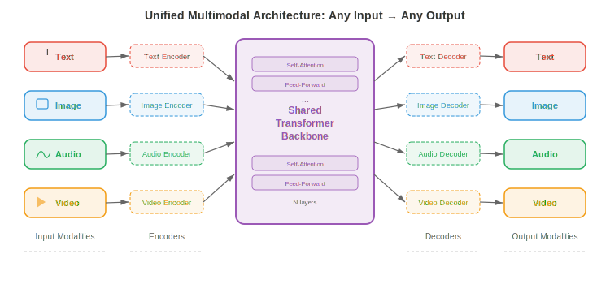
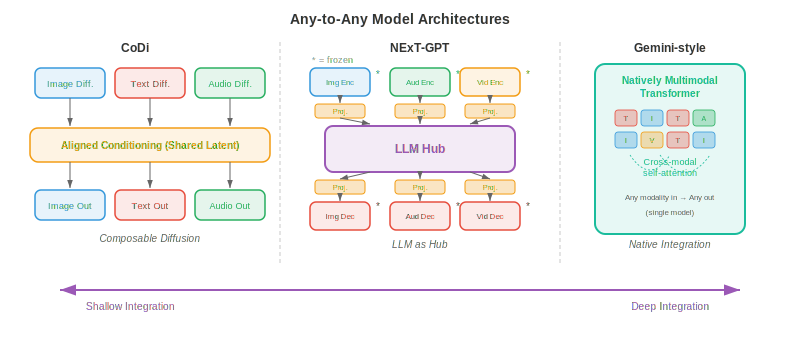
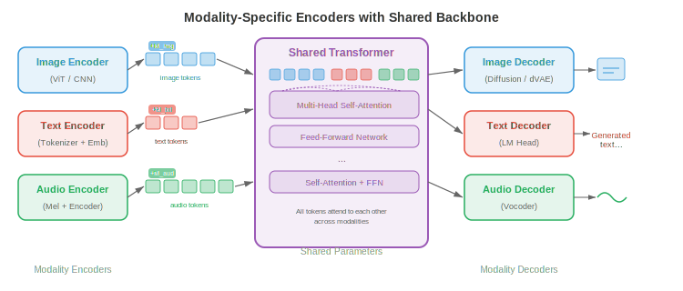
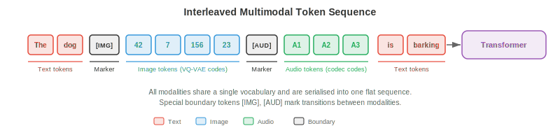
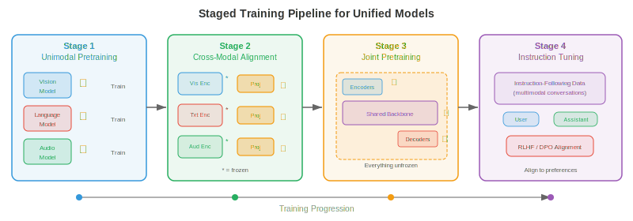
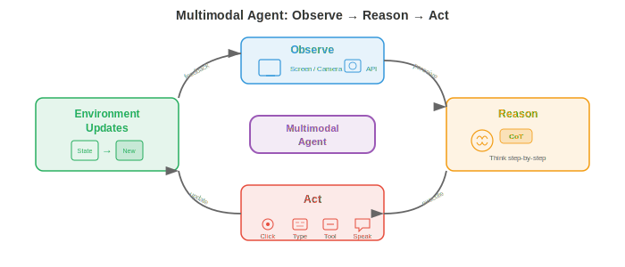
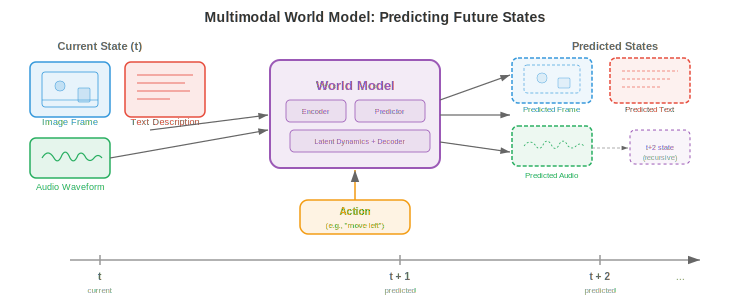

# 统一多模态架构

*统一多模态架构用单一系统取代分离的专用模型，该系统在文本、图像、音频与视频上读取、推理与生成。本文件涵盖 any-to-any 模型（CoDi、NExT-GPT）、原生多模态 LLM（Gemini、GPT-4o）、多模态 tokenisation 策略与统一的架构权衡。*

## 为何统一

- 想象一位会五种语言的翻译，能在句中无缝切换。早期多模态系统更像五位独立翻译坐在不同房间，各处理一种语言，通过墙上的缝传纸条。**unified multimodal architecture**（统一多模态架构）是那位通晓多语者：一个共享权重的模型，在单次前向内跨文本、图像、音频、视频乃至动作读取、书写与推理。

- 动机既实用又理论。实用上，为每个模态对（text-to-image、image-to-text、audio-to-text 等）维护独立专用模型导致组合爆炸：$k$ 种模态需多达 $k(k-1)$ 条有向流水线。统一模型把它们全折叠进单一系统。理论上，人类认知并非在孤立模块中处理视觉与语言；跨模态绑定发生得早且深，统一试图镜像此过程。

- 共享权重鼓励**跨模态迁移**。一个在文本中学到时间模式（主语在动词前、原因在结果前）的 transformer 可把同样的 attention 回路复用于视频时间模式（对象出现于移动前）或音频（起始在持续前）。这是第 7 章语言模型 fine-tuning 与第 8 章 ImageNet 预训练迁移学习的多模态对应。

- 形式上，设 $\mathcal{M} = \{m_1, m_2, \ldots, m_k\}$ 为模态集。统一模型定义单一参数化函数 $f_\theta$，把任意输入模态子集映射到任意输出模态子集：

$$f_\theta : \mathcal{P}(\mathcal{M}) \rightarrow \mathcal{P}(\mathcal{M})$$

- 其中 $\mathcal{P}(\mathcal{M})$ 是模态的幂集（所有子集）。关键约束是 $\theta$ 大体共享；只有薄的模态特定 adapter 层不同。



- 统一的承诺伴随根本张力：模态结构不同。文本是一维离散 token 序列。图像是二维连续像素网格。音频是一维连续 waveform，与文本时间尺度迥异。视频在图像上加时间轴。把这些迥异结构调和进单一 transformer 可消化的序列是本领域的核心工程挑战。

## Any-to-Any 模型

- 把 any-to-any 模型想成万能遥控器，能操作电视、空调与音响，全通过同一接口。**Any-to-any model** 是 AI 对应：接受任意模态组合作为输入、产出任意组合作为输出。

- **CoDi**（Composable Diffusion）通过训练模态特定 diffusion 模型再通过共享条件机制对齐其 latent 空间实现 any-to-any 生成。每模态有自己的 diffusion 过程（回忆本章第 04 篇文件的 diffusion 模型），但噪声预测网络条件于一个同时看到所有输入模态 embedding 的联合 cross-attention 层。这使 CoDi 能一次从文本 prompt 生成图像与匹配音频。

- **NExT-GPT** 采取不同架构方法。它通过轻量级 **projection layer** 把 LLM 骨干（"大脑"）连接到输入侧的模态特定 encoder 与输出侧的模态特定 decoder。输入 encoder（如 CLIP 的图像 encoder、CLAP 的音频 encoder）把每模态翻译进 LLM 的 embedding 空间。LLM 在组合 token 序列上推理并发出特殊"模态信号 token"，把信息路由到合适 decoder（如图像用 Stable Diffusion、音频用 AudioLDM）。只有 projection layer 被训练；LLM 与专用 encoder/decoder 保持冻结。

- **Gemini**（Google DeepMind）从预训练起就是原生多模态。与 NExT-GPT 的即插即用不同，Gemini 的 transformer 从零在文本、图像、音频与视频 token 的交错序列上训练。这意味着跨模态 attention 模式在预训练中有机发展，而非事后加装。模型文本用 SentencePiece tokenizer，视觉则学习类似本章第 03 篇文件讨论的 VQ 方法。

- **GPT-4o**（"o" 表 "omni"）代表又一种模式：所有模态共享同一 transformer 与同一 next-token prediction 目标的 end-to-end 模型。音频输入作为谱 token 处理、图像作为 patch token、文本作为子词 token，全部喂入单一序列。模型生成输出 token，由模态特定 head 解码。关键创新是低延迟，通过移除 GPT-4V 等早期系统依赖的 ASR、LLM、TTS 级联实现。



- 这些模型处于集成深度光谱：

    - **浅集成**（NExT-GPT）：冻结专家经训练 adapter 连接。构建快，跨模态推理有限。
    - **中集成**（CoDi）：跨模态特定生成器的共享条件化。对齐更好，仍模块化。
    - **深集成**（Gemini、GPT-4o）：单模型在所有模态上 end-to-end 训练。跨模态推理最丰富，训练最贵。

## 带共享骨干的模态特定 encoder 与 decoder

- 想象一家工厂有单一装配线（共享骨干），但有不同原料装载 dock（encoder）与不同成品出货部门（decoder）。每个 dock 针对其货物专门化，但一旦进入工厂，一切都沿同一传送带移动。

- 统一模型的主导架构模式用这三部分结构：

    - **Modality encoder** $E_m$ 把模态 $m$ 的原始输入转为 embedding 向量序列 $\mathbf{h}_1^m, \mathbf{h}_2^m, \ldots, \mathbf{h}_{n_m}^m$，各维 $d$。
    - **共享 transformer 骨干** $T_\theta$ 用 self-attention 处理所有输入模态的拼接或交错 embedding。
    - **Modality decoder** $D_m$ 把骨干输出 embedding 转回模态 $m$ 的原生格式（文本 token、图像像素、音频 waveform）。

- 文本 encoder 通常是 embedding 查找表 $E_\text{text}(w) = \mathbf{W}_e[w]$，其中 $w$ 是 token 索引，与第 7 章 transformer 所见相同。图像 encoder 常是 **Vision Transformer**（ViT），把图像切为 patch 并线性投射每个，如第 8 章所述。音频 encoder 计算 mel spectrogram 并用卷积前端或 Audio Spectrogram Transformer（AST）处理，如第 9 章讨论。

- 共享骨干是标准 transformer，跨所有模态 token 做 self-attention。给定拼接输入序列 $\mathbf{H} = [\mathbf{h}_1^{m_1}, \ldots, \mathbf{h}_{n_1}^{m_1}, \mathbf{h}_1^{m_2}, \ldots, \mathbf{h}_{n_2}^{m_2}]$，self-attention 允许每个 token 不论模态都关注其他任一 token：

$$\text{Attention}(\mathbf{Q}, \mathbf{K}, \mathbf{V}) = \text{softmax}\left(\frac{\mathbf{Q}\mathbf{K}^\top}{\sqrt{d_k}}\right)\mathbf{V}$$

- 这是第 7 章的 attention 公式，但现在 $\mathbf{Q}$、$\mathbf{K}$、$\mathbf{V}$ 含多模态 token。图像 patch token 可关注文本 token，无需独立 cross-attention 模块即可跨模态推理。

- 给每个 token 加 **modality embedding** 让骨干知道 token 来自哪个模态。这类似位置 embedding 但编码模态身份而非序列位置。可学习向量 $\mathbf{e}_m \in \mathbb{R}^d$ 加到模态 $m$ 的每个 token：

$$\tilde{\mathbf{h}}_i^m = \mathbf{h}_i^m + \mathbf{e}_m + \mathbf{p}_i$$

- 其中 $\mathbf{p}_i$ 是位置 $i$ 的位置 embedding。



## 多模态 tokenisation

- 想象你写一封含英文文本与手绘草图的信。你写一句话、画个图、再写一句引用该图、然后贴一段乐谱。信是单一线性流，交错不同"模态"。多模态 tokenisation 正是如此：把文本、图像、音频、视频转为单一扁平 token 序列，由 transformer 从左到右处理。

- 文本 tokenisation 已成熟：**byte-pair encoding**（BPE）或 SentencePiece 产生子词 token 词表，如第 7 章所述。挑战在把此思想扩展到连续模态。

- 图像有两种大方法。**离散**方法用 VQ-VAE 或 VQ-GAN（本章第 03 篇文件详述）把每张图像映射为 codebook 索引序列。若 codebook 有 $|\mathcal{C}|$ 项、图像编码为 $n$ 个码，则图像成为取自 $|\mathcal{C}|$ 大小词表的 $n$ 个离散 token，直接与文本词表兼容。**连续**方法用 ViT 或 CNN encoder 产生 $n$ 个连续 embedding 向量，线性投射到 transformer 的 embedding 维度。Gemini 与 GPT-4o 用连续方法变体；Parti、LlamaGen 等自回归图像生成器偏好离散路线。

- 音频通常先转为 mel spectrogram，再用神经音频 codec（如 EnCodec、SoundStream，产生层次离散 token）离散化或通过学习的 encoder 连续投射。如 AudioLM 把音频表示为来自多 codebook level 的离散 token 序列，再自回归建模。

- 视频 tokenisation 在图像 tokenisation 基础上还须压缩时间维。常见策略用 **3D VQ-VAE**（如 VideoGPT 或本章第 03 篇文件的 Cosmos Tokenizer），把时空 patch 量化为离散 token。时间压缩因子至关重要：24 fps 原始视频若无激进时间下采样每秒产生过多 token。

- 所有模态被 tokenize 后，它们被**交错**进单一序列，用特殊分隔 token 标记模态边界。典型格式：

```
[TEXT] The cat sits on a mat [/TEXT] [IMAGE] <img_tok_1> <img_tok_2> ... <img_tok_n> [/IMAGE] [AUDIO] <aud_tok_1> ... <aud_tok_m> [/AUDIO]
```

- transformer 再用其标准 causal（或双向）attention 机制处理整条混合序列。模态分隔 token 双重作用：告知模型模态边界并作为"池化点"，其表示概括每个模态段。



- 一个关键设计选择是 **token budget**（token 预算）。一张图像 tokenise 为 256 token、文本说明 50 token 意味着图像占 5 倍上下文窗口。模型须在分辨率（更多 token = 更多细节）与上下文长度（更多 token = 更高内存与算力成本）间平衡。**token merging**（逐步合并相似 token）与 **adaptive tokenisation**（简单区用更少 token、复杂区用更多）等技术帮助管理此权衡。

## 训练配方：分阶段预训练与联合 fine-tune

- 你不会在算术前教孩子微积分。同样，不能从随机初始化同时训练统一多模态模型在所有模态上并期望良好收敛。主导方法是 **staged training**（分阶段训练），模型在精心排序的阶段中逐步学习更复杂跨模态能力。

- **阶段 1：单模态预训练。** 每个模态 encoder 在大型单模态数据集上独立训练。文本骨干用标准语言建模目标（next-token prediction）在万亿文本 token 上预训练，如第 7 章。视觉 encoder 在图像分类或自监督目标（MAE、DINO）上预训练，如第 8 章。音频 encoder 在语音识别或音频分类数据上预训练，如第 9 章。此阶段产生强单模态特征提取器。

- **阶段 2：跨模态对齐。** 预训练 encoder 连接到共享骨干，模型在配对多模态数据（图文对、音频-转录对）上用 contrastive 或生成目标训练。此阶段 encoder 权重可冻结（以保留单模态知识）而只更新 projection layer 与骨干。这是 CLIP 式对齐（本章第 01 篇文件）被折叠进统一模型的阶段。

- **阶段 3：联合多模态预训练。** 所有参数（或大部分）解冻，模型在单模态与多模态数据混合上用单一 next-token prediction 目标跨所有模态 token 训练。loss 函数：

$$\mathcal{L} = -\sum_{t=1}^{T} \log p_\theta(x_t \mid x_{<t})$$

- 其中 $x_t$ 可为文本 token、图像 token 或音频 token。模型须不论模态预测下一 token，迫使它发展真正的跨模态理解。

- **阶段 4：指令微调与对齐。** 预训练模型在策划的指令跟随数据集上 fine-tune，含多模态指令（如"详细描述这张图"、"这段视频发出什么声音？"、"生成 X 的图像"）。此阶段常用**人类反馈强化学习**（RLHF）或直接偏好优化（DPO）把模型输出与人类偏好对齐。

- **模态特定 warm-up** 是阶段内防止模态坍缩的技术。若一个模态（通常是训练数据最多的文本）主导梯度信号，模型可能"遗忘"弱模态。warm-up 策略包括：

    - **梯度平衡**：缩放各模态梯度使其对参数更新贡献相等。
    - **数据比例调度**：逐步增加多模态数据相对单模态数据的比例。
    - **Loss 加权**：分配模态特定权重 $\lambda_m$ 使总 loss 为 $\mathcal{L} = \sum_m \lambda_m \mathcal{L}_m$，$\lambda_m$ 调以平衡跨模态学习率。



- **为何不跳过阶段？** 从零联合训练很诱人，但实践失败有几原因。其一，模型须同时学习低层特征（边缘检测、phoneme 识别）与高层跨模态推理，学习动态迥异。其二，跨模态数据分布极不均衡（万亿文本 token vs 十亿图像 token vs 亿级音频片段）。其三，优化景观高度非凸，分阶段训练提供课程引导模型走向更好盆地，类似第 6 章课程学习思想。

## 多模态 chain-of-thought 推理

- 解几何题时，你可能画图、标角、列方程、再逐步求解，而非直接从题面跳到答案。**Multimodal chain-of-thought**（CoT，多模态思维链）推理使模型能如此：在得出最终答案前生成可能含文本、视觉注释乃至生成图的中间推理步骤。

- 纯文本 CoT（第 7 章提示策略讨论）中，模型生成自然语言推理步骤序列。多模态 CoT 扩展此，允许中间步骤引用或生成视觉内容。例如，给定图表图像与问题"哪年销量最高？"，多模态 CoT 模型可能先描述图表（"图表显示 2018 到 2023 的销量..."），再识别相关视觉特征（"最高柱在 2021..."），最后输出答案（"2021"）。

- 形式上，设 $\mathbf{x}$ 为多模态输入，$y$ 为目标答案。标准预测模型 $p(y \mid \mathbf{x})$ 直接预测。chain-of-thought 引入中间推理 $\mathbf{r} = (r_1, r_2, \ldots, r_L)$ 并把预测分解为：

$$p(y \mid \mathbf{x}) = \sum_{\mathbf{r}} p(y \mid \mathbf{r}, \mathbf{x}) \cdot p(\mathbf{r} \mid \mathbf{x})$$

- 实践中该和由对推理链的贪心或 beam-search 解码近似。推理步骤 $r_i$ 可为文本 token、对图像区域的引用，乃至生成的视觉 token（如叠加在输入图像上的边界框注释）。

- **训练多模态 CoT** 通常涉及策划数据集，由人类标注者提供逐步多模态推理轨迹，再在这些轨迹上 fine-tune 模型。一些方法从更大教师模型蒸馏 CoT 能力：教师为大数据集生成推理轨迹，较小学生模型在输入与教师轨迹上训练。

- 多模态 CoT 对需**空间推理**（如"红球在蓝立方左边吗？"）、**对图的数学推理**（如几何题）与**多步视觉问答**（答案依赖组合图像多区域信息）的任务尤其强大。

## 多模态 agent

- 想象厨房里的机器人厨师。它看柜台上的食材（视觉）、读平板上的食谱（文本）、听定时器蜂鸣（音频），再物理地拿刀切洋葱（动作）。**Multimodal agent**（多模态 agent）是其数字版：通过多模态感知世界、推理该做什么、并采取基于感知的动作的模型。

- agent 循环遵循经典 **observe-reason-act**（观察-推理-行动）周期：

    1. **Observe**：agent 从环境接收多模态输入（截图、用户语音指令、视频流）。
    2. **Reason**：统一模型处理多模态输入，可能用 chain-of-thought 规划步骤序列。
    3. **Act**：模型输出动作（文本响应、工具调用、在坐标 $(x, y)$ 处点击、机器人电机命令）。

- **工具使用**是多模态 agent 的关键能力。模型被训练识别何时无法直接回答而须调用外部工具：计算器、代码解释器、网页浏览器或搜索引擎。模型作为输出 token 序列的一部分生成结构化工具调用（如 `search("current weather in London")`），系统执行调用，结果作为额外输入 token 回喂供模型处理。

- **Visual grounding** 把语言连接到图像或视频中的具体区域。当 agent 说"点击右上角蓝按钮"时，它须把短语"右上角蓝按钮"接地到像素坐标。架构上，这通过训练模型输出作为特殊 token 的边界框坐标，或让模型在图像上产生表示所指区域的热图实现。这把本章第 02 篇文件（vision language model）讨论的 grounding 与指代工作扩展到动作域。

- **Web agent** 如 WebVoyager 与 SeeAct 展示多模态 agent 导航网站。agent 接收网页截图，识别交互元素（按钮、文本框、链接），输出动作（点击、输入、滚动）以完成用户指定目标。关键挑战是巨大动作空间：典型网页有数百可能点击目标。



- **Embodied agent**（具身 agent）将其扩展到物理环境。带相机与麦克风的机器人接收视觉与音频输入，经统一模型处理，输出电机命令。PaLM-E（Google）等项目把机器人传感器数据直接嵌入语言模型的 token 序列，使机器人能遵循如"拿起碗附近的绿块"的指令——通过把指令接地于视觉观察并生成电机动作序列。

- agent 的训练配方在标准分阶段预训练之上加**强化学习**（RL）阶段。agent 与环境（模拟桌面、浏览器、机器人模拟器）交互，因任务完成获奖励，用 PPO 或 REINFORCE 等算法更新策略。奖励信号通常稀疏（任务成功 1，否则 0），使该优化具挑战性，严重依赖多模态预训练的强先验。

## 基准与评估

- 评估能看、听、读、动的模型需多样基准套件。无单一指标能捕捉多模态能力，故本领域依赖一组专门评估。

- **MMLU**（Massive Multitask Language Understanding）跨 57 学术科目测试知识。虽原为纯文本，它作基线：统一多模态模型获得视觉能力时不应丢失纯文本性能。多模态训练后 MMLU 下降提示灾难性遗忘。

- **MMBench** 跨 20 个细粒度能力维度评估 vision-language 理解，含属性识别、空间关系理解与 OCR。每题含图像与多选题。该基准系统测试模型是真正理解图像还是依赖纯文本捷径。

- **SEED-Bench** 提供覆盖图像与视频理解 12 个评估维度的 19,000 道多选题。它专门测试时间理解（某帧前后发生什么）与组合推理（组合多视觉属性）。

- **MM-Vet** 通过要求模型同时使用多技能评估集成多模态能力：识别、OCR、空间意识、语言生成与知识检索，全在单题中。

- **MathVista** 测试对视觉输入的数学推理：几何图、统计图、函数图与科学图。该基准专门针对多模态 chain-of-thought 能力。

- **音频-视觉基准** 如 AVQA（Audio-Visual Question Answering）测试模型能否推理所视与所闻的关系。例如："说话的人在左还是在右？"

- **Agent 基准** 如 WebArena、OSWorld、SWE-bench 在交互环境中评估任务完成。指标通常是成功率：agent 正确完成多少任务？这些基准特别具挑战性，因需长程规划与错误恢复。

- **整体评估**框架如 LMSYS Chatbot Arena 用人对人偏好判断。两模型看同一多模态输入，人类评委选哪个响应更好。由数千此类比较计算 Elo 评分，提供与整体模型质量相关性好的单一标量。

- 多模态评估的持续挑战是**数据污染**：这些模型在互联网规模数据上训练，基准图像与问题可能出现在训练集。谨慎去重与创建保留测试集是必不可少但不完美的保障。

## 世界模型

- 想象闭眼设想把玻璃杯推下桌边会发生什么。你"看到"它落下、"听到"破碎、"感到"这主意不好。你的大脑在运行 **world model**（世界模型）：环境的物理与因果结构的内部模拟，可跨多模态预测未来状态。

- AI 语境下，world model 是学习给定当前状态与动作预测下一状态的函数：

$$\hat{s}_{t+1} = g_\phi(s_t, a_t)$$

- 其中 $s_t$ 是当前状态表示（可含视觉、听觉与本体感觉信息），$a_t$ 是动作，$\hat{s}_{t+1}$ 是预测下一状态。状态 $s_t$ 生活在学习的 latent 空间而非原始像素空间，使预测问题可处理。

- **视频预测模型**如 Sora（OpenAI）与 Genie（Google DeepMind）代表迈向世界模型的重要一步。它们学习在文本 prompt 与/或动作序列条件化下生成时间连贯的视频帧。虽常被当作视频生成器讨论，底层能力更接近世界模拟：模型已内化足够物理（重力、碰撞、遮挡、流体动力学）以渲染可信未来。

- 与多模态架构的联系深远。只预测像素的世界模型受限；真正有用的世界模型跨模态预测。推玻璃杯时，world model 应预测视觉轨迹（杯落）、听觉事件（杯碎）与语义后果（地上有碎玻璃）。统一多模态架构是世界模型的天然候选，因它已在共享空间表示所有模态。

- 形式上，多模态 world model 优化：

$$\mathcal{L}_\text{world} = \mathbb{E}\left[\sum_{m \in \mathcal{M}} \lambda_m \| s_{t+1}^m - g_\phi^m(s_t, a_t) \|^2 \right]$$

- 其中 $s_{t+1}^m$ 是模态 $m$ 的真值下一状态表示，$g_\phi^m$ 是 world model 的模态特定预测 head。共享 latent 动态 $g_\phi$ 在联合多模态空间操作，模态特定 head 把预测解码到各模态原生格式。



- Yann LeCun 提出的 **JEPA**（Joint Embedding Predictive Architecture）提供了避免像素级预测陷阱的世界模型框架。JEPA 不预测原始像素（这浪费容量在无关细节如精确纹理），而在 embedding 空间预测。模型学习把观察映射到 embedding 的 encoder 与预测未来 embedding 的预测器：

$$\hat{\mathbf{z}}_{t+1} = h_\psi(\mathbf{z}_t, a_t), \quad \mathbf{z}_t = \text{Enc}(s_t)$$

- loss 比较 embedding 而非原始观察，对感知混叠（许多不同像素配置可能表示同一语义状态）更鲁棒。此方法对多模态 world model 尤有前景，因它自然在统一架构已提供的共享 embedding 空间操作。

- world model 有实用价值超越学术兴趣。**基于模型的强化学习**中，agent 用 world model 在采取行动前"想象"后果，大幅减少所需真实世界交互数（回忆第 11 章基于模型 RL 的讨论）。**自动驾驶**中，world model 预测不同转向决策下场景未来几秒如何演变。**机器人**中，world model 让机器人在执行前心理预演操作序列。

- world model 研究前沿正迈向实时运行、响应任意用户动作的**交互式 world model**，本质上成为完全从数据学习的通用模拟器。Genie 2（Google DeepMind）在 3D 环境展示：给定单张图像，它生成用户可探索的交互可控 3D 世界。world model 与统一多模态架构的收敛暗示一个未来：单一模型能跨所有模态感知、预测、模拟与行动。

## 编程任务（使用 CoLab 或 notebook）

**任务 1：构建最小多模态 token 交错器**

- 写一个函数，取文本字符串与一个"图像"（小二维数组）并把其 tokenize 表示带模态 embedding 交错进单一扁平序列。

```python
import jax
import jax.numpy as jnp

# Simulate multimodal tokenisation: text tokens + "image patch" tokens
def interleave_modalities(text_tokens, image_patches, embed_dim=32, key=jax.random.PRNGKey(0)):
    """Interleave text and image tokens with learned modality embeddings."""
    k1, k2, k3 = jax.random.split(key, 3)
    n_text = text_tokens.shape[0]
    n_img = image_patches.shape[0]
    # Random projection matrices (stand-ins for real encoders)
    W_text = jax.random.normal(k1, (text_tokens.shape[-1], embed_dim)) * 0.02
    W_img = jax.random.normal(k2, (image_patches.shape[-1], embed_dim)) * 0.02
    # Modality embeddings: one for text, one for image
    mod_emb = jax.random.normal(k3, (2, embed_dim)) * 0.02
    text_embs = text_tokens @ W_text + mod_emb[0]  # (n_text, embed_dim)
    img_embs = image_patches @ W_img + mod_emb[1]   # (n_img, embed_dim)
    # Interleave: [IMG] tokens first, then [TEXT] tokens (like LLaVA)
    combined = jnp.concatenate([img_embs, text_embs], axis=0)
    print(f"Combined sequence: {n_img} image + {n_text} text = {combined.shape[0]} tokens")
    return combined

# Try it: 5 text tokens (dim 16) and 4 image patches (dim 64)
text = jax.random.normal(jax.random.PRNGKey(1), (5, 16))
image = jax.random.normal(jax.random.PRNGKey(2), (4, 64))
seq = interleave_modalities(text, image)
# Experiment: change embed_dim, swap the interleaving order, add a third modality
```

**任务 2：可视化跨模态 attention 模式**

- 创建合成多模态序列并计算 self-attention 分数，看图像 token 如何关注文本 token，反之亦然。

```python
import jax
import jax.numpy as jnp
import matplotlib.pyplot as plt

def cross_modal_attention(n_text=6, n_img=4, d=32, key=jax.random.PRNGKey(42)):
    """Compute and visualise attention between text and image tokens."""
    k1, k2, k3 = jax.random.split(key, 3)
    # Simulate token embeddings for two modalities
    text_embs = jax.random.normal(k1, (n_text, d))
    img_embs = jax.random.normal(k2, (n_img, d))
    seq = jnp.concatenate([img_embs, text_embs], axis=0)  # (n_img+n_text, d)
    # Learned Q, K projections
    Wq = jax.random.normal(k3, (d, d)) * 0.1
    Wk = jax.random.normal(jax.random.PRNGKey(99), (d, d)) * 0.1
    Q, K = seq @ Wq, seq @ Wk
    scores = Q @ K.T / jnp.sqrt(d)
    attn = jax.nn.softmax(scores, axis=-1)
    # Plot
    labels = [f"img_{i}" for i in range(n_img)] + [f"txt_{i}" for i in range(n_text)]
    fig, ax = plt.subplots(figsize=(7, 6))
    ax.imshow(attn, cmap="viridis")
    ax.set_xticks(range(len(labels))); ax.set_xticklabels(labels, rotation=45, fontsize=8)
    ax.set_yticks(range(len(labels))); ax.set_yticklabels(labels, fontsize=8)
    ax.set_xlabel("Key (attended to)"); ax.set_ylabel("Query (attending from)")
    ax.set_title("Cross-modal self-attention map")
    plt.colorbar(ax.images[0], ax=ax, shrink=0.8)
    plt.tight_layout(); plt.show()

cross_modal_attention()
# Experiment: increase d, add a causal mask, observe how attention patterns change
```

**任务 3：用模态特定 loss 加权模拟分阶段训练**

- 演示模态特定 loss 权重如何影响玩具多模态训练循环。观察平衡 loss 如何防止单模态主导。

```python
import jax
import jax.numpy as jnp
import matplotlib.pyplot as plt

def staged_training_sim(steps=200, key=jax.random.PRNGKey(7)):
    """Simulate multimodal training with adjustable modality loss weights."""
    # Two 'modalities' with different loss scales (text loss ~10x larger than image loss)
    losses_text, losses_img = [], []
    param = jnp.array([0.0, 0.0])  # Shared param updated by both modality losses
    lr = 0.05
    # Try changing these weights to see the effect on convergence balance
    lambda_text, lambda_img = 1.0, 5.0  # upweight the weaker modality

    for step in range(steps):
        k1, k2, key = jax.random.split(key, 3)
        noise_t = jax.random.normal(k1, ()) * 0.3
        noise_i = jax.random.normal(k2, ()) * 0.1
        loss_t = (param[0] - 3.0) ** 2 + noise_t  # text target = 3.0
        loss_i = 0.1 * (param[1] - 1.0) ** 2 + noise_i  # image target = 1.0 (smaller scale)
        # Weighted combined gradient
        grad_t = lambda_text * 2 * (param[0] - 3.0)
        grad_i = lambda_img * 0.2 * (param[1] - 1.0)
        param = param - lr * jnp.array([grad_t, grad_i])
        losses_text.append(float(loss_t)); losses_img.append(float(loss_i))

    fig, ax = plt.subplots(figsize=(8, 4))
    ax.plot(losses_text, label=f"Text loss (weight={lambda_text})", alpha=0.7)
    ax.plot(losses_img, label=f"Image loss (weight={lambda_img})", alpha=0.7)
    ax.set_xlabel("Training step"); ax.set_ylabel("Loss"); ax.legend()
    ax.set_title("Modality loss balancing during staged training")
    plt.tight_layout(); plt.show()

staged_training_sim()
# Experiment: set lambda_img=1.0 and watch image loss converge much slower
```
