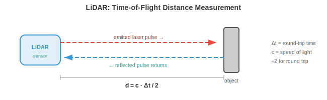
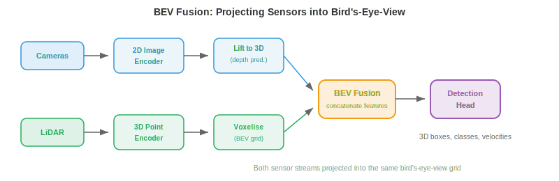
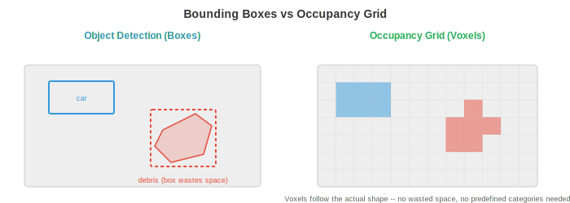

# Perception（感知）

*Perception（感知）是 autonomous system（自主系统）感知和解释物理世界的方式。本文件涵盖 sensor（传感器）模态、标定、sensor fusion（传感器融合）、3D 物体检测、深度估计、occupancy network（占用网络）、车道检测和语义建图，这是每个机器人、无人机和自动驾驶汽车所依赖的感知基础。*

- 对于人类而言，感知世界是毫不费力的：你看到一辆汽车驶来，听到它的引擎声，感受到脚下的地面，并瞬间在脑海中建立起周围环境的模型。Autonomous system 必须做同样的事情，只不过它使用电子 sensor 和算法来代替眼睛和耳朵。

- 根本挑战在于：sensor 给出的是原始数值（像素强度、点云、信号反射），系统必须把这些数值转化为结构化的理解："前方 12 米处有一个行人，正以 1.5 m/s 的速度向左移动。"这就是 perception 问题。

- 下游的一切（prediction、planning、control）都依赖于 perception。一辆 planning 完美但 perception 很差的自动驾驶汽车仍然会撞车。Perception 是瓶颈。

## Sensor（传感器）模态

- Autonomous system 使用多种 sensor 类型，每种都有不同的优势和失效模式。没有任何单一的 sensor 能独立胜任。


- **Camera（相机）**以高分辨率捕获密集的颜色信息。一张图像包含数百万个像素，每个像素记录 RGB 值（如我们在第 8 章所见）。Camera 价格低廉、重量轻，能提供丰富的纹理和颜色信息，这对读取标志、检测交通灯和识别物体至关重要。

- Camera 类型包括 **monocular（单目）**（单镜头，无原生深度信息）、**stereo（双目）**（两个镜头以基线分隔，通过视差获得深度，如第 8 章所述）和 **fisheye（鱼眼）**（超广角视场，180° 以上，存在严重径向畸变，用于环视泊车系统）。

- Camera 的主要弱点是在投影过程中丢失深度信息。3D 场景通过针孔相机模型被映射到 2D 图像平面（回顾第 8 章的内参矩阵 $K$）：

$$\begin{bmatrix} u \\ v \\ 1 \end{bmatrix} = \frac{1}{Z} K \begin{bmatrix} X \\ Y \\ Z \end{bmatrix}$$

- 除以 $Z$ 丢弃了绝对深度。不同大小、不同距离的物体可能产生相同的投影。从单张图像恢复深度是病态问题，这就是为什么需要 stereo camera 或学习型单目深度模型。

- Camera 在恶劣条件下也会失效：直射阳光造成眩光，黑暗降低信号，雨或雾使光发生散射。

- **LiDAR**（Light Detection and Ranging，激光雷达）发射激光脉冲并测量每个脉冲反射回来的时间。由于光速已知（$c \approx 3 \times 10^8$ m/s），到每个反射点的距离为：

$$d = \frac{c \cdot \Delta t}{2}$$



- 系数 2 是因为往返（去和回）。通过将激光在场景中扫描，LiDAR 构建 **point cloud（点云）**：一组 3D 坐标 $(x, y, z)$，通常带有强度（反射率）值。

- **Spinning LiDAR（机械旋转式 LiDAR）**（如 Velodyne）将激光阵列旋转 360° 以生成全景视图。典型单元每秒在 64–128 个垂直通道上生成 30 万个以上的点。其结果是场景的稀疏但几何上精确的 3D 表示。

- **Solid-state LiDAR（固态 LiDAR）**没有运动部件，改用光学相控阵或 MEMS 镜。这使它们更便宜、更紧凑、更可靠，但通常视场更窄（120° 对 360°）。

- LiDAR 提供精确的深度，但数据稀疏（远少于 camera 的"像素"），没有颜色信息，且价格昂贵。它在暴雨、大雪或尘土中性能也会下降，因为颗粒会散射激光脉冲。

- **Radar（雷达）**（Radio Detection and Ranging，无线电探测与测距）的工作原理与 LiDAR 相同的飞行时间，但使用无线电波（毫米波，车载通常为 77 GHz）。无线电波穿透雨、雾、尘、雪的能力远优于光，使 radar 成为最具天气鲁棒性的 sensor。

- Radar 还能通过多普勒效应直接测量 **velocity（速度）**。当物体朝向 sensor 移动时，反射波被压缩（频率升高）；当物体远离时，反射波被拉伸（频率降低）。速度为：

$$v = \frac{\Delta f \cdot c}{2 f_0}$$

- 其中 $\Delta f$ 是频移，$f_0$ 是发射频率。这无需任何跟踪或帧间计算即可给出瞬时径向速度。

- 代价是分辨率：radar 的角分辨率比 camera 或 LiDAR 粗糙得多，使其难以区分邻近物体或检测细节。它擅长在任何天气下检测远距离（200 米以上）的车辆。

- **Ultrasonic sensor（超声波传感器）**发射高频声波脉冲（40–70 kHz）并测量回波返回时间。它们在极短距离（0.2–5 米）内工作，主要用于泊车辅助。其物理原理与 LiDAR 相同，只是用声波代替光，因此 $d = \frac{v_{\text{sound}} \cdot \Delta t}{2}$，其中 $v_{\text{sound}} \approx 343$ m/s。

- **IMU**（Inertial Measurement Unit，惯性测量单元）包含加速度计和陀螺仪，分别测量线加速度和角速度。IMU 提供高频运动数据（通常 200–1000 Hz），填补较慢 sensor 更新之间的间隙。它不直接感知环境，而是跟踪机器人自身的运动，因此对航位推算和状态估计至关重要。

- IMU 受 **drift（漂移）**困扰：微小的测量误差随时间累积，导致估计位置偏离真实值。这就是为什么 IMU 几乎总是与其他 sensor（camera、GPS、LiDAR）融合使用，而非单独使用。

- **GNSS**（Global Navigation Satellite Systems，全球导航卫星系统，包括 GPS）通过对多颗卫星信号进行三角测量，提供地球表面上的绝对位置。标准 GPS 精度为 2–5 米，不足以支撑车道级驾驶。**RTK-GPS**（Real-Time Kinematic，实时动态差分）使用固定基站纠正误差，实现厘米级精度，但需要开阔的天空视野和基站基础设施。

## Sensor Calibration（传感器标定）

- 在 sensor 协同工作之前，必须进行标定（**calibration**）：每个 sensor 的测量必须关联到统一的坐标系。

- **Intrinsic calibration（内参标定）**确定 sensor 的内部参数。对于 camera，这指焦距、主点和畸变系数（如第 8 章所述）。对于 LiDAR，这指激光束之间的精确角度偏移。常用方法是 Zhang 的棋盘格标定：从多个角度观察已知平面图案来求解内参矩阵。

- **Extrinsic calibration（外参标定）**确定两个 sensor 之间的刚体变换（旋转 $R$ 和平移 $\mathbf{t}$）。如果 camera 和 LiDAR 安装在同一辆车上，外参标定就是找到把点从 LiDAR 坐标系映射到 camera 坐标系的 $4 \times 4$ 变换矩阵：

$$\mathbf{p}_{\text{cam}} = \begin{bmatrix} R & \mathbf{t} \\ \mathbf{0}^T & 1 \end{bmatrix} \mathbf{p}_{\text{lidar}}$$

- 这是齐次坐标下的仿射变换，正是我们在第 2 章研究的类型（线性变换）。如果这个矩阵出错，LiDAR 点会投影到错误的像素上，整个 fusion 流程就会崩溃。

- **Temporal calibration（时间标定）**同步 sensor 时钟。以 30 Hz 采样的 camera 和以 10 Hz 采样的 LiDAR 在不同时间戳产生数据。如果汽车以 30 m/s（高速公路速度）行驶，10 ms 的时间误差对应 30 cm 的空间误差。硬件触发（共享时钟脉冲）或软件同步（在时间戳间插值）是必不可少的。

## Sensor Fusion（传感器融合）

- 没有任何单一 sensor 能覆盖所有条件。Camera 能看到颜色和纹理但丢失深度。LiDAR 精确测量深度但稀疏且无色彩。Radar 在任何天气下都能工作但分辨率差。**Sensor fusion** 结合各自优势并补偿各自的弱点。

- **Early fusion（前融合）**（或数据级融合）在任何处理之前组合原始 sensor 数据。例如，把 LiDAR 点投影到 camera 图像上以创建 RGBD 表示（每像素颜色 + 深度），或为每个 LiDAR 点涂上它所投影到的 camera 像素的颜色。这保留了最多的信息，但需要精确标定且对错位敏感。

- **Late fusion（后融合）**（或决策级融合）让每个 sensor 独立通过自己的检测流程处理，然后合并最终输出（边界框、类别标签、置信度分数）。每个 sensor 投票，由 fusion 模块调和分歧。这更简单、更模块化，但每个流程无法利用其他 sensor 的原始数据。

- **Mid-level fusion（中层融合）**在中间特征表示上操作。每个 sensor 的原始数据被编码到一个学习型特征空间（使用 CNN 或 transformer），然后组合特征。这是现代系统中的主流方法，因为它让网络学习从每种模态中提取什么。



- **BEVFusion** 是一种代表性的中层融合架构。它把 camera 特征和 LiDAR 特征都投影到一个统一的 **bird's-eye-view (BEV)** 表示中，即场景的俯视网格。Camera 特征使用预测的深度分布"抬升"到 3D，然后溅射到 BEV 网格上。LiDAR 特征本身就是 3D 的，直接体素化到同一网格。融合后的 BEV 特征再由检测头处理。

- BEV 表示非常强大，因为它提供了一个统一的、公制比例的坐标系，在其中空间推理（距离、大小、重叠）非常直接。在 camera 图像中，一辆近处的自行车和一辆远处的卡车可能占据相同数量的像素。在 BEV 中，它们的真实大小和位置一目了然。

## 3D 物体检测

- Perception 的核心任务是在 3D 中检测物体：它们在哪里、有多大、是什么、朝向哪个方向？每个检测是一个 **3D 边界框**，包含位置 $(x, y, z)$、尺寸 $(l, w, h)$、朝向角 $\theta$、类别标签和置信度分数。

- **基于 LiDAR 的检测**直接在点云上操作。挑战在于点云是无序、不规则且密度变化的（近处物体有数千个点，远处物体只有少数几个）。回顾第 8 章，PointNet 通过共享 MLP 和置换不变的 aggregation（max pooling）处理这一问题。

- **PointPillars** 通过将地平面离散化为垂直柱（"pillar"）网格，把点云转换为结构化表示。每个 pillar 内的所有点由小型 PointNet 编码为定长特征向量。结果是一张 2D 伪图像，可由标准 2D CNN 主干处理，后接检测头（如第 8 章的 SSD 架构）。这既快又有效。

- **CenterPoint** 把物体作为点而非框来检测。它在 BEV 中预测物体中心的热图，然后在每个峰值处回归框属性（尺寸、高度、朝向、速度）。这是 CenterNet（第 8 章）的 3D 类比：anchor-free、训练期间无需 NMS，并通过跨帧关联中心点自然扩展到跟踪。

- **纯 camera 的 3D 检测**必须从 2D 图像推断深度，这在本质上更难。现代方法如 **BEVDet** 和 **BEVFormer** 使用 transformer 架构把 2D 图像特征"抬升"到 3D。BEVFormer 使用空间交叉注意力：BEV query 关注投影到每个 camera 图像上的特定 3D 参考点，从相关位置拉取特征。

- 基于 LiDAR 和基于 camera 的 3D 检测之间的精度差距正在迅速缩小，这得益于更好的深度估计、更大的模型和时序融合（使用多帧累积深度线索，类似于立体匹配但跨时间进行）。

## 深度估计

- 深度估计是为每个像素或点分配距离值的问题。

- **Stereo matching（立体匹配）**使用两个相距已知基线 $b$ 的 camera。同一个 3D 点在两幅图像中出现的位置略有不同（**disparity（视差）** $d$）。深度计算为（来自第 8 章）：

$$Z = \frac{f \cdot b}{d}$$

- 其中 $f$ 是焦距。挑战在于在两幅图像之间找到正确的对应关系，尤其是在无纹理区域、遮挡和重复图案中。现代立体网络（如 RAFT-Stereo）使用带相关体积的迭代精化。

- **Monocular depth estimation（单目深度估计）**从单张图像预测深度。由于这是病态问题（无穷多个 3D 场景可以产生同一张图像），网络必须学习统计先验："地面是平的"、"物体随距离变小"、"纹理梯度表示后退的表面"。

- **Depth Anything**（第 8 章介绍）通过在大量无标签数据集上自监督训练，然后在标注数据上微调，实现了强大的单目深度。关键洞察是尺度不变损失处理了固有的歧义：模型预测的是相对深度（顺序）而非绝对的米数。

- **LiDAR-camera 深度融合**把稀疏的 LiDAR 深度测量投影到 camera 图像上作为监督。网络学习"填补"稀疏点之间的空隙，生成结合 LiDAR 精度和 camera 分辨率的稠密深度图。

## Occupancy Network（占用网络）

- 传统 perception 输出一个边界框列表，每个检测物体一个。但真实世界中有许多东西不能整齐地装进框里：形状不规则的碎片、施工护栏、悬垂的树枝、部分坍塌的墙壁。



- **Occupancy network** 把场景表示为稠密的 3D 体素网格。每个体素（一小块空间立方体，如 0.2m × 0.2m × 0.2m）被分类为空闲、占用或未知，并可选地赋予语义标签（道路、人行道、车辆、植被等）。

- 这是从以物体为中心的 perception（"检测那辆车"）到以场景为中心的 perception（"3D 空间的哪些部分被占用？"）的转变。优势在于通用性：系统不需要预定义的物体类别列表即可避免与任意障碍物碰撞。

- 在架构上，occupancy network 接收 sensor 输入（camera、LiDAR 或两者），将其编码为 3D 特征体，并预测每个体素的标签。3D 特征体通常通过把 2D 特征抬升到 3D（类似于 BEV 构造但沿垂直方向延伸）来构建，并用 3D convolution 或稀疏 convolution 处理。

- **TPVFormer**（Tri-Perspective View，三视角视图）通过把 3D 体分解为三个正交平面（俯视、前视、侧视）来避免完整 3D attention 的立方代价。每个平面使用 2D attention，其特征在每个体素处组合。这让人联想到 SVD 把矩阵分解为更简单因子（第 2 章）：把困难的 3D 问题分解为可管理的 2D 部分。

- 输出的体素网格直接告诉 planner 哪些空间区域是安全可占用的、哪些不是，使其成为 perception 和 planning 之间的天然接口。

## 车道检测与道路拓扑

- 对于在结构化道路上行驶的车辆，理解 **lane（车道）几何**至关重要。系统必须知道车道在哪里、如何弯曲、在哪里合并和分叉、车辆在哪条车道中。

- 经典方法对检测到的车道标线拟合参数曲线。一个常用模型是三次多项式：

$$x(y) = a_0 + a_1 y + a_2 y^2 + a_3 y^3$$

- 其中 $y$ 是前方纵向距离，$x$ 是横向偏移。这是多项式近似（回顾第 3 章的 Taylor 级数），选择它是因为道路是平滑曲线，能被低次多项式很好地捕获。系数通过对检测到的车道点进行最小二乘回归来估计。

- 现代方法使用神经网络直接检测车道。**LaneNet** 把每条车道视为一个实例，使用 embedding 分支把属于同一车道的像素分组，然后进行曲线拟合。**GANet** 使用基于 graph 的方法，把车道拓扑表示为有向 graph，其中 node 是车道点，edge 编码连接性（哪些车道合并、分叉或在交叉口连接）。

- **Road topology（道路拓扑）**超越单条车道曲线，捕获完整结构：车道之间如何连接、哪些车道允许左转、高速公路入口匝道在哪里合并。这被建模为有向 graph，其中交叉口是 node，车道段是带有属性的 edge（限速、车道类型、转弯限制）。

- graph 结构对路径规划至关重要：planner 需要知道的不仅是"车道在哪里"，还有"哪条车道序列通向目的地"。

## 语义建图

- Perception 不止于在单帧中检测物体。随着时间推移，autonomous system 会构建 **semantic map（语义地图）**：一种持久、结构化的环境表示，跨多次观测累积信息。

- 最简单的情况下，semantic map 是一个 2D 网格（一个 **occupancy grid（占用网格）**），每个单元格存储被占用的概率。随着机器人移动并用 sensor 扫描，它使用贝叶斯更新来更新这些概率：

$$P(\text{occupied} \mid z_{1:t}) = \frac{P(z_t \mid \text{occupied}) \cdot P(\text{occupied} \mid z_{1:t-1})}{P(z_t)}$$

- 这是贝叶斯定理的应用（来自第 5 章）：每次新的测量 $z_t$ 更新对每个单元格的先验信念。常用 **log-odds（对数赔率）**表示来避免乘以许多小概率带来的数值问题：

$$l_t = l_{t-1} + \log \frac{P(z_t \mid \text{occupied})}{P(z_t \mid \text{free})}$$

- 加 log-odds 等价于乘概率（回顾 $\log(ab) = \log a + \log b$），且累加和自然地随时间累积证据。

- 更丰富的地图为每个单元格赋予语义标签（道路、人行道、建筑、植被）并可扩展到 3D。这些与 occupancy network 密切相关，但强调持久性和时间累积而非单帧预测。

- **SLAM**（Simultaneous Localisation and Mapping，同步定位与建图，第 8 章介绍）是在跟踪机器人在地图中位置的同时构建地图的算法。视觉惯性 SLAM 融合 camera 和 IMU 数据；LiDAR SLAM 使用点云配准。Perception 流程把检测和深度估计送入 SLAM 系统，由后者维护全局地图。

- 现代方法越来越多地使用神经隐式表示（如第 8 章的 NeRF）来构建可在任意 3D 点查询的稠密、照片级真实地图。这些神经地图把整个场景的压缩表示存储在网络权重中，使新视角合成和详细空间查询等任务成为可能。

## 编程任务（使用 CoLab 或 notebook）

1. 使用投影矩阵把 3D LiDAR 点投影到 2D camera 图像上。可视化哪些点落在图像范围内。
```python
import jax.numpy as jnp
import matplotlib.pyplot as plt

# Simulated LiDAR points in 3D (x=forward, y=left, z=up)
rng = jax.random.PRNGKey(0)
points_3d = jax.random.uniform(rng, (200, 3), minval=jnp.array([5, -10, -2]),
                                maxval=jnp.array([50, 10, 3]))

# Camera intrinsic matrix (focal length 500, image centre 320x240)
K = jnp.array([[500, 0, 320],
               [0, 500, 240],
               [0,   0,   1.0]])

# Extrinsic: LiDAR to camera (identity rotation, small translation)
R = jnp.eye(3)
t = jnp.array([0.0, 0.0, -0.5])

# Project: p_cam = K @ (R @ p_lidar + t)
p_cam = (R @ points_3d.T).T + t
p_img = (K @ p_cam.T).T
p_img = p_img[:, :2] / p_img[:, 2:3]  # divide by Z

# Filter points in front of camera and within image
mask = (p_cam[:, 2] > 0) & (p_img[:, 0] > 0) & (p_img[:, 0] < 640) & \
       (p_img[:, 1] > 0) & (p_img[:, 1] < 480)
depth = p_cam[mask, 2]

plt.figure(figsize=(8, 5))
plt.scatter(p_img[mask, 0], p_img[mask, 1], c=depth, cmap="viridis", s=5)
plt.colorbar(label="Depth (m)")
plt.xlim(0, 640); plt.ylim(480, 0)
plt.title("LiDAR points projected onto camera image")
plt.xlabel("u (pixels)"); plt.ylabel("v (pixels)")
plt.show()
```

2. 使用贝叶斯 log-odds 更新构建一个简单的 2D occupancy 网格。模拟一个 range sensor 扫描环境并观察地图的形成。
```python
import jax
import jax.numpy as jnp
import matplotlib.pyplot as plt

# Grid setup: 50x50 cells, each 0.2m
grid_size = 50
log_odds = jnp.zeros((grid_size, grid_size))

# Sensor model: log-odds update values
l_occ = 0.85   # confidence that a hit means occupied
l_free = -0.4  # confidence that a pass-through means free

# Simulated obstacle: a wall from (5,20) to (5,30) in grid coords
wall_y = jnp.arange(20, 30)

# Robot at (25, 25), scanning outward
robot = jnp.array([25, 25])

for angle_deg in range(0, 360, 5):
    angle = jnp.radians(angle_deg)
    direction = jnp.array([jnp.cos(angle), jnp.sin(angle)])

    for step in range(1, 25):
        cell = (robot + direction * step).astype(int)
        r, c = int(cell[0]), int(cell[1])
        if r < 0 or r >= grid_size or c < 0 or c >= grid_size:
            break

        # Check if this cell is the wall
        is_wall = (r == 5) and (c >= 20) and (c < 30)
        if is_wall:
            log_odds = log_odds.at[r, c].add(l_occ)
            break
        else:
            log_odds = log_odds.at[r, c].add(l_free)

# Convert log-odds to probability
prob = 1.0 / (1.0 + jnp.exp(-log_odds))

plt.figure(figsize=(6, 6))
plt.imshow(prob.T, origin="lower", cmap="RdYlGn_r", vmin=0, vmax=1)
plt.colorbar(label="P(occupied)")
plt.plot(25, 25, "b*", markersize=10, label="Robot")
plt.legend()
plt.title("2D Occupancy Grid from Bayesian Updates")
plt.show()
```

3. 利用视差从立体图像对中计算深度。模拟两个相机视角的 3D 点，计算视差并恢复深度。
```python
import jax
import jax.numpy as jnp

# Camera parameters
f = 500.0     # focal length in pixels
b = 0.12      # baseline in metres (12 cm)

# 3D points at known depths
depths_true = jnp.array([5.0, 10.0, 20.0, 50.0, 100.0])

# Disparity = f * b / Z
disparities = f * b / depths_true

# Recover depth from disparity
depths_recovered = f * b / disparities

for z, d, z_r in zip(depths_true, disparities, depths_recovered):
    print(f"True depth: {z:6.1f}m  Disparity: {d:6.2f}px  Recovered: {z_r:6.1f}m")

# Notice: disparity is inversely proportional to depth
# Close objects have large disparity, far objects have tiny disparity
# This is why stereo is most accurate at short range
```
