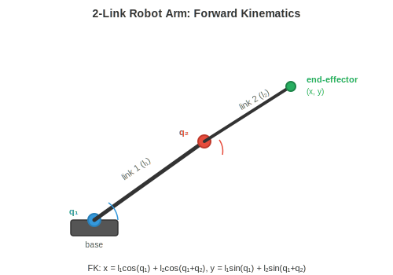
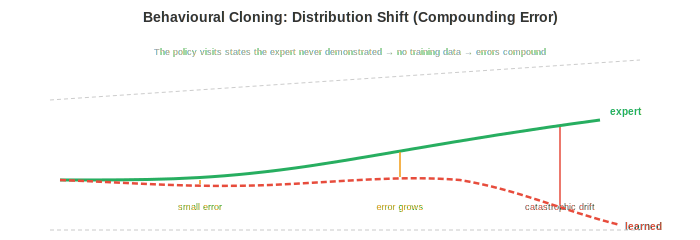
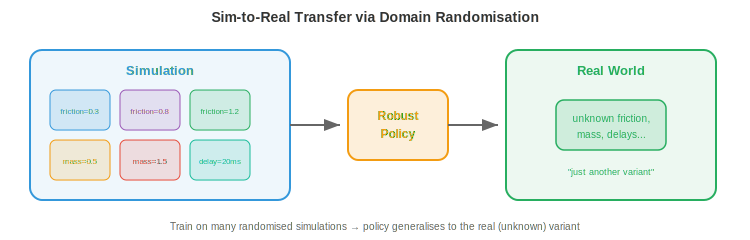

# Обучение роботов

*Обучение роботов преодолевает разрыв между алгоритмами и физическим действием. В этом файле рассматриваются кинематика, динамика, классическое управление, обучение с подражанием, перенос навыков из симуляции в реальность (sim-to-real transfer), манипуляции, локомоция и безопасность — методы, которые дают роботам способность двигаться, захватывать объекты, ходить и взаимодействовать с реальным миром.*

- В предыдущих главах мы изучали, как воспринимать мир (глава 8, глава 11 файл 1) и как обучаться на данных (глава 6). Но восприятия и обучения недостаточно. Робот должен **действовать**: двигать манипулятором, чтобы захватить чашку, ходить по неровной поверхности или перемещаться по складу. Именно здесь на помощь приходит обучение роботов.

- Главная сложность заключается в том, что физический мир непрерывен, многомерен, насыщен контактами и не прощает ошибок. Ошибка классификации в распознавании изображений — это неверная метка. Ошибка управления в робототехнике — это сломанный робот или упавший объект. Здесь ставки совсем другие.

## Кинематика роботов

- **Кинематика** описывает геометрию движения без учета сил. Манипулятор робота представляет собой цепь жестких звеньев, соединенных суставами (сочленениями). Каждый сустав имеет одну степень свободы (DoF): он либо вращается (вращательный сустав), либо сдвигается (поступательный сустав).

- **Конфигурация** робота — это набор всех углов суставов (или смещений) $\mathbf{q} = [q_1, q_2, \ldots, q_n]^T$. Этот вектор находится в **пространстве суставов** (или конфигурационном пространстве) — $n$-мерном пространстве, где каждая ось соответствует одному суставу. Манипулятор с 6 степенями свободы имеет 6-мерное конфигурационное пространство.



- **Прямая кинематика (FK)** вычисляет положение и ориентацию рабочего органа («кисти») по заданным углам суставов. Это функция $\mathbf{x} = f(\mathbf{q})$, которая отображает пространство суставов в **рабочее пространство** (3D-положение и ориентация рабочего органа, также называемое декартовым пространством).

- Каждый сустав описывается матрицей однородного преобразования $4 \times 4$ (вспомните аффинные преобразования из главы 2). **Конвенция Денавита — Хартенберга (DH)** параметризует каждый сустав четырьмя числами: длиной звена $a$, углом скручивания звена $\alpha$, смещением звена $d$ и углом сустава $\theta$. Преобразование для сустава $i$ имеет вид:

$$T_i = \begin{bmatrix} \cos\theta_i & -\sin\theta_i \cos\alpha_i & \sin\theta_i \sin\alpha_i & a_i \cos\theta_i \\ \sin\theta_i & \cos\theta_i \cos\alpha_i & -\cos\theta_i \sin\alpha_i & a_i \sin\theta_i \\ 0 & \sin\alpha_i & \cos\alpha_i & d_i \\ 0 & 0 & 0 & 1 \end{bmatrix}$$

- Полная прямая кинематика — это произведение всех преобразований суставов: $T_{0 \to n} = T_1 T_2 \cdots T_n$. Это матричное умножение, объединяющее преобразования в цепочку (глава 2): преобразование каждого сустава применяется последовательно, вращая и перемещая систему координат от основания к рабочему органу.

- **Обратная кинематика (IK)** — это обратная задача: по заданной желаемой позе рабочего органа $\mathbf{x}^*$ найти углы суставов $\mathbf{q}$ такие, что $f(\mathbf{q}) = \mathbf{x}^*$. Это гораздо сложнее, потому что:

    - Отображение нелинейно (включает синусы и косинусы).
    - Может существовать несколько решений (разные конфигурации манипулятора позволяют достичь одной и той же точки).
    - Решение может отсутствовать (цель находится вне зоны досягаемости).

- Аналитические решения существуют только для специфических геометрий роботов. Для роботов общего вида IK решается итеративно с использованием **якобиана**. Якобиан $J(\mathbf{q})$ связывает малые изменения углов суставов с малыми изменениями положения рабочего органа (вспомните якобиан из главы 3):

$$\dot{\mathbf{x}} = J(\mathbf{q}) \dot{\mathbf{q}}$$

- Чтобы переместить рабочий орган на небольшое расстояние $\Delta \mathbf{x}$, нам нужно $\Delta \mathbf{q} = J^{-1} \Delta \mathbf{x}$ (или $J^+ \Delta \mathbf{x}$ с использованием псевдообратной матрицы, когда $J$ не является квадратной). Это итерируется до тех пор, пока рабочий орган не достигнет цели, что по сути является методом Ньютона (глава 3), примененным к уравнению кинематики.

- Вблизи **сингулярностей** якобиан теряет ранг (некоторые столбцы становятся линейно зависимыми, как мы изучали в главе 2). Физически это означает, что робот теряет степень свободы: как бы быстро ни двигались суставы, рабочий орган не может перемещаться в определенных направлениях. Псевдообратная матрица стремится к бесконечности вблизи сингулярностей, поэтому вместо нее используется метод затухающих наименьших квадратов (добавление регуляризационного члена $\lambda^2 I$):

$$\Delta \mathbf{q} = J^T(JJ^T + \lambda^2 I)^{-1} \Delta \mathbf{x}$$

## Динамика и управление

- **Динамика** добавляет в картину силы. Уравнения движения манипулятора робота следуют **уравнению манипулятора**:

$$M(\mathbf{q})\ddot{\mathbf{q}} + C(\mathbf{q}, \dot{\mathbf{q}})\dot{\mathbf{q}} + \mathbf{g}(\mathbf{q}) = \boldsymbol{\tau}$$

- где $M(\mathbf{q})$ — матрица масс (инерции), $C(\mathbf{q}, \dot{\mathbf{q}})$ учитывает кориолисовы и центробежные эффекты, $\mathbf{g}(\mathbf{q})$ — вектор гравитации, а $\boldsymbol{\tau}$ — вектор моментов в суставах (управляющее воздействие). Это система дифференциальных уравнений второго порядка, по одному на каждый сустав.

- Матрица масс $M$ всегда симметрична и положительно определена (вспомните из главы 2, что положительно определенные матрицы гарантируют наличие единственного минимума; здесь это гарантирует, что система предсказуемо реагирует на приложенные моменты).

- **ПИД-регулятор** — это наиболее широко используемый контроллер в робототехнике. Для каждого сустава он вычисляет момент на основе ошибки $e(t) = q_{\text{desired}}(t) - q_{\text{actual}}(t)$:

$$\tau(t) = K_p e(t) + K_i \int_0^t e(s) \, ds + K_d \dot{e}(t)$$

- Три составляющие имеют интуитивно понятные роли:
    - **Пропорциональная** ($K_p$): корректирует пропорционально текущей ошибке. Больше ошибка — больше коррекция. Подобно пружине, тянущей сустав к цели.
    - **Интегральная** ($K_i$): накапливает прошлые ошибки для устранения установившегося смещения. Если сустав постоянно не доходит до цели, интегральный член накапливается и обеспечивает дополнительный толчок.
    - **Дифференциальная** ($K_d$): реагирует на скорость изменения ошибки, обеспечивая демпфирование. Она замедляет реакцию по мере уменьшения ошибки, предотвращая перерегулирование и осцилляции.


- Настройка $K_p, K_i, K_d$ — это поиск баланса: слишком большое $K_p$ вызывает осцилляции, слишком большое $K_d$ делает систему инертной, а слишком большое $K_i$ приводит к накоплению ошибки (интеграл неограниченно растет при длительной ошибке).

- **Модельное прогностическое управление (MPC)** работает с упреждением. На каждом временном шаге решается задача оптимизации: найти последовательность будущих управляющих воздействий, которая минимизирует целевую функцию (например, ошибку слежения + затраты на управление) на конечном горизонте с учетом модели динамики и ограничений. Применяется только первое управляющее воздействие, после чего процесс повторяется на следующем шаге.

$$\min_{\mathbf{u}_{0:T}} \sum_{t=0}^{T} \left[ \|\mathbf{x}_t - \mathbf{x}_t^*\|_Q^2 + \|\mathbf{u}_t\|_R^2 \right] \quad \text{subject to} \quad \mathbf{x}_{t+1} = f(\mathbf{x}_t, \mathbf{u}_t)$$

- Здесь $\|\mathbf{x}\|_Q^2 = \mathbf{x}^T Q \mathbf{x}$ — это взвешенная норма с использованием положительно определенной матрицы $Q$ (глава 2), что позволяет по-разному штрафовать ошибки по разным состояниям. MPC естественным образом учитывает ограничения (пределы углов в суставах, ограничения по крутящему моменту, обход препятствий), так как они явно включены в оптимизацию.

- **Импедансное управление** регулирует взаимосвязь между силой и движением, а не просто отслеживает жесткую траекторию. Вместо команды «перейти в позицию $x$» оно отдает команду «вести себя как пружинно-демпферная система с центром в $x$»:

$$F = K_s(\mathbf{x}^* - \mathbf{x}) + D(\dot{\mathbf{x}}^* - \dot{\mathbf{x}})$$

- где $K_s$ — матрица жесткости, а $D$ — матрица демпфирования. Это делает робота податливым: при контакте с препятствием он уступает, а не пытается проломить его силой. Импедансное управление необходимо для задач с частыми контактами, таких как вставка штифта в отверстие или передача предмета человеку.

## Обучение с подражанием (Imitation Learning)

- Вместо ручного проектирования контроллеров мы можем обучать стратегии управления на основе демонстраций. Человек выполняет задачу, робот наблюдает, а алгоритм обучения извлекает стратегию. Это называется **обучением с подражанием** (или обучением на демонстрациях).

- **Поведенческое клонирование (BC)** — самый простой подход: рассматривать демонстрации как датасет для обучения с учителем. Имея пары «наблюдение-действие» $\{(\mathbf{o}_t, \mathbf{a}_t)\}$ от эксперта, обучите стратегию $\pi_\theta(\mathbf{a} \mid \mathbf{o})$ предсказывать действие эксперта по наблюдению. Это стандартное обучение с учителем (глава 6): минимизируйте функцию потерь:

$$\mathcal{L}(\theta) = \mathbb{E}_{(\mathbf{o}, \mathbf{a}) \sim \mathcal{D}} \left[ \| \pi_\theta(\mathbf{o}) - \mathbf{a} \|^2 \right]$$



- Проблема заключается в **сдвиге распределения** (также называемом **проблемой накопления ошибок**). Во время обучения стратегия видит состояния эксперта. Во время работы (инференса) собственные малые ошибки стратегии уводят её в состояния, в которых эксперт никогда не был. Эти незнакомые состояния приводят к еще более плохим действиям, что ведет к еще более незнакомым состояниям, и ошибки быстро накапливаются.

- Представьте, что вы учитесь водить машину, наблюдая за идеальным водителем. Вы никогда не видели, что происходит после небольшого заноса, потому что эксперт никогда не заносился. В первый раз, когда вы слегка отклоняетесь от курса, вы понятия не имеете, как вернуться обратно.

- **DAgger** (Dataset Aggregation) решает эту проблему итеративно:
    1. Обучить стратегию на текущих данных.
    2. Запустить стратегию в среде, собирая новые состояния.
    3. Попросить эксперта разметить эти новые состояния правильными действиями.
    4. Добавить новые данные в датасет и переобучить модель.

- С каждой итерацией датасет охватывает состояния, в которых реально оказывается обученная стратегия, а не только траекторию эксперта. Стратегия улучшается, потому что она видела свои ошибки и научилась их исправлять.

- **Action Chunking with Transformers (ACT)** — это современный подход, при котором стратегия предсказывает последовательность будущих действий («чанк»), а не одно действие за раз. Это реализуется с помощью условного VAE с трансформером в основе. Предсказание чанков действий более устойчиво, так как оно учитывает временные корреляции: плавность движения при достижении цели кодируется в чанке, вместо того чтобы полагаться на авторегрессионные предсказания по одному шагу, которые могут привести к дрейфу.

- **Диффузионная стратегия (Diffusion Policy)** применяет диффузионные модели (глава 8) к генерации действий. Вместо предсказания одного действия она моделирует полное распределение возможных действий, обусловленное наблюдением. Начиная с шума, модель итеративно проводит денойзинг для получения последовательности действий. Это естественным образом решает проблему **мультимодальности**: когда существует несколько версий выполнения задачи (дотянуться слева или справа), диффузионная модель может представить оба варианта, тогда как регрессионная стратегия усреднила бы их (и потянулась бы куда-то посередине, что может быть неверным решением).

## Перенос обучения из симуляции в реальность (Sim-to-Real Transfer)

- Обучение роботов в реальном мире — это дорого, медленно и опасно. Робот, обучающийся захвату методом проб и ошибок, может совершить тысячи попыток, ломая объекты и самого себя. **Симуляция** предлагает неограниченный, безопасный и быстрый опыт. Но симуляторы несовершенны: физика аппроксимируется, визуализация синтетическая, контакты упрощены.

- **Разрыв между симуляцией и реальностью (sim-to-real gap)** — это разница между результатами в симуляции и в реальности. Стратегия, которая идеально работает в симуляции, может полностью провалиться на реальном роботе, так как она переобучилась на специфических деталях симулятора.



- **Рандомизация домена** борется с этим путем обучения в широком диапазоне настроек симулятора. Вместо одной симуляции используйте тысячи с рандомизированными параметрами:
    - Физика: коэффициенты трения, масса, демпфирование
    - Визуализация: освещение, текстуры, цвета, положение камеры
    - Динамика: задержки двигателей, уровни шума

- Идея в том, что если стратегия работает во всех этих вариациях, то реальный мир — это просто «еще одна вариация» внутри распределения. Стратегия изучает признаки, инвариантные к рандомизированным свойствам, и эти инвариантные признаки успешно переносятся в реальность.

- **Идентификация системы** использует противоположный подход: вместо рандомизации всего подряд, параметры реальной системы тщательно измеряются, а симулятор настраивается так, чтобы соответствовать им. Это обеспечивает более точную симуляцию, но делает её хрупкой (любой немоделируемый эффект приводит к разрыву между симуляцией и реальностью).

- На практике лучшие результаты дает комбинация обоих подходов: идентификация системы для того, чтобы сделать симулятор достаточно точным, а затем рандомизация домена для учета оставшейся неопределенности.

- **Перенос с симуляции на реальность через дообучение (fine-tuning)** предполагает обучение преимущественно в симуляции с последующим небольшим дообучением на реальных данных. Симуляция обеспечивает хорошую инициализацию, а реальные данные корректируют специфические для симулятора смещения. Это требует гораздо меньше реальных данных, чем обучение с нуля.

## Мировые модели в робототехнике

- Все упомянутые выше подходы обучения с подкреплением (RL) и обучения с учителем на демонстрациях являются **модельно-свободными (model-free)**: агент учится действовать через прямое взаимодействие (или демонстрации), не моделируя явно принципы работы окружающего мира. Альтернативой является **модельно-ориентированное (model-based)** обучение: сначала изучается модель динамики среды, а затем эта модель используется для планирования или генерации синтетического опыта.

- **Мировая модель** изучает функцию переходов $p(s_{t+1} \mid s_t, a_t)$: по текущему состоянию и действию предсказывается следующее состояние (как было представлено в главе 10). В робототехнике это означает предсказание того, что произойдет, если робот совершит определенное действие: «если я толкну этот блок влево, он проскользнет на 3 см, а стоящая за ним чашка опрокинется».

- Преимущество заключается в **выборочной эффективности (sample efficiency)**. Взаимодействие робота с реальным миром стоит дорого. Если робот может выучить мировую модель на небольшом количестве реальных данных, он сможет «вообразить» тысячи траекторий, проигрывая модель в уме, планируя и улучшая свою стратегию (policy) без физического взаимодействия с миром. Это аналогично тому, как шахматист просчитывает ходы, симулируя их в уме.

- **DreamerV3** — это универсальный модельно-ориентированный RL-агент. Он совместно обучается по трем компонентам:
    - **Репрезентативная модель**, которая кодирует наблюдения в компактное латентное состояние.
    - **Модель переходов** (мировая модель), которая предсказывает следующее латентное состояние на основе текущего состояния и действия.
    - **Модель вознаграждения**, которая предсказывает вознаграждение на основе латентного состояния.

- Затем агент «мечтает», проигрывая модель переходов на много шагов вперед в латентном пространстве, обучает стратегию на этих воображаемых траекториях и переносит её в реальную среду. Ключевая инновация заключается в том, что все «воображение» происходит в латентном пространстве (компактных выученных представлениях), а не в пространстве пикселей, что делает это вычислительно осуществимым.

$$\hat{s}_{t+1} = f_\theta(s_t, a_t), \quad \hat{r}_t = g_\theta(s_t)$$

- Модель переходов $f_\theta$ и модель вознаграждения $g_\theta$ обучаются на реальном опыте, а стратегия обучается на воображаемых прогонах. Это отделяет сбор данных от оптимизации стратегии.

- Для манипуляций роботов мировые модели позволяют проводить **мысленную репетицию**. Перед попыткой захвата робот может симулировать несколько подходов в своей выученной модели и выбрать тот, который с наибольшей вероятностью приведет к успеху. Это особенно ценно для задач с частыми контактами, где метод проб и ошибок в реальном мире медлен и рискован.

- Мировые модели также естественным образом связаны с **переносом с симуляции на реальность**: мировая модель, обученная на реальных данных, по сути является выученным симулятором, который автоматически учитывает физику реального мира, полностью обходя проблему разрыва между симуляцией и реальностью. Такая модель может быть менее точной, чем созданный вручную симулятор для хорошо изученных сценариев, но она учитывает эффекты (трение, деформацию, динамику контактов), которые часто неверно передаются в рукотворных симуляторах.

- **JEPA** (Joint Embedding Predictive Architecture, представлена в главе 10) предлагает альтернативу предсказанию на уровне пикселей. Вместо предсказания точных будущих наблюдений, JEPA делает предсказания в пространстве эмбеддингов: «латентное представление следующего состояния будет близко к этому вектору». Это позволяет избежать сложности предсказания идеально точного будущего (что является одновременно ненужным и вычислительно затратным) и сосредоточиться на предсказании аспектов будущего, важных для принятия решений.

- Ограничением мировых моделей является **накопление ошибки предсказания**. Небольшие неточности в модели переходов накапливаются при длинных прогонах, из-за чего воображаемые траектории отклоняются от реальности. Способы смягчения включают ограничение горизонта воображения, использование ансамблей моделей (использование неопределенности для обнаружения моментов, когда предсказания становятся ненадежными) и периодическую корректировку модели свежими реальными данными.

## Манипуляции

- **Манипуляция** — это искусство использования рабочего органа робота (end-effector) для взаимодействия с объектами: захват, перемещение, толкание, вставка, сборка.

- **Захват (grasping)** — это фундаментальный навык манипуляции. Цель состоит в том, чтобы найти устойчивую позу захвата: положение и ориентацию захватного устройства, которые позволят надежно удерживать объект.

- **Аналитическое планирование захвата** использует физику. Захват устойчив, если контактные силы могут противостоять внешним воздействиям (силам и моментам). Для параллельного захвата простейшим критерием является условие **силового замыкания (force closure)**: нормали к точкам контакта должны покрывать все направления сил, чтобы захват мог противостоять любому возмущению. Это включает проверку ранга матрицы захвата, что является прямым применением концепции ранга из главы 2.

- **Захват на основе данных** учится предсказывать успешность захвата по сенсорным данным. Получая изображение глубины объектов на столе, нейронная сеть предсказывает оценку качества захвата для каждой возможной позы захватного устройства. **GraspNet** и аналогичные архитектуры используют энкодеры облаков точек (в стиле PointNet, глава 8) для предсказания 6-DoF поз захвата (положение + ориентация) с оценками уверенности.

- **Ловкая манипуляция (dexterous manipulation)** выходит за рамки простого захвата и перемещения. Многопальцевая рука имеет более 20 степеней свободы и может выполнять такие задачи, как вращение предмета в руке (вращение ручки между пальцами), использование инструментов и тонкая сборка. Пространство состояний здесь огромно, а контакты сложны, что делает эту задачу одной из самых трудных в робототехнике.

- Обучение ловкой манипуляции часто использует обучение с подкреплением (глава 6) в симуляции с интенсивной рандомизацией домена. Работа OpenAI по сборке кубика Рубика с помощью руки Shadow использовала PPO-стратегии, обученные в симуляции с рандомизированной физикой, что позволило успешно перенести навык на реальную роботизированную руку.

- **Задачи с интенсивным контактом**, такие как вставка штифта в отверстие или протирка поверхности, требуют от робота поддержания контролируемого контакта с окружающей средой. Такие задачи требуют измерения сил и податливого управления (импедансного управления), и их сложно точно симулировать, поскольку физика контактов, как известно, трудно поддается моделированию.

## Локомоция

- Локомоция — это перемещение тела робота в пространстве: ходьба, бег, лазание, плавание. Ключевое отличие от манипуляции заключается в том, что робот должен сохранять равновесие во время движения, а точки контакта с землей меняются со временем.

- **Шагающая локомоция** сложна, так как она по своей природе нестабильна. Двуногий робот (гуманоид), стоящий на одной ноге во время шага, подобен перевернутому маятнику. Центр масс должен оставаться над опорным многоугольником (выпуклой оболочкой стоп, контактирующих с землей), иначе робот упадет.

- **Точка нулевого момента (ZMP)** — это точка на земле, в которой суммарный момент от гравитации и сил инерции равен нулю. Если ZMP остается внутри опорного многоугольника, робот не опрокинется. Традиционные контроллеры гуманоидов (например, ASIMO от Honda) планируют траектории так, чтобы удерживать ZMP в допустимых пределах.

- **Генераторы центральных паттернов (CPG)** — это осцилляторные контроллеры, вдохновленные биологией. Животные генерируют ритмические паттерны локомоции (ходьба, рысь, галоп) с помощью нейронных цепей в спинном мозге без постоянного участия головного мозга. Модели CPG используют связанные дифференциальные уравнения:

$$\dot{\phi}_i = \omega_i + \sum_j w_{ij} \sin(\phi_j - \phi_i - \psi_{ij})$$

- где $\phi_i$ — фаза осциллятора $i$, $\omega_i$ — собственная частота, $w_{ij}$ — сила связи, а $\psi_{ij}$ — желаемый фазовый сдвиг. Различные фазовые соотношения создают разные походки: все ноги синхронно (прыжки), чередующиеся пары (рысь), последовательные (ходьба). Синусоидальная связь естественным образом синхронизирует осцилляторы, что аналогично тому, как ряды Фурье (глава 3) разлагают движение на частотные компоненты.

- **Обучение с подкреплением для локомоции** стало доминирующим подходом для маневренных четвероногих и гуманоидных роботов. Робот изучает стратегию $\pi(\mathbf{a} \mid \mathbf{o})$ методом проб и ошибок в симуляции (глава 6), получая награды за скорость движения вперед, стабильность и энергоэффективность, а также штрафы за падения, нарушение ограничений суставов и резкие движения.

- Ключевой вывод из недавних работ (например, Agility Robotics, Boston Dynamics и академических лабораторий) заключается в том, что стратегии локомоции, обученные с помощью RL, гораздо более устойчивы, чем контроллеры, разработанные вручную. Они естественным образом учатся восстанавливаться после толчков, адаптироваться к изменениям рельефа и справляться с ситуациями, которые не мог предусмотреть ни один инженер. Обучение обычно использует PPO (глава 6) с рандомизацией домена.

- **Четвероногие роботы** (такие как Boston Dynamics Spot или Unitree Go2) стали «рабочими лошадками» шагающей робототехники. Четыре ноги обеспечивают естественную стабильность (трипод из трех ног всегда может поддерживать тело, пока одна нога перемещается). RL-стратегии для четвероногих достигают впечатляющих результатов: бег со скоростью более 3 м/с, подъем по лестнице, навигация по каменистой местности и восстановление после пинков.

- **Локомоция гуманоидов** сложнее, так как у двуногих меньше опорный многоугольник и выше центр масс. Последние достижения (Tesla Optimus, Figure, Unitree H1) используют RL, обученное в симуляции с тщательным формированием функции награды. Гуманоид должен научиться не просто ходить, но и координировать взмахи рук для баланса, перемещаться по неровным поверхностям и восстанавливаться после возмущений.

## Безопасность в обучении роботов

- Робот, который исследует среду случайным образом для обучения (как в RL), может повредить себя, окружающую среду или находящихся рядом людей. **Безопасное обучение роботов** ограничивает исследование, чтобы избежать катастрофических последствий.

- **Обучение с подкреплением с ограничениями (Constrained RL)** добавляет ограничения безопасности в MDP (глава 6). Цель становится следующей: максимизировать награду при условии $J_c(\pi) \leq d$, где $J_c$ — ожидаемая совокупная стоимость (например, события столкновений), а $d$ — максимально допустимая стоимость. Алгоритмы, такие как Constrained Policy Optimisation (CPO), расширяют PPO для работы с этими ограничениями.

- **Конверты безопасности (safety envelopes)** определяют жесткие границы, которые робот никогда не должен пересекать, независимо от того, что говорит обученная стратегия. Контроллер безопасности отслеживает состояние робота и перехватывает управление у обученной стратегии, когда ограничение вот-вот будет нарушено (например, приближение к пределу сустава, движение слишком быстро рядом с человеком или превышение порога силы). Это многоуровневая архитектура: алгоритм обучения отвечает за производительность, а уровень безопасности — за ограничения.

- **Планирование с учетом рисков** явно моделирует неопределенность в окружающей среде и оценке состояния самого робота. Вместо планирования наиболее вероятного исхода оно планирует худший случай в пределах доверительного интервала. Это связано с концепцией числа обусловленности (глава 2): хорошо обусловленная система устойчива к возмущениям, и планирование с учетом рисков ищет стратегии управления, которые остаются безопасными при возмущениях.

## Задачи по программированию (используйте CoLab или ноутбук)

1. Реализуйте прямую кинематику для простого плоского робота-манипулятора с 2 звеньями. Вычислите и визуализируйте положение рабочего органа для различных углов суставов.
```python
import jax.numpy as jnp
import matplotlib.pyplot as plt

def forward_kinematics(q1, q2, l1=1.0, l2=0.8):
    """Compute joint and end-effector positions for a 2-link arm."""
    x1 = l1 * jnp.cos(q1)
    y1 = l1 * jnp.sin(q1)
    x2 = x1 + l2 * jnp.cos(q1 + q2)
    y2 = y1 + l2 * jnp.sin(q1 + q2)
    return jnp.array([0, x1, x2]), jnp.array([0, y1, y2])

fig, ax = plt.subplots(figsize=(6, 6))
configs = [(0.5, 0.3), (1.0, -0.5), (1.5, 1.0), (2.0, -1.5)]
colors = ["#e74c3c", "#3498db", "#27ae60", "#9b59b6"]

for (q1, q2), c in zip(configs, colors):
    xs, ys = forward_kinematics(q1, q2)
    ax.plot(xs, ys, "o-", color=c, linewidth=2, markersize=6,
            label=f"q=({q1:.1f}, {q2:.1f})")

ax.set_xlim(-2, 2); ax.set_ylim(-2, 2)
ax.set_aspect("equal"); ax.grid(True); ax.legend()
ax.set_title("2-Link Robot Arm: Forward Kinematics")
plt.show()
```

2. Реализуйте обратную кинематику, используя псевдообратную матрицу Якоби. Начните со случайной конфигурации и итеративно перемещайте рабочий орган к цели.
```python
import jax
import jax.numpy as jnp
import matplotlib.pyplot as plt

l1, l2 = 1.0, 0.8

def end_effector(q):
    x = l1 * jnp.cos(q[0]) + l2 * jnp.cos(q[0] + q[1])
    y = l1 * jnp.sin(q[0]) + l2 * jnp.sin(q[0] + q[1])
    return jnp.array([x, y])

jacobian_fn = jax.jacobian(end_effector)

target = jnp.array([0.5, 1.2])
q = jnp.array([0.1, 0.1])
trajectory = [end_effector(q)]

for _ in range(50):
    pos = end_effector(q)
    error = target - pos
    if jnp.linalg.norm(error) < 1e-4:
        break
    J = jacobian_fn(q)
    # Damped pseudo-inverse to handle near-singularities
    dq = J.T @ jnp.linalg.solve(J @ J.T + 0.01 * jnp.eye(2), error)
    q = q + dq
    trajectory.append(end_effector(q))

traj = jnp.stack(trajectory)
plt.plot(traj[:, 0], traj[:, 1], "b.-", label="end-effector path")
plt.plot(*target, "r*", markersize=15, label="target")
plt.gca().set_aspect("equal"); plt.grid(True); plt.legend()
plt.title(f"IK converged in {len(trajectory)-1} steps")
plt.show()
```

3. Смоделируйте простой PID-регулятор, отслеживающий заданную траекторию сустава. Пронаблюдайте эффект от настройки коэффициентов.

```python
import jax.numpy as jnp
import matplotlib.pyplot as plt

# Desired trajectory: smooth sinusoidal motion
dt = 0.01
t = jnp.arange(0, 5, dt)
q_desired = jnp.sin(2 * t)

# Simulate second-order dynamics: m * q_ddot + b * q_dot = tau
m, b_damp = 1.0, 0.5

for Kp, Kd, Ki, label in [(10, 5, 0, "PD only"), (10, 5, 2, "PID"), (50, 10, 2, "Aggressive PID")]:
    q, q_dot, integral = 0.0, 0.0, 0.0
    qs = []
    for i in range(len(t)):
        error = q_desired[i] - q
        integral += error * dt
        d_error = -q_dot  # derivative of error (desired velocity is known but simplified here)
        tau = Kp * error + Kd * d_error + Ki * integral
        q_ddot = (tau - b_damp * q_dot) / m
        q_dot += q_ddot * dt
        q += q_dot * dt
        qs.append(float(q))

    plt.plot(t, qs, label=label)

plt.plot(t, q_desired, "k--", label="desired", linewidth=2)
plt.xlabel("Time (s)"); plt.ylabel("Joint angle")
plt.legend(); plt.title("PID Controller Tracking")
plt.show()
```
